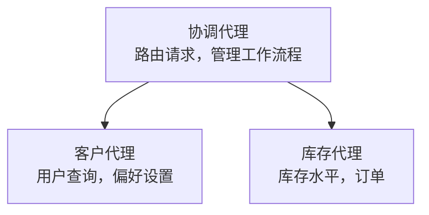

# 第5章：多智能体AI解决方案

**📚 课程**：[AZD入门](../../README.md) | **⏱️ 时长**：2-3小时 | **⭐ 复杂度**：高级

---

## 概述

本章涵盖高级多智能体架构模式、智能体编排以及复杂场景下的生产就绪AI部署。

> 于2026年7月使用 `azd 1.27.1` 验证。

## 学习目标

通过完成本章，您将能够：
- 理解多智能体架构模式
- 部署协调的AI智能体系统
- 实现智能体间通信
- 构建生产就绪的多智能体解决方案

---

## 📚 课程列表

| # | 课程 | 描述 | 时间 |
|---|--------|-------------|------|
| 1 | [多智能体基础](multi-agent-basics.md) | 实操：使用 `azd up` 部署可用多智能体应用 | 45 分钟 |
| 2 | [协调模式](../chapter-06-pre-deployment/coordination-patterns.md) | 智能体编排策略（续于第6章） | 30 分钟 |
| 3 | [ARM 模板部署](../../examples/retail-multiagent-arm-template/README.md) | 一键部署示例 | 30 分钟 |

> **从课程1开始。** 它是本章唯一完全实操、可部署的课程。课程2位于第6章（与预部署规划共享），[零售多智能体解决方案](../../examples/retail-scenario.md) 是架构蓝图——设计参考，而非一键模板。

---

## 🚀 快速开始

```bash
# 选项 1：从模板部署
azd init --template agent-openai-python-prompty
azd up

# 选项 2：从代理清单部署（需要 azure.ai.agents 扩展）
azd extension install azure.ai.agents
azd ai agent init -m agent-manifest.yaml
azd up
```

> **使用哪种方式？** 使用 `azd init --template` 从工作示例开始。拥有自己的智能体清单时使用 `azd ai agent init`。完整细节参见 [AZD AI CLI 参考](../chapter-08-production/production-ai-practices.md#azd-ai-cli-commands-and-extensions)。

---

## 🤖 多智能体架构



---

## 🎯 重点解决方案：零售多智能体

[零售多智能体解决方案](../../examples/retail-scenario.md) 展示了：

- <strong>客户智能体</strong>：处理用户交互和偏好
- <strong>库存智能体</strong>：管理库存和订单处理
- <strong>编排者</strong>：协调各智能体间工作
- <strong>共享内存</strong>：跨智能体上下文管理

### 使用的服务

| 服务 | 目的 |
|---------|---------|
| Microsoft Foundry Models | 语言理解 |
| Azure AI Search | 产品目录 |
| Cosmos DB | 智能体状态和内存 |
| Container Apps | 智能体托管 |
| Application Insights | 监控 |

---

## 🔗 导航

| 方向 | 章节 |
|-----------|---------|
| <strong>上章</strong> | [第4章：基础设施](../chapter-04-infrastructure/README.md) |
| <strong>下章</strong> | [第6章：预部署](../chapter-06-pre-deployment/README.md) |

---

## 📖 相关资源

- [AI智能体指南](../chapter-02-ai-development/agents.md)
- [生产AI实践](../chapter-08-production/production-ai-practices.md)
- [AI故障排除](../chapter-07-troubleshooting/ai-troubleshooting.md)

---

<!-- CO-OP TRANSLATOR DISCLAIMER START -->
**免责声明**：
本文件由 AI 翻译服务 [Co-op Translator](https://github.com/Azure/co-op-translator) 翻译完成。尽管我们力求准确，但请注意，自动翻译可能包含错误或不准确之处。原始语言版文件应视为权威来源。对于重要信息，建议使用专业人工翻译。我们对因使用本翻译而产生的任何误解或误释不承担责任。
<!-- CO-OP TRANSLATOR DISCLAIMER END -->