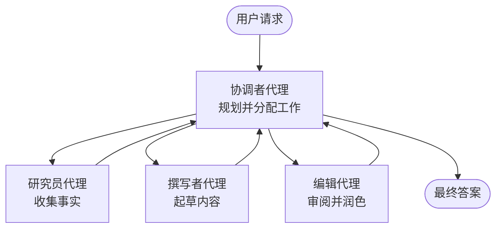

# 多代理基础 - 部署你的第一个协同 AI 系统

**章节导航：**
- **📚 课程主页**: [AZD 入门](../../README.md)
- **📖 当前章节**: 第 5 章 - 多代理 AI 解决方案
- **⬅️ 上一章**: [第 4 章：基础设施](../chapter-04-infrastructure/README.md)
- **➡️ 下一章**: [协调模式](../chapter-06-pre-deployment/coordination-patterns.md)

> 已在 2026 年 6 月使用 `azd 1.25.6` 验证。

## 介绍

在前面的章节中你部署了一个单一应用——在第 2 章你部署了一个单一的 AI 代理。本课将更进一步：部署一个 <strong>多代理系统</strong>，其中多个专责代理协同工作来解决单个代理难以胜任的问题。

对初学者的好消息是：**你不需要新的命令。** 多代理解决方案仍然是一个 azd 项目。你会 `azd init`、`azd up`、测试，然后 `azd down`——完全和你已知的工作流相同。变化的是应用内部的“形状”。

## 学习目标

完成本课后，你将能：
- 理解“多代理”是什么意思以及何时值得承担额外的复杂性
- 识别多代理系统中的常见角色（编排者 + 专家）
- 使用 `azd up` 部署一个真实可运行的多代理模板
- 理解支撑多代理应用的 Azure 资源
- 知道如何验证、定制并安全地拆除该解决方案

## 学习成果

完成本课后，你将能够：
- 解释单一代理与多代理系统之间的区别
- 在“带工具的单一代理”和真正的多代理设计之间做出选择
- 使用 azd 端到端部署并测试多代理模板
- 确认每个代理的运行位置以及它们如何通信
- 清理所有资源以避免持续费用

---

## 什么是多代理系统？

单个 AI 代理是一个模型加上一组指令和（可选的）一些工具。对于聚焦任务这很有效。但随着任务的增长——先研究、然后写作、再编辑、最后核实——把所有东西塞进一个提示会让代理变得更慢、不够可靠，也更难调试。

一个 <strong>多代理系统</strong> 将工作拆分为各个专责角色，每个角色擅长做一件事，由一个编排者协调：



### 你将始终看到的两个角色

| 角色 | 职责 | 示例 |
|------|------|------|
| <strong>协调者</strong> | 决定 <em>下一步发生什么</em> 并在代理之间分配工作 | "先研究，然后写作，然后编辑" |
| <strong>专家</strong> | 执行一个专注的工作并返回结果 | 只收集事实的“研究员” |

### 你真的需要多个代理吗？

先从简单开始。只有在以下任一情况为真时才考虑多代理：

- ✅ 任务有<strong>不同阶段</strong>，不同指令有明显好处（研究 vs 写作 vs 审核）
- ✅ 你希望专才能<strong>并行运行</strong>以节省时间
- ✅ 不同步骤需要<strong>不同的工具或数据源</strong>
- ✅ 你需要每个步骤<strong>可独立测试和调试</strong>

如果你的任务只是一个单一的问答或简单的工具调用，带工具的<strong>单一代理</strong>（第 2 章）更简单、更便宜，也更易于操作。

> **初学者提示：** “更多代理”并不等于“更好”。每增加一个代理都会增加延迟、成本以及新的监控项。只有当问题明显可以拆分成多个部分时才添加代理。

---

## 在 Azure 上构建多代理的两种方式

| 方法 | 是什么 | 最适合 |
|------|--------|--------|
| **单一代理 + 工具** | 一个 Foundry 代理调用函数/工具 | 简单工作流、入门场景 |
| <strong>多个协同代理</strong> | 多个代理由一个协调者协同 | 有明显阶段、需要并行或专责化的场景 |

本课聚焦第二种方法，使用一个<strong>现成模板</strong>，这样你可以在自己构建之前看到一个真实的多代理系统在运行。

---

## 实操：部署一个可运行的多代理应用

我们将部署 **Contoso Creative Writer**，这是一个官方 Azure 示例，使用多个代理（研究员、写手、编辑）协同生成一篇文章。因为角色易于理解，它是一个很好的第一个多代理应用。

### 步骤 1：初始化模板

```bash
# 创建一个工作文件夹
mkdir creative-writer && cd creative-writer

# 从官方多智能体模板初始化
azd init --template contoso-creative-writer
```

> 随时在 [Awesome AZD AI gallery](https://azure.github.io/awesome-azd/?tags=ai) 浏览更多多代理模板。其他对初学者友好的选项包括 `get-started-with-ai-agents` 和 `azure-ai-travel-agents`。

### 步骤 2：身份验证

```bash
# azd 工作流所需
azd auth login
```

### 步骤 3：创建环境

```bash
azd env new dev
```

### 步骤 4：预览，然后部署

```bash
# 在花费任何费用之前查看将创建的内容（推荐）
azd provision --preview

# 一次性配置基础设施并部署所有代理
azd up
```

`azd up` 会提示选择订阅和区域，然后配置 Azure 资源并部署应用。AI 部署通常比简单的 Web 应用耗时更长——如果你正在部署更大的模型，可以延长部署超时：

```bash
azd deploy --timeout 1800
```

> **关于成本和容量的提示：** 多代理应用会部署消耗配额并产生费用的 AI 模型。如果 `azd up` 因模型配额失败，请参见 [AI Troubleshooting](../chapter-07-troubleshooting/ai-troubleshooting.md) 获取区域和配额解决方案，以及第 6 章的 [Capacity Planning](../chapter-06-pre-deployment/capacity-planning.md)。

---

## 理解你部署的内容

像这样的典型多代理应用通常会配置一组 Azure 资源，这些资源直接映射到上图中的职责：

| 资源 | 存在的原因 |
|------|------------|
| **Microsoft Foundry / 模型** | 托管每个代理使用的语言模型 |
| **Azure AI Search** | 为研究者代理提供用于检索的有根据的数据 |
| **Container Apps**（或 App Service） | 托管编排者和代理代码 |
| **Cosmos DB**（在某些示例中） | 存储在代理之间传递的共享状态/记忆 |
| **Application Insights** | 跟踪跨代理的请求，便于调试流程 |

### 代理如何互相通信

在大多数 azd 多代理示例中，<strong>编排者在你的应用代码中运行</strong>（例如，使用像 Semantic Kernel 或 Microsoft Agent Framework 这样的框架）。编排者按顺序调用每个专才代理，传递结果，并组装最终答案。代理通过以下方式共享上下文：

- **函数/工具调用** — 编排者调用专才并获得结果
- <strong>共享内存</strong> — 数据库（通常是 Cosmos DB）保存双方都可以读取的状态
- **消息/事件** — 对于松耦合，代理通过队列或 Service Bus 进行通信

> **这对调试很重要的原因：** 因为每个步骤是独立的，Application Insights 会显示哪个代理变慢或失败。这就是将工作拆分到多个代理的主要理由之一。

---

## 验证部署

在继续之前确认系统确实在工作：

```bash
# 显示已部署的端点
azd show

# 打开应用的监控仪表板
azd monitor

# 如果出现异常，实时查看日志
azd monitor --logs
```

然后从 `azd show` 打开应用 URL，并尝试一个会触发所有代理的请求（对于 Creative Writer，要求它就一个主题写一篇短文）。在 Application Insights 的 **transaction search** 中，你应能看到请求在研究员、写手和编辑步骤之间分散的情况。

**成功标准：**
- ✅ `azd show` 列出一个可访问的端点
- ✅ 一个请求产生的结果明显经过了多个阶段
- ✅ Application Insights 显示超过一个代理步骤的跟踪

---

## 自定义：添加或调整代理

因为每个代理只是指令加工具，所以定制相对容易：

1. <strong>在模板中找到代理定义</strong>（通常是一组 `prompts/`、`agents/` 或 `*.prompty` 文件）。
2. <strong>调整代理的指令</strong> —— 例如，告诉编辑代理强制执行特定语气或字数。
3. <strong>仅重新部署代码</strong>（基础设施保持不变）：

   ```bash
   azd deploy
   ```

要进一步从你<strong>自己的</strong>清单构建代理，请使用代理扩展及其完整生命周期：

```bash
azd extension install azure.ai.agents
azd ai agent init -m agent-manifest.yaml
azd up
azd ai agent invoke      # 测试，带有响应计时
```

参见 [第 2 章：代理](../chapter-02-ai-development/agents.md) 和 [AZD AI CLI 参考](../chapter-08-production/production-ai-practices.md#azd-ai-cli-commands-and-extensions) 以了解完整的代理生命周期（`invoke`、`eval generate`、`optimize`、`delete`）。

---

## 清理

多代理应用运行多个计费服务。完成后请全部拆除：

```bash
azd down --force --purge
```

`--purge` 标志还会删除已软删除的 AI 资源（例如 Foundry/Azure AI Services 帐户），以免阻塞将来的重新部署或继续产生费用。

---

## 关于生产环境多代理系统的说明

本仓库中的 [Retail Multi-Agent Solution](../../examples/retail-scenario.md) 是一个<strong>架构蓝图</strong>，而不是一键式模板——它记录了生产零售系统<em>将如何</em>构建（并明确指出完整构建是一项重大工作）。在你在此处部署了一个可运行的示例之后，可将其作为设计参考。有关生产关注点（弹性、成本、监控、治理），请继续查看 [第 8 章：生产 AI 实践](../chapter-08-production/production-ai-practices.md)。

---

## 总结

- 多代理系统将工作拆分给由编排者协调的各个专才。
- 仅当任务具有明显阶段、需并行处理或每步需不同工具时才使用它——否则优先选择单一代理。
- azd 工作流不变：`azd init` → `azd up` → 测试 → `azd down`。
- 像 `contoso-creative-writer` 这样的真实模板让你今天就能看到并定制一个运行中的多代理应用。
- 跨代理的 Application Insights 跟踪是多代理设计在实践中最大的好处之一。

---

## 🔗 导航

| 方向 | 课程 |
|------|------|
| <strong>上一章</strong> | [第 4 章：基础设施](../chapter-04-infrastructure/README.md) |
| <strong>下一章</strong> | [协调模式](../chapter-06-pre-deployment/coordination-patterns.md) |

## 📖 相关资源

- [AI Agents Guide](../chapter-02-ai-development/agents.md)
- [协调模式](../chapter-06-pre-deployment/coordination-patterns.md)
- [生产 AI 实践](../chapter-08-production/production-ai-practices.md)
- [AI 故障排除](../chapter-07-troubleshooting/ai-troubleshooting.md)

---

<!-- CO-OP TRANSLATOR DISCLAIMER START -->
**免责声明**：
本文件由 AI 翻译服务 [Co-op Translator](https://github.com/Azure/co-op-translator) 翻译完成。尽管我们力求准确，但请注意，自动翻译可能包含错误或不准确之处。原始语言版文件应视为权威来源。对于重要信息，建议使用专业人工翻译。我们对因使用本翻译而产生的任何误解或误释不承担责任。
<!-- CO-OP TRANSLATOR DISCLAIMER END -->