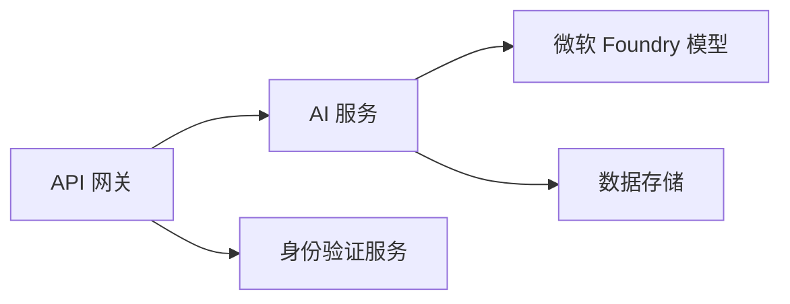

# 第8章：生产与企业模式

**📚 Course**: [AZD 入门](../../README.md) | **⏱️ Duration**: 2-3 小时 | **⭐ Complexity**: 高级

---

## 概述

本章涵盖面向企业的部署模式、安全加固、监控以及针对生产 AI 工作负载的成本优化。

> 经验证于 2026 年 3 月，使用 `azd 1.23.12`。

## 学习目标

完成本章后，您将能够：
- 部署多区域弹性应用
- 实施企业安全模式
- 配置全面的监控
- 实现规模化成本优化
- 使用 AZD 设置 CI/CD 管道

---

## 📚 课程

| # | 课程 | 描述 | 时间 |
|---|--------|-------------|------|
| 1 | [生产 AI 实践](production-ai-practices.md) | 企业部署模式 | 90 分钟 |

---

## 🚀 生产核对清单

- [ ] 多区域部署以实现弹性
- [ ] 使用托管身份进行认证（无密钥）
- [ ] 使用 Application Insights 进行监控
- [ ] 配置成本预算和警报
- [ ] 启用安全扫描
- [ ] 集成 CI/CD 管道
- [ ] 灾难恢复计划

---

## 🏗️ 架构模式

### 模式 1：微服务 AI


### 模式 2：事件驱动 AI


---

## 🔐 安全最佳实践

```bicep
// Use managed identity
identity: {
  type: 'SystemAssigned'
}

// Private endpoints for AI services
properties: {
  publicNetworkAccess: 'Disabled'
  networkAcls: {
    defaultAction: 'Deny'
  }
}
```

---

## 💰 成本优化

| 策略 | 节省 |
|----------|---------|
| 缩减到零（Container Apps） | 60-80% |
| 开发使用消费层 | 50-70% |
| 计划性伸缩 | 30-50% |
| 预留容量 | 20-40% |

```bash
# 设置预算提醒
az consumption budget create \
  --budget-name "AI-Budget" \
  --amount 500 \
  --category Cost \
  --time-grain Monthly
```

---

## 📊 监控设置

```bash
# 流式日志
azd monitor --logs

# 检查 Application Insights
azd monitor --overview

# 查看指标
az monitor metrics list --resource <resource-id>
```

---

## 🔗 导航

| 方向 | 章节 |
|-----------|---------|
| <strong>上一章</strong> | [第7章：故障排除](../chapter-07-troubleshooting/README.md) |
| <strong>课程完成</strong> | [课程首页](../../README.md) |

---

## 📖 相关资源

- [AI 代理指南](../chapter-02-ai-development/agents.md)
- [Application Insights](../chapter-06-pre-deployment/application-insights.md)
- [多代理解决方案](../chapter-05-multi-agent/README.md)
- [微服务示例](../../examples/microservices/README.md)

---

<!-- CO-OP TRANSLATOR DISCLAIMER START -->
**Disclaimer**:
本文件使用 AI 翻译服务 [Co-op Translator](https://github.com/Azure/co-op-translator) 进行翻译。虽然我们努力追求准确性，但请注意自动翻译可能包含错误或不准确之处。原始文档的原生语言版本应被视为权威来源。对于重要信息，建议使用专业人工翻译。对于因使用本翻译而产生的任何误解或曲解，我们不承担任何责任。
<!-- CO-OP TRANSLATOR DISCLAIMER END -->