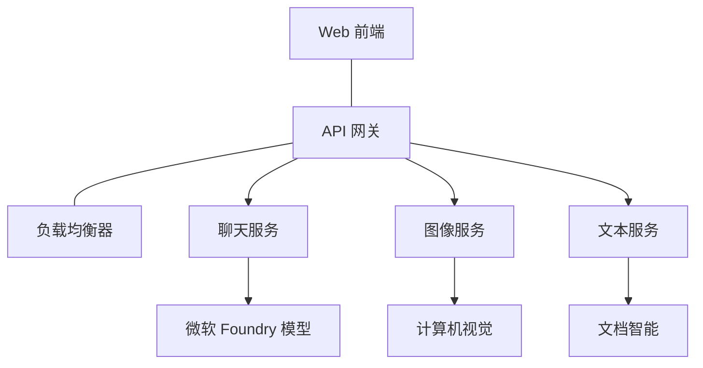

# 使用 AZD 的生产级 AI 工作负载最佳实践

**章节导航：**
- **📚 课程主页**: [AZD 入门](../../README.md)
- **📖 当前章节**: 第 8 章 - 生产与企业模式
- **⬅️ 上一章**: [第 7 章：故障排除](../chapter-07-troubleshooting/debugging.md)
- **⬅️ 相关内容**: [AI 研讨会实验室](ai-workshop-lab.md)
- **🎯 课程完成**: [AZD 入门](../../README.md)

## 概览

本指南提供使用 Azure Developer CLI (AZD) 部署生产就绪 AI 工作负载的全面最佳实践。基于 Microsoft Foundry Discord 社区的反馈和真实客户部署经验，这些实践解决了生产 AI 系统中最常见的挑战。

## 解决的关键挑战

根据我们社区投票结果，以下是开发者面临的主要挑战：

- **45%** 在多服务 AI 部署方面遇到困难
- **38%** 在凭证和机密管理方面存在问题  
- **35%** 觉得生产就绪性和扩展性困难
- **32%** 需要更好的成本优化策略
- **29%** 需要改进监控和故障排查

## 生产 AI 的架构模式

### 模式 1：微服务 AI 架构

<strong>何时使用</strong>：具有多种能力的复杂 AI 应用


**AZD 实现**：

```yaml
# azure.yaml
name: enterprise-ai-platform
services:
  web:
    project: ./web
    host: staticwebapp
  api-gateway:
    project: ./api-gateway
    host: containerapp
  chat-service:
    project: ./services/chat
    host: containerapp
  vision-service:
    project: ./services/vision
    host: containerapp
  text-service:
    project: ./services/text
    host: containerapp
```

### 模式 2：事件驱动的 AI 处理

<strong>何时使用</strong>：批处理、文档分析、异步工作流

```bicep
// Event Hub for AI processing pipeline
resource eventHub 'Microsoft.EventHub/namespaces@2023-01-01-preview' = {
  name: eventHubNamespaceName
  location: location
  sku: {
    name: 'Standard'
    tier: 'Standard'
    capacity: 1
  }
}

// Service Bus for reliable message processing
resource serviceBus 'Microsoft.ServiceBus/namespaces@2022-10-01-preview' = {
  name: serviceBusNamespaceName
  location: location
  sku: {
    name: 'Premium'
    tier: 'Premium'
    capacity: 1
  }
}

// Function App for processing
resource functionApp 'Microsoft.Web/sites@2023-01-01' = {
  name: functionAppName
  location: location
  kind: 'functionapp,linux'
  properties: {
    siteConfig: {
      appSettings: [
        {
          name: 'FUNCTIONS_EXTENSION_VERSION'
          value: '~4'
        }
        {
          name: 'AZURE_OPENAI_ENDPOINT'
          value: '@Microsoft.KeyVault(VaultName=${keyVault.name};SecretName=openai-endpoint)'
        }
      ]
    }
  }
}
```

## 考虑 AI 代理的健康状况

当传统 Web 应用出现故障时，症状是熟悉的：页面无法加载、API 返回错误或部署失败。AI 驱动的应用可能以相同的方式出现故障——但它们也可能以更加微妙的方式表现不佳，而不会产生明显的错误消息。

本部分帮助你为监控 AI 工作负载建立心智模型，以便在出现异常时知道从何处着手。

### 代理健康与传统应用健康的区别

传统应用要么正常工作，要么不工作。AI 代理可能看似正常但产生不良结果。将代理健康视为两层：

| Layer | What to Watch | Where to Look |
|-------|--------------|---------------|
| <strong>基础设施健康</strong> | 服务是否在运行？资源是否已配置？端点是否可达？ | `azd monitor`, Azure 门户资源健康, 容器/应用 日志 |
| <strong>行为健康</strong> | 代理的响应是否准确？响应是否及时？模型调用是否正确？ | Application Insights 跟踪, 模型调用延迟指标, 响应质量日志 |

基础设施健康是熟悉的——对任何 azd 应用都是相同的。行为健康是 AI 工作负载引入的新层面。

### 当 AI 应用行为异常时该看哪里

如果你的 AI 应用没有产生预期结果，下面是一个概念性检查清单：

1. **从基础开始。** 应用是否在运行？能否访问其依赖项？像检查任何应用一样检查 `azd monitor` 和资源健康。
2. **检查模型连接。** 应用是否成功调用了 AI 模型？失败或超时的模型调用是 AI 应用问题的最常见原因，并会出现在你的应用日志中。
3. **查看模型收到的内容。** AI 的响应取决于输入（提示和任何检索到的上下文）。如果输出错误，通常是输入有问题。检查你的应用是否向模型发送了正确的数据。
4. **审查响应延迟。** AI 模型调用比典型 API 调用更慢。如果你的应用感觉缓慢，检查模型响应时间是否增加——这可能表明节流、容量限制或区域级拥塞。
5. **注意成本信号。** 令牌使用或 API 调用的意外激增可能表示循环、提示配置错误或过度重试。

你不需要立刻掌握可观察性工具。关键要点是 AI 应用有一层额外的行为需要监控，而 azd 的内置监控（`azd monitor`）为调查这两层问题提供了起点。

---

## 安全最佳实践

### 1. 零信任安全模型

<strong>实施策略</strong>：
- 未经身份验证不得进行服务间通信
- 所有 API 调用使用托管身份
- 使用私有端点进行网络隔离
- 最小权限访问控制

```bicep
// Managed Identity for each service
resource chatServiceIdentity 'Microsoft.ManagedIdentity/userAssignedIdentities@2023-01-31' = {
  name: 'chat-service-identity'
  location: location
}

// Role assignments with minimal permissions
resource openAIUserRole 'Microsoft.Authorization/roleAssignments@2022-04-01' = {
  scope: openAIAccount
  name: guid(openAIAccount.id, chatServiceIdentity.id, openAIUserRoleDefinitionId)
  properties: {
    roleDefinitionId: subscriptionResourceId('Microsoft.Authorization/roleDefinitions', '5e0bd9bd-7b93-4f28-af87-19fc36ad61bd')
    principalId: chatServiceIdentity.properties.principalId
    principalType: 'ServicePrincipal'
  }
}
```

### 2. 安全的机密管理

**Key Vault 集成模式**：

```bicep
// Key Vault with proper access policies
resource keyVault 'Microsoft.KeyVault/vaults@2023-02-01' = {
  name: keyVaultName
  location: location
  properties: {
    tenantId: tenant().tenantId
    sku: {
      family: 'A'
      name: 'premium'  // Use premium for production
    }
    enableRbacAuthorization: true  // Use RBAC instead of access policies
    enablePurgeProtection: true    // Prevent accidental deletion
    enableSoftDelete: true
    softDeleteRetentionInDays: 90
  }
}

// Store all AI service credentials
resource openAIKeySecret 'Microsoft.KeyVault/vaults/secrets@2023-02-01' = {
  parent: keyVault
  name: 'openai-api-key'
  properties: {
    value: openAIAccount.listKeys().key1
    attributes: {
      enabled: true
    }
  }
}
```

### 3. 网络安全

<strong>私有端点配置</strong>：

```bicep
// Virtual Network for AI services
resource virtualNetwork 'Microsoft.Network/virtualNetworks@2023-04-01' = {
  name: vnetName
  location: location
  properties: {
    addressSpace: {
      addressPrefixes: ['10.0.0.0/16']
    }
    subnets: [
      {
        name: 'ai-services-subnet'
        properties: {
          addressPrefix: '10.0.1.0/24'
          privateEndpointNetworkPolicies: 'Disabled'
        }
      }
      {
        name: 'app-services-subnet'
        properties: {
          addressPrefix: '10.0.2.0/24'
          delegations: [
            {
              name: 'Microsoft.Web/serverFarms'
              properties: {
                serviceName: 'Microsoft.Web/serverFarms'
              }
            }
          ]
        }
      }
    ]
  }
}

// Private endpoints for all AI services
resource openAIPrivateEndpoint 'Microsoft.Network/privateEndpoints@2023-04-01' = {
  name: '${openAIAccountName}-pe'
  location: location
  properties: {
    subnet: {
      id: virtualNetwork.properties.subnets[0].id
    }
    privateLinkServiceConnections: [
      {
        name: 'openai-connection'
        properties: {
          privateLinkServiceId: openAIAccount.id
          groupIds: ['account']
        }
      }
    ]
  }
}
```

## 性能与扩展

### 1. 自动扩展策略

<strong>容器应用自动扩展</strong>：

```bicep
resource containerApp 'Microsoft.App/containerApps@2023-05-01' = {
  name: containerAppName
  location: location
  properties: {
    configuration: {
      ingress: {
        external: true
        targetPort: 8000
        transport: 'http'
      }
    }
    template: {
      scale: {
        minReplicas: 2  // Always have 2 instances minimum
        maxReplicas: 50 // Scale up to 50 for high load
        rules: [
          {
            name: 'http-scaling'
            http: {
              metadata: {
                concurrentRequests: '20'  // Scale when >20 concurrent requests
              }
            }
          }
          {
            name: 'cpu-scaling'
            custom: {
              type: 'cpu'
              metadata: {
                type: 'Utilization'
                value: '70'  // Scale when CPU >70%
              }
            }
          }
        ]
      }
    }
  }
}
```

### 2. 缓存策略

**用于 AI 响应的 Redis 缓存**：

```bicep
// Redis Premium for production workloads
resource redisCache 'Microsoft.Cache/redis@2023-04-01' = {
  name: redisCacheName
  location: location
  properties: {
    sku: {
      name: 'Premium'
      family: 'P'
      capacity: 1
    }
    enableNonSslPort: false
    minimumTlsVersion: '1.2'
    redisConfiguration: {
      'maxmemory-policy': 'allkeys-lru'
    }
    // Enable clustering for high availability
    redisVersion: '6.0'
    shardCount: 2
  }
}

// Cache configuration in application
var cacheConnectionString = '${redisCache.properties.hostName}:6380,password=${redisCache.listKeys().primaryKey},ssl=True,abortConnect=False'
```

### 3. 负载均衡与流量管理

**带 WAF 的应用网关**：

```bicep
// Application Gateway with Web Application Firewall
resource applicationGateway 'Microsoft.Network/applicationGateways@2023-04-01' = {
  name: appGatewayName
  location: location
  properties: {
    sku: {
      name: 'WAF_v2'
      tier: 'WAF_v2'
      capacity: 2
    }
    webApplicationFirewallConfiguration: {
      enabled: true
      firewallMode: 'Prevention'
      ruleSetType: 'OWASP'
      ruleSetVersion: '3.2'
    }
    // Backend pools for AI services
    backendAddressPools: [
      {
        name: 'ai-services-pool'
        properties: {
          backendAddresses: [
            {
              fqdn: '${containerApp.properties.configuration.ingress.fqdn}'
            }
          ]
        }
      }
    ]
  }
}
```

## 💰 成本优化

### 1. 资源右-sizing

<strong>基于环境的配置</strong>：

```bash
# 开发环境
azd env new development
azd env set AZURE_OPENAI_SKU "S0"
azd env set AZURE_OPENAI_CAPACITY 10
azd env set AZURE_SEARCH_SKU "basic"
azd env set CONTAINER_CPU 0.5
azd env set CONTAINER_MEMORY 1.0

# 生产环境
azd env new production
azd env set AZURE_OPENAI_SKU "S0"
azd env set AZURE_OPENAI_CAPACITY 100
azd env set AZURE_SEARCH_SKU "standard"
azd env set CONTAINER_CPU 2.0
azd env set CONTAINER_MEMORY 4.0
```

### 2. 成本监控与预算

```bicep
// Cost management and budgets
resource budget 'Microsoft.Consumption/budgets@2023-05-01' = {
  name: 'ai-workload-budget'
  properties: {
    timePeriod: {
      startDate: '2024-01-01'
      endDate: '2024-12-31'
    }
    timeGrain: 'Monthly'
    amount: 2000  // $2000 monthly budget
    category: 'Cost'
    notifications: {
      warning: {
        enabled: true
        operator: 'GreaterThan'
        threshold: 80
        contactEmails: [
          'finance@company.com'
          'engineering@company.com'
        ]
        contactRoles: [
          'Owner'
          'Contributor'
        ]
      }
      critical: {
        enabled: true
        operator: 'GreaterThan'
        threshold: 95
        contactEmails: [
          'cto@company.com'
        ]
      }
    }
  }
}
```

### 3. 令牌使用优化

**OpenAI 成本管理**：

```typescript
// 应用级别的令牌优化
class TokenOptimizer {
  private readonly maxTokens = 4000;
  private readonly reserveTokens = 500;
  
  optimizePrompt(userInput: string, context: string): string {
    const availableTokens = this.maxTokens - this.reserveTokens;
    const estimatedTokens = this.estimateTokens(userInput + context);
    
    if (estimatedTokens > availableTokens) {
      // 截断上下文，而不是用户输入
      context = this.truncateContext(context, availableTokens - this.estimateTokens(userInput));
    }
    
    return `${context}\n\nUser: ${userInput}`;
  }
  
  private estimateTokens(text: string): number {
    // 粗略估算：1 个令牌 ≈ 4 个字符
    return Math.ceil(text.length / 4);
  }
}
```

## 监控与可观察性

### 1. 全面的 Application Insights

```bicep
// Application Insights with advanced features
resource applicationInsights 'Microsoft.Insights/components@2020-02-02' = {
  name: applicationInsightsName
  location: location
  kind: 'web'
  properties: {
    Application_Type: 'web'
    WorkspaceResourceId: logAnalyticsWorkspace.id
    SamplingPercentage: 100  // Full sampling for AI apps
    DisableIpMasking: false  // Enable for security
  }
}

// Custom metrics for AI operations
resource aiMetricAlerts 'Microsoft.Insights/metricAlerts@2018-03-01' = {
  name: 'ai-high-error-rate'
  location: 'global'
  properties: {
    description: 'Alert when AI service error rate is high'
    severity: 2
    enabled: true
    scopes: [
      applicationInsights.id
    ]
    evaluationFrequency: 'PT1M'
    windowSize: 'PT5M'
    criteria: {
      'odata.type': 'Microsoft.Azure.Monitor.SingleResourceMultipleMetricCriteria'
      allOf: [
        {
          name: 'high-error-rate'
          metricName: 'requests/failed'
          operator: 'GreaterThan'
          threshold: 10
          timeAggregation: 'Count'
        }
      ]
    }
  }
}
```

### 2. AI 专用监控

**AI 指标的自定义仪表板**：

```json
// Dashboard configuration for AI workloads
{
  "dashboard": {
    "name": "AI Application Monitoring",
    "tiles": [
      {
        "name": "OpenAI Request Volume",
        "query": "requests | where name contains 'openai' | summarize count() by bin(timestamp, 5m)"
      },
      {
        "name": "AI Response Latency",
        "query": "requests | where name contains 'openai' | summarize avg(duration) by bin(timestamp, 5m)"
      },
      {
        "name": "Token Usage",
        "query": "customMetrics | where name == 'openai_tokens_used' | summarize sum(value) by bin(timestamp, 1h)"
      },
      {
        "name": "Cost per Hour",
        "query": "customMetrics | where name == 'openai_cost' | summarize sum(value) by bin(timestamp, 1h)"
      }
    ]
  }
}
```

### 3. 健康检查与可用性监控

```bicep
// Application Insights availability tests
resource availabilityTest 'Microsoft.Insights/webtests@2022-06-15' = {
  name: 'ai-app-availability-test'
  location: location
  tags: {
    'hidden-link:${applicationInsights.id}': 'Resource'
  }
  properties: {
    SyntheticMonitorId: 'ai-app-availability-test'
    Name: 'AI Application Availability Test'
    Description: 'Tests AI application endpoints'
    Enabled: true
    Frequency: 300  // 5 minutes
    Timeout: 120    // 2 minutes
    Kind: 'ping'
    Locations: [
      {
        Id: 'us-east-2-azr'
      }
      {
        Id: 'us-west-2-azr'
      }
    ]
    Configuration: {
      WebTest: '''
        <WebTest Name="AI Health Check" 
                 Id="8d2de8d2-a2b0-4c2e-9a0d-8f9c9a0b8c8d" 
                 Enabled="True" 
                 CssProjectStructure="" 
                 CssIteration="" 
                 Timeout="120" 
                 WorkItemIds="" 
                 xmlns="http://microsoft.com/schemas/VisualStudio/TeamTest/2010" 
                 Description="" 
                 CredentialUserName="" 
                 CredentialPassword="" 
                 PreAuthenticate="True" 
                 Proxy="default" 
                 StopOnError="False" 
                 RecordedResultFile="" 
                 ResultsLocale="">
          <Items>
            <Request Method="GET" 
                     Guid="a5f10126-e4cd-570d-961c-cea43999a200" 
                     Version="1.1" 
                     Url="${webApp.properties.defaultHostName}/health" 
                     ThinkTime="0" 
                     Timeout="120" 
                     ParseDependentRequests="True" 
                     FollowRedirects="True" 
                     RecordResult="True" 
                     Cache="False" 
                     ResponseTimeGoal="0" 
                     Encoding="utf-8" 
                     ExpectedHttpStatusCode="200" 
                     ExpectedResponseUrl="" 
                     ReportingName="" 
                     IgnoreHttpStatusCode="False" />
          </Items>
        </WebTest>
      '''
    }
  }
}
```

## 灾难恢复与高可用

### 1. 多区域部署

```yaml
# azure.yaml - Multi-region configuration
name: ai-app-multiregion
services:
  api-primary:
    project: ./api
    host: containerapp
    env:
      - AZURE_REGION=eastus
  api-secondary:
    project: ./api
    host: containerapp
    env:
      - AZURE_REGION=westus2
```

```bicep
// Traffic Manager for global load balancing
resource trafficManager 'Microsoft.Network/trafficManagerProfiles@2022-04-01' = {
  name: trafficManagerProfileName
  location: 'global'
  properties: {
    profileStatus: 'Enabled'
    trafficRoutingMethod: 'Priority'
    dnsConfig: {
      relativeName: trafficManagerProfileName
      ttl: 30
    }
    monitorConfig: {
      protocol: 'HTTPS'
      port: 443
      path: '/health'
      intervalInSeconds: 30
      toleratedNumberOfFailures: 3
      timeoutInSeconds: 10
    }
    endpoints: [
      {
        name: 'primary-endpoint'
        type: 'Microsoft.Network/trafficManagerProfiles/azureEndpoints'
        properties: {
          targetResourceId: primaryAppService.id
          endpointStatus: 'Enabled'
          priority: 1
        }
      }
      {
        name: 'secondary-endpoint'
        type: 'Microsoft.Network/trafficManagerProfiles/azureEndpoints'
        properties: {
          targetResourceId: secondaryAppService.id
          endpointStatus: 'Enabled'
          priority: 2
        }
      }
    ]
  }
}
```

### 2. 数据备份与恢复

```bicep
// Backup configuration for critical data
resource backupVault 'Microsoft.DataProtection/backupVaults@2023-05-01' = {
  name: backupVaultName
  location: location
  identity: {
    type: 'SystemAssigned'
  }
  properties: {
    storageSettings: [
      {
        datastoreType: 'VaultStore'
        type: 'LocallyRedundant'
      }
    ]
  }
}

// Backup policy for AI models and data
resource backupPolicy 'Microsoft.DataProtection/backupVaults/backupPolicies@2023-05-01' = {
  parent: backupVault
  name: 'ai-data-backup-policy'
  properties: {
    policyRules: [
      {
        backupParameters: {
          backupType: 'Full'
          objectType: 'AzureBackupParams'
        }
        trigger: {
          schedule: {
            repeatingTimeIntervals: [
              'R/2024-01-01T02:00:00+00:00/P1D'  // Daily at 2 AM
            ]
          }
          objectType: 'ScheduleBasedTriggerContext'
        }
        dataStore: {
          datastoreType: 'VaultStore'
          objectType: 'DataStoreInfoBase'
        }
        name: 'BackupDaily'
        objectType: 'AzureBackupRule'
      }
    ]
  }
}
```

## DevOps 与 CI/CD 集成

### 1. GitHub Actions 工作流

```yaml
# .github/workflows/deploy-ai-app.yml
name: Deploy AI Application

on:
  push:
    branches: [main]
  pull_request:
    branches: [main]

jobs:
  test:
    runs-on: ubuntu-latest
    steps:
      - uses: actions/checkout@v4
      
      - name: Setup Python
        uses: actions/setup-python@v4
        with:
          python-version: '3.11'
          
      - name: Install dependencies
        run: |
          pip install -r requirements.txt
          pip install pytest
          
      - name: Run tests
        run: pytest tests/
        
      - name: AI Safety Tests
        run: |
          python scripts/test_ai_safety.py
          python scripts/validate_prompts.py

  deploy-staging:
    needs: test
    if: github.event_name == 'pull_request'
    runs-on: ubuntu-latest
    steps:
      - uses: actions/checkout@v4
      
      - name: Setup AZD
        uses: Azure/setup-azd@v2
        
      - name: Login to Azure
        uses: azure/login@v1
        with:
          creds: ${{ secrets.AZURE_CREDENTIALS }}
          
      - name: Deploy to Staging
        run: |
          azd env select staging
          azd deploy

  deploy-production:
    needs: test
    if: github.ref == 'refs/heads/main'
    runs-on: ubuntu-latest
    steps:
      - uses: actions/checkout@v4
      
      - name: Setup AZD
        uses: Azure/setup-azd@v2
        
      - name: Login to Azure
        uses: azure/login@v1
        with:
          creds: ${{ secrets.AZURE_CREDENTIALS }}
          
      - name: Deploy to Production
        run: |
          azd env select production
          azd deploy
          
      - name: Run Production Health Checks
        run: |
          python scripts/health_check.py --env production
```

### 2. 基础设施验证

```bash
# scripts/validate_infrastructure.sh
#!/bin/bash

echo "Validating AI infrastructure deployment..."

# 检查所有必需服务是否正在运行
services=("openai" "search" "storage" "keyvault")
for service in "${services[@]}"; do
    echo "Checking $service..."
    if ! az resource list --resource-type "Microsoft.CognitiveServices/accounts" --query "[?contains(name, '$service')]" -o tsv; then
        echo "ERROR: $service not found"
        exit 1
    fi
done

# 验证 OpenAI 模型部署
echo "Validating OpenAI model deployments..."
models=$(az cognitiveservices account deployment list --name $AZURE_OPENAI_NAME --resource-group $AZURE_RESOURCE_GROUP --query "[].name" -o tsv)
if [[ ! $models == *"gpt-4.1-mini"* ]]; then
  echo "ERROR: Required model gpt-4.1-mini not deployed"
    exit 1
fi

# 测试 AI 服务的连通性
echo "Testing AI service connectivity..."
python scripts/test_connectivity.py

echo "Infrastructure validation completed successfully!"
```

## 生产就绪检查清单

### 安全 ✅
- [ ] 所有服务使用托管身份
- [ ] 机密存储在 Key Vault 中
- [ ] 已配置私有端点
- [ ] 已实施网络安全组
- [ ] 基于最小权限的 RBAC
- [ ] 在公共端点启用 WAF

### 性能 ✅
- [ ] 已配置自动扩展
- [ ] 已实现缓存
- [ ] 已设置负载均衡
- [ ] 静态内容使用 CDN
- [ ] 数据库连接池
- [ ] 已优化令牌使用

### 监控 ✅
- [ ] 已配置 Application Insights
- [ ] 定义了自定义指标
- [ ] 已设置告警规则
- [ ] 已创建仪表板
- [ ] 已实现健康检查
- [ ] 日志保留策略

### 可靠性 ✅
- [ ] 多区域部署
- [ ] 备份与恢复计划
- [ ] 实施熔断器
- [ ] 已配置重试策略
- [ ] 优雅降级
- [ ] 健康检查端点

### 成本管理 ✅
- [ ] 已配置预算告警
- [ ] 资源已右-sizing
- [ ] 已应用开发/测试折扣
- [ ] 购买了预留实例
- [ ] 成本监控仪表板
- [ ] 定期成本审查

### 合规 ✅
- [ ] 满足数据驻留要求
- [ ] 启用了审计日志
- [ ] 应用了合规策略
- [ ] 实施了安全基线
- [ ] 定期安全评估
- [ ] 事件响应计划

## 性能基准

### 典型生产指标

| Metric | Target | Monitoring |
|--------|--------|------------|
| **Response Time** | < 2 seconds | Application Insights |
| **Availability** | 99.9% | 可用性监控 |
| **Error Rate** | < 0.1% | 应用日志 |
| **Token Usage** | < $500/month | 成本管理 |
| **Concurrent Users** | 1000+ | 负载测试 |
| **Recovery Time** | < 1 hour | 灾难恢复测试 |

### 负载测试

```bash
# AI 应用的负载测试脚本
python scripts/load_test.py \
  --endpoint https://your-ai-app.azurewebsites.net \
  --concurrent-users 100 \
  --duration 300 \
  --ramp-up 60
```

## 🤝 社区最佳实践

基于 Microsoft Foundry Discord 社区的反馈：

### 社区的主要建议：

1. **从小开始，逐步扩展**：从基础 SKU 开始，并根据实际使用情况扩展
2. <strong>监控一切</strong>：从第一天起设置全面监控
3. <strong>自动化安全</strong>：使用基础设施即代码以保持安全一致性
4. <strong>充分测试</strong>：在你的流水线中包含 AI 专用测试
5. <strong>规划成本</strong>：及早监控令牌使用并设置预算告警

### 常见的陷阱要避免：

- ❌ 在代码中硬编码 API 密钥
- ❌ 未设置适当的监控
- ❌ 忽视成本优化
- ❌ 未测试失败场景
- ❌ 部署时没有健康检查

## AZD AI CLI 命令与扩展

AZD 包含一组不断扩展的 AI 专用命令和扩展，可简化生产级 AI 工作流。这些工具弥合了本地开发与 AI 工作负载生产部署之间的差距。

### AZD 的 AI 扩展

AZD 使用扩展系统来添加 AI 专用功能。使用以下命令安装和管理扩展：

```bash
# 列出所有可用扩展（包括 AI）
azd extension list

# 查看已安装扩展的详细信息
azd extension show azure.ai.agents

# 安装 Foundry agents 扩展
azd extension install azure.ai.agents

# 安装微调扩展
azd extension install azure.ai.finetune

# 安装自定义模型扩展
azd extension install azure.ai.models

# 升级所有已安装的扩展
azd extension upgrade --all
```

**可用的 AI 扩展：**

| Extension | Purpose | Status |
|-----------|---------|--------|
| `azure.ai.agents` | Foundry Agent Service 管理 | Preview |
| `azure.ai.finetune` | Foundry 模型微调 | Preview |
| `azure.ai.models` | Foundry 自定义模型 | Preview |
| `azure.coding-agent` | 编码代理配置 | Available |

### 使用 `azd ai agent init` 初始化代理项目

`azd ai agent init` 命令为集成 Microsoft Foundry Agent Service 的生产就绪 AI 代理项目生成脚手架：

```bash
# 从代理清单初始化一个新的代理项目
azd ai agent init -m <manifest-path-or-uri>

# 初始化并以特定 Foundry 项目为目标
azd ai agent init -m agent-manifest.yaml --project-id <foundry-project-id>

# 使用自定义源目录初始化
azd ai agent init -m agent-manifest.yaml --src ./agents/my-agent

# 将 Container Apps 作为主机
azd ai agent init -m agent-manifest.yaml --host containerapp
```

**关键标志：**

| Flag | Description |
|------|-------------|
| `-m, --manifest` | 添加到项目的代理清单的路径或 URI |
| `-p, --project-id` | 用于你的 azd 环境的现有 Microsoft Foundry 项目 ID |
| `-s, --src` | 下载代理定义的目录（默认为 `src/<agent-id>`） |
| `--host` | 覆盖默认主机（例如 `containerapp`） |
| `-e, --environment` | 要使用的 azd 环境 |

<strong>生产提示</strong>：使用 `--project-id` 直接连接到现有的 Foundry 项目，从一开始就将你的代理代码与云资源关联。

### 使用 `azd mcp` 的模型上下文协议 (MCP)

AZD 包含内置的 MCP 服务器支持（Alpha），使 AI 代理和工具能够通过标准化协议与 Azure 资源交互：

```bash
# 为你的项目启动 MCP 服务器
azd mcp start

# 审查当前 Copilot 对工具执行的同意规则
azd copilot consent list
```

MCP 服务器公开你的 azd 项目上下文——环境、服务和 Azure 资源——供 AI 驱动的开发工具使用。这可以实现：

- **AI 辅助部署**：让编码代理查询你的项目状态并触发部署
- <strong>资源发现</strong>：AI 工具可以发现你的项目使用了哪些 Azure 资源
- <strong>环境管理</strong>：代理可以在开发/暂存/生产环境之间切换

### 使用 `azd infra generate` 生成基础设施

对于生产 AI 工作负载，你可以生成并自定义基础设施即代码，而不是依赖自动配置：

```bash
# 根据您的项目定义生成 Bicep/Terraform 文件
azd infra generate
```

这会将 IaC 写入磁盘，以便你可以：
- 在部署前审查和审核基础设施
- 添加自定义安全策略（网络规则、私有端点）
- 与现有的 IaC 审查流程集成
- 单独对基础设施更改进行版本控制，而不是与应用代码混在一起

### 生产生命周期挂钩

AZD 挂钩让你可以在部署生命周期的每个阶段注入自定义逻辑——这对生产 AI 工作流至关重要：

```yaml
# azure.yaml - Production hooks example
name: ai-production-app
hooks:
  preprovision:
    shell: sh
    run: scripts/validate-quotas.sh    # Check AI model quota before provisioning
  postprovision:
    shell: sh
    run: scripts/configure-networking.sh  # Set up private endpoints
  predeploy:
    shell: sh
    run: scripts/run-ai-safety-tests.sh  # Run prompt safety checks
  postdeploy:
    shell: sh
    run: scripts/smoke-test.sh           # Verify agent responses post-deploy
services:
  agent-api:
    project: ./src/agent
    host: containerapp
    hooks:
      predeploy:
        shell: sh
        run: scripts/validate-model-access.sh  # Per-service hook
```

```bash
# 在开发过程中手动运行特定钩子
azd hooks run predeploy
```

**推荐用于 AI 工作负载的生产挂钩：**

| Hook | Use Case |
|------|----------|
| `preprovision` | 验证订阅配额以满足 AI 模型容量 |
| `postprovision` | 配置私有端点，部署模型权重 |
| `predeploy` | 运行 AI 安全测试，验证提示模板 |
| `postdeploy` | 对代理响应进行冒烟测试，验证模型连接性 |

### CI/CD 管道配置

使用 `azd pipeline config` 将你的项目连接到 GitHub Actions 或 Azure Pipelines，并使用安全的 Azure 身份验证：

```bash
# 配置 CI/CD 管道（交互式）
azd pipeline config

# 使用特定提供者进行配置
azd pipeline config --provider github
```

该命令将：
- 创建具有最小权限的服务主体
- 配置联合凭据（无存储的秘密）
- 生成或更新你的管道定义文件
- 在你的 CI/CD 系统中设置所需的环境变量

**使用 pipeline config 的生产工作流：**

```bash
# 1. 设置生产环境
azd env new production
azd env set AZURE_OPENAI_CAPACITY 100

# 2. 配置流水线
azd pipeline config --provider github

# 3. 每次推送到 main 分支时，流水线都会运行 azd deploy
```

### 使用 `azd add` 添加组件

逐步向现有项目添加 Azure 服务：

```bash
# 交互式添加新的服务组件
azd add
```

这对于扩展生产 AI 应用特别有用——例如，向现有部署中添加向量搜索服务、新的代理端点或监控组件。

## 附加资源
- **Azure 良好架构框架**: [AI 工作负载指南](https://learn.microsoft.com/azure/well-architected/ai/)
- **Microsoft Foundry 文档**: [官方文档](https://learn.microsoft.com/azure/ai-studio/)
- <strong>社区模板</strong>: [Azure 示例](https://github.com/Azure-Samples)
- **Discord 社区**: [#Azure 频道](https://discord.gg/microsoft-azure)
- **Azure 代理技能**: [microsoft/github-copilot-for-azure on skills.sh](https://skills.sh/microsoft/github-copilot-for-azure) - 37 个面向 Azure AI、Foundry、部署、成本优化和诊断的开放代理技能。在你的编辑器中安装：
  ```bash
  npx skills add microsoft/github-copilot-for-azure
  ```

---

**章节导航：**
- **📚 Course Home**: [AZD 入门](../../README.md)
- **📖 当前章节**: 第 8 章 - 生产与企业模式
- **⬅️ 上一章**: [第7章：故障排除](../chapter-07-troubleshooting/debugging.md)
- **⬅️ 亦相关**: [AI 工作坊实验](ai-workshop-lab.md)
- **� 课程完成**: [AZD 入门](../../README.md)

<strong>请记住</strong>: 生产环境的 AI 工作负载需要谨慎规划、监控和持续优化。以这些模式为起点，并根据您的具体需求进行调整。

---

<!-- CO-OP TRANSLATOR DISCLAIMER START -->
**Disclaimer**:
本文档已使用 AI 翻译服务 [Co-op Translator](https://github.com/Azure/co-op-translator) 进行翻译。尽管我们努力确保准确性，但请注意自动翻译可能包含错误或不准确之处。原始语言的文档应被视为权威来源。对于关键信息，建议使用专业人工翻译。我们不对因使用此翻译而导致的任何误解或曲解承担责任。
<!-- CO-OP TRANSLATOR DISCLAIMER END -->