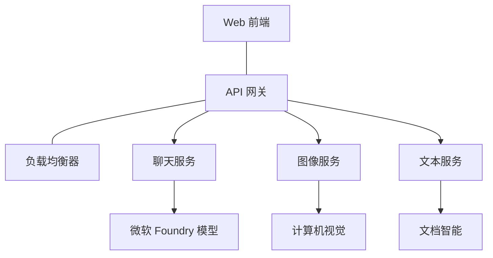

# 使用 AZD 的生产级 AI 工作负载最佳实践

**章节导航：**
- **📚 课程首页**: [AZD 入门](../../README.md)
- **📖 当前章节**: 第 8 章 - 生产与企业模式
- **⬅️ 上一章**: [第 7 章：故障排除](../chapter-07-troubleshooting/debugging.md)
- **⬅️ 关联内容**: [AI 研讨会 实验室](ai-workshop-lab.md)
- **🎯 完成课程**: [AZD 入门](../../README.md)

## 概述

本指南提供使用 Azure Developer CLI (AZD) 部署生产就绪 AI 工作负载的全面最佳实践。基于 Microsoft Foundry Discord 社区的反馈和真实客户部署经验，这些实践针对生产 AI 系统中最常见的挑战提供了应对方案。

## 解决的主要挑战

根据我们的社区投票结果，以下是开发人员面临的主要挑战：

- **45%** 在多服务 AI 部署方面遇到困难
- **38%** 在凭据和机密管理方面存在问题  
- **35%** 觉得生产就绪性和扩展性困难
- **32%** 需要更好的成本优化策略
- **29%** 需要改进监控和故障排查

## 生产级 AI 的架构模式

### 模式 1：微服务 AI 架构

<strong>何时使用</strong>：具有多种功能的复杂 AI 应用



**AZD 实现**：

```yaml
# azure.yaml
name: enterprise-ai-platform
services:
  web:
    project: ./web
    host: staticwebapp
  api-gateway:
    project: ./api-gateway
    host: containerapp
  chat-service:
    project: ./services/chat
    host: containerapp
  vision-service:
    project: ./services/vision
    host: containerapp
  text-service:
    project: ./services/text
    host: containerapp
```

### 模式 2：事件驱动的 AI 处理

<strong>何时使用</strong>：批量处理、文档分析、异步工作流

```bicep
// Event Hub for AI processing pipeline
resource eventHub 'Microsoft.EventHub/namespaces@2023-01-01-preview' = {
  name: eventHubNamespaceName
  location: location
  sku: {
    name: 'Standard'
    tier: 'Standard'
    capacity: 1
  }
}

// Service Bus for reliable message processing
resource serviceBus 'Microsoft.ServiceBus/namespaces@2022-10-01-preview' = {
  name: serviceBusNamespaceName
  location: location
  sku: {
    name: 'Premium'
    tier: 'Premium'
    capacity: 1
  }
}

// Function App for processing
resource functionApp 'Microsoft.Web/sites@2023-01-01' = {
  name: functionAppName
  location: location
  kind: 'functionapp,linux'
  properties: {
    siteConfig: {
      appSettings: [
        {
          name: 'FUNCTIONS_EXTENSION_VERSION'
          value: '~4'
        }
        {
          name: 'AZURE_OPENAI_ENDPOINT'
          value: '@Microsoft.KeyVault(VaultName=${keyVault.name};SecretName=openai-endpoint)'
        }
      ]
    }
  }
}
```

## 关于 AI 代理健康状态的思考

当传统 Web 应用出现故障时，症状是熟悉的：页面无法加载、API 返回错误或部署失败。AI 驱动的应用也会以这些方式失败——但它们也可能以更微妙的方式表现不佳，而不会产生明显的错误消息。

本节帮助你为监控 AI 工作负载建立一个心智模型，这样当情况看起来不对时，你就知道该往哪里查。

### 代理健康与传统应用健康的不同之处

传统应用要么正常，要么不正常。AI 代理可能看起来正常但产生糟糕的结果。将代理健康视为两层：

| 层级 | 检查内容 | 查看位置 |
|-------|--------------|---------------|
| <strong>基础设施健康</strong> | 服务是否在运行？资源是否已配置？端点是否可访问？ | `azd monitor`, Azure 门户 资源健康, 容器/应用 日志 |
| <strong>行为健康</strong> | 代理的响应是否准确？响应是否及时？模型调用是否正确？ | Application Insights 跟踪, 模型调用延迟指标, 响应质量日志 |

基础设施健康是熟悉的——对任何 azd 应用都是相同的。行为健康是 AI 工作负载引入的新层。

### 当 AI 应用表现异常时的排查位置

如果你的 AI 应用没有产生预期结果，下面是一个概念性的检查清单：

1. **从基础开始。** 应用是否在运行？能否访问其依赖项？像对任何应用一样检查 `azd monitor` 和资源健康。
2. **检查模型连接。** 你的应用是否成功调用了 AI 模型？失败或超时的模型调用是 AI 应用问题最常见的原因，并会出现在应用日志中。
3. **查看模型接收到的内容。** AI 的响应取决于输入（提示和任何检索到的上下文）。如果输出错误，通常是输入有问题。检查你的应用是否向模型发送了正确的数据。
4. **审查响应延迟。** AI 模型调用比典型 API 调用慢。如果应用感觉变慢，检查模型响应时间是否增加——这可能表明限流、容量限制或区域级拥塞。
5. **关注成本信号。** 令牌使用或 API 调用的意外激增可能表明存在循环、提示配置错误或过多重试。

你不需要立即精通可观测性工具。关键要点是 AI 应用有一层额外的行为需要监控，而 azd 内置的监控（`azd monitor`）为调查这两层提供了起点。

---

## 安全最佳实践

### 1. 零信任安全模型

<strong>实施策略</strong>：
- 未经身份验证不得进行服务间通信
- 所有 API 调用使用托管标识
- 使用私有端点进行网络隔离
- 最小权限访问控制

```bicep
// Managed Identity for each service
resource chatServiceIdentity 'Microsoft.ManagedIdentity/userAssignedIdentities@2023-01-31' = {
  name: 'chat-service-identity'
  location: location
}

// Role assignments with minimal permissions
resource openAIUserRole 'Microsoft.Authorization/roleAssignments@2022-04-01' = {
  scope: openAIAccount
  name: guid(openAIAccount.id, chatServiceIdentity.id, openAIUserRoleDefinitionId)
  properties: {
    roleDefinitionId: subscriptionResourceId('Microsoft.Authorization/roleDefinitions', '5e0bd9bd-7b93-4f28-af87-19fc36ad61bd')
    principalId: chatServiceIdentity.properties.principalId
    principalType: 'ServicePrincipal'
  }
}
```

### 2. 安全的密钥管理

**Key Vault 集成模式**：

```bicep
// Key Vault with proper access policies
resource keyVault 'Microsoft.KeyVault/vaults@2023-02-01' = {
  name: keyVaultName
  location: location
  properties: {
    tenantId: tenant().tenantId
    sku: {
      family: 'A'
      name: 'premium'  // Use premium for production
    }
    enableRbacAuthorization: true  // Use RBAC instead of access policies
    enablePurgeProtection: true    // Prevent accidental deletion
    enableSoftDelete: true
    softDeleteRetentionInDays: 90
  }
}

// Store all AI service credentials
resource openAIKeySecret 'Microsoft.KeyVault/vaults/secrets@2023-02-01' = {
  parent: keyVault
  name: 'openai-api-key'
  properties: {
    value: openAIAccount.listKeys().key1
    attributes: {
      enabled: true
    }
  }
}
```

### 3. 网络安全

<strong>私有端点配置</strong>：

```bicep
// Virtual Network for AI services
resource virtualNetwork 'Microsoft.Network/virtualNetworks@2023-04-01' = {
  name: vnetName
  location: location
  properties: {
    addressSpace: {
      addressPrefixes: ['10.0.0.0/16']
    }
    subnets: [
      {
        name: 'ai-services-subnet'
        properties: {
          addressPrefix: '10.0.1.0/24'
          privateEndpointNetworkPolicies: 'Disabled'
        }
      }
      {
        name: 'app-services-subnet'
        properties: {
          addressPrefix: '10.0.2.0/24'
          delegations: [
            {
              name: 'Microsoft.Web/serverFarms'
              properties: {
                serviceName: 'Microsoft.Web/serverFarms'
              }
            }
          ]
        }
      }
    ]
  }
}

// Private endpoints for all AI services
resource openAIPrivateEndpoint 'Microsoft.Network/privateEndpoints@2023-04-01' = {
  name: '${openAIAccountName}-pe'
  location: location
  properties: {
    subnet: {
      id: virtualNetwork.properties.subnets[0].id
    }
    privateLinkServiceConnections: [
      {
        name: 'openai-connection'
        properties: {
          privateLinkServiceId: openAIAccount.id
          groupIds: ['account']
        }
      }
    ]
  }
}
```

## 性能和扩展

### 1. 自动扩缩策略

**Container Apps 自动扩缩**：

```bicep
resource containerApp 'Microsoft.App/containerApps@2023-05-01' = {
  name: containerAppName
  location: location
  properties: {
    configuration: {
      ingress: {
        external: true
        targetPort: 8000
        transport: 'http'
      }
    }
    template: {
      scale: {
        minReplicas: 2  // Always have 2 instances minimum
        maxReplicas: 50 // Scale up to 50 for high load
        rules: [
          {
            name: 'http-scaling'
            http: {
              metadata: {
                concurrentRequests: '20'  // Scale when >20 concurrent requests
              }
            }
          }
          {
            name: 'cpu-scaling'
            custom: {
              type: 'cpu'
              metadata: {
                type: 'Utilization'
                value: '70'  // Scale when CPU >70%
              }
            }
          }
        ]
      }
    }
  }
}
```

### 2. 缓存策略

**用于 AI 响应的 Redis 缓存**：

```bicep
// Redis Premium for production workloads
resource redisCache 'Microsoft.Cache/redis@2023-04-01' = {
  name: redisCacheName
  location: location
  properties: {
    sku: {
      name: 'Premium'
      family: 'P'
      capacity: 1
    }
    enableNonSslPort: false
    minimumTlsVersion: '1.2'
    redisConfiguration: {
      'maxmemory-policy': 'allkeys-lru'
    }
    // Enable clustering for high availability
    redisVersion: '6.0'
    shardCount: 2
  }
}

// Cache configuration in application
var cacheConnectionString = '${redisCache.properties.hostName}:6380,password=${redisCache.listKeys().primaryKey},ssl=True,abortConnect=False'
```

### 3. 负载均衡与流量管理

**带 WAF 的 Application Gateway**：

```bicep
// Application Gateway with Web Application Firewall
resource applicationGateway 'Microsoft.Network/applicationGateways@2023-04-01' = {
  name: appGatewayName
  location: location
  properties: {
    sku: {
      name: 'WAF_v2'
      tier: 'WAF_v2'
      capacity: 2
    }
    webApplicationFirewallConfiguration: {
      enabled: true
      firewallMode: 'Prevention'
      ruleSetType: 'OWASP'
      ruleSetVersion: '3.2'
    }
    // Backend pools for AI services
    backendAddressPools: [
      {
        name: 'ai-services-pool'
        properties: {
          backendAddresses: [
            {
              fqdn: '${containerApp.properties.configuration.ingress.fqdn}'
            }
          ]
        }
      }
    ]
  }
}
```

## 💰 成本优化

### 1. 资源规格调整

<strong>按环境的特定配置</strong>：

```bash
# 开发环境
azd env new development
azd env set AZURE_OPENAI_SKU "S0"
azd env set AZURE_OPENAI_CAPACITY 10
azd env set AZURE_SEARCH_SKU "basic"
azd env set CONTAINER_CPU 0.5
azd env set CONTAINER_MEMORY 1.0

# 生产环境
azd env new production
azd env set AZURE_OPENAI_SKU "S0"
azd env set AZURE_OPENAI_CAPACITY 100
azd env set AZURE_SEARCH_SKU "standard"
azd env set CONTAINER_CPU 2.0
azd env set CONTAINER_MEMORY 4.0
```

### 2. 成本监控与预算

```bicep
// Cost management and budgets
resource budget 'Microsoft.Consumption/budgets@2023-05-01' = {
  name: 'ai-workload-budget'
  properties: {
    timePeriod: {
      startDate: '2024-01-01'
      endDate: '2024-12-31'
    }
    timeGrain: 'Monthly'
    amount: 2000  // $2000 monthly budget
    category: 'Cost'
    notifications: {
      warning: {
        enabled: true
        operator: 'GreaterThan'
        threshold: 80
        contactEmails: [
          'finance@company.com'
          'engineering@company.com'
        ]
        contactRoles: [
          'Owner'
          'Contributor'
        ]
      }
      critical: {
        enabled: true
        operator: 'GreaterThan'
        threshold: 95
        contactEmails: [
          'cto@company.com'
        ]
      }
    }
  }
}
```

### 3. 令牌使用优化

**OpenAI 成本管理**：

```typescript
// 应用级别的令牌优化
class TokenOptimizer {
  private readonly maxTokens = 4000;
  private readonly reserveTokens = 500;
  
  optimizePrompt(userInput: string, context: string): string {
    const availableTokens = this.maxTokens - this.reserveTokens;
    const estimatedTokens = this.estimateTokens(userInput + context);
    
    if (estimatedTokens > availableTokens) {
      // 截断上下文，而不是用户输入
      context = this.truncateContext(context, availableTokens - this.estimateTokens(userInput));
    }
    
    return `${context}\n\nUser: ${userInput}`;
  }
  
  private estimateTokens(text: string): number {
    // 粗略估计：1 个令牌 ≈ 4 个字符
    return Math.ceil(text.length / 4);
  }
}
```

## 监控与可观测性

### 1. 全面的 Application Insights

```bicep
// Application Insights with advanced features
resource applicationInsights 'Microsoft.Insights/components@2020-02-02' = {
  name: applicationInsightsName
  location: location
  kind: 'web'
  properties: {
    Application_Type: 'web'
    WorkspaceResourceId: logAnalyticsWorkspace.id
    SamplingPercentage: 100  // Full sampling for AI apps
    DisableIpMasking: false  // Enable for security
  }
}

// Custom metrics for AI operations
resource aiMetricAlerts 'Microsoft.Insights/metricAlerts@2018-03-01' = {
  name: 'ai-high-error-rate'
  location: 'global'
  properties: {
    description: 'Alert when AI service error rate is high'
    severity: 2
    enabled: true
    scopes: [
      applicationInsights.id
    ]
    evaluationFrequency: 'PT1M'
    windowSize: 'PT5M'
    criteria: {
      'odata.type': 'Microsoft.Azure.Monitor.SingleResourceMultipleMetricCriteria'
      allOf: [
        {
          name: 'high-error-rate'
          metricName: 'requests/failed'
          operator: 'GreaterThan'
          threshold: 10
          timeAggregation: 'Count'
        }
      ]
    }
  }
}
```

### 2. AI 特定监控

**AI 指标的自定义仪表板**：

```json
// Dashboard configuration for AI workloads
{
  "dashboard": {
    "name": "AI Application Monitoring",
    "tiles": [
      {
        "name": "OpenAI Request Volume",
        "query": "requests | where name contains 'openai' | summarize count() by bin(timestamp, 5m)"
      },
      {
        "name": "AI Response Latency",
        "query": "requests | where name contains 'openai' | summarize avg(duration) by bin(timestamp, 5m)"
      },
      {
        "name": "Token Usage",
        "query": "customMetrics | where name == 'openai_tokens_used' | summarize sum(value) by bin(timestamp, 1h)"
      },
      {
        "name": "Cost per Hour",
        "query": "customMetrics | where name == 'openai_cost' | summarize sum(value) by bin(timestamp, 1h)"
      }
    ]
  }
}
```

### 3. 健康检查与正常运行时间监控

```bicep
// Application Insights availability tests
resource availabilityTest 'Microsoft.Insights/webtests@2022-06-15' = {
  name: 'ai-app-availability-test'
  location: location
  tags: {
    'hidden-link:${applicationInsights.id}': 'Resource'
  }
  properties: {
    SyntheticMonitorId: 'ai-app-availability-test'
    Name: 'AI Application Availability Test'
    Description: 'Tests AI application endpoints'
    Enabled: true
    Frequency: 300  // 5 minutes
    Timeout: 120    // 2 minutes
    Kind: 'ping'
    Locations: [
      {
        Id: 'us-east-2-azr'
      }
      {
        Id: 'us-west-2-azr'
      }
    ]
    Configuration: {
      WebTest: '''
        <WebTest Name="AI Health Check" 
                 Id="8d2de8d2-a2b0-4c2e-9a0d-8f9c9a0b8c8d" 
                 Enabled="True" 
                 CssProjectStructure="" 
                 CssIteration="" 
                 Timeout="120" 
                 WorkItemIds="" 
                 xmlns="http://microsoft.com/schemas/VisualStudio/TeamTest/2010" 
                 Description="" 
                 CredentialUserName="" 
                 CredentialPassword="" 
                 PreAuthenticate="True" 
                 Proxy="default" 
                 StopOnError="False" 
                 RecordedResultFile="" 
                 ResultsLocale="">
          <Items>
            <Request Method="GET" 
                     Guid="a5f10126-e4cd-570d-961c-cea43999a200" 
                     Version="1.1" 
                     Url="${webApp.properties.defaultHostName}/health" 
                     ThinkTime="0" 
                     Timeout="120" 
                     ParseDependentRequests="True" 
                     FollowRedirects="True" 
                     RecordResult="True" 
                     Cache="False" 
                     ResponseTimeGoal="0" 
                     Encoding="utf-8" 
                     ExpectedHttpStatusCode="200" 
                     ExpectedResponseUrl="" 
                     ReportingName="" 
                     IgnoreHttpStatusCode="False" />
          </Items>
        </WebTest>
      '''
    }
  }
}
```

## 灾难恢复与高可用性

### 1. 多区域部署

```yaml
# azure.yaml - Multi-region configuration
name: ai-app-multiregion
services:
  api-primary:
    project: ./api
    host: containerapp
    env:
      - AZURE_REGION=eastus
  api-secondary:
    project: ./api
    host: containerapp
    env:
      - AZURE_REGION=westus2
```

```bicep
// Traffic Manager for global load balancing
resource trafficManager 'Microsoft.Network/trafficManagerProfiles@2022-04-01' = {
  name: trafficManagerProfileName
  location: 'global'
  properties: {
    profileStatus: 'Enabled'
    trafficRoutingMethod: 'Priority'
    dnsConfig: {
      relativeName: trafficManagerProfileName
      ttl: 30
    }
    monitorConfig: {
      protocol: 'HTTPS'
      port: 443
      path: '/health'
      intervalInSeconds: 30
      toleratedNumberOfFailures: 3
      timeoutInSeconds: 10
    }
    endpoints: [
      {
        name: 'primary-endpoint'
        type: 'Microsoft.Network/trafficManagerProfiles/azureEndpoints'
        properties: {
          targetResourceId: primaryAppService.id
          endpointStatus: 'Enabled'
          priority: 1
        }
      }
      {
        name: 'secondary-endpoint'
        type: 'Microsoft.Network/trafficManagerProfiles/azureEndpoints'
        properties: {
          targetResourceId: secondaryAppService.id
          endpointStatus: 'Enabled'
          priority: 2
        }
      }
    ]
  }
}
```

### 2. 数据备份与恢复

```bicep
// Backup configuration for critical data
resource backupVault 'Microsoft.DataProtection/backupVaults@2023-05-01' = {
  name: backupVaultName
  location: location
  identity: {
    type: 'SystemAssigned'
  }
  properties: {
    storageSettings: [
      {
        datastoreType: 'VaultStore'
        type: 'LocallyRedundant'
      }
    ]
  }
}

// Backup policy for AI models and data
resource backupPolicy 'Microsoft.DataProtection/backupVaults/backupPolicies@2023-05-01' = {
  parent: backupVault
  name: 'ai-data-backup-policy'
  properties: {
    policyRules: [
      {
        backupParameters: {
          backupType: 'Full'
          objectType: 'AzureBackupParams'
        }
        trigger: {
          schedule: {
            repeatingTimeIntervals: [
              'R/2024-01-01T02:00:00+00:00/P1D'  // Daily at 2 AM
            ]
          }
          objectType: 'ScheduleBasedTriggerContext'
        }
        dataStore: {
          datastoreType: 'VaultStore'
          objectType: 'DataStoreInfoBase'
        }
        name: 'BackupDaily'
        objectType: 'AzureBackupRule'
      }
    ]
  }
}
```

## DevOps 与 CI/CD 集成

### 1. GitHub Actions 工作流

```yaml
# .github/workflows/deploy-ai-app.yml
name: Deploy AI Application

on:
  push:
    branches: [main]
  pull_request:
    branches: [main]

jobs:
  test:
    runs-on: ubuntu-latest
    steps:
      - uses: actions/checkout@v4
      
      - name: Setup Python
        uses: actions/setup-python@v4
        with:
          python-version: '3.11'
          
      - name: Install dependencies
        run: |
          pip install -r requirements.txt
          pip install pytest
          
      - name: Run tests
        run: pytest tests/
        
      - name: AI Safety Tests
        run: |
          python scripts/test_ai_safety.py
          python scripts/validate_prompts.py

  deploy-staging:
    needs: test
    if: github.event_name == 'pull_request'
    runs-on: ubuntu-latest
    steps:
      - uses: actions/checkout@v4
      
      - name: Setup AZD
        uses: Azure/setup-azd@v2
        
      - name: Login to Azure
        uses: azure/login@v1
        with:
          creds: ${{ secrets.AZURE_CREDENTIALS }}
          
      - name: Deploy to Staging
        run: |
          azd env select staging
          azd deploy

  deploy-production:
    needs: test
    if: github.ref == 'refs/heads/main'
    runs-on: ubuntu-latest
    steps:
      - uses: actions/checkout@v4
      
      - name: Setup AZD
        uses: Azure/setup-azd@v2
        
      - name: Login to Azure
        uses: azure/login@v1
        with:
          creds: ${{ secrets.AZURE_CREDENTIALS }}
          
      - name: Deploy to Production
        run: |
          azd env select production
          azd deploy
          
      - name: Run Production Health Checks
        run: |
          python scripts/health_check.py --env production
```

### 2. 基础设施验证

```bash
# scripts/validate_infrastructure.sh
#!/bin/bash

echo "Validating AI infrastructure deployment..."

# 检查所有必需的服务是否正在运行
services=("openai" "search" "storage" "keyvault")
for service in "${services[@]}"; do
    echo "Checking $service..."
    if ! az resource list --resource-type "Microsoft.CognitiveServices/accounts" --query "[?contains(name, '$service')]" -o tsv; then
        echo "ERROR: $service not found"
        exit 1
    fi
done

# 验证 OpenAI 模型部署
echo "Validating OpenAI model deployments..."
models=$(az cognitiveservices account deployment list --name $AZURE_OPENAI_NAME --resource-group $AZURE_RESOURCE_GROUP --query "[].name" -o tsv)
if [[ ! $models == *"gpt-4.1-mini"* ]]; then
  echo "ERROR: Required model gpt-4.1-mini not deployed"
    exit 1
fi

# 测试 AI 服务的连通性
echo "Testing AI service connectivity..."
python scripts/test_connectivity.py

echo "Infrastructure validation completed successfully!"
```

## 生产就绪清单

### 安全 ✅
- [ ] 所有服务使用托管标识
- [ ] 密钥存储在 Key Vault 中
- [ ] 已配置私有端点
- [ ] 已实施网络安全组
- [ ] 基于角色的访问控制（RBAC），遵循最小权限
- [ ] 对公共端点启用 WAF

### 性能 ✅
- [ ] 已配置自动扩缩
- [ ] 已实现缓存
- [ ] 已设置负载均衡
- [ ] 静态内容使用 CDN
- [ ] 数据库连接池
- [ ] 令牌使用优化

### 监控 ✅
- [ ] 已配置 Application Insights
- [ ] 已定义自定义指标
- [ ] 已设置告警规则
- [ ] 已创建仪表板
- [ ] 已实现健康检查
- [ ] 日志保留策略

### 可靠性 ✅
- [ ] 多区域部署
- [ ] 备份与恢复计划
- [ ] 已实现断路器
- [ ] 已配置重试策略
- [ ] 优雅降级
- [ ] 健康检查端点

### 成本管理 ✅
- [ ] 已配置预算告警
- [ ] 资源规格调整
- [ ] 已应用开发/测试折扣
- [ ] 已购买预留实例
- [ ] 成本监控仪表板
- [ ] 定期成本评审

### 合规 ✅
- [ ] 满足数据驻留要求
- [ ] 启用审计日志
- [ ] 已应用合规策略
- [ ] 已实施安全基线
- [ ] 定期安全评估
- [ ] 事件响应计划

## 性能基准

### 典型生产指标

| 指标 | 目标 | 监控方法 |
|--------|--------|------------|
| <strong>响应时间</strong> | < 2 seconds | Application Insights |
| <strong>可用性</strong> | 99.9% | 正常运行时间监控 |
| <strong>错误率</strong> | < 0.1% | 应用日志 |
| <strong>令牌使用量</strong> | < $500/月 | 成本管理 |
| <strong>并发用户</strong> | 1000+ | 压力测试 |
| <strong>恢复时间</strong> | < 1 小时 | 灾难恢复测试 |

### 负载测试

```bash
# 用于 AI 应用的负载测试脚本
python scripts/load_test.py \
  --endpoint https://your-ai-app.azurewebsites.net \
  --concurrent-users 100 \
  --duration 300 \
  --ramp-up 60
```

## 🤝 社区最佳实践

基于 Microsoft Foundry Discord 社区的反馈：

### 社区的主要建议：

1. **小规模起步，逐步扩展**：从基础 SKU 开始，根据实际使用情况扩展
2. <strong>全面监控</strong>：从第一天就建立全面的监控
3. <strong>自动化安全</strong>：使用基础设施即代码以保持安全一致性
4. <strong>彻底测试</strong>：在管道中加入 AI 特定的测试
5. <strong>成本规划</strong>：监控令牌使用并及早设置预算告警

### 常见的陷阱（避免）：

- ❌ 在代码中硬编码 API 密钥
- ❌ 未设置适当的监控
- ❌ 忽视成本优化
- ❌ 未测试故障场景
- ❌ 未部署健康检查

## AZD AI CLI 命令与扩展

AZD 包含一组不断增长的 AI 专用命令和扩展，简化了生产级 AI 工作流。这些工具弥合了 AI 工作负载的本地开发与生产部署之间的差距。

### AZD 的 AI 扩展

AZD 使用扩展系统来添加 AI 特定功能。使用以下命令安装和管理扩展：

```bash
# 列出所有可用的扩展（包括 AI）
azd extension list

# 查看已安装扩展的详细信息
azd extension show azure.ai.agents

# 安装 Foundry agents 扩展
azd extension install azure.ai.agents

# 安装微调扩展
azd extension install azure.ai.finetune

# 安装自定义模型扩展
azd extension install azure.ai.models

# 升级所有已安装的扩展
azd extension upgrade --all
```

**可用的 AI 扩展：**

| 扩展 | 用途 | 状态 |
|-----------|---------|--------|
| `azure.ai.agents` | Foundry Agent 服务管理 | 预览 |
| `azure.ai.skills` | 可重用的代理技能 | 预览 |
| `azure.ai.connections` | Foundry 连接（数据源、工具） | 预览 |
| `azure.ai.finetune` | Foundry 模型微调 | 预览 |
| `azure.ai.models` | Foundry 自定义模型 | 预览 |
| `azure.coding-agent` | 编码代理配置 | 可用 |

> `azure.ai.agents` 扩展更新很快。本课程以 `0.1.40-preview` 为验证版本。运行 `azd extension upgrade --all` 以获取最新的命令集，并运行 `azd extension show azure.ai.agents` 来确认你安装的版本。

**什么是较新的 `skills` 和 `connections` 扩展？**

两款预览扩展与代理工具同时出现，即使是初学者也值得了解：

- **`azure.ai.skills`** — 一个 **skill（技能）** 是一个可重用的能力（一个打包的工具或行为），你可以将其附加到一个或多个代理上，而不是每次重复实现。把它看作一个共享构建块：定义一次“搜索文档”或“查询订单”等技能，然后在代理之间重用。这能让多代理系统（第 5 章）保持一致，避免复制粘贴。
- **`azure.ai.connections`** — 一个 **connection（连接）** 是从你的 Foundry 项目到代理所需外部资源的托管链接——一个数据源（如 Azure AI Search）、一个工具端点或另一个服务。连接集中管理代理访问数据的“位置”和“方式”，使凭据和端点集中在一个受管理的位置，而不是散落在代码中。

你不需要这些来部署你的第一个代理——在学习阶段坚持使用 `azure.ai.agents` 即可。当你发现自己在代理之间重复相同工具时，考虑使用 `skills`；当多个代理共享相同数据源时，使用 `connections`。

### 使用 `azd ai agent init` 初始化代理项目

`azd ai agent init` 命令为集成 Microsoft Foundry Agent Service 的生产就绪 AI 代理项目生成脚手架：

```bash
# 从代理清单初始化一个新的代理项目
azd ai agent init -m <manifest-path-or-uri>

# 初始化并将目标设置为特定的 Foundry 项目
azd ai agent init -m agent-manifest.yaml --project-id <foundry-project-id>

# 使用自定义源目录初始化
azd ai agent init -m agent-manifest.yaml --src ./agents/my-agent

# 将 Container Apps 作为主机
azd ai agent init -m agent-manifest.yaml --host containerapp
```

**关键标志：**

| 标志 | 描述 |
|------|-------------|
| `-m, --manifest` | 指向要添加到项目的代理清单的路径或 URI |
| `-p, --project-id` | 用于 azd 环境的现有 Microsoft Foundry 项目 ID |
| `-s, --src` | 用于下载代理定义的目录（默认值为 `src/<agent-id>`） |
| `--host` | 覆盖默认主机（例如，`containerapp`） |
| `-e, --environment` | 要使用的 azd 环境 |

<strong>生产提示</strong>：使用 `--project-id` 直接连接到现有的 Foundry 项目，从一开始就保持代理代码和云资源的关联。

### 管理代理生命周期

除了 `init` 之外，`azure.ai.agents` 扩展还提供托管代理完整生命周期的命令——测试、评估、优化与退役：

```bash
# 调用已部署的代理并查看服务器响应时间
# (总延迟和首字节时间)
azd ai agent invoke

# 在更改之前显示实时端点配置
azd ai agent endpoint show

# 为代理生成评估数据集
azd ai agent eval generate --dataset ./eval/dataset.jsonl

# 针对您的评估数据优化代理指令
# (需要在代理项目中有 optimization_model)
azd ai agent optimize

# 下载基于代码的托管代理的已部署源代码
# (带有 SHA-256 验证)
azd ai agent code download

# 删除一个托管代理及其所有版本
# (--force 会终止活动会话)
azd ai agent delete --force
```

**生命周期一览：**

| 阶段 | 命令 | 生产用途 |
|-------|---------|----------------|
| Test | `azd ai agent invoke` | 在发布前验证响应并测量延迟 |
| Inspect | `azd ai agent endpoint show` | 审查端点认证/配置；及早发现破坏性更改 |
| Measure | `azd ai agent eval generate` | 从真实跟踪构建可重复的评估集 |
| Improve | `azd ai agent optimize` | 根据测量到的质量调整指令 |
| Recover | `azd ai agent code download` | 检索已部署的精确源代码以进行审计/回滚 |
| Retire | `azd ai agent delete --force` | 干净地删除代理及其版本 |

> 这些是预览命令，可能会在扩展版本之间发生变化。运行 `azd ai agent --help` 查看你已安装版本中可用的确切子命令。

### 使用 `azd mcp` 的模型上下文协议（MCP）
AZD 包含内置的 MCP 服务器支持（Alpha），使 AI 代理和工具能够通过标准化协议与您的 Azure 资源交互：

```bash
# 为你的项目启动 MCP 服务器
azd mcp start

# 审查当前 Copilot 关于工具执行的同意规则
azd copilot consent list
```

MCP 服务器将您的 azd 项目上下文——环境、服务和 Azure 资源——暴露给 AI 驱动的开发工具。这使得：

- **AI-assisted deployment**：允许编码代理查询您的项目状态并触发部署
- **Resource discovery**：AI 工具可以发现您的项目使用了哪些 Azure 资源
- **Environment management**：代理可以在开发/预发布/生产环境之间切换

### Infrastructure Generation with `azd infra generate`

对于生产环境的 AI 工作负载，您可以生成并自定义基础设施即代码，而不是依赖自动配置：

```bash
# 根据您的项目定义生成 Bicep/Terraform 文件
azd infra generate
```

这会将 IaC 写入磁盘，以便您可以：
- 在部署之前审查和审核基础设施
- 添加自定义安全策略（网络规则、私有终结点）
- 与现有的 IaC 审查流程集成
- 将基础设施变更与应用代码分开进行版本控制

### Production Lifecycle Hooks

AZD 钩子让您在部署生命周期的每个阶段注入自定义逻辑——这对于生产 AI 工作流程至关重要：

```yaml
# azure.yaml - Production hooks example
name: ai-production-app
hooks:
  preprovision:
    shell: sh
    run: scripts/validate-quotas.sh    # Check AI model quota before provisioning
  postprovision:
    shell: sh
    run: scripts/configure-networking.sh  # Set up private endpoints
  predeploy:
    shell: sh
    run: scripts/run-ai-safety-tests.sh  # Run prompt safety checks
  postdeploy:
    shell: sh
    run: scripts/smoke-test.sh           # Verify agent responses post-deploy
services:
  agent-api:
    project: ./src/agent
    host: containerapp
    hooks:
      predeploy:
        shell: sh
        run: scripts/validate-model-access.sh  # Per-service hook
```

```bash
# 在开发过程中手动运行特定的钩子
azd hooks run predeploy
```

**推荐用于 AI 工作负载的生产钩子：**

| 钩子 | 用例 |
|------|----------|
| `preprovision` | 验证订阅配额以满足 AI 模型容量 |
| `postprovision` | 配置私有终结点，部署模型权重 |
| `predeploy` | 运行 AI 安全测试，验证提示模板 |
| `postdeploy` | 对代理响应进行冒烟测试，验证模型连接性 |

### CI/CD Pipeline Configuration

使用 `azd pipeline config` 将您的项目连接到 GitHub Actions 或 Azure Pipelines，并提供安全的 Azure 身份验证：

```bash
# 配置 CI/CD 流水线（交互式）
azd pipeline config

# 使用特定提供商进行配置
azd pipeline config --provider github
```

此命令：
- 创建具有最小权限访问的服务主体
- 配置联合凭据（不存储机密）
- 生成或更新管道定义文件
- 在您的 CI/CD 系统中设置所需的环境变量

#### Step-by-step: your first GitHub Actions pipeline

以下是从一个可工作的 azd 项目到在每次 push 时自动部署的完整流程。

**1. Make sure your project is on GitHub**

```bash
git init
git add .
git commit -m "Initial azd project"
gh repo create my-ai-app --private --source=. --push
```

**2. Run pipeline config**

```bash
azd pipeline config --provider github
```

azd 将以交互方式：
- 询问要针对哪个 Azure 订阅和环境
- 为管道创建 Entra **应用注册 + 服务主体**
- 设置 **联合凭据（OIDC）**——因此 GitHub 使用短期令牌对 Azure 进行身份验证，且<strong>不存储机密</strong>
- 将所需的<strong>变量</strong>推送到您的 GitHub 仓库（`AZURE_CLIENT_ID`, `AZURE_TENANT_ID`, `AZURE_SUBSCRIPTION_ID`, `AZURE_ENV_NAME`, `AZURE_LOCATION`）

**3. Understand the generated workflow**

azd 会添加 `.github/workflows/azure-dev.yml`。关键部分如下所示：

```yaml
# .github/workflows/azure-dev.yml
on:
  push:
    branches: [ main ]
  workflow_dispatch:        # lets you run it manually too

permissions:
  id-token: write           # required for OIDC federated login
  contents: read

jobs:
  build:
    runs-on: ubuntu-latest
    env:
      AZURE_CLIENT_ID: ${{ vars.AZURE_CLIENT_ID }}
      AZURE_TENANT_ID: ${{ vars.AZURE_TENANT_ID }}
      AZURE_SUBSCRIPTION_ID: ${{ vars.AZURE_SUBSCRIPTION_ID }}
      AZURE_ENV_NAME: ${{ vars.AZURE_ENV_NAME }}
      AZURE_LOCATION: ${{ vars.AZURE_LOCATION }}
    steps:
      - uses: actions/checkout@v4
      - name: Install azd
        uses: Azure/setup-azd@v2
      - name: Log in with OIDC
        run: azd auth login --client-id "$AZURE_CLIENT_ID" --federated-credential-provider "github" --tenant-id "$AZURE_TENANT_ID"
      - name: Provision infrastructure
        run: azd provision --no-prompt
      - name: Deploy application
        run: azd deploy --no-prompt
```

**4. Verify it works**

```bash
# 推送更改以触发流水线
git commit -am "Trigger pipeline" --allow-empty
git push
```

打开您 GitHub 仓库中的 **Actions** 选项卡，观察工作流自动运行 `azd provision` 和 `azd deploy`。

> **为什么联合凭据很重要：** 旧的管道会在 GitHub 中存储客户端密钥。OIDC 联合凭据完全消除了该密钥——GitHub 在运行时请求短期令牌，这既更安全，也无需轮换或泄露。`azd pipeline config` 默认会设置此项。

> **机密 vs. 变量：** 非敏感标识符（`AZURE_CLIENT_ID` 等）放在仓库的<strong>变量</strong>中。如果您的应用在构建时确实需要一个机密，请将其作为 GitHub **secret** 添加并使用 `${{ secrets.NAME }}` 引用——但在运行时优先使用 Key Vault + 托管身份（参见 [第3章](../chapter-03-configuration/authsecurity.md)）。

**Production workflow with pipeline config:**

```bash
# 1. 设置生产环境
azd env new production
azd env set AZURE_OPENAI_CAPACITY 100

# 2. 配置流水线
azd pipeline config --provider github

# 3. 每次向 main 分支推送时，流水线都会运行 azd deploy
```

#### Step-by-step: Azure DevOps Pipelines

更偏好 Azure DevOps 而不是 GitHub Actions？azd 通过 `azdo` 提供程序原生支持。流程几乎相同——azd 会生成管道文件、创建服务连接并配置身份验证。

**1. Make sure you have an Azure DevOps project**

您需要在 `https://dev.azure.com/<your-org>` 拥有一个组织和一个项目。生成一个具有 **Build (Read & execute)**、**Code (Read & write)** 和 **Service Connections (Read, query & manage)** 范围的个人访问令牌（PAT）——azd 会提示您输入该令牌。

**2. Configure the pipeline**

```bash
azd pipeline config --provider azdo
```

azd 将会：
- 询问您的 Azure DevOps 组织和项目
- 使用服务主体创建（或重用）到 Azure 的 <strong>服务连接</strong>
- 配置 **工作负载身份联合（OIDC）**，以便不存储客户端密钥
- 将 `azure-dev.yml` 管道定义提交到您的仓库

**3. Review the generated `azure-dev.yml`**

azd 会写入一个在每次推送到 `main` 时进行预配和部署的管道：

```yaml
# azure-dev.yml
trigger:
  - main

pool:
  vmImage: ubuntu-latest

steps:
  - task: setup-azd@1
    displayName: Install azd

  - script: azd provision --no-prompt
    displayName: Provision Infrastructure
    env:
      AZURE_SUBSCRIPTION_ID: $(AZURE_SUBSCRIPTION_ID)
      AZURE_ENV_NAME: $(AZURE_ENV_NAME)
      AZURE_LOCATION: $(AZURE_LOCATION)

  - script: azd deploy --no-prompt
    displayName: Deploy Application
    env:
      AZURE_SUBSCRIPTION_ID: $(AZURE_SUBSCRIPTION_ID)
      AZURE_ENV_NAME: $(AZURE_ENV_NAME)
      AZURE_LOCATION: $(AZURE_LOCATION)
```

**4. Where the variables come from**

azd 将环境值（`AZURE_ENV_NAME`、`AZURE_LOCATION`、`AZURE_SUBSCRIPTION_ID`）作为 Azure DevOps 中的<strong>变量组</strong>存储，以便管道可以读取它们。您可以在 **Pipelines → Library** 中查看和编辑它们。

> **与 GitHub 相同的 OIDC 优势：** `azdo` 提供程序同样默认配置工作负载身份联合，因此服务连接中不会存储客户端密钥——Azure DevOps 在运行时交换短期令牌。只有当您的组织尚不能使用 OIDC 时才传递 `--auth-type client-credentials`。

**5. Run it**

```bash
git commit -am "Add Azure DevOps pipeline" --allow-empty
git push
```

在 Azure DevOps 中打开 **Pipelines**，以观察 `azd provision` 和 `azd deploy` 的运行。

### Adding Components with `azd add`

将 Azure 服务逐步添加到现有项目：

```bash
# 以交互方式添加一个新的服务组件
azd add
```

这对于扩展生产 AI 应用特别有用——例如，向现有部署添加向量搜索服务、新的代理端点或监控组件。

## Additional Resources

- **Azure 最佳架构框架**： [AI 工作负载指南](https://learn.microsoft.com/azure/well-architected/ai/)
- **Microsoft Foundry 文档**： [官方文档](https://learn.microsoft.com/azure/ai-studio/)
- <strong>社区模板</strong>： [Azure 示例](https://github.com/Azure-Samples)
- **Discord 社区**： [#Azure 频道](https://discord.gg/microsoft-azure)
- **Agent Skills for Azure**： [microsoft/github-copilot-for-azure on skills.sh](https://skills.sh/microsoft/github-copilot-for-azure) - 包含 37 个面向 Azure AI、Foundry、部署、成本优化和诊断的开放代理技能。在您的编辑器中安装：
  ```bash
  npx skills add microsoft/github-copilot-for-azure
  ```

---

**章节导航：**
- **📚 课程主页**： [AZD For Beginners](../../README.md)
- **📖 当前章节**： 第8章 - 生产与企业模式
- **⬅️ 上一章**： [第7章：故障排除](../chapter-07-troubleshooting/debugging.md)
- **⬅️ 相关内容**： [AI Workshop Lab](ai-workshop-lab.md)
- **� 课程完成**： [AZD For Beginners](../../README.md)

<strong>记住</strong>：生产 AI 工作负载需要仔细规划、监控和持续优化。从这些模式开始，并根据您的特定需求进行调整。

---

<!-- CO-OP TRANSLATOR DISCLAIMER START -->
**免责声明**：
本文件由 AI 翻译服务 [Co-op Translator](https://github.com/Azure/co-op-translator) 翻译完成。尽管我们力求准确，但请注意，自动翻译可能包含错误或不准确之处。原始语言版文件应视为权威来源。对于重要信息，建议使用专业人工翻译。我们对因使用本翻译而产生的任何误解或误释不承担责任。
<!-- CO-OP TRANSLATOR DISCLAIMER END -->