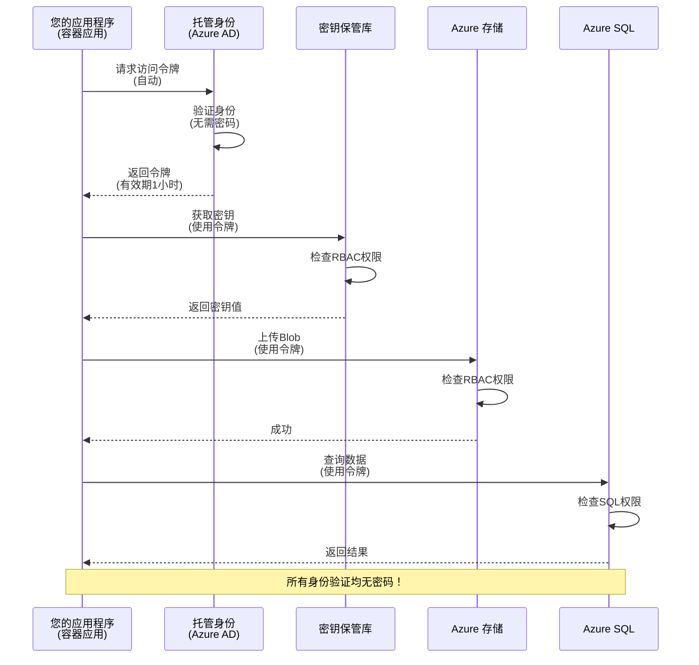
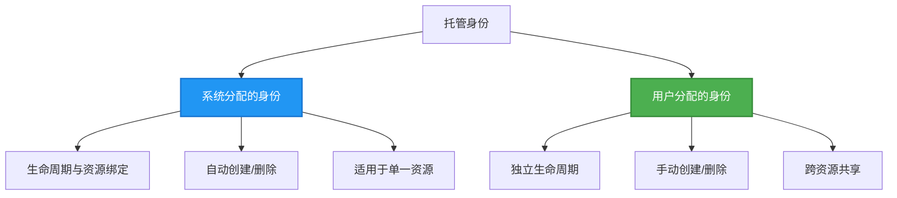

# 身份验证模式与托管身份

⏱️ **预计时间**：45-60分钟 | 💰 **成本影响**：免费（无额外费用） | ⭐ **复杂度**：中级

**📚 学习路径：**
- ← 上一节：[配置管理](configuration.md) - 管理环境变量和密钥
- 🎯 **当前章节**：身份验证与安全（托管身份、Key Vault、安全模式）
- → 下一节：[第一个项目](first-project.md) - 构建你的第一个AZD应用
- 🏠 [课程主页](../../README.md)

---

## 你将学到什么

完成本课程后，你将能够：
- 了解Azure身份验证模式（密钥、连接字符串、托管身份）
- 实现**托管身份**以实现无密码身份验证
- 通过**Azure Key Vault**集成保护密钥
- 配置**基于角色的访问控制（RBAC）**以进行AZD部署
- 在容器应用和Azure服务中应用安全最佳实践
- 从基于密钥的身份验证迁移到基于身份的身份验证

## 为什么托管身份很重要

### 问题：传统身份验证

**托管身份之前：**
```javascript
// ❌ 安全风险：代码中硬编码的秘密
const connectionString = "Server=mydb.database.windows.net;User=admin;Password=P@ssw0rd123";
const storageKey = "xK7mN9pQ2wR5tY8uI0oP3aS6dF1gH4jK...";
const cosmosKey = "C2x7B9n4M1p8Q5w3E6r0T2y5U8i1O4p7...";
```

**问题：**
- 🔴 **代码、配置文件、环境变量中暴露的密钥**
- 🔴 **凭据轮换**需要修改代码并重新部署
- 🔴 **审计难题** - 谁在何时访问了什么？
- 🔴 **分散** - 密钥分布在多个系统中
- 🔴 **合规风险** - 无法通过安全审计

### 解决方案：托管身份

**托管身份之后：**
```javascript
// ✅ 安全：代码中没有秘密
const credential = new DefaultAzureCredential();
const client = new BlobServiceClient(
  "https://mystorageaccount.blob.core.windows.net",
  credential  // Azure 自动处理身份验证
);
```

**优势：**
- ✅ **代码或配置中无密钥**
- ✅ **自动轮换** - 由Azure处理
- ✅ **完整的审计记录**在Azure AD日志中
- ✅ **集中化安全管理** - 在Azure门户中管理
- ✅ **符合合规要求** - 满足安全标准

**类比**：传统身份验证就像为不同的门携带多个实体钥匙。托管身份就像拥有一张安全徽章，根据你的身份自动授予访问权限——无需担心钥匙丢失、复制或轮换。

---

## 架构概览

### 使用托管身份的身份验证流程


### 托管身份的类型


| 特性 | 系统分配 | 用户分配 |
|------|----------|----------|
| **生命周期** | 与资源绑定 | 独立 |
| **创建方式** | 随资源自动创建 | 手动创建 |
| **删除方式** | 随资源删除 | 资源删除后仍存在 |
| **共享性** | 仅限一个资源 | 多个资源共享 |
| **使用场景** | 简单场景 | 复杂多资源场景 |
| **AZD默认** | ✅ 推荐 | 可选 |

---

## 前提条件

### 必需工具

你应该已经从之前的课程中安装了以下工具：

```bash
# 验证 Azure Developer CLI
azd version
# ✅ 预期：azd 版本 1.0.0 或更高

# 验证 Azure CLI
az --version
# ✅ 预期：azure-cli 2.50.0 或更高
```

### Azure要求

- 活跃的Azure订阅
- 权限包括：
  - 创建托管身份
  - 分配RBAC角色
  - 创建Key Vault资源
  - 部署容器应用

### 知识前提

你应该已经完成：
- [安装指南](installation.md) - AZD设置
- [AZD基础知识](azd-basics.md) - 核心概念
- [配置管理](configuration.md) - 环境变量

---

## 第一课：理解身份验证模式

### 模式1：连接字符串（传统 - 避免使用）

**工作原理：**
```bash
# 连接字符串包含凭据
STORAGE_CONNECTION_STRING="DefaultEndpointsProtocol=https;AccountName=myaccount;AccountKey=xK7mN9pQ2wR5..."
COSMOS_CONNECTION_STRING="AccountEndpoint=https://myaccount.documents.azure.com:443/;AccountKey=C2x7..."
SQL_CONNECTION_STRING="Server=myserver.database.windows.net;User=admin;Password=P@ssw0rd..."
```

**问题：**
- ❌ 环境变量中可见的密钥
- ❌ 部署系统中记录的密钥
- ❌ 难以轮换
- ❌ 无访问审计记录

**使用场景：**仅用于本地开发，绝不用于生产环境。

---

### 模式2：Key Vault引用（更好）

**工作原理：**
```bicep
// Store secret in Key Vault
resource keyVault 'Microsoft.KeyVault/vaults@2023-02-01' = {
  name: 'mykv'
  properties: {
    enableRbacAuthorization: true
  }
}

// Reference in Container App
env: [
  {
    name: 'STORAGE_KEY'
    secretRef: 'storage-key'  // References Key Vault
  }
]
```

**优势：**
- ✅ 密钥安全存储在Key Vault中
- ✅ 集中化密钥管理
- ✅ 无需修改代码即可轮换

**限制：**
- ⚠️ 仍然使用密钥/密码
- ⚠️ 需要管理Key Vault访问权限

**使用场景：**从连接字符串过渡到托管身份的中间步骤。

---

### 模式3：托管身份（最佳实践）

**工作原理：**
```bicep
// Enable managed identity
resource containerApp 'Microsoft.App/containerApps@2023-05-01' = {
  name: 'myapp'
  identity: {
    type: 'SystemAssigned'  // Automatically creates identity
  }
}

// Grant permissions
resource roleAssignment 'Microsoft.Authorization/roleAssignments@2022-04-01' = {
  scope: storageAccount
  properties: {
    roleDefinitionId: storageBlobDataContributorRole
    principalId: containerApp.identity.principalId
  }
}
```

**应用代码：**
```javascript
// 不需要秘密！
const { DefaultAzureCredential } = require('@azure/identity');
const { BlobServiceClient } = require('@azure/storage-blob');

const credential = new DefaultAzureCredential();
const blobServiceClient = new BlobServiceClient(
  'https://mystorageaccount.blob.core.windows.net',
  credential
);
```

**优势：**
- ✅ 代码/配置中无密钥
- ✅ 自动凭据轮换
- ✅ 完整的审计记录
- ✅ 基于RBAC的权限
- ✅ 符合合规要求

**使用场景：**始终用于生产应用。

---

## 第二课：使用AZD实现托管身份

### 实现步骤

让我们构建一个安全的容器应用，使用托管身份访问Azure存储和Key Vault。

### 项目结构

```
secure-app/
├── azure.yaml                 # AZD configuration
├── infra/
│   ├── main.bicep            # Main infrastructure
│   ├── core/
│   │   ├── identity.bicep    # Managed identity setup
│   │   ├── keyvault.bicep    # Key Vault configuration
│   │   └── storage.bicep     # Storage with RBAC
│   └── app/
│       └── container-app.bicep
└── src/
    ├── app.js                # Application code
    ├── package.json
    └── Dockerfile
```

### 1. 配置AZD（azure.yaml）

```yaml
name: secure-app
metadata:
  template: secure-app@1.0.0

services:
  api:
    project: ./src
    language: js
    host: containerapp

# Enable managed identity (AZD handles this automatically)
```

### 2. 基础设施：启用托管身份

**文件：`infra/main.bicep`**

```bicep
targetScope = 'subscription'

param environmentName string
param location string = 'eastus'

var tags = { 'azd-env-name': environmentName }

// Resource group
resource rg 'Microsoft.Resources/resourceGroups@2021-04-01' = {
  name: 'rg-${environmentName}'
  location: location
  tags: tags
}

// Storage Account
module storage './core/storage.bicep' = {
  name: 'storage'
  scope: rg
  params: {
    name: 'st${uniqueString(rg.id)}'
    location: location
    tags: tags
  }
}

// Key Vault
module keyVault './core/keyvault.bicep' = {
  name: 'keyvault'
  scope: rg
  params: {
    name: 'kv-${uniqueString(rg.id)}'
    location: location
    tags: tags
  }
}

// Container App with Managed Identity
module containerApp './app/container-app.bicep' = {
  name: 'container-app'
  scope: rg
  params: {
    name: 'ca-${environmentName}'
    location: location
    tags: tags
    storageAccountName: storage.outputs.name
    keyVaultName: keyVault.outputs.name
  }
}

// Grant Container App access to Storage
module storageRoleAssignment './core/role-assignment.bicep' = {
  name: 'storage-role'
  scope: rg
  params: {
    principalId: containerApp.outputs.identityPrincipalId
    roleDefinitionId: 'ba92f5b4-2d11-453d-a403-e96b0029c9fe'  // Storage Blob Data Contributor
    targetResourceId: storage.outputs.id
  }
}

// Grant Container App access to Key Vault
module kvRoleAssignment './core/role-assignment.bicep' = {
  name: 'kv-role'
  scope: rg
  params: {
    principalId: containerApp.outputs.identityPrincipalId
    roleDefinitionId: '4633458b-17de-408a-b874-0445c86b69e6'  // Key Vault Secrets User
    targetResourceId: keyVault.outputs.id
  }
}

// Outputs
output AZURE_STORAGE_ACCOUNT_NAME string = storage.outputs.name
output AZURE_KEY_VAULT_NAME string = keyVault.outputs.name
output APP_URL string = containerApp.outputs.url
```

### 3. 使用系统分配身份的容器应用

**文件：`infra/app/container-app.bicep`**

```bicep
param name string
param location string
param tags object = {}
param storageAccountName string
param keyVaultName string

resource containerApp 'Microsoft.App/containerApps@2023-05-01' = {
  name: name
  location: location
  tags: tags
  identity: {
    type: 'SystemAssigned'  // 🔑 Enable managed identity
  }
  properties: {
    configuration: {
      ingress: {
        external: true
        targetPort: 3000
      }
    }
    template: {
      containers: [
        {
          name: 'api'
          image: 'myregistry.azurecr.io/api:latest'
          resources: {
            cpu: json('0.5')
            memory: '1Gi'
          }
          env: [
            {
              name: 'AZURE_STORAGE_ACCOUNT_NAME'
              value: storageAccountName
            }
            {
              name: 'AZURE_KEY_VAULT_NAME'
              value: keyVaultName
            }
            // 🔑 No secrets - managed identity handles authentication!
          ]
        }
      ]
    }
  }
}

// Output the identity for RBAC assignments
output identityPrincipalId string = containerApp.identity.principalId
output id string = containerApp.id
output url string = 'https://${containerApp.properties.configuration.ingress.fqdn}'
```

### 4. RBAC角色分配模块

**文件：`infra/core/role-assignment.bicep`**

```bicep
param principalId string
param roleDefinitionId string  // Azure built-in role ID
param targetResourceId string

resource roleAssignment 'Microsoft.Authorization/roleAssignments@2022-04-01' = {
  name: guid(principalId, roleDefinitionId, targetResourceId)
  scope: resourceId('Microsoft.Resources/resourceGroups', resourceGroup().name)
  properties: {
    roleDefinitionId: subscriptionResourceId('Microsoft.Authorization/roleDefinitions', roleDefinitionId)
    principalId: principalId
    principalType: 'ServicePrincipal'
  }
}

output id string = roleAssignment.id
```

### 5. 使用托管身份的应用代码

**文件：`src/app.js`**

```javascript
const express = require('express');
const { DefaultAzureCredential } = require('@azure/identity');
const { BlobServiceClient } = require('@azure/storage-blob');
const { SecretClient } = require('@azure/keyvault-secrets');

const app = express();
const PORT = process.env.PORT || 3000;

// 🔑 初始化凭据（自动与托管身份一起工作）
const credential = new DefaultAzureCredential();

// Azure 存储设置
const storageAccountName = process.env.AZURE_STORAGE_ACCOUNT_NAME;
const blobServiceClient = new BlobServiceClient(
  `https://${storageAccountName}.blob.core.windows.net`,
  credential  // 不需要密钥！
);

// 密钥保管库设置
const keyVaultName = process.env.AZURE_KEY_VAULT_NAME;
const secretClient = new SecretClient(
  `https://${keyVaultName}.vault.azure.net`,
  credential  // 不需要密钥！
);

// 健康检查
app.get('/health', (req, res) => {
  res.json({ status: 'healthy', authentication: 'managed-identity' });
});

// 上传文件到 Blob 存储
app.post('/upload', async (req, res) => {
  try {
    const containerClient = blobServiceClient.getContainerClient('uploads');
    await containerClient.createIfNotExists();
    
    const blobName = `file-${Date.now()}.txt`;
    const blockBlobClient = containerClient.getBlockBlobClient(blobName);
    
    await blockBlobClient.upload('Hello from managed identity!', 30);
    
    res.json({
      success: true,
      blobName: blobName,
      message: 'File uploaded using managed identity!'
    });
  } catch (error) {
    console.error('Upload error:', error);
    res.status(500).json({ error: error.message });
  }
});

// 从密钥保管库获取秘密
app.get('/secret/:name', async (req, res) => {
  try {
    const secretName = req.params.name;
    const secret = await secretClient.getSecret(secretName);
    
    res.json({
      name: secretName,
      value: secret.value,
      message: 'Secret retrieved using managed identity!'
    });
  } catch (error) {
    console.error('Secret error:', error);
    res.status(500).json({ error: error.message });
  }
});

// 列出 Blob 容器（演示读取访问权限）
app.get('/containers', async (req, res) => {
  try {
    const containers = [];
    for await (const container of blobServiceClient.listContainers()) {
      containers.push(container.name);
    }
    
    res.json({
      containers: containers,
      count: containers.length,
      message: 'Containers listed using managed identity!'
    });
  } catch (error) {
    console.error('List error:', error);
    res.status(500).json({ error: error.message });
  }
});

app.listen(PORT, () => {
  console.log(`Secure API listening on port ${PORT}`);
  console.log('Authentication: Managed Identity (passwordless)');
});
```

**文件：`src/package.json`**

```json
{
  "name": "secure-app",
  "version": "1.0.0",
  "dependencies": {
    "express": "^4.18.2",
    "@azure/identity": "^4.0.0",
    "@azure/storage-blob": "^12.17.0",
    "@azure/keyvault-secrets": "^4.7.0"
  },
  "scripts": {
    "start": "node app.js"
  }
}
```

### 6. 部署和测试

```bash
# 初始化 AZD 环境
azd init

# 部署基础设施和应用程序
azd up

# 获取应用程序 URL
APP_URL=$(azd env get-values | grep APP_URL | cut -d '=' -f2 | tr -d '"')

# 测试健康检查
curl $APP_URL/health
```

**✅ 预期输出：**
```json
{
  "status": "healthy",
  "authentication": "managed-identity"
}
```

**测试Blob上传：**
```bash
curl -X POST $APP_URL/upload
```

**✅ 预期输出：**
```json
{
  "success": true,
  "blobName": "file-1700404800000.txt",
  "message": "File uploaded using managed identity!"
}
```

**测试容器列表：**
```bash
curl $APP_URL/containers
```

**✅ 预期输出：**
```json
{
  "containers": ["uploads"],
  "count": 1,
  "message": "Containers listed using managed identity!"
}
```

---

## 常见Azure RBAC角色

### 托管身份的内置角色ID

| 服务 | 角色名称 | 角色ID | 权限 |
|------|----------|--------|------|
| **存储** | Storage Blob Data Reader | `2a2b9908-6b94-4a3d-8e5a-a7d8f8cc8a12` | 读取Blob和容器 |
| **存储** | Storage Blob Data Contributor | `ba92f5b4-2d11-453d-a403-e96b0029c9fe` | 读取、写入、删除Blob |
| **存储** | Storage Queue Data Contributor | `974c5e8b-45b9-4653-ba55-5f855dd0fb88` | 读取、写入、删除队列消息 |
| **Key Vault** | Key Vault Secrets User | `4633458b-17de-408a-b874-0445c86b69e6` | 读取密钥 |
| **Key Vault** | Key Vault Secrets Officer | `b86a8fe4-44ce-4948-aee5-eccb2c155cd7` | 读取、写入、删除密钥 |
| **Cosmos DB** | Cosmos DB Built-in Data Reader | `00000000-0000-0000-0000-000000000001` | 读取Cosmos DB数据 |
| **Cosmos DB** | Cosmos DB Built-in Data Contributor | `00000000-0000-0000-0000-000000000002` | 读取、写入Cosmos DB数据 |
| **SQL数据库** | SQL DB Contributor | `9b7fa17d-e63e-47b0-bb0a-15c516ac86ec` | 管理SQL数据库 |
| **服务总线** | Azure Service Bus Data Owner | `090c5cfd-751d-490a-894a-3ce6f1109419` | 发送、接收、管理消息 |

### 如何查找角色ID

```bash
# 列出所有内置角色
az role definition list --query "[].{Name:roleName, ID:name}" --output table

# 搜索特定角色
az role definition list --query "[?contains(roleName, 'Storage Blob')].{Name:roleName, ID:name}" --output table

# 获取角色详情
az role definition list --name "Storage Blob Data Contributor"
```

---

## 实践练习

### 练习1：为现有应用启用托管身份 ⭐⭐（中级）

**目标**：为现有容器应用部署添加托管身份

**场景**：你有一个使用连接字符串的容器应用。将其转换为托管身份。

**起点**：容器应用的以下配置：

```bicep
// ❌ Current: Using connection string
env: [
  {
    name: 'STORAGE_CONNECTION_STRING'
    secretRef: 'storage-connection'
  }
]
```

**步骤：**

1. **在Bicep中启用托管身份：**

```bicep
resource containerApp 'Microsoft.App/containerApps@2023-05-01' = {
  name: 'myapp'
  identity: {
    type: 'SystemAssigned'  // Add this
  }
  // ... rest of configuration
}
```

2. **授予存储访问权限：**

```bicep
// Get storage account reference
resource storageAccount 'Microsoft.Storage/storageAccounts@2023-01-01' existing = {
  name: storageAccountName
}

// Assign role
resource roleAssignment 'Microsoft.Authorization/roleAssignments@2022-04-01' = {
  name: guid(containerApp.id, 'ba92f5b4-2d11-453d-a403-e96b0029c9fe', storageAccount.id)
  scope: storageAccount
  properties: {
    roleDefinitionId: subscriptionResourceId('Microsoft.Authorization/roleDefinitions', 'ba92f5b4-2d11-453d-a403-e96b0029c9fe')
    principalId: containerApp.identity.principalId
    principalType: 'ServicePrincipal'
  }
}
```

3. **更新应用代码：**

**之前（连接字符串）：**
```javascript
const { BlobServiceClient } = require('@azure/storage-blob');

const blobServiceClient = BlobServiceClient.fromConnectionString(
  process.env.STORAGE_CONNECTION_STRING
);
```

**之后（托管身份）：**
```javascript
const { DefaultAzureCredential } = require('@azure/identity');
const { BlobServiceClient } = require('@azure/storage-blob');

const credential = new DefaultAzureCredential();
const blobServiceClient = new BlobServiceClient(
  `https://${process.env.STORAGE_ACCOUNT_NAME}.blob.core.windows.net`,
  credential
);
```

4. **更新环境变量：**

```bicep
env: [
  {
    name: 'STORAGE_ACCOUNT_NAME'
    value: storageAccountName  // Just the name, no secrets!
  }
  // Remove STORAGE_CONNECTION_STRING
]
```

5. **部署和测试：**

```bash
# 重新部署
azd up

# 测试它是否仍然有效
curl https://myapp.azurecontainerapps.io/upload
```

**✅ 成功标准：**
- ✅ 应用部署无错误
- ✅ 存储操作正常（上传、列表、下载）
- ✅ 环境变量中无连接字符串
- ✅ 在Azure门户的“身份”页面中可见身份

**验证：**

```bash
# 检查是否启用了托管身份
az containerapp show \
  --name myapp \
  --resource-group rg-myapp \
  --query "identity.type"
# ✅ 预期: "SystemAssigned"

# 检查角色分配
az role assignment list \
  --assignee $(az containerapp show --name myapp --resource-group rg-myapp --query "identity.principalId" -o tsv) \
  --scope /subscriptions/{sub-id}/resourceGroups/rg-myapp/providers/Microsoft.Storage/storageAccounts/mystorageaccount
# ✅ 预期: 显示 "Storage Blob Data Contributor" 角色
```

**时间**：20-30分钟

---

### 练习2：使用用户分配身份实现多服务访问 ⭐⭐⭐（高级）

**目标**：创建一个用户分配身份，供多个容器应用共享

**场景**：你有3个微服务，它们都需要访问同一个存储账户和Key Vault。

**步骤：**

1. **创建用户分配身份：**

**文件：`infra/core/identity.bicep`**

```bicep
param name string
param location string
param tags object = {}

resource userAssignedIdentity 'Microsoft.ManagedIdentity/userAssignedIdentities@2023-01-31' = {
  name: name
  location: location
  tags: tags
}

output id string = userAssignedIdentity.id
output principalId string = userAssignedIdentity.properties.principalId
output clientId string = userAssignedIdentity.properties.clientId
```

2. **为用户分配身份分配角色：**

```bicep
// In main.bicep
module userIdentity './core/identity.bicep' = {
  name: 'user-identity'
  scope: rg
  params: {
    name: 'id-${environmentName}'
    location: location
    tags: tags
  }
}

// Grant Storage access
resource storageRoleAssignment 'Microsoft.Authorization/roleAssignments@2022-04-01' = {
  name: guid(userIdentity.outputs.principalId, 'storage-contributor')
  scope: storageAccount
  properties: {
    roleDefinitionId: subscriptionResourceId('Microsoft.Authorization/roleDefinitions', 'ba92f5b4-2d11-453d-a403-e96b0029c9fe')
    principalId: userIdentity.outputs.principalId
    principalType: 'ServicePrincipal'
  }
}

// Grant Key Vault access
resource kvRoleAssignment 'Microsoft.Authorization/roleAssignments@2022-04-01' = {
  name: guid(userIdentity.outputs.principalId, 'kv-secrets-user')
  scope: keyVault
  properties: {
    roleDefinitionId: subscriptionResourceId('Microsoft.Authorization/roleDefinitions', '4633458b-17de-408a-b874-0445c86b69e6')
    principalId: userIdentity.outputs.principalId
    principalType: 'ServicePrincipal'
  }
}
```

3. **将身份分配给多个容器应用：**

```bicep
resource apiGateway 'Microsoft.App/containerApps@2023-05-01' = {
  name: 'api-gateway'
  identity: {
    type: 'UserAssigned'
    userAssignedIdentities: {
      '${userIdentity.outputs.id}': {}
    }
  }
  // ... rest of config
}

resource productService 'Microsoft.App/containerApps@2023-05-01' = {
  name: 'product-service'
  identity: {
    type: 'UserAssigned'
    userAssignedIdentities: {
      '${userIdentity.outputs.id}': {}
    }
  }
  // ... rest of config
}

resource orderService 'Microsoft.App/containerApps@2023-05-01' = {
  name: 'order-service'
  identity: {
    type: 'UserAssigned'
    userAssignedIdentities: {
      '${userIdentity.outputs.id}': {}
    }
  }
  // ... rest of config
}
```

4. **应用代码（所有服务使用相同模式）：**

```javascript
const { DefaultAzureCredential, ManagedIdentityCredential } = require('@azure/identity');

// 对于用户分配的身份，指定客户端ID
const credential = new ManagedIdentityCredential(
  process.env.AZURE_CLIENT_ID  // 用户分配的身份客户端ID
);

// 或使用DefaultAzureCredential（自动检测）
const credential = new DefaultAzureCredential();

const blobServiceClient = new BlobServiceClient(
  `https://${process.env.STORAGE_ACCOUNT_NAME}.blob.core.windows.net`,
  credential
);
```

5. **部署和验证：**

```bash
azd up

# 测试所有服务是否可以访问存储
curl https://api-gateway.azurecontainerapps.io/upload
curl https://product-service.azurecontainerapps.io/upload
curl https://order-service.azurecontainerapps.io/upload
```

**✅ 成功标准：**
- ✅ 一个身份被3个服务共享
- ✅ 所有服务可以访问存储和Key Vault
- ✅ 如果删除一个服务，身份仍然存在
- ✅ 集中化权限管理

**用户分配身份的优势：**
- 单一身份管理
- 服务间权限一致
- 服务删除后身份仍然存在
- 更适合复杂架构

**时间**：30-40分钟

---

### 练习3：实现Key Vault密钥轮换 ⭐⭐⭐（高级）

**目标**：将第三方API密钥存储在Key Vault中，并使用托管身份访问它们

**场景**：你的应用需要调用外部API（如OpenAI、Stripe、SendGrid），这些API需要API密钥。

**步骤：**

1. **创建带RBAC的Key Vault：**

**文件：`infra/core/keyvault.bicep`**

```bicep
param name string
param location string
param tags object = {}

resource keyVault 'Microsoft.KeyVault/vaults@2023-02-01' = {
  name: name
  location: location
  tags: tags
  properties: {
    enableRbacAuthorization: true  // Use RBAC instead of access policies
    sku: {
      family: 'A'
      name: 'standard'
    }
    tenantId: subscription().tenantId
    enableSoftDelete: true
    softDeleteRetentionInDays: 90
  }
}

// Allow Container App to read secrets
output id string = keyVault.id
output name string = keyVault.name
output uri string = keyVault.properties.vaultUri
```

2. **将密钥存储在Key Vault中：**

```bash
# 获取密钥库名称
KV_NAME=$(azd env get-values | grep AZURE_KEY_VAULT_NAME | cut -d '=' -f2 | tr -d '"')

# 存储第三方API密钥
az keyvault secret set \
  --vault-name $KV_NAME \
  --name "OpenAI-ApiKey" \
  --value "sk-proj-xxxxxxxxxxxxx"

az keyvault secret set \
  --vault-name $KV_NAME \
  --name "Stripe-ApiKey" \
  --value "sk_live_xxxxxxxxxxxxx"

az keyvault secret set \
  --vault-name $KV_NAME \
  --name "SendGrid-ApiKey" \
  --value "SG.xxxxxxxxxxxxx"
```

3. **应用代码以检索密钥：**

**文件：`src/config.js`**

```javascript
const { DefaultAzureCredential } = require('@azure/identity');
const { SecretClient } = require('@azure/keyvault-secrets');

class Config {
  constructor() {
    this.credential = new DefaultAzureCredential();
    this.secretClient = new SecretClient(
      `https://${process.env.AZURE_KEY_VAULT_NAME}.vault.azure.net`,
      this.credential
    );
    this.cache = {};
  }

  async getSecret(secretName) {
    // 首先检查缓存
    if (this.cache[secretName]) {
      return this.cache[secretName];
    }

    try {
      const secret = await this.secretClient.getSecret(secretName);
      this.cache[secretName] = secret.value;
      console.log(`✅ Retrieved secret: ${secretName}`);
      return secret.value;
    } catch (error) {
      console.error(`❌ Failed to get secret ${secretName}:`, error.message);
      throw error;
    }
  }

  async getOpenAIKey() {
    return this.getSecret('OpenAI-ApiKey');
  }

  async getStripeKey() {
    return this.getSecret('Stripe-ApiKey');
  }

  async getSendGridKey() {
    return this.getSecret('SendGrid-ApiKey');
  }
}

module.exports = new Config();
```

4. **在应用中使用密钥：**

**文件：`src/app.js`**

```javascript
const express = require('express');
const config = require('./config');
const { OpenAI } = require('openai');

const app = express();

// 使用来自密钥库的密钥初始化 OpenAI
let openaiClient;

async function initializeServices() {
  const openaiKey = await config.getOpenAIKey();
  openaiClient = new OpenAI({ apiKey: openaiKey });
  console.log('✅ Services initialized with secrets from Key Vault');
}

// 在启动时调用
initializeServices().catch(console.error);

app.post('/chat', async (req, res) => {
  try {
    const completion = await openaiClient.chat.completions.create({
      model: 'gpt-4',
      messages: [{ role: 'user', content: 'Hello!' }]
    });
    
    res.json({
      response: completion.choices[0].message.content,
      authentication: 'Key from Key Vault via Managed Identity'
    });
  } catch (error) {
    res.status(500).json({ error: error.message });
  }
});

app.listen(3000, () => {
  console.log('Secure API with Key Vault integration running');
});
```

5. **部署和测试：**

```bash
azd up

# 测试API密钥是否有效
curl -X POST https://myapp.azurecontainerapps.io/chat \
  -H "Content-Type: application/json" \
  -d '{"message":"Hello AI"}'
```

**✅ 成功标准：**
- ✅ 代码或环境变量中无API密钥
- ✅ 应用从Key Vault中检索密钥
- ✅ 第三方API正常工作
- ✅ 可以在不修改代码的情况下轮换密钥

**轮换密钥：**

```bash
# 更新密钥保管库中的密钥
az keyvault secret set \
  --vault-name $KV_NAME \
  --name "OpenAI-ApiKey" \
  --value "sk-proj-NEW_KEY_HERE"

# 重启应用以获取新密钥
az containerapp revision restart \
  --name myapp \
  --resource-group rg-myapp
```

**时间**：25-35分钟

---

## 知识检查点

### 1. 身份验证模式 ✓

测试你的理解：

- [ ] **问题1**：主要的三种身份验证模式是什么？
  - **答案**：连接字符串（传统）、Key Vault引用（过渡）、托管身份（最佳）

- [ ] **问题2**：为什么托管身份比连接字符串更好？
  - **答案**：代码中无密钥、自动轮换、完整审计记录、基于RBAC的权限

- [ ] **问题3**：什么时候使用用户分配身份而不是系统分配身份？
  - **答案**：当需要在多个资源间共享身份或身份生命周期独立于资源时

**动手验证：**
```bash
# 检查您的应用使用哪种类型的身份
az containerapp show \
  --name myapp \
  --resource-group rg-myapp \
  --query "identity.type"

# 列出该身份的所有角色分配
az role assignment list \
  --assignee $(az containerapp show --name myapp --resource-group rg-myapp --query "identity.principalId" -o tsv)
```

---

### 2. RBAC和权限 ✓

测试你的理解：

- [ ] **问题1**：“Storage Blob Data Contributor”的角色ID是什么？
  - **答案**：`ba92f5b4-2d11-453d-a403-e96b0029c9fe`

- [ ] **问题2**：“Key Vault Secrets User”提供什么权限？
  - **答案**：仅读取密钥（不能创建、更新或删除）

- [ ] **问题3**：如何授予容器应用访问Azure SQL的权限？
  - **答案**：分配“SQL DB Contributor”角色或配置Azure AD身份验证以访问SQL

**动手验证：**
```bash
# 查找特定角色
az role definition list --name "Storage Blob Data Contributor"

# 检查分配给您的身份的角色
PRINCIPAL_ID=$(az containerapp show --name myapp --resource-group rg-myapp --query "identity.principalId" -o tsv)
az role assignment list --assignee $PRINCIPAL_ID --output table
```

---

### 3. Key Vault集成 ✓

测试你的理解：
- [ ] **Q1**: 如何启用 Key Vault 的 RBAC，而不是使用访问策略？
  - **A**: 在 Bicep 中设置 `enableRbacAuthorization: true`

- [ ] **Q2**: 哪个 Azure SDK 库处理托管身份认证？
  - **A**: 使用 `@azure/identity` 和 `DefaultAzureCredential` 类

- [ ] **Q3**: Key Vault 的密钥在缓存中保存多久？
  - **A**: 取决于应用程序；需要自行实现缓存策略

**实践验证：**
```bash
# 测试密钥保管库访问
az keyvault secret show \
  --vault-name $KV_NAME \
  --name "OpenAI-ApiKey" \
  --query "value"

# 检查是否启用了RBAC
az keyvault show \
  --name $KV_NAME \
  --query "properties.enableRbacAuthorization"
# ✅ 预期：true
```

---

## 安全最佳实践

### ✅ 推荐做法：

1. **生产环境中始终使用托管身份**
   ```bicep
   identity: {
     type: 'SystemAssigned'
   }
   ```

2. **使用最小权限的 RBAC 角色**
   - 尽量使用“Reader”角色
   - 除非必要，避免使用“Owner”或“Contributor”

3. **将第三方密钥存储在 Key Vault 中**
   ```javascript
   const apiKey = await secretClient.getSecret('ThirdPartyApiKey');
   ```

4. **启用审计日志**
   ```bicep
   diagnosticSettings: {
     logs: [{ category: 'AuditEvent', enabled: true }]
   }
   ```

5. **为开发/测试/生产环境使用不同的身份**
   ```bash
   azd env new dev
   azd env new staging
   azd env new prod
   ```

6. **定期轮换密钥**
   - 为 Key Vault 密钥设置过期日期
   - 使用 Azure Functions 自动化轮换

### ❌ 禁止做法：

1. **绝不要硬编码密钥**
   ```javascript
   // ❌ 糟糕
   const apiKey = "sk-proj-xxxxxxxxxxxxx";
   ```

2. **不要在生产环境中使用连接字符串**
   ```javascript
   // ❌ 糟糕
   BlobServiceClient.fromConnectionString(process.env.STORAGE_CONNECTION_STRING)
   ```

3. **不要授予过多权限**
   ```bicep
   // ❌ BAD - too much access
   roleDefinitionId: 'Owner'
   
   // ✅ GOOD - least privilege
   roleDefinitionId: 'Storage Blob Data Reader'
   ```

4. **不要记录密钥**
   ```javascript
   // ❌ 不好
   console.log('API Key:', apiKey);
   
   // ✅ 好
   console.log('API Key retrieved successfully');
   ```

5. **不要在不同环境间共享生产身份**
   ```bicep
   // ❌ BAD - same identity for dev and prod
   // ✅ GOOD - separate identities per environment
   ```

---

## 故障排除指南

### 问题：访问 Azure Storage 时出现“未授权”

**症状：**
```
Error: Unauthorized (403)
AuthorizationPermissionMismatch: This request is not authorized to perform this operation
```

**诊断：**

```bash
# 检查是否启用了托管身份
az containerapp show \
  --name myapp \
  --resource-group rg-myapp \
  --query "identity.type"
# ✅ 预期值："SystemAssigned" 或 "UserAssigned"

# 检查角色分配
PRINCIPAL_ID=$(az containerapp show --name myapp --resource-group rg-myapp --query "identity.principalId" -o tsv)
az role assignment list --assignee $PRINCIPAL_ID

# 预期值：应看到 "Storage Blob Data Contributor" 或类似角色
```

**解决方案：**

1. **授予正确的 RBAC 角色：**
```bash
STORAGE_ID=$(az storage account show --name mystorageaccount --resource-group rg-myapp --query "id" -o tsv)
az role assignment create \
  --assignee $PRINCIPAL_ID \
  --role "Storage Blob Data Contributor" \
  --scope $STORAGE_ID
```

2. **等待权限传播（可能需要 5-10 分钟）：**
```bash
# 检查角色分配状态
az role assignment list --assignee $PRINCIPAL_ID --scope $STORAGE_ID
```

3. **验证应用程序代码使用正确的凭据：**
```javascript
// 确保您正在使用DefaultAzureCredential
const credential = new DefaultAzureCredential();
```

---

### 问题：Key Vault 访问被拒绝

**症状：**
```
Error: Forbidden (403)
The user, group or application does not have secrets get permission
```

**诊断：**

```bash
# 检查是否启用了 Key Vault RBAC
az keyvault show \
  --name $KV_NAME \
  --query "properties.enableRbacAuthorization"
# ✅ 预期值: true

# 检查角色分配
az role assignment list \
  --assignee $PRINCIPAL_ID \
  --scope /subscriptions/{sub-id}/resourceGroups/rg-myapp/providers/Microsoft.KeyVault/vaults/$KV_NAME
```

**解决方案：**

1. **启用 Key Vault 的 RBAC：**
```bash
az keyvault update \
  --name $KV_NAME \
  --enable-rbac-authorization true
```

2. **授予 Key Vault Secrets User 角色：**
```bash
KV_ID=$(az keyvault show --name $KV_NAME --query "id" -o tsv)
az role assignment create \
  --assignee $PRINCIPAL_ID \
  --role "Key Vault Secrets User" \
  --scope $KV_ID
```

---

### 问题：DefaultAzureCredential 在本地失败

**症状：**
```
Error: DefaultAzureCredential failed to retrieve a token
CredentialUnavailableError: No credential available
```

**诊断：**

```bash
# 检查是否已登录
az account show

# 检查 Azure CLI 身份验证
az ad signed-in-user show
```

**解决方案：**

1. **登录 Azure CLI：**
```bash
az login
```

2. **设置 Azure 订阅：**
```bash
az account set --subscription "Your Subscription Name"
```

3. **对于本地开发，使用环境变量：**
```bash
export AZURE_TENANT_ID="your-tenant-id"
export AZURE_CLIENT_ID="your-client-id"
export AZURE_CLIENT_SECRET="your-client-secret"
```

4. **或者在本地使用不同的凭据：**
```javascript
const { DefaultAzureCredential, AzureCliCredential } = require('@azure/identity');

// 使用AzureCliCredential进行本地开发
const credential = process.env.NODE_ENV === 'production' 
  ? new DefaultAzureCredential()
  : new AzureCliCredential();
```

---

### 问题：角色分配传播时间过长

**症状：**
- 角色分配成功
- 仍然出现 403 错误
- 访问间歇性（有时有效，有时无效）

**解释：**
Azure RBAC 更改可能需要 5-10 分钟在全球范围内传播。

**解决方案：**

```bash
# 等待并重试
echo "Waiting for RBAC propagation..."
sleep 300  # 等待5分钟

# 测试访问
curl https://myapp.azurecontainerapps.io/upload

# 如果仍然失败，重新启动应用程序
az containerapp revision restart \
  --name myapp \
  --resource-group rg-myapp
```

---

## 成本考虑

### 托管身份成本

| 资源 | 成本 |
|------|------|
| **托管身份** | 🆓 **免费** - 无费用 |
| **RBAC 角色分配** | 🆓 **免费** - 无费用 |
| **Azure AD 令牌请求** | 🆓 **免费** - 包含在内 |
| **Key Vault 操作** | 每 10,000 次操作 $0.03 |
| **Key Vault 存储** | 每月每个密钥 $0.024 |

**托管身份节省成本的方式：**
- ✅ 消除服务间认证的 Key Vault 操作
- ✅ 减少安全事件（无泄露凭据）
- ✅ 降低运营开销（无需手动轮换）

**示例成本比较（每月）：**

| 场景 | 连接字符串 | 托管身份 | 节省 |
|------|------------|----------|------|
| 小型应用（1M 请求） | ~$50 (Key Vault + 操作) | ~$0 | $50/月 |
| 中型应用（10M 请求） | ~$200 | ~$0 | $200/月 |
| 大型应用（100M 请求） | ~$1,500 | ~$0 | $1,500/月 |

---

## 了解更多

### 官方文档
- [Azure 托管身份](https://learn.microsoft.com/entra/identity/managed-identities-azure-resources/overview)
- [Azure RBAC](https://learn.microsoft.com/azure/role-based-access-control/overview)
- [Azure Key Vault](https://learn.microsoft.com/azure/key-vault/general/overview)
- [DefaultAzureCredential](https://learn.microsoft.com/dotnet/api/azure.identity.defaultazurecredential)

### SDK 文档
- [@azure/identity (Node.js)](https://www.npmjs.com/package/@azure/identity)
- [Azure.Identity (C#)](https://www.nuget.org/packages/Azure.Identity/)
- [azure-identity (Python)](https://pypi.org/project/azure-identity/)

### 本课程的下一步
- ← 上一节：[配置管理](configuration.md)
- → 下一节：[第一个项目](first-project.md)
- 🏠 [课程主页](../../README.md)

### 相关示例
- [Azure OpenAI 聊天示例](../../../../examples/azure-openai-chat) - 使用托管身份访问 Azure OpenAI
- [微服务示例](../../../../examples/microservices) - 多服务认证模式

---

## 总结

**你已经学习了：**
- ✅ 三种认证模式（连接字符串、Key Vault、托管身份）
- ✅ 如何在 AZD 中启用和配置托管身份
- ✅ Azure 服务的 RBAC 角色分配
- ✅ Key Vault 集成第三方密钥
- ✅ 用户分配与系统分配身份的区别
- ✅ 安全最佳实践和故障排除

**关键要点：**
1. **生产环境中始终使用托管身份** - 无密钥，自动轮换
2. **使用最小权限的 RBAC 角色** - 仅授予必要权限
3. **将第三方密钥存储在 Key Vault 中** - 集中化密钥管理
4. **为每个环境分配独立身份** - 开发、测试、生产隔离
5. **启用审计日志** - 记录谁访问了什么

**下一步：**
1. 完成上述实践练习
2. 将现有应用从连接字符串迁移到托管身份
3. 从第一天开始构建安全的 AZD 项目：[第一个项目](first-project.md)

---

<!-- CO-OP TRANSLATOR DISCLAIMER START -->
**免责声明**：  
本文档使用AI翻译服务[Co-op Translator](https://github.com/Azure/co-op-translator)进行翻译。尽管我们努力确保翻译的准确性，但请注意，自动翻译可能包含错误或不准确之处。应以原始语言的文档作为权威来源。对于关键信息，建议使用专业人工翻译。我们对因使用此翻译而产生的任何误解或误读不承担责任。
<!-- CO-OP TRANSLATOR DISCLAIMER END -->