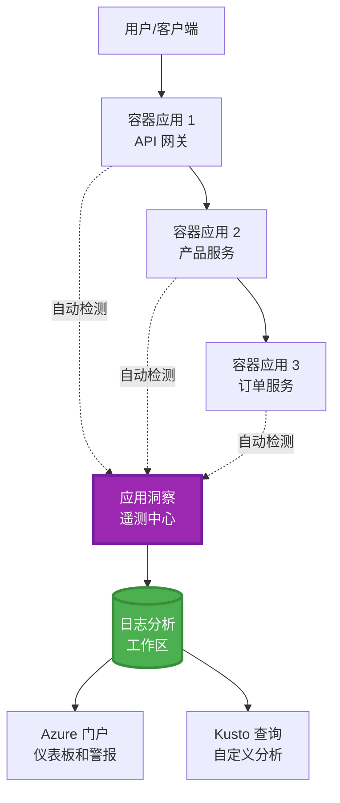
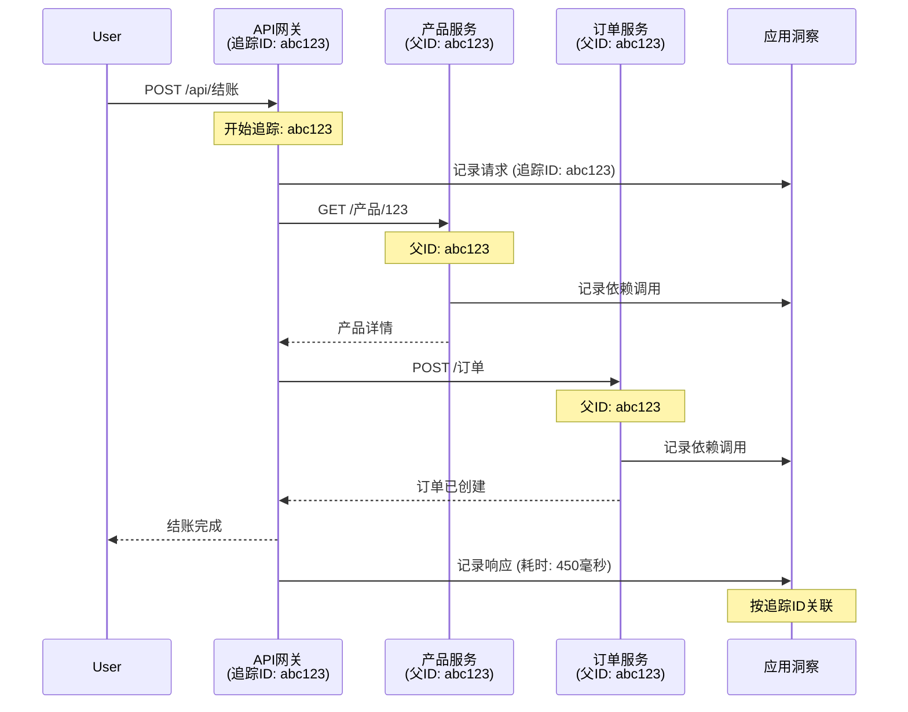

# 与 AZD 集成 Application Insights

⏱️ **预计时间**：40-50 分钟 | 💰 **成本影响**：约 $5-15/月 | ⭐ **复杂度**：中级

**📚 学习路径：**
- ← 上一节：[预检检查](preflight-checks.md) - 部署前验证
- 🎯 **当前位置**：Application Insights 集成（监控、遥测、调试）
- → 下一节：[部署指南](../deployment/deployment-guide.md) - 部署到 Azure
- 🏠 [课程主页](../../README.md)

---

## 你将学到什么

完成本课程后，你将能够：
- 自动将 **Application Insights** 集成到 AZD 项目中
- 配置微服务的 **分布式追踪**
- 实现 **自定义遥测**（指标、事件、依赖项）
- 设置 **实时指标** 进行实时监控
- 从 AZD 部署中创建 **警报和仪表盘**
- 使用 **遥测查询** 调试生产问题
- 优化 **成本和采样** 策略
- 监控 **AI/LLM 应用**（令牌、延迟、成本）

## 为什么 AZD 需要 Application Insights

### 挑战：生产环境的可观测性

**没有 Application Insights：**
```
❌ No visibility into production behavior
❌ Manual log aggregation across services
❌ Reactive debugging (wait for customer complaints)
❌ No performance metrics
❌ Cannot trace requests across services
❌ Unknown failure rates and bottlenecks
```

**有 Application Insights + AZD：**
```
✅ Automatic telemetry collection
✅ Centralized logs from all services
✅ Proactive issue detection
✅ End-to-end request tracing
✅ Performance metrics and insights
✅ Real-time dashboards
✅ AZD provisions everything automatically
```

**类比**：Application Insights 就像应用的“黑匣子”飞行记录器 + 驾驶舱仪表盘。你可以实时看到一切发生的情况，并重现任何事件。

---

## 架构概览

### AZD 架构中的 Application Insights


### 自动监控的内容

| 遥测类型 | 捕获内容 | 用例 |
|----------|----------|------|
| **请求** | HTTP 请求、状态码、持续时间 | API 性能监控 |
| **依赖项** | 外部调用（数据库、API、存储） | 识别瓶颈 |
| **异常** | 未处理的错误及堆栈跟踪 | 调试故障 |
| **自定义事件** | 业务事件（注册、购买） | 分析和漏斗 |
| **指标** | 性能计数器、自定义指标 | 容量规划 |
| **跟踪** | 带有严重级别的日志消息 | 调试和审计 |
| **可用性** | 正常运行时间和响应时间测试 | SLA 监控 |

---

## 先决条件

### 必需工具

```bash
# 验证 Azure Developer CLI
azd version
# ✅ 预期：azd 版本 1.0.0 或更高

# 验证 Azure CLI
az --version
# ✅ 预期：azure-cli 2.50.0 或更高
```

### Azure 要求

- 活跃的 Azure 订阅
- 创建以下资源的权限：
  - Application Insights 资源
  - Log Analytics 工作区
  - 容器应用
  - 资源组

### 知识要求

你应该已经完成：
- [AZD 基础](../getting-started/azd-basics.md) - AZD 核心概念
- [配置](../getting-started/configuration.md) - 环境设置
- [第一个项目](../getting-started/first-project.md) - 基本部署

---

## 第 1 课：使用 AZD 自动集成 Application Insights

### AZD 如何配置 Application Insights

AZD 在你部署时会自动创建并配置 Application Insights。让我们看看它是如何工作的。

### 项目结构

```
monitored-app/
├── azure.yaml                     # AZD configuration
├── infra/
│   ├── main.bicep                # Main infrastructure
│   ├── core/
│   │   └── monitoring.bicep      # Application Insights + Log Analytics
│   └── app/
│       └── api.bicep             # Container App with monitoring
└── src/
    ├── app.py                    # Application with telemetry
    ├── requirements.txt
    └── Dockerfile
```

---

### 第 1 步：配置 AZD（azure.yaml）

**文件：`azure.yaml`**

```yaml
name: monitored-app
metadata:
  template: monitored-app@1.0.0

services:
  api:
    project: ./src
    language: python
    host: containerapp

# AZD automatically provisions monitoring!
```

**就是这样！** AZD 默认会创建 Application Insights。无需额外配置即可实现基本监控。

---

### 第 2 步：监控基础设施（Bicep）

**文件：`infra/core/monitoring.bicep`**

```bicep
param logAnalyticsName string
param applicationInsightsName string
param location string = resourceGroup().location
param tags object = {}

// Log Analytics Workspace (required for Application Insights)
resource logAnalytics 'Microsoft.OperationalInsights/workspaces@2022-10-01' = {
  name: logAnalyticsName
  location: location
  tags: tags
  properties: {
    sku: {
      name: 'PerGB2018'  // Pay-as-you-go pricing
    }
    retentionInDays: 30  // Keep logs for 30 days
    features: {
      enableLogAccessUsingOnlyResourcePermissions: true
    }
  }
}

// Application Insights
resource applicationInsights 'Microsoft.Insights/components@2020-02-02' = {
  name: applicationInsightsName
  location: location
  tags: tags
  kind: 'web'
  properties: {
    Application_Type: 'web'
    WorkspaceResourceId: logAnalytics.id
    IngestionMode: 'LogAnalytics'
    publicNetworkAccessForIngestion: 'Enabled'
    publicNetworkAccessForQuery: 'Enabled'
  }
}

// Outputs for Container Apps
output logAnalyticsWorkspaceId string = logAnalytics.id
output logAnalyticsWorkspaceName string = logAnalytics.name
output applicationInsightsConnectionString string = applicationInsights.properties.ConnectionString
output applicationInsightsInstrumentationKey string = applicationInsights.properties.InstrumentationKey
output applicationInsightsName string = applicationInsights.name
```

---

### 第 3 步：将容器应用连接到 Application Insights

**文件：`infra/app/api.bicep`**

```bicep
param name string
param location string
param tags object = {}
param containerAppsEnvironmentName string
param applicationInsightsConnectionString string

resource containerApp 'Microsoft.App/containerApps@2023-05-01' = {
  name: name
  location: location
  tags: tags
  properties: {
    configuration: {
      ingress: {
        external: true
        targetPort: 8000
      }
      secrets: [
        {
          name: 'appinsights-connection-string'
          value: applicationInsightsConnectionString
        }
      ]
    }
    template: {
      containers: [
        {
          name: 'api'
          image: 'myregistry.azurecr.io/api:latest'
          resources: {
            cpu: json('0.5')
            memory: '1Gi'
          }
          env: [
            {
              name: 'APPLICATIONINSIGHTS_CONNECTION_STRING'
              secretRef: 'appinsights-connection-string'
            }
            {
              name: 'APPLICATIONINSIGHTS_ENABLED'
              value: 'true'
            }
          ]
        }
      ]
    }
  }
}

output uri string = 'https://${containerApp.properties.configuration.ingress.fqdn}'
```

---

### 第 4 步：带遥测的应用代码

**文件：`src/app.py`**

```python
from flask import Flask, request, jsonify
from opencensus.ext.azure.log_exporter import AzureLogHandler
from opencensus.ext.azure.trace_exporter import AzureExporter
from opencensus.ext.flask.flask_middleware import FlaskMiddleware
from opencensus.trace.samplers import ProbabilitySampler
import logging
import os

app = Flask(__name__)

# 获取应用程序洞察连接字符串
connection_string = os.environ.get('APPLICATIONINSIGHTS_CONNECTION_STRING')

if connection_string:
    # 配置分布式追踪
    middleware = FlaskMiddleware(
        app,
        exporter=AzureExporter(connection_string=connection_string),
        sampler=ProbabilitySampler(rate=1.0)  # 开发环境100%采样
    )
    
    # 配置日志记录
    logger = logging.getLogger(__name__)
    logger.addHandler(AzureLogHandler(connection_string=connection_string))
    logger.setLevel(logging.INFO)
    
    print("✅ Application Insights enabled")
else:
    logger = logging.getLogger(__name__)
    logger.setLevel(logging.INFO)
    print("⚠️ Application Insights not configured")

@app.route('/health')
def health():
    logger.info('Health check endpoint called')
    return jsonify({'status': 'healthy', 'monitoring': 'enabled'})

@app.route('/api/products')
def get_products():
    logger.info('Fetching products')
    
    # 模拟数据库调用（自动跟踪为依赖项）
    products = [
        {'id': 1, 'name': 'Laptop', 'price': 999.99},
        {'id': 2, 'name': 'Mouse', 'price': 29.99},
        {'id': 3, 'name': 'Keyboard', 'price': 79.99}
    ]
    
    logger.info(f'Returned {len(products)} products')
    return jsonify(products)

@app.route('/api/error-test')
def error_test():
    """Test error tracking"""
    logger.error('Testing error tracking')
    try:
        raise ValueError('This is a test exception')
    except Exception as e:
        logger.exception('Exception occurred in error-test endpoint')
        return jsonify({'error': str(e)}), 500

@app.route('/api/slow')
def slow_endpoint():
    """Test performance tracking"""
    import time
    logger.info('Slow endpoint called')
    time.sleep(3)  # 模拟慢操作
    logger.warning('Endpoint took 3 seconds to respond')
    return jsonify({'message': 'Slow operation completed'})

if __name__ == '__main__':
    app.run(host='0.0.0.0', port=8000)
```

**文件：`src/requirements.txt`**

```txt
Flask==3.0.0
opencensus-ext-azure==1.1.13
opencensus-ext-flask==0.8.1
gunicorn==21.2.0
```

---

### 第 5 步：部署并验证

```bash
# 初始化 AZD
azd init

# 部署（自动配置 Application Insights）
azd up

# 获取应用程序 URL
APP_URL=$(azd env get-values | grep API_URL | cut -d '=' -f2 | tr -d '"')

# 生成遥测数据
curl $APP_URL/health
curl $APP_URL/api/products
curl $APP_URL/api/error-test
curl $APP_URL/api/slow
```

**✅ 预期输出：**
```json
{
  "status": "healthy",
  "monitoring": "enabled"
}
```

---

### 第 6 步：在 Azure 门户中查看遥测

```bash
# 获取应用程序洞察详细信息
azd env get-values | grep APPLICATIONINSIGHTS

# 在 Azure 门户中打开
az monitor app-insights component show \
  --app $(azd env get-values | grep APPLICATIONINSIGHTS_NAME | cut -d '=' -f2 | tr -d '"') \
  --resource-group $(azd env get-values | grep AZURE_RESOURCE_GROUP | cut -d '=' -f2 | tr -d '"') \
  --query "appId" -o tsv
```

**导航到 Azure 门户 → Application Insights → 事务搜索**

你应该能看到：
- ✅ 带状态码的 HTTP 请求
- ✅ 请求持续时间（`/api/slow` 超过 3 秒）
- ✅ `/api/error-test` 的异常详情
- ✅ 自定义日志消息

---

## 第 2 课：自定义遥测和事件

### 跟踪业务事件

让我们为关键业务事件添加自定义遥测。

**文件：`src/telemetry.py`**

```python
from opencensus.ext.azure import metrics_exporter
from opencensus.stats import aggregation as aggregation_module
from opencensus.stats import measure as measure_module
from opencensus.stats import stats as stats_module
from opencensus.stats import view as view_module
from opencensus.tags import tag_map as tag_map_module
from opencensus.ext.azure.log_exporter import AzureLogHandler
from opencensus.ext.azure.trace_exporter import AzureExporter
from opencensus.trace import tracer as tracer_module
import logging
import os

class TelemetryClient:
    """Custom telemetry client for Application Insights"""
    
    def __init__(self, connection_string=None):
        self.connection_string = connection_string or os.environ.get('APPLICATIONINSIGHTS_CONNECTION_STRING')
        
        if not self.connection_string:
            print("⚠️ Application Insights connection string not found")
            return
        
        # 设置日志记录器
        self.logger = logging.getLogger(__name__)
        self.logger.addHandler(AzureLogHandler(connection_string=self.connection_string))
        self.logger.setLevel(logging.INFO)
        
        # 设置指标导出器
        self.stats = stats_module.stats
        self.view_manager = self.stats.view_manager
        self.stats_recorder = self.stats.stats_recorder
        
        exporter = metrics_exporter.new_metrics_exporter(
            connection_string=self.connection_string
        )
        self.view_manager.register_exporter(exporter)
        
        # 设置追踪器
        self.tracer = tracer_module.Tracer(
            exporter=AzureExporter(connection_string=self.connection_string)
        )
        
        print("✅ Custom telemetry client initialized")
    
    def track_event(self, event_name: str, properties: dict = None):
        """Track custom business event"""
        properties = properties or {}
        self.logger.info(
            f"CustomEvent: {event_name}",
            extra={
                'custom_dimensions': {
                    'event_name': event_name,
                    **properties
                }
            }
        )
    
    def track_metric(self, metric_name: str, value: float, properties: dict = None):
        """Track custom metric"""
        properties = properties or {}
        self.logger.info(
            f"CustomMetric: {metric_name} = {value}",
            extra={
                'custom_dimensions': {
                    'metric_name': metric_name,
                    'value': value,
                    **properties
                }
            }
        )
    
    def track_dependency(self, name: str, dependency_type: str, duration: float, success: bool):
        """Track external dependency call"""
        with self.tracer.span(name=name) as span:
            span.add_attribute('dependency.type', dependency_type)
            span.add_attribute('duration', duration)
            span.add_attribute('success', success)

# 全局遥测客户端
telemetry = TelemetryClient()
```

### 使用自定义事件更新应用

**文件：`src/app.py`（增强版）**

```python
from flask import Flask, request, jsonify
from telemetry import telemetry
import time
import random

app = Flask(__name__)

@app.route('/api/purchase', methods=['POST'])
def purchase():
    """Track purchase event with custom telemetry"""
    data = request.json
    product_id = data.get('product_id')
    quantity = data.get('quantity', 1)
    price = data.get('price', 0)
    
    # 跟踪业务事件
    telemetry.track_event('Purchase', {
        'product_id': product_id,
        'quantity': quantity,
        'total_amount': price * quantity,
        'user_id': request.headers.get('X-User-Id', 'anonymous')
    })
    
    # 跟踪收入指标
    telemetry.track_metric('Revenue', price * quantity, {
        'product_id': product_id,
        'currency': 'USD'
    })
    
    return jsonify({
        'order_id': f'ORD-{random.randint(1000, 9999)}',
        'status': 'confirmed',
        'total': price * quantity
    })

@app.route('/api/search')
def search():
    """Track search queries"""
    query = request.args.get('q', '')
    
    start_time = time.time()
    
    # 模拟搜索（将是实际的数据库查询）
    results = [{'id': 1, 'name': f'Result for {query}'}]
    
    duration = (time.time() - start_time) * 1000  # 转换为毫秒
    
    # 跟踪搜索事件
    telemetry.track_event('Search', {
        'query': query,
        'results_count': len(results),
        'duration_ms': duration
    })
    
    # 跟踪搜索性能指标
    telemetry.track_metric('SearchDuration', duration, {
        'query_length': len(query)
    })
    
    return jsonify({'results': results, 'count': len(results)})

@app.route('/api/external-call')
def external_call():
    """Track external API dependency"""
    import requests
    
    start_time = time.time()
    success = True
    
    try:
        # 模拟外部 API 调用
        response = requests.get('https://api.example.com/data', timeout=5)
        result = response.json()
    except Exception as e:
        success = False
        result = {'error': str(e)}
    
    duration = (time.time() - start_time) * 1000
    
    # 跟踪依赖
    telemetry.track_dependency(
        name='ExternalAPI',
        dependency_type='HTTP',
        duration=duration,
        success=success
    )
    
    return jsonify(result)

if __name__ == '__main__':
    app.run(host='0.0.0.0', port=8000)
```

### 测试自定义遥测

```bash
# 跟踪购买事件
curl -X POST $APP_URL/api/purchase \
  -H "Content-Type: application/json" \
  -H "X-User-Id: user123" \
  -d '{"product_id": 1, "quantity": 2, "price": 29.99}'

# 跟踪搜索事件
curl "$APP_URL/api/search?q=laptop"

# 跟踪外部依赖
curl $APP_URL/api/external-call
```

**在 Azure 门户中查看：**

导航到 Application Insights → 日志，然后运行：

```kusto
// View purchase events
traces
| where customDimensions.event_name == "Purchase"
| project 
    timestamp,
    product_id = tostring(customDimensions.product_id),
    total_amount = todouble(customDimensions.total_amount),
    user_id = tostring(customDimensions.user_id)
| order by timestamp desc

// View revenue metrics
traces
| where customDimensions.metric_name == "Revenue"
| summarize TotalRevenue = sum(todouble(customDimensions.value)) by bin(timestamp, 1h)
| render timechart

// View search performance
traces
| where customDimensions.event_name == "Search"
| summarize 
    AvgDuration = avg(todouble(customDimensions.duration_ms)),
    SearchCount = count()
  by bin(timestamp, 5m)
| render timechart
```

---

## 第 3 课：微服务的分布式追踪

### 启用跨服务追踪

对于微服务，Application Insights 会自动关联跨服务的请求。

**文件：`infra/main.bicep`**

```bicep
targetScope = 'subscription'

param environmentName string
param location string = 'eastus'

var tags = { 'azd-env-name': environmentName }

resource rg 'Microsoft.Resources/resourceGroups@2021-04-01' = {
  name: 'rg-${environmentName}'
  location: location
  tags: tags
}

// Monitoring (shared by all services)
module monitoring './core/monitoring.bicep' = {
  name: 'monitoring'
  scope: rg
  params: {
    logAnalyticsName: 'log-${environmentName}'
    applicationInsightsName: 'appi-${environmentName}'
    location: location
    tags: tags
  }
}

// API Gateway
module apiGateway './app/api-gateway.bicep' = {
  name: 'api-gateway'
  scope: rg
  params: {
    name: 'ca-gateway-${environmentName}'
    location: location
    tags: union(tags, { 'azd-service-name': 'gateway' })
    applicationInsightsConnectionString: monitoring.outputs.applicationInsightsConnectionString
  }
}

// Product Service
module productService './app/product-service.bicep' = {
  name: 'product-service'
  scope: rg
  params: {
    name: 'ca-products-${environmentName}'
    location: location
    tags: union(tags, { 'azd-service-name': 'products' })
    applicationInsightsConnectionString: monitoring.outputs.applicationInsightsConnectionString
  }
}

// Order Service
module orderService './app/order-service.bicep' = {
  name: 'order-service'
  scope: rg
  params: {
    name: 'ca-orders-${environmentName}'
    location: location
    tags: union(tags, { 'azd-service-name': 'orders' })
    applicationInsightsConnectionString: monitoring.outputs.applicationInsightsConnectionString
  }
}

output APPLICATIONINSIGHTS_CONNECTION_STRING string = monitoring.outputs.applicationInsightsConnectionString
output GATEWAY_URL string = apiGateway.outputs.uri
```

### 查看端到端事务


**查询端到端追踪：**

```kusto
// Find complete request flow
let traceId = "abc123...";  // Get from response header
dependencies
| union requests
| where operation_Id == traceId
| project 
    timestamp,
    type = itemType,
    name,
    duration,
    success,
    cloud_RoleName
| order by timestamp asc
```

---

## 第 4 课：实时指标和实时监控

### 启用实时指标流

实时指标提供 <1 秒延迟的实时遥测。

**访问实时指标：**

```bash
# 获取应用程序洞察资源
APPI_NAME=$(azd env get-values | grep APPLICATIONINSIGHTS_NAME | cut -d '=' -f2 | tr -d '"')

# 获取资源组
RG_NAME=$(azd env get-values | grep AZURE_RESOURCE_GROUP | cut -d '=' -f2 | tr -d '"')

echo "Navigate to: Azure Portal → Resource Groups → $RG_NAME → $APPI_NAME → Live Metrics"
```

**实时可见内容：**
- ✅ 每秒请求速率
- ✅ 外部依赖调用
- ✅ 异常计数
- ✅ CPU 和内存使用率
- ✅ 活跃服务器数量
- ✅ 示例遥测

### 生成负载进行测试

```bash
# 生成负载以查看实时指标
for i in {1..100}; do
  curl $APP_URL/api/products &
  curl $APP_URL/api/search?q=test$i &
done

# 在 Azure 门户中查看实时指标
# 您应该看到请求速率激增
```

---

## 实践练习

### 练习 1：设置警报 ⭐⭐（中等）

**目标**：为高错误率和慢响应创建警报。

**步骤：**

1. **为错误率创建警报：**

```bash
# 获取应用程序洞察资源ID
APPI_ID=$(az monitor app-insights component show \
  --app $APPI_NAME \
  --resource-group $RG_NAME \
  --query "id" -o tsv)

# 为失败的请求创建指标警报
az monitor metrics alert create \
  --name "High-Error-Rate" \
  --resource-group $RG_NAME \
  --scopes $APPI_ID \
  --condition "count requests/failed > 10" \
  --window-size 5m \
  --evaluation-frequency 1m \
  --description "Alert when error rate exceeds 10 per 5 minutes"
```

2. **为慢响应创建警报：**

```bash
az monitor metrics alert create \
  --name "Slow-Responses" \
  --resource-group $RG_NAME \
  --scopes $APPI_ID \
  --condition "avg requests/duration > 3000" \
  --window-size 5m \
  --evaluation-frequency 1m \
  --description "Alert when average response time exceeds 3 seconds"
```

3. **通过 Bicep 创建警报（AZD 推荐）：**

**文件：`infra/core/alerts.bicep`**

```bicep
param applicationInsightsId string
param actionGroupId string = ''
param location string = resourceGroup().location

// High error rate alert
resource errorRateAlert 'Microsoft.Insights/metricAlerts@2018-03-01' = {
  name: 'high-error-rate'
  location: 'global'
  properties: {
    description: 'Alert when error rate exceeds threshold'
    severity: 2
    enabled: true
    scopes: [
      applicationInsightsId
    ]
    evaluationFrequency: 'PT1M'
    windowSize: 'PT5M'
    criteria: {
      'odata.type': 'Microsoft.Azure.Monitor.SingleResourceMultipleMetricCriteria'
      allOf: [
        {
          name: 'Error rate'
          metricName: 'requests/failed'
          operator: 'GreaterThan'
          threshold: 10
          timeAggregation: 'Count'
        }
      ]
    }
    actions: actionGroupId != '' ? [
      {
        actionGroupId: actionGroupId
      }
    ] : []
  }
}

// Slow response alert
resource slowResponseAlert 'Microsoft.Insights/metricAlerts@2018-03-01' = {
  name: 'slow-responses'
  location: 'global'
  properties: {
    description: 'Alert when response time is too high'
    severity: 3
    enabled: true
    scopes: [
      applicationInsightsId
    ]
    evaluationFrequency: 'PT1M'
    windowSize: 'PT5M'
    criteria: {
      'odata.type': 'Microsoft.Azure.Monitor.SingleResourceMultipleMetricCriteria'
      allOf: [
        {
          name: 'Response duration'
          metricName: 'requests/duration'
          operator: 'GreaterThan'
          threshold: 3000
          timeAggregation: 'Average'
        }
      ]
    }
  }
}

output errorAlertId string = errorRateAlert.id
output slowResponseAlertId string = slowResponseAlert.id
```

4. **测试警报：**

```bash
# 生成错误
for i in {1..20}; do
  curl $APP_URL/api/error-test
done

# 生成缓慢响应
for i in {1..10}; do
  curl $APP_URL/api/slow
done

# 检查警报状态（等待5-10分钟）
az monitor metrics alert list \
  --resource-group $RG_NAME \
  --query "[].{Name:name, Enabled:enabled, State:properties.enabled}" \
  --output table
```

**✅ 成功标准：**
- ✅ 成功创建警报
- ✅ 当超过阈值时触发警报
- ✅ 可在 Azure 门户中查看警报历史
- ✅ 与 AZD 部署集成

**时间**：20-25 分钟

---

### 练习 2：创建自定义仪表盘 ⭐⭐（中等）

**目标**：构建显示关键应用指标的仪表盘。

**步骤：**

1. **通过 Azure 门户创建仪表盘：**

导航到：Azure 门户 → 仪表盘 → 新建仪表盘

2. **为关键指标添加图块：**

- 请求计数（过去 24 小时）
- 平均响应时间
- 错误率
- 最慢的 5 个操作
- 用户的地理分布

3. **通过 Bicep 创建仪表盘：**

**文件：`infra/core/dashboard.bicep`**

```bicep
param dashboardName string
param applicationInsightsId string
param location string = resourceGroup().location

resource dashboard 'Microsoft.Portal/dashboards@2020-09-01-preview' = {
  name: dashboardName
  location: location
  properties: {
    lenses: [
      {
        order: 0
        parts: [
          // Request count
          {
            position: { x: 0, y: 0, rowSpan: 4, colSpan: 6 }
            metadata: {
              type: 'Extension/Microsoft_OperationsManagementSuite_Workspace/PartType/LogsDashboardPart'
              inputs: [
                {
                  name: 'resourceId'
                  value: applicationInsightsId
                }
                {
                  name: 'query'
                  value: '''
                    requests
                    | summarize RequestCount = count() by bin(timestamp, 1h)
                    | render timechart
                  '''
                }
              ]
            }
          }
          // Error rate
          {
            position: { x: 6, y: 0, rowSpan: 4, colSpan: 6 }
            metadata: {
              type: 'Extension/Microsoft_OperationsManagementSuite_Workspace/PartType/LogsDashboardPart'
              inputs: [
                {
                  name: 'resourceId'
                  value: applicationInsightsId
                }
                {
                  name: 'query'
                  value: '''
                    requests
                    | summarize 
                        Total = count(),
                        Failed = countif(success == false)
                    | extend ErrorRate = (Failed * 100.0) / Total
                    | project ErrorRate
                  '''
                }
              ]
            }
          }
        ]
      }
    ]
  }
}

output dashboardId string = dashboard.id
```

4. **部署仪表盘：**

```bash
# 添加到main.bicep
module dashboard './core/dashboard.bicep' = {
  name: 'dashboard'
  scope: rg
  params: {
    dashboardName: 'dashboard-${environmentName}'
    applicationInsightsId: monitoring.outputs.applicationInsightsId
    location: location
  }
}

# 部署
azd up
```

**✅ 成功标准：**
- ✅ 仪表盘显示关键指标
- ✅ 可固定到 Azure 门户主页
- ✅ 实时更新
- ✅ 可通过 AZD 部署

**时间**：25-30 分钟

---

### 练习 3：监控 AI/LLM 应用 ⭐⭐⭐（高级）

**目标**：跟踪 Azure OpenAI 使用情况（令牌、成本、延迟）。

**步骤：**

1. **创建 AI 监控包装器：**

**文件：`src/ai_telemetry.py`**

```python
from telemetry import telemetry
from openai import AzureOpenAI
import time

class MonitoredAzureOpenAI:
    """Azure OpenAI client with automatic telemetry"""
    
    def __init__(self, api_key, endpoint, api_version="2024-02-01"):
        self.client = AzureOpenAI(
            api_key=api_key,
            api_version=api_version,
            azure_endpoint=endpoint
        )
    
    def chat_completion(self, model: str, messages: list, **kwargs):
        """Track chat completion with telemetry"""
        start_time = time.time()
        
        try:
            # 调用 Azure OpenAI
            response = self.client.chat.completions.create(
                model=model,
                messages=messages,
                **kwargs
            )
            
            duration = (time.time() - start_time) * 1000  # 毫秒
            
            # 提取使用情况
            usage = response.usage
            prompt_tokens = usage.prompt_tokens
            completion_tokens = usage.completion_tokens
            total_tokens = usage.total_tokens
            
            # 计算成本（GPT-4 定价）
            prompt_cost = (prompt_tokens / 1000) * 0.03  # 每 1K 令牌 $0.03
            completion_cost = (completion_tokens / 1000) * 0.06  # 每 1K 令牌 $0.06
            total_cost = prompt_cost + completion_cost
            
            # 跟踪自定义事件
            telemetry.track_event('OpenAI_Request', {
                'model': model,
                'prompt_tokens': prompt_tokens,
                'completion_tokens': completion_tokens,
                'total_tokens': total_tokens,
                'duration_ms': duration,
                'cost_usd': total_cost,
                'success': True
            })
            
            # 跟踪指标
            telemetry.track_metric('OpenAI_Tokens', total_tokens, {
                'model': model,
                'type': 'total'
            })
            
            telemetry.track_metric('OpenAI_Cost', total_cost, {
                'model': model,
                'currency': 'USD'
            })
            
            telemetry.track_metric('OpenAI_Duration', duration, {
                'model': model
            })
            
            return response
            
        except Exception as e:
            duration = (time.time() - start_time) * 1000
            
            telemetry.track_event('OpenAI_Request', {
                'model': model,
                'duration_ms': duration,
                'success': False,
                'error': str(e)
            })
            
            raise
```

2. **使用监控客户端：**

```python
from flask import Flask, request, jsonify
from ai_telemetry import MonitoredAzureOpenAI
import os

app = Flask(__name__)

# 初始化受监控的OpenAI客户端
openai_client = MonitoredAzureOpenAI(
    api_key=os.environ['AZURE_OPENAI_API_KEY'],
    endpoint=os.environ['AZURE_OPENAI_ENDPOINT']
)

@app.route('/api/chat', methods=['POST'])
def chat():
    data = request.json
    user_message = data.get('message')
    
    # 使用自动监控进行调用
    response = openai_client.chat_completion(
        model='gpt-4',
        messages=[
            {'role': 'user', 'content': user_message}
        ]
    )
    
    return jsonify({
        'response': response.choices[0].message.content,
        'tokens': response.usage.total_tokens
    })
```

3. **查询 AI 指标：**

```kusto
// Total AI spend over time
traces
| where customDimensions.event_name == "OpenAI_Request"
| where customDimensions.success == "True"
| summarize TotalCost = sum(todouble(customDimensions.cost_usd)) by bin(timestamp, 1h)
| render timechart

// Token usage by model
traces
| where customDimensions.event_name == "OpenAI_Request"
| summarize 
    TotalTokens = sum(toint(customDimensions.total_tokens)),
    RequestCount = count()
  by Model = tostring(customDimensions.model)

// Average latency
traces
| where customDimensions.event_name == "OpenAI_Request"
| summarize AvgDuration = avg(todouble(customDimensions.duration_ms))
| project AvgDurationSeconds = AvgDuration / 1000

// Cost per request
traces
| where customDimensions.event_name == "OpenAI_Request"
| extend Cost = todouble(customDimensions.cost_usd)
| summarize 
    TotalCost = sum(Cost),
    RequestCount = count(),
    AvgCostPerRequest = avg(Cost)
```

**✅ 成功标准：**
- ✅ 每次 OpenAI 调用自动跟踪
- ✅ 可见令牌使用和成本
- ✅ 延迟被监控
- ✅ 可设置预算警报

**时间**：35-45 分钟

---

## 成本优化

### 采样策略

通过采样遥测控制成本：

```python
from opencensus.trace.samplers import ProbabilitySampler

# 开发：100%采样
sampler = ProbabilitySampler(rate=1.0)

# 生产：10%采样（降低90%的成本）
sampler = ProbabilitySampler(rate=0.1)

# 自适应采样（自动调整）
from opencensus.trace.samplers import AdaptiveSampler
sampler = AdaptiveSampler()
```

**在 Bicep 中：**

```bicep
resource applicationInsights 'Microsoft.Insights/components@2020-02-02' = {
  name: applicationInsightsName
  properties: {
    SamplingPercentage: 10  // 10% sampling
  }
}
```

### 数据保留

```bicep
resource logAnalytics 'Microsoft.OperationalInsights/workspaces@2022-10-01' = {
  name: logAnalyticsName
  properties: {
    retentionInDays: 30  // Minimum (cheapest)
    // Options: 30, 31, 60, 90, 120, 180, 270, 365, 550, 730
  }
}
```

### 每月成本估算

| 数据量 | 保留期 | 每月成本 |
|--------|--------|----------|
| 1 GB/月 | 30 天 | ~$2-5 |
| 5 GB/月 | 30 天 | ~$10-15 |
| 10 GB/月 | 90 天 | ~$25-40 |
| 50 GB/月 | 90 天 | ~$100-150 |

**免费层**：包含 5 GB/月

---

## 知识检查点

### 1. 基础集成 ✓

测试你的理解：

- [ ] **Q1**：AZD 如何配置 Application Insights？
  - **A**：通过 `infra/core/monitoring.bicep` 中的 Bicep 模板自动完成

- [ ] **Q2**：哪个环境变量启用 Application Insights？
  - **A**：`APPLICATIONINSIGHTS_CONNECTION_STRING`

- [ ] **Q3**：三种主要的遥测类型是什么？
  - **A**：请求（HTTP 调用）、依赖项（外部调用）、异常（错误）

**动手验证：**
```bash
# 检查是否配置了 Application Insights
azd env get-values | grep APPLICATIONINSIGHTS

# 验证遥测数据是否正常流动
az monitor app-insights metrics show \
  --app $APPI_NAME \
  --resource-group $RG_NAME \
  --metric "requests/count"
```

---

### 2. 自定义遥测 ✓

测试你的理解：

- [ ] **Q1**：如何跟踪自定义业务事件？
  - **A**：使用带 `custom_dimensions` 的日志记录器或 `TelemetryClient.track_event()`

- [ ] **Q2**：事件和指标的区别是什么？
  - **A**：事件是离散发生的，指标是数值测量

- [ ] **Q3**：如何跨服务关联遥测？
  - **A**：Application Insights 自动使用 `operation_Id` 进行关联

**动手验证：**
```kusto
// Verify custom events
traces
| where customDimensions.event_name != ""
| summarize count() by tostring(customDimensions.event_name)
```

---

### 3. 生产监控 ✓

测试你的理解：

- [ ] **Q1**：什么是采样，为什么要使用它？
  - **A**：采样通过仅捕获部分遥测数据来减少数据量（和成本）

- [ ] **Q2**：如何设置警报？
  - **A**：基于 Application Insights 指标，在 Bicep 或 Azure 门户中使用指标警报

- [ ] **Q3**：Log Analytics 和 Application Insights 有什么区别？
  - **A**：Application Insights 将数据存储在 Log Analytics 工作区中；App Insights 提供特定于应用的视图

**动手验证：**
```bash
# 检查采样配置
az monitor app-insights component show \
  --app $APPI_NAME \
  --resource-group $RG_NAME \
  --query "properties.SamplingPercentage"
```

---

## 最佳实践

### ✅ 应该做：

1. **使用关联 ID**
   ```python
   logger.info('Processing order', extra={
       'custom_dimensions': {
           'order_id': order_id,
           'user_id': user_id
       }
   })
   ```

2. **为关键指标设置警报**
   ```bicep
   // Error rate, slow responses, availability
   ```

3. **使用结构化日志**
   ```python
   # ✅ 好的：结构化
   logger.info('User signup', extra={'custom_dimensions': {'user_id': 123}})
   
   # ❌ 不好的：非结构化
   logger.info(f'User 123 signed up')
   ```

4. **监控依赖项**
   ```python
   # 自动跟踪数据库调用、HTTP请求等。
   ```

5. **在部署期间使用实时指标**

### ❌ 不应该做：

1. **不要记录敏感数据**
   ```python
   # ❌ 不好
   logger.info(f'Login: {username}:{password}')
   
   # ✅ 好
   logger.info('Login attempt', extra={'custom_dimensions': {'username': username}})
   ```

2. **不要在生产环境中使用 100% 采样**
   ```python
   # ❌ 昂贵
   sampler = ProbabilitySampler(rate=1.0)
   
   # ✅ 划算
   sampler = ProbabilitySampler(rate=0.1)
   ```

3. **不要忽略死信队列**

4. **不要忘记设置数据保留限制**

---

## 故障排除

### 问题：没有遥测数据出现

**诊断：**
```bash
# 检查是否设置了连接字符串
azd env get-values | grep APPLICATIONINSIGHTS

# 检查应用程序日志
azd logs api --tail 50
```

**解决方案：**
```bash
# 验证容器应用中的连接字符串
az containerapp show \
  --name $APP_NAME \
  --resource-group $RG_NAME \
  --query "properties.template.containers[0].env" \
  | grep -i applicationinsights
```

---

### 问题：成本过高

**诊断：**
```bash
# 检查数据摄取
az monitor app-insights metrics show \
  --app $APPI_NAME \
  --resource-group $RG_NAME \
  --metric "availabilityResults/count"
```

**解决方案：**
- 降低采样率
- 缩短保留期
- 删除冗长日志

---

## 了解更多

### 官方文档
- [Application Insights 概述](https://learn.microsoft.com/azure/azure-monitor/app/app-insights-overview)
- [Application Insights for Python](https://learn.microsoft.com/azure/azure-monitor/app/opencensus-python)
- [Kusto 查询语言](https://learn.microsoft.com/azure/data-explorer/kusto/query/)
- [AZD 监控](https://learn.microsoft.com/azure/developer/azure-developer-cli/monitor-your-app)

### 本课程的下一步
- ← 上一节：[预检检查](preflight-checks.md)
- → 下一节：[部署指南](../deployment/deployment-guide.md)
- 🏠 [课程主页](../../README.md)

### 相关示例
- [Azure OpenAI 示例](../../../../examples/azure-openai-chat) - AI 遥测
- [微服务示例](../../../../examples/microservices) - 分布式追踪

---

## 总结

**你已经学会了：**
- ✅ 使用 AZD 自动配置 Application Insights
- ✅ 自定义遥测（事件、指标、依赖项）
- ✅ 微服务的分布式追踪
- ✅ 实时指标和实时监控
- ✅ 警报和仪表盘
- ✅ AI/LLM应用监控  
- ✅ 成本优化策略  

**关键要点：**  
1. **AZD自动配置监控** - 无需手动设置  
2. **使用结构化日志** - 使查询更简单  
3. **跟踪业务事件** - 不仅仅是技术指标  
4. **监控AI成本** - 跟踪令牌和支出  
5. **设置警报** - 主动应对，而非被动反应  
6. **优化成本** - 使用采样和保留限制  

**下一步：**  
1. 完成实践练习  
2. 将Application Insights添加到您的AZD项目中  
3. 为您的团队创建自定义仪表板  
4. 学习[部署指南](../deployment/deployment-guide.md)  

---

<!-- CO-OP TRANSLATOR DISCLAIMER START -->
**免责声明**：  
本文档使用AI翻译服务[Co-op Translator](https://github.com/Azure/co-op-translator)进行翻译。尽管我们努力确保翻译的准确性，但请注意，自动翻译可能包含错误或不准确之处。原始语言的文档应被视为权威来源。对于重要信息，建议使用专业人工翻译。我们对因使用此翻译而产生的任何误解或误读不承担责任。
<!-- CO-OP TRANSLATOR DISCLAIMER END -->