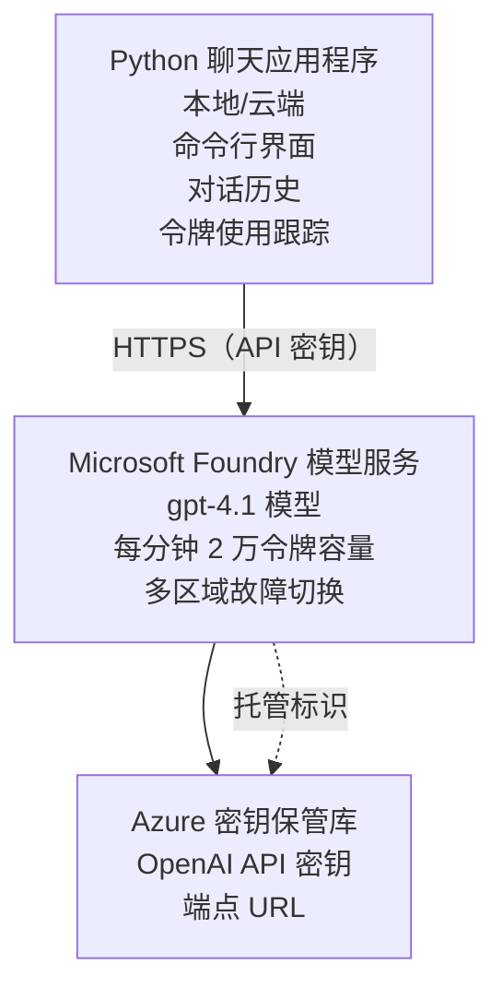

# Microsoft Foundry Models 聊天应用

**学习路径：** 中级 ⭐⭐ | **时间：** 35-45 分钟 | **费用：** $50-200/月

一个使用 Azure Developer CLI (azd) 部署的完整 Microsoft Foundry Models 聊天应用示例。该示例演示了 gpt-4.1 的部署、API 的安全访问以及一个简单的聊天界面。

## 🎯 你将学到的内容

- 部署 Microsoft Foundry Models 服务并使用 gpt-4.1 模型
- 使用 Key Vault 保护 OpenAI API 密钥
- 使用 Python 构建一个简单的聊天界面
- 监控令牌使用情况和费用
- 实现速率限制和错误处理

## 📦 包含内容

✅ **Microsoft Foundry Models 服务** - gpt-4.1 模型部署  
✅ **Python 聊天应用** - 简单的命令行聊天界面  
✅ **Key Vault 集成** - 安全的 API 密钥存储  
✅ **ARM 模板** - 完整的基础设施即代码  
✅ <strong>费用监控</strong> - 令牌使用跟踪  
✅ <strong>速率限制</strong> - 防止配额耗尽  

## 架构


## 前提条件

### 必需

- **Azure Developer CLI (azd)** - [安装指南](https://learn.microsoft.com/azure/developer/azure-developer-cli/install-azd)
- **具有 OpenAI 访问权限的 Azure 订阅** - [申请访问](https://aka.ms/oai/access)
- **Python 3.9+** - [安装 Python](https://www.python.org/downloads/)

### 验证前提条件

```bash
# 检查 azd 版本（需要 1.5.0 或更高）
azd version

# 验证 Azure 登录
azd auth login

# 检查 Python 版本
python --version  # 或 python3 --version

# 验证 OpenAI 访问权限（在 Azure 门户中检查）
az cognitiveservices account list-skus \
  --kind OpenAI \
  --location eastus
```

> **⚠️ 重要：** Microsoft Foundry Models 需要应用审批。如果你尚未申请，请访问 [aka.ms/oai/access](https://aka.ms/oai/access)。审批通常需要 1-2 个工作日。

## ⏱️ 部署时间线

| 阶段 | 持续时间 | 发生的事情 |
|-------|----------|--------------|
| 前提检查 | 2-3 分钟 | 验证 OpenAI 配额可用性 |
| 部署基础设施 | 8-12 分钟 | 创建 OpenAI、Key Vault、模型部署 |
| 配置应用 | 2-3 分钟 | 设置环境和依赖 |
| <strong>总计</strong> | **12-18 分钟** | 准备好与 gpt-4.1 聊天 |

**注意：** 第一次部署 OpenAI 可能由于模型预配而需要更长时间。

## 快速开始

```bash
# 导航到示例
cd examples/azure-openai-chat

# 初始化环境
azd env new myopenai

# 部署所有内容（基础设施和配置）
azd up
# 你将被提示：
# 1. 选择 Azure 订阅
# 2. 选择支持 OpenAI 的区域（例如：eastus、eastus2、westus）
# 3. 等待 12–18 分钟以完成部署

# 安装 Python 依赖项
pip install -r requirements.txt

# 开始聊天！
python chat.py
```

**预期输出：**
```
🤖 Microsoft Foundry Models Chat Application
Connected to: gpt-4.1 (eastus)
Type your message (or 'quit' to exit)

You: Hello! Tell me about Microsoft Foundry Models.
Assistant: Microsoft Foundry Models Service provides REST API access to OpenAI's powerful language models including gpt-4.1, GPT-3.5-Turbo, and Embeddings...

[Tokens used: 145 | Estimated cost: $0.0044]
```

## ✅ 验证部署

### 步骤 1：检查 Azure 资源

```bash
# 查看已部署的资源
azd show

# 预期输出显示:
# - OpenAI 服务: (资源名称)
# - 密钥保管库: (资源名称)
# - 部署: gpt-4.1
# - 位置: eastus (或您选择的区域)
```

### 步骤 2：测试 OpenAI API

```bash
# 获取 OpenAI 端点和密钥
OPENAI_ENDPOINT=$(azd env get-value AZURE_OPENAI_ENDPOINT)
OPENAI_KEY=$(azd env get-value AZURE_OPENAI_API_KEY)

# 测试 API 调用
curl "$OPENAI_ENDPOINT/openai/deployments/gpt-4.1/chat/completions?api-version=2024-08-01-preview" \
  -H "Content-Type: application/json" \
  -H "api-key: $OPENAI_KEY" \
  -d '{
    "messages": [{"role": "user", "content": "Say hello!"}],
    "max_tokens": 50
  }'
```

**预期响应：**
```json
{
  "choices": [
    {
      "message": {
        "role": "assistant",
        "content": "Hello! How can I assist you today?"
      }
    }
  ],
  "usage": {
    "prompt_tokens": 8,
    "completion_tokens": 9,
    "total_tokens": 17
  }
}
```

### 步骤 3：验证 Key Vault 访问

```bash
# 在 Key Vault 中列出机密
KV_NAME=$(azd env get-value AZURE_KEY_VAULT_NAME)

az keyvault secret list \
  --vault-name $KV_NAME \
  --query "[].name" \
  --output table
```

**预期的密钥：**
- `openai-api-key`
- `openai-endpoint`

**成功标准：**
- ✅ 已使用 gpt-4.1 部署 OpenAI 服务
- ✅ API 调用返回有效的完成结果
- ✅ 密钥已存储在 Key Vault 中
- ✅ 令牌使用跟踪正常

## 项目结构

```
azure-openai-chat/
├── README.md                   ✅ This guide
├── azure.yaml                  ✅ AZD configuration
├── infra/                      ✅ Infrastructure as Code
│   ├── main.bicep             ✅ Main Bicep template
│   ├── main.parameters.json   ✅ Parameters
│   └── openai.bicep           ✅ OpenAI resource definition
├── src/                        ✅ Application code
│   ├── chat.py                ✅ Chat interface
│   ├── config.py              ✅ Configuration loader
│   └── requirements.txt       ✅ Python dependencies
└── .gitignore                  ✅ Git ignore rules
```

## 应用功能

### 聊天界面 (`chat.py`)

聊天应用包括：

- <strong>对话历史</strong> - 在消息间保持上下文
- <strong>令牌计数</strong> - 跟踪使用情况并估算费用
- <strong>错误处理</strong> - 优雅地处理速率限制和 API 错误
- <strong>费用估算</strong> - 每条消息的实时费用计算
- <strong>流式支持</strong> - 可选的流式响应

### 命令

在聊天时，你可以使用：
- `quit` 或 `exit` - 结束会话
- `clear` - 清除对话历史
- `tokens` - 显示总令牌使用量
- `cost` - 显示估算的总费用

### 配置 (`config.py`)

从环境变量加载配置：
```python
AZURE_OPENAI_ENDPOINT  # 来自密钥保管库
AZURE_OPENAI_API_KEY   # 来自密钥保管库
AZURE_OPENAI_MODEL     # 默认: gpt-4.1
AZURE_OPENAI_MAX_TOKENS # 默认: 800
```

## 使用示例

### 基本聊天

```bash
python chat.py
```

### 使用自定义模型聊天

```bash
export AZURE_OPENAI_MODEL=gpt-35-turbo
python chat.py
```

### 流式聊天

```bash
python chat.py --stream
```

### 示例对话

```
You: Explain Microsoft Foundry Models Service in 3 sentences.
Assistant: Microsoft Foundry Models Service is Microsoft Azure's cloud platform offering 
that provides access to OpenAI's powerful language models. It enables developers 
to integrate capabilities like gpt-4.1 into their applications with enterprise-grade 
security and compliance. The service includes features for content filtering, 
abuse monitoring, and responsible AI practices.

[Tokens used: 89 | Estimated cost: $0.0027]

You: What models are available?
Assistant: Microsoft Foundry Models Service offers several model families including gpt-4.1 
(most capable), GPT-3.5-Turbo (faster and cost-effective), and Embeddings models 
for vector search. Each model has different capabilities, pricing, and token limits.

[Tokens used: 67 | Estimated cost: $0.0020]

Total session: 156 tokens | $0.0047
```

## 成本管理

### 令牌定价（gpt-4.1）

| 模型 | 输入（每1K 令牌） | 输出（每1K 令牌） |
|-------|----------------------|------------------------|
| gpt-4.1 | $0.03 | $0.06 |
| GPT-3.5-Turbo | $0.0015 | $0.002 |

### 估算的月度费用

基于使用模式：

| 使用水平 | 每天消息数 | 每天令牌数 | 月度费用 |
|-------------|--------------|------------|--------------|
| <strong>轻度</strong> | 20 条消息 | 3,000 令牌 | $3-5 |
| <strong>中等</strong> | 100 条消息 | 15,000 令牌 | $15-25 |
| <strong>重度</strong> | 500 条消息 | 75,000 令牌 | $75-125 |

**基础基础设施费用：** $1-2/月（Key Vault + 最低计算）

### 成本优化建议

```bash
# 1. 对于较简单的任务使用 GPT-3.5-Turbo（便宜 20 倍）
export AZURE_OPENAI_MODEL=gpt-35-turbo

# 2. 减少最大令牌数以获得更短的回复
export AZURE_OPENAI_MAX_TOKENS=400

# 3. 监控令牌使用情况
python chat.py --show-tokens

# 4. 设置预算提醒
az consumption budget create \
  --budget-name "openai-budget" \
  --amount 50 \
  --time-grain Monthly
```

## 监控

### 查看令牌使用

```bash
# 在 Azure 门户：
# OpenAI 资源 → 指标 → 选择 "Token Transaction"

# 或通过 Azure CLI：
az monitor metrics list \
  --resource $(azd env get-value AZURE_OPENAI_RESOURCE_ID) \
  --metric "TokenTransaction" \
  --start-time $(date -u -d '1 hour ago' '+%Y-%m-%dT%H:%M:%S') \
  --interval PT1M
```

### 查看 API 日志

```bash
# 流式诊断日志
az monitor diagnostic-settings create \
  --resource $(azd env get-value AZURE_OPENAI_RESOURCE_ID) \
  --name openai-logs \
  --logs '[{"category": "Audit", "enabled": true}]' \
  --workspace $(azd env get-value LOG_ANALYTICS_WORKSPACE_ID)

# 查询日志
az monitor log-analytics query \
  --workspace $(azd env get-value LOG_ANALYTICS_WORKSPACE_ID) \
  --analytics-query "AzureDiagnostics | where Category == 'Audit' | top 10 by TimeGenerated"
```

## 故障排除

### 问题："Access Denied" 错误

**症状：** 调用 API 时返回 403 Forbidden

**解决方案：**
```bash
# 1. 验证 OpenAI 访问是否已获批准
az cognitiveservices account show \
  --name $(azd env get-value AZURE_OPENAI_NAME) \
  --resource-group $(azd env get-value AZURE_RESOURCE_GROUP)

# 2. 检查 API 密钥是否正确
azd env get-value AZURE_OPENAI_API_KEY

# 3. 验证端点 URL 格式
azd env get-value AZURE_OPENAI_ENDPOINT
# 应为： https://[name].openai.azure.com/
```

### 问题："Rate Limit Exceeded"

**症状：** 429 Too Many Requests

**解决方案：**
```bash
# 1. 检查当前配额
az cognitiveservices account deployment show \
  --name $(azd env get-value AZURE_OPENAI_NAME) \
  --resource-group $(azd env get-value AZURE_RESOURCE_GROUP) \
  --deployment-name gpt-4.1

# 2. 请求增加配额（如有需要）
# 转到 Azure 门户 → OpenAI 资源 → 配额 → 请求增加

# 3. 实现重试逻辑（已在 chat.py 中实现）
# 应用程序会自动采用指数退避进行重试
```

### 问题："Model Not Found"

**症状：** 部署返回 404 错误

**解决方案：**
```bash
# 1. 列出可用的部署
az cognitiveservices account deployment list \
  --name $(azd env get-value AZURE_OPENAI_NAME) \
  --resource-group $(azd env get-value AZURE_RESOURCE_GROUP)

# 2. 在环境中验证模型名称
echo $AZURE_OPENAI_MODEL

# 3. 更新为正确的部署名称
export AZURE_OPENAI_MODEL=gpt-4.1  # 或 gpt-35-turbo
```

### 问题：高延迟

**症状：** 响应时间慢（>5 秒）

**解决方案：**
```bash
# 1. 检查区域延迟
# 部署到最接近用户的区域

# 2. 减少 max_tokens 以获得更快的响应
export AZURE_OPENAI_MAX_TOKENS=400

# 3. 使用流式传输以获得更好的用户体验
python chat.py --stream
```

## 安全最佳实践

### 1. 保护 API 密钥

```bash
# 切勿将密钥提交到版本控制
# 使用 Key Vault（已配置）

# 定期轮换密钥
az cognitiveservices account keys regenerate \
  --name $(azd env get-value AZURE_OPENAI_NAME) \
  --resource-group $(azd env get-value AZURE_RESOURCE_GROUP) \
  --key-name key1
```

### 2. 实施内容过滤

```python
# Microsoft Foundry 模型包含内置的内容过滤功能
# 在 Azure 门户中配置:
# OpenAI 资源 → 内容过滤器 → 创建自定义过滤器

# 类别: 仇恨、性、暴力、自我伤害
# 过滤级别: 低、中、高
```

### 3. 使用托管身份（生产环境）

```bash
# 对于生产部署，请使用托管标识
# 而不是 API 密钥（需要将应用托管在 Azure 上）

# 更新 infra/openai.bicep 以包含：
# identity: { type: 'SystemAssigned' }
```

## 开发

### 本地运行

```bash
# 安装依赖
pip install -r src/requirements.txt

# 设置环境变量
export AZURE_OPENAI_ENDPOINT="https://[name].openai.azure.com/"
export AZURE_OPENAI_API_KEY="your-api-key"
export AZURE_OPENAI_MODEL="gpt-4.1"

# 运行应用程序
python src/chat.py
```

### 运行测试

```bash
# 安装测试依赖项
pip install pytest pytest-cov

# 运行测试
pytest tests/ -v

# 启用代码覆盖率
pytest tests/ --cov=src --cov-report=html
```

### 更新模型部署

```bash
# 部署不同的模型版本
az cognitiveservices account deployment create \
  --name $(azd env get-value AZURE_OPENAI_NAME) \
  --resource-group $(azd env get-value AZURE_RESOURCE_GROUP) \
  --deployment-name gpt-35-turbo \
  --model-name gpt-35-turbo \
  --model-version "0613" \
  --model-format OpenAI \
  --sku-capacity 20 \
  --sku-name "Standard"
```

## 清理

```bash
# 删除所有 Azure 资源
azd down --force --purge

# 这将移除：
# - OpenAI 服务
# - Key Vault（含 90 天软删除）
# - 资源组
# - 所有部署和配置
```

## 后续步骤

### 扩展此示例

1. **添加 Web 界面** - 构建 React/Vue 前端
   ```bash
   # 将前端服务添加到 azure.yaml
   # 部署到 Azure 静态 Web 应用
   ```

2. **实现 RAG（检索增强生成）** - 添加带 Azure AI Search 的文档搜索
   ```python
   # 集成 Azure 认知搜索
   # 上传文档并创建向量索引
   ```

3. <strong>添加函数调用</strong> - 启用工具使用
   ```python
   # 在 chat.py 中定义函数
   # 让 gpt-4.1 调用外部 API
   ```

4. <strong>多模型支持</strong> - 部署多个模型
   ```bash
   # 添加 gpt-35-turbo、嵌入模型
   # 实现模型路由逻辑
   ```

### 相关示例

- **[Retail Multi-Agent](../retail-scenario.md)** - 高级多代理架构
- **[Database App](../../../../examples/database-app)** - 添加持久化存储
- **[Container Apps](../../../../examples/container-app)** - 作为容器化服务部署

### 学习资源

- 📚 [AZD 初学者课程](../../README.md) - 主要课程主页
- 📚 [Microsoft Foundry Models 文档](https://learn.microsoft.com/azure/ai-services/openai/) - 官方文档
- 📚 [OpenAI API 参考](https://platform.openai.com/docs/api-reference) - API 详细信息
- 📚 [负责任的 AI](https://www.microsoft.com/ai/responsible-ai) - 最佳实践

## 附加资源

### 文档
- **[Microsoft Foundry Models 服务](https://learn.microsoft.com/azure/ai-services/openai/)** - 完整指南
- **[gpt-4.1 模型](https://learn.microsoft.com/azure/ai-services/openai/concepts/models)** - 模型能力
- **[内容过滤](https://learn.microsoft.com/azure/ai-services/openai/concepts/content-filter)** - 安全功能
- **[Azure Developer CLI](https://learn.microsoft.com/azure/developer/azure-developer-cli/)** - azd 参考

### 教程
- **[OpenAI 快速入门](https://learn.microsoft.com/azure/ai-services/openai/quickstart)** - 第一次部署
- **[聊天完成](https://learn.microsoft.com/azure/ai-services/openai/how-to/chatgpt)** - 构建聊天应用
- **[函数调用](https://learn.microsoft.com/azure/ai-services/openai/how-to/function-calling)** - 高级功能

### 工具
- **[Microsoft Foundry Models Studio](https://oai.azure.com/)** - 基于 Web 的游乐场
- **[提示工程指南](https://platform.openai.com/docs/guides/prompt-engineering)** - 编写更好提示
- **[令牌计算器](https://platform.openai.com/tokenizer)** - 估算令牌使用

### 社区
- **[Azure AI Discord](https://discord.gg/azure)** - 从社区获得帮助
- **[GitHub 讨论](https://github.com/Azure-Samples/openai/discussions)** - 问答论坛
- **[Azure 博客](https://azure.microsoft.com/blog/tag/azure-openai-service/)** - 最新更新

---

**🎉 成功！** 你已部署 Microsoft Foundry Models 并构建了一个可用的聊天应用。开始探索 gpt-4.1 的能力，并尝试不同的提示和用例。

**有问题？** [提交 issue](https://github.com/microsoft/AZD-for-beginners/issues) 或查看 [常见问题](../../resources/faq.md)

**费用提醒：** 测试完成后请记得运行 `azd down` 以避免持续产生费用（活动使用大约 $50-100/月）。

---

<!-- CO-OP TRANSLATOR DISCLAIMER START -->
**免责声明**:
本文件已使用 AI 翻译服务 [Co-op Translator](https://github.com/Azure/co-op-translator) 进行翻译。尽管我们努力确保准确性，但请注意，自动翻译可能包含错误或不准确之处。原始语言的原文应被视为权威来源。对于关键信息，建议使用专业人工翻译。对于因使用本翻译而产生的任何误解或误释，我们概不负责。
<!-- CO-OP TRANSLATOR DISCLAIMER END -->