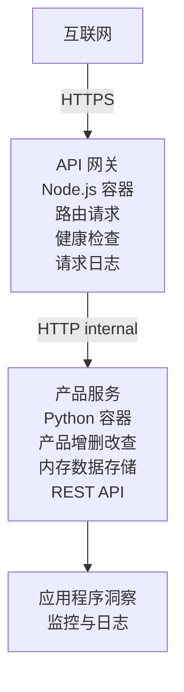

# Microservices Architecture - Container App Example

⏱️ <strong>预计时间</strong>：25-35 分钟 | 💰 <strong>估计费用</strong>：~$50-100/月 | ⭐ <strong>复杂度</strong>：高级

一个 <strong>简化但可运行</strong> 的微服务架构示例，使用 AZD CLI 部署到 Azure Container Apps。此示例演示服务间通信、容器编排和监控，采用一个实用的 2 服务设置。

> **📚 学习方法**：此示例从一个最小的 2 服务架构（API 网关 + 后端服务）开始，您可以实际部署并学习。掌握基础后，我们提供扩展到完整微服务生态的指南。

## 你将学到什么

完成此示例后，你将能够：
- 将多个容器部署到 Azure Container Apps
- 使用内部网络实现服务到服务的通信
- 配置基于环境的自动伸缩和健康检查
- 使用 Application Insights 监控分布式应用
- 理解微服务部署模式和最佳实践
- 学会从简单到复杂的渐进扩展方法

## 架构

### 阶段 1：我们要构建的内容（包含在此示例中）


**为什么从简单开始？**
- ✅ 快速部署和理解（25-35 分钟）
- ✅ 在不增加复杂性的情况下学习核心微服务模式
- ✅ 可修改和实验的可运行代码
- ✅ 学习成本较低（约 $50-100/月 对比 $300-1400/月）
- ✅ 在添加数据库和消息队列之前建立信心

<strong>类比</strong>：把这看作学开车。你从一个空的停车场（2 个服务）开始，掌握基础，然后再进阶到城市交通（5 个以上服务并带数据库）。

### 阶段 2：未来扩展（参考架构）

一旦你掌握了 2 服务架构，就可以扩展为：

```
Full Architecture (Not Included - For Reference)
├── API Gateway (✅ Included)
├── Product Service (✅ Included)
├── Order Service (🔜 Add next)
├── User Service (🔜 Add next)
├── Notification Service (🔜 Add last)
├── Azure Service Bus (🔜 For async communication)
├── Cosmos DB (🔜 For product persistence)
├── Azure SQL (🔜 For order management)
└── Azure Storage (🔜 For file storage)
```

查看文档末尾的“Expansion Guide”部分，获取逐步说明。

## 包含的功能

✅ <strong>服务发现</strong>：容器之间基于 DNS 的自动发现  
✅ <strong>负载均衡</strong>：跨副本的内置负载均衡  
✅ <strong>自动伸缩</strong>：基于 HTTP 请求对每个服务独立伸缩  
✅ <strong>健康监控</strong>：两个服务的存活和就绪探针  
✅ <strong>分布式日志</strong>：使用 Application Insights 的集中式日志记录  
✅ <strong>内部网络</strong>：安全的服务间通信  
✅ <strong>容器编排</strong>：自动部署和伸缩  
✅ <strong>零停机更新</strong>：具有修订管理的滚动更新  

## 前置条件

### 必需工具

开始之前，确认你已安装以下工具：

1. **[Azure Developer CLI (azd)](https://learn.microsoft.com/azure/developer/azure-developer-cli/install-azd)**（版本 1.0.0 或更高）
   ```bash
   azd version
   # 预期输出：azd 版本 1.0.0 或更高
   ```

2. **[Azure CLI](https://learn.microsoft.com/cli/azure/install-azure-cli)**（版本 2.50.0 或更高）
   ```bash
   az --version
   # 预期输出：azure-cli 2.50.0 或更高版本
   ```

3. **[Docker](https://www.docker.com/get-started)**（用于本地开发/测试 - 可选）
   ```bash
   docker --version
   # 预期输出：Docker 版本 20.10 或更高
   ```

### Azure 要求

- 一个有效的 **Azure 订阅**（[create a free account](https://azure.microsoft.com/free/)）
- 在订阅中创建资源的权限
- 在订阅或资源组上的 **Contributor** 角色

### 知识前置条件

这是一个 <strong>高级</strong> 示例。你应该具备：
- 已完成 [Simple Flask API example](../../../../../examples/container-app/simple-flask-api) 
- 对微服务架构有基本理解
- 熟悉 REST API 和 HTTP
- 了解容器概念

**刚接触 Container Apps？** 建议先查看 [Simple Flask API example](../../../../../examples/container-app/simple-flask-api) 以学习基础知识。

## 快速开始（逐步指南）

### 第 1 步：克隆并进入目录

```bash
git clone https://github.com/microsoft/AZD-for-beginners.git
cd AZD-for-beginners/examples/container-app/microservices
```

**✓ 成功检查**：确认你能看到 `azure.yaml`：
```bash
ls
# 预期：README.md、azure.yaml、infra/、src/
```

### 第 2 步：登录 Azure

```bash
azd auth login
```

这会在浏览器中打开 Azure 身份验证页面。使用你的 Azure 凭据登录。

**✓ 成功检查**：你应该看到：
```
Logged in to Azure.
```

### 第 3 步：初始化环境

```bash
azd init
```

<strong>你会看到的提示</strong>：
- **Environment name**：输入一个简短名称（例如 `microservices-dev`）
- **Azure subscription**：选择你的订阅
- **Azure location**：选择一个区域（例如 `eastus`, `westeurope`）

**✓ 成功检查**：你应该看到：
```
SUCCESS: New project initialized!
```

### 第 4 步：部署基础设施和服务

```bash
azd up
```

<strong>将发生的事情</strong>（需要 8-12 分钟）：
1. 创建 Container Apps 环境
2. 创建用于监控的 Application Insights
3. 构建 API 网关 容器（Node.js）
4. 构建 Product Service 容器（Python）
5. 将两个容器部署到 Azure
6. 配置网络和健康检查
7. 设置监控和日志记录

**✓ 成功检查**：你应该看到：
```
SUCCESS: Your application was deployed to Azure in X minutes Y seconds.
Endpoint: https://api-gateway-<unique-id>.azurecontainerapps.io
```

**⏱️ 时间**：8-12 分钟

### 第 5 步：测试部署

```bash
# 获取网关端点
GATEWAY_URL=$(azd env get-values | grep API_GATEWAY_URL | cut -d '=' -f2 | tr -d '"')

# 测试 API 网关的健康状态
curl $GATEWAY_URL/health

# 预期输出:
# {"status":"healthy","service":"api-gateway","timestamp":"2025-11-19T10:30:00Z"}
```

**通过网关测试 product service**：
```bash
# 列出产品
curl $GATEWAY_URL/api/products

# 预期输出:
# [
#   {"id":1,"name":"笔记本电脑","price":999.99,"stock":50},
#   {"id":2,"name":"鼠标","price":29.99,"stock":200},
#   {"id":3,"name":"键盘","price":79.99,"stock":150}
# ]
```

**✓ 成功检查**：两个端点均返回 JSON 数据且无错误。

---

**🎉 恭喜！** 你已将微服务架构部署到 Azure！

## 项目结构

所有实现文件均已包含——这是一个完整的工作示例：

```
microservices/
│
├── README.md                         # This file
├── azure.yaml                        # AZD configuration
├── .gitignore                        # Git ignore patterns
│
├── infra/                           # Infrastructure as Code (Bicep)
│   ├── main.bicep                   # Main orchestration
│   ├── abbreviations.json           # Naming conventions
│   ├── core/                        # Shared infrastructure
│   │   ├── container-apps-environment.bicep  # Container environment + registry
│   │   └── monitor.bicep            # Application Insights + Log Analytics
│   └── app/                         # Service definitions
│       ├── api-gateway.bicep        # API Gateway container app
│       └── product-service.bicep    # Product Service container app
│
└── src/                             # Application source code
    ├── api-gateway/                 # Node.js API Gateway
    │   ├── app.js                   # Express server with routing
    │   ├── package.json             # Node dependencies
    │   └── Dockerfile               # Container definition
    └── product-service/             # Python Product Service
        ├── main.py                  # Flask API with product data
        ├── requirements.txt         # Python dependencies
        └── Dockerfile               # Container definition
```

**各组件功能说明：**

**Infrastructure (infra/)**：
- `main.bicep`: 协调所有 Azure 资源及其依赖关系
- `core/container-apps-environment.bicep`: 创建 Container Apps 环境和 Azure Container Registry
- `core/monitor.bicep`: 为分布式日志设置 Application Insights
- `app/*.bicep`: 带有伸缩和健康检查的各个 container app 定义

**API Gateway (src/api-gateway/)**：
- 面向公众的服务，将请求路由到后端服务
- 实现日志记录、错误处理和请求转发
- 演示服务到服务的 HTTP 通信

**Product Service (src/product-service/)**：
- 内部服务，带有内存中的产品目录（为简单起见）
- 带有健康检查的 REST API
- 后端微服务模式示例

## 服务概览

### API Gateway (Node.js/Express)

<strong>端口</strong>：8080  
<strong>访问</strong>：公共（外部入口）  
<strong>用途</strong>：将传入请求路由到相应的后端服务  

<strong>端点</strong>：
- `GET /` - 服务信息
- `GET /health` - 健康检查端点
- `GET /api/products` - 转发到 product service（列出所有）
- `GET /api/products/:id` - 转发到 product service（按 ID 获取）

<strong>主要特性</strong>：
- 使用 axios 的请求路由
- 集中式日志记录
- 错误处理和超时管理
- 通过环境变量进行服务发现
- Application Insights 集成

<strong>代码亮点</strong>（`src/api-gateway/app.js`）：
```javascript
// 内部服务通信
app.get('/api/products', async (req, res) => {
  const response = await axios.get(`${PRODUCT_SERVICE_URL}/products`);
  res.json(response.data);
});
```

### Product Service (Python/Flask)

<strong>端口</strong>：8000  
<strong>访问</strong>：仅内部（无外部入口）  
<strong>用途</strong>：使用内存数据管理产品目录  

<strong>端点</strong>：
- `GET /` - 服务信息
- `GET /health` - 健康检查端点
- `GET /products` - 列出所有产品
- `GET /products/<id>` - 按 ID 获取产品

<strong>主要特性</strong>：
- 使用 Flask 的 RESTful API
- 内存产品存储（简单，无需数据库）
- 带探针的健康监控
- 结构化日志记录
- Application Insights 集成

<strong>数据模型</strong>：
```python
{
  "id": 1,
  "name": "Laptop",
  "description": "High-performance laptop",
  "price": 999.99,
  "stock": 50
}
```

**为什么仅限内部？**
product service 不对外暴露。所有请求必须通过 API 网关，网关提供：
- 安全性：受控制的访问入口
- 灵活性：可以在不影响客户端的情况下更改后端
- 监控：集中请求日志

## 理解服务通信

### 服务如何互相通信

在此示例中，API 网关使用 **内部 HTTP 调用** 与 Product Service 通信：

```javascript
// API 网关 (src/api-gateway/app.js)
const PRODUCT_SERVICE_URL = process.env.PRODUCT_SERVICE_URL;

// 发起内部 HTTP 请求
const response = await axios.get(`${PRODUCT_SERVICE_URL}/products`);
```

<strong>要点</strong>：

1. **基于 DNS 的发现**：Container Apps 自动为内部服务提供 DNS
   - Product Service FQDN: `product-service.internal.<environment>.azurecontainerapps.io`
   - 简化为：`http://product-service`（Container Apps 会解析它）

2. <strong>不对外暴露</strong>：在 Bicep 中 product service 的 `external: false`
   - 仅在 Container Apps 环境内可访问
   - 无法从互联网直接访问

3. <strong>环境变量</strong>：服务 URL 在部署时注入
   - Bicep 将内部 FQDN 传递给网关
   - 应用代码中没有硬编码 URL

<strong>类比</strong>：把它想象成办公室房间。API 网关是接待处（面向公众），Product Service 是办公室（仅内部）。访客必须通过接待才能到达任何办公室。

## 部署选项

### 完整部署（推荐）

```bash
# 部署基础设施和两个服务
azd up
```

此部署包括：
1. Container Apps 环境
2. Application Insights
3. Container Registry
4. API 网关 容器
5. Product Service 容器

<strong>时间</strong>：8-12 分钟

### 单独部署某个服务

```bash
# 仅部署一个服务（在首次运行 azd up 之后）
azd deploy api-gateway

# 或者部署产品服务
azd deploy product-service
```

<strong>使用场景</strong>：当你更新了某个服务的代码并只想重新部署该服务时使用。

### 更新配置

```bash
# 更改缩放参数
azd env set GATEWAY_MAX_REPLICAS 30

# 使用新配置重新部署
azd up
```

## 配置

### 伸缩配置

两个服务在它们的 Bicep 文件中都配置了基于 HTTP 的自动伸缩：

**API Gateway**：
- 最小副本数：2（至少保持 2 个以确保可用性）
- 最大副本数：20
- 伸缩触发器：每个副本 50 个并发请求

**Product Service**：
- 最小副本数：1（如有需要可缩减为零）
- 最大副本数：10
- 伸缩触发器：每个副本 100 个并发请求

<strong>自定义伸缩</strong>（在 `infra/app/*.bicep` 中）：
```bicep
scale: {
  minReplicas: 1
  maxReplicas: 10
  rules: [
    {
      name: 'http-scale-rule'
      http: {
        metadata: {
          concurrentRequests: '100'  // Adjust this
        }
      }
    }
  ]
}
```

### 资源分配

**API Gateway**：
- CPU：1.0 vCPU
- 内存：2 GiB
- 理由：处理所有外部流量

**Product Service**：
- CPU：0.5 vCPU
- 内存：1 GiB
- 理由：轻量的内存操作

### 健康检查

两个服务都包含存活和就绪探针：

```bicep
probes: [
  {
    type: 'Liveness'
    httpGet: {
      path: '/health'
      port: 8080
    }
    initialDelaySeconds: 10
    periodSeconds: 30
  }
  {
    type: 'Readiness'
    httpGet: {
      path: '/health'
      port: 8080
    }
    initialDelaySeconds: 5
    periodSeconds: 10
  }
]
```

<strong>这意味着什么</strong>：
- **存活性（Liveness）**：如果健康检查失败，Container Apps 会重启容器
- **就绪性（Readiness）**：如果未就绪，Container Apps 会停止将流量路由到该副本


## 监控与可观测性

### 查看服务日志

```bash
# 使用 azd monitor 查看日志
azd monitor --logs

# 或使用 Azure CLI 针对特定的 Container Apps:
# 从 API 网关实时流式查看日志
az containerapp logs show --name api-gateway --resource-group $RG_NAME --follow

# 查看最近的产品服务日志
az containerapp logs show --name product-service --resource-group $RG_NAME --tail 100
```

<strong>预期输出</strong>：
```
[api-gateway] API Gateway listening on port 8080
[api-gateway] Product Service URL: http://product-service
[api-gateway] GET /api/products 200 - 45ms
[product-service] Retrieved 5 products
```

### Application Insights 查询

在 Azure 门户中访问 Application Insights，然后运行这些查询：

<strong>查找慢请求</strong>：
```kusto
requests
| where timestamp > ago(1h)
| where duration > 1000  // Requests taking >1 second
| summarize count() by name, cloud_RoleName
| order by count_ desc
```

<strong>跟踪服务到服务的调用</strong>：
```kusto
dependencies
| where timestamp > ago(1h)
| where type == "Http"
| project timestamp, name, target, duration, success
| order by timestamp desc
```

<strong>按服务统计错误率</strong>：
```kusto
exceptions
| where timestamp > ago(24h)
| summarize errorCount = count() by cloud_RoleName, type
| order by errorCount desc
```

<strong>随时间的请求量</strong>：
```kusto
requests
| where timestamp > ago(1h)
| summarize requestCount = count() by bin(timestamp, 5m), cloud_RoleName
| render timechart
```

### 访问监控仪表盘

```bash
# 获取 Application Insights 的详细信息
azd env get-values | grep APPLICATIONINSIGHTS

# 打开 Azure 门户的监控
az monitor app-insights component show \
  --app $(azd env get-values | grep APPLICATIONINSIGHTS_CONNECTION_STRING | cut -d '=' -f2) \
  --resource-group $(azd env get-values | grep AZURE_RESOURCE_GROUP | cut -d '=' -f2) \
  --query "appId" -o tsv
```

### 实时指标

1. 导航到 Azure 门户中的 Application Insights
2. 点击 “Live Metrics”
3. 查看实时请求、失败和性能
4. 通过运行测试：`curl $(azd env get-values | grep API_GATEWAY_URL | cut -d '=' -f2 | tr -d '"')/api/products`

## 实践练习

[注：有关详细的逐步练习（包括部署验证、数据修改、自动伸缩测试、错误处理和添加第三个服务），请参阅上方的“Practical Exercises”部分。]

## 成本分析

### 估计的月度费用（针对此 2 服务示例）

| Resource | Configuration | Estimated Cost |
|----------|--------------|----------------|
| API Gateway | 2-20 replicas, 1 vCPU, 2GB RAM | $30-150 |
| Product Service | 1-10 replicas, 0.5 vCPU, 1GB RAM | $15-75 |
| Container Registry | Basic tier | $5 |
| Application Insights | 1-2 GB/month | $5-10 |
| Log Analytics | 1 GB/month | $3 |
| **Total** | | **$58-243/month** |

<strong>按使用情况的成本细分</strong>：
- <strong>轻量流量</strong>（测试/学习）：~$60/月
- <strong>中等流量</strong>（小规模生产）：~$120/月
- <strong>高流量</strong>（繁忙时段）：~$240/月

### 成本优化建议

1. **开发环境缩减到零（Scale to Zero）**：
   ```bicep
   scale: {
     minReplicas: 0  // Save $30-40/month when not in use
     maxReplicas: 10
   }
   ```

2. **在添加 Cosmos DB 时使用 Consumption 计划**：
   - 仅为实际使用付费
   - 无最低收费

3. **设置 Application Insights 采样**：
   ```javascript
   appInsights.defaultClient.config.samplingPercentage = 50; // 抽样 50% 的请求
   ```

4. <strong>不需要时清理资源</strong>：
   ```bash
   azd down
   ```

### 免费层选项

用于学习/测试时，可考虑：
- 使用 Azure 免费额度（前 30 天）
- 将副本数保持在最低
- 测试后删除（无持续费用）

---

## 清理

为避免持续费用，请删除所有资源：

```bash
azd down --force --purge
```

<strong>确认提示</strong>：
```
? Total resources to delete: 6, are you sure you want to continue? (y/N)
```

输入 `y` 以确认。

<strong>将被删除的内容</strong>：
- Container Apps 环境
- 两个 Container Apps（网关和产品服务）
- 容器注册表
- Application Insights
- Log Analytics 工作区
- 资源组

**✓ 验证清理**：
```bash
az group list --query "[?starts_with(name,'rg-microservices')]" --output table
```

应返回空。

---

## 扩展指南：从 2 个服务到 5 个及以上

一旦你掌握了这个由 2 个服务组成的架构，以下是扩展的方法：

### 第 1 阶段：添加数据库持久化（下一步）

**为产品服务添加 Cosmos DB**：

1. Create `infra/core/cosmos.bicep`:
   ```bicep
   resource cosmosAccount 'Microsoft.DocumentDB/databaseAccounts@2023-04-15' = {
     name: name
     location: location
     kind: 'GlobalDocumentDB'
     properties: {
       databaseAccountOfferType: 'Standard'
       locations: [{ locationName: location, failoverPriority: 0 }]
     }
   }
   ```

2. 更新产品服务以使用 Cosmos DB，而不是内存数据

3. 预计额外费用：约 $25/月（无服务器）

### 第 2 阶段：添加第三个服务（订单管理）

<strong>创建订单服务</strong>：

1. 新文件夹：`src/order-service/`（Python/Node.js/C#）
2. 新的 Bicep：`infra/app/order-service.bicep`
3. 更新 API 网关以路由 `/api/orders`
4. 添加 Azure SQL 数据库以持久化订单

<strong>架构变为</strong>：
```
API Gateway → Product Service (Cosmos DB)
           → Order Service (Azure SQL)
```

### 第 3 阶段：添加异步通信（Service Bus）

<strong>实现事件驱动架构</strong>：

1. 添加 Azure Service Bus：`infra/core/servicebus.bicep`
2. 产品服务发布 "ProductCreated" 事件
3. 订单服务订阅产品事件
4. 添加通知服务以处理事件

<strong>模式</strong>：请求/响应（HTTP）+ 事件驱动（Service Bus）

### 第 4 阶段：添加用户认证

<strong>实现用户服务</strong>：

1. 创建 `src/user-service/`（Go/Node.js）
2. 添加 Azure AD B2C 或自定义 JWT 认证
3. API 网关验证令牌
4. 服务检查用户权限

### 第 5 阶段：生产就绪

<strong>添加以下组件</strong>：
- Azure Front Door（全局负载均衡）
- Azure Key Vault（密钥管理）
- Azure Monitor Workbooks（自定义仪表板）
- CI/CD 管道（GitHub Actions）
- 蓝绿部署
- 为所有服务配置托管标识

<strong>完整生产架构成本</strong>：约 $300-1,400/月

---

## 了解更多

### 相关文档
- [Azure Container Apps 文档](https://learn.microsoft.com/azure/container-apps/)
- [微服务架构指南](https://learn.microsoft.com/azure/architecture/guide/architecture-styles/microservices)
- [用于分布式跟踪的 Application Insights](https://learn.microsoft.com/azure/azure-monitor/app/distributed-tracing)
- [Azure Developer CLI 文档](https://learn.microsoft.com/azure/developer/azure-developer-cli/)

### 本课程的下一步
- ← 上一页: [Simple Flask API](../../../../../examples/container-app/simple-flask-api) - 初学者单容器示例
- → 下一页: [AI Integration Guide](../../../../../examples/docs/ai-foundry) - 添加 AI 功能
- 🏠 [课程主页](../../README.md)

### 对比：何时使用何种方案

<strong>单容器应用</strong>（Simple Flask API 示例）：
- ✅ 简单应用
- ✅ 单体架构
- ✅ 部署快速
- ❌ 可扩展性有限
- <strong>成本</strong>：约 $15-50/月

<strong>微服务</strong>（本示例）：
- ✅ 复杂应用
- ✅ 服务独立伸缩
- ✅ 团队自治（不同服务，不同团队）
- ❌ 管理更复杂
- <strong>成本</strong>：约 $60-250/月

**Kubernetes (AKS)**：
- ✅ 最大的控制和灵活性
- ✅ 多云可移植性
- ✅ 高级网络功能
- ❌ 需要 Kubernetes 专业知识
- <strong>成本</strong>：最低约 $150-500/月

<strong>建议</strong>：从 Container Apps（本示例）开始，只有在需要 Kubernetes 特定功能时再迁移到 AKS。

---

## 常见问题

**问：为什么只有 2 个服务而不是 5 个以上？**  
答：逐步教学。先用一个简单示例掌握基础（服务通信、监控、伸缩），再增加复杂性。你在这里学到的模式适用于 100 个服务的架构。

**问：我可以自己添加更多服务吗？**  
答：当然可以！按照上面的扩展指南操作。每个新服务遵循相同模式：创建 src 文件夹，创建 Bicep 文件，更新 azure.yaml，部署。

**问：这是可用于生产环境吗？**  
答：这是一个坚实的基础。对于生产环境，需要添加：托管标识、Key Vault、持久化数据库、CI/CD 管道、监控告警和备份策略。

**问：为什么不使用 Dapr 或其他服务网格？**  
答：为了学习保持简单。掌握原生 Container Apps 网络后，可以在高级场景中添加 Dapr。

**问：如何在本地调试？**  
答：使用 Docker 在本地运行服务：
```bash
cd src/api-gateway
docker build -t local-gateway .
docker run -p 8080:8080 -e PRODUCT_SERVICE_URL=http://localhost:8000 local-gateway
```

**问：我可以使用不同的编程语言吗？**  
答：可以！本示例展示了 Node.js（网关）+ Python（产品服务）。你可以混合任何能在容器中运行的语言。

**问：如果我没有 Azure 额度怎么办？**  
答：使用 Azure 免费额度（新帐户前 30 天）或仅短时间部署进行测试并立即删除。

---

> **🎓 学习路径摘要**：你已学会部署具有自动伸缩、内部网络、集中监控和生产就绪模式的多服务架构。这个基础将使你为复杂的分布式系统和企业级微服务架构做好准备。

**📚 课程导航：**
- ← 上一页: [Simple Flask API](../../../../../examples/container-app/simple-flask-api)
- → 下一页: [数据库集成示例](../../../../../examples/database-app)
- 🏠 [课程主页](../../../README.md)
- 📖 [Container Apps 最佳实践](../../../docs/chapter-04-infrastructure/deployment-guide.md)

---

<!-- CO-OP TRANSLATOR DISCLAIMER START -->
**免责声明**:
本文件已使用 AI 翻译服务 [Co-op Translator](https://github.com/Azure/co-op-translator) 进行翻译。尽管我们力求准确，但请注意自动翻译可能包含错误或不准确之处。原始语言的文档应被视为权威来源。对于关键信息，建议使用专业人工翻译。对于因使用本翻译而产生的任何误解或曲解，我们不承担任何责任。
<!-- CO-OP TRANSLATOR DISCLAIMER END -->