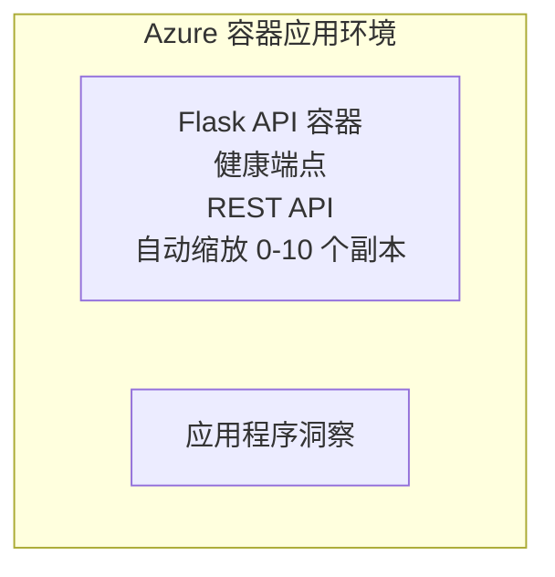

# 简单的 Flask API - Container 应用 示例

**学习路径：** 初学者 ⭐ | **时间：** 25-35 分钟 | **费用：** $0-15/月

一个完整、可运行的 Python Flask REST API，使用 Azure Developer CLI (azd) 部署到 Azure Container Apps。此示例演示容器部署、自动伸缩和监控基础。

## 🎯 你将学习的内容

- 将容器化的 Python 应用部署到 Azure
- 配置具有缩至零的自动伸缩
- 实现存活探针和就绪检查
- 监控应用日志和指标
- 使用 Azure Developer CLI 进行快速部署

## 📦 包含内容

✅ **Flask Application** - 完整的带 CRUD 操作的 REST API (`src/app.py`)  
✅ **Dockerfile** - 生产就绪的容器配置  
✅ **Bicep Infrastructure** - Container Apps 环境和 API 部署  
✅ **AZD Configuration** - 一键部署设置  
✅ **Health Probes** - 配置的存活和就绪检查  
✅ **Auto-scaling** - 基于 HTTP 负载的 0-10 副本伸缩  

## 架构


## 先决条件

### 必备项
- **Azure Developer CLI (azd)** - [Install guide](https://learn.microsoft.com/azure/developer/azure-developer-cli/install-azd)
- **Azure subscription** - [Free account](https://azure.microsoft.com/free/)
- **Docker Desktop** - [Install Docker](https://www.docker.com/products/docker-desktop/) （用于本地测试）

### 验证先决条件

```bash
# 检查 azd 版本（需要 1.5.0 或更高）
azd version

# 验证 Azure 登录
azd auth login

# 检查 Docker（可选，用于本地测试）
docker --version
```

## ⏱️ 部署时间表

| 阶段 | 持续时间 | 发生事项 |
|-------|----------|--------------||
| 环境设置 | 30 秒 | 创建 azd 环境 |
| 构建容器 | 2-3 分钟 | 使用 Docker 构建 Flask 应用 |
| 配置基础设施 | 3-5 分钟 | 创建 Container Apps、注册表、监控 |
| 部署应用 | 2-3 分钟 | 推送镜像并部署到 Container Apps |
| <strong>总计</strong> | **8-12 分钟** | 完成部署并准备就绪 |

## 快速开始

```bash
# 导航到示例
cd examples/container-app/simple-flask-api

# 初始化环境（选择唯一名称）
azd env new myflaskapi

# 部署所有内容（基础设施 + 应用程序）
azd up
# 您将被提示：
# 1. 选择 Azure 订阅
# 2. 选择位置（例如：eastus2）
# 3. 等待 8-12 分钟以完成部署

# 获取您的 API 端点
azd env get-values

# 测试 API
curl $(azd env get-value API_ENDPOINT)/health
```

**预期输出：**
```json
{
  "status": "healthy",
  "timestamp": "2025-11-19T10:30:00Z",
  "service": "simple-flask-api",
  "version": "1.0.0"
}
```

## ✅ 验证部署

### 步骤 1：检查部署状态

```bash
# 查看已部署的服务
azd show

# 预期输出显示:
# - 服务: api
# - 端点: https://ca-api-[env].xxx.azurecontainerapps.io
# - 状态: 运行中
```

### 步骤 2：测试 API 端点

```bash
# 获取 API 端点
API_URL=$(azd env get-value API_ENDPOINT)

# 测试健康状态
curl $API_URL/health

# 测试根端点
curl $API_URL/

# 创建一个条目
curl -X POST $API_URL/api/items \
  -H "Content-Type: application/json" \
  -d '{"name": "Test Item", "description": "My first item"}'

# 获取所有条目
curl $API_URL/api/items
```

**成功标准：**
- ✅ Health 端点返回 HTTP 200
- ✅ 根端点显示 API 信息
- ✅ POST 创建项目并返回 HTTP 201
- ✅ GET 返回已创建的项目

### 步骤 3：查看日志

```bash
# 使用 azd monitor 流式传输实时日志
azd monitor --logs

# 或者使用 Azure CLI：
az containerapp logs show --name api --resource-group $RG_NAME --follow

# 您应该会看到：
# - Gunicorn 启动消息
# - HTTP 请求日志
# - 应用程序信息日志
```

## 项目结构

```
simple-flask-api/
├── azure.yaml              # AZD configuration
├── infra/
│   ├── main.bicep         # Main infrastructure
│   ├── main.parameters.json
│   └── app/
│       ├── container-env.bicep
│       └── api.bicep
└── src/
    ├── app.py             # Flask application
    ├── requirements.txt
    └── Dockerfile
```

## API 端点

| 端点 | 方法 | 描述 |
|----------|--------|-------------|
| `/health` | GET | 健康检查 |
| `/api/items` | GET | 列出所有项目 |
| `/api/items` | POST | 创建新项目 |
| `/api/items/{id}` | GET | 获取特定项目 |
| `/api/items/{id}` | PUT | 更新项目 |
| `/api/items/{id}` | DELETE | 删除项目 |

## 配置

### 环境变量

```bash
# 设置自定义配置
azd env set PORT 8000
azd env set LOG_LEVEL info
azd env set MAX_REPLICAS 20
```

### 伸缩配置

该 API 会根据 HTTP 流量自动伸缩：
- <strong>最小副本数</strong>：0（空闲时缩至零）
- <strong>最大副本数</strong>：10
- <strong>每个副本的并发请求数</strong>：50

## 开发

### 本地运行

```bash
# 安装依赖
cd src
pip install -r requirements.txt

# 运行应用
python app.py

# 本地测试
curl http://localhost:8000/health
```

### 构建并测试容器

```bash
# 构建 Docker 镜像
docker build -t flask-api:local ./src

# 在本地运行容器
docker run -p 8000:8000 flask-api:local

# 测试容器
curl http://localhost:8000/health
```

## 部署

### 完整部署

```bash
# 部署基础设施和应用程序
azd up
```

### 仅代码部署

```bash
# 仅部署应用程序代码（基础设施保持不变）
azd deploy api
```

### 更新配置

```bash
# 更新环境变量
azd env set API_KEY "new-api-key"

# 使用新配置重新部署
azd deploy api
```

## 监控

### 查看日志

```bash
# 使用 azd monitor 实时流式查看日志
azd monitor --logs

# 或者使用适用于容器应用的 Azure CLI：
az containerapp logs show --name api --resource-group $RG_NAME --follow

# 查看最近 100 行
az containerapp logs show --name api --resource-group $RG_NAME --tail 100
```

### 监控指标

```bash
# 打开 Azure Monitor 仪表板
azd monitor --overview

# 查看特定指标
az monitor metrics list \
  --resource $(azd show --output json | jq -r '.services.api.resourceId') \
  --metric "Requests,ResponseTime"
```

## 测试

### 健康检查

```bash
curl $(azd show --output json | jq -r '.services.api.endpoint')/health
```

预期响应：
```json
{
  "status": "healthy",
  "timestamp": "2025-11-19T10:30:00Z"
}
```

### 创建项目

```bash
curl -X POST $(azd show --output json | jq -r '.services.api.endpoint')/api/items \
  -H "Content-Type: application/json" \
  -d '{"name": "Test Item", "description": "A test item"}'
```

### 获取所有项目

```bash
curl $(azd show --output json | jq -r '.services.api.endpoint')/api/items
```

## 成本优化

此部署使用缩至零功能，因此仅在 API 处理请求时计费：

- <strong>空闲成本</strong>：约 $0/月（缩至零）
- <strong>活动成本</strong>：约 $0.000024/秒 每个副本
- <strong>预期月成本</strong>（轻度使用）：$5-15

### 进一步降低成本

```bash
# 为开发环境缩减最大副本数
azd env set MAX_REPLICAS 3

# 使用更短的空闲超时时间
azd env set SCALE_TO_ZERO_TIMEOUT 300  # 5 分钟
```

## 故障排除

### 容器无法启动

```bash
# 使用 Azure CLI 检查容器日志
az containerapp logs show --name api --resource-group $RG_NAME --tail 100

# 验证 Docker 镜像能在本地构建
docker build -t test ./src
```

### API 无法访问

```bash
# 验证 ingress 是否为外部
az containerapp show --name api --resource-group rg-simple-flask-api \
  --query properties.configuration.ingress.external
```

### 响应时间高

```bash
# 检查 CPU/内存 使用情况
az monitor metrics list \
  --resource $(azd show --output json | jq -r '.services.api.resourceId') \
  --metric "CPUPercentage,MemoryPercentage"

# 如有需要，扩展资源
az containerapp update --name api --resource-group rg-simple-flask-api \
  --cpu 1.0 --memory 2Gi
```

## 清理

```bash
# 删除所有资源
azd down --force --purge
```

## 下一步

### 扩展此示例

1. <strong>添加数据库</strong> - 集成 Azure Cosmos DB 或 SQL 数据库
   ```bash
   # 将 Cosmos DB 模块添加到 infra/main.bicep
   # 在 app.py 中更新数据库连接
   ```

2. <strong>添加身份验证</strong> - 实现 Azure AD 或 API 密钥
   ```python
   # 在 app.py 中添加身份验证中间件
   from functools import wraps
   ```

3. **设置 CI/CD** - GitHub Actions 工作流
   ```yaml
   # Create .github/workflows/deploy.yml
   name: Deploy to Azure
   on: [push]
   ```

4. <strong>添加托管身份</strong> - 为访问 Azure 服务提供安全访问
   ```bicep
   # Update infra/app/api.bicep
   identity: { type: 'SystemAssigned' }
   ```

### 相关示例

- **[数据库应用](../../../../../examples/database-app)** - 使用 SQL 数据库的完整示例
- **[微服务](../../../../../examples/container-app/microservices)** - 多服务架构
- **[Container Apps 主指南](../README.md)** - 所有容器模式

### 学习资源

- 📚 [AZD 初学者课程](../../../README.md) - 课程主页
- 📚 [Container Apps 模式](../README.md) - 更多部署模式
- 📚 [AZD 模板库](https://azure.github.io/awesome-azd/) - 社区模板

## 其他资源

### 文档
- **[Flask 文档](https://flask.palletsprojects.com/)** - Flask 框架指南
- **[Azure Container Apps](https://learn.microsoft.com/azure/container-apps/)** - 官方 Azure 文档
- **[Azure Developer CLI](https://learn.microsoft.com/azure/developer/azure-developer-cli/)** - azd 命令参考

### 教程
- **[Container Apps 快速入门](https://learn.microsoft.com/azure/container-apps/quickstart-portal)** - 部署您的第一个应用
- **[Azure 上的 Python](https://learn.microsoft.com/azure/developer/python/)** - Python 开发指南
- **[Bicep 语言](https://learn.microsoft.com/azure/azure-resource-manager/bicep/)** - 基础设施即代码

### 工具
- **[Azure 门户](https://portal.azure.com)** - 可视化管理资源
- **[VS Code Azure 扩展](https://marketplace.visualstudio.com/items?itemName=ms-azuretools.vscode-azurecontainerapps)** - IDE 集成

---

**🎉 恭喜！** 你已将生产就绪的 Flask API 部署到 Azure Container Apps，并具备自动伸缩和监控功能。

**有问题？** [打开一个 issue](https://github.com/microsoft/AZD-for-beginners/issues) 或查看 [常见问题解答](../../../resources/faq.md)

---

<!-- CO-OP TRANSLATOR DISCLAIMER START -->
**免责声明**:
本文档已使用 AI 翻译服务 [Co-op Translator](https://github.com/Azure/co-op-translator) 进行翻译。尽管我们力求准确，但请注意，自动翻译可能包含错误或不准确之处。应以原始语言的原始文档为权威来源。对于重要信息，建议使用专业人工翻译。对于因使用本翻译而产生的任何误解或曲解，我们概不负责。
<!-- CO-OP TRANSLATOR DISCLAIMER END -->