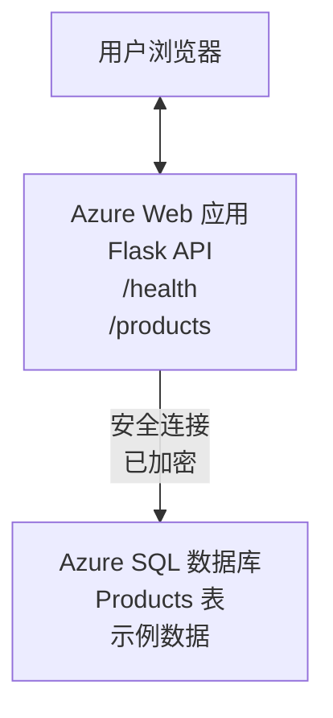

# 使用 AZD 部署 Microsoft SQL 数据库和 Web 应用

⏱️ <strong>预计时间</strong>：20-30 分钟 | 💰 <strong>预计费用</strong>：~$15-25/月 | ⭐ <strong>复杂度</strong>：中级

这个 **完整、可运行的示例** 演示如何使用 [Azure Developer CLI (azd)](https://learn.microsoft.com/azure/developer/azure-developer-cli/) 将带有 Microsoft SQL 数据库的 Python Flask Web 应用部署到 Azure。所有代码均已包含并经过测试——无需外部依赖。

## 你将学到什么

完成此示例后，你将：
- 使用基础设施即代码部署多层应用（Web 应用 + 数据库）
- 配置安全的数据库连接，避免硬编码机密
- 使用 Application Insights 监控应用健康
- 使用 AZD CLI 高效管理 Azure 资源
- 遵循 Azure 在安全、成本优化和可观测性方面的最佳实践

## 场景概述
- **Web 应用**：具有数据库连接的 Python Flask REST API
- <strong>数据库</strong>：包含示例数据的 Azure SQL 数据库
- <strong>基础设施</strong>：使用 Bicep（模块化、可重用模板）预配
- <strong>部署</strong>：使用 `azd` 命令完全自动化部署
- <strong>监控</strong>：使用 Application Insights 进行日志和遥测

## 先决条件

### 所需工具

开始之前，请确认已安装以下工具：

1. **[Azure CLI](https://learn.microsoft.com/cli/azure/install-azure-cli)** (版本 2.50.0 或更高)  
   ```sh
   az --version
   # 预期输出：azure-cli 2.50.0 或更高版本
   ```

2. **[Azure Developer CLI (azd)](https://learn.microsoft.com/azure/developer/azure-developer-cli/install-azd)** (版本 1.0.0 或更高)  
   ```sh
   azd version
   # 预期输出：azd 版本 1.0.0 或更高
   ```

3. **[Python 3.8+](https://www.python.org/downloads/)**（用于本地开发）  
   ```sh
   python --version
   # 预期输出：Python 3.8 或更高版本
   ```

4. **[Docker](https://www.docker.com/get-started)**（可选，用于本地容器化开发）  
   ```sh
   docker --version
   # 预期输出：Docker 版本 20.10 或更高
   ```

### Azure 要求

- 一个有效的 **Azure 订阅**（[创建免费帐户](https://azure.microsoft.com/free/)）
- 在你的订阅中创建资源的权限
- 在订阅或资源组上具有 <strong>所有者</strong> 或 <strong>参与者</strong> 角色

### 知识先决条件

这是一个 <strong>中级</strong> 示例。你应熟悉：
- 基本命令行操作
- 基础云概念（资源、资源组）
- 对 Web 应用和数据库的基本理解

**不熟悉 AZD？** 请先阅读 [入门指南](../../docs/chapter-01-foundation/azd-basics.md)。

## 架构

此示例部署一个包含 Web 应用和 SQL 数据库的两层架构：


**资源部署：**
- <strong>资源组</strong>：所有资源的容器
- <strong>应用服务计划</strong>：基于 Linux 的托管（为节省成本使用 B1 层）
- **Web 应用**：运行 Python 3.11 的 Flask 应用
- **SQL 服务器**：受管数据库服务器，最低要求 TLS 1.2
- **SQL 数据库**：Basic 层（2GB，适合开发/测试）
- **Application Insights**：监控与日志
- **Log Analytics 工作区**：集中日志存储

<strong>类比</strong>：把它想象成一家餐厅（Web 应用）和一个冷库（数据库）。顾客从菜单（API 端点）点餐，厨房（Flask 应用）从冷库取出食材（数据）。餐厅经理（Application Insights）记录发生的所有事情。

## 文件夹结构

本示例包含所有文件——无需外部依赖：

```
examples/database-app/
│
├── README.md                    # This file
├── azure.yaml                   # AZD configuration file
├── .env.sample                  # Sample environment variables
├── .gitignore                   # Git ignore patterns
│
├── infra/                       # Infrastructure as Code (Bicep)
│   ├── main.bicep              # Main orchestration template
│   ├── abbreviations.json      # Azure naming conventions
│   └── resources/              # Modular resource templates
│       ├── sql-server.bicep    # SQL Server configuration
│       ├── sql-database.bicep  # Database configuration
│       ├── app-service-plan.bicep  # Hosting plan
│       ├── app-insights.bicep  # Monitoring setup
│       └── web-app.bicep       # Web application
│
└── src/
    └── web/                    # Application source code
        ├── app.py              # Flask REST API
        ├── requirements.txt    # Python dependencies
        └── Dockerfile          # Container definition
```

**每个文件的作用：**
- **azure.yaml**：告诉 AZD 要部署什么以及部署到哪里
- **infra/main.bicep**：协调所有 Azure 资源
- **infra/resources/*.bicep**：各个资源定义（模块化以便重用）
- **src/web/app.py**：包含数据库逻辑的 Flask 应用
- **requirements.txt**：Python 包依赖
- **Dockerfile**：用于部署的容器化说明

## 快速入门（分步）

### 第一步：克隆并进入目录

```sh
git clone https://github.com/microsoft/AZD-for-beginners.git
cd AZD-for-beginners/examples/database-app
```

**✓ 成功检查**：确认你能看到 `azure.yaml` 和 `infra/` 文件夹：
```sh
ls
# 预期：README.md, azure.yaml, infra/, src/
```

### 第2步：使用 Azure 进行身份验证

```sh
azd auth login
```

这将打开浏览器以进行 Azure 身份验证。使用你的 Azure 凭据登录。

**✓ 成功检查**：你应该看到：
```
Logged in to Azure.
```

### 第3步：初始化环境

```sh
azd init
```

<strong>会发生什么</strong>：AZD 为你的部署创建一个本地配置。

**你会看到的提示：**
- <strong>环境名称</strong>：输入一个简短的名称（例如 `dev`、`myapp`）
- **Azure 订阅**：从列表中选择你的订阅
- **Azure 区域**：选择一个区域（例如 `eastus`、`westeurope`）

**✓ 成功检查**：你应该看到：
```
SUCCESS: New project initialized!
```

### 第4步：预配 Azure 资源

```sh
azd provision
```

<strong>会发生什么</strong>：AZD 部署所有基础设施（需要 5-8 分钟）：
1. 创建资源组
2. 创建 SQL 服务器和数据库
3. 创建应用服务计划
4. 创建 Web 应用
5. 创建 Application Insights
6. 配置网络和安全

**你将被提示输入：**
- **SQL 管理员用户名**：输入用户名（例如 `sqladmin`）
- **SQL 管理员密码**：输入强密码（请保存！）

**✓ 成功检查**：你应该看到：
```
SUCCESS: Your application was provisioned in Azure in X minutes Y seconds.
You can view the resources created under the resource group rg-<env-name> in Azure Portal:
https://portal.azure.com/#@/resource/subscriptions/.../resourceGroups/rg-<env-name>
```

**⏱️ 时间**：5-8 分钟

### 第5步：部署应用程序

```sh
azd deploy
```

<strong>会发生什么</strong>：AZD 构建并部署你的 Flask 应用：
1. 打包 Python 应用
2. 构建 Docker 容器
3. 推送到 Azure Web 应用
4. 使用示例数据初始化数据库
5. 启动应用

**✓ 成功检查**：你应该看到：
```
SUCCESS: Your application was deployed to Azure in X minutes Y seconds.
You can view the resources created under the resource group rg-<env-name> in Azure Portal:
https://portal.azure.com/#@/resource/subscriptions/.../resourceGroups/rg-<env-name>
```

**⏱️ 时间**：3-5 分钟

### 第6步：浏览应用程序

```sh
azd browse
```

这将在浏览器中打开部署的 Web 应用，地址为 `https://app-<unique-id>.azurewebsites.net`

**✓ 成功检查**：你应该看到 JSON 输出：
```json
{
  "message": "Welcome to the Database App API",
  "endpoints": {
    "/": "This help message",
    "/health": "Health check endpoint",
    "/products": "List all products",
    "/products/<id>": "Get product by ID"
  }
}
```

### 第7步：测试 API 端点

<strong>健康检查</strong>（验证数据库连接）：
```sh
curl https://app-<your-id>.azurewebsites.net/health
```

<strong>预期响应</strong>：
```json
{
  "status": "healthy",
  "database": "connected"
}
```

<strong>列出产品</strong>（示例数据）：
```sh
curl https://app-<your-id>.azurewebsites.net/products
```

<strong>预期响应</strong>：
```json
[
  {
    "id": 1,
    "name": "Laptop",
    "description": "High-performance laptop",
    "price": 1299.99,
    "created_at": "2025-11-19T10:30:00"
  },
  ...
]
```

<strong>获取单个产品</strong>：
```sh
curl https://app-<your-id>.azurewebsites.net/products/1
```

**✓ 成功检查**：所有端点均返回无错误的 JSON 数据。

---

**🎉 恭喜！** 你已成功使用 AZD 将 Web 应用和数据库部署到 Azure。

## 配置深入解析

### 环境变量

机密通过 Azure 应用服务配置安全管理——<strong>绝不要将其硬编码在源代码中</strong>。

**由 AZD 自动配置：**
- `SQL_CONNECTION_STRING`：带有加密凭据的数据库连接
- `APPLICATIONINSIGHTS_CONNECTION_STRING`：监控遥测端点
- `SCM_DO_BUILD_DURING_DEPLOYMENT`：启用自动依赖安装

**机密的存储位置：**
1. 在 `azd provision` 期间，你通过安全提示提供 SQL 凭据
2. AZD 将它们存储在本地的 `.azure/<env-name>/.env` 文件中（已被 Git 忽略）
3. AZD 将它们注入到 Azure 应用服务配置中（静态加密存储）
4. 应用在运行时通过 `os.getenv()` 读取它们

### 本地开发

对于本地测试，从示例创建一个 `.env` 文件：

```sh
cp .env.sample .env
# 编辑 .env 文件以使用本地数据库连接
```

<strong>本地开发工作流</strong>：
```sh
# 安装依赖
cd src/web
pip install -r requirements.txt

# 设置环境变量
export SQL_CONNECTION_STRING="your-local-connection-string"

# 运行应用程序
python app.py
```

<strong>本地测试</strong>：
```sh
curl http://localhost:8000/health
# 预期: {"status": "healthy", "database": "connected"}
```

### 基础设施即代码

所有 Azure 资源都在 **Bicep 模板**（`infra/` 文件夹）中定义：

- <strong>模块化设计</strong>：每种资源类型都有自己的文件以便重用
- <strong>参数化</strong>：可自定义 SKU、区域和命名约定
- <strong>最佳实践</strong>：遵循 Azure 命名标准和安全默认值
- <strong>版本控制</strong>：基础设施更改通过 Git 跟踪

<strong>自定义示例</strong>：
要更改数据库层级，请编辑 `infra/resources/sql-database.bicep`：
```bicep
sku: {
  name: 'Standard'  // Changed from 'Basic'
  tier: 'Standard'
  capacity: 10
}
```

## 安全最佳实践

此示例遵循 Azure 的安全最佳实践：

### 1. <strong>源代码中不包含密钥</strong>
- ✅ 凭据存储在 Azure 应用服务配置中（已加密）
- ✅ `.env` 文件通过 `.gitignore` 从 Git 中排除
- ✅ 凭据在预配期间以安全参数传递

### 2. <strong>加密连接</strong>
- ✅ SQL 服务器最低使用 TLS 1.2
- ✅ Web 应用强制仅允许 HTTPS
- ✅ 数据库连接使用加密通道

### 3. <strong>网络安全</strong>
- ✅ SQL 服务器防火墙配置为仅允许 Azure 服务访问
- ✅ 限制公共网络访问（可进一步通过私有终结点锁定）
- ✅ 在 Web 应用上禁用 FTPS

### 4. <strong>身份验证与授权</strong>
- ⚠️ <strong>当前</strong>：SQL 认证（用户名/密码）
- ✅ <strong>生产建议</strong>：使用 Azure 托管身份实现无密码认证

**升级到托管身份（用于生产环境）**：
1. 在 Web 应用上启用托管身份
2. 授予该身份 SQL 权限
3. 更新连接字符串以使用托管身份
4. 移除基于密码的认证

### 5. <strong>审计与合规</strong>
- ✅ Application Insights 记录所有请求和错误
- ✅ 启用 SQL 数据库审计（可配置以满足合规性）
- ✅ 为所有资源添加标签以便治理

<strong>生产前的安全检查清单</strong>：
- [ ] 启用 Azure Defender for SQL
- [ ] 为 SQL 数据库配置私有终结点
- [ ] 启用 Web 应用防火墙（WAF）
- [ ] 实施 Azure Key Vault 进行密钥轮换
- [ ] 配置 Azure AD 身份验证
- [ ] 为所有资源启用诊断日志

## 成本优化

<strong>估计月度费用</strong>（截至 2025 年 11 月）：

| 资源 | SKU/层级 | 估计费用 |
|----------|----------|----------------|
| App Service Plan | B1 (Basic) | ~$13/month |
| SQL Database | Basic (2GB) | ~$5/month |
| Application Insights | 按量付费 | ~$2/month (低流量) |
| <strong>总计</strong> | | **~$20/month** |

**💡 节约成本小贴士**：

1. <strong>学习时使用免费层</strong>：
   - 应用服务：F1 层（免费，小时受限）
   - SQL 数据库：使用 Azure SQL Database serverless
   - Application Insights：每月 5GB 免费摄取

2. <strong>不使用时停止资源</strong>：
   ```sh
   # 停止 Web 应用（数据库仍然会产生费用）
   az webapp stop --name <app-name> --resource-group <rg-name>
   
   # 需要时重新启动
   az webapp start --name <app-name> --resource-group <rg-name>
   ```

3. <strong>测试后删除所有内容</strong>：
   ```sh
   azd down
   ```
   这将删除所有资源并停止计费。

4. **开发与生产的 SKU 区别**：
   - <strong>开发</strong>：示例中使用 Basic 层
   - <strong>生产</strong>：使用具有冗余的 Standard/Premium 层

<strong>费用监控</strong>：
- 在 [Azure Cost Management](https://portal.azure.com/#view/Microsoft_Azure_CostManagement) 查看费用
- 设置费用告警以避免意外
- 为所有资源添加 `azd-env-name` 标签以便跟踪

<strong>免费层替代方案</strong>：
用于学习目的，你可以修改 `infra/resources/app-service-plan.bicep`：
```bicep
sku: {
  name: 'F1'  // Free tier
  tier: 'Free'
}
```
<strong>注意</strong>：免费层有一些限制（每天 60 分钟 CPU，无常驻运行）。

## 监控与可观测性

### Application Insights 集成

此示例包含 **Application Insights** 以实现全面监控：

<strong>监控内容</strong>：
- ✅ HTTP 请求（延迟、状态码、端点）
- ✅ 应用错误和异常
- ✅ Flask 应用的自定义日志
- ✅ 数据库连接健康
- ✅ 性能指标（CPU、内存）

**访问 Application Insights**：
1. 打开 [Azure 门户](https://portal.azure.com)
2. 导航到你的资源组（`rg-<env-name>`）
3. 点击 Application Insights 资源（`appi-<unique-id>`）

<strong>有用的查询</strong>（Application Insights → 日志）：

<strong>查看所有请求</strong>：
```kusto
requests
| where timestamp > ago(1h)
| order by timestamp desc
| project timestamp, name, url, resultCode, duration
```

<strong>查找错误</strong>：
```kusto
exceptions
| where timestamp > ago(24h)
| order by timestamp desc
| project timestamp, type, outerMessage, operation_Name
```

<strong>检查健康端点</strong>：
```kusto
requests
| where name contains "health"
| summarize count() by resultCode, bin(timestamp, 1h)
```

### SQL 数据库审计

**已启用 SQL 数据库审计**，用于跟踪：
- 数据库访问模式
- 登录失败尝试
- 模式更改
- 数据访问（用于合规）

<strong>访问审计日志</strong>：
1. Azure 门户 → SQL 数据库 → 审计
2. 在 Log Analytics 工作区查看日志

### 实时监控

<strong>查看实时指标</strong>：
1. Application Insights → 实时指标
2. 实时查看请求、失败和性能

<strong>设置告警</strong>：
为关键事件创建告警：
- 5 分钟内 HTTP 500 错误 > 5 次
- 数据库连接失败
- 响应时间过高（>2 秒）

<strong>示例告警创建</strong>：
```sh
az monitor metrics alert create \
  --name "High-Response-Time" \
  --resource-group <rg-name> \
  --scopes <app-insights-resource-id> \
  --condition "avg requests/duration > 2000" \
  --description "Alert when response time exceeds 2 seconds"
```

## 故障排除
### 常见问题与解决方案

#### 1. `azd provision` 失败，显示 "Location not available"

<strong>症状</strong>:
```
Error: The subscription is not registered for the resource type 'components' in the location 'centralus'.
```

<strong>解决方法</strong>:
选择不同的 Azure 区域或注册资源提供程序：
```sh
az provider register --namespace Microsoft.Insights
```

#### 2. 部署期间 SQL 连接失败

<strong>症状</strong>:
```
pyodbc.OperationalError: ('08001', '[08001] [Microsoft][ODBC Driver 18 for SQL Server]TCP Provider...')
```

<strong>解决方法</strong>:
- 验证 SQL Server 防火墙是否允许 Azure 服务（自动配置）
- 检查在 `azd provision` 期间是否正确输入了 SQL 管理员密码
- 确保 SQL Server 完全就绪（可能需要 2-3 分钟）

<strong>验证连接</strong>:
```sh
# 在 Azure 门户中，转到 SQL 数据库 → 查询编辑器
# 尝试使用你的凭据连接
```

#### 3. Web 应用显示 "Application Error"

<strong>症状</strong>:
浏览器显示通用错误页面。

<strong>解决方法</strong>:
检查应用日志：
```sh
# 查看最近的日志
az webapp log tail --name <app-name> --resource-group <rg-name>
```

<strong>常见原因</strong>:
- 缺少环境变量（检查 App Service → 配置）
- Python 包安装失败（检查部署日志）
- 数据库初始化错误（检查 SQL 连接）

#### 4. `azd deploy` 失败，显示 "Build Error"

<strong>症状</strong>:
```
Error: Failed to build project
```

<strong>解决方法</strong>:
- 确保 `requirements.txt` 没有语法错误
- 检查是否在 `infra/resources/web-app.bicep` 中指定了 Python 3.11
- 验证 Dockerfile 是否具有正确的基础镜像

<strong>本地调试</strong>:
```sh
cd src/web
docker build -t test-app .
docker run -p 8000:8000 test-app
```

#### 5. 运行 AZD 命令时出现 "Unauthorized"

<strong>症状</strong>:
```
ERROR: (Unauthorized) The client '<id>' with object id '<id>' does not have authorization
```

<strong>解决方法</strong>:
重新进行 Azure 身份验证：
```sh
azd auth login
az login
```

确认您在订阅上具有正确的权限（Contributor 角色）。

#### 6. 数据库费用过高

<strong>症状</strong>:
意外的 Azure 账单。

<strong>解决方法</strong>:
- 检查测试后是否忘记运行 `azd down`
- 确认 SQL 数据库正在使用 Basic 计费层（而非 Premium）
- 在 Azure 成本管理 中查看费用
- 设置费用警报

### 获取帮助

**查看所有 AZD 环境变量**:
```sh
azd env get-values
```

<strong>检查部署状态</strong>:
```sh
az webapp show --name <app-name> --resource-group <rg-name> --query state
```

<strong>访问应用日志</strong>:
```sh
az webapp log download --name <app-name> --resource-group <rg-name> --log-file app-logs.zip
```

**需要更多帮助？**
- [AZD 故障排除指南](../../docs/chapter-07-troubleshooting/common-issues.md)
- [Azure App Service 疑难解答](https://learn.microsoft.com/azure/app-service/troubleshoot-diagnostic-logs)
- [Azure SQL 疑难解答](https://learn.microsoft.com/azure/azure-sql/database/troubleshoot-common-errors-issues)

## 实践练习

### 练习 1：验证您的部署（初学者）

<strong>目标</strong>：确认所有资源已部署且应用正常运行。

<strong>步骤</strong>:
1. 列出资源组中的所有资源：
   ```sh
   az resource list --resource-group rg-<env-name> --output table
   ```
   <strong>预期</strong>：6-7 个资源（Web 应用、SQL Server、SQL 数据库、App Service Plan、Application Insights、Log Analytics）

2. 测试所有 API 端点：
   ```sh
   curl https://app-<your-id>.azurewebsites.net/
   curl https://app-<your-id>.azurewebsites.net/health
   curl https://app-<your-id>.azurewebsites.net/products
   curl https://app-<your-id>.azurewebsites.net/products/1
   ```
   <strong>预期</strong>：全部返回有效的 JSON 且无错误

3. 检查 Application Insights:
   - 在 Azure 门户中导航到 Application Insights
   - 转到 "Live Metrics"
   - 在 Web 应用上刷新浏览器
   <strong>预期</strong>：看到实时出现的请求

<strong>成功标准</strong>：所有 6-7 个资源存在，所有端点返回数据，Live Metrics 显示活动。

---

### 练习 2：添加新的 API 端点（中级）

<strong>目标</strong>：为 Flask 应用扩展一个新端点。

<strong>入门代码</strong>：当前端点位于 `src/web/app.py`

<strong>步骤</strong>:
1. 编辑 `src/web/app.py`，在 `get_product()` 函数之后添加一个新端点：
   ```python
   @app.route('/products/search/<keyword>')
   def search_products(keyword):
       """Search products by name or description."""
       try:
           conn = get_db_connection()
           cursor = conn.cursor()
           cursor.execute(
               "SELECT id, name, description, price, created_at FROM products WHERE name LIKE ? OR description LIKE ?",
               (f'%{keyword}%', f'%{keyword}%')
           )
           
           products = []
           for row in cursor.fetchall():
               products.append({
                   'id': row[0],
                   'name': row[1],
                   'description': row[2],
                   'price': float(row[3]) if row[3] else None,
                   'created_at': row[4].isoformat() if row[4] else None
               })
           
           cursor.close()
           conn.close()
           
           logger.info(f"Search for '{keyword}' returned {len(products)} results")
           return jsonify(products), 200
           
       except Exception as e:
           logger.error(f"Error searching products: {str(e)}")
           return jsonify({'error': str(e)}), 500
   ```

2. 部署已更新的应用：
   ```sh
   azd deploy
   ```

3. 测试新端点：
   ```sh
   curl https://app-<your-id>.azurewebsites.net/products/search/laptop
   ```
   <strong>预期</strong>：返回匹配 "laptop" 的产品

<strong>成功标准</strong>：新端点可用，返回筛选后的结果，并出现在 Application Insights 日志中。

---

### 练习 3：添加监控和告警（高级）

<strong>目标</strong>：设置带有告警的主动监控。

<strong>步骤</strong>:
1. 为 HTTP 500 错误创建告警：
   ```sh
   # 获取 Application Insights 资源 ID
   AI_ID=$(az monitor app-insights component show \
     --app appi-<your-id> \
     --resource-group rg-<env-name> \
     --query id -o tsv)
   
   # 创建警报
   az monitor metrics alert create \
     --name "High-Error-Rate" \
     --resource-group rg-<env-name> \
     --scopes $AI_ID \
     --condition "count requests/failed > 5" \
     --window-size 5m \
     --evaluation-frequency 1m \
     --description "Alert when >5 failed requests in 5 minutes"
   ```

2. 通过导致错误触发告警：
   ```sh
   # 请求一个不存在的产品
   for i in {1..10}; do curl https://app-<your-id>.azurewebsites.net/products/999; done
   ```

3. 检查告警是否触发：
   - Azure 门户 → 警报 → 警报规则
   - 检查您的电子邮件（如果已配置）

<strong>成功标准</strong>：已创建告警规则，能在错误时触发并接收通知。

---

### 练习 4：数据库模式更改（高级）

<strong>目标</strong>：添加新表并修改应用以使用该表。

<strong>步骤</strong>:
1. 通过 Azure 门户的查询编辑器连接到 SQL 数据库

2. 创建一个新的 `categories` 表：
   ```sql
   CREATE TABLE categories (
       id INT PRIMARY KEY IDENTITY(1,1),
       name NVARCHAR(50) NOT NULL,
       description NVARCHAR(200)
   );
   
   INSERT INTO categories (name, description) VALUES
   ('Electronics', 'Electronic devices and accessories'),
   ('Office Supplies', 'Office equipment and supplies');
   
   -- Add category to products table
   ALTER TABLE products ADD category_id INT;
   UPDATE products SET category_id = 1; -- Set all to Electronics
   ```

3. 更新 `src/web/app.py`，在响应中包含类别信息

4. 部署并测试

<strong>成功标准</strong>：新表存在，产品显示类别信息，应用仍然可用。

---

### 练习 5：实现缓存（专家）

<strong>目标</strong>：添加 Azure Redis Cache 以提高性能。

<strong>步骤</strong>:
1. 将 Redis Cache 添加到 `infra/main.bicep`
2. 更新 `src/web/app.py` 以缓存产品查询
3. 使用 Application Insights 测量性能改进
4. 比较缓存前后的响应时间

<strong>成功标准</strong>：Redis 已部署，缓存可用，响应时间提高超过 50%。

<strong>提示</strong>：可以从 [Azure Cache for Redis 文档](https://learn.microsoft.com/azure/azure-cache-for-redis/) 开始。

---

## 清理

完成后为避免持续费用，请删除所有资源：

```sh
azd down
```

<strong>确认提示</strong>:
```
? Total resources to delete: 7, are you sure you want to continue? (y/N)
```

输入 `y` 以确认。

**✓ 成功检查**: 
- 所有资源已从 Azure 门户删除
- 没有持续费用
- 本地 `.azure/<env-name>` 文件夹可以删除

<strong>替代方案</strong>（保留基础设施，删除数据）:
```sh
# 仅删除资源组（保留 AZD 配置）
az group delete --name rg-<env-name> --yes
```
## 了解更多

### 相关文档
- [Azure Developer CLI 文档](https://learn.microsoft.com/azure/developer/azure-developer-cli/)
- [Azure SQL 数据库 文档](https://learn.microsoft.com/azure/azure-sql/database/)
- [Azure App Service 文档](https://learn.microsoft.com/azure/app-service/)
- [Application Insights 文档](https://learn.microsoft.com/azure/azure-monitor/app/app-insights-overview)
- [Bicep 语言参考](https://learn.microsoft.com/azure/azure-resource-manager/bicep/)

### 本课程的下一步
- **[Container Apps 示例](../../../../examples/container-app)**：使用 Azure Container Apps 部署微服务
- **[AI 集成指南](../../../../docs/ai-foundry)**：为您的应用添加 AI 功能
- **[部署最佳实践](../../docs/chapter-04-infrastructure/deployment-guide.md)**：生产部署模式

### 高级主题
- **托管身份（Managed Identity）**：移除密码并使用 Azure AD 进行身份验证
- **私有终结点（Private Endpoints）**：在虚拟网络内保护数据库连接
- **CI/CD 集成**：使用 GitHub Actions 或 Azure DevOps 自动化部署
- <strong>多环境</strong>：设置开发、预发布和生产环境
- <strong>数据库迁移</strong>：使用 Alembic 或 Entity Framework 进行模式版本控制

### 与其他方法的比较

**AZD 与 ARM 模板的比较**：
- ✅ AZD：更高级的抽象、更简单的命令
- ⚠️ ARM：更冗长、更精细的控制

**AZD 与 Terraform 的比较**：
- ✅ AZD：Azure 原生，与 Azure 服务集成
- ⚠️ Terraform：支持多云，生态更大

**AZD 与 Azure 门户的比较**：
- ✅ AZD：可重复、受版本控制、可自动化
- ⚠️ 门户：手动操作，难以复现

**可以把 AZD 想象为**：适用于 Azure 的 Docker Compose——为复杂部署简化配置。

---

## 常见问题解答

**问：我可以使用不同的编程语言吗？**  
答：可以！将 `src/web/` 替换为 Node.js、C#、Go 或任何语言。相应地更新 `azure.yaml` 和 Bicep。

**问：如何添加更多数据库？**  
答：在 `infra/main.bicep` 中添加另一个 SQL Database 模块，或使用 Azure Database 服务中的 PostgreSQL/MySQL。

**问：我可以用于生产环境吗？**  
答：这是一个起点。用于生产时，请添加：托管身份、私有终结点、冗余、备份策略、WAF 以及增强的监控。

**问：如果我想使用容器而不是代码部署怎么办？**  
答：请查看使用 Docker 容器的 **[Container Apps 示例](../../../../examples/container-app)**。

**问：如何从本地机器连接到数据库？**  
答：将您的 IP 添加到 SQL Server 防火墙：
```sh
az sql server firewall-rule create \
  --resource-group rg-<env-name> \
  --server sql-<unique-id> \
  --name AllowMyIP \
  --start-ip-address <your-ip> \
  --end-ip-address <your-ip>
```

**问：我可以使用现有数据库而不是创建新的吗？**  
答：可以，修改 `infra/main.bicep` 以引用现有的 SQL Server，并更新连接字符串参数。

---

> **注意：** 此示例演示了使用 AZD 部署带数据库的 Web 应用的最佳实践。它包含可运行的代码、全面的文档和用于强化学习的实践练习。对于生产部署，请根据您组织的具体要求审查安全性、伸缩性、合规性和成本要求。

**📚 课程导航：**
- ← 上一节： [Container Apps 示例](../../../../examples/container-app)
- → 下一节： [AI 集成指南](../../../../docs/ai-foundry)
- 🏠 [课程主页](../../README.md)

---

<!-- CO-OP TRANSLATOR DISCLAIMER START -->
**免责声明**:
本文档由 AI 翻译服务 [Co-op Translator](https://github.com/Azure/co-op-translator) 翻译。尽管我们努力追求准确性，但请注意，自动翻译可能包含错误或不准确之处。原始语言的文档应被视为权威来源。对于关键信息，建议采用专业人工翻译。对于因使用本翻译而导致的任何误解或曲解，我们不承担责任。
<!-- CO-OP TRANSLATOR DISCLAIMER END -->