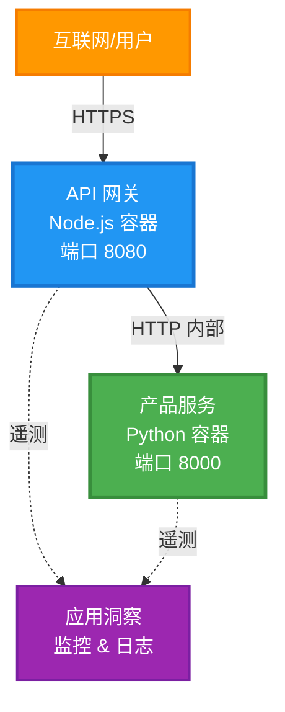
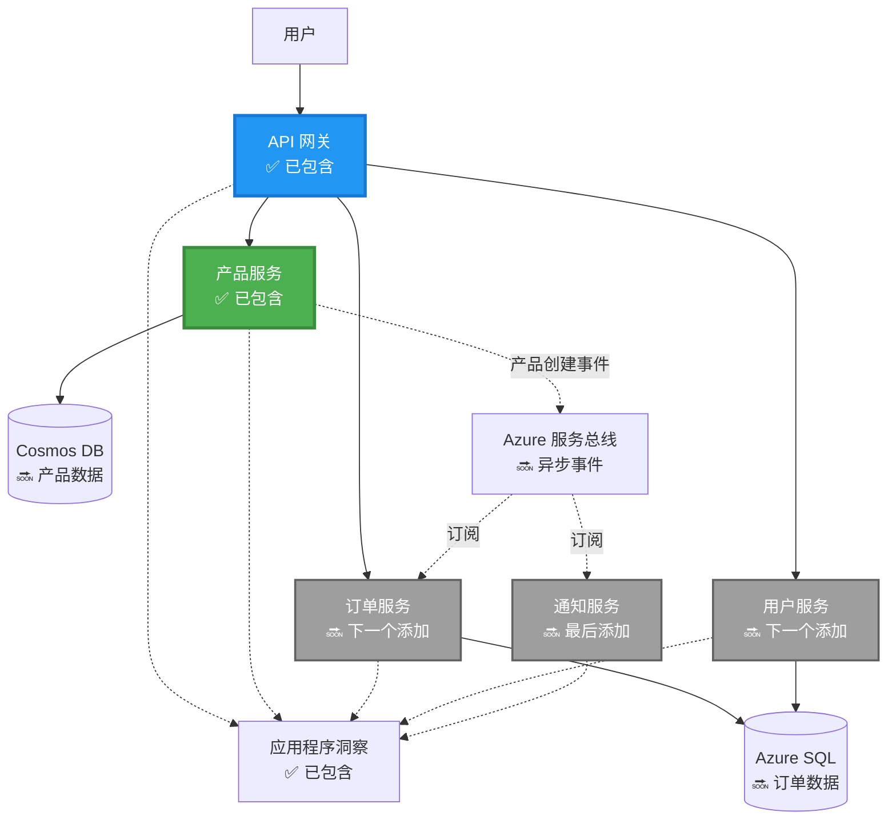
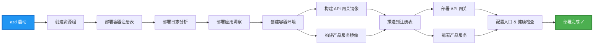
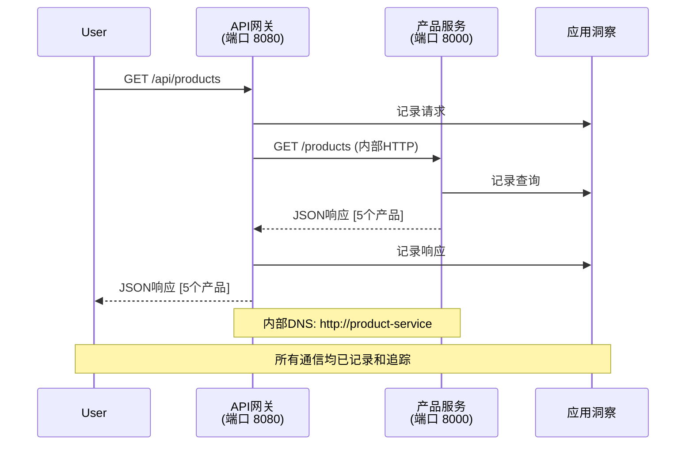

# 微服务架构 - 容器应用示例

⏱️ **预计时间**: 25-35分钟 | 💰 **预计成本**: ~$50-100/月 | ⭐ **复杂度**: 高级

**📚 学习路径:**
- ← 上一节: [简单的 Flask API](../../../../examples/container-app/simple-flask-api) - 单容器基础
- 🎯 **当前所在位置**: 微服务架构 (2服务基础)
- → 下一节: [AI 集成](../../../../docs/ai-foundry) - 为服务添加智能功能
- 🏠 [课程主页](../../README.md)

---

一个**简化但功能齐全**的微服务架构，通过 AZD CLI 部署到 Azure 容器应用。本示例展示了服务间通信、容器编排以及监控，采用实用的两服务设置。

> **📚 学习方法**: 本示例从一个最小化的两服务架构（API 网关 + 后端服务）开始，您可以实际部署并学习。在掌握这一基础后，我们提供扩展到完整微服务生态系统的指导。

## 您将学到什么

完成本示例后，您将能够：
- 将多个容器部署到 Azure 容器应用
- 使用内部网络实现服务间通信
- 配置基于环境的扩展和健康检查
- 使用 Application Insights 监控分布式应用
- 理解微服务部署模式和最佳实践
- 学习从简单到复杂架构的渐进式扩展

## 架构

### 阶段 1: 我们正在构建什么（本示例包含）


**组件详情:**

| 组件 | 目的 | 访问 | 资源 |
|------|------|------|------|
| **API 网关** | 将外部请求路由到后端服务 | 公共 (HTTPS) | 1 vCPU, 2GB RAM, 2-20 副本 |
| **产品服务** | 使用内存数据管理产品目录 | 仅内部 | 0.5 vCPU, 1GB RAM, 1-10 副本 |
| **Application Insights** | 集中日志记录和分布式追踪 | Azure Portal | 每月 1-2 GB 数据摄取 |

**为什么从简单开始?**
- ✅ 快速部署和理解 (25-35分钟)
- ✅ 学习核心微服务模式，无需复杂性
- ✅ 可修改和实验的工作代码
- ✅ 学习成本较低 (~$50-100/月 vs $300-1400/月)
- ✅ 在添加数据库和消息队列之前建立信心

**类比**: 就像学习驾驶一样。您从空停车场开始（2个服务），掌握基础知识，然后逐步进入城市交通（5+服务，带数据库）。

### 阶段 2: 未来扩展（参考架构）

掌握两服务架构后，您可以扩展到：


请参阅文末的“扩展指南”部分，获取分步说明。

## 包含的功能

✅ **服务发现**: 基于 DNS 的容器间自动发现  
✅ **负载均衡**: 内置副本间负载均衡  
✅ **自动扩展**: 每个服务基于 HTTP 请求独立扩展  
✅ **健康监控**: 两个服务的存活性和就绪性探针  
✅ **分布式日志记录**: 使用 Application Insights 集中日志记录  
✅ **内部网络**: 安全的服务间通信  
✅ **容器编排**: 自动部署和扩展  
✅ **零停机更新**: 滚动更新和版本管理  

## 前提条件

### 必需工具

开始之前，请确认您已安装以下工具：

1. **[Azure Developer CLI (azd)](https://learn.microsoft.com/azure/developer/azure-developer-cli/install-azd)** (版本 1.0.0 或更高)
   ```bash
   azd version
   # 预期输出：azd版本1.0.0或更高
   ```

2. **[Azure CLI](https://learn.microsoft.com/cli/azure/install-azure-cli)** (版本 2.50.0 或更高)
   ```bash
   az --version
   # 预期输出：azure-cli 2.50.0或更高版本
   ```

3. **[Docker](https://www.docker.com/get-started)** (用于本地开发/测试 - 可选)
   ```bash
   docker --version
   # 预期输出：Docker版本20.10或更高
   ```

### 验证您的设置

运行以下命令以确认您已准备好：

```bash
# 检查 Azure Developer CLI
azd version
# ✅ 预期：azd 版本 1.0.0 或更高

# 检查 Azure CLI
az --version
# ✅ 预期：azure-cli 2.50.0 或更高

# 检查 Docker（可选）
docker --version
# ✅ 预期：Docker 版本 20.10 或更高
```

**成功标准**: 所有命令返回版本号，符合或超过最低要求。

### Azure 要求

- 一个有效的 **Azure 订阅** ([创建免费账户](https://azure.microsoft.com/free/))
- 在您的订阅中创建资源的权限
- **Contributor** 角色（订阅或资源组）

### 知识前提

这是一个**高级**示例。您应该具备：
- 完成 [简单的 Flask API 示例](../../../../examples/container-app/simple-flask-api) 
- 微服务架构的基本理解
- 熟悉 REST API 和 HTTP
- 理解容器概念

**容器应用新手?** 请先从 [简单的 Flask API 示例](../../../../examples/container-app/simple-flask-api) 开始学习基础知识。

## 快速开始（分步指南）

### 第一步: 克隆并导航

```bash
git clone https://github.com/microsoft/AZD-for-beginners.git
cd AZD-for-beginners/examples/microservices
```

**✓ 成功检查**: 确认您看到 `azure.yaml`:
```bash
ls
# 预期：README.md, azure.yaml, infra/, src/
```

### 第二步: 使用 Azure 进行身份验证

```bash
azd auth login
```

这会打开您的浏览器进行 Azure 身份验证。使用您的 Azure 凭据登录。

**✓ 成功检查**: 您应该看到:
```
Logged in to Azure.
```

### 第三步: 初始化环境

```bash
azd init
```

**您会看到的提示**:
- **环境名称**: 输入一个简短名称（例如 `microservices-dev`）
- **Azure 订阅**: 选择您的订阅
- **Azure 位置**: 选择一个区域（例如 `eastus`, `westeurope`）

**✓ 成功检查**: 您应该看到:
```
SUCCESS: New project initialized!
```

### 第四步: 部署基础设施和服务

```bash
azd up
```

**发生了什么**（耗时 8-12 分钟）:


**✓ 成功检查**: 您应该看到:
```
SUCCESS: Your application was deployed to Azure in X minutes Y seconds.
Endpoint: https://api-gateway-<unique-id>.azurecontainerapps.io
```

**⏱️ 时间**: 8-12 分钟

### 第五步: 测试部署

```bash
# 获取网关端点
GATEWAY_URL=$(azd env get-values | grep API_GATEWAY_URL | cut -d '=' -f2 | tr -d '"')

# 测试API网关健康状况
curl $GATEWAY_URL/health
```

**✅ 预期输出:**
```json
{
  "status": "healthy",
  "service": "api-gateway",
  "timestamp": "2025-11-19T10:30:00Z"
}
```

**通过网关测试产品服务**:
```bash
# 列出产品
curl $GATEWAY_URL/api/products
```

**✅ 预期输出:**
```json
[
  {"id":1,"name":"Laptop","price":999.99,"stock":50},
  {"id":2,"name":"Mouse","price":29.99,"stock":200},
  {"id":3,"name":"Keyboard","price":79.99,"stock":150}
]
```

**✓ 成功检查**: 两个端点返回 JSON 数据且无错误。

---

**🎉 恭喜!** 您已将微服务架构部署到 Azure!

## 项目结构

所有实现文件均已包含——这是一个完整的工作示例：

```
microservices/
│
├── README.md                         # This file
├── azure.yaml                        # AZD configuration
├── .gitignore                        # Git ignore patterns
│
├── infra/                           # Infrastructure as Code (Bicep)
│   ├── main.bicep                   # Main orchestration
│   ├── abbreviations.json           # Naming conventions
│   ├── core/                        # Shared infrastructure
│   │   ├── container-apps-environment.bicep  # Container environment + registry
│   │   └── monitor.bicep            # Application Insights + Log Analytics
│   └── app/                         # Service definitions
│       ├── api-gateway.bicep        # API Gateway container app
│       └── product-service.bicep    # Product Service container app
│
└── src/                             # Application source code
    ├── api-gateway/                 # Node.js API Gateway
    │   ├── app.js                   # Express server with routing
    │   ├── package.json             # Node dependencies
    │   └── Dockerfile               # Container definition
    └── product-service/             # Python Product Service
        ├── main.py                  # Flask API with product data
        ├── requirements.txt         # Python dependencies
        └── Dockerfile               # Container definition
```

**每个组件的作用:**

**基础设施 (infra/)**:
- `main.bicep`: 编排所有 Azure 资源及其依赖项
- `core/container-apps-environment.bicep`: 创建容器应用环境和 Azure 容器注册表
- `core/monitor.bicep`: 设置 Application Insights 用于分布式日志记录
- `app/*.bicep`: 单个容器应用定义，包含扩展和健康检查

**API 网关 (src/api-gateway/)**:
- 面向公众的服务，将请求路由到后端服务
- 实现日志记录、错误处理和请求转发
- 展示服务间 HTTP 通信

**产品服务 (src/product-service/)**:
- 内部服务，包含产品目录（为简化使用内存）
- REST API，带健康检查
- 后端微服务模式示例

## 服务概览

### API 网关 (Node.js/Express)

**端口**: 8080  
**访问**: 公共 (外部入口)  
**目的**: 将传入请求路由到适当的后端服务  

**端点**:
- `GET /` - 服务信息
- `GET /health` - 健康检查端点
- `GET /api/products` - 转发到产品服务（列出所有）
- `GET /api/products/:id` - 转发到产品服务（按 ID 获取）

**主要功能**:
- 使用 axios 进行请求路由
- 集中日志记录
- 错误处理和超时管理
- 通过环境变量进行服务发现
- 集成 Application Insights

**代码亮点** (`src/api-gateway/app.js`):
```javascript
// 内部服务通信
app.get('/api/products', async (req, res) => {
  const response = await axios.get(`${PRODUCT_SERVICE_URL}/products`, {
    timeout: 5000
  });
  res.json(response.data);
});
```

### 产品服务 (Python/Flask)

**端口**: 8000  
**访问**: 仅内部 (无外部入口)  
**目的**: 使用内存数据管理产品目录  

**端点**:
- `GET /` - 服务信息
- `GET /health` - 健康检查端点
- `GET /products` - 列出所有产品
- `GET /products/<id>` - 按 ID 获取产品

**主要功能**:
- 使用 Flask 构建 RESTful API
- 内存产品存储（简单，无需数据库）
- 使用探针进行健康监控
- 结构化日志记录
- 集成 Application Insights

**数据模型**:
```python
{
  "id": 1,
  "name": "Laptop",
  "description": "High-performance laptop",
  "price": 999.99,
  "stock": 50
}
```

**为什么仅内部?**
产品服务不对外公开。所有请求必须通过 API 网关，这提供了：
- 安全性: 控制访问点
- 灵活性: 可以更改后端而不影响客户端
- 监控: 集中请求日志记录

## 理解服务通信

### 服务如何相互通信


在本示例中，API 网关通过**内部 HTTP 调用**与产品服务通信：

```javascript
// API网关 (src/api-gateway/app.js)
const PRODUCT_SERVICE_URL = process.env.PRODUCT_SERVICE_URL;

// 发起内部HTTP请求
const response = await axios.get(`${PRODUCT_SERVICE_URL}/products`);
```

**关键点**:

1. **基于 DNS 的发现**: 容器应用自动为内部服务提供 DNS
   - 产品服务 FQDN: `product-service.internal.<environment>.azurecontainerapps.io`
   - 简化为: `http://product-service`（容器应用会解析）

2. **无公共暴露**: 产品服务在 Bicep 中设置为 `external: false`
   - 仅在容器应用环境内可访问
   - 无法从互联网访问

3. **环境变量**: 服务 URL 在部署时注入
   - Bicep 将内部 FQDN 传递给网关
   - 应用代码中无硬编码 URL

**类比**: 就像办公室房间。API 网关是接待处（面向公众），产品服务是办公室房间（仅内部）。访客必须通过接待处才能进入任何办公室。

## 部署选项

### 完整部署（推荐）

```bash
# 部署基础设施和两个服务
azd up
```

这将部署:
1. 容器应用环境
2. Application Insights
3. 容器注册表
4. API 网关容器
5. 产品服务容器

**时间**: 8-12分钟

### 部署单个服务

```bash
# 仅部署一个服务（在初始 azd up 之后）
azd deploy api-gateway

# 或部署产品服务
azd deploy product-service
```

**使用场景**: 当您更新了一个服务的代码并希望仅重新部署该服务。

### 更新配置

```bash
# 更改缩放参数
azd env set GATEWAY_MAX_REPLICAS 30

# 使用新配置重新部署
azd up
```

## 配置

### 扩展配置

两个服务在其 Bicep 文件中配置了基于 HTTP 的自动扩展：

**API 网关**:
- 最小副本: 2（始终至少保持 2 个以确保可用性）
- 最大副本: 20
- 扩展触发器: 每副本 50 个并发请求

**产品服务**:
- 最小副本: 1（如果需要可以扩展到零）
- 最大副本: 10
- 扩展触发器: 每副本 100 个并发请求

**自定义扩展**（在 `infra/app/*.bicep` 中）:
```bicep
scale: {
  minReplicas: 1
  maxReplicas: 10
  rules: [
    {
      name: 'http-scale-rule'
      http: {
        metadata: {
          concurrentRequests: '100'  // Adjust this
        }
      }
    }
  ]
}
```

### 资源分配

**API 网关**:
- CPU: 1.0 vCPU
- 内存: 2 GiB
- 原因: 处理所有外部流量

**产品服务**:
- CPU: 0.5 vCPU
- 内存: 1 GiB
- 原因: 轻量级内存操作

### 健康检查

两个服务都包含存活性和就绪性探针：

```bicep
probes: [
  {
    type: 'Liveness'
    httpGet: {
      path: '/health'
      port: 8080
    }
    initialDelaySeconds: 10
    periodSeconds: 30
  }
  {
    type: 'Readiness'
    httpGet: {
      path: '/health'
      port: 8080
    }
    initialDelaySeconds: 5
    periodSeconds: 10
  }
]
```

**这意味着**:
- **存活性**: 如果健康检查失败，容器应用会重新启动容器
- **就绪性**: 如果未准备好，容器应用会停止向该副本路由流量

## 监控与可观察性

### 查看服务日志

```bash
# 从 API Gateway 流式传输日志
azd logs api-gateway --follow

# 查看最近的产品服务日志
azd logs product-service --tail 100

# 查看两个服务的所有日志
azd logs --follow
```

**预期输出**:
```
[api-gateway] API Gateway listening on port 8080
[api-gateway] Product Service URL: http://product-service
[api-gateway] GET /api/products 200 - 45ms
[product-service] Retrieved 5 products
```

### Application Insights 查询

访问 Azure Portal 中的 Application Insights，然后运行以下查询：

**查找慢请求**:
```kusto
requests
| where timestamp > ago(1h)
| where duration > 1000  // Requests taking >1 second
| summarize count() by name, cloud_RoleName
| order by count_ desc
```

**跟踪服务间调用**:
```kusto
dependencies
| where timestamp > ago(1h)
| where type == "Http"
| project timestamp, name, target, duration, success
| order by timestamp desc
```

**按服务的错误率**:
```kusto
exceptions
| where timestamp > ago(24h)
| summarize errorCount = count() by cloud_RoleName, type
| order by errorCount desc
```

**请求量随时间变化**:
```kusto
requests
| where timestamp > ago(1h)
| summarize requestCount = count() by bin(timestamp, 5m), cloud_RoleName
| render timechart
```

### 访问监控仪表板

```bash
# 获取应用程序洞察详细信息
azd env get-values | grep APPLICATIONINSIGHTS

# 打开 Azure 门户监控
az monitor app-insights component show \
  --app $(azd env get-values | grep APPLICATIONINSIGHTS_CONNECTION_STRING | cut -d '=' -f2) \
  --resource-group $(azd env get-values | grep AZURE_RESOURCE_GROUP | cut -d '=' -f2) \
  --query "appId" -o tsv
```

### 实时指标

1. 导航到 Azure Portal 中的 Application Insights
2. 点击“实时指标”
3. 查看实时请求、失败和性能
4. 测试运行: `curl $(azd env get-values | grep API_GATEWAY_URL | cut -d '=' -f2 | tr -d '"')/api/products`

## 实践练习

### 练习 1: 添加新产品端点 ⭐ (简单)

**目标**: 添加一个 POST 端点以创建新产品

**起点**: `src/product-service/main.py`

**步骤**:

1. 在 `main.py` 中的 `get_product` 函数后添加以下端点:

```python
@app.route('/products', methods=['POST'])
def create_product():
    """Create a new product"""
    data = request.get_json()
    
    # 验证必填字段
    if not data or 'name' not in data or 'price' not in data:
        return jsonify({'error': 'Missing required fields: name, price'}), 400
    
    new_id = max(p['id'] for p in products) + 1
    new_product = {
        'id': new_id,
        'name': data['name'],
        'description': data.get('description', ''),
        'price': float(data['price']),
        'stock': int(data.get('stock', 0))
    }
    products.append(new_product)
    logger.info(f"Created product {new_id}")
    return jsonify(new_product), 201
```

2. 在 API 网关中添加 POST 路由 (`src/api-gateway/app.js`):

```javascript
// 在 GET /api/products 路由之后添加此内容
app.post('/api/products', async (req, res) => {
  try {
    console.log(`Forwarding POST request to ${PRODUCT_SERVICE_URL}/products`);
    const response = await axios.post(`${PRODUCT_SERVICE_URL}/products`, req.body, {
      timeout: 5000
    });
    res.status(201).json(response.data);
  } catch (error) {
    console.error('Error calling product service:', error.message);
    res.status(503).json({
      error: 'Product service unavailable',
      message: error.message
    });
  }
});
```

3. 重新部署两个服务：

```bash
azd deploy product-service
azd deploy api-gateway
```

4. 测试新的端点：

```bash
GATEWAY_URL=$(azd env get-values | grep API_GATEWAY_URL | cut -d '=' -f2 | tr -d '"')

# 创建一个新产品
curl -X POST $GATEWAY_URL/api/products \
  -H "Content-Type: application/json" \
  -d '{"name":"USB Cable","price":9.99,"stock":500}'
```

**✅ 预期输出：**
```json
{"id":6,"name":"USB Cable","description":"","price":9.99,"stock":500}
```

5. 验证是否出现在列表中：

```bash
curl $GATEWAY_URL/api/products
# 现在应该显示6个产品，包括新的USB数据线
```

**成功标准**：
- ✅ POST 请求返回 HTTP 201
- ✅ 新产品出现在 GET /api/products 列表中
- ✅ 产品具有自动递增的 ID

**时间**：10-15 分钟

---

### 练习 2：修改自动扩展规则 ⭐⭐（中等）

**目标**：更积极地扩展产品服务

**起点**：`infra/app/product-service.bicep`

**步骤**：

1. 打开 `infra/app/product-service.bicep`，找到 `scale` 块（大约在第 95 行）

2. 修改：
```bicep
scale: {
  minReplicas: 1
  maxReplicas: 10
  rules: [
    {
      name: 'http-scale-rule'
      http: {
        metadata: {
          concurrentRequests: '100'  // OLD
        }
      }
    }
  ]
}
```

为：
```bicep
scale: {
  minReplicas: 2  // Always have 2 running
  maxReplicas: 20  // Allow more scaling
  rules: [
    {
      name: 'http-scale-rule'
      http: {
        metadata: {
          concurrentRequests: '20'  // Scale at lower threshold
        }
      }
    }
  ]
}
```

3. 重新部署基础设施：

```bash
azd up
```

4. 验证新的扩展配置：

```bash
az containerapp show \
  --name $(azd env get-values | grep PRODUCT_SERVICE | head -1 | cut -d '/' -f5) \
  --resource-group $(azd env get-values | grep AZURE_RESOURCE_GROUP | cut -d '=' -f2 | tr -d '"') \
  --query "properties.template.scale" -o json
```

**✅ 预期输出：**
```json
{
  "minReplicas": 2,
  "maxReplicas": 20,
  "rules": [...]
}
```

5. 在负载下测试自动扩展：

```bash
# 生成并发请求
for i in {1..500}; do curl $GATEWAY_URL/api/products & done

# 观察扩展发生
azd logs product-service --follow
# 查找：容器应用扩展事件
```

**成功标准**：
- ✅ 产品服务始终运行至少 2 个副本
- ✅ 在负载下扩展到超过 2 个副本
- ✅ Azure Portal 显示新的扩展规则

**时间**：15-20 分钟

---

### 练习 3：添加自定义监控查询 ⭐⭐（中等）

**目标**：创建自定义 Application Insights 查询以跟踪产品 API 性能

**步骤**：

1. 进入 Azure Portal 的 Application Insights：
   - 打开 Azure Portal
   - 找到你的资源组（rg-microservices-*）
   - 点击 Application Insights 资源

2. 在左侧菜单中点击“日志”

3. 创建以下查询：

```kusto
requests
| where timestamp > ago(1h)
| where name contains "products"
| summarize 
    RequestCount = count(),
    AvgDuration = avg(duration),
    P95Duration = percentile(duration, 95),
    SuccessRate = 100.0 * countif(success == true) / count()
  by bin(timestamp, 5m)
| render timechart
```

4. 点击“运行”以执行查询

5. 保存查询：
   - 点击“保存”
   - 名称：“Product API Performance”
   - 分类：“Performance”

6. 生成测试流量：

```bash
for i in {1..100}; do curl $GATEWAY_URL/api/products; sleep 1; done
```

7. 刷新查询以查看数据

**✅ 预期输出：**
- 显示请求数量随时间变化的图表
- 平均持续时间 < 500ms
- 成功率 = 100%
- 时间间隔为 5 分钟

**成功标准**：
- ✅ 查询显示 100+ 请求
- ✅ 成功率为 100%
- ✅ 平均持续时间 < 500ms
- ✅ 图表显示 5 分钟时间间隔

**学习成果**：了解如何通过自定义查询监控服务性能

**时间**：10-15 分钟

---

### 练习 4：实现重试逻辑 ⭐⭐⭐（高级）

**目标**：在产品服务暂时不可用时为 API Gateway 添加重试逻辑

**起点**：`src/api-gateway/app.js`

**步骤**：

1. 安装重试库：

```bash
cd src/api-gateway
npm install axios-retry --save
cd ../..
```

2. 更新 `src/api-gateway/app.js`（在 axios 导入后添加）：

```javascript
const axiosRetry = require('axios-retry');

// 配置重试逻辑
axiosRetry(axios, {
  retries: 3,
  retryDelay: (retryCount) => {
    return retryCount * 1000; // 1秒, 2秒, 3秒
  },
  retryCondition: (error) => {
    // 在网络错误或5xx响应时重试
    return axiosRetry.isNetworkOrIdempotentRequestError(error) ||
           (error.response && error.response.status >= 500);
  }
});

console.log('Retry logic configured: 3 retries with exponential backoff');
```

3. 重新部署 API Gateway：

```bash
azd deploy api-gateway
```

4. 通过模拟服务故障测试重试行为：

```bash
# 将产品服务缩减为0（模拟故障）
az containerapp update \
  --name $(azd env get-values | grep PRODUCT_SERVICE | head -1 | cut -d '/' -f5) \
  --resource-group $(azd env get-values | grep AZURE_RESOURCE_GROUP | cut -d '=' -f2 | tr -d '"') \
  --min-replicas 0 \
  --max-replicas 0

# 尝试访问产品（将重试3次）
time curl -v $GATEWAY_URL/api/products
# 观察：响应大约需要6秒（1秒 + 2秒 + 3秒重试）

# 恢复产品服务
az containerapp update \
  --name $(azd env get-values | grep PRODUCT_SERVICE | head -1 | cut -d '/' -f5) \
  --resource-group $(azd env get-values | grep AZURE_RESOURCE_GROUP | cut -d '=' -f2 | tr -d '"') \
  --min-replicas 1 \
  --max-replicas 10
```

5. 查看重试日志：

```bash
azd logs api-gateway --tail 50
# 查找：重试尝试消息
```

**✅ 预期行为：**
- 请求在失败前重试 3 次
- 每次重试等待时间更长（1 秒、2 秒、3 秒）
- 服务重启后请求成功
- 日志显示重试尝试

**成功标准**：
- ✅ 请求在失败前重试 3 次
- ✅ 每次重试等待时间更长（指数回退）
- ✅ 服务重启后请求成功
- ✅ 日志显示重试尝试

**学习成果**：理解微服务中的弹性模式（断路器、重试、超时）

**时间**：20-25 分钟

---

## 知识检查点

完成此示例后，验证你的理解：

### 1. 服务通信 ✓

测试你的知识：
- [ ] 你能解释 API Gateway 如何发现产品服务吗？（基于 DNS 的服务发现）
- [ ] 如果产品服务宕机会发生什么？（网关返回 503 错误）
- [ ] 如何添加第三个服务？（创建新的 Bicep 文件，添加到 main.bicep，创建 src 文件夹）

**动手验证：**
```bash
# 模拟服务故障
az containerapp update --name <product-service-name> --min-replicas 0 --max-replicas 0
curl $GATEWAY_URL/api/products
# ✅ 预期：503 服务不可用

# 恢复服务
az containerapp update --name <product-service-name> --min-replicas 1 --max-replicas 10
```

### 2. 监控与可观察性 ✓

测试你的知识：
- [ ] 分布式日志在哪里查看？（Azure Portal 的 Application Insights）
- [ ] 如何跟踪慢请求？（Kusto 查询：`requests | where duration > 1000`）
- [ ] 你能识别哪个服务导致了错误吗？（检查日志中的 `cloud_RoleName` 字段）

**动手验证：**
```bash
# 生成一个慢请求模拟
curl "$GATEWAY_URL/api/products?delay=2000"

# 查询 Application Insights 中的慢请求
# 导航到 Azure Portal → Application Insights → 日志
# 运行: requests | where duration > 1000 | project timestamp, name, duration, cloud_RoleName
```

### 3. 扩展与性能 ✓

测试你的知识：
- [ ] 什么会触发自动扩展？（HTTP 并发请求规则：网关为 50，产品为 100）
- [ ] 现在运行了多少个副本？（使用 `az containerapp revision list` 检查）
- [ ] 如何将产品服务扩展到 5 个副本？（在 Bicep 中更新 minReplicas）

**动手验证：**
```bash
# 生成负载以测试自动扩展
for i in {1..1000}; do curl $GATEWAY_URL/api/products & done

# 观察副本增加
azd logs api-gateway --follow
# ✅ 预期：在日志中看到扩展事件
```

**成功标准**：你能回答所有问题并通过动手命令验证。

---

## 成本分析

### 预计每月成本（针对此 2 服务示例）

| 资源 | 配置 | 预计成本 |
|------|------|----------|
| API Gateway | 2-20 副本，1 vCPU，2GB RAM | $30-150 |
| 产品服务 | 1-10 副本，0.5 vCPU，1GB RAM | $15-75 |
| 容器注册表 | 基础层 | $5 |
| Application Insights | 1-2 GB/月 | $5-10 |
| 日志分析 | 1 GB/月 | $3 |
| **总计** | | **$58-243/月** |

### 按使用情况的成本分解

**轻流量**（测试/学习）：约 $60/月
- API Gateway：2 副本 × 24/7 = $30
- 产品服务：1 副本 × 24/7 = $15
- 监控 + 注册表 = $13

**中等流量**（小型生产）：约 $120/月
- API Gateway：平均 5 副本 = $75
- 产品服务：平均 3 副本 = $45
- 监控 + 注册表 = $13

**高流量**（繁忙时段）：约 $240/月
- API Gateway：平均 15 副本 = $225
- 产品服务：平均 8 副本 = $120
- 监控 + 注册表 = $13

### 成本优化建议

1. **开发时缩减到零**：
   ```bicep
   scale: {
     minReplicas: 0  // Save $30-40/month when not in use
     maxReplicas: 10
   }
   ```

2. **为 Cosmos DB 使用消费计划**（当你添加它时）：
   - 仅按使用付费
   - 无最低费用

3. **设置 Application Insights 采样**：
   ```javascript
   appInsights.defaultClient.config.samplingPercentage = 50; // 抽取50%的请求
   ```

4. **不需要时清理**：
   ```bash
   azd down --force --purge
   ```

### 免费层选项

对于学习/测试，考虑：
- ✅ 使用 Azure 免费额度（新账户前 30 天 $200）
- ✅ 保持最低副本数（节省约 50% 成本）
- ✅ 测试后删除（无持续费用）
- ✅ 学习期间缩减到零

**示例**：运行此示例每天 2 小时 × 30 天 = ~$5/月，而不是 $60/月

---

## 故障排除快速参考

### 问题：`azd up` 失败，显示“未找到订阅”

**解决方案**：
```bash
# 使用显式订阅重新登录
az account set --subscription <your-subscription-id>
azd env set AZURE_SUBSCRIPTION_ID <your-subscription-id>
azd up
```

### 问题：API Gateway 返回 503 “产品服务不可用”

**诊断**：
```bash
# 检查产品服务日志
azd logs product-service --tail 50

# 检查产品服务健康
az containerapp show \
  --name $(azd env get-values | grep PRODUCT_SERVICE | head -1 | cut -d '/' -f5) \
  --resource-group $(azd env get-values | grep AZURE_RESOURCE_GROUP | cut -d '=' -f2 | tr -d '"') \
  --query "properties.runningStatus"
```

**常见原因**：
1. 产品服务未启动（检查日志中的 Python 错误）
2. 健康检查失败（验证 `/health` 端点是否正常）
3. 容器镜像构建失败（检查注册表中的镜像）

### 问题：自动扩展不起作用

**诊断**：
```bash
# 检查当前副本数量
az containerapp revision list \
  --name $(azd env get-values | grep API_GATEWAY | head -1 | cut -d '/' -f5) \
  --resource-group $(azd env get-values | grep AZURE_RESOURCE_GROUP | cut -d '=' -f2 | tr -d '"') \
  --query "[].properties.replicas"

# 生成负载进行测试
for i in {1..1000}; do curl $GATEWAY_URL/api/products & done

# 观察扩展事件
azd logs api-gateway --follow | grep -i scale
```

**常见原因**：
1. 负载不足以触发扩展规则（需要 >50 并发请求）
2. 已达到最大副本数（检查 Bicep 配置）
3. Bicep 中扩展规则配置错误（验证 concurrentRequests 值）

### 问题：Application Insights 未显示日志

**诊断**：
```bash
# 验证连接字符串是否已设置
azd env get-values | grep APPLICATIONINSIGHTS

# 检查服务是否正在发送遥测数据
az monitor app-insights component show \
  --app $(azd env get-values | grep APPLICATIONINSIGHTS_NAME | cut -d '=' -f2 | tr -d '"') \
  --resource-group $(azd env get-values | grep AZURE_RESOURCE_GROUP | cut -d '=' -f2 | tr -d '"') \
  --query "properties.InstrumentationKey"
```

**常见原因**：
1. 未将连接字符串传递给容器（检查环境变量）
2. 未配置 Application Insights SDK（验证代码中的导入）
3. 防火墙阻止了遥测（罕见，检查网络规则）

### 问题：本地 Docker 构建失败

**诊断**：
```bash
# 测试 API 网关构建
cd src/api-gateway
docker build -t test-gateway .

# 测试产品服务构建
cd ../product-service
docker build -t test-product .
```

**常见原因**：
1. package.json/requirements.txt 中缺少依赖项
2. Dockerfile 语法错误
3. 下载依赖项时的网络问题

**仍然卡住？** 请参阅 [常见问题指南](../../docs/troubleshooting/common-issues.md) 或 [Azure Container Apps 故障排除](https://learn.microsoft.com/azure/container-apps/troubleshooting)

---

## 清理

为避免持续费用，删除所有资源：

```bash
azd down --force --purge
```

**确认提示**：
```
? Total resources to delete: 6, are you sure you want to continue? (y/N)
```

输入 `y` 以确认。

**删除内容**：
- 容器应用环境
- 两个容器应用（网关和产品服务）
- 容器注册表
- Application Insights
- 日志分析工作区
- 资源组

**✓ 验证清理**：
```bash
az group list --query "[?starts_with(name,'rg-microservices')]" --output table
```

应返回空。

---

## 扩展指南：从 2 个服务到 5+ 个服务

掌握此 2 服务架构后，可按以下步骤扩展：

### 阶段 1：添加数据库持久化（下一步）

**为产品服务添加 Cosmos DB**：

1. 创建 `infra/core/cosmos.bicep`：
   ```bicep
   resource cosmosAccount 'Microsoft.DocumentDB/databaseAccounts@2023-04-15' = {
     name: name
     location: location
     kind: 'GlobalDocumentDB'
     properties: {
       databaseAccountOfferType: 'Standard'
       consistencyPolicy: { defaultConsistencyLevel: 'Session' }
       locations: [{ locationName: location, failoverPriority: 0 }]
     }
   }
   ```

2. 更新产品服务以使用 Azure Cosmos DB Python SDK 而不是内存数据

3. 预计额外成本：约 $25/月（无服务器）

### 阶段 2：添加第三个服务（订单管理）

**创建订单服务**：

1. 新文件夹：`src/order-service/`（Python/Node.js/C#）
2. 新 Bicep 文件：`infra/app/order-service.bicep`
3. 更新 API Gateway 路由 `/api/orders`
4. 添加 Azure SQL 数据库以进行订单持久化

**架构变为**：
```
API Gateway → Product Service (Cosmos DB)
           → Order Service (Azure SQL)
```

### 阶段 3：添加异步通信（服务总线）

**实现事件驱动架构**：

1. 添加 Azure 服务总线：`infra/core/servicebus.bicep`
2. 产品服务发布“ProductCreated”事件
3. 订单服务订阅产品事件
4. 添加通知服务以处理事件

**模式**：请求/响应（HTTP）+ 事件驱动（服务总线）

### 阶段 4：添加用户认证

**实现用户服务**：

1. 创建 `src/user-service/`（Go/Node.js）
2. 添加 Azure AD B2C 或自定义 JWT 认证
3. API Gateway 在路由前验证令牌
4. 服务检查用户权限

### 阶段 5：生产就绪

**添加以下组件**：
- ✅ Azure Front Door（全球负载均衡）
- ✅ Azure Key Vault（密钥管理）
- ✅ Azure Monitor Workbooks（自定义仪表板）
- ✅ CI/CD 管道（GitHub Actions）
- ✅ 蓝绿部署
- ✅ 所有服务的托管身份

**完整生产架构成本**：约 $300-1,400/月

---

## 了解更多

### 相关文档
- [Azure Container Apps 文档](https://learn.microsoft.com/azure/container-apps/)
- [微服务架构指南](https://learn.microsoft.com/azure/architecture/guide/architecture-styles/microservices)
- [分布式追踪的 Application Insights](https://learn.microsoft.com/azure/azure-monitor/app/distributed-tracing)
- [Azure Developer CLI 文档](https://learn.microsoft.com/azure/developer/azure-developer-cli/)

### 本课程的下一步
- ← 上一节：[简单 Flask API](../../../../examples/container-app/simple-flask-api) - 初学者单容器示例
- → 下一节：[AI 集成指南](../../../../docs/ai-foundry) - 添加 AI 功能
- 🏠 [课程主页](../../README.md)

### 比较：何时使用什么

| 特性 | 单容器 | 微服务（本示例） | Kubernetes（AKS） |
|------|--------|-----------------|------------------|
| **使用场景** | 简单应用 | 复杂应用 | 企业级应用 |
| **可扩展性** | 单服务 | 按服务扩展 | 最大灵活性 |
| **复杂性** | 低 | 中等 | 高 |
| **团队规模** | 1-3 名开发者 | 3-10 名开发者 | 10+ 名开发者 |
| **成本** | ~$15-50/月 | ~$60-250/月 | ~$150-500/月 |
| **部署时间** | 5-10 分钟 | 8-12 分钟 | 15-30 分钟 |
| **最佳用途** | MVPs，原型 | 生产应用 | 多云，高级网络 |

**推荐**：从 Container Apps（本示例）开始，仅在需要 Kubernetes 特定功能时转向 AKS。

---

## 常见问题解答

**问：为什么只有 2 个服务，而不是 5 个或更多？**  
答：教育性递进。通过一个简单的示例掌握基础知识（服务通信、监控、扩展）后，再增加复杂性。您在这里学到的模式同样适用于 100 个服务的架构。

**问：我可以自己添加更多服务吗？**  
答：当然可以！按照上面的扩展指南操作。每个新服务遵循相同的模式：创建 src 文件夹，创建 Bicep 文件，更新 azure.yaml，部署。

**问：这是生产就绪的吗？**  
答：这是一个坚实的基础。对于生产环境，请添加：托管身份、Key Vault、持久化数据库、CI/CD 管道、监控警报和备份策略。

**问：为什么不使用 Dapr 或其他服务网格？**  
答：为了学习保持简单。一旦您理解了原生 Container Apps 的网络功能，就可以在此基础上添加 Dapr，用于高级场景（状态管理、发布/订阅、绑定）。

**问：如何在本地调试？**  
答：使用 Docker 在本地运行服务：  
```bash
cd src/api-gateway
docker build -t local-gateway .
docker run -p 8080:8080 -e PRODUCT_SERVICE_URL=http://localhost:8000 local-gateway
```


**问：我可以使用不同的编程语言吗？**  
答：可以！本示例展示了 Node.js（网关）+ Python（产品服务）。您可以混合使用任何可以在容器中运行的语言：C#、Go、Java、Ruby、PHP 等。

**问：如果我没有 Azure 额度怎么办？**  
答：使用 Azure 免费层（新账户前 30 天可获得 $200 额度）或短时间测试后立即删除部署。本示例每天大约花费 $2。

**问：这与 Azure Kubernetes Service (AKS) 有何不同？**  
答：Container Apps 更简单（无需 Kubernetes 知识），但灵活性较低。AKS 提供完整的 Kubernetes 控制，但需要更多专业知识。从 Container Apps 开始，如果需要再升级到 AKS。

**问：我可以将其与现有的 Azure 服务一起使用吗？**  
答：可以！您可以连接到现有的数据库、存储账户、Service Bus 等。更新 Bicep 文件以引用现有资源，而不是创建新资源。

---

> **🎓 学习路径总结**：您已经学会了如何部署具有自动扩展、内部网络、集中监控和生产就绪模式的多服务架构。这一基础为复杂的分布式系统和企业微服务架构做好了准备。

**📚 课程导航：**
- ← 上一节：[简单 Flask API](../../../../examples/container-app/simple-flask-api)
- → 下一节：[数据库集成示例](../../../../database-app)
- 🏠 [课程主页](../../README.md)
- 📖 [Container Apps 最佳实践](../../docs/deployment/deployment-guide.md)

---

**✨ 恭喜！** 您已完成微服务示例。您现在了解如何在 Azure Container Apps 上构建、部署和监控分布式应用程序。准备添加 AI 功能了吗？请查看 [AI 集成指南](../../../../docs/ai-foundry)！

---

<!-- CO-OP TRANSLATOR DISCLAIMER START -->
**免责声明**：  
本文档使用AI翻译服务[Co-op Translator](https://github.com/Azure/co-op-translator)进行翻译。尽管我们努力确保翻译的准确性，但请注意，自动翻译可能包含错误或不准确之处。原始语言的文档应被视为权威来源。对于重要信息，建议使用专业人工翻译。我们不对因使用此翻译而产生的任何误解或误读承担责任。
<!-- CO-OP TRANSLATOR DISCLAIMER END -->