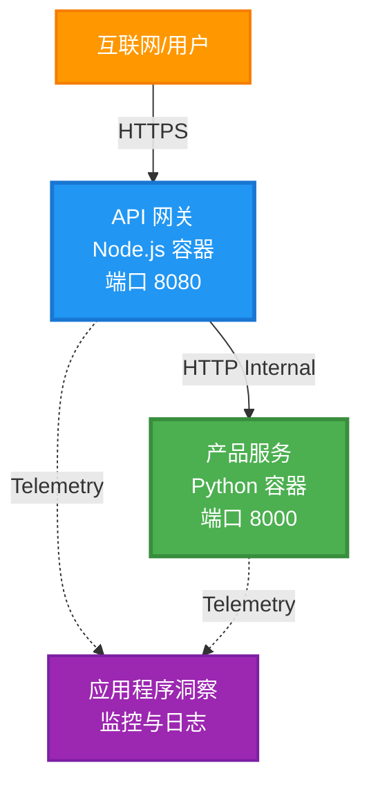
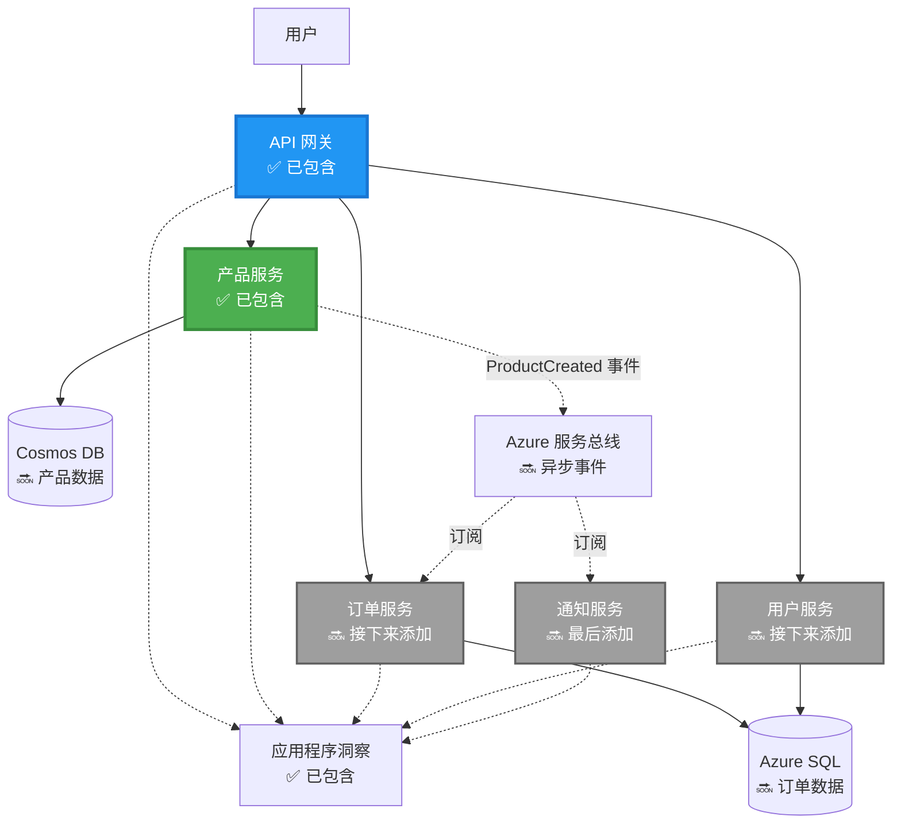
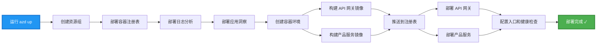
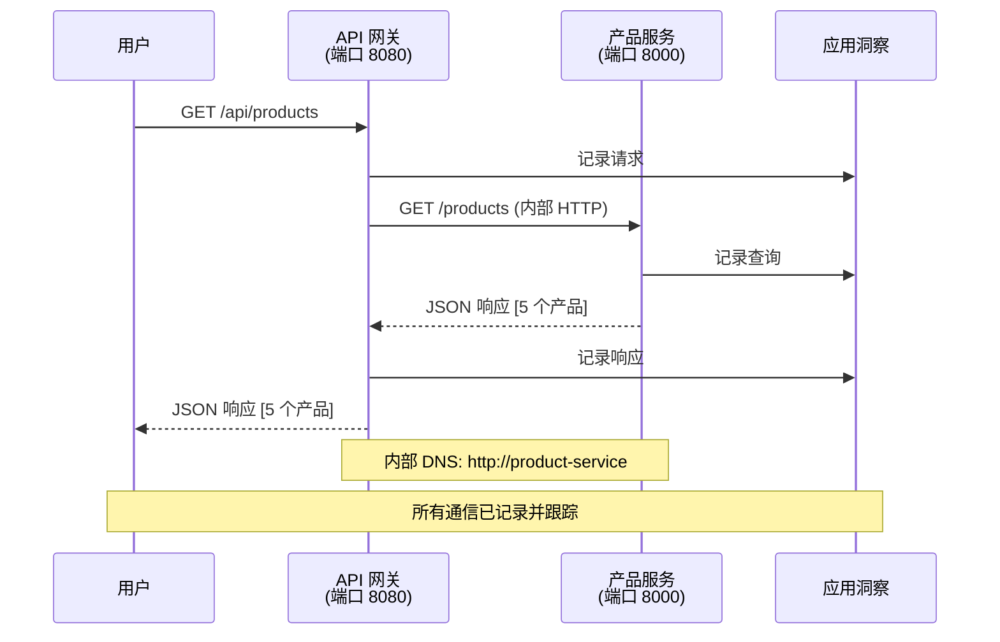

# 微服务架构 - Container App 示例

⏱️ **预计时间**: 25-35 分钟 | 💰 **预计成本**: 约 $50-100/月 | ⭐ **复杂度**: 高级

**📚 学习路径：**
- ← 上一页: [简单 Flask API](../../../../examples/container-app/simple-flask-api) - 单容器基础
- 🎯 **你在这里**: 微服务架构（2 服务基础）
- → 下一步: [AI 集成](../../../../docs/ai-foundry) - 为你的服务添加智能
- 🏠 [课程主页](../../README.md)

---

一个通过 AZD CLI 部署到 Azure Container Apps 的**简化但可用**微服务架构示例。该示例演示了服务间通信、容器编排和监控，采用实用的 2 服务设置。

> **📚 学习方法**：此示例从最小的 2 服务架构（API 网关 + 后端服务）开始，你可以实际部署并学习。掌握此基础后，我们将提供扩展到完整微服务生态系统的指导。

## 你将学到什么

完成此示例后，你将能够：
- 将多个容器部署到 Azure Container Apps
- 使用内部网络实现服务间通信
- 配置基于环境的自动伸缩和健康检查
- 使用 Application Insights 监控分布式应用
- 理解微服务部署模式和最佳实践
- 学习从简单到复杂架构的渐进式扩展

## 架构

### 第 1 阶段：我们正在构建的内容（本示例包含）


**组件详情：**

| 组件 | 用途 | 访问 | 资源 |
|-----------|---------|--------|-----------|
| **API 网关** | 将外部请求路由到后端服务 | 公开（HTTPS） | 1 vCPU, 2GB RAM, 2-20 副本 |
| **产品服务** | 使用内存数据管理产品目录 | 仅内部 | 0.5 vCPU, 1GB RAM, 1-10 副本 |
| **Application Insights** | 集中式日志记录和分布式追踪 | Azure 门户 | 1-2 GB/月的数据摄取 |

**为什么从简单开始？**
- ✅ 快速部署与理解（25-35 分钟）
- ✅ 在不复杂化的情况下学习核心微服务模式
- ✅ 可修改和试验的工作代码
- ✅ 学习成本较低（约 $50-100/月，而不是 $300-1400/月）
- ✅ 在添加数据库和消息队列前建立信心

**比喻**：把这看作学开车。你从空旷的停车场（2 个服务）开始，掌握基本技能，然后再进阶到城市交通（5+ 个带数据库的服务）。

### 第 2 阶段：未来扩展（参考架构）

掌握 2 服务架构后，你可以扩展到：


请参阅文档末尾的“扩展指南”部分获取逐步说明。

## 包含的功能

✅ **服务发现**：容器之间基于 DNS 的自动发现  
✅ **负载均衡**：副本间的内置负载均衡  
✅ **自动伸缩**：基于 HTTP 请求的独立服务伸缩  
✅ **健康监控**：两个服务的存活和就绪探针  
✅ **分布式日志**：使用 Application Insights 的集中式日志  
✅ **内部网络**：安全的服务间通信  
✅ **容器编排**：自动部署与伸缩  
✅ **零停机更新**：带修订管理的滚动更新  

## 先决条件

### 所需工具

在开始之前，确认你已安装以下工具：

1. **[Azure 开发者 CLI (azd)](https://learn.microsoft.com/azure/developer/azure-developer-cli/install-azd)**（版本 1.0.0 或更高）
   ```bash
   azd version
   # 预期输出：azd 版本 1.0.0 或更高
   ```

2. **[Azure CLI](https://learn.microsoft.com/cli/azure/install-azure-cli)**（版本 2.50.0 或更高）
   ```bash
   az --version
   # 预期输出：azure-cli 2.50.0 或更高版本
   ```

3. **[Docker](https://www.docker.com/get-started)**（用于本地开发/测试 - 可选）
   ```bash
   docker --version
   # 期望输出：Docker 版本 20.10 或更高
   ```

### 验证你的设置

运行这些命令以确认你已准备好：

```bash
# 检查 Azure 开发者 CLI
azd version
# ✅ 预期：azd 版本 1.0.0 或更高

# 检查 Azure CLI
az --version
# ✅ 预期：azure-cli 2.50.0 或更高

# 检查 Docker（可选）
docker --version
# ✅ 预期：Docker 版本 20.10 或更高
```

**成功标准**：所有命令返回的版本号符合或高于最低要求。

### Azure 要求

- 一个有效的 **Azure 订阅**（[创建免费帐户](https://azure.microsoft.com/free/)）
- 在你的订阅中创建资源的权限
- 在订阅或资源组上具有 **Contributor** 角色

### 知识先决条件

这是一个 **高级** 示例。你应该具备：
- 已完成 [简单 Flask API 示例](../../../../examples/container-app/simple-flask-api) 
- 对微服务架构有基本了解
- 熟悉 REST API 和 HTTP
- 理解容器概念

**新接触 Container Apps？** 首先从 [简单 Flask API 示例](../../../../examples/container-app/simple-flask-api) 开始以学习基础知识。

## 快速开始（逐步）

### 第 1 步：克隆并导航

```bash
git clone https://github.com/microsoft/AZD-for-beginners.git
cd AZD-for-beginners/examples/microservices
```

**✓ 成功检查**：确认你可以看到 `azure.yaml`：
```bash
ls
# 预期：README.md、azure.yaml、infra/、src/
```

### 第 2 步：使用 Azure 验证身份

```bash
azd auth login
```

这将打开浏览器进行 Azure 身份验证。使用你的 Azure 凭据登录。

**✓ 成功检查**：你应该看到：
```
Logged in to Azure.
```

### 第 3 步：初始化环境

```bash
azd init
```

**你将看到的提示**：
- **环境名称**：输入一个简短名称（例如，`microservices-dev`）
- **Azure 订阅**：选择你的订阅
- **Azure 地区**：选择一个区域（例如，`eastus`、`westeurope`）

**✓ 成功检查**：你应该看到：
```
SUCCESS: New project initialized!
```

### 第 4 步：部署基础设施和服务

```bash
azd up
```

**发生的事情**（需要 8-12 分钟）：


**✓ 成功检查**：你应该看到：
```
SUCCESS: Your application was deployed to Azure in X minutes Y seconds.
Endpoint: https://api-gateway-<unique-id>.azurecontainerapps.io
```

**⏱️ 时间**：8-12 分钟

### 第 5 步：测试部署

```bash
# 获取网关端点
GATEWAY_URL=$(azd env get-values | grep API_GATEWAY_URL | cut -d '=' -f2 | tr -d '"')

# 测试 API 网关运行状况
curl $GATEWAY_URL/health
```

**✅ 预期输出：**
```json
{
  "status": "healthy",
  "service": "api-gateway",
  "timestamp": "2025-11-19T10:30:00Z"
}
```

**通过网关测试产品服务**：
```bash
# 列出产品
curl $GATEWAY_URL/api/products
```

**✅ 预期输出：**
```json
[
  {"id":1,"name":"Laptop","price":999.99,"stock":50},
  {"id":2,"name":"Mouse","price":29.99,"stock":200},
  {"id":3,"name":"Keyboard","price":79.99,"stock":150}
]
```

**✓ 成功检查**：两个端点都返回无错误的 JSON 数据。

---

**🎉 恭喜！** 你已将微服务架构部署到 Azure！

## 项目结构

所有实现文件都包含在内——这是一个完整、可运行的示例：

```
microservices/
│
├── README.md                         # This file
├── azure.yaml                        # AZD configuration
├── .gitignore                        # Git ignore patterns
│
├── infra/                           # Infrastructure as Code (Bicep)
│   ├── main.bicep                   # Main orchestration
│   ├── abbreviations.json           # Naming conventions
│   ├── core/                        # Shared infrastructure
│   │   ├── container-apps-environment.bicep  # Container environment + registry
│   │   └── monitor.bicep            # Application Insights + Log Analytics
│   └── app/                         # Service definitions
│       ├── api-gateway.bicep        # API Gateway container app
│       └── product-service.bicep    # Product Service container app
│
└── src/                             # Application source code
    ├── api-gateway/                 # Node.js API Gateway
    │   ├── app.js                   # Express server with routing
    │   ├── package.json             # Node dependencies
    │   └── Dockerfile               # Container definition
    └── product-service/             # Python Product Service
        ├── main.py                  # Flask API with product data
        ├── requirements.txt         # Python dependencies
        └── Dockerfile               # Container definition
```

**每个组件的作用：**

**基础设施 (infra/)**：
- `main.bicep`：协调所有 Azure 资源及其依赖关系
- `core/container-apps-environment.bicep`：创建 Container Apps 环境和 Azure 容器注册表
- `core/monitor.bicep`：为分布式日志设置 Application Insights
- `app/*.bicep`：各个容器应用定义，包含伸缩和健康检查

**API 网关 (src/api-gateway/)**：
- 面向公众的服务，将请求路由到后端服务
- 实现日志记录、错误处理和请求转发
- 演示服务间的 HTTP 通信

**产品服务 (src/product-service/)**：
- 内部服务，带有产品目录（为简单起见使用内存）
- 带有健康检查的 REST API
- 后端微服务模式示例

## 服务概览

### API 网关 (Node.js/Express)

**端口**：8080  
**访问**：公开（外部入口）  
**用途**：将收到的请求路由到相应的后端服务  

**端点**：
- `GET /` - 服务信息
- `GET /health` - 健康检查端点
- `GET /api/products` - 转发到产品服务（列出所有）
- `GET /api/products/:id` - 转发到产品服务（按 ID 获取）

**关键功能**：
- 使用 axios 进行请求路由
- 集中式日志记录
- 错误处理和超时管理
- 通过环境变量进行服务发现
- 集成 Application Insights

**代码亮点** (`src/api-gateway/app.js`)：
```javascript
// 内部服务通信
app.get('/api/products', async (req, res) => {
  const response = await axios.get(`${PRODUCT_SERVICE_URL}/products`, {
    timeout: 5000
  });
  res.json(response.data);
});
```

### 产品服务 (Python/Flask)

**端口**：8000  
**访问**：仅内部（无外部入口）  
**用途**：使用内存数据管理产品目录  

**端点**：
- `GET /` - 服务信息
- `GET /health` - 健康检查端点
- `GET /products` - 列出所有产品
- `GET /products/<id>` - 按 ID 获取产品

**关键功能**：
- 使用 Flask 的 RESTful API
- 内存中的产品存储（简单，无需数据库）
- 带探针的健康监控
- 结构化日志记录
- 集成 Application Insights

**数据模型**：
```python
{
  "id": 1,
  "name": "Laptop",
  "description": "High-performance laptop",
  "price": 999.99,
  "stock": 50
}
```

**为什么仅限内部？**
产品服务未公开。所有请求必须通过 API 网关进行，API 网关提供：
- 安全性：受控的访问点
- 灵活性：可以更改后端而不影响客户端
- 监控：集中请求日志

## 理解服务通信

### 服务如何相互通信


在此示例中，API 网关使用 **内部 HTTP 调用** 与产品服务通信：

```javascript
// API 网关 (src/api-gateway/app.js)
const PRODUCT_SERVICE_URL = process.env.PRODUCT_SERVICE_URL;

// 发起内部 HTTP 请求
const response = await axios.get(`${PRODUCT_SERVICE_URL}/products`);
```

**要点**：

1. **基于 DNS 的发现**：Container Apps 会自动为内部服务提供 DNS
   - 产品服务 FQDN：`product-service.internal.<environment>.azurecontainerapps.io`
   - 简化为：`http://product-service`（Container Apps 解析它）

2. **不对外公开**：产品服务在 Bicep 中设置了 `external: false`
   - 仅可在 Container Apps 环境内访问
   - 无法从互联网访问

3. **环境变量**：服务 URL 在部署时注入
   - Bicep 将内部 FQDN 传递给网关
   - 应用代码中没有硬编码的 URL

**比喻**：把这看作办公室房间。API 网关是接待台（面向公众），产品服务是办公室房间（仅内部）。访客必须通过接待才能到达任何办公室。

## 部署选项

### 完整部署（推荐）

```bash
# 部署基础设施和两个服务
azd up
```

此部署包括：
1. Container Apps 环境
2. Application Insights
3. 容器注册表
4. API 网关容器
5. 产品服务容器

**时间**：8-12 分钟

### 部署单个服务

```bash
# 仅部署一个服务（在初始 azd up 之后）
azd deploy api-gateway

# 或者部署 product 服务
azd deploy product-service
```

**使用场景**：当你更新了某个服务的代码并且只想重新部署该服务时使用。

### 更新配置

```bash
# 更改缩放参数
azd env set GATEWAY_MAX_REPLICAS 30

# 使用新配置重新部署
azd up
```

## 配置

### 缩放配置

两个服务都在它们的 Bicep 文件中配置了基于 HTTP 的自动伸缩：

**API 网关**：
- 最小副本数：2（为可用性始终至少 2 个）
- 最大副本数：20
- 缩放触发：每副本 50 个并发请求

**产品服务**：
- 最小副本数：1（如有需要可缩减到 0）
- 最大副本数：10
- 缩放触发：每副本 100 个并发请求

**自定义缩放**（在 `infra/app/*.bicep` 中）：
```bicep
scale: {
  minReplicas: 1
  maxReplicas: 10
  rules: [
    {
      name: 'http-scale-rule'
      http: {
        metadata: {
          concurrentRequests: '100'  // Adjust this
        }
      }
    }
  ]
}
```

### 资源分配

**API 网关**：
- CPU：1.0 vCPU
- 内存：2 GiB
- 原因：处理所有外部流量

**产品服务**：
- CPU：0.5 vCPU
- 内存：1 GiB
- 原因：轻量级的内存操作

### 健康检查

两个服务都包含存活和就绪探针：

```bicep
probes: [
  {
    type: 'Liveness'
    httpGet: {
      path: '/health'
      port: 8080
    }
    initialDelaySeconds: 10
    periodSeconds: 30
  }
  {
    type: 'Readiness'
    httpGet: {
      path: '/health'
      port: 8080
    }
    initialDelaySeconds: 5
    periodSeconds: 10
  }
]
```

**这意味着**：
- **存活**：如果健康检查失败，Container Apps 会重新启动容器
- **就绪**：如果未就绪，Container Apps 会停止将流量路由到该副本

## 监控与可观测性

### 查看服务日志

```bash
# 使用 azd monitor 查看日志
azd monitor --logs

# 或者使用 Azure CLI 针对特定的容器应用：
# 从 API 网关流式查看日志
az containerapp logs show --name api-gateway --resource-group $RG_NAME --follow

# 查看最近的产品服务日志
az containerapp logs show --name product-service --resource-group $RG_NAME --tail 100
```

**预期输出**：
```
[api-gateway] API Gateway listening on port 8080
[api-gateway] Product Service URL: http://product-service
[api-gateway] GET /api/products 200 - 45ms
[product-service] Retrieved 5 products
```

### Application Insights 查询

在 Azure 门户中访问 Application Insights，然后运行以下查询：

**查找慢请求**：
```kusto
requests
| where timestamp > ago(1h)
| where duration > 1000  // Requests taking >1 second
| summarize count() by name, cloud_RoleName
| order by count_ desc
```

**跟踪服务间调用**：
```kusto
dependencies
| where timestamp > ago(1h)
| where type == "Http"
| project timestamp, name, target, duration, success
| order by timestamp desc
```

**按服务统计错误率**：
```kusto
exceptions
| where timestamp > ago(24h)
| summarize errorCount = count() by cloud_RoleName, type
| order by errorCount desc
```

**随时间的请求量**：
```kusto
requests
| where timestamp > ago(1h)
| summarize requestCount = count() by bin(timestamp, 5m), cloud_RoleName
| render timechart
```

### 访问监控仪表板

```bash
# 获取 Application Insights 的详细信息
azd env get-values | grep APPLICATIONINSIGHTS

# 打开 Azure 门户中的监视
az monitor app-insights component show \
  --app $(azd env get-values | grep APPLICATIONINSIGHTS_CONNECTION_STRING | cut -d '=' -f2) \
  --resource-group $(azd env get-values | grep AZURE_RESOURCE_GROUP | cut -d '=' -f2) \
  --query "appId" -o tsv
```

### 实时指标

1. 导航到 Azure 门户中的 Application Insights
2. 点击“Live Metrics”
3. 查看实时请求、失败和性能
4. 通过运行测试： `curl $(azd env get-values | grep API_GATEWAY_URL | cut -d '=' -f2 | tr -d '"')/api/products`

## 实践练习

### 练习 1：添加新的产品端点 ⭐（简单）

**目标**：添加一个 POST 端点以创建新产品

**起点**：`src/product-service/main.py`

**步骤**：

1. 在 `main.py` 的 `get_product` 函数之后添加此端点：

```python
@app.route('/products', methods=['POST'])
def create_product():
    """Create a new product"""
    data = request.get_json()
    
    # 验证必填字段
    if not data or 'name' not in data or 'price' not in data:
        return jsonify({'error': 'Missing required fields: name, price'}), 400
    
    new_id = max(p['id'] for p in products) + 1
    new_product = {
        'id': new_id,
        'name': data['name'],
        'description': data.get('description', ''),
        'price': float(data['price']),
        'stock': int(data.get('stock', 0))
    }
    products.append(new_product)
    logger.info(f"Created product {new_id}")
    return jsonify(new_product), 201
```

2. 向 API 网关添加 POST 路由（`src/api-gateway/app.js`）：

```javascript
// 在 GET /api/products 路由之后添加此内容
app.post('/api/products', async (req, res) => {
  try {
    console.log(`Forwarding POST request to ${PRODUCT_SERVICE_URL}/products`);
    const response = await axios.post(`${PRODUCT_SERVICE_URL}/products`, req.body, {
      timeout: 5000
    });
    res.status(201).json(response.data);
  } catch (error) {
    console.error('Error calling product service:', error.message);
    res.status(503).json({
      error: 'Product service unavailable',
      message: error.message
    });
  }
});
```

3. 重新部署两个服务：

```bash
azd deploy product-service
azd deploy api-gateway
```

4. 测试新的端点：

```bash
GATEWAY_URL=$(azd env get-values | grep API_GATEWAY_URL | cut -d '=' -f2 | tr -d '"')

# 创建一个新产品
curl -X POST $GATEWAY_URL/api/products \
  -H "Content-Type: application/json" \
  -d '{"name":"USB Cable","price":9.99,"stock":500}'
```

**✅ 预期输出：**
```json
{"id":6,"name":"USB Cable","description":"","price":9.99,"stock":500}
```

5. 验证它是否出现在列表中：

```bash
curl $GATEWAY_URL/api/products
# 现在应显示包括新USB数据线在内的6个产品
```

**成功标准**:
- ✅ POST 请求返回 HTTP 201
- ✅ 新产品出现在 GET /api/products 列表中
- ✅ 产品具有自增 ID

**时间**: 10-15 分钟

---

### 练习 2：修改自动扩缩规则 ⭐⭐（中等）

**目标**: 更积极地扩展 Product 服务的自动伸缩配置

**起点**: `infra/app/product-service.bicep`

**步骤**:

1. 打开 `infra/app/product-service.bicep` 并找到 `scale` 块（大约在第95行）

2. 将其从：
```bicep
scale: {
  minReplicas: 1
  maxReplicas: 10
  rules: [
    {
      name: 'http-scale-rule'
      http: {
        metadata: {
          concurrentRequests: '100'  // OLD
        }
      }
    }
  ]
}
```

改为：
```bicep
scale: {
  minReplicas: 2  // Always have 2 running
  maxReplicas: 20  // Allow more scaling
  rules: [
    {
      name: 'http-scale-rule'
      http: {
        metadata: {
          concurrentRequests: '20'  // Scale at lower threshold
        }
      }
    }
  ]
}
```

3. 重新部署基础设施：

```bash
azd up
```

4. 验证新的扩缩配置：

```bash
az containerapp show \
  --name $(azd env get-values | grep PRODUCT_SERVICE | head -1 | cut -d '/' -f5) \
  --resource-group $(azd env get-values | grep AZURE_RESOURCE_GROUP | cut -d '=' -f2 | tr -d '"') \
  --query "properties.template.scale" -o json
```

**✅ 预期输出：**
```json
{
  "minReplicas": 2,
  "maxReplicas": 20,
  "rules": [...]
}
```

5. 在负载下测试自动扩缩：

```bash
# 生成并发请求
for i in {1..500}; do curl $GATEWAY_URL/api/products & done

# 使用 Azure CLI 观察扩缩容的发生
az containerapp logs show --name product-service --resource-group $RG_NAME --follow
# 查找：Container Apps 的缩放事件
```

**成功标准**:
- ✅ Product 服务始终至少运行 2 个副本
- ✅ 在负载下，扩展到超过 2 个副本
- ✅ Azure 门户显示新的扩缩规则

**时间**: 15-20 分钟

---

### 练习 3：添加自定义监控查询 ⭐⭐（中等）

**目标**: 创建自定义 Application Insights 查询以跟踪产品 API 的性能

**步骤**:

1. 在 Azure 门户中导航到 Application Insights:
   - 转到 Azure 门户
   - 找到你的资源组（rg-microservices-*）
   - 点击 Application Insights 资源

2. 在左侧菜单中点击 “Logs”

3. 创建以下查询：

```kusto
requests
| where timestamp > ago(1h)
| where name contains "products"
| summarize 
    RequestCount = count(),
    AvgDuration = avg(duration),
    P95Duration = percentile(duration, 95),
    SuccessRate = 100.0 * countif(success == true) / count()
  by bin(timestamp, 5m)
| render timechart
```

4. 点击 “Run” 以执行查询

5. 保存查询:
   - 点击 “Save”
   - 名称: "Product API Performance"
   - 分类: "Performance"

6. 生成测试流量：

```bash
for i in {1..100}; do curl $GATEWAY_URL/api/products; sleep 1; done
```

7. 刷新查询以查看数据

**✅ 预期输出：**
- 显示随时间变化的请求计数的图表
- 平均耗时 < 500ms
- 成功率 = 100%
- 时间分箱为 5 分钟

**成功标准**:
- ✅ 查询显示 100+ 次请求
- ✅ 成功率为 100%
- ✅ 平均耗时 < 500ms
- ✅ 图表显示 5 分钟的时间分箱

**学习成果**: 理解如何使用自定义查询监控服务性能

**时间**: 10-15 分钟

---

### 练习 4：实现重试逻辑 ⭐⭐⭐（高级）

**目标**: 当 Product 服务暂时不可用时，为 API Gateway 添加重试逻辑

**起点**: `src/api-gateway/app.js`

**步骤**:

1. 安装重试库：

```bash
cd src/api-gateway
npm install axios-retry --save
cd ../..
```

2. 更新 `src/api-gateway/app.js`（在 axios 导入后添加）：

```javascript
const axiosRetry = require('axios-retry');

// 配置重试逻辑
axiosRetry(axios, {
  retries: 3,
  retryDelay: (retryCount) => {
    return retryCount * 1000; // 1秒，2秒，3秒
  },
  retryCondition: (error) => {
    // 在网络错误或 5xx 响应时重试
    return axiosRetry.isNetworkOrIdempotentRequestError(error) ||
           (error.response && error.response.status >= 500);
  }
});

console.log('Retry logic configured: 3 retries with exponential backoff');
```

3. 重新部署 API Gateway：

```bash
azd deploy api-gateway
```

4. 通过模拟服务故障测试重试行为：

```bash
# 将产品服务缩放至0（模拟故障）
az containerapp update \
  --name $(azd env get-values | grep PRODUCT_SERVICE | head -1 | cut -d '/' -f5) \
  --resource-group $(azd env get-values | grep AZURE_RESOURCE_GROUP | cut -d '=' -f2 | tr -d '"') \
  --min-replicas 0 \
  --max-replicas 0

# 尝试访问产品（会重试3次）
time curl -v $GATEWAY_URL/api/products
# 观察：响应大约需要6秒（1秒 + 2秒 + 3秒 重试）

# 恢复产品服务
az containerapp update \
  --name $(azd env get-values | grep PRODUCT_SERVICE | head -1 | cut -d '/' -f5) \
  --resource-group $(azd env get-values | grep AZURE_RESOURCE_GROUP | cut -d '=' -f2 | tr -d '"') \
  --min-replicas 1 \
  --max-replicas 10
```

5. 查看重试日志：

```bash
az containerapp logs show --name api-gateway --resource-group $RG_NAME --tail 50
# 查找：重试尝试的消息
```

**✅ 预期行为：**
- 请求在失败前重试 3 次
- 每次重试等待时间递增（1s、2s、3s）
- 服务重启后请求成功
- 日志显示重试尝试

**成功标准**:
- ✅ 请求在失败前重试 3 次
- ✅ 每次重试等待时间递增（指数退避）
- ✅ 服务重启后请求成功
- ✅ 日志显示重试尝试

**学习成果**: 理解微服务中的弹性模式（断路器、重试、超时）

**时间**: 20-25 分钟

---

## 知识检查点

完成此示例后，请验证你的理解：

### 1. 服务通信 ✓

测试你的知识：
- [ ] 你能说明 API Gateway 如何发现 Product 服务吗？（基于 DNS 的服务发现）
- [ ] 如果 Product 服务宕机会发生什么？（网关返回 503 错误）
- [ ] 你将如何添加第三个服务？（创建新的 Bicep 文件，将其添加到 main.bicep，创建 src 文件夹）

**实操验证:**
```bash
# 模拟服务故障
az containerapp update --name <product-service-name> --min-replicas 0 --max-replicas 0
curl $GATEWAY_URL/api/products
# ✅ 预期: 503 服务不可用

# 恢复服务
az containerapp update --name <product-service-name> --min-replicas 1 --max-replicas 10
```

### 2. 监控与可观察性 ✓

测试你的知识：
- [ ] 在哪里查看分布式日志？（Azure 门户中的 Application Insights）
- [ ] 如何追踪慢请求？（Kusto 查询： `requests | where duration > 1000`）
- [ ] 你能识别哪个服务导致了错误吗？（检查日志中的 `cloud_RoleName` 字段）

**实操验证:**
```bash
# 生成慢请求的模拟
curl "$GATEWAY_URL/api/products?delay=2000"

# 在 Application Insights 中查询慢请求
# 转到 Azure 门户 → Application Insights → 日志
# 运行: requests | where duration > 1000 | project timestamp, name, duration, cloud_RoleName
```

### 3. 扩缩与性能 ✓

测试你的知识：
- [ ] 什么会触发自动扩缩？（HTTP 并发请求规则：Gateway 为 50，Product 为 100）
- [ ] 现在运行了多少副本？（使用 `az containerapp revision list` 检查）
- [ ] 你将如何将 Product 服务扩展到 5 个副本？（在 Bicep 中更新 minReplicas）

**实操验证:**
```bash
# 生成负载以测试自动缩放
for i in {1..1000}; do curl $GATEWAY_URL/api/products & done

# 使用 Azure CLI 观察副本数量增加
az containerapp logs show --name api-gateway --resource-group $RG_NAME --follow
# ✅ 预期：在日志中看到缩放事件
```

**成功标准**: 你可以回答所有问题并通过实操命令验证。

---

## 成本分析

### 估计月成本（针对此 2 服务示例）

| 资源 | 配置 | 估计成本 |
|----------|--------------|----------------|
| API Gateway | 2-20 副本, 1 vCPU, 2GB RAM | $30-150 |
| Product Service | 1-10 副本, 0.5 vCPU, 1GB RAM | $15-75 |
| Container Registry | 基础层 | $5 |
| Application Insights | 1-2 GB/月 | $5-10 |
| Log Analytics | 1 GB/月 | $3 |
| **总计** | | **$58-243/月** |

### 按使用量的成本细分

**轻量流量**（测试/学习）：~$60/月
- API Gateway：2 个副本 × 24/7 = $30
- Product 服务：1 个副本 × 24/7 = $15
- 监控 + 注册表 = $13

**中等流量**（小型生产）：~$120/月
- API Gateway：平均 5 个副本 = $75
- Product 服务：平均 3 个副本 = $45
- 监控 + 注册表 = $13

**高流量**（繁忙时段）：~$240/月
- API Gateway：平均 15 个副本 = $225
- Product 服务：平均 8 个副本 = $120
- 监控 + 注册表 = $13

### 成本优化建议

1. **对开发环境缩减到零（Scale to Zero）**：
   ```bicep
   scale: {
     minReplicas: 0  // Save $30-40/month when not in use
     maxReplicas: 10
   }
   ```

2. **为 Cosmos DB 使用消费计划**（当你添加它时）：
   - 仅为你使用的资源付费
   - 无最低收费

3. **设置 Application Insights 采样**：
   ```javascript
   appInsights.defaultClient.config.samplingPercentage = 50; // 对50%的请求进行抽样
   ```

4. **不需要时清理资源**：
   ```bash
   azd down --force --purge
   ```

### 免费层选项

对于学习/测试，考虑：
- ✅ 使用 Azure 免费额度（新账户首 30 天 $200）
- ✅ 保持最少副本（可节省约 50% 成本）
- ✅ 测试后删除（无持续费用）
- ✅ 在学习会话之间缩减到零

**示例**: 按每天运行 2 小时 × 30 天计算 = ~ $5/月，而不是 $60/月

---

## 故障排除快速参考

### 问题：`azd up` 失败并显示 "Subscription not found"

**解决方案**：
```bash
# 再次登录并指定订阅
az account set --subscription <your-subscription-id>
azd env set AZURE_SUBSCRIPTION_ID <your-subscription-id>
azd up
```

### 问题：API Gateway 返回 503 "Product service unavailable"

**诊断**：
```bash
# 使用 Azure CLI 检查产品服务日志
az containerapp logs show --name product-service --resource-group $RG_NAME --tail 50

# 检查产品服务运行状况
az containerapp show \
  --name $(azd env get-values | grep PRODUCT_SERVICE | head -1 | cut -d '/' -f5) \
  --resource-group $(azd env get-values | grep AZURE_RESOURCE_GROUP | cut -d '=' -f2 | tr -d '"') \
  --query "properties.runningStatus"
```

**常见原因**：
1. Product 服务未启动（检查日志是否有 Python 错误）
2. 健康检查失败（验证 `/health` 端点是否工作）
3. 容器镜像构建失败（检查注册表中的镜像）

### 问题：自动扩缩不起作用

**诊断**：
```bash
# 检查当前副本数
az containerapp revision list \
  --name $(azd env get-values | grep API_GATEWAY | head -1 | cut -d '/' -f5) \
  --resource-group $(azd env get-values | grep AZURE_RESOURCE_GROUP | cut -d '=' -f2 | tr -d '"') \
  --query "[].properties.replicas"

# 生成负载以进行测试
for i in {1..1000}; do curl $GATEWAY_URL/api/products & done

# 使用 Azure CLI 监视缩放事件
az containerapp logs show --name api-gateway --resource-group $RG_NAME --follow | grep -i scale
```

**常见原因**：
1. 负载不足以触发扩缩规则（需要 >50 个并发请求）
2. 已达到最大副本数（检查 Bicep 配置）
3. Bicep 中的扩缩规则配置错误（验证 concurrentRequests 值）

### 问题：Application Insights 未显示日志

**诊断**：
```bash
# 验证连接字符串是否已设置
azd env get-values | grep APPLICATIONINSIGHTS

# 检查服务是否正在发送遥测数据
az monitor app-insights component show \
  --app $(azd env get-values | grep APPLICATIONINSIGHTS_NAME | cut -d '=' -f2 | tr -d '"') \
  --resource-group $(azd env get-values | grep AZURE_RESOURCE_GROUP | cut -d '=' -f2 | tr -d '"') \
  --query "properties.InstrumentationKey"
```

**常见原因**：
1. 连接字符串未传递到容器（检查环境变量）
2. Application Insights SDK 未配置（验证代码中的导入）
3. 防火墙阻止遥测（较少见，检查网络规则）

### 问题：本地 Docker 构建失败

**诊断**：
```bash
# 测试 API 网关构建
cd src/api-gateway
docker build -t test-gateway .

# 测试产品服务构建
cd ../product-service
docker build -t test-product .
```

**常见原因**：
1. package.json/requirements.txt 中缺少依赖
2. Dockerfile 语法错误
3. 下载依赖时的网络问题

**仍然卡住？** 查看 [Common Issues Guide](../../docs/chapter-07-troubleshooting/common-issues.md) 或 [Azure Container Apps Troubleshooting](https://learn.microsoft.com/azure/container-apps/troubleshooting)

---

## 清理

为避免持续费用，请删除所有资源：

```bash
azd down --force --purge
```

**确认提示**：
```
? Total resources to delete: 6, are you sure you want to continue? (y/N)
```

输入 `y` 以确认。

**将被删除的内容**:
- Container Apps 环境
- 两个 Container Apps（gateway & product service）
- 容器注册表
- Application Insights
- Log Analytics 工作区
- 资源组

**✓ 验证清理**：
```bash
az group list --query "[?starts_with(name,'rg-microservices')]" --output table
```

应该返回空。

---

## 扩展指南：从 2 个服务到 5 个及以上

掌握此 2 服务架构后，下面是扩展方法：

### 阶段 1：添加数据库持久化（下一步）

**为 Product 服务添加 Cosmos DB**：

1. 创建 `infra/core/cosmos.bicep`：
   ```bicep
   resource cosmosAccount 'Microsoft.DocumentDB/databaseAccounts@2023-04-15' = {
     name: name
     location: location
     kind: 'GlobalDocumentDB'
     properties: {
       databaseAccountOfferType: 'Standard'
       consistencyPolicy: { defaultConsistencyLevel: 'Session' }
       locations: [{ locationName: location, failoverPriority: 0 }]
     }
   }
   ```

2. 更新 product 服务以使用 Azure Cosmos DB Python SDK 而不是内存数据

3. 估计额外成本：~$25/月（serverless）

### 阶段 2：添加第三个服务（订单管理）

**创建订单服务**：

1. 新文件夹：`src/order-service/`（Python/Node.js/C#）
2. 新 Bicep：`infra/app/order-service.bicep`
3. 更新 API Gateway 以路由 `/api/orders`
4. 添加 Azure SQL Database 以持久化订单数据

**架构变为**：
```
API Gateway → Product Service (Cosmos DB)
           → Order Service (Azure SQL)
```

### 阶段 3：添加异步通信（Service Bus）

**实现事件驱动架构**：

1. 添加 Azure Service Bus：`infra/core/servicebus.bicep`
2. Product 服务发布“ProductCreated”事件
3. Order 服务订阅产品事件
4. 添加通知服务以处理事件

**模式**：请求/响应（HTTP）+ 事件驱动（Service Bus）

### 阶段 4：添加用户认证

**实现用户服务**：

1. 创建 `src/user-service/`（Go/Node.js）
2. 添加 Azure AD B2C 或自定义 JWT 认证
3. API Gateway 在路由前验证令牌
4. 服务检查用户权限

### 阶段 5：生产就绪

**添加以下组件**：
- ✅ Azure Front Door（全局负载均衡）
- ✅ Azure Key Vault（密钥/机密管理）
- ✅ Azure Monitor Workbooks（自定义仪表盘）
- ✅ CI/CD 管道（GitHub Actions）
- ✅ 蓝绿部署
- ✅ 为所有服务启用托管身份

**完整生产架构成本**：约 $300-1,400/月

---

## 了解更多

### 相关文档
- [Azure Container Apps 文档](https://learn.microsoft.com/azure/container-apps/)
- [微服务架构指南](https://learn.microsoft.com/azure/architecture/guide/architecture-styles/microservices)
- [用于分布式追踪的 Application Insights](https://learn.microsoft.com/azure/azure-monitor/app/distributed-tracing)
- [Azure Developer CLI 文档](https://learn.microsoft.com/azure/developer/azure-developer-cli/)

### 本课程的下一步
- ← 上一节： [Simple Flask API](../../../../examples/container-app/simple-flask-api) - 初学者单容器示例
- → 下一节： [AI Integration Guide](../../../../docs/ai-foundry) - 添加 AI 功能
- 🏠 [课程主页](../../README.md)

### 对比：何时使用哪种方案

| 特性 | 单个容器 | 微服务（此方案） | Kubernetes（AKS） |
|---------|-----------------|---------------------|------------------|
| 使用场景 | 简单应用 | 复杂应用 | 企业级应用 |
| 可扩展性 | 单服务 | 按服务扩展 | 最大灵活性 |
| 复杂性 | 低 | 中 | 高 |
| 团队规模 | 1-3 开发者 | 3-10 开发者 | 10+ 开发者 |
| 成本 | ~ $15-50/月 | ~ $60-250/月 | ~ $150-500/月 |
| 部署时间 | 5-10 分钟 | 8-12 分钟 | 15-30 分钟
| **最适合** | MVP、原型 | 生产应用 | 多云、高级网络 |

**Recommendation**: Start with Container Apps (this example), move to AKS only if you need Kubernetes-specific features.

---

## 常见问题

**Q: 为什么只有 2 个服务而不是 5 个以上？**  
A: 教育性的渐进学习。先通过一个简单示例掌握基础（服务通信、监控、扩展），然后再增加复杂性。你在这里学到的模式适用于 100 个服务的架构。

**Q: 我可以自己添加更多服务吗？**  
A: 当然可以！遵循上面的扩展指南。每个新服务遵循相同的模式：创建 src 文件夹、创建 Bicep 文件、更新 azure.yaml，部署。

**Q: 这是生产就绪的吗？**  
A: 这是一个坚实的基础。对于生产环境，请添加：托管身份、Key Vault、持久化数据库、CI/CD 管道、监控警报和备份策略。

**Q: 为什么不使用 Dapr 或其他服务网格？**  
A: 为了学习保持简单。一旦您了解了原生 Container Apps 的网络，就可以在其上叠加 Dapr 以实现高级场景（状态管理、发布/订阅、绑定）。

**Q: 我如何在本地调试？**  
A: 在本地使用 Docker 运行服务：  
```bash
cd src/api-gateway
docker build -t local-gateway .
docker run -p 8080:8080 -e PRODUCT_SERVICE_URL=http://localhost:8000 local-gateway
```

**Q: 我可以使用不同的编程语言吗？**  
A: 可以！此示例展示了 Node.js（网关）+ Python（产品服务）。您可以混合任何可以在容器中运行的语言：C#, Go, Java, Ruby, PHP 等。

**Q: 如果我没有 Azure 积分怎么办？**  
A: 使用 Azure 免费层（新帐户前 30 天可获得 $200 积分）或进行短期测试并立即删除。此示例费用约为 $2/天。

**Q: 这与 Azure Kubernetes Service (AKS) 有何不同？**  
A: Container Apps 更简单（不需要 Kubernetes 知识），但灵活性较差。AKS 让您完全控制 Kubernetes，但需要更多专业知识。先从 Container Apps 开始，必要时再升级到 AKS。

**Q: 我可以将此与现有的 Azure 服务一起使用吗？**  
A: 可以！您可以连接到现有的数据库、存储帐户、Service Bus 等。更新 Bicep 文件以引用现有资源，而不是创建新的。

---

> **🎓 学习路径总结**: 您已学会部署具有自动扩展、内网通信、集中监控和生产就绪模式的多服务架构。这个基础将为复杂的分布式系统和企业级微服务架构做好准备。

**📚 课程导航:**
- ← 上一节: [简单的 Flask API](../../../../examples/container-app/simple-flask-api)
- → 下一节: [数据库集成示例](../../../../database-app)
- 🏠 [课程首页](../../README.md)
- 📖 [Container Apps 最佳实践](../../docs/chapter-04-infrastructure/deployment-guide.md)

---

**✨ 恭喜！** 您已完成微服务示例。现在您了解了如何在 Azure Container Apps 上构建、部署和监控分布式应用。准备添加 AI 功能了吗？查看 [AI 集成指南](../../../../docs/ai-foundry)！

---

<!-- CO-OP TRANSLATOR DISCLAIMER START -->
免责声明：
本文件已使用 AI 翻译服务 Co-op Translator（https://github.com/Azure/co-op-translator）进行翻译。尽管我们力求准确，但自动翻译可能包含错误或不准确之处。原始语言的文档应视为权威来源。对于关键信息，建议采用专业人工翻译。因使用本翻译而产生的任何误解或曲解，我们概不负责。
<!-- CO-OP TRANSLATOR DISCLAIMER END -->