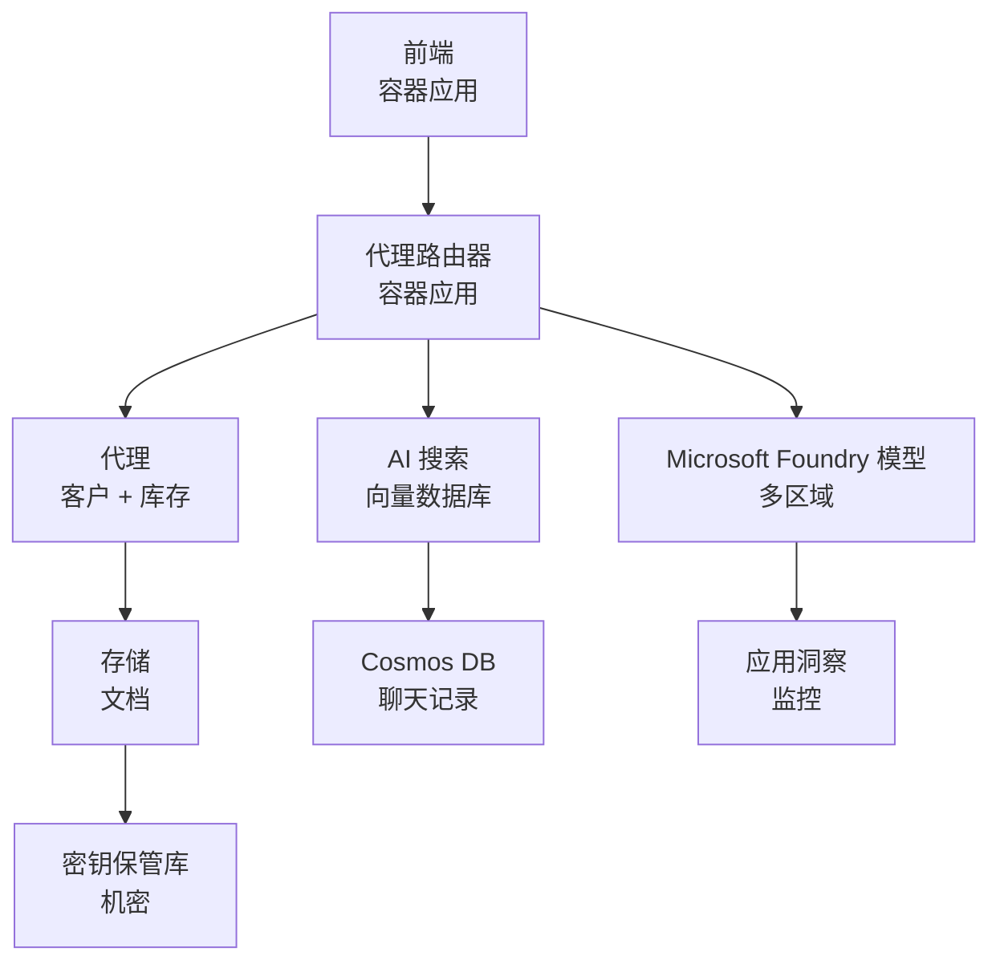

# Retail Multi-Agent Solution - Infrastructure Template

**Chapter 5: Production Deployment Package**
- **📚 Course Home**: [AZD 初学者指南](../../README.md)
- **📖 Related Chapter**: [第 5 章：多代理 AI 解决方案](../../README.md#-chapter-5-multi-agent-ai-solutions-advanced)
- **📝 Scenario Guide**: [完整架构](../retail-scenario.md)
- **🎯 Quick Deploy**: [一键部署](#-quick-deployment)

> **⚠️ 仅限基础设施模板**  
> 此 ARM 模板部署 **Azure 资源**，用于多代理系统。  
>  
> **部署内容（15-25 分钟）：**
> - ✅ Microsoft Foundry 模型（gpt-4.1、gpt-4.1-mini、跨 3 个区域的 embeddings）
> - ✅ AI Search 服务（空白，已准备好创建索引）
> - ✅ 容器应用（占位镜像，准备部署您的代码）
> - ✅ 存储、Cosmos DB、Key Vault、Application Insights
>  
> **未包含（需要开发）：**
> - ❌ 代理实现代码（Customer Agent、Inventory Agent）
> - ❌ 路由逻辑和 API 端点
> - ❌ 前端聊天 UI
> - ❌ 搜索索引模式和数据管道
> - ❌ **预计开发工时：80-120 小时**
>  
> **使用此模板的场景：**
> - ✅ 您想为多代理项目预配 Azure 基础设施
> - ✅ 您计划单独开发代理实现
> - ✅ 您需要面向生产的基础设施基线
>  
> **不适用的场景：**
> - ❌ 您期望立即获得可运行的多代理演示
> - ❌ 您在寻找完整的应用程序代码示例

## Overview

该目录包含一个用于部署多代理客户支持系统<strong>基础设施基础</strong>的完整 Azure 资源管理器 (ARM) 模板。该模板会预配所有必要的 Azure 服务，进行适当配置并互联，为您的应用程序开发做好准备。

**部署完成后，您将拥有：** 面向生产的 Azure 基础设施  
**要完成系统，您需要：** 代理代码、前端 UI 和数据配置（参见 [Architecture Guide](../retail-scenario.md)）

## 🎯 What Gets Deployed

### Core Infrastructure (Status After Deployment)

✅ **Microsoft Foundry 模型服务**（已准备好进行 API 调用）
  - 主区域：gpt-4.1 部署（20K TPM 容量）
  - 次要区域：gpt-4.1-mini 部署（10K TPM 容量）
  - 第三区域：文本嵌入模型（30K TPM 容量）
  - 评估区域：gpt-4.1 grader 模型（15K TPM 容量）
  - **状态：** 完全可用 - 可立即进行 API 调用

✅ **Azure AI Search**（空白 - 已准备好配置）
  - 启用向量搜索功能
  - 标准层，1 分区，1 副本
  - **状态：** 服务正在运行，但需要创建索引
  - **需要的操作：** 根据您的模式创建搜索索引

✅ **Azure 存储帐户**（空白 - 已准备好上传）
  - Blob 容器： `documents`、`uploads`
  - 安全配置（仅 HTTPS、无公共访问）
  - **状态：** 已准备好接收文件
  - **需要的操作：** 上传您的产品数据和文档

⚠️ **Container Apps 环境**（已部署占位镜像）
  - Agent router 应用（nginx 默认镜像）
  - 前端应用（nginx 默认镜像）
  - 已配置自动缩放（0-10 实例）
  - **状态：** 正在运行占位容器
  - **需要的操作：** 构建并部署您的代理应用

✅ **Azure Cosmos DB**（空白 - 已准备好存储数据）
  - 预配置数据库和容器
  - 针对低延迟操作进行优化
  - 启用 TTL 以自动清理
  - **状态：** 已准备好存储聊天历史

✅ **Azure Key Vault**（可选 - 已准备好存储机密）
  - 启用软删除
  - 为托管标识配置 RBAC
  - **状态：** 已准备好存储 API 密钥和连接字符串

✅ **Application Insights**（可选 - 监控已启用）
  - 连接到 Log Analytics 工作区
  - 配置自定义指标和警报
  - **状态：** 已准备好接收来自您的应用的遥测

✅ **Document Intelligence**（已准备好进行 API 调用）
  - S0 层，面向生产工作负载
  - **状态：** 已准备好处理上传的文档

✅ **Bing Search API**（已准备好进行 API 调用）
  - S1 层，面向实时搜索
  - **状态：** 已准备好执行网页搜索查询

### Deployment Modes

| Mode | OpenAI Capacity | Container Instances | Search Tier | Storage Redundancy | Best For |
|------|-----------------|---------------------|-------------|-------------------|----------|
| **Minimal** | 10K-20K TPM | 0-2 replicas | Basic | LRS (Local) | 开发/测试、学习、概念验证 |
| **Standard** | 30K-60K TPM | 2-5 replicas | Standard | ZRS (Zone) | 生产、中等流量（<10K 用户） |
| **Premium** | 80K-150K TPM | 5-10 replicas, zone-redundant | Premium | GRS (Geo) | 企业、高流量（>10K 用户）、99.99% SLA |

**成本影响：**
- **Minimal → Standard：** 约 4 倍成本增加（$100-370/月 → $420-1,450/月）
- **Standard → Premium：** 约 3 倍成本增加（$420-1,450/月 → $1,150-3,500/月）
- **选择依据：** 预期负载、SLA 要求、预算限制

**容量规划：**
- **TPM (Tokens Per Minute)：** 所有模型部署的总和
- **容器实例：** 自动缩放范围（最小-最大副本数）
- **搜索层级：** 影响查询性能和索引大小限制

## 📋 Prerequisites

### Required Tools
1. **Azure CLI** (version 2.50.0 or higher)
   ```bash
   az --version  # 检查版本
   az login      # 验证身份
   ```

2. **Active Azure subscription** with Owner or Contributor access
   ```bash
   az account show  # 验证订阅
   ```

### Required Azure Quotas

在部署之前，请在目标区域验证配额是否充足：

```bash
# 检查 Microsoft Foundry 模型在您所在地区的可用性
az cognitiveservices account list-skus \
  --kind OpenAI \
  --location eastus2

# 验证 OpenAI 配额（以 gpt-4.1 为例）
az cognitiveservices usage list \
  --location eastus2 \
  --query "[?name.value=='OpenAI.Standard.gpt-4.1']"

# 检查容器应用的配额
az provider show \
  --namespace Microsoft.App \
  --query "resourceTypes[?resourceType=='managedEnvironments'].locations"
```

**最低所需配额：**
- **Microsoft Foundry 模型：** 跨区域 3-4 个模型部署
  - gpt-4.1：20K TPM（每分钟令牌数）
  - gpt-4.1-mini：10K TPM
  - `text-embedding-ada-002`：30K TPM
  - **注意：** gpt-4.1 在某些区域可能有候补名单 - 请检查 [model availability](https://learn.microsoft.com/azure/ai-services/openai/concepts/models)
- **Container Apps：** 托管环境 + 2-10 个容器实例
- **AI Search：** 标准层（Basic 层不足以支持向量搜索）
- **Cosmos DB：** 标准预配吞吐量

**如果配额不足：**
1. 转到 Azure 门户 → Quotas → 请求增加
2. 或使用 Azure CLI：
   ```bash
   az support tickets create \
     --ticket-name "OpenAI-Quota-Increase" \
     --severity "minimal" \
     --description "Request quota increase for Microsoft Foundry Models gpt-4.1 in eastus2"
   ```
3. 考虑可用性的替代区域

## 🚀 Quick Deployment

### Option 1: Using Azure CLI

```bash
# 克隆或下载模板文件
git clone <repository-url>
cd examples/retail-multiagent-arm-template

# 使部署脚本可执行
chmod +x deploy.sh

# 使用默认设置部署
./deploy.sh -g myResourceGroup

# 为生产环境部署并启用高级功能
./deploy.sh -g myProdRG -e prod -m premium -l eastus2
```

### Option 2: Using Azure Portal

[](https://portal.azure.com/#create/Microsoft.Template/uri/https%3A%2F%2Fraw.githubusercontent.com%2Fmicrosoft%2Fazd-for-beginners%2Fmain%2Fexamples%2Fretail-multiagent-arm-template%2Fazuredeploy.json)

### Option 3: Using Azure CLI directly

```bash
# 创建资源组
az group create --name myResourceGroup --location eastus2

# 部署模板
az deployment group create \
  --resource-group myResourceGroup \
  --template-file azuredeploy.json \
  --parameters azuredeploy.parameters.json
```

## ⏱️ Deployment Timeline

### What to Expect

| Phase | Duration | What Happens |
|-------|----------|--------------||
| **Template Validation** | 30-60 seconds | Azure 验证 ARM 模板语法和参数 |
| **Resource Group Setup** | 10-20 seconds | 创建资源组（如有需要） |
| **OpenAI Provisioning** | 5-8 minutes | 创建 3-4 个 OpenAI 帐户并部署模型 |
| **Container Apps** | 3-5 minutes | 创建环境并部署占位容器 |
| **Search & Storage** | 2-4 minutes | 预配 AI Search 服务和存储帐户 |
| **Cosmos DB** | 2-3 minutes | 创建数据库并配置容器 |
| **Monitoring Setup** | 2-3 minutes | 设置 Application Insights 和 Log Analytics |
| **RBAC Configuration** | 1-2 minutes | 配置托管标识和权限 |
| **Total Deployment** | **15-25 minutes** | 基础设施部署完成 |

**部署后：**
- ✅ **基础设施就绪：** 所有 Azure 服务已预配并运行
- ⏱️ **应用开发：** 80-120 小时（由您负责）
- ⏱️ **索引配置：** 15-30 分钟（需要您的模式）
- ⏱️ **数据上传：** 根据数据集大小而异
- ⏱️ **测试与验证：** 2-4 小时

---

## ✅ Verify Deployment Success

### Step 1: Check Resource Provisioning (2 minutes)

```bash
# 验证所有资源是否已成功部署
az resource list \
  --resource-group myResourceGroup \
  --query "[?provisioningState!='Succeeded'].{Name:name, Status:provisioningState, Type:type}" \
  --output table
```

**预期：** 空表（所有资源显示为 "Succeeded" 状态）

### Step 2: Verify Microsoft Foundry Models Deployments (3 minutes)

```bash
# 列出所有 OpenAI 账户
az cognitiveservices account list \
  --resource-group myResourceGroup \
  --query "[?kind=='OpenAI'].{Name:name, Location:location, Status:properties.provisioningState}" \
  --output table

# 检查主要区域的模型部署
OPENAI_NAME=$(az cognitiveservices account list \
  --resource-group myResourceGroup \
  --query "[?kind=='OpenAI'] | [0].name" -o tsv)

az cognitiveservices account deployment list \
  --name $OPENAI_NAME \
  --resource-group myResourceGroup \
  --output table
```

**预期：** 
- 3-4 个 OpenAI 帐户（主、次、第三级和评估区域）
- 每个帐户 1-2 个模型部署（gpt-4.1、gpt-4.1-mini、`text-embedding-ada-002`）

### Step 3: Test Infrastructure Endpoints (5 minutes)

```bash
# 获取容器应用的 URL
az containerapp list \
  --resource-group myResourceGroup \
  --query "[].{Name:name, URL:properties.configuration.ingress.fqdn, Status:properties.runningStatus}" \
  --output table

# 测试路由器端点（占位图像将响应）
ROUTER_URL=$(az containerapp show \
  --name retail-router \
  --resource-group myResourceGroup \
  --query "properties.configuration.ingress.fqdn" -o tsv)

echo "Testing: https://$ROUTER_URL"
curl -I https://$ROUTER_URL || echo "Container running (placeholder image - expected)"
```

**预期：** 
- Container Apps 显示 "Running" 状态
- 占位 nginx 返回 HTTP 200 或 404（尚无应用代码）

### Step 4: Verify Microsoft Foundry Models API Access (3 minutes)

```bash
# 获取 OpenAI 端点和密钥
OPENAI_ENDPOINT=$(az cognitiveservices account show \
  --name $OPENAI_NAME \
  --resource-group myResourceGroup \
  --query "properties.endpoint" -o tsv)

OPENAI_KEY=$(az cognitiveservices account keys list \
  --name $OPENAI_NAME \
  --resource-group myResourceGroup \
  --query "key1" -o tsv)

# 测试 gpt-4.1 部署
curl "${OPENAI_ENDPOINT}openai/deployments/gpt-4.1/chat/completions?api-version=2024-08-01-preview" \
  -H "Content-Type: application/json" \
  -H "api-key: $OPENAI_KEY" \
  -d '{
    "messages": [{"role": "user", "content": "Say hello"}],
    "max_tokens": 10
  }'
```

**预期：** 返回包含聊天完成的 JSON 响应（确认 OpenAI 可用）

### What's Working vs. What's Not

**✅ 部署后可用：**
- Microsoft Foundry 模型已部署并接受 API 调用
- AI Search 服务运行（为空，尚未创建索引）
- Container Apps 运行（占位 nginx 镜像）
- 存储帐户可访问并准备接收上传
- Cosmos DB 已准备好进行数据操作
- Application Insights 正在收集基础设施遥测
- Key Vault 已准备好存储机密

**❌ 尚未可用（需开发）：**
- 代理端点（未部署应用代码）
- 聊天功能（需要前端 + 后端实现）
- 搜索查询（尚未创建搜索索引）
- 文档处理管道（未上传数据）
- 自定义遥测（需要应用程序埋点）

**下一步：** 请参见 [Post-Deployment Configuration](#-post-deployment-next-steps) 以开发并部署您的应用

---

## ⚙️ Configuration Options

### Template Parameters

| Parameter | Type | Default | Description |
|-----------|------|---------|-------------|
| `projectName` | string | "retail" | 所有资源名称的前缀 |
| `location` | string | Resource group location | 主要部署区域 |
| `secondaryLocation` | string | "westus2" | 用于多区域部署的次要区域 |
| `tertiaryLocation` | string | "francecentral" | 用于嵌入模型的区域 |
| `environmentName` | string | "dev" | 环境标识（dev/staging/prod） |
| `deploymentMode` | string | "standard" | 部署配置（minimal/standard/premium） |
| `enableMultiRegion` | bool | true | 启用多区域部署 |
| `enableMonitoring` | bool | true | 启用 Application Insights 和日志 |
| `enableSecurity` | bool | true | 启用 Key Vault 和增强安全性 |

### Customizing Parameters

编辑 `azuredeploy.parameters.json`：

```json
{
  "$schema": "https://schema.management.azure.com/schemas/2019-04-01/deploymentParameters.json#",
  "contentVersion": "1.0.0.0",
  "parameters": {
    "projectName": {
      "value": "mycompany"
    },
    "environmentName": {
      "value": "prod"
    },
    "deploymentMode": {
      "value": "premium"
    },
    "location": {
      "value": "eastus2"
    }
  }
}
```

## 🏗️ Architecture Overview


## 📖 Deployment Script Usage

`deploy.sh` 脚本提供交互式部署体验：

```bash
# 显示帮助
./deploy.sh --help

# 基础部署
./deploy.sh -g myResourceGroup

# 使用自定义设置的高级部署
./deploy.sh \
  -g myProductionRG \
  -p companyname \
  -e prod \
  -m premium \
  -l eastus2

# 不启用多区域的开发部署
./deploy.sh \
  -g myDevRG \
  -e dev \
  -m minimal \
  --no-multi-region \
  --no-security
```

### Script Features

- ✅ <strong>先决条件验证</strong>（Azure CLI、登录状态、模板文件）
- ✅ <strong>资源组管理</strong>（若不存在则创建）
- ✅ <strong>部署前的模板验证</strong>
- ✅ <strong>带颜色输出的进度监控</strong>
- ✅ <strong>显示部署输出</strong>
- ✅ <strong>部署后指导</strong>

## 📊 Monitoring Deployment

### Check Deployment Status

```bash
# 列出部署
az deployment group list --resource-group myResourceGroup --output table

# 获取部署详情
az deployment group show \
  --resource-group myResourceGroup \
  --name retail-deployment-YYYYMMDD-HHMMSS

# 监视部署进度
az deployment group create \
  --resource-group myResourceGroup \
  --template-file azuredeploy.json \
  --parameters azuredeploy.parameters.json \
  --verbose
```

### Deployment Outputs

部署成功后，可获取以下输出：

- **Frontend URL：** Web 界面的公开端点
- **Router URL：** 代理路由的 API 端点
- **OpenAI Endpoints：** 主、次 OpenAI 服务端点
- **Search Service：** Azure AI Search 服务端点
- **Storage Account：** 文档存储的存储帐户名称
- **Key Vault：** Key Vault 的名称（如果启用）
- **Application Insights：** 监控服务的名称（如果启用）

## 🔧 Post-Deployment: Next Steps
> **📝 重要：** 基础设施已部署，但您需要开发并部署应用程序代码。

### 第1阶段：开发代理应用（您的责任）

ARM 模板会创建带有占位符 nginx 镜像的<strong>空容器应用</strong>。您必须：

**必需的开发：**
1. <strong>代理实现</strong> (30-40 hours)
   - 集成 gpt-4.1 的客服代理
   - 集成 gpt-4.1-mini 的库存代理
   - 代理路由逻辑

2. <strong>前端开发</strong> (20-30 hours)
   - 聊天界面 UI (React/Vue/Angular)
   - 文件上传功能
   - 响应渲染和格式化

3. <strong>后端服务</strong> (12-16 hours)
   - FastAPI 或 Express 路由器
   - 认证中间件
   - 遥测集成

**参见：** [架构指南](../retail-scenario.md) 以获取详细的实现模式和代码示例

### 第2阶段：配置 AI 搜索索引（15-30 分钟）

创建与您的数据模型匹配的搜索索引：

```bash
# 获取搜索服务详细信息
SEARCH_NAME=$(az search service list \
  --resource-group myResourceGroup \
  --query "[0].name" -o tsv)

SEARCH_KEY=$(az search admin-key show \
  --service-name $SEARCH_NAME \
  --resource-group myResourceGroup \
  --query "primaryKey" -o tsv)

# 使用您的模式创建索引（示例）
curl -X POST "https://${SEARCH_NAME}.search.windows.net/indexes?api-version=2023-11-01" \
  -H "Content-Type: application/json" \
  -H "api-key: ${SEARCH_KEY}" \
  -d '{
    "name": "products",
    "fields": [
      {"name": "id", "type": "Edm.String", "key": true},
      {"name": "title", "type": "Edm.String", "searchable": true},
      {"name": "content", "type": "Edm.String", "searchable": true},
      {"name": "category", "type": "Edm.String", "filterable": true},
      {"name": "content_vector", "type": "Collection(Edm.Single)", 
       "searchable": true, "dimensions": 1536, "vectorSearchProfile": "default"}
    ],
    "vectorSearch": {
      "algorithms": [{"name": "default", "kind": "hnsw"}],
      "profiles": [{"name": "default", "algorithm": "default"}]
    }
  }'
```

**资源：**
- [AI 搜索索引架构设计](https://learn.microsoft.com/azure/search/search-what-is-an-index)
- [向量搜索配置](https://learn.microsoft.com/azure/search/vector-search-how-to-create-index)

### 第3阶段：上传您的数据（时间视情况而定）

一旦您拥有产品数据和文档：

```bash
# 获取存储帐户详细信息
STORAGE_NAME=$(az storage account list \
  --resource-group myResourceGroup \
  --query "[0].name" -o tsv)

STORAGE_KEY=$(az storage account keys list \
  --account-name $STORAGE_NAME \
  --resource-group myResourceGroup \
  --query "[0].value" -o tsv)

# 上传您的文档
az storage blob upload-batch \
  --destination documents \
  --source /path/to/your/product/docs \
  --account-name $STORAGE_NAME \
  --account-key $STORAGE_KEY

# 示例：上传单个文件
az storage blob upload \
  --container-name documents \
  --name "product-manual.pdf" \
  --file /path/to/product-manual.pdf \
  --account-name $STORAGE_NAME \
  --account-key $STORAGE_KEY
```

### 第4阶段：构建并部署您的应用（8-12 小时）

一旦您开发了代理代码：

```bash
# 1. 创建 Azure 容器注册表（如有需要）
az acr create \
  --name myregistry \
  --resource-group myResourceGroup \
  --sku Basic

# 2. 构建并推送代理路由器镜像
docker build -t myregistry.azurecr.io/agent-router:v1 /path/to/your/router/code
az acr login --name myregistry
docker push myregistry.azurecr.io/agent-router:v1

# 3. 构建并推送前端镜像
docker build -t myregistry.azurecr.io/frontend:v1 /path/to/your/frontend/code
docker push myregistry.azurecr.io/frontend:v1

# 4. 使用你的镜像更新容器应用
az containerapp update \
  --name retail-router \
  --resource-group myResourceGroup \
  --image myregistry.azurecr.io/agent-router:v1

az containerapp update \
  --name retail-frontend \
  --resource-group myResourceGroup \
  --image myregistry.azurecr.io/frontend:v1

# 5. 配置环境变量
az containerapp update \
  --name retail-router \
  --resource-group myResourceGroup \
  --set-env-vars \
    OPENAI_ENDPOINT=secretref:openai-endpoint \
    OPENAI_KEY=secretref:openai-key \
    SEARCH_ENDPOINT=secretref:search-endpoint \
    SEARCH_KEY=secretref:search-key
```

### 第5阶段：测试您的应用（2-4 小时）

```bash
# 获取你的应用程序 URL
ROUTER_URL=$(az containerapp show \
  --name retail-router \
  --resource-group myResourceGroup \
  --query "properties.configuration.ingress.fqdn" -o tsv)

# 测试代理端点（在你的代码部署后）
curl -X POST "https://${ROUTER_URL}/chat" \
  -H "Content-Type: application/json" \
  -d '{
    "message": "Hello, I need help with my order",
    "agent": "customer"
  }'

# 检查应用程序日志
az containerapp logs show \
  --name retail-router \
  --resource-group myResourceGroup \
  --follow
```

### 实施资源

**架构与设计：**
- 📖 [完整架构指南](../retail-scenario.md) - 详细的实现模式
- 📖 [多代理设计模式](https://learn.microsoft.com/azure/architecture/ai-ml/guide/multi-agent-systems)

**代码示例：**
- 🔗 [Microsoft Foundry Models Chat 示例](https://github.com/Azure-Samples/azure-search-openai-demo) - RAG 模式
- 🔗 [Semantic Kernel](https://github.com/microsoft/semantic-kernel) - 代理框架（C#）
- 🔗 [LangChain Azure](https://github.com/langchain-ai/langchain) - 代理编排（Python）
- 🔗 [AutoGen](https://github.com/microsoft/autogen) - 多代理对话

**估计总工作量：**
- 基础设施部署：15-25 分钟（✅ 已完成）
- 应用开发：80-120 小时（🔨 您的工作）
- 测试与优化：15-25 小时（🔨 您的工作）

## 🛠️ 故障排除

### 常见问题

#### 1. Microsoft Foundry 模型配额超限

```bash
# 检查当前配额使用情况
az cognitiveservices usage list --location eastus2

# 请求增加配额
az support tickets create \
  --ticket-name "OpenAI-Quota-Increase" \
  --severity "minimal" \
  --description "Request quota increase for Microsoft Foundry Models in region X"
```

#### 2. 容器应用部署失败

```bash
# 检查容器应用日志
az containerapp logs show \
  --name retail-router \
  --resource-group myResourceGroup \
  --follow

# 重启容器应用
az containerapp revision restart \
  --name retail-router \
  --resource-group myResourceGroup
```

#### 3. 搜索服务初始化

```bash
# 验证搜索服务状态
az search service show \
  --name <search-service-name> \
  --resource-group myResourceGroup

# 测试搜索服务的连通性
curl -X GET "https://<search-service-name>.search.windows.net/indexes?api-version=2023-11-01" \
  -H "api-key: <search-admin-key>"
```

### 部署验证

```bash
# 验证所有资源已创建
az resource list \
  --resource-group myResourceGroup \
  --output table

# 检查资源健康状况
az resource list \
  --resource-group myResourceGroup \
  --query "[?provisioningState!='Succeeded'].{Name:name, Status:provisioningState, Type:type}" \
  --output table
```

## 🔐 安全注意事项

### 密钥管理
- 所有密钥在 Azure Key Vault 中存储（启用时）
- 容器应用使用托管身份进行身份验证
- 存储帐户具有安全默认值（仅限 HTTPS，无公共 blob 访问）

### 网络安全
- 容器应用尽可能使用内部网络
- 搜索服务配置了私有终结点选项
- Cosmos DB 配置为最小必要权限

### RBAC 配置
```bash
# 为托管标识分配必要的角色
az role assignment create \
  --assignee <container-app-managed-identity> \
  --role "Cognitive Services OpenAI User" \
  --scope <openai-resource-id>
```

## 💰 成本优化

### 成本估算（每月，美元）

| 模式 | OpenAI | 容器应用 | 搜索 | 存储 | 总估算 |
|------|--------|----------------|--------|---------|------------|
| 最小 | $50-200 | $20-50 | $25-100 | $5-20 | $100-370 |
| 标准 | $200-800 | $100-300 | $100-300 | $20-50 | $420-1450 |
| 高级 | $500-2000 | $300-800 | $300-600 | $50-100 | $1150-3500 |

### 成本监控

```bash
# 设置预算提醒
az consumption budget create \
  --account-name <subscription-id> \
  --budget-name "retail-budget" \
  --amount 500 \
  --time-grain Monthly \
  --start-date 2024-01-01 \
  --end-date 2024-12-31
```

## 🔄 更新与维护

### 模板更新
- 对 ARM 模板文件进行版本控制
- 首先在开发环境中测试更改
- 对更新使用增量部署模式

### 资源更新
```bash
# 使用新参数更新
az deployment group create \
  --resource-group myResourceGroup \
  --template-file azuredeploy.json \
  --parameters azuredeploy.parameters.json \
  --mode Incremental
```

### 备份与恢复
- 已启用 Cosmos DB 自动备份
- 已启用 Key Vault 软删除
- 保留容器应用修订以便回滚

## 📞 支持

- <strong>模板问题</strong>： [GitHub 问题](https://github.com/microsoft/azd-for-beginners/issues)
- **Azure 支持**： [Azure 支持门户](https://portal.azure.com/#blade/Microsoft_Azure_Support/HelpAndSupportBlade)
- <strong>社区</strong>： [Azure AI Discord](https://discord.gg/microsoft-azure)

---

**⚡ 准备好部署您的多代理解决方案了吗？**

从这里开始： `./deploy.sh -g myResourceGroup`

---

<!-- CO-OP TRANSLATOR DISCLAIMER START -->
**免责声明**:
本文件已使用 AI 翻译服务 [Co-op Translator](https://github.com/Azure/co-op-translator) 进行翻译。尽管我们力求准确，但请注意自动翻译可能包含错误或不准确之处。原始文档的母语版本应被视为权威来源。对于关键信息，建议采用专业人工翻译。对于因使用本翻译而产生的任何误解或误读，我们不承担任何责任。
<!-- CO-OP TRANSLATOR DISCLAIMER END -->