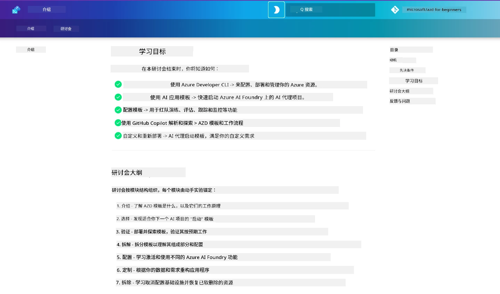

<div align="center">
  <div style="background: linear-gradient(135deg, #0078d4, #106ebe); border-radius: 10px; padding: 20px; margin: 20px 0; box-shadow: 0 4px 15px rgba(0, 120, 212, 0.3); border: 2px solid #005a9e;">
    <h2 style="color: white; margin: 0; font-size: 24px; text-shadow: 1px 1px 2px rgba(0,0,0,0.3);">
      🎯 AZD 面向 AI 开发者工作坊
    </h2>
    <p style="color: white; margin: 10px 0 0 0; font-size: 16px; text-shadow: 1px 1px 2px rgba(0,0,0,0.3);">
      <strong>使用 Azure Developer CLI 构建 AI 应用的实操工作坊。</strong><br>
      完成 7 个模块，掌握 AZD 模板和 AI 部署工作流程。
    </p>
    <div style="margin-top: 15px;">
      <span style="background: rgba(255,255,255,0.2); padding: 5px 10px; border-radius: 15px; color: white; font-size: 14px;">
        📅 最近更新：2026年2月
      </span>
    </div>
  </div>
</div>

# AZD 面向 AI 开发者工作坊

欢迎参加以 AI 应用部署为重点的 Azure Developer CLI (AZD) 实操工作坊。该工作坊通过 3 个步骤帮助你获得对 AZD 模板的应用性理解：

1. **发现** - 找到适合你的模板。
1. **部署** - 部署并验证其可用性
1. **自定义** - 修改并迭代使其符合你的需求！

在本工作坊过程中，你还将接触到核心开发工具和工作流程，帮助你简化端到端的开发流程。

<br/>

## 基于浏览器的指南

工作坊课程以 Markdown 编写。你可以直接在 GitHub 中浏览它们——或者像下图所示启动基于浏览器的预览。



要使用此选项 - 将仓库 fork 到你的个人资料，然后启动 GitHub Codespaces。VS Code 终端激活后，输入以下命令：

```bash title="" linenums="0"
mkdocs serve > /dev/null 2>&1 &
```

几秒钟后，你会看到弹出对话框。选择 `Open in browser` 选项。基于 Web 的指南现在将在新的浏览器标签中打开。此预览的一些好处：

1. **内置搜索** - 快速查找关键字或课程。
1. **复制图标** - 将鼠标悬停在代码块上即可看到此选项
1. **主题切换** - 在深色和浅色主题之间切换
1. **获取帮助** - 点击页脚中的 Discord 图标加入我们！

<br/>

## 工作坊概览

**时长：** 3-4 小时  
**级别：** 初级到中级  
**先决条件：** 熟悉 Azure、AI 概念、VS Code 和命令行工具。

这是一个通过实践学习的工作坊。完成练习后，我们建议你回顾 AZD For Beginners 课程，以继续学习安全性和生产力最佳实践。

| 时间| 模块  | 目标 |
|:---|:---|:---|
| 15 分钟 | [介绍](docs/instructions/0-Introduction.md) | 设定背景，明确目标 |
| 30 分钟 | [选择 AI 模板](docs/instructions/1-Select-AI-Template.md) | 探索选项并选择入门模板 | 
| 30 分钟 | [验证 AI 模板](docs/instructions/2-Validate-AI-Template.md) | 将默认解决方案部署到 Azure |
| 30 分钟 | [分解 AI 模板](docs/instructions/3-Deconstruct-AI-Template.md) | 探索结构和配置 |
| 30 分钟 | [配置 AI 模板](docs/instructions/4-Configure-AI-Template.md) | 启用并尝试可用功能 |
| 30 分钟 | [定制 AI 模板](docs/instructions/5-Customize-AI-Template.md) | 将模板调整为你的需求 |
| 30 分钟 | [拆除基础设施](docs/instructions/6-Teardown-Infrastructure.md) | 清理并释放资源 |
| 15 分钟 | [总结与后续](docs/instructions/7-Wrap-up.md) | 学习资源，工作坊挑战 |

<br/>

## 你将学到什么

将 AZD 模板视为一个学习沙盒，用于探索在 Microsoft Foundry 上进行端到端开发的各种功能和工具。完成本工作坊后，你应对该上下文中的各种工具和概念有直观的认识。

| 概念  | 目标 |
|:---|:---|
| **Azure Developer CLI** | 了解工具命令和工作流程|
| **AZD 模板**| 了解项目结构和配置|
| **Azure AI Agent**| 预配并部署 Microsoft Foundry 项目  |
| **Azure AI Search**| 使用智能体启用上下文工程 |
| **可观测性**| 探索追踪、监控和评估 |
| **红队测试**| 探索对抗性测试和缓解措施 |

<br/>

## 工作坊结构

本工作坊的结构将带你从模板发现，到部署、分解和自定义——以官方的 [开始使用 AI 智能体](https://github.com/Azure-Samples/get-started-with-ai-agents) 入门模板为基础。

### [模块 1：选择 AI 模板](docs/instructions/1-Select-AI-Template.md) (30 分钟)

- 什么是 AI 模板？
- 我可以在哪里找到 AI 模板？
- 如何开始构建 AI 智能体？
- **实验**：使用 GitHub Codespaces 快速开始

### [模块 2：验证 AI 模板](docs/instructions/2-Validate-AI-Template.md) (30 分钟)

- AI 模板的架构是什么？
- AZD 的开发工作流程是什么？
- 我如何获得 AZD 开发方面的帮助？
- **实验**：部署并验证 AI Agents 模板

### [模块 3：分解 AI 模板](docs/instructions/3-Deconstruct-AI-Template.md) (30 分钟)

- 在 `.azure/` 中探索你的环境 
- 在 `infra/` 中查看资源设置 
- 查看 `azure.yaml`s 中的 AZD 配置
- **实验**：修改环境变量并重新部署

### [模块 4：配置 AI 模板](docs/instructions/4-Configure-AI-Template.md) (30 分钟)
- 探索：检索增强生成（RAG）
- 探索：智能体评估与红队测试
- 探索：追踪与监控
- **实验**：探索 AI 智能体 + 可观测性 

### [模块 5：定制 AI 模板](docs/instructions/5-Customize-AI-Template.md) (30 分钟)
- 定义：包含场景需求的产品需求文档（PRD）
- 配置：AZD 的环境变量
- 实现：用于附加任务的生命周期钩子
- **实验**：为我的场景定制模板

### [模块 6：拆除基础设施](docs/instructions/6-Teardown-Infrastructure.md) (30 分钟)
- 回顾：什么是 AZD 模板？
- 回顾：为什么使用 Azure Developer CLI？
- 下一步：尝试不同的模板！
- **实验**：取消配置基础设施并清理

<br/>

## 工作坊挑战

想挑战更多自己吗？这里有一些项目建议——或者与我们分享你的想法！！

| 项目 | 描述 |
|:---|:---|
|1. **分解一个复杂的 AI 模板** | 使用我们概述的工作流程和工具，看看你是否能部署、验证并定制另一个 AI 解决方案模板。 _你学到了什么?_|
|2. **根据你的场景进行定制**  | 尝试为不同场景撰写 PRD（产品需求文档）。然后在你的模板仓库中使用 GitHub Copilot 的 Agent Model - 并让它为你生成定制工作流。 _你学到了什么？你如何改进这些建议?_|
| | |

## 有反馈吗？

1. 在此仓库提交 issue - 为方便起见请标记为 `Workshop`。
1. 加入 Microsoft Foundry 的 Discord - 与同行交流！


| | | 
|:---|:---|
| **📚 Course Home**| [AZD 入门](../README.md)|
| **📖 Documentation** | [开始使用 AI 模板](https://learn.microsoft.com/en-us/azure/ai-foundry/how-to/develop/ai-template-get-started)|
| **🛠️AI Templates** | [Microsoft Foundry 模板](https://ai.azure.com/templates) |
|**🚀 Next Steps** | [开始工作坊](../../../workshop) |
| | |

<br/>

---

**导航：** [主课程](../README.md) | [介绍](docs/instructions/0-Introduction.md) | [模块 1：选择模板](docs/instructions/1-Select-AI-Template.md)

**准备好使用 AZD 开始构建 AI 应用了吗？**

[开始工作坊：介绍 →](docs/instructions/0-Introduction.md)

---

<!-- CO-OP TRANSLATOR DISCLAIMER START -->
免责声明：
本文档已使用 AI 翻译服务 Co‑op Translator（https://github.com/Azure/co-op-translator）进行翻译。尽管我们力求准确，但请注意，自动翻译可能包含错误或不准确之处。应以原始语言的原文为权威来源。对于关键信息，建议采用专业人工翻译。因使用本翻译而产生的任何误解或误释，我们不承担任何责任。
<!-- CO-OP TRANSLATOR DISCLAIMER END -->