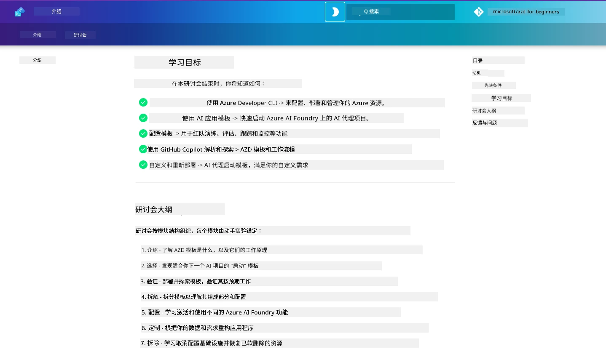

<div align="center">
  <div style="background: linear-gradient(135deg, #0078d4, #106ebe); border-radius: 10px; padding: 20px; margin: 20px 0; box-shadow: 0 4px 15px rgba(0, 120, 212, 0.3); border: 2px solid #005a9e;">
    <h2 style="color: white; margin: 0; font-size: 24px; text-shadow: 1px 1px 2px rgba(0,0,0,0.3);">
      🎯 面向 AI 开发者的 AZD 工作坊
    </h2>
    <p style="color: white; margin: 10px 0 0 0; font-size: 16px; text-shadow: 1px 1px 2px rgba(0,0,0,0.3);">
      <strong>使用 Azure Developer CLI 构建 AI 应用的动手工作坊。</strong><br>
      完成 7 个模块以掌握 AZD 模板和 AI 部署工作流。
    </p>
    <div style="margin-top: 15px;">
      <span style="background: rgba(255,255,255,0.2); padding: 5px 10px; border-radius: 15px; color: white; font-size: 14px;">
        📅 最后更新：2026年3月
      </span>
    </div>
  </div>
</div>

# AZD 面向 AI 开发者的工作坊

欢迎参加以 AI 应用部署为重点的 Azure Developer CLI (AZD) 实践工作坊。本工作坊通过 3 个步骤帮助你掌握 AZD 模板的应用理解：

1. <strong>探索</strong> - 找到适合你的模板。
1. <strong>部署</strong> - 部署并验证其可用性
1. <strong>定制</strong> - 修改并迭代以使其符合你的需求！

在本工作坊过程中，你还将接触到核心开发工具和工作流，帮助你简化端到端的开发流程。

<br/>

## 基于浏览器的指南

课程以 Markdown 格式编写。你可以直接在 GitHub 中浏览它们，或像下面截图所示启动基于浏览器的预览。



要使用此选项 - 将仓库 fork 到你的个人空间，然后启动 GitHub Codespaces。VS Code 终端激活后，输入以下命令：

This browser preview works in GitHub Codespaces, dev containers, or a local clone with Python and MkDocs installed.

```bash title="" linenums="0"
mkdocs serve > /dev/null 2>&1 &
```

几秒钟后，你会看到一个弹出对话框。选择 `在浏览器中打开` 选项。基于 Web 的指南将会在新的浏览器标签页中打开。此预览的一些好处：

1. <strong>内置搜索</strong> - 快速查找关键字或课程。
1. <strong>复制图标</strong> - 将鼠标悬停在代码块上即可看到此选项
1. <strong>主题切换</strong> - 在深色和浅色主题之间切换
1. <strong>获取帮助</strong> - 点击页脚的 Discord 图标加入！

<br/>

## 工作坊概览

**持续时间：** 3-4 小时  
**级别：** 初学者到中级  
**先决条件：** 熟悉 Azure、AI 概念、VS Code 和命令行工具。

这是一个动手实践的工作坊，通过实操学习。一旦完成练习，我们推荐你回顾 AZD 入门课程，以继续在安全性和生产力最佳实践方面的学习旅程。

| 时间| 模块  | 目标 |
|:---|:---|:---|
| 15 mins | [介绍](docs/instructions/0-Introduction.md) | 设定背景，理解目标 |
| 30 mins | [选择 AI 模板](docs/instructions/1-Select-AI-Template.md) | 探索选项并选择入门模板 | 
| 30 mins | [验证 AI 模板](docs/instructions/2-Validate-AI-Template.md) | 将默认解决方案部署到 Azure |
| 30 mins | [解构 AI 模板](docs/instructions/3-Deconstruct-AI-Template.md) | 探索结构和配置 |
| 30 mins | [配置 AI 模板](docs/instructions/4-Configure-AI-Template.md) | 启用并尝试可用功能 |
| 30 mins | [定制 AI 模板](docs/instructions/5-Customize-AI-Template.md) | 根据需求调整模板 |
| 30 mins | [拆除基础设施](docs/instructions/6-Teardown-Infrastructure.md) | 清理并释放资源 |
| 15 mins | [总结与下一步](docs/instructions/7-Wrap-up.md) | 学习资源，工作坊挑战 |

<br/>

## 你将学到什么

将 AZD 模板视为一个学习沙箱，用于探索在 Microsoft Foundry 上进行端到端开发的各种能力和工具。通过本工作坊，你应能对相关工具和概念形成直观的理解。

| 概念  | 目标 |
|:---|:---|
| **Azure Developer CLI** | 了解工具命令和工作流|
| **AZD 模板**| 理解项目结构和配置|
| **Azure AI 代理**| 预配并部署 Microsoft Foundry 项目  |
| **Azure AI 搜索**| 使用代理启用上下文工程 |
| <strong>可观测性</strong>| 探索追踪、监控和评估 |
| <strong>对抗性测试</strong>| 探索对抗性测试和缓解措施 |

<br/>

## 工作坊结构

本工作坊的结构旨在带你完成从模板发现、部署、解构到定制的旅程——以官方的 [开始使用 AI 代理](https://github.com/Azure-Samples/get-started-with-ai-agents) 入门模板为基础。

### [模块 1：选择 AI 模板](docs/instructions/1-Select-AI-Template.md) (30 分钟)

- 什么是 AI 模板？
- 我可以在哪里找到 AI 模板？
- 如何开始构建 AI 代理？
- <strong>实验</strong>：在 Codespaces 或开发容器中快速入门

### [模块 2：验证 AI 模板](docs/instructions/2-Validate-AI-Template.md) (30 分钟)

- AI 模板的架构是什么？
- AZD 的开发工作流是什么？
- 在 AZD 开发中如何寻求帮助？
- <strong>实验</strong>：部署并验证 AI 代理模板

### [模块 3：解构 AI 模板](docs/instructions/3-Deconstruct-AI-Template.md) (30 分钟)

- 探索 `.azure/` 中的环境 
- 探索 `infra/` 中的资源设置 
- 探索你的 AZD 配置在 `azure.yaml`s
- <strong>实验</strong>：修改环境变量并重新部署

### [模块 4：配置 AI 模板](docs/instructions/4-Configure-AI-Template.md) (30 分钟)
- 探索：检索增强生成（Retrieval Augmented Generation）
- 探索：代理评估与对抗性测试
- 探索：追踪与监控
- <strong>实验</strong>：探索 AI 代理 + 可观测性 

### [模块 5：定制 AI 模板](docs/instructions/5-Customize-AI-Template.md) (30 分钟)
- 定义：带场景需求的 PRD
- 配置：AZD 的环境变量
- 实现：用于附加任务的生命周期钩子
- <strong>实验</strong>：为我的场景定制模板

### [模块 6：拆除基础设施](docs/instructions/6-Teardown-Infrastructure.md) (30 分钟)
- 回顾：什么是 AZD 模板？
- 回顾：为什么使用 Azure Developer CLI？
- 下一步：尝试不同的模板！
- <strong>实验</strong>：取消配置基础设施并清理

<br/>

## 工作坊挑战

想要挑战自己做更多事情吗？这里有一些项目建议 —— 或者与你我们分享你的想法！！

| 项目 | 描述 |
|:---|:---|
|1. **解构一个复杂的 AI 模板** | 使用我们概述的工作流和工具，看看你是否能部署、验证并定制一个不同的 AI 解决方案模板。 _你学到了什么？_|
|2. <strong>根据你的场景进行定制</strong>  | 试着为不同的场景编写 PRD（产品需求文档）。然后在你的模板仓库中使用 GitHub Copilot 的 Agent Model —— 并让它为你生成一个定制化工作流。 _你学到了什么？如何改进这些建议？_|
| | |

## 有反馈吗？

1. 在此仓库提交 issue —— 为方便起见标记为 `Workshop`。
1. 加入 Microsoft Foundry 的 Discord —— 与同行交流！


| | | 
|:---|:---|
| **📚 课程主页**| [AZD 入门](../README.md)|
| **📖 文档** | [开始使用 AI 模板](https://learn.microsoft.com/en-us/azure/ai-foundry/how-to/develop/ai-template-get-started)|
| **🛠️ AI 模板** | [Microsoft Foundry 模板](https://ai.azure.com/templates) |
|**🚀 下一步** | [开始工作坊](#工作坊概览) |
| | |

<br/>

---

**导航：** [主课程](../README.md) | [介绍](docs/instructions/0-Introduction.md) | [模块 1：选择模板](docs/instructions/1-Select-AI-Template.md)

**准备好使用 AZD 开发 AI 应用了吗？**

[开始工作坊：介绍 →](docs/instructions/0-Introduction.md)

---

<!-- CO-OP TRANSLATOR DISCLAIMER START -->
**免责声明**:
本文件已使用 AI 翻译服务 [Co-op Translator](https://github.com/Azure/co-op-translator) 进行翻译。虽然我们力求准确，但请注意自动翻译可能包含错误或不准确之处。原始语言的文档应被视为权威来源。对于关键信息，建议使用专业人工翻译。对于因使用本翻译而产生的任何误解或误释，我们概不负责。
<!-- CO-OP TRANSLATOR DISCLAIMER END -->