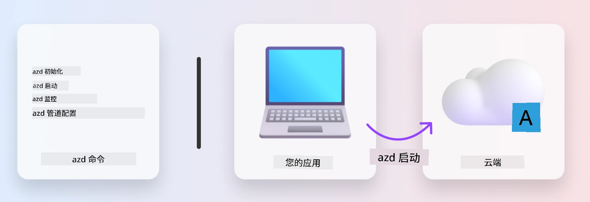
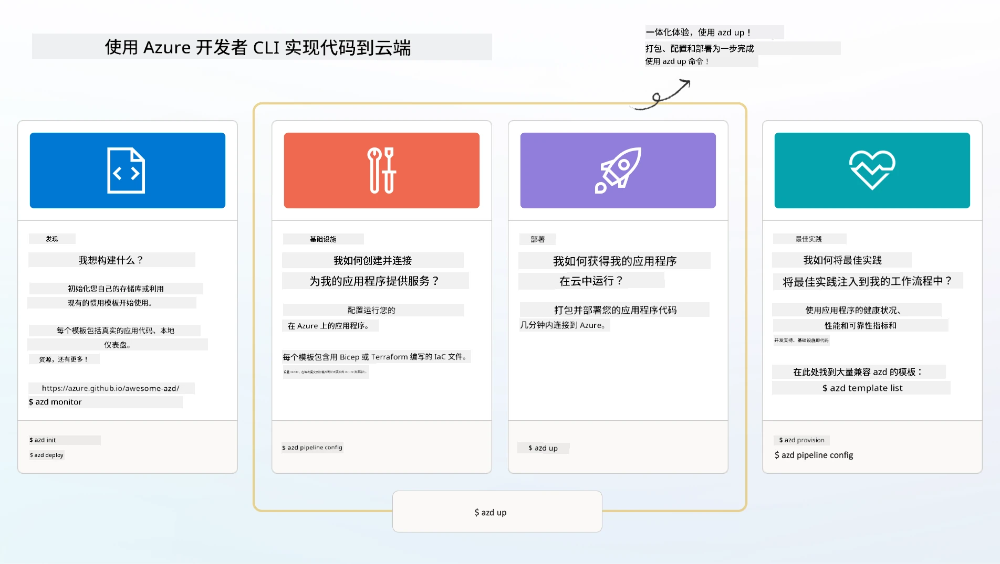

# 1. 选择模板

!!! tip "在本模块结束时您将能够"

    - [ ] 描述什么是 AZD 模板
    - [ ] 发现并使用用于 AI 的 AZD 模板
    - [ ] 开始使用 AI Agents 模板
    - [ ] **Lab 1:** AZD 快速入门（在 Codespaces 或开发容器中）

---

## 1. 建造者类比

从头开始构建一个面向企业的现代 AI 应用程序可能令人生畏。这有点像自己一砖一瓦地建造新房。是的，这是可行的！但这并不是获得理想结果的最有效方式！

相反，我们通常从现有的设计蓝图开始，并与建筑师合作，根据个人需求进行定制。这正是构建智能应用程序时应采取的方法。首先，找到适合你问题域的良好设计架构。然后与解决方案架构师合作，为你的特定场景定制和开发解决方案。

但我们在哪里可以找到这些设计蓝图？我们如何找到愿意教我们如何自行定制和部署这些蓝图的架构师？在本次研讨会中，我们通过向您介绍三项技术来回答这些问题：

1. [Azure 开发者 CLI](https://aka.ms/azd) - 一个开源工具，加速开发者从本地开发（构建）到云部署（发布）的路径。
1. [Microsoft Foundry 模板](https://ai.azure.com/templates) - 标准化的开源仓库，包含用于部署 AI 解决方案架构的示例代码、基础设施和配置文件。
1. [GitHub Copilot Agent 模式](https://code.visualstudio.com/docs/copilot/chat/chat-agent-mode) - 一个以 Azure 知识为基础的编码代理，可以通过自然语言引导我们浏览代码库和进行修改。

有了这些工具，我们现在可以“发现”合适的模板、“部署”它以验证其可行性，并“定制”它以适应我们的特定场景。让我们深入了解它们如何工作。

---

## 2. Azure 开发者 CLI

[Azure 开发者 CLI](https://learn.microsoft.com/en-us/azure/developer/azure-developer-cli/)（或 `azd`）是一个开源命令行工具，可以通过一组在 IDE（开发）和 CI/CD（devops）环境中一致工作的开发者友好命令，加速你的从代码到云的旅程。

使用 `azd`，你的部署旅程可以变得很简单，例如：

- `azd init` - 从现有的 AZD 模板初始化一个新的 AI 项目。
- `azd up` - 一步完成基础设施配置并部署你的应用程序。
- `azd monitor` - 获取已部署应用程序的实时监控和诊断信息。
- `azd pipeline config` - 设置 CI/CD 管道以自动化部署到 Azure。

**🎯 | 练习**: <br/> 现在在你当前的研讨会环境中探索 `azd` 命令行工具。环境可以是 GitHub Codespaces、开发容器，或已安装先决条件的本地克隆。先输入以下命令以查看该工具能做什么：

```bash title="" linenums="0"
azd help
```



---

## 3. AZD 模板

为了让 `azd` 实现这些功能，它需要知道要配置的基础设施、要强制执行的配置设置以及要部署的应用程序。这就是 [AZD 模板](https://learn.microsoft.com/en-us/azure/developer/azure-developer-cli/azd-templates?tabs=csharp) 的用途。

AZD 模板是将示例代码与部署解决方案架构所需的基础设施和配置文件结合在一起的开源仓库。通过采用“基础设施即代码”（IaC）方法，它们允许将模板资源定义和配置设置像应用源代码一样进行版本控制——在该项目的用户之间创建可重用且一致的工作流。

在为“你的”场景创建或重用 AZD 模板时，请考虑以下问题：

1. 你在构建什么？→ 是否有包含该场景入门代码的模板？
1. 你的解决方案如何架构？→ 是否有包含必要资源的模板？
1. 你的解决方案如何部署？→ 考虑带有预/后处理钩子的 `azd deploy`！
1. 你如何进一步优化？→ 考虑内建的监控和自动化管道！

**🎯 | 练习**: <br/> 访问 [Awesome AZD](https://azure.github.io/awesome-azd/) 画廊，并使用筛选器浏览当前可用的 250+ 个模板。看看你是否能找到与“你的”场景需求相符合的模板。



---

## 4. AI 应用模板

对于 AI 驱动的应用程序，Microsoft 提供了以 **Microsoft Foundry** 和 **Foundry Agents** 为特色的专用模板。这些模板加速了你构建智能、可投入生产的应用程序的路径。

### Microsoft Foundry 与 Foundry Agents 模板

在下面选择一个模板进行部署。每个模板都可以在 [Awesome AZD](https://azure.github.io/awesome-azd/) 上获得，并可以通过一条命令初始化。

| Template | Description | Deploy Command |
|----------|-------------|----------------|
| **[RAG（检索增强生成）AI 聊天](https://azure.github.io/awesome-azd/?tags=ai&tags=rag)** | 使用 Microsoft Foundry 的检索增强生成聊天应用 | `azd init -t azure-samples/azure-search-openai-demo` |
| **[Foundry Agent 服务入门](https://azure.github.io/awesome-azd/?tags=ai&tags=agents)** | 使用 Foundry Agents 构建用于自主任务执行的 AI 代理 | `azd init -t azure-samples/foundry-agent-service-starter` |
| **[多代理编排](https://azure.github.io/awesome-azd/?tags=ai&tags=agents)** | 协调多个 Foundry Agents 以实现复杂工作流 | `azd init -t azure-samples/multi-agent-orchestration` |
| **[AI 文档智能](https://azure.github.io/awesome-azd/?tags=ai&tags=document)** | 使用 Microsoft Foundry 模型提取和分析文档 | `azd init -t azure-samples/ai-document-processing` |
| **[对话式 AI 机器人](https://azure.github.io/awesome-azd/?tags=ai&tags=bot)** | 构建与 Microsoft Foundry 集成的智能聊天机器人 | `azd init -t azure-samples/ai-chat-protocol` |
| **[AI 图像生成](https://azure.github.io/awesome-azd/?tags=ai&tags=dalle)** | 通过 Microsoft Foundry 使用 DALL-E 生成图像 | `azd init -t azure-samples/ai-image-generation` |
| **[语义内核代理](https://azure.github.io/awesome-azd/?tags=ai&tags=semantic-kernel)** | 使用 Semantic Kernel 与 Foundry Agents 的 AI 代理 | `azd init -t azure-samples/semantic-kernel-agent` |
| **[AutoGen 多代理](https://azure.github.io/awesome-azd/?tags=ai&tags=autogen)** | 使用 AutoGen 框架的多代理系统 | `azd init -t azure-samples/autogen-multi-agent` |

### 快速开始

1. <strong>浏览模板</strong>: 访问 [https://azure.github.io/awesome-azd/](https://azure.github.io/awesome-azd/) 并按 `AI`、`Agents` 或 `Microsoft Foundry` 进行筛选
2. <strong>选择你的模板</strong>: 选择一个符合你用例的模板
3. <strong>初始化</strong>: 运行所选模板的 `azd init` 命令
4. <strong>部署</strong>: 运行 `azd up` 以进行配置和部署

**🎯 | 练习**: <br/>
根据你的场景从上面的模板中选择一个：

- **要构建聊天机器人吗？** → 从 **RAG（检索增强生成）AI 聊天** 或 **对话式 AI 机器人** 开始
- **需要自主代理吗？** → 试试 **Foundry Agent 服务入门** 或 <strong>多代理编排</strong>
- **处理文档？** → 使用 **AI 文档智能**
- **想要 AI 编码辅助？** → 探索 <strong>语义内核代理</strong> 或 **AutoGen 多代理**

```bash title="Example: Deploy the AI Chat with RAG template" linenums="0"
azd init -t azure-samples/azure-search-openai-demo
azd up
```

!!! info "探索更多模板"
    [Awesome AZD 画廊](https://azure.github.io/awesome-azd/) 包含 250+ 个模板。使用筛选器查找匹配你特定需求的语言、框架和 Azure 服务的模板。

---

<!-- CO-OP TRANSLATOR DISCLAIMER START -->
**免责声明**:
本文档已使用 AI 翻译服务 [Co-op Translator](https://github.com/Azure/co-op-translator) 进行翻译。虽然我们力求准确，但请注意，自动翻译可能包含错误或不准确之处。原始语言的文档应被视为权威来源。对于关键信息，建议采用专业人工翻译。我们不对因使用本翻译而产生的任何误解或误释承担责任。
<!-- CO-OP TRANSLATOR DISCLAIMER END -->