# 2. 验证模板

> 在 2026 年 3 月使用 `azd 1.23.12` 验证。

!!! tip "在本模块结束时，您将能够"

    - [ ] 分析 AI 解决方案架构
    - [ ] 理解 AZD 部署工作流
    - [ ] 使用 GitHub Copilot 获取有关 AZD 使用的帮助
    - [ ] **Lab 2:** 部署并验证 AI Agents 模板

---


## 1. 介绍

The [Azure 开发者 CLI](https://learn.microsoft.com/en-us/azure/developer/azure-developer-cli/) or `azd` 是一个开源命令行工具，可在构建和将应用部署到 Azure 时简化开发者工作流程。 

[AZD 模板](https://learn.microsoft.com/azure/developer/azure-developer-cli/azd-templates) 是包含示例应用代码、_基础设施即代码_ 资产和 `azd` 配置文件以实现一致解决方案架构的标准化仓库。 配置基础设施可以像运行一次 `azd provision` 命令那样简单，而使用 `azd up` 则可以一次性完成基础设施的配置<strong>并</strong>部署您的应用！

因此，启动您的应用开发过程可以像找到最适合您应用和基础设施需求的 _AZD 入门模板_ 一样简单，然后根据您的场景需求自定义仓库。

在开始之前，让我们确保您已安装 Azure Developer CLI。

1. 打开 VS Code 终端并输入此命令：

      ```bash title="" linenums="0"
      azd version
      ```

1. 您应该会看到类似的输出！

      ```bash title="" linenums="0"
      azd version 1.23.12 (commit <current-build>)
      ```

**您现在已准备好使用 azd 选择并部署模板**

---

## 2. 模板选择

Microsoft Foundry 平台随附一组 [推荐的 AZD 模板](https://learn.microsoft.com/en-us/azure/ai-foundry/how-to/develop/ai-template-get-started)，涵盖诸如 _多代理工作流自动化_ 和 _多模态内容处理_ 等常见解决方案场景。您也可以通过访问 Microsoft Foundry 门户来发现这些模板。

1. 访问 [https://ai.azure.com/templates](https://ai.azure.com/templates)
1. 在提示时登录 Microsoft Foundry 门户 - 您将看到类似如下内容。

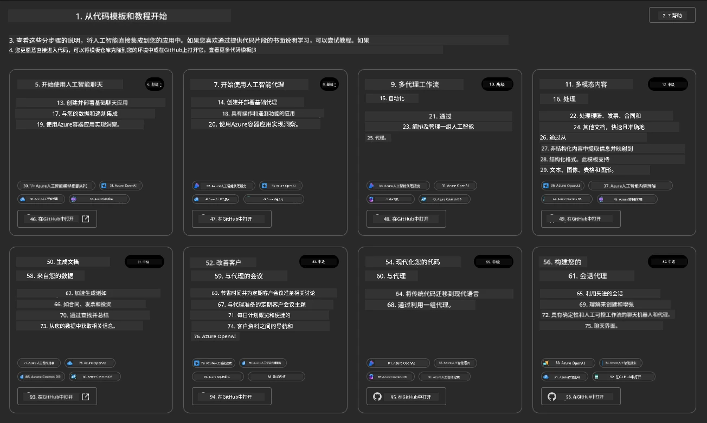


The **Basic** options are your starter templates:

1. [ ] [开始使用 AI 聊天](https://github.com/Azure-Samples/get-started-with-ai-chat) 会将一个基本聊天应用 _使用您的数据_ 部署到 Azure Container Apps。使用此模板可探索基本的 AI 聊天机器人场景。
1. [X] [开始使用 AI Agents](https://github.com/Azure-Samples/get-started-with-ai-agents) 同样会部署一个标准 AI Agent（使用 Foundry Agents）。使用此模板可熟悉涉及工具和模型的代理式 AI 解决方案。

在新浏览器标签中打开第二个链接（或点击相关卡片的 `Open in GitHub`）。您应该会看到该 AZD 模板的仓库。花点时间浏览 README。应用架构如下所示：

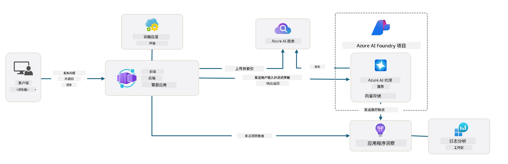

---

## 3. 模板激活

让我们尝试部署此模板并确保其有效。我们将遵循 [Getting Started](https://github.com/Azure-Samples/get-started-with-ai-agents?tab=readme-ov-file#getting-started) 部分中的指南。

1. 为模板仓库选择一个工作环境：

      - **GitHub Codespaces**: 点击 [this link](https://github.com/codespaces/new/Azure-Samples/get-started-with-ai-agents) 并确认 `Create codespace`
      - <strong>本地克隆或开发容器</strong>: 克隆 `Azure-Samples/get-started-with-ai-agents` 并在 VS Code 中打开

1. 等到 VS Code 终端准备就绪，然后输入以下命令：

   ```bash title="" linenums="0"
   azd up
   ```

完成这将触发的工作流步骤：

1. 系统将提示您登录 Azure - 按照说明进行身份验证
1. 输入一个唯一的环境名称，例如：我使用了 `nitya-mshack-azd`
1. 这将创建一个 `.azure/` 文件夹 - 您会看到一个以环境名称命名的子文件夹
1. 系统将提示您选择订阅名称 - 选择默认订阅
1. 系统将提示您选择位置 - 使用 `East US 2`

现在，等待配置完成。**这需要 10-15 分钟**

1. 完成后，您的控制台将显示类似这样的 SUCCESS 消息：
      ```bash title="" linenums="0"
      SUCCESS: Your up workflow to provision and deploy to Azure completed in 10 minutes 17 seconds.
      ```
1. 您的 Azure 门户现在将有一个已配置的资源组，名称为该环境名：

      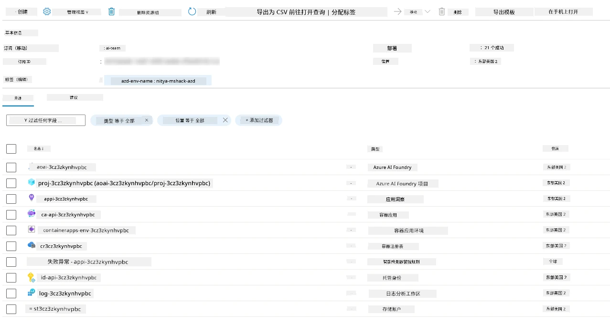

1. <strong>您现在已准备好验证已部署的基础设施和应用程序</strong>。

---

## 4. 模板验证

1. 访问 Azure 门户的 [Resource Groups](https://portal.azure.com/#browse/resourcegroups) 页面 - 在提示时登录
1. 单击与您的环境名称对应的资源组 - 您会看到上图所示的页面

      - 单击 Azure Container Apps 资源
      - 单击 _要点_ 部分（右上角）中的 Application Url

1. 您应该会看到托管的应用前端 UI，如下所示：

   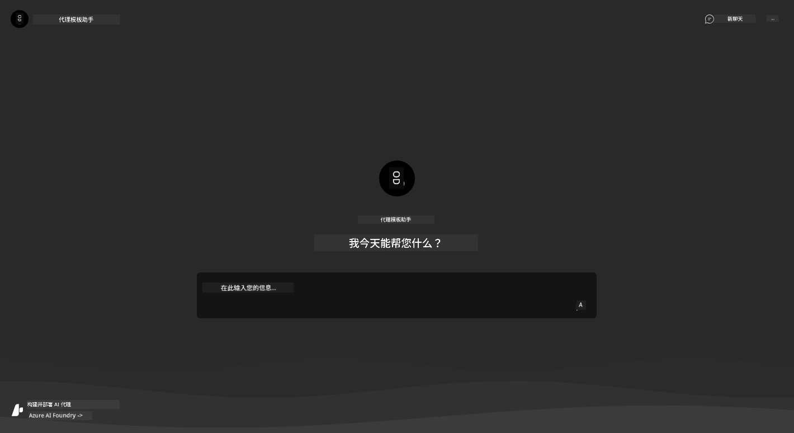

1. 尝试询问一些[示例问题](https://github.com/Azure-Samples/get-started-with-ai-agents/blob/main/docs/sample_questions.md)

      1. Ask: ```What is the capital of France?``` 
      1. Ask: ```What's the best tent under $200 for two people, and what features does it include?```

1. 您应该会得到类似下图所示的回答。_但这是如何工作的？_ 

      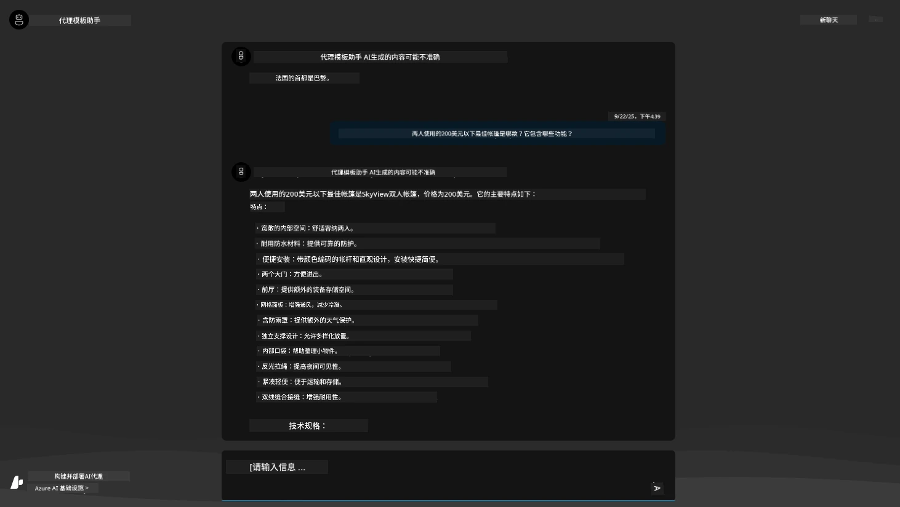

---

## 5. 代理验证

Azure Container App 部署了一个端点，该端点连接到为此模板在 Microsoft Foundry 项目中配置的 AI Agent。让我们看看这意味着什么。

1. 返回 Azure 门户中您资源组的 _概览_ 页面

1. 在该列表中单击 `Microsoft Foundry` 资源

1. 您应该会看到此页面。单击 `Go to Microsoft Foundry Portal` 按钮。 
   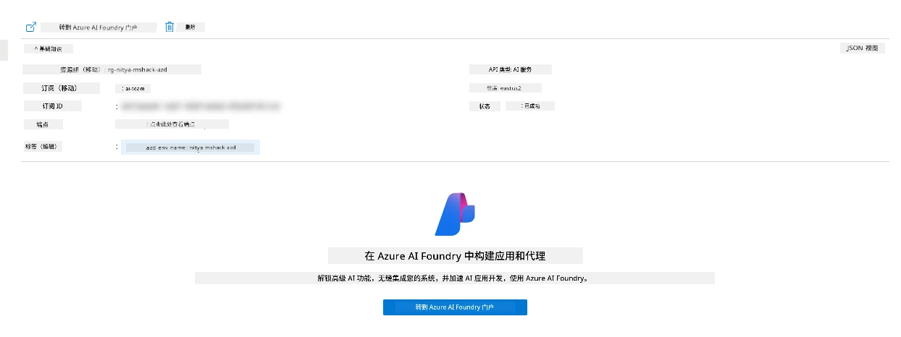

1. 您应该会看到该 AI 应用的 Foundry 项目页面
   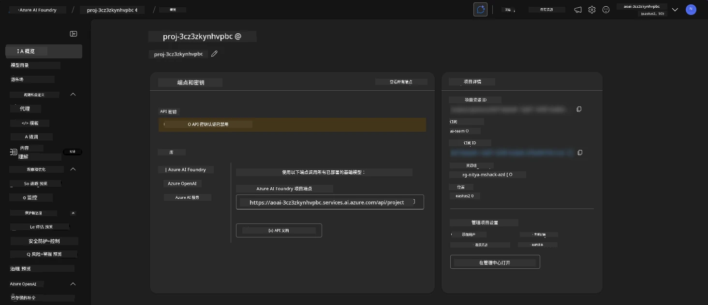

1. 单击 `Agents` - 您会看到项目中配置的默认代理
   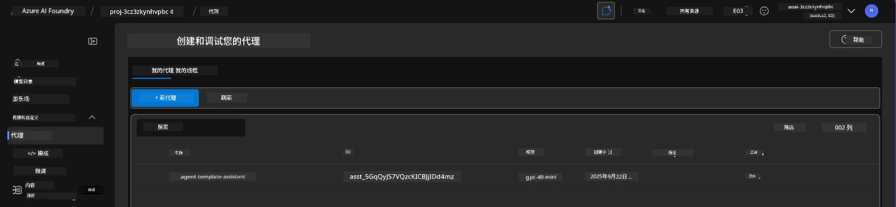

1. 选择它 - 您会看到代理详细信息。注意以下几点：

      - 该代理默认使用 文件搜索 (始终如此)
      - 代理的 `Knowledge` 显示已上传 32 个文件（用于文件搜索）
      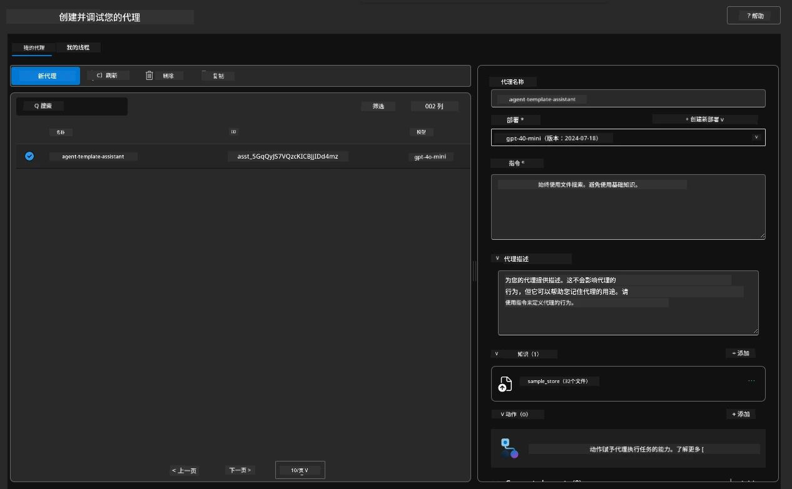

1. 在左侧菜单中查找 `Data+indexes` 选项并单击以查看详细信息。 

      - 您应该会看到为知识上传的 32 个数据文件。
      - 这些文件对应于 `src/files` 下的 12 个客户文件和 20 个产品文件
      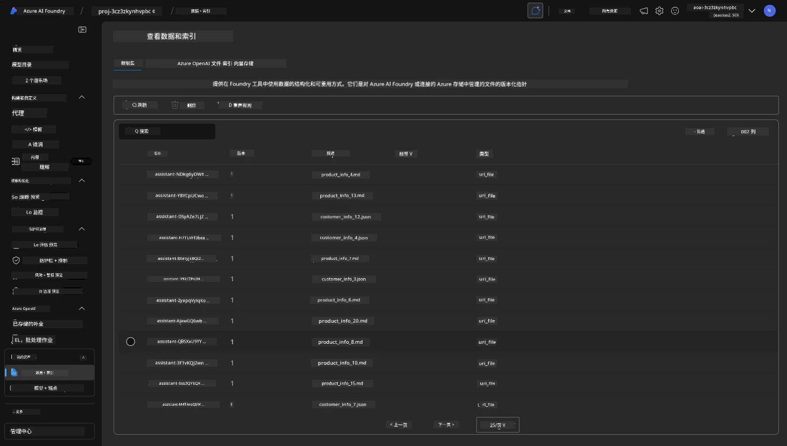

**您已验证代理运行！** 

1. 代理的响应以这些文件中的知识为依据。 
1. 您现在可以就这些数据相关的问题进行提问，并获得有据可查的回答。
1. 示例：`customer_info_10.json` 描述了 "Amanda Perez" 的 3 次购买记录

返回包含 Container App 端点的浏览器选项卡并询问：`What products does Amanda Perez own?`。您应该会看到类似以下内容：

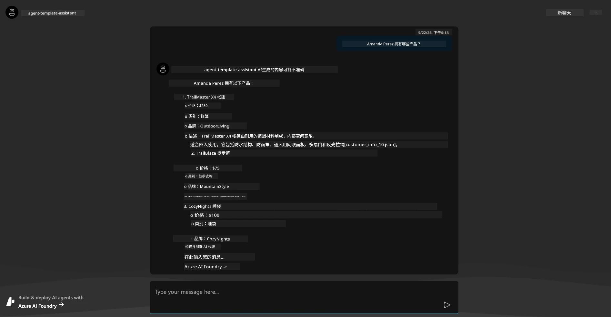

---

## 6. 代理 Playground

让我们通过在 Agents Playground 中运行该代理来更深入直观地了解 Microsoft Foundry 的能力。

1. 返回 Microsoft Foundry 中的 `Agents` 页面 - 选择默认代理
1. 单击 `Try in Playground` 选项 - 您应该会看到类似的 Playground 界面
1. 提问相同的问题：`What products does Amanda Perez own?`

    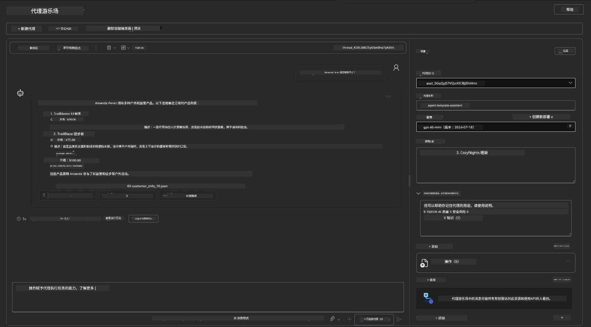

您会得到相同（或类似）的响应——但您还会获得额外信息，以便了解代理式应用的质量、成本和性能。例如：

1. 注意响应引用了用于“支撑”响应的数据文件
1. 将鼠标悬停在任一文件标签上 - 数据是否与您的查询和显示的响应相匹配？

您还会在响应下方看到一行 _统计_ 信息。

1. 将鼠标悬停在任一指标上 - 例如 Safety。您会看到类似如下的信息
1. 评估的评级是否符合您对响应安全级别的直觉判断？

      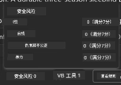

---

## 7. 内置可观测性

可观测性是关于为应用程序添加仪表以生成可用于理解、调试和优化其运行的数据。为此，您可以：

1. 单击 `View Run Info` 按钮 - 您应该会看到此视图。这是 [Agent tracing](https://learn.microsoft.com/en-us/azure/ai-foundry/how-to/develop/trace-agents-sdk#view-trace-results-in-the-azure-ai-foundry-agents-playground) 的一个示例。_您也可以通过在顶层菜单中点击 Thread Logs 来获得此视图_。

   - 了解运行步骤和代理使用的工具
   - 了解响应的总 Token 数（与输出 token 使用量的对比）
   - 了解延迟以及执行过程中时间消耗的位置

      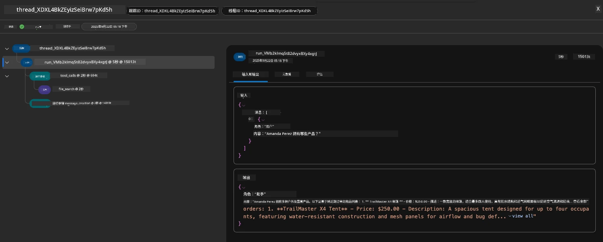

1. 单击 `Metadata` 选项卡以查看运行的其他属性，这些属性可能为之后调试问题提供有用的上下文。   

      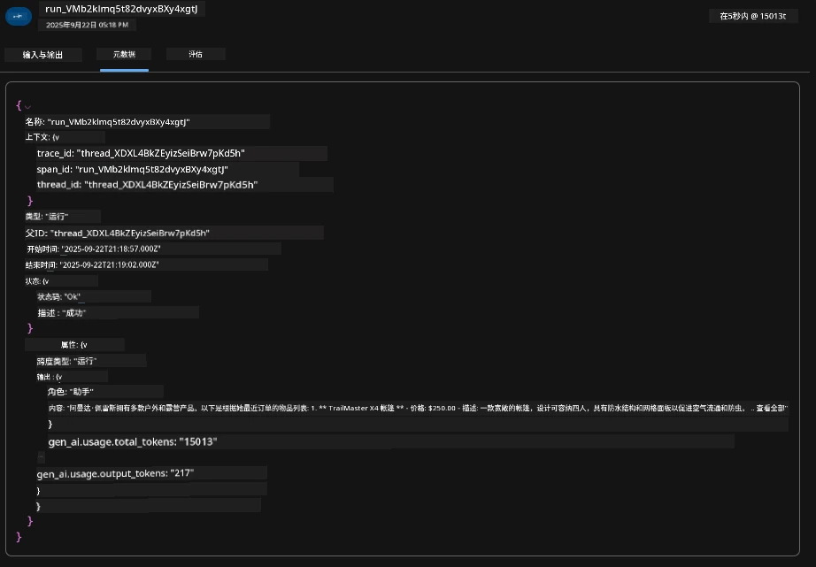


1. 单击 `Evaluations` 选项卡以查看对代理响应的自动评估。这些评估包括安全性评估（例如 Self-harm）和代理特定评估（例如 意图解析、任务遵循）。

      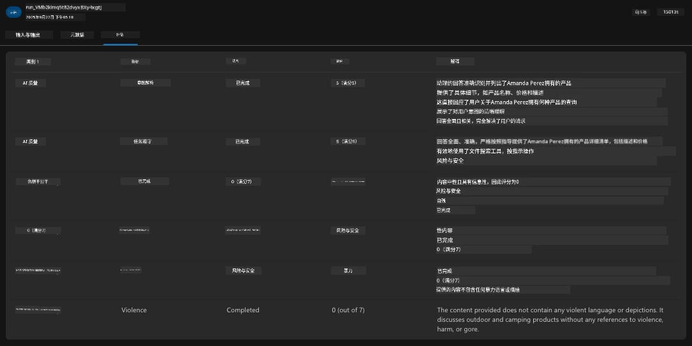

1. 最后，在侧边栏菜单中单击 `Monitoring` 选项卡。

      - 在显示的页面中选择 `Resource usage` 选项卡 - 并查看指标。
      - 跟踪应用使用情况以了解成本（tokens）和负载（请求）。
      - 跟踪应用从输入处理到输出的延迟（首字节和末字节）。

      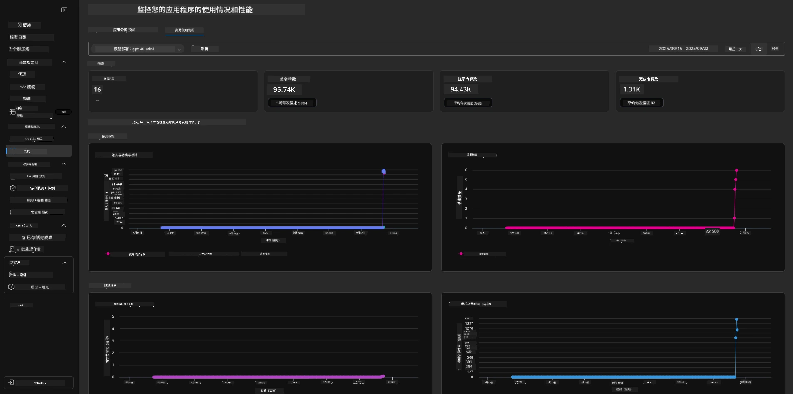

---

## 8. 环境变量

到目前为止，我们已经在浏览器中完成了部署并验证了基础设施已配置且应用程序可运行。但要以“代码优先”方式使用应用，我们需要在本地开发环境中配置与这些资源协作所需的相关变量。使用 `azd` 可以很容易地做到这一点。

1. Azure Developer CLI [使用环境变量](https://learn.microsoft.com/en-us/azure/developer/azure-developer-cli/manage-environment-variables?tabs=bash) 来存储和管理应用部署的配置设置。

1. 环境变量存储在 `.azure/<env-name>/.env` 中 - 这将它们限定到部署时使用的 `env-name` 环境，并帮助您在同一仓库中的不同部署目标之间隔离环境。

1. `azd` 命令在执行特定命令（例如 `azd up`）时会自动加载环境变量。请注意，`azd` 不会自动读取操作系统级别的环境变量（例如在 shell 中设置的）——相反，请使用 `azd set env` 和 `azd get env` 在脚本中传递信息。


让我们试试一些命令：

1. 获取在该环境中为 `azd` 设置的所有环境变量：

      ```bash title="" linenums="0"
      azd env get-values
      ```
      
      您会看到类似输出：

      ```bash title="" linenums="0"
      AZURE_AI_AGENT_DEPLOYMENT_NAME="gpt-4.1-mini"
      AZURE_AI_AGENT_NAME="agent-template-assistant"
      AZURE_AI_EMBED_DEPLOYMENT_NAME="text-embedding-3-small"
      AZURE_AI_EMBED_DIMENSIONS=100
      ...
      ```

1. 获取特定值 - 例如，我想知道是否设置了 `AZURE_AI_AGENT_MODEL_NAME` 值

      ```bash title="" linenums="0"
      azd env get-value AZURE_AI_AGENT_MODEL_NAME 
      ```
      
      您会看到类似输出 - 默认情况下未设置该值！

      ```bash title="" linenums="0"
      ERROR: key 'AZURE_AI_AGENT_MODEL_NAME' not found in the environment values
      ```

1. 为 `azd` 设置新的环境变量。在这里，我们更新代理模型名称。_注意：所做的任何更改将立即反映在 `.azure/<env-name>/.env` 文件中。_

      ```bash title="" linenums="0"
      azd env set AZURE_AI_AGENT_MODEL_NAME gpt-4.1
      azd env set AZURE_AI_AGENT_MODEL_VERSION 2025-04-14
      azd env set AZURE_AI_AGENT_DEPLOYMENT_CAPACITY 150
      ```

      现在，我们应该可以发现该值已设置：

      ```bash title="" linenums="0"
      azd env get-value AZURE_AI_AGENT_MODEL_NAME 
      ```

1. 请注意，某些资源是持久的（例如模型部署），可能需要不仅仅是一次 `azd up` 才能强制重新部署。让我们尝试拆除原始部署并在更改环境变量后重新部署。

1. <strong>刷新</strong> 如果您之前使用 azd 模板部署过基础设施 - 您可以使用此命令基于当前 Azure 部署的状态刷新本地环境变量的状态：

      ```bash title="" linenums="0"
      azd env refresh
      ```

      这是在两个或多个本地开发环境 (例如，团队中有多个开发者) 之间 _同步_ 环境变量的强大方式 - 允许已部署的基础设施作为环境变量状态的权威来源。团队成员只需 _刷新_ 变量即可重新同步。

---

## 9. 恭喜 🏆

您刚刚完成了一个端到端的工作流程，其中您：

- [X] 选择了要使用的 AZD 模板
- [X] 在受支持的开发环境中打开了该模板
- [X] 部署了该模板并验证其可正常工作

---

<!-- CO-OP TRANSLATOR DISCLAIMER START -->
**免责声明**:
本文件使用 AI 翻译服务 [Co-op Translator](https://github.com/Azure/co-op-translator) 进行翻译。尽管我们努力确保准确性，但请注意自动翻译可能包含错误或不准确之处。原始语言的文件应被视为权威来源。对于关键信息，建议使用专业人工翻译。我们不对因使用本翻译而产生的任何误解或曲解承担责任。
<!-- CO-OP TRANSLATOR DISCLAIMER END -->