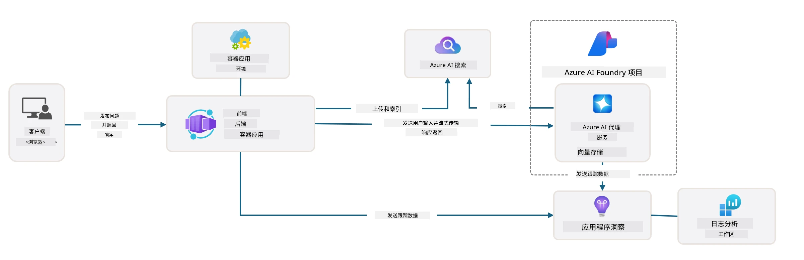

# 3. 拆解模板

!!! tip "在本模块结束时，您将能够"

    - [ ] 使用 MCP 服务器为 Azure 激活 GitHub Copilot
    - [ ] 了解 AZD 模板文件夹结构和组件
    - [ ] 探索基础设施即代码（Bicep）组织模式
    - [ ] **实验 3：** 使用 GitHub Copilot 探索并理解仓库架构 

---


With AZD templates and the Azure Developer CLI (`azd`) we can quickly jumpstart our AI development journey with standardized repositories that provide sample code, infrastructure and configuration files - in the form of a ready-to-deploy _入门_项目.

**但现在，我们需要在没有任何先验 AZD 经验或理解的情况下了解项目结构和代码库，并能够自定义 AZD 模板！**

---

## 1. Activate GitHub Copilot

### 1.1 Install GitHub Copilot Chat

It's time to explore [启用 Agent 模式的 GitHub Copilot](https://code.visualstudio.com/docs/copilot/chat/chat-agent-mode). Now, we can use natural language to describe our task at a high level, and get assistance in execution. For this lab, we'll use the [Copilot 免费计划](https://github.com/github-copilot/signup) which has a monthly limit for completions and chat interactions.

The extension can be installed from the marketplace, and it is often already available in Codespaces or dev container environments. _Click `Open Chat` from the Copilot icon drop-down - and type a prompt like `What can you do?`_ - you may be prompted to log in. **GitHub Copilot Chat 已就绪**。

### 1.2. Install MCP Servers

For Agent mode to be effective, it needs access to the right tools to help it retrieve knowledge or take actions. This is where MCP servers can help. We'll configure the following servers:

1. [Azure MCP 服务器](../../../../../workshop/docs/instructions)
1. [Microsoft Docs MCP 服务器](../../../../../workshop/docs/instructions)

To activate these:

1. 如果不存在，请创建名为 `.vscode/mcp.json` 的文件
1. 将以下内容复制到该文件中 - 并启动服务器！
   ```json title=".vscode/mcp.json"
   {
      "servers": {
         "Azure MCP Server": {
            "command": "npx",
            "args": [
            "-y",
            "@azure/mcp@latest",
            "server",
            "start"
            ]
         },
         "microsoft.docs.mcp": {
            "type": "http",
            "url": "https://learn.microsoft.com/api/mcp"
         }
      }
   }
   ```

??? warning "您可能会遇到 `npx` 未安装 的错误（点击以展开修复方法）"

      要修复此问题，请打开 `.devcontainer/devcontainer.json` 文件并将此行添加到 features 部分。然后重新构建容器。现在您应该已安装 `npx`。

      ```title="" linenums="0"
         "features": {
            "ghcr.io/devcontainers/features/node:1": {},
            ...
         },
      ```

---

### 1.3. Test GitHub Copilot Chat

**首先使用 `azd auth login` 从 VS Code 命令行对 Azure 进行身份验证。如果您计划直接运行 Azure CLI 命令，也请使用 `az login`。**

您现在应该能够查询您的 Azure 订阅状态，并询问有关已部署资源或配置的问题。尝试以下提示：

1. `List my Azure resource groups`
1. `#foundry list my current deployments`

您还可以询问有关 Azure 文档的问题，并获得基于 Microsoft Docs MCP 服务器的响应。尝试以下提示：

1. `#microsoft_docs_search What is Azure Developer CLI?`
1. `#microsoft_docs_search Show me a Python tutorial to chat with deployed model`

或者您可以请求代码片段来完成任务。尝试此提示。

1. `Give me a Python code example that uses AAD for an interactive chat client`

在 `Ask` 模式下，这将提供可供复制粘贴并尝试的代码。在 `Agent` 模式下，这可能更进一步并为您创建相关资源 —— 包括设置脚本和文档 —— 以帮助您执行该任务。

<strong>您现在已具备开始探索模板仓库的能力</strong>

---

## 2. 拆解架构

??? prompt "提问：用一段话解释 docs/images/architecture.png 中的应用架构"

      该应用是一个基于 Azure 的 AI 驱动聊天应用，演示了现代的基于代理的架构。该解决方案以托管主应用代码的 Azure Container App 为中心，处理用户输入并通过 AI 代理生成智能响应。
      
      架构以 Microsoft Foundry Project 作为 AI 能力的基础，连接到提供底层语言模型（例如 gpt-4.1-mini）和代理功能的 Azure AI 服务。用户交互通过基于 React 的前端流向与 AI 代理服务通信以生成上下文响应的 FastAPI 后端。
      
      系统通过文件搜索或 Azure AI Search 服务实现知识检索功能，允许代理访问并引用上传文档中的信息。为了实现卓越的运营，架构包含通过 Application Insights 和 Log Analytics Workspace 的全面监控，用于跟踪、记录和性能优化。
      
      Azure Storage 为应用数据和文件上传提供 blob 存储，而 Managed Identity 确保 Azure 资源之间的安全访问而无需存储凭据。整个解决方案旨在具有可扩展性和可维护性，容器化应用可根据需求自动扩展，同时通过 Azure 的托管服务生态系统提供内置的安全、监控和 CI/CD 能力。



---

## 3. 仓库结构

!!! prompt "提问：解释模板文件夹结构。从可视化的分层图开始。"

??? info "回答：可视化分层图"

      ```bash title="" 
      get-started-with-ai-agents/
      ├── 📋 配置与设置
      │   ├── azure.yaml                    # Azure Developer CLI 配置
      │   ├── docker-compose.yaml           # 本地开发容器
      │   ├── pyproject.toml                # Python 项目配置
      │   ├── requirements-dev.txt          # 开发依赖项
      │   └── .devcontainer/                # VS Code 开发容器设置
      │
      ├── 🏗️ 基础设施 (infra/)
      │   ├── main.bicep                    # 主基础设施模板
      │   ├── api.bicep                     # API 特定资源
      │   ├── main.parameters.json          # 基础设施参数
      │   └── core/                         # 模块化基础设施组件
      │       ├── ai/                       # AI 服务配置
      │       ├── host/                     # 托管基础设施
      │       ├── monitor/                  # 监控与日志
      │       ├── search/                   # Azure AI Search 设置
      │       ├── security/                 # 安全与身份
      │       └── storage/                  # 存储帐户配置
      │
      ├── 💻 应用源代码 (src/)
      │   ├── api/                          # 后端 API
      │   │   ├── main.py                   # FastAPI 应用入口
      │   │   ├── routes.py                 # API 路由定义
      │   │   ├── search_index_manager.py   # 搜索功能
      │   │   ├── data/                     # API 数据处理
      │   │   ├── static/                   # 静态 Web 资源
      │   │   └── templates/                # HTML 模板
      │   ├── frontend/                     # React/TypeScript 前端
      │   │   ├── package.json              # Node.js 依赖项
      │   │   ├── vite.config.ts            # Vite 构建配置
      │   │   └── src/                      # 前端源代码
      │   ├── data/                         # 示例数据文件
      │   │   └── embeddings.csv            # 预计算嵌入
      │   ├── files/                        # 知识库文件
      │   │   ├── customer_info_*.json      # 客户数据示例
      │   │   └── product_info_*.md         # 产品文档
      │   ├── Dockerfile                    # 容器配置
      │   └── requirements.txt              # Python 依赖项
      │
      ├── 🔧 自动化与脚本 (scripts/)
      │   ├── postdeploy.sh/.ps1           # 部署后设置
      │   ├── setup_credential.sh/.ps1     # 凭据配置
      │   ├── validate_env_vars.sh/.ps1    # 环境验证
      │   └── resolve_model_quota.sh/.ps1  # 模型配额管理
      │
      ├── 🧪 测试与评估
      │   ├── tests/                        # 单元与集成测试
      │   │   └── test_search_index_manager.py
      │   ├── evals/                        # 代理评估框架
      │   │   ├── evaluate.py               # 评估运行器
      │   │   ├── eval-queries.json         # 测试查询
      │   │   └── eval-action-data-path.json    # 评估操作数据路径
      │   ├── sandbox/                      # 开发沙箱
      │   │   ├── 1-quickstart.py           # 入门示例
      │   │   └── aad-interactive-chat.py   # 身份验证示例
      │   └── airedteaming/                 # AI 安全评估
      │       └── ai_redteaming.py          # 红队测试
      │
      ├── 📚 文档 (docs/)
      │   ├── deployment.md                 # 部署指南
      │   ├── local_development.md          # 本地设置说明
      │   ├── troubleshooting.md            # 常见问题与解决方法
      │   ├── azure_account_setup.md        # Azure 先决条件
      │   └── images/                       # 文档资产
      │
      └── 📄 项目元数据
         ├── README.md                     # 项目概述
         ├── CODE_OF_CONDUCT.md           # 社区指南
         ├── CONTRIBUTING.md              # 贡献指南
         ├── LICENSE                      # 许可条款
         └── next-steps.md                # 部署后指南
      ```

### 3.1. 核心应用架构

This template follows a **full-stack web application** pattern with:

- <strong>后端</strong>：Python FastAPI 与 Azure AI 集成
- <strong>前端</strong>：TypeScript/React，使用 Vite 构建系统
- <strong>基础设施</strong>：用于云资源的 Azure Bicep 模板
- <strong>容器化</strong>：使用 Docker 实现一致的部署

### 3.2 基础设施即代码 (bicep)

The infrastructure layer uses **Azure Bicep** templates organized modularly:

   - **`main.bicep`**：协调所有 Azure 资源
   - **`core/` 模块**：不同服务的可重用组件
      - AI 服务（Microsoft Foundry 模型、AI Search）
      - 容器托管（Azure Container Apps）
      - 监控（Application Insights、Log Analytics）
      - 安全（Key Vault、托管身份）

### 3.3 应用源代码 (`src/`)

**后端 API (`src/api/`)**：

- 基于 FastAPI 的 REST API
- Foundry Agents 集成
- 用于检索知识的搜索索引管理
- 文件上传和处理能力

**前端 (`src/frontend/`)**：

- 现代 React/TypeScript 单页应用
- 使用 Vite 实现快速开发和优化构建
- 用于与代理交互的聊天界面

**知识库 (`src/files/`)**：

- 示例客户和产品数据
- 演示基于文件的知识检索
- JSON 和 Markdown 格式示例


### 3.4 DevOps 与自动化

**脚本 (`scripts/`)**：

- 跨平台的 PowerShell 和 Bash 脚本
- 环境验证和设置
- 部署后配置
- 模型配额管理

**Azure Developer CLI 集成**：

- 用于 `azd` 工作流的 `azure.yaml` 配置
- 自动化的供应和部署
- 环境变量管理

### 3.5 测试与质量保证

**评估框架 (`evals/`)**：

- 代理性能评估
- 查询-响应质量测试
- 自动化评估流水线

**AI 安全 (`airedteaming/`)**：

- 针对 AI 安全的红队测试
- 安全漏洞扫描
- 负责任的 AI 实践

---

## 4. 恭喜 🏆

您已成功使用带有 MCP 服务器的 GitHub Copilot Chat 来探索该仓库。

- [X] 已为 Azure 激活 GitHub Copilot
- [X] 已了解应用架构
- [X] 已探索 AZD 模板结构

这使您对该模板的_基础设施即代码_资产有了初步了解。接下来，我们将查看 AZD 的配置文件。

---

<!-- CO-OP TRANSLATOR DISCLAIMER START -->
**Disclaimer**:
本文件已使用 AI 翻译服务 [Co-op Translator](https://github.com/Azure/co-op-translator) 进行翻译。尽管我们力求准确，但请注意，自动翻译可能包含错误或不准确之处。原始语言的文件应被视为权威来源。对于关键信息，建议使用专业人工翻译。因使用本翻译而产生的任何误解或曲解，我们不承担任何责任。
<!-- CO-OP TRANSLATOR DISCLAIMER END -->