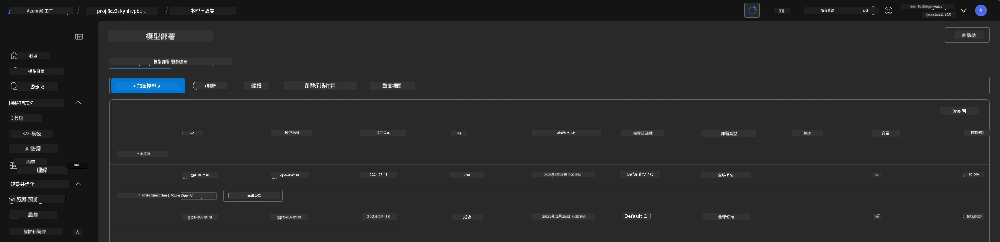
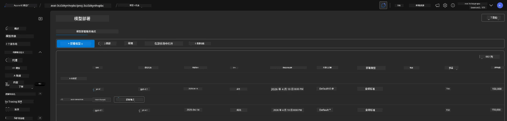

# 6. 拆除基础设施

!!! tip "在本模块结束时您将能够"

    - [ ] 了解资源清理和成本管理的重要性
    - [ ] 使用 `azd down` 安全地取消资源配置
    - [ ] 在需要时恢复已软删除的 Azure AI 服务
    - [ ] **Lab 6:** 清理 Azure 资源并验证已删除

---

## 额外练习

在我们拆除项目之前，花几分钟时间进行一些开放式探索。

!!! info "尝试这些探索提示"

    **与 GitHub Copilot 进行实验：**
    
    1. 询问：`我可以尝试哪些其他 AZD 模板用于多代理场景？`
    2. 询问：`我如何为医疗保健用例自定义代理指令？`
    3. 询问：`哪些环境变量控制成本优化？`
    
    **探索 Azure 门户：**
    
    1. 查看部署的 Application Insights 指标
    2. 检查已配置资源的成本分析
    3. 再次探索 Microsoft Foundry 门户的代理沙盒

---

## 取消配置基础设施

1. 拆除基础设施很简单：
      
      ```bash title="" linenums="0"
      azd down --purge
      ```
1. `--purge` 标志可确保它同时清除已软删除的认知服务资源，从而释放这些资源占用的配额。完成后您将看到类似如下：
      
      ```bash title="" linenums="0"
      ? Total resources to delete: 11, are you sure you want to continue? Yes
      Deleting your resources can take some time.
      (✓) Done: Deleted resource group rg-nitya-mshack-azd
      (✓) Done: Purging Cognitive Account: aoai-3cz3zkynhvpbc

      SUCCESS: Your application was removed from Azure in 11 minutes 4 seconds.
      ```

1. (Optional) 如果您现在再次运行 `azd up`，您会注意到 gpt-4.1 模型会被部署，因为环境变量已在本地 `.azure` 文件夹中更改（并已保存）。 

      这是模型部署的<strong>之前</strong>：

      

      而这是<strong>之后</strong>：
      

---

<!-- CO-OP TRANSLATOR DISCLAIMER START -->
**免责声明**：
本文件由 AI 翻译服务 [Co-op Translator](https://github.com/Azure/co-op-translator) 翻译完成。尽管我们力求准确，但请注意，自动翻译可能包含错误或不准确之处。原始语言版文件应视为权威来源。对于重要信息，建议使用专业人工翻译。我们对因使用本翻译而产生的任何误解或误释不承担责任。
<!-- CO-OP TRANSLATOR DISCLAIMER END -->