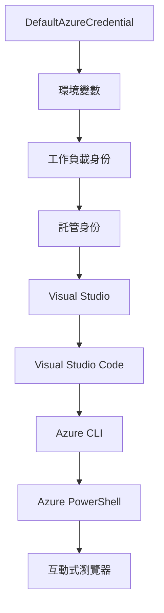

# AZD Basics - 認識 Azure Developer CLI

# AZD Basics - 核心概念與基礎知識

**章節導航:**
- **📚 課程首頁**: [初學者的 AZD](../../README.md)
- **📖 目前章節**: 第一章 - 基礎與快速入門
- **⬅️ 上一章**: [課程總覽](../../README.md#-chapter-1-foundation--quick-start)
- **➡️ 下一章**: [安裝與設定](installation.md)
- **🚀 下一章節**: [第二章：AI 優先開發](../chapter-02-ai-development/microsoft-foundry-integration.md)

## 介紹

本課程介紹 Azure Developer CLI（azd），這是一款強大的命令列工具，加快您從本機開發到 Azure 部署的流程。您將學習基礎概念、核心功能，並了解 azd 如何簡化雲端原生應用的部署。

## 學習目標

課程結束後，您將能夠：
- 理解什麼是 Azure Developer CLI 及其主要用途
- 學習範本、環境與服務的核心概念
- 探索包括範本驅動開發與基礎架構即程式碼的關鍵功能
- 理解 azd 專案結構與工作流程
- 準備安裝與設定 azd，建立您的開發環境

## 學習成果

完成本課後，您能：
- 解釋 azd 在現代雲端開發流程中的角色
- 識別 azd 專案結構中的各組件
- 描述範本、環境與服務如何協同運作
- 了解使用 azd 基礎架構即程式碼的好處
- 辨識不同 azd 指令及其用途

## 什麼是 Azure Developer CLI（azd）？

Azure Developer CLI（azd）是一款命令行工具，設計用於加速您從本機開發到 Azure 部署的流程。它簡化了在 Azure 上建立、部署與管理雲端原生應用的過程。

### azd 可以部署哪些東西？

azd 支援廣泛的工作負載，而且列表持續增加。今天，您可以使用 azd 部署：

| 工作負載類型 | 範例 | 同一工作流程？ |
|--------------|-------|---------------|
| <strong>傳統應用程式</strong> | 網頁應用、REST API、靜態網站 | ✅ `azd up` |
| <strong>服務與微服務</strong> | 容器應用、函式應用、多服務後端 | ✅ `azd up` |
| **AI 驅動應用程式** | 內建 Microsoft Foundry 模型的聊天應用、具 AI 搜尋的 RAG 解決方案 | ✅ `azd up` |
| <strong>智慧代理</strong> | Foundry 托管代理、多代理協調 | ✅ `azd up` |

關鍵是<strong>無論您部署什麼，azd 的生命週期保持一致</strong>。您會初始化專案、佈建基礎架構、部署程式碼、監控應用，以及清理資源—不論是簡單網站還是複雜 AI 代理。

這種連貫性是刻意設計的。azd 把 AI 能力視為應用可使用的另一種類型服務，而非根本不同的東西。從 azd 角度來看，使用 Microsoft Foundry 模型的聊天端點只是另一個需要設定與部署的服務。

### 🎯 為何使用 AZD？實務比較

讓我們比較一下部署簡單的網頁應用＋資料庫的流程：

#### ❌ 沒有 AZD：手動 Azure 部署（30 分鐘以上）

```bash
# 第一步：建立資源群組
az group create --name myapp-rg --location eastus

# 第二步：建立應用服務計劃
az appservice plan create --name myapp-plan \
  --resource-group myapp-rg \
  --sku B1 --is-linux

# 第三步：建立網站應用
az webapp create --name myapp-web-unique123 \
  --resource-group myapp-rg \
  --plan myapp-plan \
  --runtime "NODE:18-lts"

# 第四步：建立 Cosmos DB 帳戶（需時 10-15 分鐘）
az cosmosdb create --name myapp-cosmos-unique123 \
  --resource-group myapp-rg \
  --kind MongoDB

# 第五步：建立資料庫
az cosmosdb mongodb database create \
  --account-name myapp-cosmos-unique123 \
  --resource-group myapp-rg \
  --name tododb

# 第六步：建立集合
az cosmosdb mongodb collection create \
  --account-name myapp-cosmos-unique123 \
  --resource-group myapp-rg \
  --database-name tododb \
  --name todos

# 第七步：取得連接字串
CONN_STR=$(az cosmosdb keys list \
  --name myapp-cosmos-unique123 \
  --resource-group myapp-rg \
  --type connection-strings \
  --query "connectionStrings[0].connectionString" -o tsv)

# 第八步：配置應用程式設定
az webapp config appsettings set \
  --name myapp-web-unique123 \
  --resource-group myapp-rg \
  --settings MONGODB_URI="$CONN_STR"

# 第九步：啟用紀錄
az webapp log config --name myapp-web-unique123 \
  --resource-group myapp-rg \
  --application-logging filesystem \
  --detailed-error-messages true

# 第十步：設定 Application Insights
az monitor app-insights component create \
  --app myapp-insights \
  --location eastus \
  --resource-group myapp-rg

# 第十一步：將 App Insights 連結至網站應用
INSTRUMENTATION_KEY=$(az monitor app-insights component show \
  --app myapp-insights \
  --resource-group myapp-rg \
  --query "instrumentationKey" -o tsv)

az webapp config appsettings set \
  --name myapp-web-unique123 \
  --resource-group myapp-rg \
  --settings APPINSIGHTS_INSTRUMENTATIONKEY="$INSTRUMENTATION_KEY"

# 第十二步：本地端建置應用程式
npm install
npm run build

# 第十三步：建立部署套件
zip -r app.zip . -x "*.git*" "node_modules/*"

# 第十四步：部署應用程式
az webapp deployment source config-zip \
  --resource-group myapp-rg \
  --name myapp-web-unique123 \
  --src app.zip

# 第十五步：等待並祈禱它能運作 🙏
# （無自動驗證，需要手動測試）
```

**問題：**
- ❌ 需要記住並按順序執行 15+ 指令
- ❌ 30-45 分鐘的手動操作
- ❌ 容易犯錯（打錯字或參數錯誤）
- ❌ 連接字串洩露在終端機歷史紀錄
- ❌ 失敗無自動回滾
- ❌ 難以團隊複製
- ❌ 每次差異很大（不可重現）

#### ✅ 使用 AZD：自動化部署（5 指令，10-15 分鐘）

```bash
# 第一步：從範本初始化
azd init --template todo-nodejs-mongo

# 第二步：驗證身份
azd auth login

# 第三步：建立環境
azd env new dev

# 第四步：預覽變更（可選但建議）
azd provision --preview

# 第五步：部署所有內容
azd up

# ✨ 完成！所有項目已部署、配置並監控
```

**優點：**
- ✅ **5 個指令**，取代 15+ 手動步驟
- ✅ 總時間 **10-15 分鐘**（大部分在等待 Azure）
- ✅ <strong>手動錯誤更少</strong>，一致且範本驅動的工作流程
- ✅ <strong>安全管理秘密</strong>，許多範本使用 Azure 管理的秘密存放
- ✅ <strong>可重複部署</strong>，每次同一流程
- ✅ <strong>完全可重現</strong>，結果一致
- ✅ <strong>團隊友善</strong>，任何人用相同指令都能部署
- ✅ <strong>基礎架構即程式碼</strong>，Bicep 範本版本控管
- ✅ <strong>內建監控</strong>，自動設定 Application Insights

### 📊 時間與錯誤減少比較

| 指標 | 手動部署 | AZD 部署 | 改善幅度 |
|:-----|:---------|:---------|:----------|
| <strong>指令數量</strong> | 15+ | 5 | 少 67% |
| <strong>時間</strong> | 30-45 分鐘 | 10-15 分鐘 | 快 60% |
| <strong>錯誤率</strong> | 約 40% | <5% | 降 88% |
| <strong>一致性</strong> | 低（手動） | 100%（自動） | 完美 |
| <strong>團隊上手時間</strong> | 2-4 小時 | 30 分鐘 | 快 75% |
| <strong>回滾時間</strong> | 30 分鐘以上（手動） | 2 分鐘（自動） | 快 93% |

## 核心概念

### 範本
範本是 azd 的基礎。它包含：
- <strong>應用程式程式碼</strong> - 您的源碼與依賴
- <strong>基礎架構定義</strong> - 以 Bicep 或 Terraform 定義的 Azure 資源
- <strong>設定檔</strong> - 設定值與環境變數
- <strong>部署腳本</strong> - 自動部署工作流程

### 環境
環境代表不同的部署目標：
- <strong>開發環境</strong> - 用於測試與開發
- <strong>預備環境</strong> - 上線前環境
- <strong>生產環境</strong> - 實際運行的生產環境

每個環境維護：
- Azure 資源群組
- 設定參數
- 部署狀態

### 服務
服務是應用的構建模組：
- <strong>前端</strong> - 網頁應用、SPA
- <strong>後端</strong> - API、微服務
- <strong>資料庫</strong> - 資料存放方案
- <strong>儲存</strong> - 檔案與 Blob 儲存

## 主要功能

### 1. 範本驅動開發
```bash
# 瀏覽可用模板
azd template list

# 從模板初始化
azd init --template <template-name>
```

### 2. 基礎架構即程式碼
- **Bicep** - Azure 的特定語言
- **Terraform** - 多雲基礎架構工具
- **ARM 範本** - Azure 資源管理器範本

### 3. 整合工作流程
```bash
# 完整部署工作流程
azd up            # 配置＋部署，這是首次設置時無需手動操作的流程

# 🧪 新增：部署前預覽基礎設施變更（安全）
azd provision --preview    # 模擬基礎設施部署而不做出實際更改

azd provision     # 如果更新基礎設施，使用此方法創建 Azure 資源
azd deploy        # 部署應用程式代碼或在更新後重新部署應用程式代碼
azd down          # 清理資源
```

#### 🛡️ 使用預覽進行安全基礎架構規劃
`azd provision --preview` 指令是安全部署的重大利器：
- <strong>模擬執行</strong> - 顯示將被建立、修改或刪除的資源
- <strong>零風險</strong> - 不會對 Azure 環境做出實際更改
- <strong>團隊協作</strong> - 部署前共享預覽結果
- <strong>成本估算</strong> - 事先了解資源花費

```bash
# 範例預覽工作流程
azd provision --preview           # 查看將會更改的內容
# 審查輸出，與團隊討論
azd provision                     # 自信地套用更改
```

### 📊 視覺化：AZD 開發工作流程


**工作流程說明：**
1. **Init** - 從範本或新專案起步
2. **Auth** - 驗證 Azure 身份
3. **Environment** - 建立隔離部署環境
4. **Preview** - 🆕 先預覽基礎架構變更（安全流程）
5. **Provision** - 建立／更新 Azure 資源
6. **Deploy** - 推送應用程式程式碼
7. **Monitor** - 監控應用程式效能
8. **Iterate** - 修改並重新部署程式碼
9. **Cleanup** - 完成後移除資源

### 4. 環境管理
```bash
# 建立及管理環境
azd env new <environment-name>
azd env select <environment-name>
azd env list
```

### 5. 擴充與 AI 指令

azd 使用擴充系統，增加核心 CLI 以外的功能。這在 AI 工作負載中特別有用：

```bash
# 列出可用的擴充套件
azd extension list

# 安裝 Foundry 代理擴充套件
azd extension install azure.ai.agents

# 從清單初始化 AI 代理項目
azd ai agent init -m agent-manifest.yaml

# 測試已部署的代理（顯示延遲和首字節時間）
azd ai agent invoke

# 啟動用於 AI 輔助開發的 MCP 伺服器（Alpha）
azd mcp start
```

**代理生命週期，端到端。** 安裝 `azure.ai.agents` 後，透過單一工作流程，從想法到運轉且監控的代理程式。開始時不必全部使用，只要知道流程：

| 階段 | 指令 | 功能說明 |
|------|-------|----------|
| <strong>腳手架</strong> | `azd ai agent init -m <manifest>` | 從清單生成代理專案 |
| <strong>測試</strong> | `azd ai agent invoke` | 呼叫代理並查看回應時間 |
| <strong>評估</strong> | `azd ai agent eval generate` | 為代理建立評估資料集 |
| <strong>優化</strong> | `azd ai agent optimize` | 依資料優化代理指令 |
| <strong>檢視</strong> | `azd ai agent endpoint show` | 查看運作中的端點設定 |
| <strong>清理</strong> | `azd ai agent delete` | 刪除托管代理及所有版本 |

> 擴充詳細說明見 [第二章：AI 優先開發](../chapter-02-ai-development/agents.md) 及 [AZD AI CLI 指令](../chapter-08-production/production-ai-practices.md#azd-ai-cli-commands-and-extensions) 參考資料。

## 📁 專案結構

典型 azd 專案結構：
```
my-app/
├── .azd/                    # azd configuration
│   └── config.json
├── .azure/                  # Azure deployment artifacts
├── .devcontainer/          # Development container config
├── .github/workflows/      # GitHub Actions
├── .vscode/               # VS Code settings
├── infra/                 # Infrastructure code
│   ├── main.bicep        # Main infrastructure template
│   ├── main.parameters.json
│   └── modules/          # Reusable modules
├── src/                  # Application source code
│   ├── api/             # Backend services
│   └── web/             # Frontend application
├── azure.yaml           # azd project configuration
└── README.md
```

## 🔧 設定檔

### azure.yaml
主要專案設定檔：
```yaml
name: my-awesome-app
metadata:
  template: my-template@1.0.0

services:
  web:
    project: ./src/web
    language: js
    host: appservice
  api:
    project: ./src/api
    language: js
    host: appservice

hooks:
  preprovision:
    shell: pwsh
    run: echo "Preparing to provision..."
```

### .azure/config.json
環境專屬設定：
```json
{
  "version": 1,
  "defaultEnvironment": "dev",
  "environments": {
    "dev": {
      "subscriptionId": "your-subscription-id",
      "location": "eastus"
    }
  }
}
```

## 🎪 常見工作流程與實作練習

> **💡 學習秘訣：** 按順序完成這些練習，逐步建立您的 AZD 技能。

### 🎯 練習 1：初始化您的第一個專案

**目標：** 建立 AZD 專案並探索結構

**步驟：**
```bash
# 使用已驗證的範本
azd init --template todo-nodejs-mongo

# 探索已產生的檔案
ls -la  # 查看包括隱藏檔案的所有檔案

# 建立的主要檔案：
# - azure.yaml (主要設定)
# - infra/ (基礎設施程式碼)
# - src/ (應用程式程式碼)
```

**✅ 成功標準：** 您擁有 azure.yaml、infra/ 與 src/ 目錄

---

### 🎯 練習 2：部署到 Azure

**目標：** 完成端對端部署

**步驟：**
```bash
# 1. 驗證身份
az login && azd auth login

# 2. 建立環境
azd env new dev
azd env set AZURE_LOCATION eastus

# 3. 預覽更改（建議）
azd provision --preview

# 4. 部署所有內容
azd up

# 5. 驗證部署
azd show    # 查看你的應用程式網址
```

**預估時間：** 10-15 分鐘  
**✅ 成功標準：** 瀏覽器開啟應用程式網址

---

### 🎯 練習 3：多環境部署

**目標：** 部署至 dev 與 staging 環境

**步驟：**
```bash
# 已經有開發環境，建立測試環境
azd env new staging
azd env set AZURE_LOCATION westus2
azd up

# 在它們之間切換
azd env list
azd env select dev
```

**✅ 成功標準：** Azure 入口網站中有兩個資源群組

---

### 🛡️ 徹底重置：`azd down --force --purge`

需要完全重設時：

```bash
azd down --force --purge
```

**功能：**
- `--force`：無確認提示
- `--purge`：刪除所有本機狀態與 Azure 資源

**使用時機：**
- 部署中途失敗
- 切換專案
- 需要全新開始

---

## 🎪 原始工作流程參考

### 新專案啟動
```bash
# 方法 1：使用現有模板
azd init --template todo-nodejs-mongo

# 方法 2：從頭開始
azd init

# 方法 3：使用當前目錄
azd init .
```

### 開發週期
```bash
# 設定開發環境
azd auth login
azd env new dev
azd env select dev

# 部署所有項目
azd up

# 進行更改並重新部署
azd deploy

# 完成後清理
azd down --force --purge # Azure Developer CLI 中的命令是對您環境的**硬重置**——特別適用於排解部署失敗、清理孤立資源或準備全新重新部署時。
```

## 理解 `azd down --force --purge`
`azd down --force --purge` 是一個強大的指令，可以完整拆除您的 azd 環境及其所有關聯資源。以下是每個參數的說明：
```
--force
```
- 跳過確認提示。
- 適合無法手動輸入的自動化或腳本運作。
- 確保拆除流程不中斷，即使 CLI 偵測到不一致。

```
--purge
```
刪除<strong>所有關聯的元資料</strong>，包括：
環境狀態
本機 `.azure` 資料夾
快取的部署資訊
防止 azd 繼續「記憶」先前的部署，避免資源群組錯置或陳舊的登錄參考。

### 為什麼兩者一起用？
當 `azd up` 因為殘留狀態或部分部署卡住時，這套組合確保得到<strong>乾淨的初始狀態</strong>。

特別適用於 Azure 入口網站中手動刪除資源後，或切換範本、環境或資源群組命名規則時。

### 管理多環境
```bash
# 建立預備環境
azd env new staging
azd env select staging
azd up

# 切換回開發環境
azd env select dev

# 比較環境
azd env list
```

## 🔐 認證與憑證

了解認證對成功部署 azd 至關重要。Azure 使用多種認證方式，azd 也使用與其他 Azure 工具相同的憑證鏈。

### Azure CLI 認證（`az login`）

使用 azd 前，需先透過 Azure CLI 驗證身分。最常用方式是：

```bash
# 互動式登入（開啟瀏覽器）
az login

# 使用指定租戶登入
az login --tenant <tenant-id>

# 使用服務主體登入
az login --service-principal -u <app-id> -p <password> --tenant <tenant-id>

# 檢查當前登入狀態
az account show

# 列出可用訂閱
az account list --output table

# 設定預設訂閱
az account set --subscription <subscription-id>
```

### 認證流程
1. <strong>互動式登入</strong>：開啟預設瀏覽器完成驗證
2. <strong>裝置碼流程</strong>：適用於無法使用瀏覽器的環境
3. <strong>服務主體</strong>：用於自動化和 CI/CD 場景
4. <strong>受管身份</strong>：用於 Azure 托管的應用程式

### DefaultAzureCredential 憑證鏈

`DefaultAzureCredential` 是一種簡化驗證體驗的憑證類型，會自動依序嘗試多種憑證來源：

#### 憑證鏈順序


#### 1. 環境變數
```bash
# 設置服務主體的環境變數
export AZURE_CLIENT_ID="<app-id>"
export AZURE_CLIENT_SECRET="<password>"
export AZURE_TENANT_ID="<tenant-id>"
```

#### 2. 工作負載身份（Kubernetes/GitHub Actions）
自動於以下場景啟用：
- 具有工作負載身份的 Azure Kubernetes Service（AKS）
- 支援 OIDC 聯邦的 GitHub Actions
- 其他聯邦身份場景

#### 3. 受管身份
用於以下 Azure 資源：
- 虛擬機
- 應用服務
- Azure 函式
- 容器實例

```bash
# 檢查是否在具有托管身份的 Azure 資源上運行
az account show --query "user.type" --output tsv
# 回傳: 如果使用托管身份則回傳 "servicePrincipal"
```

#### 4. 開發工具整合
- **Visual Studio**：自動使用登入帳號
- **VS Code**：使用 Azure Account 擴充的憑證
- **Azure CLI**：使用 `az login` 認證（本機開發最常用）

### AZD 認證設定

```bash
# 方法 1：使用 Azure CLI（建議用於開發）
az login
azd auth login  # 使用現有的 Azure CLI 憑證

# 方法 2：直接 azd 認證
azd auth login --use-device-code  # 適用於無頭環境

# 方法 3：檢查認證狀態
azd auth login --check-status

# 方法 4：登出並重新認證
azd auth logout
azd auth login
```

### 認證最佳實踐

#### 本機開發時
```bash
# 1. 使用 Azure CLI 登入
az login

# 2. 驗證正確的訂閱
az account show
az account set --subscription "Your Subscription Name"

# 3. 使用 azd 及現有認證
azd auth login
```

#### 適用於 CI/CD 流水線
```yaml
# GitHub Actions example
- name: Azure Login
  uses: azure/login@v1
  with:
    creds: ${{ secrets.AZURE_CREDENTIALS }}

- name: Deploy with azd
  run: |
    azd auth login --client-id ${{ secrets.AZURE_CLIENT_ID }} \
                    --client-secret ${{ secrets.AZURE_CLIENT_SECRET }} \
                    --tenant-id ${{ secrets.AZURE_TENANT_ID }}
    azd up --no-prompt
```

#### 適用於生產環境
- 在 Azure 資源上運行時使用 **Managed Identity**
- 自動化場景使用 **Service Principal**
- 避免在程式碼或配置檔中儲存認證
- 使用 **Azure Key Vault** 管理敏感配置

### 常見認證問題與解決方案

#### 問題：找不到訂閱
```bash
# 解決方案：設定預設訂閱
az account list --output table
az account set --subscription "<subscription-id>"
azd env set AZURE_SUBSCRIPTION_ID "<subscription-id>"
```

#### 問題：權限不足
```bash
# 解決方案：檢查並分配所需角色
az role assignment list --assignee $(az account show --query user.name --output tsv)

# 常見所需角色：
# - 參與者（用於資源管理）
# - 使用者存取管理員（用於角色分配）
```

#### 問題：憑證已過期
```bash
# 解決方案：重新驗證
az logout
az login
azd auth logout
azd auth login
```

### 不同情境下的認證

#### 本地開發
```bash
# 個人發展帳戶
az login
azd auth login
```

#### 團隊開發
```bash
# 使用指定租戶作為組織
az login --tenant contoso.onmicrosoft.com
azd auth login
```

#### 多租戶情境
```bash
# 切換租戶
az login --tenant tenant1.onmicrosoft.com
# 部署到租戶 1
azd up

az login --tenant tenant2.onmicrosoft.com  
# 部署到租戶 2
azd up
```

### 安全考量

1. <strong>憑證儲存</strong>：絕不將憑證存放於原始程式碼
2. <strong>權限限制</strong>：為服務主體採用最小權限原則
3. <strong>定期輪替</strong>：定期更新服務主體祕密
4. <strong>審計追蹤</strong>：監控認證與部署活動
5. <strong>網路安全</strong>：盡可能使用私有端點

### 認證故障排除

```bash
# 偵錯身份驗證問題
azd auth login --check-status
az account show
az account get-access-token

# 常用診斷指令
whoami                          # 當前用戶上下文
az ad signed-in-user show      # Microsoft Entra ID 用戶詳情
az group list                  # 測試資源存取
```

## 了解 `azd down --force --purge`

### 偵測
```bash
azd template list              # 瀏覽範本
azd template show <template>   # 範本詳細資料
azd init --help               # 初始化選項
```

### 專案管理
```bash
azd show                     # 專案概覽
azd env list                # 可用環境及預設選擇
azd config show            # 配置設定
```

### 監控
```bash
azd monitor                  # 開啟 Azure 入口網站監控
azd monitor --logs           # 查看應用程式日誌
azd monitor --live           # 查看即時指標
azd pipeline config          # 設定 CI/CD
```

## 最佳實踐

### 1. 使用有意義的命名
```bash
# 好
azd env new production-east
azd init --template web-app-secure

# 避免
azd env new env1
azd init --template template1
```

### 2. 利用範本
- 從現有範本開始
- 依需求自訂
- 為組織建立可重用範本

### 3. 環境隔離
- 為開發、測試與生產使用不同環境
- 絕不從本地機器直接部署到生產環境
- 生產部署使用 CI/CD 流程

### 4. 配置管理
- 使用環境變數存放敏感資料
- 將配置納入版本控制
- 撰寫文件說明環境特定設定

## 學習進程

### 初學者 (第1-2週)
1. 安裝 azd 並進行認證
2. 部署簡單範本
3. 了解專案結構
4. 學習基本指令（up、down、deploy）

### 進階 (第3-4週)
1. 自訂範本
2. 管理多個環境
3. 理解基礎設施程式碼
4. 設定 CI/CD 流水線

### 高階 (第5週以後)
1. 建立自訂範本
2. 深入基礎設施設計模式
3. 多區域部署
4. 企業級配置

## 下一步

**📖 繼續第1章學習：**
- [安裝與設定](installation.md) - 安裝並配置 azd
- [你的第一個專案](first-project.md) - 完成實作教學
- [配置指南](configuration.md) - 進階配置選項

**🎯 準備好進入下一章？**
- [第2章：AI優先開發](../chapter-02-ai-development/microsoft-foundry-integration.md) - 開始建置 AI 應用

## 附加資源

- [Azure Developer CLI 概覽](https://learn.microsoft.com/en-us/azure/developer/azure-developer-cli/)
- [範本集錦](https://azure.github.io/awesome-azd/)
- [社群範例](https://github.com/Azure-Samples)

---

## 🙋 常見問題

### 一般問題

**問：AZD 和 Azure CLI 有什麼差別？**

答：Azure CLI (`az`) 用於管理單一 Azure 資源。AZD (`azd`) 用於管理整個應用：

```bash
# Azure CLI - 低層資源管理
az webapp create --name myapp --resource-group rg
az sql server create --name myserver --resource-group rg
# ...仍需多個指令

# AZD - 應用程式層級管理
azd up  # 部署包含所有資源的整個應用程式
```

**這樣想：**
- `az` = 操作單個樂高積木
- `azd` = 操作完整樂高套組

---

**問：使用 AZD 需要懂 Bicep 或 Terraform 嗎？**

答：不需要！先從範本開始：
```bash
# 使用現有範本 - 無需具備基礎設施即代碼知識
azd init --template todo-nodejs-mongo
azd up
```

你可稍後學習 Bicep 來自訂基礎設施。範本已提供可運作的範例供學習。

---

**問：運行 AZD 範本費用多少？**

答：費用依範本不同。大多數開發範本每月約 50-150 美元：

```bash
# 部署前預覽成本
azd provision --preview

# 不使用時請務必清理
azd down --force --purge  # 刪除所有資源
```

**專業提示：** 利用免費階層：
- App Service：F1（免費）方案
- Microsoft Foundry 模型：Azure OpenAI 每月 50,000 代幣免費
- Cosmos DB：每秒 1000 RU 免費階層

---

**問：可以用 AZD 搭配現有 Azure 資源嗎？**

答：可以，但建議從新開始。AZD 最適合管理全生命週期。針對現有資源：

```bash
# 選項 1：導入現有資源（進階）
azd init
# 然後修改 infra/ 以引用現有資源

# 選項 2：重新開始（推薦）
azd init --template matching-your-stack
azd up  # 建立新環境
```

---

**問：如何與團隊分享我的專案？**

答：將 AZD 專案提交至 Git（但不要提交 .azure 資料夾）：

```bash
# 默認已包含於 .gitignore 中
.azure/        # 包含機密與環境資料
*.env          # 環境變數

# 隊伍成員如下：
git clone <your-repo>
azd auth login
azd env new <their-name>-dev
azd up
```

每個人都可從相同範本獲得一致的基礎設施。

---

### 疑難排解問題

**問：「azd up」中途失敗怎麼辦？**

答：檢查錯誤，修正後重試：

```bash
# 查看詳細日誌
azd show

# 常見修復方法：

# 1. 若配額超出：
azd env set AZURE_LOCATION "westus2"  # 嘗試不同地區

# 2. 若資源名稱衝突：
azd down --force --purge  # 清理環境
azd up  # 重試

# 3. 若認證過期：
az login
azd auth login
azd up
```

**最常見問題：** 選擇錯誤的 Azure 訂閱
```bash
az account list --output table
az account set --subscription "<correct-subscription>"
```

---

**問：如何只部署程式碼修改，不想重建資源？**

答：使用 `azd deploy` 取代 `azd up`：

```bash
azd up          # 第一次：配置 + 部署（慢）

# 進行程式碼更改...

azd deploy      # 之後：只部署（快）
```

速度比較：
- `azd up`：10-15 分鐘（包含基礎設施）
- `azd deploy`：2-5 分鐘（僅部署程式碼）

---

**問：可以自訂基礎設施範本嗎？**

答：可以！編輯 `infra/` 下的 Bicep 檔案：

```bash
# azd 初始化後
cd infra/
code main.bicep  # 在 VS Code 編輯

# 預覽更改
azd provision --preview

# 套用更改
azd provision
```

**提示：** 從小改起 —— 先改 SKU：
```bicep
// infra/main.bicep
sku: {
  name: 'B1'  // Change to 'P1V2' for production
}
```

---

**問：如何刪除 AZD 建立的所有東西？**

答：一行指令可移除所有資源：

```bash
azd down --force --purge

# 這會刪除：
# - 所有 Azure 資源
# - 資源群組
# - 本地環境狀態
# - 快取的部署資料
```

**使用時機：**
- 測試範本結束後
- 轉換專案時
- 想重新開始

**省錢秘訣：** 刪除未使用資源避免收費

---

**問：如果不慎在 Azure 入口網站刪了資源怎麼辦？**

答：AZD 狀態可能不同步。建議重新開始：

```bash
# 1. 移除本地狀態
azd down --force --purge

# 2. 從頭開始
azd up

# 替代方案：讓 AZD 偵測並修復
azd provision  # 將會建立缺少的資源
```

---

### 進階問題

**問：可以在 CI/CD 流水線使用 AZD 嗎？**

答：可以！這是 GitHub Actions 範例：

```yaml
# .github/workflows/deploy.yml
name: Deploy with AZD

on:
  push:
    branches: [main]

jobs:
  deploy:
    runs-on: ubuntu-latest
    steps:
      - uses: actions/checkout@v2
      
      - name: Install azd
        run: curl -fsSL https://aka.ms/install-azd.sh | bash
      
      - name: Azure Login
        run: |
          azd auth login \
            --client-id ${{ secrets.AZURE_CLIENT_ID }} \
            --client-secret ${{ secrets.AZURE_CLIENT_SECRET }} \
            --tenant-id ${{ secrets.AZURE_TENANT_ID }}
      
      - name: Deploy
        run: azd up --no-prompt
```

---

**問：如何處理祕密和敏感資料？**

答：AZD 會自動整合 Azure Key Vault：

```bash
# 機密資料存放喺 Key Vault，唔係喺代碼入面
azd env set DATABASE_PASSWORD "$(openssl rand -base64 32)"

# AZD 自動完成：
# 1. 建立 Key Vault
# 2. 存儲機密
# 3. 透過管理身份授予應用程式存取權限
# 4. 喺執行時注入
```

**切勿提交：**
- `.azure/` 資料夾（含環境資料）
- `.env` 檔（本地祕密）
- 連線字串

---

**問：可以部署到多個區域嗎？**

答：可，為每個區域建立環境：

```bash
# 東美環境
azd env new prod-eastus
azd env set AZURE_LOCATION eastus
azd up

# 西歐環境
azd env new prod-westeurope
azd env set AZURE_LOCATION westeurope
azd up

# 每個環境都是獨立的
azd env list
```

真正的多區域應用，需自訂 Bicep 範本同時部署多個區域。

---

**問：卡關時在哪裡尋求幫助？**

1. **AZD 文件:** https://learn.microsoft.com/azure/developer/azure-developer-cli/
2. **GitHub 問題區:** https://github.com/Azure/azure-dev/issues
3. **Discord:** [Azure Discord](https://discord.gg/microsoft-azure) - #azure-developer-cli 頻道
4. **Stack Overflow:** 標籤 `azure-developer-cli`
5. **本課程:** [故障排除指南](../chapter-07-troubleshooting/common-issues.md)

**專業提示：** 提問前先執行：
```bash
azd show       # 顯示當前狀態
azd version    # 顯示你的版本
```
在問題中包含此資訊，加快獲得幫助。

---

## 🎓 下一步是？

你已了解 AZD 基礎。請選擇你的路徑：

### 🎯 初學者路線：
1. **接下來：** [安裝與設定](installation.md) - 在機器安裝 AZD
2. **然後：** [你的第一個專案](first-project.md) - 部署你的第一個應用
3. **練習：** 完成本課的所有三個練習

### 🚀 AI 開發者路線：
1. **跳到：** [第2章：AI優先開發](../chapter-02-ai-development/microsoft-foundry-integration.md)
2. **部署：** 開始使用 `azd init --template get-started-with-ai-chat`
3. **學習：** 一邊部署一邊建構

### 🏗️ 進階開發者路線：
1. **複習：** [配置指南](configuration.md) - 進階設定
2. **探索：** [基礎設施即程式碼](../chapter-04-infrastructure/provisioning.md) - 深入 Bicep
3. **打造：** 建立自訂範本套件

---

**章節導覽：**
- **📚 課程首頁**: [AZD 初學入門](../../README.md)
- **📖 目前章節**: 第1章 - 基礎與快速起步  
- **⬅️ 上一頁**: [課程總覽](../../README.md#-chapter-1-foundation--quick-start)
- **➡️ 下一頁**: [安裝與設定](installation.md)
- **🚀 下一章**: [第2章：AI優先開發](../chapter-02-ai-development/microsoft-foundry-integration.md)

---

<!-- CO-OP TRANSLATOR DISCLAIMER START -->
**免責聲明**：
本文件由 AI 翻譯服務 [Co-op Translator](https://github.com/Azure/co-op-translator) 翻譯而成。雖然我們致力於確保準確性，但請注意，機器自動翻譯可能包含錯誤或不準確之處。原始文件的母語版本應被視為權威來源。對於重要資訊，建議進行專業人工翻譯。我們不對因使用本翻譯而產生的任何誤解或誤釋承擔責任。
<!-- CO-OP TRANSLATOR DISCLAIMER END -->