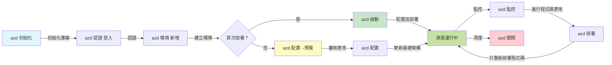
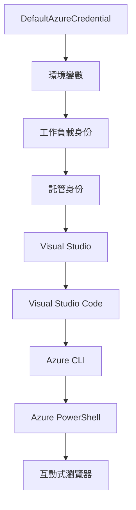

# AZD 基礎 - 認識 Azure Developer CLI

# AZD 基礎 - 核心概念與基本原理

**章節導航：**
- **📚 課程首頁**：[AZD 入門](../../README.md)
- **📖 目前章節**：第 1 章 - 基礎與快速開始
- **⬅️ 上一章**：[課程總覽](../../README.md#-chapter-1-foundation--quick-start)
- **➡️ 下一章**：[安裝與設定](installation.md)
- **🚀 下一章節**：[第 2 章：AI 為先的開發](../chapter-02-ai-development/microsoft-foundry-integration.md)

## 簡介

本課程將介紹 Azure Developer CLI（azd），這是一款強大的命令列工具，可加速您從本地開發到 Azure 部署的旅程。您將學習基礎概念、核心功能，並瞭解 azd 如何簡化雲端原生應用程式的部署。

## 學習目標

完成本課程後，您將能夠：
- 理解 Azure Developer CLI 是什麼及其主要目的
- 瞭解模板、環境和服務的核心概念
- 探索包含模板驅動開發與基礎架構即程式碼的關鍵功能
- 理解 azd 專案結構與工作流程
- 準備安裝和配置 azd 以符合您的開發環境需求

## 學習成果

完成本課程後，您將能夠：
- 解釋 azd 在現代雲端開發工作流程中的角色
- 確認 azd 專案結構中的組件
- 描述模板、環境和服務如何協同運作
- 理解使用 azd 進行基礎架構即程式碼的優點
- 辨識不同的 azd 指令及其用途

## 什麼是 Azure Developer CLI (azd)？

Azure Developer CLI（azd）是一款命令列工具，旨在加快您從本地開發到 Azure 部署的速度。它簡化了在 Azure 上構建、部署及管理雲端原生應用程式的流程。

### azd 可以部署什麼？

azd 支援多種工作負載，且支援範圍持續擴張。現時，您可以使用 azd 部署：

| 工作負載類型 | 範例 | 同一工作流程？ |
|---------------|----------|----------------|
| <strong>傳統應用程式</strong> | 網頁應用程式、REST API、靜態網站 | ✅ `azd up` |
| <strong>服務及微服務</strong> | 容器應用、函式應用、多服務後端 | ✅ `azd up` |
| **AI 驅動的應用程式** | 使用 Microsoft Foundry 模型的聊天應用、結合 AI 搜尋的 RAG 解決方案 | ✅ `azd up` |
| <strong>智慧代理</strong> | Foundry 託管代理、多代理協調 | ✅ `azd up` |

關鍵在於 **azd 的整個生命週期無論您部署什麼都保持相同**。您初始化專案、配置基礎架構、部署程式碼、監控應用，最後清理資源——無論是簡單網站還是複雜 AI 代理，都遵循相同流程。

這種連續性是設計使然。azd 將 AI 能力視為應用程式可利用的另一種服務，而非根本不同的東西。對 azd 來說，由 Microsoft Foundry 模型支持的聊天端點，就是另一項需要配置和部署的服務。

### 🎯 為什麼使用 AZD？真實案例比較

我們比較部署簡單網頁應用及資料庫：

#### ❌ 無 AZD：手動 Azure 部署（30 分鐘以上）

```bash
# 第一步：建立資源組
az group create --name myapp-rg --location eastus

# 第二步：建立應用服務計劃
az appservice plan create --name myapp-plan \
  --resource-group myapp-rg \
  --sku B1 --is-linux

# 第三步：建立網頁應用程式
az webapp create --name myapp-web-unique123 \
  --resource-group myapp-rg \
  --plan myapp-plan \
  --runtime "NODE:18-lts"

# 第四步：建立 Cosmos DB 帳戶（10-15 分鐘）
az cosmosdb create --name myapp-cosmos-unique123 \
  --resource-group myapp-rg \
  --kind MongoDB

# 第五步：建立資料庫
az cosmosdb mongodb database create \
  --account-name myapp-cosmos-unique123 \
  --resource-group myapp-rg \
  --name tododb

# 第六步：建立集合
az cosmosdb mongodb collection create \
  --account-name myapp-cosmos-unique123 \
  --resource-group myapp-rg \
  --database-name tododb \
  --name todos

# 第七步：取得連線字串
CONN_STR=$(az cosmosdb keys list \
  --name myapp-cosmos-unique123 \
  --resource-group myapp-rg \
  --type connection-strings \
  --query "connectionStrings[0].connectionString" -o tsv)

# 第八步：設定應用程式設定
az webapp config appsettings set \
  --name myapp-web-unique123 \
  --resource-group myapp-rg \
  --settings MONGODB_URI="$CONN_STR"

# 第九步：啟用記錄功能
az webapp log config --name myapp-web-unique123 \
  --resource-group myapp-rg \
  --application-logging filesystem \
  --detailed-error-messages true

# 第十步：設定應用程式洞察
az monitor app-insights component create \
  --app myapp-insights \
  --location eastus \
  --resource-group myapp-rg

# 第十一步：將應用程式洞察連結至網頁應用程式
INSTRUMENTATION_KEY=$(az monitor app-insights component show \
  --app myapp-insights \
  --resource-group myapp-rg \
  --query "instrumentationKey" -o tsv)

az webapp config appsettings set \
  --name myapp-web-unique123 \
  --resource-group myapp-rg \
  --settings APPINSIGHTS_INSTRUMENTATIONKEY="$INSTRUMENTATION_KEY"

# 第十二步：本地建置應用程式
npm install
npm run build

# 第十三步：建立部署套件
zip -r app.zip . -x "*.git*" "node_modules/*"

# 第十四步：部署應用程式
az webapp deployment source config-zip \
  --resource-group myapp-rg \
  --name myapp-web-unique123 \
  --src app.zip

# 第十五步：等待並祈禱成功 🙏
# （無自動驗證，需手動測試）
```

**問題：**
- ❌ 需記憶並按序執行 15 個以上指令
- ❌ 30-45 分鐘人工操作
- ❌ 易出錯（打錯字、參數錯誤）
- ❌ 連接字串暴露在終端機歷史裡
- ❌ 發生錯誤無自動回滾
- ❌ 不易供團隊複製執行
- ❌ 每次操作皆不同（不可重現）

#### ✅ 有 AZD：自動化部署（5 個命令，10-15 分鐘）

```bash
# 第一步：從範本初始化
azd init --template todo-nodejs-mongo

# 第二步：身份驗證
azd auth login

# 第三步：建立環境
azd env new dev

# 第四步：預覽更改（可選但建議）
azd provision --preview

# 第五步：部署所有內容
azd up

# ✨ 完成！所有內容已部署、配置及監控
```

**優點：**
- ✅ 5 個命令 完全取代 15+ 手動步驟
- ✅ 10-15 分鐘 完成部署（多為等待 Azure 回應）
- ✅ 零錯誤 —— 全自動且經測試
- ✅ 機密安全管理 透過 Key Vault
- ✅ 發生錯誤自動回滾
- ✅ 完全可重現 每次部署結果相同
- ✅ 適用團隊 任何人皆可執行相同命令
- ✅ 基礎架構即程式碼 版本控制中的 Bicep 模板
- ✅ 內建監控 自動設定 Application Insights

### 📊 時間與錯誤率減少

| 指標 | 手動部署 | AZD 部署 | 改善幅度 |
|:-------|:------------------|:---------------|:------------|
| <strong>命令數量</strong> | 15+ | 5 | 少 67% |
| <strong>時間</strong> | 30-45 分鐘 | 10-15 分鐘 | 快 60% |
| <strong>錯誤率</strong> | 約 40% | <5% | 降低 88% |
| <strong>一致性</strong> | 低（手動） | 100%（自動化） | 完美 |
| <strong>團隊上手</strong> | 2-4 小時 | 30 分鐘 | 快 75% |
| <strong>回滾時間</strong> | 30+ 分鐘（手動） | 2 分鐘（自動） | 快 93% |

## 核心概念

### 模板
模板是 azd 的基礎。它們包含：
- <strong>應用程式程式碼</strong> — 您的原始碼與依賴項
- <strong>基礎架構定義</strong> — 以 Bicep 或 Terraform 定義的 Azure 資源
- <strong>配置檔</strong> — 設定與環境變數
- <strong>部署腳本</strong> — 自動化部署工作流程

### 環境
環境代表不同的部署目標：
- <strong>開發</strong> — 用於測試與開發
- <strong>預備</strong> — 前置生產環境
- <strong>生產</strong> — 實際上線環境

每個環境維護其自身的：
- Azure 資源群組
- 配置設定
- 部署狀態

### 服務
服務是構成應用程式的基本單元：
- <strong>前端</strong> — 網頁應用程式、單頁應用（SPA）
- <strong>後端</strong> — API、微服務
- <strong>資料庫</strong> — 資料存放方案
- <strong>儲存</strong> — 檔案及 Blob 儲存

## 主要功能

### 1. 模板驅動開發
```bash
# 瀏覽可用模板
azd template list

# 從模板初始化
azd init --template <template-name>
```

### 2. 基礎架構即程式碼
- **Bicep** — Azure 專用領域語言
- **Terraform** — 多雲基礎架構工具
- **ARM 模板** — Azure Resource Manager 模板

### 3. 整合工作流程
```bash
# 完整部署工作流程
azd up            # 配置 + 部署，首次設置無需手動操作

# 🧪 新增功能：部署前預覽基礎設施變更（安全）
azd provision --preview    # 模擬基礎設施部署而不進行更改

azd provision     # 如果更新基礎設施，使用此功能建立 Azure 資源
azd deploy        # 部署應用程式代碼或在更新後重新部署應用程式代碼
azd down          # 清理資源
```

#### 🛡️ 安全的基礎架構規劃預覽
`azd provision --preview` 指令是安全部署的關鍵：
- <strong>試運行分析</strong> — 顯示將會新增、修改或刪除的項目
- <strong>零風險</strong> — 不會對 Azure 環境實際產生變更
- <strong>團隊協作</strong> — 可在部署前分享預覽結果
- <strong>成本估算</strong> — 事先了解資源花費

```bash
# 範例預覽工作流程
azd provision --preview           # 查看會有什麼變更
# 審查輸出結果，與團隊討論
azd provision                     # 自信地套用變更
```

### 📊 視覺化：AZD 開發工作流程


**工作流程說明：**
1. <strong>初始化</strong> — 從模板或新專案開始
2. <strong>登入</strong> — 認證 Azure 帳戶
3. <strong>環境建立</strong> — 創建隔離部署環境
4. <strong>預覽</strong> — 🆕 始終先預覽基礎架構更改（安全良好習慣）
5. <strong>建置</strong> — 建立或更新 Azure 資源
6. <strong>部署</strong> — 推送應用程式程式碼
7. <strong>監控</strong> — 觀察應用效能
8. <strong>迭代</strong> — 修改並重新部署程式碼
9. <strong>清理</strong> — 工作完成後移除資源

### 4. 環境管理
```bash
# 建立及管理環境
azd env new <environment-name>
azd env select <environment-name>
azd env list
```

### 5. 擴充及 AI 指令

azd 使用擴充系統，為核心 CLI 增添功能，對 AI 工作負載尤為關鍵：

```bash
# 列出可用的擴充功能
azd extension list

# 安裝 Foundry agents 擴充功能
azd extension install azure.ai.agents

# 從清單初始化 AI 代理項目
azd ai agent init -m agent-manifest.yaml

# 啟動用於 AI 輔助開發的 MCP 伺服器（Alpha）
azd mcp start
```

> 擴充功能詳見 [第 2 章：AI 為先的開發](../chapter-02-ai-development/agents.md) 及 [AZD AI CLI 指令](../chapter-08-production/production-ai-practices.md#azd-ai-cli-commands-and-extensions) 參考。

## 📁 專案結構

典型 azd 專案結構：
```
my-app/
├── .azd/                    # azd configuration
│   └── config.json
├── .azure/                  # Azure deployment artifacts
├── .devcontainer/          # Development container config
├── .github/workflows/      # GitHub Actions
├── .vscode/               # VS Code settings
├── infra/                 # Infrastructure code
│   ├── main.bicep        # Main infrastructure template
│   ├── main.parameters.json
│   └── modules/          # Reusable modules
├── src/                  # Application source code
│   ├── api/             # Backend services
│   └── web/             # Frontend application
├── azure.yaml           # azd project configuration
└── README.md
```

## 🔧 配置檔案

### azure.yaml
主要專案配置檔：
```yaml
name: my-awesome-app
metadata:
  template: my-template@1.0.0

services:
  web:
    project: ./src/web
    language: js
    host: appservice
  api:
    project: ./src/api
    language: js
    host: appservice

hooks:
  preprovision:
    shell: pwsh
    run: echo "Preparing to provision..."
```

### .azure/config.json
環境專屬配置：
```json
{
  "version": 1,
  "defaultEnvironment": "dev",
  "environments": {
    "dev": {
      "subscriptionId": "your-subscription-id",
      "location": "eastus"
    }
  }
}
```

## 🎪 常見工作流程與實作練習

> **💡 學習提示：** 按照以下練習順序，逐步建立您的 AZD 技能。

### 🎯 練習 1：初始化第一個專案

**目標：** 建立 AZD 專案並探索其結構

**步驟：**
```bash
# 使用經過驗證的範本
azd init --template todo-nodejs-mongo

# 探索生成的文件
ls -la  # 查看所有文件包括隱藏的

# 建立的主要文件：
# - azure.yaml（主要配置）
# - infra/（基礎設施代碼）
# - src/（應用程序代碼）
```

**✅ 成功標誌：** 擁有 azure.yaml、infra/ 與 src/ 目錄

---

### 🎯 練習 2：部署到 Azure

**目標：** 完成端到端部署

**步驟：**
```bash
# 1. 驗證身份
az login && azd auth login

# 2. 建立環境
azd env new dev
azd env set AZURE_LOCATION eastus

# 3. 預覽更改（建議）
azd provision --preview

# 4. 部署所有內容
azd up

# 5. 驗證部署
azd show    # 檢視你的應用程式網址
```

**預期時間：** 10-15 分鐘  
**✅ 成功標誌：** 在瀏覽器中可開啟應用 URL

---

### 🎯 練習 3：多環境部署

**目標：** 部署到 dev 與 staging 環境

**步驟：**
```bash
# 已經有 dev，建立 staging
azd env new staging
azd env set AZURE_LOCATION westus2
azd up

# 在它們之間切換
azd env list
azd env select dev
```

**✅ 成功標誌：** 在 Azure 入口網站中看到兩個獨立資源群組

---

### 🛡️ 徹底清理：`azd down --force --purge`

需要完全重置時：

```bash
azd down --force --purge
```

**作用：**
- `--force`：無需確認提示
- `--purge`：刪除所有本地狀態與 Azure 資源

**使用時機：**
- 部署中途失敗
- 切換專案
- 需要全新開始

---

## 🎪 原始工作流程參考

### 新專案起步
```bash
# 方法 1：使用現有範本
azd init --template todo-nodejs-mongo

# 方法 2：從頭開始
azd init

# 方法 3：使用當前目錄
azd init .
```

### 開發週期
```bash
# 設置開發環境
azd auth login
azd env new dev
azd env select dev

# 部署所有項目
azd up

# 進行更改並重新部署
azd deploy

# 完成後清理
azd down --force --purge # Azure Developer CLI 中的命令是環境的 **硬重置** —— 特別適用於排解部署失敗、清理孤立資源或準備全新重新部署時。
```

## 理解 `azd down --force --purge`
`azd down --force --purge` 是一個強力指令，用以完全拆除您的 azd 環境及所有相關資源。以下是各標誌的作用解析：
```
--force
```
- 跳過確認提示。
- 自動化或腳本場景非常適用，避免手動輸入。
- 即使 CLI 發現不一致狀況，也確保拆解不中斷。

```
--purge
```
刪除 <strong>所有相關元資料</strong>，包括：
環境狀態
本地 `.azure` 資料夾
快取部署資訊
防止 azd 記憶先前部署，避免因資源群組錯配或陳舊註冊表參考產生問題。

### 為什麼要同時使用兩個標誌？
當您在使用 `azd up` 時遇到因殘留狀態或部分部署導致問題，這組合確保您得到一個 <strong>乾淨的環境</strong>。

這在您手動刪除 Azure 入口網站上的資源，或切換模板、環境或資源群組命名規則時，尤其有幫助。

### 多環境管理
```bash
# 建立預備環境
azd env new staging
azd env select staging
azd up

# 切返開發環境
azd env select dev

# 比較環境
azd env list
```

## 🔐 身份驗證與憑證

理解身份驗證對成功部署 azd 至關重要。Azure 使用多種方式驗證身分，且 azd 利用與其他 Azure 工具相同的憑證鏈。

### Azure CLI 身份驗證（`az login`）

使用 azd 之前，您需要先登入 Azure。最常見方式是使用 Azure CLI：

```bash
# 互動式登入（打開瀏覽器）
az login

# 使用特定租戶登入
az login --tenant <tenant-id>

# 使用服務主體登入
az login --service-principal -u <app-id> -p <password> --tenant <tenant-id>

# 檢查當前登入狀態
az account show

# 列出可用訂閱
az account list --output table

# 設定預設訂閱
az account set --subscription <subscription-id>
```

### 身份驗證流程
1. <strong>互動式登入</strong>：開啟預設瀏覽器進行驗證
2. <strong>裝置碼流程</strong>：無瀏覽器環境下使用
3. <strong>服務主體</strong>：適用於自動化與 CI/CD 場景
4. <strong>託管身分</strong>：適用於 Azure 託管的應用程式

### DefaultAzureCredential 憑證鏈

`DefaultAzureCredential` 是一種憑證類型，通過自動嘗試多種憑證來源以簡化身份驗證流程，嘗試順序固定：

#### 憑證鏈順序

#### 1. 環境變數
```bash
# 設定服務主體的環境變數
export AZURE_CLIENT_ID="<app-id>"
export AZURE_CLIENT_SECRET="<password>"
export AZURE_TENANT_ID="<tenant-id>"
```

#### 2. 工作負載身分（Kubernetes/GitHub Actions）
自動使用於：
- 搭配工作負載身分的 Azure Kubernetes Service（AKS）
- 使用 OIDC 授權的 GitHub Actions
- 其他聯合身份場景

#### 3. 託管身分
適用於 Azure 資源，如：
- 虛擬機器
- 應用服務
- Azure 函式
- 容器實例

```bash
# 檢查是否在具有託管身份的 Azure 資源上運行
az account show --query "user.type" --output tsv
# 返回: 如果使用託管身份則為 "servicePrincipal"
```

#### 4. 開發工具整合
- **Visual Studio**：自動使用登入帳號
- **VS Code**：使用 Azure Account 擴充的憑證
- **Azure CLI**：使用 `az login` 的認證（本地開發最常用）

### AZD 身份驗證設定

```bash
# 方法1：使用 Azure CLI（建議用於開發）
az login
azd auth login  # 使用現有的 Azure CLI 認證

# 方法2：直接 azd 認證
azd auth login --use-device-code  # 適用於無頭環境

# 方法3：檢查認證狀態
azd auth login --check-status

# 方法4：登出並重新認證
azd auth logout
azd auth login
```

### 身份驗證最佳實踐

#### 本地開發
```bash
# 1. 使用 Azure CLI 登入
az login

# 2. 驗證正確的訂閱
az account show
az account set --subscription "Your Subscription Name"

# 3. 使用現有的憑證執行 azd
azd auth login
```

#### CI/CD 管線
```yaml
# GitHub Actions example
- name: Azure Login
  uses: azure/login@v1
  with:
    creds: ${{ secrets.AZURE_CREDENTIALS }}

- name: Deploy with azd
  run: |
    azd auth login --client-id ${{ secrets.AZURE_CLIENT_ID }} \
                    --client-secret ${{ secrets.AZURE_CLIENT_SECRET }} \
                    --tenant-id ${{ secrets.AZURE_TENANT_ID }}
    azd up --no-prompt
```

#### 生產環境
- 執行於 Azure 資源時使用 <strong>託管身分</strong>
- 自動化場景使用 <strong>服務主體</strong>
- 避免憑證存放於程式碼或配置檔案中
- 使用 **Azure Key Vault** 保護敏感配置

### 常見身份驗證問題及解決方案

#### 問題：“找不到訂閱”
```bash
# 解決方案：設置預設訂閱
az account list --output table
az account set --subscription "<subscription-id>"
azd env set AZURE_SUBSCRIPTION_ID "<subscription-id>"
```

#### 問題：“權限不足”
```bash
# 解決方案：檢查並指派所需角色
az role assignment list --assignee $(az account show --query user.name --output tsv)

# 常見所需角色：
# - 貢獻者（用於資源管理）
# - 用戶存取管理員（用於角色指派）
```

#### 問題：“權杖過期”
```bash
# 解決方法：重新驗證身份
az logout
az login
azd auth logout
azd auth login
```

### 不同場景下的身份驗證

#### 本地開發
```bash
# 個人發展賬戶
az login
azd auth login
```

#### 團隊開發
```bash
# 使用指定租戶作為組織
az login --tenant contoso.onmicrosoft.com
azd auth login
```

#### 多租戶場景
```bash
# 於租戶之間切換
az login --tenant tenant1.onmicrosoft.com
# 部署至租戶 1
azd up

az login --tenant tenant2.onmicrosoft.com  
# 部署至租戶 2
azd up
```

### 安全性考量
1. <strong>憑證儲存</strong>：切勿將憑證存放於原始碼中  
2. <strong>範圍限制</strong>：對服務主體使用最小權限原則  
3. <strong>權杖輪換</strong>：定期輪換服務主體的密鑰  
4. <strong>稽核軌跡</strong>：監控驗證及部署活動  
5. <strong>網路安全</strong>：盡可能使用私人端點  

### 問題排解認證

```bash
# 除錯身份驗證問題
azd auth login --check-status
az account show
az account get-access-token

# 常用診斷指令
whoami                          # 目前使用者環境
az ad signed-in-user show      # Azure AD 使用者詳情
az group list                  # 測試資源存取
```
  
## 了解 `azd down --force --purge`

### 探索  
```bash
azd template list              # 瀏覽範本
azd template show <template>   # 範本詳情
azd init --help               # 初始化選項
```
  
### 專案管理  
```bash
azd show                     # 專案概覽
azd env show                 # 當前環境
azd config list             # 配置設定
```
  
### 監控  
```bash
azd monitor                  # 開啟 Azure 入口網站監控
azd monitor --logs           # 查看應用程式日誌
azd monitor --live           # 查看即時指標
azd pipeline config          # 設定 CI/CD
```
  
## 最佳實踐

### 1. 使用具意義的名稱  
```bash
# 好
azd env new production-east
azd init --template web-app-secure

# 避免
azd env new env1
azd init --template template1
```
  
### 2. 利用範本  
- 從現有範本開始  
- 為您的需求進行客製化  
- 為您的組織建立可重用範本  

### 3. 環境隔離  
- 分別使用開發/測試/生產環境  
- 切勿直接從本機部署至生產環境  
- 使用 CI/CD 管線進行生產部署  

### 4. 設定管理  
- 使用環境變數存放敏感資料  
- 將設定保存在版本控制中  
- 記錄環境特定設定  

## 學習進度

### 初學者（第1-2週）  
1. 安裝 azd 並進行認證  
2. 部署簡單範本  
3. 了解專案結構  
4. 學習基本指令（up、down、deploy）  

### 中階（第3-4週）  
1. 客製化範本  
2. 管理多個環境  
3. 理解基礎架構程式碼  
4. 設置 CI/CD 管線  

### 進階（第5週以上）  
1. 建立自訂範本  
2. 進階基礎架構模式  
3. 多區域部署  
4. 企業級設定  

## 後續步驟

**📖 繼續第一章學習：**  
- [安裝與設定](installation.md) - 安裝並配置 azd  
- [您的第一個專案](first-project.md) - 完成實作教學  
- [設定指南](configuration.md) - 進階設定選項  

**🎯 準備好進入下一章？**  
- [第二章：AI 首要開發](../chapter-02-ai-development/microsoft-foundry-integration.md) - 開始建立 AI 應用  

## 其他資源

- [Azure Developer CLI 概覽](https://learn.microsoft.com/en-us/azure/developer/azure-developer-cli/)  
- [範本庫](https://azure.github.io/awesome-azd/)  
- [社群範例](https://github.com/Azure-Samples)  

---

## 🙋 常見問題

### 一般問題

**Q: AZD 與 Azure CLI 有什麼不同？**  

A: Azure CLI (`az`) 用於管理單一 Azure 資源。AZD (`azd`) 用於管理整個應用程式：

```bash
# Azure CLI - 低階資源管理
az webapp create --name myapp --resource-group rg
az sql server create --name myserver --resource-group rg
# ...需要更多指令

# AZD - 應用程式層級管理
azd up  # 部署包含所有資源的整個應用程式
```
  
**這樣想：**  
- `az` = 操作單一樂高積木  
- `azd` = 操作完整樂高套組  

---

**Q: 使用 AZD 需要懂 Bicep 或 Terraform 嗎？**  

A: 不需要！從範本開始：  
```bash
# 使用現有範本 - 無需 IaC 知識
azd init --template todo-nodejs-mongo
azd up
```
  
您可以稍後學習 Bicep 來自訂基礎架構。範本提供可學習的工作範例。  

---

**Q: 執行 AZD 範本成本如何？**  

A: 成本依範本而異。大部分開發範本約每月 50-150 美元：  

```bash
# 部署前預覽成本
azd provision --preview

# 不使用時必須清理
azd down --force --purge  # 刪除所有資源
```
  
**專業提示：** 盡量使用免費層級：  
- App Service：F1（免費）層級  
- Microsoft Foundry 模型：Azure OpenAI 每月免費 50,000 代幣  
- Cosmos DB：1000 RU/s 免費層級  

---

**Q: 可以將 AZD 與現有 Azure 資源一起使用嗎？**  

A: 可以，但建議從頭開始較容易。AZD 在管理完整生命週期時最有效。針對現有資源：  

```bash
# 選項 1：匯入現有資源（進階）
azd init
# 然後修改 infra/ 以引用現有資源

# 選項 2：從頭開始（建議）
azd init --template matching-your-stack
azd up  # 建立新環境
```
  
---

**Q: 如何與隊友共享我的專案？**  

A: 將 AZD 專案推送至 Git（但不要包含 .azure 資料夾）：  

```bash
# 已預設包含於 .gitignore 中
.azure/        # 包含機密和環境數據
*.env          # 環境變數

# 之後的團隊成員：
git clone <your-repo>
azd auth login
azd env new <their-name>-dev
azd up
```
  
所有人皆從相同範本獲得一致的基礎架構。  

---

### 問題排解

**Q: “azd up” 執行到一半失敗了，怎麼辦？**  

A: 檢查錯誤、修正後再重試：  

```bash
# 查看詳細日誌
azd show

# 常見修復：

# 1. 如果配額超出：
azd env set AZURE_LOCATION "westus2"  # 嘗試不同區域

# 2. 如果資源名稱衝突：
azd down --force --purge  # 重設
azd up  # 重試

# 3. 如果認證過期：
az login
azd auth login
azd up
```
  
**最常見問題：** 選錯 Azure 訂閱  
```bash
az account list --output table
az account set --subscription "<correct-subscription>"
```
  
---

**Q: 如何僅部署程式碼變更，不重新佈建？**  

A: 使用 `azd deploy` 代替 `azd up`：  

```bash
azd up          # 第一次：配置 + 部署（慢）

# 進行代碼更改...

azd deploy      # 之後：只部署（快）
```
  
速度比較：  
- `azd up`：10-15 分鐘（佈建基礎架構）  
- `azd deploy`：2-5 分鐘（僅程式碼）  

---

**Q: 可以自訂基礎架構範本嗎？**  

A: 可以！編輯 `infra/` 中的 Bicep 檔案：  

```bash
# 在 azd init 之後
cd infra/
code main.bicep  # 在 VS Code 中編輯

# 預覽更改
azd provision --preview

# 套用更改
azd provision
```
  
**提示：** 從小處開始，先改 SKU：  
```bicep
// infra/main.bicep
sku: {
  name: 'B1'  // Change to 'P1V2' for production
}
```
  
---

**Q: 如何刪除 AZD 建立的所有資源？**  

A: 一行指令即可刪除所有資源：  

```bash
azd down --force --purge

# 此操作會刪除：
# - 所有 Azure 資源
# - 資源群組
# - 本地環境狀態
# - 快取的部署資料
```
  
**每當以下情況必須執行：**  
- 測試範本結束後  
- 換用別的專案  
- 想重新開始  

**省錢技巧：** 刪除未用資源可避免費用產生  

---

**Q: 如果誤在 Azure Portal 刪除資源怎麼辦？**  

A: AZD 狀態可能不同步。建議走全新清理路線：  

```bash
# 1. 移除本地狀態
azd down --force --purge

# 2. 重新開始
azd up

# 替代方案：讓 AZD 檢測並修復
azd provision  # 將會建立缺失的資源
```
  
---

### 進階問題

**Q: 可以在 CI/CD 管線中使用 AZD 嗎？**  

A: 可以！GitHub Actions 範例如下：  

```yaml
# .github/workflows/deploy.yml
name: Deploy with AZD

on:
  push:
    branches: [main]

jobs:
  deploy:
    runs-on: ubuntu-latest
    steps:
      - uses: actions/checkout@v2
      
      - name: Install azd
        run: curl -fsSL https://aka.ms/install-azd.sh | bash
      
      - name: Azure Login
        run: |
          azd auth login \
            --client-id ${{ secrets.AZURE_CLIENT_ID }} \
            --client-secret ${{ secrets.AZURE_CLIENT_SECRET }} \
            --tenant-id ${{ secrets.AZURE_TENANT_ID }}
      
      - name: Deploy
        run: azd up --no-prompt
```
  
---

**Q: 如何處理祕密與敏感資料？**  

A: AZD 會自動整合 Azure Key Vault：  

```bash
# 密碼儲存在金鑰保管庫，不會寫入代碼中
azd env set DATABASE_PASSWORD "$(openssl rand -base64 32)"

# AZD 自動執行：
# 1. 建立金鑰保管庫
# 2. 儲存密碼
# 3. 透過託管身份授予應用程式存取權限
# 4. 在執行時注入
```
  
**切勿提交：**  
- `.azure/` 資料夾（含環境資料）  
- `.env` 檔案（本地祕密）  
- 連接字串  

---

**Q: 可以部署至多區域嗎？**  

A: 可以，為每個區域建立環境：  

```bash
# 美國東部環境
azd env new prod-eastus
azd env set AZURE_LOCATION eastus
azd up

# 西歐環境
azd env new prod-westeurope
azd env set AZURE_LOCATION westeurope
azd up

# 每個環境都是獨立的
azd env list
```
  
真正的多區域應用，需自訂 Bicep 範本同時部署至多區域。  

---

**Q: 遇到困難在哪裡可以求助？**  

1. **AZD 文件：** https://learn.microsoft.com/azure/developer/azure-developer-cli/  
2. **GitHub 問題回報：** https://github.com/Azure/azure-dev/issues  
3. **Discord：** [Azure Discord](https://discord.gg/microsoft-azure) - #azure-developer-cli 頻道  
4. **Stack Overflow：** 標籤 `azure-developer-cli`  
5. **本課程：** [問題排解指南](../chapter-07-troubleshooting/common-issues.md)  

**專業提示：** 請先執行：  
```bash
azd show       # 顯示當前狀態
azd version    # 顯示您的版本
```
  
在提問時附上這些資訊，提高回應速度。  

---

## 🎓 下一步？

您已經理解 AZD 基礎，請選擇適合的路徑：

### 🎯 初學者：  
1. **下一步：** [安裝與設定](installation.md) - 在電腦上安裝 AZD  
2. **接著：** [您的第一個專案](first-project.md) - 部署您的第一個應用  
3. **練習：** 完成本課所有 3 個練習  

### 🚀 AI 開發者：  
1. **跳到：** [第二章：AI 首要開發](../chapter-02-ai-development/microsoft-foundry-integration.md)  
2. **部署：** 使用 `azd init --template get-started-with-ai-chat` 開始  
3. **學習：** 部署的同時構建  

### 🏗️ 有經驗開發者：  
1. **複習：** [設定指南](configuration.md) - 進階設定內容  
2. **探索：** [基礎架構即程式碼](../chapter-04-infrastructure/provisioning.md) - 深入 Bicep  
3. **構建：** 為您的堆疊建立自訂範本  

---

**章節導覽：**  
- **📚 課程首頁**: [AZD 初學者](../../README.md)  
- **📖 目前章節**: 第一章 - 基礎與快速啟動  
- **⬅️ 上一章**: [課程概覽](../../README.md#-chapter-1-foundation--quick-start)  
- **➡️ 下一章**: [安裝與設定](installation.md)  
- **🚀 下一章節**: [第二章：AI 首要開發](../chapter-02-ai-development/microsoft-foundry-integration.md)

---

<!-- CO-OP TRANSLATOR DISCLAIMER START -->
**免責聲明**：  
本文件由 AI 翻譯服務 [Co-op Translator](https://github.com/Azure/co-op-translator) 翻譯。雖然我們致力於準確，但請注意自動翻譯可能包含錯誤或不準確之處。原始文件的母語版本應被視為權威來源。對於重要資訊，建議使用專業人工翻譯。本公司不對因使用此翻譯而產生的任何誤解或誤譯承擔責任。
<!-- CO-OP TRANSLATOR DISCLAIMER END -->