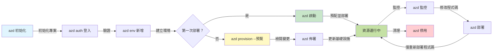
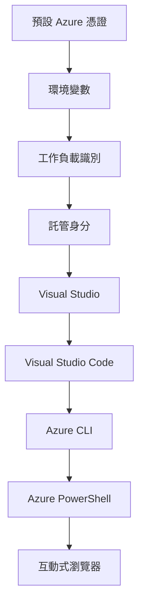

# AZD 基礎 - 認識 Azure Developer CLI

# AZD 基礎 - 核心概念與基本原理

**章節導覽：**
- **📚 課程主頁**: [AZD For Beginners](../../README.md)
- **📖 本章**: 第 1 章 - 基礎與快速開始
- **⬅️ 上一節**: [課程概覽](../../README.md#-chapter-1-foundation--quick-start)
- **➡️ 下一節**: [安裝與設定](installation.md)
- **🚀 下一章**: [第 2 章：AI 為先的開發](../chapter-02-ai-development/microsoft-foundry-integration.md)

## 介紹

本課程介紹 Azure Developer CLI (azd)，這是一個強大的命令列工具，可加速你從本地開發到 Azure 部署的旅程。你將學習基本概念、核心功能，以及了解 azd 如何簡化雲端原生應用程式的部署。

## 學習目標

在本課程結束時，你將能夠：
- 了解 Azure Developer CLI 是什麼及其主要用途
- 學習 templates、environments 和 services 的核心概念
- 探索包含模板驅動開發與基礎設施即程式碼的主要功能
- 理解 azd 專案結構與工作流程
- 準備好在你的開發環境中安裝與設定 azd

## 學習成果

完成本課程後，你將能夠：
- 解釋 azd 在現代雲端開發工作流程中的角色
- 辨識 azd 專案結構的組成部分
- 描述 templates、environments 和 services 如何協同運作
- 了解使用 azd 的基礎設施即程式碼帶來的好處
- 辨識不同的 azd 命令及其用途

## 什麼是 Azure Developer CLI (azd)?

Azure Developer CLI (azd) 是一個命令列工具，設計用來加速你從本地開發到 Azure 部署的過程。它簡化了在 Azure 上構建、部署與管理雲端原生應用程式的流程。

### 使用 azd 可以部署什麼？

azd 支援各種工作負載，且範圍持續擴大。今天，你可以使用 azd 部署：

| Workload Type | Examples | Same Workflow? |
|---------------|----------|----------------|
| **Traditional applications** | Web apps, REST APIs, static sites | ✅ `azd up` |
| **Services and microservices** | Container Apps, Function Apps, multi-service backends | ✅ `azd up` |
| **AI-powered applications** | Chat apps with Microsoft Foundry Models, RAG solutions with AI Search | ✅ `azd up` |
| **Intelligent agents** | Foundry-hosted agents, multi-agent orchestrations | ✅ `azd up` |

關鍵在於，**無論你部署的是什麼，azd 的生命週期保持一致**。你會初始化專案、佈署基礎設施、部署程式碼、監控應用程式，並在結束時清理資源——不論是簡單的網站或複雜的 AI agent。

這種連續性是設計使然。azd 將 AI 能力視為應用程式可以使用的另一種服務，而非根本不同的東西。對 azd 來說，由 Microsoft Foundry Models 支援的聊天端點只是另一個要配置與部署的服務。

### 🎯 為什麼使用 AZD？一個實務比較

讓我們比較部署一個帶資料庫的簡單 Web 應用：

#### ❌ 未使用 AZD：手動 Azure 部署（超過 30 分鐘）

```bash
# 步驟 1：建立資源群組
az group create --name myapp-rg --location eastus

# 步驟 2：建立 App Service 計劃
az appservice plan create --name myapp-plan \
  --resource-group myapp-rg \
  --sku B1 --is-linux

# 步驟 3：建立 Web 應用程式
az webapp create --name myapp-web-unique123 \
  --resource-group myapp-rg \
  --plan myapp-plan \
  --runtime "NODE:18-lts"

# 步驟 4：建立 Cosmos DB 帳戶（10-15 分鐘）
az cosmosdb create --name myapp-cosmos-unique123 \
  --resource-group myapp-rg \
  --kind MongoDB

# 步驟 5：建立資料庫
az cosmosdb mongodb database create \
  --account-name myapp-cosmos-unique123 \
  --resource-group myapp-rg \
  --name tododb

# 步驟 6：建立集合
az cosmosdb mongodb collection create \
  --account-name myapp-cosmos-unique123 \
  --resource-group myapp-rg \
  --database-name tododb \
  --name todos

# 步驟 7：取得連線字串
CONN_STR=$(az cosmosdb keys list \
  --name myapp-cosmos-unique123 \
  --resource-group myapp-rg \
  --type connection-strings \
  --query "connectionStrings[0].connectionString" -o tsv)

# 步驟 8：設定應用程式設定
az webapp config appsettings set \
  --name myapp-web-unique123 \
  --resource-group myapp-rg \
  --settings MONGODB_URI="$CONN_STR"

# 步驟 9：啟用記錄
az webapp log config --name myapp-web-unique123 \
  --resource-group myapp-rg \
  --application-logging filesystem \
  --detailed-error-messages true

# 步驟 10：設定 Application Insights
az monitor app-insights component create \
  --app myapp-insights \
  --location eastus \
  --resource-group myapp-rg

# 步驟 11：將 Application Insights 連接到 Web 應用程式
INSTRUMENTATION_KEY=$(az monitor app-insights component show \
  --app myapp-insights \
  --resource-group myapp-rg \
  --query "instrumentationKey" -o tsv)

az webapp config appsettings set \
  --name myapp-web-unique123 \
  --resource-group myapp-rg \
  --settings APPINSIGHTS_INSTRUMENTATIONKEY="$INSTRUMENTATION_KEY"

# 步驟 12：在本機建置應用程式
npm install
npm run build

# 步驟 13：建立部署套件
zip -r app.zip . -x "*.git*" "node_modules/*"

# 步驟 14：部署應用程式
az webapp deployment source config-zip \
  --resource-group myapp-rg \
  --name myapp-web-unique123 \
  --src app.zip

# 步驟 15：等候並祈禱它能運作 🙏
# （沒有自動化驗證，需要手動測試）
```

**問題：**
- ❌ 需要記住並按順序執行 15+ 個指令
- ❌ 30-45 分鐘的手動作業
- ❌ 容易出錯（拼寫錯誤、參數錯誤）
- ❌ 連線字串會出現在終端機歷史中
- ❌ 若發生錯誤沒有自動回滾
- ❌ 團隊成員難以重現
- ❌ 每次都不同（不可重複）

#### ✅ 使用 AZD：自動化部署（5 個命令，10-15 分鐘）

```bash
# 步驟 1：從範本初始化
azd init --template todo-nodejs-mongo

# 步驟 2：驗證身份
azd auth login

# 步驟 3：建立環境
azd env new dev

# 步驟 4：預覽變更（可選，但建議）
azd provision --preview

# 步驟 5：部署所有內容
azd up

# ✨ 完成！所有項目已部署、已配置並受監控
```

**好處：**
- ✅ **5 個命令** 對比 15+ 個手動步驟
- ✅ **10-15 分鐘** 總時間（大多數時間在等待 Azure）
- ✅ <strong>手動錯誤較少</strong> - 一致的模板驅動工作流程
- ✅ <strong>安全的祕密管理</strong> - 許多模板使用 Azure 管理的祕密儲存
- ✅ <strong>可重複的部署</strong> - 每次採用相同流程
- ✅ <strong>完全可重現</strong> - 每次得到相同結果
- ✅ <strong>團隊就緒</strong> - 任何人都能用相同指令部署
- ✅ <strong>基礎設施即程式碼</strong> - Bicep 模板受版本控制
- ✅ <strong>內建監控</strong> - 自動設定 Application Insights

### 📊 時間與錯誤減少

| Metric | Manual Deployment | AZD Deployment | Improvement |
|:-------|:------------------|:---------------|:------------|
| **Commands** | 15+ | 5 | 67% fewer |
| **Time** | 30-45 min | 10-15 min | 60% faster |
| **Error Rate** | ~40% | <5% | 88% reduction |
| **Consistency** | Low (manual) | 100% (automated) | Perfect |
| **Team Onboarding** | 2-4 hours | 30 minutes | 75% faster |
| **Rollback Time** | 30+ min (manual) | 2 min (automated) | 93% faster |

## 核心概念

### Templates
Templates 是 azd 的基礎。它們包含：
- **Application code** - 你的原始程式碼與相依套件
- **Infrastructure definitions** - 以 Bicep 或 Terraform 定義的 Azure 資源
- **Configuration files** - 設定與環境變數
- **Deployment scripts** - 自動化部署工作流程

### Environments
Environments 代表不同的部署目標：
- **Development** - 用於測試與開發
- **Staging** - 預生產環境
- **Production** - 線上生產環境

每個 environment 維護其自己的：
- Azure resource group
- 設定值
- 部署狀態

### Services
Services 是你的應用程式的構建模組：
- **Frontend** - 網頁應用、單頁應用（SPA）
- **Backend** - API、微服務
- **Database** - 資料儲存解決方案
- **Storage** - 檔案與 blob 儲存

## 主要功能

### 1. 模板驅動開發
```bash
# 瀏覽可用範本
azd template list

# 從範本初始化
azd init --template <template-name>
```

### 2. 基礎設施即程式碼
- **Bicep** - Azure 的領域專用語言
- **Terraform** - 多雲基礎設施工具
- **ARM Templates** - Azure Resource Manager 模板

### 3. 整合工作流程
```bash
# 完整部署工作流程
azd up            # 配置 + 部署：首次設定時可全自動（無需人工介入）

# 🧪 新功能：在部署前預覽基礎架構更改（安全）
azd provision --preview    # 模擬基礎架構部署而不作出更改

azd provision     # 如要更新基礎架構並建立 Azure 資源，請使用此項
azd deploy        # 部署應用程式程式碼，或在更新後重新部署
azd down          # 清理資源
```

#### 🛡️ 使用 Preview 安全規劃基礎設施
`azd provision --preview` 指令對於安全部署是個改變遊戲規則的功能：
- <strong>模擬執行分析</strong> - 顯示將會建立、修改或刪除的項目
- <strong>零風險</strong> - 不會對你的 Azure 環境做出實際更動
- <strong>團隊協作</strong> - 在部署前分享預覽結果
- <strong>成本估算</strong> - 在承諾前了解資源成本

```bash
# 示例預覽工作流程
azd provision --preview           # 查看將會更改的內容
# 檢視輸出，與團隊討論
azd provision                     # 放心套用更改
```

### 📊 視覺化：AZD 開發工作流程


**工作流程說明：**
1. **Init** - 從模板或新專案開始
2. **Auth** - 與 Azure 進行驗證
3. **Environment** - 建立隔離的部署環境
4. **Preview** - 🆕 始終先預覽基礎設施變更（安全做法）
5. **Provision** - 建立/更新 Azure 資源
6. **Deploy** - 推送你的應用程式程式碼
7. **Monitor** - 觀察應用程式效能
8. **Iterate** - 做出變更並重新部署程式碼
9. **Cleanup** - 完成後移除資源

### 4. 環境管理
```bash
# 建立及管理環境
azd env new <environment-name>
azd env select <environment-name>
azd env list
```

### 5. 擴充與 AI 指令

azd 使用擴充系統來新增核心 CLI 以外的功能。這對 AI 工作負載特別有用：

```bash
# 列出可用的擴充功能
azd extension list

# 安裝 Foundry agents 擴充功能
azd extension install azure.ai.agents

# 從 manifest 檔案初始化 AI 代理專案
azd ai agent init -m agent-manifest.yaml

# 啟動用於 AI 輔助開發的 MCP 伺服器 (Alpha)
azd mcp start
```

> 擴充內容於 [第 2 章：AI 為先的開發](../chapter-02-ai-development/agents.md) 與 [AZD AI CLI Commands](../chapter-08-production/production-ai-practices.md#azd-ai-cli-commands-and-extensions) 參考中有詳細說明。

## 📁 專案結構

典型的 azd 專案結構：
```
my-app/
├── .azd/                    # azd configuration
│   └── config.json
├── .azure/                  # Azure deployment artifacts
├── .devcontainer/          # Development container config
├── .github/workflows/      # GitHub Actions
├── .vscode/               # VS Code settings
├── infra/                 # Infrastructure code
│   ├── main.bicep        # Main infrastructure template
│   ├── main.parameters.json
│   └── modules/          # Reusable modules
├── src/                  # Application source code
│   ├── api/             # Backend services
│   └── web/             # Frontend application
├── azure.yaml           # azd project configuration
└── README.md
```

## 🔧 設定檔案

### azure.yaml
主要的專案設定檔：
```yaml
name: my-awesome-app
metadata:
  template: my-template@1.0.0

services:
  web:
    project: ./src/web
    language: js
    host: appservice
  api:
    project: ./src/api
    language: js
    host: appservice

hooks:
  preprovision:
    shell: pwsh
    run: echo "Preparing to provision..."
```

### .azure/config.json
環境特定的設定：
```json
{
  "version": 1,
  "defaultEnvironment": "dev",
  "environments": {
    "dev": {
      "subscriptionId": "your-subscription-id",
      "location": "eastus"
    }
  }
}
```

## 🎪 常見工作流程與實作練習

> **💡 學習小撇步：** 按順序完成這些練習，以循序漸進地建立你的 AZD 能力。

### 🎯 練習 1：初始化你的第一個專案

**目標：** 建立一個 AZD 專案並探索其結構

**步驟：**
```bash
# 使用經過驗證的範本
azd init --template todo-nodejs-mongo

# 瀏覽已產生的檔案
ls -la  # 檢視所有檔案（包括隱藏檔案）

# 已建立的主要檔案：
# - azure.yaml（主要設定）
# - infra/（基礎架構程式碼）
# - src/（應用程式的程式碼）
```

**✅ 成功標準：** 你擁有 azure.yaml、infra/ 與 src/ 目錄

---

### 🎯 練習 2：部署到 Azure

**目標：** 完成端對端部署

**步驟：**
```bash
# 1. 進行身份驗證
az login && azd auth login

# 2. 建立環境
azd env new dev
azd env set AZURE_LOCATION eastus

# 3. 預覽變更（建議）
azd provision --preview

# 4. 部署全部
azd up

# 5. 驗證部署
azd show    # 檢視你的應用程式 URL
```

**預期時間：** 10-15 分鐘  
**✅ 成功標準：** 應用程式網址能在瀏覽器中開啟

---

### 🎯 練習 3：多個環境

**目標：** 部署到 dev 與 staging

**步驟：**
```bash
# 已經有 dev，建立 staging
azd env new staging
azd env set AZURE_LOCATION westus2
azd up

# 在它們之間切換
azd env list
azd env select dev
```

**✅ 成功標準：** 在 Azure 入口網站中有兩個獨立的資源群組

---

### 🛡️ 全新開始：`azd down --force --purge`

當你需要完全重置時：

```bash
azd down --force --purge
```

**它的作用：**
- `--force`: 不會有確認提示
- `--purge`: 刪除所有本地狀態與 Azure 資源

**使用時機：**
- 部署中途失敗
- 切換專案
- 需要全新開始

---

## 🎪 原始工作流程參考

### 啟動新專案
```bash
# 方法 1：使用現有範本
azd init --template todo-nodejs-mongo

# 方法 2：由頭開始
azd init

# 方法 3：使用當前目錄
azd init .
```

### 開發週期
```bash
# 設定開發環境
azd auth login
azd env new dev
azd env select dev

# 部署全部
azd up

# 作出更改並重新部署
azd deploy

# 完成後清理
azd down --force --purge # Azure Developer CLI 的命令會對你的環境做 **徹底重設** — 當你排查部署失敗、清理孤立資源或準備進行全新重新部署時尤其有用。
```

## 理解 `azd down --force --purge`
`azd down --force --purge` 指令是完全拆除你的 azd 環境及所有相關資源的強力方法。以下是各旗標的說明：
```
--force
```
- 跳過確認提示。
- 適用於自動化或腳本化情境，無法進行人工輸入時。
- 確保即使 CLI 偵測到不一致性，拆除程序也能不受中斷地繼續進行。

```
--purge
```
刪除 **所有相關的 metadata**，包括：
Environment state
本地 `.azure` 資料夾
快取的部署資訊
避免 azd 紀錄先前部署，這些紀錄可能造成資源群組不匹配或過時的 registry 參照等問題。


### 為何兩者都要用？
當你因為殘留狀態或部分部署而無法順利執行 `azd up` 時，這組合可確保得到一個 <strong>乾淨的起點</strong>。

在你於 Azure 入口網站手動刪除資源後，或在切換模板、環境或資源群組命名慣例時，這尤其有幫助。

### 管理多個環境
```bash
# 建立暫存環境
azd env new staging
azd env select staging
azd up

# 切換回開發環境
azd env select dev

# 比較各環境
azd env list
```

## 🔐 身分驗證與憑證

理解身分驗證對成功使用 azd 部署至關重要。Azure 使用多種身分驗證方法，azd 利用與其他 Azure 工具相同的憑證鏈。

### Azure CLI 身分驗證 (`az login`)

在使用 azd 前，你需要先與 Azure 進行驗證。最常見的方法是使用 Azure CLI：

```bash
# 互動式登入（會開啟瀏覽器）
az login

# 以指定租戶登入
az login --tenant <tenant-id>

# 以服務主體登入
az login --service-principal -u <app-id> -p <password> --tenant <tenant-id>

# 檢查目前登入狀態
az account show

# 列出可用訂閱
az account list --output table

# 設定預設訂閱
az account set --subscription <subscription-id>
```

### 驗證流程
1. <strong>互動式登入</strong>：開啟預設瀏覽器進行驗證
2. **Device Code Flow**：適用於沒有瀏覽器存取的環境
3. **Service Principal**：用於自動化與 CI/CD 場景
4. **Managed Identity**：用於在 Azure 主機上執行的應用程式

### DefaultAzureCredential 鏈

`DefaultAzureCredential` 是一種憑證類型，透過依序自動嘗試多個憑證來源來提供簡化的驗證體驗：

#### 憑證鏈順序

#### 1. 環境變數
```bash
# 為服務主體設定環境變數
export AZURE_CLIENT_ID="<app-id>"
export AZURE_CLIENT_SECRET="<password>"
export AZURE_TENANT_ID="<tenant-id>"
```

#### 2. Workload Identity（Kubernetes/GitHub Actions）
自動在以下情境使用：
- 在啟用 Workload Identity 的 Azure Kubernetes Service (AKS)
- 在使用 OIDC 聯合的 GitHub Actions
- 其他聯合身份情境

#### 3. Managed Identity
適用於以下 Azure 資源：
- Virtual Machines
- App Service
- Azure Functions
- Container Instances

```bash
# 檢查是否在具有託管識別的 Azure 資源上執行
az account show --query "user.type" --output tsv
# 返回：如果使用託管識別，則為 "servicePrincipal"
```

#### 4. 開發者工具整合
- **Visual Studio**：自動使用已登入帳戶
- **VS Code**：使用 Azure Account 擴充的憑證
- **Azure CLI**：使用 `az login` 的憑證（本地開發最常見）

### AZD 身分驗證設定

```bash
# 方法 1：使用 Azure CLI（建議用於開發）
az login
azd auth login  # 使用現有的 Azure CLI 認證

# 方法 2：直接以 azd 進行驗證
azd auth login --use-device-code  # 適用於無頭環境

# 方法 3：檢查認證狀態
azd auth login --check-status

# 方法 4：登出並重新驗證
azd auth logout
azd auth login
```

### 身分驗證最佳做法

#### 本地開發
```bash
# 1. 使用 Azure CLI 登入
az login

# 2. 確認正確的訂閱
az account show
az account set --subscription "Your Subscription Name"

# 3. 以現有認證使用 azd
azd auth login
```

#### CI/CD 管線
```yaml
# GitHub Actions example
- name: Azure Login
  uses: azure/login@v1
  with:
    creds: ${{ secrets.AZURE_CREDENTIALS }}

- name: Deploy with azd
  run: |
    azd auth login --client-id ${{ secrets.AZURE_CLIENT_ID }} \
                    --client-secret ${{ secrets.AZURE_CLIENT_SECRET }} \
                    --tenant-id ${{ secrets.AZURE_TENANT_ID }}
    azd up --no-prompt
```

#### 生產環境
- 在 Azure 資源上執行時，使用 **Managed Identity**
- 在自動化情境下，使用 **Service Principal**
- 避免在程式碼或設定檔中儲存憑證
- 針對敏感設定使用 **Azure Key Vault**

### 常見身分驗證問題與解決方案

#### 問題：「找不到訂閱」
```bash
# 解決方法：設定預設訂閱
az account list --output table
az account set --subscription "<subscription-id>"
azd env set AZURE_SUBSCRIPTION_ID "<subscription-id>"
```

#### 問題：「權限不足」
```bash
# 解決方案：檢查並分配所需角色
az role assignment list --assignee $(az account show --query user.name --output tsv)

# 常見所需角色：
# - 貢獻者（用於資源管理）
# - 使用者存取管理員（用於角色分配）
```

#### 問題：「令牌過期」
```bash
# 解決方案：重新驗證
az logout
az login
azd auth logout
azd auth login
```

### 不同情境下的身分驗證

#### 本地開發
```bash
# 個人發展帳戶
az login
azd auth login
```

#### 團隊開發
```bash
# 為組織使用指定的租戶
az login --tenant contoso.onmicrosoft.com
azd auth login
```

#### 多租戶情境
```bash
# 在租戶之間切換
az login --tenant tenant1.onmicrosoft.com
# 部署至租戶 1
azd up

az login --tenant tenant2.onmicrosoft.com  
# 部署至租戶 2
azd up
```

### 安全性考量
1. <strong>憑證儲存</strong>：切勿在原始碼中儲存憑證
2. <strong>範圍限制</strong>：對 service principals 採用最小權限原則
3. <strong>令牌輪換</strong>：定期輪換 service principal 的秘密
4. <strong>稽核記錄</strong>：監控認證與部署活動
5. <strong>網絡安全</strong>：盡可能使用私人端點

### 故障排除 — 認證

```bash
# 偵錯認證問題
azd auth login --check-status
az account show
az account get-access-token

# 常用診斷指令
whoami                          # 目前使用者上下文
az ad signed-in-user show      # Azure AD 使用者詳細資料
az group list                  # 測試資源存取
```

## 了解 `azd down --force --purge`

### 偵測
```bash
azd template list              # 瀏覽範本
azd template show <template>   # 範本詳情
azd init --help               # 初始化選項
```

### 專案管理
```bash
azd show                     # 專案概覽
azd env list                # 可用環境及所選預設
azd config show            # 配置設定
```

### 監控
```bash
azd monitor                  # 開啟 Azure 入口網站監控
azd monitor --logs           # 檢視應用程式日誌
azd monitor --live           # 檢視即時指標
azd pipeline config          # 設定 CI/CD
```

## 最佳實踐

### 1. 使用具意義的名稱
```bash
# 好
azd env new production-east
azd init --template web-app-secure

# 避免
azd env new env1
azd init --template template1
```

### 2. 利用範本
- 從現有範本開始
- 依需求自訂
- 為你的組織建立可重用的範本

### 3. 環境隔離
- 為 dev/staging/prod 使用獨立環境
- 切勿直接從本機部署到生產環境
- 對生產部署使用 CI/CD 管線

### 4. 設定管理
- 對敏感資料使用環境變數
- 將設定放在版本控制中
- 記錄環境特定的設定

## 學習進度

### 初學者（第 1–2 週）
1. 安裝 azd 並登入
2. 部署一個簡單範本
3. 了解專案結構
4. 學習基本指令（up、down、deploy）

### 中階（第 3–4 週）
1. 自訂範本
2. 管理多個環境
3. 了解基礎設施程式碼
4. 設定 CI/CD 管線

### 進階（第 5 週以上）
1. 建立自訂範本
2. 進階基礎設施模式
3. 多區域部署
4. 企業等級設定

## 下一步

**📖 繼續第 1 章學習：**
- [安裝與設定](installation.md) - 安裝並設定 azd
- [你的第一個專案](first-project.md) - 完成實作教學
- [設定指南](configuration.md) - 進階設定選項

**🎯 準備好進入下一章了嗎？**
- [第 2 章：以 AI 為先的開發](../chapter-02-ai-development/microsoft-foundry-integration.md) - 開始建構 AI 應用程式

## 額外資源

- [Azure Developer CLI 概覽](https://learn.microsoft.com/en-us/azure/developer/azure-developer-cli/)
- [範本庫](https://azure.github.io/awesome-azd/)
- [社群範例](https://github.com/Azure-Samples)

---

## 🙋 常見問題

### 一般問題

**Q: AZD 和 Azure CLI 有什麼區別？**

A: Azure CLI (`az`) 用於管理單一的 Azure 資源。AZD (`azd`) 用於管理整個應用程式：

```bash
# Azure CLI - 低階資源管理
az webapp create --name myapp --resource-group rg
az sql server create --name myserver --resource-group rg
# ...還需要更多命令

# AZD - 應用程式層級管理
azd up  # 部署整個應用程式及其所有資源
```

**可以這麼想：**
- `az` = 操作單顆 Lego 積木
- `azd` = 處理完整的 Lego 套組

---

**Q: 要使用 AZD 是否需要會 Bicep 或 Terraform？**

A: 不需要！從範本開始：
```bash
# 使用現有範本 - 無需 IaC 知識
azd init --template todo-nodejs-mongo
azd up
```

你可以之後學習 Bicep 以自訂基礎設施。範本提供可運作的範例供學習。

---

**Q: 執行 AZD 範本需要多少費用？**

A: 費用依範本而異。大多數開發範本每月約 $50-150：

```bash
# 在部署前預覽費用
azd provision --preview

# 不使用時請務必清理
azd down --force --purge  # 移除所有資源
```

**小撇步：** 在可用時使用免費層級：
- App Service：F1（免費）層級
- Microsoft Foundry Models：Azure OpenAI 每月 50,000 代幣免費
- Cosmos DB：1000 RU/s 免費層級

---

**Q: 我可以用 AZD 搭配現有的 Azure 資源嗎？**

A: 可以，但從零開始會比較簡單。當 AZD 管理完整生命週期時效果最好。若已有現有資源：

```bash
# 選項 1：匯入現有資源（進階）
azd init
# 然後修改 infra/ 以參考現有資源

# 選項 2：全新開始（建議）
azd init --template matching-your-stack
azd up  # 建立新環境
```

---

**Q: 如何與隊友分享我的專案？**

A: 將 AZD 專案提交到 Git（但不要提交 .azure 資料夾）：

```bash
# 已預設列入 .gitignore
.azure/        # 包含機密及環境資料
*.env          # 環境變數

# 當時的團隊成員：
git clone <your-repo>
azd auth login
azd env new <their-name>-dev
azd up
```

每個人都能從相同的範本取得一致的基礎設施。

---

### 疑難排解問題

**Q: "azd up" 執行到一半失敗，我該怎麼辦？**

A: 檢查錯誤，修正後重試：

```bash
# 檢視詳細日誌
azd show

# 常見修復：

# 1. 如果超出配額：
azd env set AZURE_LOCATION "westus2"  # 嘗試使用不同地區

# 2. 如果資源名稱衝突：
azd down --force --purge  # 重置為初始狀態
azd up  # 重試

# 3. 如果認證已過期：
az login
azd auth login
azd up
```

**最常見的問題：** 選錯 Azure 訂閱
```bash
az account list --output table
az account set --subscription "<correct-subscription>"
```

---

**Q: 如何只部署程式碼變更而不重新佈建基礎設施？**

A: 使用 `azd deploy` 來取代 `azd up`：

```bash
azd up          # 第一次：建立資源 + 部署（慢）

# 修改程式碼...

azd deploy      # 之後：只部署（快）
```

速度比較：
- `azd up`：10-15 分鐘（佈建基礎設施）
- `azd deploy`：2-5 分鐘（僅程式碼）

---

**Q: 我可以自訂基礎設施範本嗎？**

A: 可以！編輯 `infra/` 裡的 Bicep 檔案：

```bash
# 執行 azd init 後
cd infra/
code main.bicep  # 於 VS Code 編輯

# 預覽變更
azd provision --preview

# 套用變更
azd provision
```

**提示：** 從小處著手 — 先變更 SKU：
```bicep
// infra/main.bicep
sku: {
  name: 'B1'  // Change to 'P1V2' for production
}
```

---

**Q: 如何刪除 AZD 建立的所有資源？**

A: 一個指令即可移除所有資源：

```bash
azd down --force --purge

# 此操作會刪除：
# - 所有 Azure 資源
# - 資源群組
# - 本地環境狀態
# - 已快取的部署資料
```

**在以下情況務必執行：**
- 完成範本測試
- 轉換到不同專案
- 想重新開始

**節省成本：** 刪除未使用的資源 = $0 費用

---

**Q: 如果我不小心在 Azure 入口網站刪除了資源怎麼辦？**

A: AZD 狀態可能會不同步。採用清除重建的做法：

```bash
# 1. 移除本地狀態
azd down --force --purge

# 2. 重新開始
azd up

# 替代方案：讓 AZD 偵測並修復
azd provision  # 會建立缺少的資源
```

---

### 進階問題

**Q: 我可以在 CI/CD 管線中使用 AZD 嗎？**

A: 可以！以下為 GitHub Actions 範例：

```yaml
# .github/workflows/deploy.yml
name: Deploy with AZD

on:
  push:
    branches: [main]

jobs:
  deploy:
    runs-on: ubuntu-latest
    steps:
      - uses: actions/checkout@v2
      
      - name: Install azd
        run: curl -fsSL https://aka.ms/install-azd.sh | bash
      
      - name: Azure Login
        run: |
          azd auth login \
            --client-id ${{ secrets.AZURE_CLIENT_ID }} \
            --client-secret ${{ secrets.AZURE_CLIENT_SECRET }} \
            --tenant-id ${{ secrets.AZURE_TENANT_ID }}
      
      - name: Deploy
        run: azd up --no-prompt
```

---

**Q: 我該如何處理祕密與敏感資料？**

A: AZD 會自動與 Azure Key Vault 整合：

```bash
# 機密儲存在 Key Vault，而不是放在程式碼中
azd env set DATABASE_PASSWORD "$(openssl rand -base64 32)"

# AZD 會自動：
# 1. 建立 Key Vault
# 2. 儲存機密
# 3. 透過受管理的身分識別授予應用程式存取權限
# 4. 於執行時注入
```

**切勿提交：**
- `.azure/` 資料夾（包含環境資料）
- `.env` 檔案（本機祕密）
- 連線字串

---

**Q: 我可以部署到多個區域嗎？**

A: 可以，為每個區域建立環境：

```bash
# 美國東部環境
azd env new prod-eastus
azd env set AZURE_LOCATION eastus
azd up

# 歐洲西部環境
azd env new prod-westeurope
azd env set AZURE_LOCATION westeurope
azd up

# 每個環境彼此獨立
azd env list
```

對於真正的多區域應用，請自訂 Bicep 範本以同時部署到多個區域。

---

**Q: 如果卡住了，我在哪裡可以尋求協助？**

1. **AZD 文件：** https://learn.microsoft.com/azure/developer/azure-developer-cli/
2. **GitHub Issues：** https://github.com/Azure/azure-dev/issues
3. **Discord：** [Azure Discord](https://discord.gg/microsoft-azure) - #azure-developer-cli 頻道
4. **Stack Overflow：** 標籤 `azure-developer-cli`
5. **本課程：** [疑難排解指南](../chapter-07-troubleshooting/common-issues.md)

**小撇步：** 在提問前，請執行：```bash
azd show       # 顯示目前狀態
azd version    # 顯示你的版本
```
在你的問題中包含此資訊以獲得更快的協助。

---

## 🎓 接下來做什麼？

你現在已了解 AZD 的基本概念。選擇你的路徑：

### 🎯 初學者適用：
1. **下一步：** [安裝與設定](installation.md) - 在你的機器上安裝 AZD
2. **接著：** [你的第一個專案](first-project.md) - 部署你的第一個應用程式
3. **練習：** 完成本課的所有 3 個練習

### 🚀 AI 開發者適用：
1. **跳到：** [第 2 章：以 AI 為先的開發](../chapter-02-ai-development/microsoft-foundry-integration.md)
2. **部署：** 從 `azd init --template get-started-with-ai-chat` 開始
3. **學習：** 一邊部署一邊建構

### 🏗️ 進階開發者適用：
1. **檢閱：** [設定指南](configuration.md) - 進階設定
2. **探索：** [基礎設施即程式碼](../chapter-04-infrastructure/provisioning.md) - 深入 Bicep
3. **建立：** 為你的堆疊建立自訂範本

---

**章節導覽：**
- **📚 課程首頁**： [AZD 初學者](../../README.md)
- **📖 本章節**：第 1 章 - 基礎與快速上手  
- **⬅️ 上一章**： [課程總覽](../../README.md#-chapter-1-foundation--quick-start)
- **➡️ 下一章**： [安裝與設定](installation.md)
- **🚀 下一章**： [第 2 章：以 AI 為先的開發](../chapter-02-ai-development/microsoft-foundry-integration.md)

---

<!-- CO-OP TRANSLATOR DISCLAIMER START -->
**Disclaimer**:
本文件已使用 AI 翻譯服務 [Co-op Translator](https://github.com/Azure/co-op-translator) 進行翻譯。儘管我們力求準確，請注意自動翻譯可能包含錯誤或不準確之處。原始文件以其母語版本為準。對於關鍵資訊，建議委託專業人工翻譯。我們對因使用本翻譯而導致的任何誤解或曲解概不負責。
<!-- CO-OP TRANSLATOR DISCLAIMER END -->