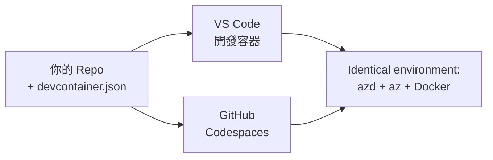

# azd 的開發容器與 GitHub Codespaces

**章節導航：**
- **📚 課程首頁**：[AZD 入門](../../README.md)
- **📖 當前章節**：第 1 章 - 基礎與快速開始
- **⬅️ 上一章節**：[自帶應用程式](bring-your-own-app.md)
- **🚀 下一章節**：[第 2 章：AI 優先開發](../chapter-02-ai-development/README.md)

> 已於 2026 年 7 月針對 `azd 1.27.1` 驗證。

## 介紹

在每台機器上安裝 azd、正確的語言執行環境、Docker 和 Azure CLI 是一項苦差事——這是「在我的機器上工作」的教程對其他人失效的頭號原因。<strong>開發容器</strong>透過在檔案中描述整個工具鏈解決了這個問題。任何在 VS Code 或 GitHub Codespaces 中開啟該專案的人都會擁有完全相同的環境，且已預先安裝好 azd。本課程將指導您如何新增一個開發容器。

## 學習目標

完成本課後，您將能：
- 了解什麼是開發容器以及它如何幫助 azd
- 向專案新增一個最簡化的 `.devcontainer/devcontainer.json`
- 透過開發容器的 *features* 包含 azd、Azure CLI 與 Docker
- 在 GitHub Codespaces 或 VS Code 中開啟專案

## 學習成果

完成本課後，您將能：
- 編寫 azd 專案的 `devcontainer.json`
- 無需手動安裝，即可加入 azd 與 Azure 工具
- 從容器或 Codespace 中運行 `azd up`

---

## 什麼是開發容器？

開發容器是一個基於 Docker 的開發環境，由您的資料庫中的 `.devcontainer/devcontainer.json` 檔案定義。當您開啟專案時：

- **VS Code**（搭配 Dev Containers 擴充功能）會構建容器並連接到它。
- **GitHub Codespaces** 會在雲端構建相同的容器，並提供基於瀏覽器的編輯器。

無論哪種方式，每位貢獻者都能獲得相同的工具—不再有「你有沒有安裝 azd？」的疑難排解問題。



---

## 第 1 步：建立 devcontainer 檔案

在專案根目錄下建立 `.devcontainer/devcontainer.json`：

```json
{
  "name": "azd-project",
  "image": "mcr.microsoft.com/devcontainers/base:bookworm",
  "features": {
    "ghcr.io/devcontainers/features/azure-cli:1": {},
    "ghcr.io/azure/azure-dev/azd:latest": {},
    "ghcr.io/devcontainers/features/docker-in-docker:2": {},
    "ghcr.io/devcontainers/features/node:1": {}
  },
  "customizations": {
    "vscode": {
      "extensions": [
        "ms-azuretools.azure-dev",
        "ms-azuretools.vscode-bicep"
      ]
    }
  },
  "forwardPorts": [3000],
  "postCreateCommand": "azd version"
}
```

各部分用途：

| 欄位 | 目的 |
|-----|---------|
| `image` | 容器的基底作業系統 |
| `features` | 預先建構的安裝器—此處有 Azure CLI、**azd**、Docker 及 Node.js |
| `customizations.vscode.extensions` | 自動安裝 azd 和 Bicep 的 VS Code 擴充功能 |
| `forwardPorts` | 將應用程式端口暴露到瀏覽器 |
| `postCreateCommand` | 容器建立完畢後執行一次的命令（此處為健全性檢查） |

> `ghcr.io/azure/azure-dev/azd:latest` feature 是在容器中取得 azd 的官方方式。若需重現性，可固定特定版本（例如 `azd:1.27.1`）。

---

## 第 2 步：配合您的應用語言選擇 Feature

將 `node` feature 換成您的應用所使用的：

```jsonc
// Python project
"ghcr.io/devcontainers/features/python:1": {},

// .NET project
"ghcr.io/devcontainers/features/dotnet:2": {},

// Java project
"ghcr.io/devcontainers/features/java:1": {},

// Go project
"ghcr.io/devcontainers/features/go:1": {}
```

如果您的 `host` 是 `containerapp`、`aks` 或任何會構建容器映像的環境，請保留 `docker-in-docker`，因為 azd 需要 Docker 來構建並推送映像。

---

## 第 3 步：開啟它

**在 VS Code 裡：**
1. 安裝 **Dev Containers** 擴充功能。
2. 開啟專案資料夾。
3. 出現提示時點擊 **Reopen in Container**（或執行 *Dev Containers: Reopen in Container*）。

**在 GitHub Codespaces 裡：**
1. 將倉庫推送到 GitHub。
2. 點擊 **Code → Codespaces → Create codespace on main**。
3. 等待容器構建完成—azd 已在終端機中準備好。

---

## 第 4 步：從容器內部署

容器已預裝 azd，因此照常工作流程即可：

```bash
azd auth login --use-device-code   # 裝置代碼喺 Codespaces 裡面好方便
azd up
```

> **為什麼使用 `--use-device-code`？** 在遠端容器或 Codespace 中沒有本地瀏覽器可轉向，因此裝置代碼登入是可靠的方式。您會將代碼貼到瀏覽器分頁完成登入。

---

## 常見陷阱

| 陷阱 | 修正方法 |
|---------|-----|
| `azd up` 無法建立映像 | 新增 `docker-in-docker` feature |
| Codespaces 中瀏覽器登入卡住 | 使用 `azd auth login --use-device-code` |
| 隊友間工具不一致 | 固定 feature 版本（如 `azd:1.27.1`） |
| 瀏覽器無法連接應用 | 將端口加入 `forwardPorts` |

---

## 總結

- 開發容器讓您的 azd 工具鏈對所有人都能重現。
- 透過開發容器 *features* 加入 azd、Azure CLI 和 Docker。
- 配合應用語言選擇 feature，並在容器主機環境中保留 `docker-in-docker`。
- 在 Codespaces 裡使用裝置代碼登入。

---

## 🔗 導覽

| 方向 | 資源 |
|-----------|----------|
| <strong>上一章</strong> | [自帶應用程式](bring-your-own-app.md) |
| <strong>章節首頁</strong> | [第 1 章：基礎與快速開始](README.md) |
| <strong>下一章</strong> | [第 2 章：AI 優先開發](../chapter-02-ai-development/README.md) |

## 📖 相關資源

- [安裝與設定](installation.md)
- [指令速查表](../../resources/cheat-sheet.md)
- [官方開發容器規範](https://containers.dev/)
- [azd 開發容器 feature](https://github.com/Azure/azure-dev/tree/main/ext/devcontainer)

---

<!-- CO-OP TRANSLATOR DISCLAIMER START -->
**免責聲明**：
本文件由 AI 翻譯服務 [Co-op Translator](https://github.com/Azure/co-op-translator) 翻譯而成。雖然我們致力於確保準確性，但請注意，機器自動翻譯可能包含錯誤或不準確之處。原始文件的母語版本應被視為權威來源。對於重要資訊，建議進行專業人工翻譯。我們不對因使用本翻譯而產生的任何誤解或誤釋承擔責任。
<!-- CO-OP TRANSLATOR DISCLAIMER END -->