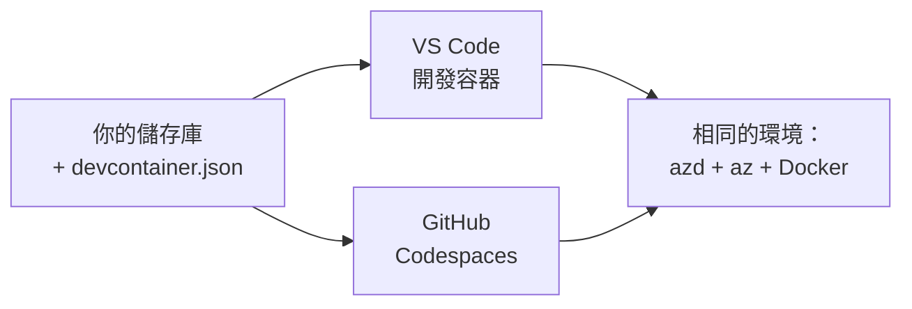

# Dev Containers & GitHub Codespaces 適用於 azd

**Chapter Navigation:**
- **📚 Course Home**: [AZD 入門](../../README.md)
- **📖 Current Chapter**: Chapter 1 - Foundation & Quick Start
- **⬅️ Previous**: [Bring Your Own App](bring-your-own-app.md)
- **🚀 Next Chapter**: [Chapter 2: AI-First Development](../chapter-02-ai-development/README.md)

> 已於 2026 年 6 月以 `azd 1.25.6` 驗證。

## Introduction

在每部機器上安裝 azd、正確的語言執行環境、Docker 和 Azure CLI 是一件麻煩事 —— 這也是為什麼一個「在我機器上能跑」的教學會對別人失效的頭號原因。透過描述整個工具鏈的檔案，開發容器（dev container）解決了這個問題。任何在 VS Code 或 GitHub Codespaces 開啟專案的人都會取得完全相同的環境，並且 azd 已經安裝好。本課示範如何加入一個開發容器。

## Learning Goals

完成本課後，你將能：
- 了解什麼是 dev container，以及它為何能幫助 azd
- 在專案中新增一個最小的 `.devcontainer/devcontainer.json`
- 透過 Dev Container *features* 包含 azd、Azure CLI 和 Docker
- 在 GitHub Codespaces 或 VS Code 中開啟專案

## Learning Outcomes

完成本課後，你將能夠：
- 為 azd 專案撰寫 `devcontainer.json`
- 在不需手動安裝的情況下加入 azd 和 Azure 工具
- 從容器或 Codespace 內執行 `azd up`

---

## What Is a Dev Container?

dev container 是一個以 Docker 為基礎的開發環境，由存放在你的 repository 中的 `.devcontainer/devcontainer.json` 檔案定義。當你開啟專案時：

- **VS Code**（搭配 Dev Containers 外掛）會建立該容器並附加到容器中。
- **GitHub Codespaces** 會在雲端建立相同的容器，並提供你瀏覽器內的編輯器。

無論哪一種方式，每位貢獻者都會擁有相同的工具——不用再問「你有沒有安裝 azd？」。



---

## Step 1: Create the devcontainer File

Create `.devcontainer/devcontainer.json` in the root of your project:

```json
{
  "name": "azd-project",
  "image": "mcr.microsoft.com/devcontainers/base:bookworm",
  "features": {
    "ghcr.io/devcontainers/features/azure-cli:1": {},
    "ghcr.io/azure/azure-dev/azd:latest": {},
    "ghcr.io/devcontainers/features/docker-in-docker:2": {},
    "ghcr.io/devcontainers/features/node:1": {}
  },
  "customizations": {
    "vscode": {
      "extensions": [
        "ms-azuretools.azure-dev",
        "ms-azuretools.vscode-bicep"
      ]
    }
  },
  "forwardPorts": [3000],
  "postCreateCommand": "azd version"
}
```

What each part does:

| Key | Purpose |
|-----|---------|
| `image` | 容器的基礎作業系統 |
| `features` | 預建安裝器—此處：Azure CLI、**azd**、Docker 及 Node.js |
| `customizations.vscode.extensions` | 自動安裝 azd 和 Bicep 的 VS Code 擴充套件 |
| `forwardPorts` | 將你的應用連接埠暴露給瀏覽器 |
| `postCreateCommand` | 容器建立後執行一次（此處為檢查） |

> `ghcr.io/azure/azure-dev/azd:latest` 功能是官方在容器中取得 azd 的方式。若需可重現性，請釘選特定版本（例如 `azd:1.25.6`）。

---

## Step 2: Match the Feature to Your App's Language

Swap the `node` feature for whatever your app uses:

```jsonc
// Python project
"ghcr.io/devcontainers/features/python:1": {},

// .NET project
"ghcr.io/devcontainers/features/dotnet:2": {},

// Java project
"ghcr.io/devcontainers/features/java:1": {},

// Go project
"ghcr.io/devcontainers/features/go:1": {}
```

Keep `docker-in-docker` if your `host` is `containerapp`, `aks`, or anything that builds a container image—azd needs Docker to build and push images.

---

## Step 3: Open It

**In VS Code:**
1. Install the **Dev Containers** extension.
2. Open the project folder.
3. Click **Reopen in Container** when prompted (or run *Dev Containers: Reopen in Container*).

**In GitHub Codespaces:**
1. Push the repo to GitHub.
2. Click **Code → Codespaces → Create codespace on main**.
3. Wait for the container to build—azd is ready in the terminal.

---

## Step 4: Deploy From Inside the Container

The container has azd preinstalled, so the normal workflow just works:

```bash
azd auth login --use-device-code   # 在 Codespaces 裡使用裝置代碼很方便
azd up
```

> **為什麼使用 `--use-device-code`？** 在遠端容器或 Codespace 裡沒有本機瀏覽器可以導向，所以 device-code 登入是較可靠的方式。你會把一個代碼貼到瀏覽器分頁以完成登入。

---

## Common Pitfalls

| Pitfall | Fix |
|---------|-----|
| `azd up` can't build an image | 加入 `docker-in-docker` feature |
| Browser login hangs in Codespaces | Use `azd auth login --use-device-code` |
| Tools differ between teammates | Pin feature versions (e.g. `azd:1.25.6`) |
| App not reachable in browser | 將對應的連接埠加入 `forwardPorts` |

---

## Summary

- 開發容器能讓你的 azd 工具鏈對每個人都可複製。
- 透過 Dev Container *features* 新增 azd、Azure CLI，以及 Docker。
- 將語言的 feature 對應到你的應用；若是容器主機則保留 `docker-in-docker`。
- 在 Codespaces 內執行時使用 device-code 登入。

---

## 🔗 Navigation

| Direction | Resource |
|-----------|----------|
| **Previous** | [Bring Your Own App](bring-your-own-app.md) |
| **Chapter Home** | [Chapter 1: Foundation & Quick Start](README.md) |
| **Next Chapter** | [Chapter 2: AI-First Development](../chapter-02-ai-development/README.md) |

## 📖 Related Resources

- [Installation & Setup](installation.md)
- [Command Cheat Sheet](../../resources/cheat-sheet.md)
- [Official Dev Containers specification](https://containers.dev/)
- [azd Dev Container feature](https://github.com/Azure/azure-dev/tree/main/ext/devcontainer)

---

<!-- CO-OP TRANSLATOR DISCLAIMER START -->
**免責聲明**：
本文件由 AI 翻譯服務 [Co-op Translator](https://github.com/Azure/co-op-translator) 翻譯而成。雖然我們致力於確保準確性，但請注意，機器自動翻譯可能包含錯誤或不準確之處。原始文件的母語版本應被視為權威來源。對於重要資訊，建議進行專業人工翻譯。我們不對因使用本翻譯而產生的任何誤解或誤釋承擔責任。
<!-- CO-OP TRANSLATOR DISCLAIMER END -->