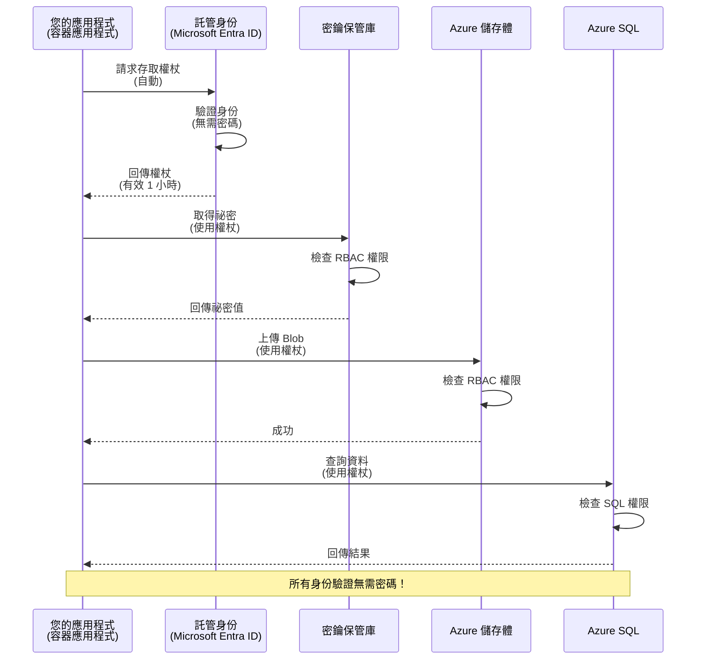
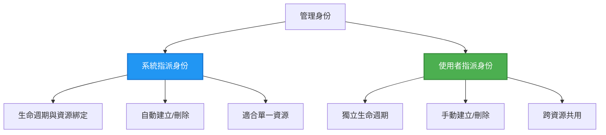

# 認證模式與受管身份

⏱️ <strong>預計時間</strong>：45-60 分鐘 | 💰 <strong>成本影響</strong>：免費（無額外費用） | ⭐ <strong>複雜度</strong>：中階

**📚 學習路徑：**
- ← 上一節：[配置管理](configuration.md) - 管理環境變數與機密
- 🎯 <strong>你現在的位置</strong>：認證與安全性（受管身份、Key Vault、安全模式）
- → 下一節：[第一個專案](first-project.md) - 建立你的第一個 AZD 應用程式
- 🏠 [課程首頁](../../README.md)

---

## 你將學習到什麼

完成本課程後，你將能夠：
- 了解 Azure 認證模式（金鑰、連接字串、受管身份）
- 實作 <strong>受管身份</strong> 以實現無密碼認證
- 使用 **Azure Key Vault** 整合來保護機密
- 配置 AZD 部署的 **基於角色的存取控制（RBAC）**
- 在 Container Apps 與 Azure 服務上應用安全最佳實踐
- 從基於金鑰認證遷移到基於身份的認證

## 為什麼受管身份重要

### 問題：傳統認證

**受管身份之前：**
```javascript
// ❌ 安全風險：代碼中硬編碼的機密資訊
const connectionString = "Server=mydb.database.windows.net;User=admin;Password=P@ssw0rd123";
const storageKey = "xK7mN9pQ2wR5tY8uI0oP3aS6dF1gH4jK...";
const cosmosKey = "C2x7B9n4M1p8Q5w3E6r0T2y5U8i1O4p7...";
```

**問題：**
- 🔴 程式碼、配置檔、環境變數中暴露機密
- 🔴 憑證輪替需要修改程式碼並重新部署
- 🔴 審計困難——誰在什麼時候存取了什麼？
- 🔴 機密散落多處系統，管理複雜
- 🔴 合規風險——無法通過安全審核

### 解決方案：受管身份

**使用受管身份後：**
```javascript
// ✅ 安全：代碼中沒有秘密
const credential = new DefaultAzureCredential();
const client = new BlobServiceClient(
  "https://mystorageaccount.blob.core.windows.net",
  credential  // Azure 自動處理身份驗證
);
```

**優點：**
- ✅ 程式碼或配置中無任何機密
- ✅ 自動輪替—由 Azure 處理
- ✅ Microsoft Entra ID 日誌完整的審計軌跡
- ✅ 集中化安全管理—於 Azure 入口網站操作
- ✅ 符合合規標準

<strong>類比</strong>：傳統認證就像攜帶多把實體鑰匙打開不同門。受管身份就像擁有一張只要身份符合就自動授權的安全證件——不會遺失、不需複製或輪替鑰匙。

---

## 架構概述

### 使用受管身份的認證流程



### 受管身份類型



| 功能 | 系統分配 | 使用者分配 |
|---------|----------------|---------------|
| <strong>生命週期</strong> | 綁定於資源 | 獨立存在 |
| <strong>建立方式</strong> | 資源自動建立 | 手動建立 |
| <strong>刪除</strong> | 隨資源一起刪除 | 資源刪除後仍存在 |
| <strong>共用性</strong> | 僅限單一資源 | 可供多資源使用 |
| <strong>使用案例</strong> | 簡單場景 | 複雜多資源場景 |
| **AZD 預設** | ✅ 推薦 | 選用 |

---

## 前置需求

### 必須工具

建議你已從前面課程安裝以下工具：

```bash
# 驗證 Azure 開發者 CLI
azd version
# ✅ 預期：azd 版本 1.0.0 或更高

# 驗證 Azure CLI
az --version
# ✅ 預期：azure-cli 2.50.0 或更高
```

### Azure 要求

- 有效的 Azure 訂閱
- 權限：
  - 建立受管身份
  - 指派 RBAC 角色
  - 建立 Key Vault 資源
  - 部署 Container Apps

### 知識基礎

建議已學習：
- [安裝指南](installation.md) - AZD 安裝設定
- [AZD 基礎](azd-basics.md) - 核心概念
- [配置管理](configuration.md) - 環境變數管理

---

## 課程 1：認識認證模式

### 模式 1：連接字串（舊式，避免使用）

**運作方式：**
```bash
# 連接字串包含憑證
STORAGE_CONNECTION_STRING="DefaultEndpointsProtocol=https;AccountName=myaccount;AccountKey=xK7mN9pQ2wR5..."
COSMOS_CONNECTION_STRING="AccountEndpoint=https://myaccount.documents.azure.com:443/;AccountKey=C2x7..."
SQL_CONNECTION_STRING="Server=myserver.database.windows.net;User=admin;Password=P@ssw0rd..."
```

**問題：**
- ❌ 機密暴露於環境變數
- ❌ 部署系統中有紀錄
- ❌ 難以輪替
- ❌ 無存取審計

<strong>建議使用時機</strong>：僅限本地開發，絕不用於生產環境。

---

### 模式 2：Key Vault 參考（較佳）

**運作方式：**
```bicep
// Store secret in Key Vault
resource keyVault 'Microsoft.KeyVault/vaults@2023-02-01' = {
  name: 'mykv'
  properties: {
    enableRbacAuthorization: true
  }
}

// Reference in Container App
env: [
  {
    name: 'STORAGE_KEY'
    secretRef: 'storage-key'  // References Key Vault
  }
]
```

**優點：**
- ✅ 機密安全存於 Key Vault
- ✅ 集中化機密管理
- ✅ 輪替無需修改程式碼

**限制：**
- ⚠️ 仍需使用金鑰/密碼
- ⚠️ 需管理 Key Vault 存取權限

<strong>建議使用時機</strong>：作為從連接字串過渡到受管身份的中介步驟。

---

### 模式 3：受管身份（最佳實踐）

**運作方式：**
```bicep
// Enable managed identity
resource containerApp 'Microsoft.App/containerApps@2023-05-01' = {
  name: 'myapp'
  identity: {
    type: 'SystemAssigned'  // Automatically creates identity
  }
}

// Grant permissions
resource roleAssignment 'Microsoft.Authorization/roleAssignments@2022-04-01' = {
  scope: storageAccount
  properties: {
    roleDefinitionId: storageBlobDataContributorRole
    principalId: containerApp.identity.principalId
  }
}
```

**應用程式程式碼：**
```javascript
// 唔使秘密！
const { DefaultAzureCredential } = require('@azure/identity');
const { BlobServiceClient } = require('@azure/storage-blob');

const credential = new DefaultAzureCredential();
const blobServiceClient = new BlobServiceClient(
  'https://mystorageaccount.blob.core.windows.net',
  credential
);
```

**優點：**
- ✅ 程式碼/配置內無任何機密
- ✅ 自動輪替憑證
- ✅ 完整審計軌跡
- ✅ 基於 RBAC 的權限控管
- ✅ 符合合規要求

<strong>建議使用時機</strong>：所有生產應用程式皆應使用。

---

### 模式 4：服務主體（CI/CD 與自動化）

受管身份是 Azure 內部資源運行的黃金標準。但對於在 **Azure 之外** 運行的程式碼—比如在建置代理上的 CI/CD 管線，或無法使用互動式登入的筆記本電腦腳本，則需要用到 <strong>服務主體</strong>：一種非人類身份，擁有自己的憑證，可用於自動化流程登入。

**運作方式：**

建立針對資源群組的服務主體（最小權限）：

```bash
az ad sp create-for-rbac \
  --name "myapp-cicd" \
  --role contributor \
  --scopes /subscriptions/<sub-id>/resourceGroups/<rg-name>
```

會列印出 client ID、client secret 和租戶 ID。azd 可用它們非互動式登入：

```bash
azd auth login \
  --client-id "<appId>" \
  --client-secret "<password>" \
  --tenant-id "<tenant>"
```

**優先使用聯邦認證（OIDC）取代機密。** 不用長期有效的 client secret，而設置聯邦認證，令管道交換短期令牌——避免機密洩漏或必須輪替：

```bash
azd auth login \
  --client-id "<appId>" \
  --federated-credential-provider "github" \
  --tenant-id "<tenant>"
```

> `azd pipeline config` 會自動幫你設定。參考第 [8 章](../chapter-08-production/production-ai-practices.md) CI/CD 實作範例。

**優點：**
- ✅ 適用於 Azure 之外（建置代理、內部部署、其他雲端）
- ✅ 可限制在單一資源群組及角色
- ✅ 聯邦（OIDC）版本不需儲存機密

**缺點：**
- ⚠️ 基於機密版本需妥善存放與輪替
- ⚠️ 洩漏機密將授予服務主體所有權限，務必將權限及作用範圍控制在最低

<strong>建議使用時機</strong>：用於無法使用受管身份的 CI/CD 管線與自動化。總是優先選擇 **聯邦/OIDC** 版本，而若工作負載於 Azure 內建議使用受管身份。

**安全存放憑證建議：**
- 請勿在程式碼中提交機密，使用管線的機密存儲（GitHub Actions secrets、Azure DevOps 變數群組 / Key Vault）
- 將服務主體角色及資源群組權限限定在最低範圍
- 設置到期時間並定期輪替，或使用 OIDC 完全消除密碼需求

---

## 課程 2：使用 AZD 實作受管身份

### 實作步驟

建立一個安全的 Container App，使用受管身份存取 Azure Storage 和 Key Vault。

### 專案結構

```
secure-app/
├── azure.yaml                 # AZD configuration
├── infra/
│   ├── main.bicep            # Main infrastructure
│   ├── core/
│   │   ├── identity.bicep    # Managed identity setup
│   │   ├── keyvault.bicep    # Key Vault configuration
│   │   └── storage.bicep     # Storage with RBAC
│   └── app/
│       └── container-app.bicep
└── src/
    ├── app.js                # Application code
    ├── package.json
    └── Dockerfile
```

### 1. 配置 AZD（azure.yaml）

```yaml
name: secure-app
metadata:
  template: secure-app@1.0.0

services:
  api:
    project: ./src
    language: js
    host: containerapp

# Enable managed identity (AZD handles this automatically)
```

### 2. 基礎設施：啟用受管身份

**檔案：`infra/main.bicep`**

```bicep
targetScope = 'subscription'

param environmentName string
param location string = 'eastus'

var tags = { 'azd-env-name': environmentName }

// Resource group
resource rg 'Microsoft.Resources/resourceGroups@2021-04-01' = {
  name: 'rg-${environmentName}'
  location: location
  tags: tags
}

// Storage Account
module storage './core/storage.bicep' = {
  name: 'storage'
  scope: rg
  params: {
    name: 'st${uniqueString(rg.id)}'
    location: location
    tags: tags
  }
}

// Key Vault
module keyVault './core/keyvault.bicep' = {
  name: 'keyvault'
  scope: rg
  params: {
    name: 'kv-${uniqueString(rg.id)}'
    location: location
    tags: tags
  }
}

// Container App with Managed Identity
module containerApp './app/container-app.bicep' = {
  name: 'container-app'
  scope: rg
  params: {
    name: 'ca-${environmentName}'
    location: location
    tags: tags
    storageAccountName: storage.outputs.name
    keyVaultName: keyVault.outputs.name
  }
}

// Grant Container App access to Storage
module storageRoleAssignment './core/role-assignment.bicep' = {
  name: 'storage-role'
  scope: rg
  params: {
    principalId: containerApp.outputs.identityPrincipalId
    roleDefinitionId: 'ba92f5b4-2d11-453d-a403-e96b0029c9fe'  // Storage Blob Data Contributor
    targetResourceId: storage.outputs.id
  }
}

// Grant Container App access to Key Vault
module kvRoleAssignment './core/role-assignment.bicep' = {
  name: 'kv-role'
  scope: rg
  params: {
    principalId: containerApp.outputs.identityPrincipalId
    roleDefinitionId: '4633458b-17de-408a-b874-0445c86b69e6'  // Key Vault Secrets User
    targetResourceId: keyVault.outputs.id
  }
}

// Outputs
output AZURE_STORAGE_ACCOUNT_NAME string = storage.outputs.name
output AZURE_KEY_VAULT_NAME string = keyVault.outputs.name
output APP_URL string = containerApp.outputs.url
```

### 3. 使用系統分配身份的 Container App

**檔案：`infra/app/container-app.bicep`**

```bicep
param name string
param location string
param tags object = {}
param storageAccountName string
param keyVaultName string

resource containerApp 'Microsoft.App/containerApps@2023-05-01' = {
  name: name
  location: location
  tags: tags
  identity: {
    type: 'SystemAssigned'  // 🔑 Enable managed identity
  }
  properties: {
    configuration: {
      ingress: {
        external: true
        targetPort: 3000
      }
    }
    template: {
      containers: [
        {
          name: 'api'
          image: 'myregistry.azurecr.io/api:latest'
          resources: {
            cpu: json('0.5')
            memory: '1Gi'
          }
          env: [
            {
              name: 'AZURE_STORAGE_ACCOUNT_NAME'
              value: storageAccountName
            }
            {
              name: 'AZURE_KEY_VAULT_NAME'
              value: keyVaultName
            }
            // 🔑 No secrets - managed identity handles authentication!
          ]
        }
      ]
    }
  }
}

// Output the identity for RBAC assignments
output identityPrincipalId string = containerApp.identity.principalId
output id string = containerApp.id
output url string = 'https://${containerApp.properties.configuration.ingress.fqdn}'
```

### 4. RBAC 角色指派模組

**檔案：`infra/core/role-assignment.bicep`**

```bicep
param principalId string
param roleDefinitionId string  // Azure built-in role ID
param targetResourceId string

resource roleAssignment 'Microsoft.Authorization/roleAssignments@2022-04-01' = {
  name: guid(principalId, roleDefinitionId, targetResourceId)
  scope: resourceId('Microsoft.Resources/resourceGroups', resourceGroup().name)
  properties: {
    roleDefinitionId: subscriptionResourceId('Microsoft.Authorization/roleDefinitions', roleDefinitionId)
    principalId: principalId
    principalType: 'ServicePrincipal'
  }
}

output id string = roleAssignment.id
```

### 5. 受管身份應用程式程式碼

**檔案：`src/app.js`**

```javascript
const express = require('express');
const { DefaultAzureCredential } = require('@azure/identity');
const { BlobServiceClient } = require('@azure/storage-blob');
const { SecretClient } = require('@azure/keyvault-secrets');

const app = express();
const PORT = process.env.PORT || 3000;

// 🔑 初始化憑證（自動支援受管身份）
const credential = new DefaultAzureCredential();

// Azure 儲存配置
const storageAccountName = process.env.AZURE_STORAGE_ACCOUNT_NAME;
const blobServiceClient = new BlobServiceClient(
  `https://${storageAccountName}.blob.core.windows.net`,
  credential  // 無需密鑰！
);

// Key Vault 配置
const keyVaultName = process.env.AZURE_KEY_VAULT_NAME;
const secretClient = new SecretClient(
  `https://${keyVaultName}.vault.azure.net`,
  credential  // 無需密鑰！
);

// 健康檢查
app.get('/health', (req, res) => {
  res.json({ status: 'healthy', authentication: 'managed-identity' });
});

// 上傳檔案至 Blob 儲存
app.post('/upload', async (req, res) => {
  try {
    const containerClient = blobServiceClient.getContainerClient('uploads');
    await containerClient.createIfNotExists();
    
    const blobName = `file-${Date.now()}.txt`;
    const blockBlobClient = containerClient.getBlockBlobClient(blobName);
    
    await blockBlobClient.upload('Hello from managed identity!', 30);
    
    res.json({
      success: true,
      blobName: blobName,
      message: 'File uploaded using managed identity!'
    });
  } catch (error) {
    console.error('Upload error:', error);
    res.status(500).json({ error: error.message });
  }
});

// 從 Key Vault 獲取機密
app.get('/secret/:name', async (req, res) => {
  try {
    const secretName = req.params.name;
    const secret = await secretClient.getSecret(secretName);
    
    res.json({
      name: secretName,
      value: secret.value,
      message: 'Secret retrieved using managed identity!'
    });
  } catch (error) {
    console.error('Secret error:', error);
    res.status(500).json({ error: error.message });
  }
});

// 列出 Blob 容器（展示讀取權限）
app.get('/containers', async (req, res) => {
  try {
    const containers = [];
    for await (const container of blobServiceClient.listContainers()) {
      containers.push(container.name);
    }
    
    res.json({
      containers: containers,
      count: containers.length,
      message: 'Containers listed using managed identity!'
    });
  } catch (error) {
    console.error('List error:', error);
    res.status(500).json({ error: error.message });
  }
});

app.listen(PORT, () => {
  console.log(`Secure API listening on port ${PORT}`);
  console.log('Authentication: Managed Identity (passwordless)');
});
```

**檔案：`src/package.json`**

```json
{
  "name": "secure-app",
  "version": "1.0.0",
  "dependencies": {
    "express": "^4.18.2",
    "@azure/identity": "^4.0.0",
    "@azure/storage-blob": "^12.17.0",
    "@azure/keyvault-secrets": "^4.7.0"
  },
  "scripts": {
    "start": "node app.js"
  }
}
```

### 6. 部署與測試

```bash
# 初始化 AZD 環境
azd init

# 部署基礎設施及應用程式
azd up

# 獲取應用程式 URL
APP_URL=$(azd env get-values | grep APP_URL | cut -d '=' -f2 | tr -d '"')

# 測試健康檢查
curl $APP_URL/health
```

**✅ 預期輸出：**
```json
{
  "status": "healthy",
  "authentication": "managed-identity"
}
```

**測試 blob 上傳：**
```bash
curl -X POST $APP_URL/upload
```

**✅ 預期輸出：**
```json
{
  "success": true,
  "blobName": "file-1700404800000.txt",
  "message": "File uploaded using managed identity!"
}
```

**測試容器列表：**
```bash
curl $APP_URL/containers
```

**✅ 預期輸出：**
```json
{
  "containers": ["uploads"],
  "count": 1,
  "message": "Containers listed using managed identity!"
}
```

---

## 常用 Azure RBAC 角色

### 受管身份用內建角色 ID

| 服務 | 角色名稱 | 角色 ID | 權限描述 |
|---------|-----------|---------|-------------|
| **Storage** | Storage Blob Data Reader | `2a2b9908-6b94-4a3d-8e5a-a7d8f8cc8a12` | 讀取 blob 與容器 |
| **Storage** | Storage Blob Data Contributor | `ba92f5b4-2d11-453d-a403-e96b0029c9fe` | 讀寫刪除 blob |
| **Storage** | Storage Queue Data Contributor | `974c5e8b-45b9-4653-ba55-5f855dd0fb88` | 讀寫刪除佇列訊息 |
| **Key Vault** | Key Vault Secrets User | `4633458b-17de-408a-b874-0445c86b69e6` | 讀取機密 |
| **Key Vault** | Key Vault Secrets Officer | `b86a8fe4-44ce-4948-aee5-eccb2c155cd7` | 讀寫刪除機密 |
| **Cosmos DB** | Cosmos DB Built-in Data Reader | `00000000-0000-0000-0000-000000000001` | 讀取 Cosmos DB 資料 |
| **Cosmos DB** | Cosmos DB Built-in Data Contributor | `00000000-0000-0000-0000-000000000002` | 讀寫 Cosmos DB 資料 |
| **SQL Database** | SQL DB Contributor | `9b7fa17d-e63e-47b0-bb0a-15c516ac86ec` | 管理 SQL 資料庫 |
| **Service Bus** | Azure Service Bus Data Owner | `090c5cfd-751d-490a-894a-3ce6f1109419` | 發送、接收與管理訊息 |

### 如何查詢角色 ID

```bash
# 列出所有內建角色
az role definition list --query "[].{Name:roleName, ID:name}" --output table

# 搜尋特定角色
az role definition list --query "[?contains(roleName, 'Storage Blob')].{Name:roleName, ID:name}" --output table

# 取得角色詳情
az role definition list --name "Storage Blob Data Contributor"
```

---

## 實作練習

### 練習 1：為現有應用啟用受管身份 ⭐⭐（中階）

<strong>目標</strong>：為既有 Container App 部署添加受管身份

<strong>情境</strong>：你有個 Container App 使用連接字串。將它轉換成使用受管身份。

<strong>起始狀態</strong>：Container App 配置如下：

```bicep
// ❌ Current: Using connection string
env: [
  {
    name: 'STORAGE_CONNECTION_STRING'
    secretRef: 'storage-connection'
  }
]
```

<strong>步驟</strong>：

1. **在 Bicep 中啟用受管身份：**

```bicep
resource containerApp 'Microsoft.App/containerApps@2023-05-01' = {
  name: 'myapp'
  identity: {
    type: 'SystemAssigned'  // Add this
  }
  // ... rest of configuration
}
```

2. **授予 Storage 存取權：**

```bicep
// Get storage account reference
resource storageAccount 'Microsoft.Storage/storageAccounts@2023-01-01' existing = {
  name: storageAccountName
}

// Assign role
resource roleAssignment 'Microsoft.Authorization/roleAssignments@2022-04-01' = {
  name: guid(containerApp.id, 'ba92f5b4-2d11-453d-a403-e96b0029c9fe', storageAccount.id)
  scope: storageAccount
  properties: {
    roleDefinitionId: subscriptionResourceId('Microsoft.Authorization/roleDefinitions', 'ba92f5b4-2d11-453d-a403-e96b0029c9fe')
    principalId: containerApp.identity.principalId
    principalType: 'ServicePrincipal'
  }
}
```

3. **更新應用程式程式碼：**

**之前（連接字串）：**
```javascript
const { BlobServiceClient } = require('@azure/storage-blob');

const blobServiceClient = BlobServiceClient.fromConnectionString(
  process.env.STORAGE_CONNECTION_STRING
);
```

**之後（受管身份）：**
```javascript
const { DefaultAzureCredential } = require('@azure/identity');
const { BlobServiceClient } = require('@azure/storage-blob');

const credential = new DefaultAzureCredential();
const blobServiceClient = new BlobServiceClient(
  `https://${process.env.STORAGE_ACCOUNT_NAME}.blob.core.windows.net`,
  credential
);
```

4. **更新環境變數：**

```bicep
env: [
  {
    name: 'STORAGE_ACCOUNT_NAME'
    value: storageAccountName  // Just the name, no secrets!
  }
  // Remove STORAGE_CONNECTION_STRING
]
```

5. **部署並測試：**

```bash
# 重新部署
azd up

# 測試它是否仍然有效
curl https://myapp.azurecontainerapps.io/upload
```

**✅ 成功標準：**
- ✅ 應用程式成功部署無錯誤
- ✅ Storage 操作正常（上傳、列出、下載）
- ✅ 環境變數中無連接字串
- ✅ Azure 入口網站「身份」頁籤可見身份

**驗證：**

```bash
# 檢查是否啟用管理身份
az containerapp show \
  --name myapp \
  --resource-group rg-myapp \
  --query "identity.type"
# ✅ 預期: "SystemAssigned"

# 檢查角色指派
az role assignment list \
  --assignee $(az containerapp show --name myapp --resource-group rg-myapp --query "identity.principalId" -o tsv) \
  --scope /subscriptions/{sub-id}/resourceGroups/rg-myapp/providers/Microsoft.Storage/storageAccounts/mystorageaccount
# ✅ 預期: 顯示 "Storage Blob Data Contributor" 角色
```

<strong>時間</strong>：20-30 分鐘

---

### 練習 2：多服務共用使用者分配身份 ⭐⭐⭐（進階）

<strong>目標</strong>：建立一個可供多個 Container App 共享的使用者分配身份

<strong>情境</strong>：你有三個微服務都需存取同一個 Storage 帳戶與 Key Vault。

<strong>步驟</strong>：

1. **建立使用者分配身份：**

**檔案：`infra/core/identity.bicep`**

```bicep
param name string
param location string
param tags object = {}

resource userAssignedIdentity 'Microsoft.ManagedIdentity/userAssignedIdentities@2023-01-31' = {
  name: name
  location: location
  tags: tags
}

output id string = userAssignedIdentity.id
output principalId string = userAssignedIdentity.properties.principalId
output clientId string = userAssignedIdentity.properties.clientId
```

2. **分配角色給使用者分配身份：**

```bicep
// In main.bicep
module userIdentity './core/identity.bicep' = {
  name: 'user-identity'
  scope: rg
  params: {
    name: 'id-${environmentName}'
    location: location
    tags: tags
  }
}

// Grant Storage access
resource storageRoleAssignment 'Microsoft.Authorization/roleAssignments@2022-04-01' = {
  name: guid(userIdentity.outputs.principalId, 'storage-contributor')
  scope: storageAccount
  properties: {
    roleDefinitionId: subscriptionResourceId('Microsoft.Authorization/roleDefinitions', 'ba92f5b4-2d11-453d-a403-e96b0029c9fe')
    principalId: userIdentity.outputs.principalId
    principalType: 'ServicePrincipal'
  }
}

// Grant Key Vault access
resource kvRoleAssignment 'Microsoft.Authorization/roleAssignments@2022-04-01' = {
  name: guid(userIdentity.outputs.principalId, 'kv-secrets-user')
  scope: keyVault
  properties: {
    roleDefinitionId: subscriptionResourceId('Microsoft.Authorization/roleDefinitions', '4633458b-17de-408a-b874-0445c86b69e6')
    principalId: userIdentity.outputs.principalId
    principalType: 'ServicePrincipal'
  }
}
```

3. **指派身份給多個 Container Apps：**

```bicep
resource apiGateway 'Microsoft.App/containerApps@2023-05-01' = {
  name: 'api-gateway'
  identity: {
    type: 'UserAssigned'
    userAssignedIdentities: {
      '${userIdentity.outputs.id}': {}
    }
  }
  // ... rest of config
}

resource productService 'Microsoft.App/containerApps@2023-05-01' = {
  name: 'product-service'
  identity: {
    type: 'UserAssigned'
    userAssignedIdentities: {
      '${userIdentity.outputs.id}': {}
    }
  }
  // ... rest of config
}

resource orderService 'Microsoft.App/containerApps@2023-05-01' = {
  name: 'order-service'
  identity: {
    type: 'UserAssigned'
    userAssignedIdentities: {
      '${userIdentity.outputs.id}': {}
    }
  }
  // ... rest of config
}
```

4. **應用程式程式碼（所有服務共用同一模式）：**

```javascript
const { DefaultAzureCredential, ManagedIdentityCredential } = require('@azure/identity');

// 對於使用者指派的身分，請指定用戶端 ID
const credential = new ManagedIdentityCredential(
  process.env.AZURE_CLIENT_ID  // 使用者指派身分的用戶端 ID
);

// 或使用 DefaultAzureCredential（自動偵測）
const credential = new DefaultAzureCredential();

const blobServiceClient = new BlobServiceClient(
  `https://${process.env.STORAGE_ACCOUNT_NAME}.blob.core.windows.net`,
  credential
);
```

5. **部署並驗證：**

```bash
azd up

# 測試所有服務是否能夠存取儲存裝置
curl https://api-gateway.azurecontainerapps.io/upload
curl https://product-service.azurecontainerapps.io/upload
curl https://order-service.azurecontainerapps.io/upload
```

**✅ 成功標準：**
- ✅ 一個身份供三個服務共用
- ✅ 所有服務均能存取 Storage 和 Key Vault
- ✅ 刪除某服務後身份仍存續
- ✅ 集中化權限管理

**使用者分配身份優點：**
- 單一身份容易管理
- 服務間權限保持一致
- 可存活於服務刪除後
- 適合複雜架構

<strong>時間</strong>：30-40 分鐘

---

### 練習 3：實作 Key Vault 機密輪替 ⭐⭐⭐（進階）

<strong>目標</strong>：將第三方 API 金鑰存入 Key Vault 並使用受管身份存取

<strong>情境</strong>：你的應用需呼叫需要 API 金鑰的外部 API（OpenAI、Stripe、SendGrid）。

<strong>步驟</strong>：

1. **建立帶有 RBAC 的 Key Vault：**

**檔案：`infra/core/keyvault.bicep`**

```bicep
param name string
param location string
param tags object = {}

resource keyVault 'Microsoft.KeyVault/vaults@2023-02-01' = {
  name: name
  location: location
  tags: tags
  properties: {
    enableRbacAuthorization: true  // Use RBAC instead of access policies
    sku: {
      family: 'A'
      name: 'standard'
    }
    tenantId: subscription().tenantId
    enableSoftDelete: true
    softDeleteRetentionInDays: 90
  }
}

// Allow Container App to read secrets
output id string = keyVault.id
output name string = keyVault.name
output uri string = keyVault.properties.vaultUri
```

2. **在 Key Vault 儲存機密：**

```bash
# 獲取 Key Vault 名稱
KV_NAME=$(azd env get-values | grep AZURE_KEY_VAULT_NAME | cut -d '=' -f2 | tr -d '"')

# 儲存第三方 API 密鑰
az keyvault secret set \
  --vault-name $KV_NAME \
  --name "OpenAI-ApiKey" \
  --value "sk-proj-xxxxxxxxxxxxx"

az keyvault secret set \
  --vault-name $KV_NAME \
  --name "Stripe-ApiKey" \
  --value "sk_live_xxxxxxxxxxxxx"

az keyvault secret set \
  --vault-name $KV_NAME \
  --name "SendGrid-ApiKey" \
  --value "SG.xxxxxxxxxxxxx"
```

3. **應用程式程式碼取用機密：**

**檔案：`src/config.js`**

```javascript
const { DefaultAzureCredential } = require('@azure/identity');
const { SecretClient } = require('@azure/keyvault-secrets');

class Config {
  constructor() {
    this.credential = new DefaultAzureCredential();
    this.secretClient = new SecretClient(
      `https://${process.env.AZURE_KEY_VAULT_NAME}.vault.azure.net`,
      this.credential
    );
    this.cache = {};
  }

  async getSecret(secretName) {
    // 首先檢查快取
    if (this.cache[secretName]) {
      return this.cache[secretName];
    }

    try {
      const secret = await this.secretClient.getSecret(secretName);
      this.cache[secretName] = secret.value;
      console.log(`✅ Retrieved secret: ${secretName}`);
      return secret.value;
    } catch (error) {
      console.error(`❌ Failed to get secret ${secretName}:`, error.message);
      throw error;
    }
  }

  async getOpenAIKey() {
    return this.getSecret('OpenAI-ApiKey');
  }

  async getStripeKey() {
    return this.getSecret('Stripe-ApiKey');
  }

  async getSendGridKey() {
    return this.getSecret('SendGrid-ApiKey');
  }
}

module.exports = new Config();
```

4. **在應用中使用機密：**

**檔案：`src/app.js`**

```javascript
const express = require('express');
const config = require('./config');
const { OpenAI } = require('openai');

const app = express();

// 使用來自金鑰保管庫的金鑰初始化 OpenAI
let openaiClient;

async function initializeServices() {
  const openaiKey = await config.getOpenAIKey();
  openaiClient = new OpenAI({ apiKey: openaiKey });
  console.log('✅ Services initialized with secrets from Key Vault');
}

// 在啟動時調用
initializeServices().catch(console.error);

app.post('/chat', async (req, res) => {
  try {
    const completion = await openaiClient.chat.completions.create({
      model: 'gpt-4.1',
      messages: [{ role: 'user', content: 'Hello!' }]
    });
    
    res.json({
      response: completion.choices[0].message.content,
      authentication: 'Key from Key Vault via Managed Identity'
    });
  } catch (error) {
    res.status(500).json({ error: error.message });
  }
});

app.listen(3000, () => {
  console.log('Secure API with Key Vault integration running');
});
```

5. **部署並測試：**

```bash
azd up

# 測試 API 密鑰是否有效
curl -X POST https://myapp.azurecontainerapps.io/chat \
  -H "Content-Type: application/json" \
  -d '{"message":"Hello AI"}'
```

**✅ 成功標準：**
- ✅ 代碼或環境變數中無 API 金鑰
- ✅ 應用程式從 Key Vault 取得金鑰
- ✅ 第三方 API 運作正常
- ✅ 可在不更改代碼的情況下旋轉金鑰

**旋轉機密:**

```bash
# 更新 Key Vault 中的密碼
az keyvault secret set \
  --vault-name $KV_NAME \
  --name "OpenAI-ApiKey" \
  --value "sk-proj-NEW_KEY_HERE"

# 重啟應用程式以使用新金鑰
az containerapp revision restart \
  --name myapp \
  --resource-group rg-myapp
```

<strong>時間</strong>: 25-35 分鐘

---

## 知識檢查點

### 1. 認證模式 ✓

測試您的理解：

- [ ] **Q1**: 三種主要的認證模式是什麼？
  - **A**: 連接字串（舊有）、Key Vault 參考（過渡）、託管身份（最佳）

- [ ] **Q2**: 為什麼託管身份比連接字串更好？
  - **A**: 代碼中無秘密資料、自動旋轉、完整稽核軌跡、RBAC 權限控制

- [ ] **Q3**: 何時使用使用者指派身份而非系統指派身份？
  - **A**: 當要跨多個資源共用身份或身份生命週期獨立於資源生命週期時使用

**實作驗證:**
```bash
# 檢查你的應用程式使用甚麼類型的身份
az containerapp show \
  --name myapp \
  --resource-group rg-myapp \
  --query "identity.type"

# 列出該身份的所有角色指派
az role assignment list \
  --assignee $(az containerapp show --name myapp --resource-group rg-myapp --query "identity.principalId" -o tsv)
```

---

### 2. RBAC 和權限 ✓

測試您的理解：

- [ ] **Q1**: 「Storage Blob Data Contributor」的角色 ID 是什麼？
  - **A**: `ba92f5b4-2d11-453d-a403-e96b0029c9fe`

- [ ] **Q2**: 「Key Vault Secrets User」提供什麼權限？
  - **A**: 只讀存取機密（無法建立、更新或刪除）

- [ ] **Q3**: 如何授予 Container App 存取 Azure SQL？
  - **A**: 指派「SQL DB Contributor」角色或為 SQL 設定 Microsoft Entra ID 認證

**實作驗證:**
```bash
# 尋找特定角色
az role definition list --name "Storage Blob Data Contributor"

# 檢查分配給您身份的角色
PRINCIPAL_ID=$(az containerapp show --name myapp --resource-group rg-myapp --query "identity.principalId" -o tsv)
az role assignment list --assignee $PRINCIPAL_ID --output table
```

---

### 3. Key Vault 整合 ✓

測試您的理解：

- [ ] **Q1**: 如何啟用 Key Vault 的 RBAC，而非存取政策？
  - **A**: 在 Bicep 中設定 `enableRbacAuthorization: true`

- [ ] **Q2**: 哪個 Azure SDK 程式庫處理託管身份認證？
  - **A**: `@azure/identity` 中的 `DefaultAzureCredential` 類別

- [ ] **Q3**: Key Vault 機密在快取中會保留多久？
  - **A**: 視應用程式而定；自行實作快取策略

**實作驗證:**
```bash
# 測試金鑰庫訪問
az keyvault secret show \
  --vault-name $KV_NAME \
  --name "OpenAI-ApiKey" \
  --query "value"

# 檢查是否啟用 RBAC
az keyvault show \
  --name $KV_NAME \
  --query "properties.enableRbacAuthorization"
# ✅ 預期：true
```

---

## 安全最佳實務

### ✅ 建議做：

1. <strong>生產環境一定要使用託管身份</strong>
   ```bicep
   identity: {
     type: 'SystemAssigned'
   }
   ```

2. **使用最少權限 RBAC 角色**
   - 儘可能使用「Reader」角色
   - 避免除非必要才用「Owner」或「Contributor」

3. **第三方金鑰存放於 Key Vault**
   ```javascript
   const apiKey = await secretClient.getSecret('ThirdPartyApiKey');
   ```

4. <strong>啟用稽核日誌</strong>
   ```bicep
   diagnosticSettings: {
     logs: [{ category: 'AuditEvent', enabled: true }]
   }
   ```

5. **開發／測試／生產使用不同身份**
   ```bash
   azd env new dev
   azd env new staging
   azd env new prod
   ```

6. <strong>定期旋轉機密</strong>
   - 在 Key Vault 機密設定到期日
   - 利用 Azure Functions 自動旋轉

### ❌ 不要：

1. <strong>絕不硬編碼機密</strong>
   ```javascript
   // ❌ 不好
   const apiKey = "sk-proj-xxxxxxxxxxxxx";
   ```

2. <strong>生產環境不要使用連接字串</strong>
   ```javascript
   // ❌ 差勁
   BlobServiceClient.fromConnectionString(process.env.STORAGE_CONNECTION_STRING)
   ```

3. <strong>不要授予過多權限</strong>
   ```bicep
   // ❌ BAD - too much access
   roleDefinitionId: 'Owner'
   
   // ✅ GOOD - least privilege
   roleDefinitionId: 'Storage Blob Data Reader'
   ```

4. <strong>不要記錄機密</strong>
   ```javascript
   // ❌ 不好
   console.log('API Key:', apiKey);
   
   // ✅ 好
   console.log('API Key retrieved successfully');
   ```

5. <strong>不要跨環境共用生產身份</strong>
   ```bicep
   // ❌ BAD - same identity for dev and prod
   // ✅ GOOD - separate identities per environment
   ```

---

## 疑難排解指南

### 問題：「未授權」訪問 Azure 儲存體

**症狀：**
```
Error: Unauthorized (403)
AuthorizationPermissionMismatch: This request is not authorized to perform this operation
```

**診斷：**

```bash
# 檢查是否啟用管理身份
az containerapp show \
  --name myapp \
  --resource-group rg-myapp \
  --query "identity.type"
# ✅ 預期: "SystemAssigned" 或 "UserAssigned"

# 檢查角色指派
PRINCIPAL_ID=$(az containerapp show --name myapp --resource-group rg-myapp --query "identity.principalId" -o tsv)
az role assignment list --assignee $PRINCIPAL_ID

# 預期: 應該見到 "Storage Blob Data Contributor" 或類似角色
```

**解決方案：**

1. **授予正確的 RBAC 角色：**
```bash
STORAGE_ID=$(az storage account show --name mystorageaccount --resource-group rg-myapp --query "id" -o tsv)
az role assignment create \
  --assignee $PRINCIPAL_ID \
  --role "Storage Blob Data Contributor" \
  --scope $STORAGE_ID
```

2. **等待權限傳播（大約 5-10 分鐘）：**
```bash
# 檢查角色指派狀態
az role assignment list --assignee $PRINCIPAL_ID --scope $STORAGE_ID
```

3. **確認應用程式代碼使用正確的憑證：**
```javascript
// 確保你使用的是 DefaultAzureCredential
const credential = new DefaultAzureCredential();
```

---

### 問題：Key Vault 存取被拒

**症狀：**
```
Error: Forbidden (403)
The user, group or application does not have secrets get permission
```

**診斷：**

```bash
# 檢查 Key Vault RBAC 是否已啟用
az keyvault show \
  --name $KV_NAME \
  --query "properties.enableRbacAuthorization"
# ✅ 預期結果：true

# 檢查角色指派
az role assignment list \
  --assignee $PRINCIPAL_ID \
  --scope /subscriptions/{sub-id}/resourceGroups/rg-myapp/providers/Microsoft.KeyVault/vaults/$KV_NAME
```

**解決方案：**

1. **在 Key Vault 啟用 RBAC：**
```bash
az keyvault update \
  --name $KV_NAME \
  --enable-rbac-authorization true
```

2. **授予 Key Vault Secrets User 角色：**
```bash
KV_ID=$(az keyvault show --name $KV_NAME --query "id" -o tsv)
az role assignment create \
  --assignee $PRINCIPAL_ID \
  --role "Key Vault Secrets User" \
  --scope $KV_ID
```

---

### 問題：DefaultAzureCredential 本地端失敗

**症狀：**
```
Error: DefaultAzureCredential failed to retrieve a token
CredentialUnavailableError: No credential available
```

**診斷：**

```bash
# 檢查你是否已登入
az account show

# 檢查 Azure CLI 認證
az ad signed-in-user show
```

**解決方案：**

1. **登入 Azure CLI：**
```bash
az login
```

2. **設定 Azure 訂閱：**
```bash
az account set --subscription "Your Subscription Name"
```

3. **本地開發使用環境變數：**
```bash
export AZURE_TENANT_ID="your-tenant-id"
export AZURE_CLIENT_ID="your-client-id"
export AZURE_CLIENT_SECRET="your-client-secret"
```

4. **或本地使用不同憑證：**
```javascript
const { DefaultAzureCredential, AzureCliCredential } = require('@azure/identity');

// 本地開發使用 AzureCliCredential
const credential = process.env.NODE_ENV === 'production' 
  ? new DefaultAzureCredential()
  : new AzureCliCredential();
```

---

### 問題：角色指派傳播過久

**症狀：**
- 角色已成功指派
- 仍然出現 403 錯誤
- 存取狀況間歇性（有時可用，有時不可）

**解釋：**
Azure RBAC 變更可能需 5-10 分鐘才能全域傳播。

**解決方案：**

```bash
# 等待並重試
echo "Waiting for RBAC propagation..."
sleep 300  # 等待 5 分鐘

# 測試存取
curl https://myapp.azurecontainerapps.io/upload

# 如仍然失敗，重新啟動應用程式
az containerapp revision restart \
  --name myapp \
  --resource-group rg-myapp
```

---

## 成本考量

### 託管身份成本

| 資源 | 成本 |
|----------|------|
| <strong>託管身份</strong> | 🆓 <strong>免費</strong> - 無收費 |
| **RBAC 角色指派** | 🆓 <strong>免費</strong> - 無收費 |
| **Microsoft Entra ID 令牌請求** | 🆓 <strong>免費</strong> - 包含在內 |
| **Key Vault 操作** | $0.03 每 10,000 次操作 |
| **Key Vault 儲存** | $0.024 每機密 / 月 |

**託管身份節省費用原因：**
- ✅ 消除服務間認證的 Key Vault 操作
- ✅ 減少安全事件（無憑證外洩）
- ✅ 降低營運負擔（無需手動旋轉）

**成本範例比較（月費）：**

| 情境 | 連接字串 | 託管身份 | 節省 |
|----------|-------------------|-----------------|---------|
| 小型應用（1百萬請求） | 約 $50（Key Vault ＋操作） | 約 $0 | $50/月 |
| 中型應用（1千萬請求） | 約 $200 | 約 $0 | $200/月 |
| 大型應用（1億請求） | 約 $1,500 | 約 $0 | $1,500/月 |

---

## 進一步瞭解

### 官方文件
- [Azure 託管身份](https://learn.microsoft.com/entra/identity/managed-identities-azure-resources/overview)
- [Azure RBAC](https://learn.microsoft.com/azure/role-based-access-control/overview)
- [Azure Key Vault](https://learn.microsoft.com/azure/key-vault/general/overview)
- [DefaultAzureCredential](https://learn.microsoft.com/dotnet/api/azure.identity.defaultazurecredential)

### SDK 文件
- [@azure/identity (Node.js)](https://www.npmjs.com/package/@azure/identity)
- [Azure.Identity (C#)](https://www.nuget.org/packages/Azure.Identity/)
- [azure-identity (Python)](https://pypi.org/project/azure-identity/)

### 本課程後續步驟
- ← 上一章： [配置管理](configuration.md)
- → 下一章： [第一個專案](first-project.md)
- 🏠 [課程首頁](../../README.md)

### 相關範例
- [Microsoft Foundry Models 聊天範例](../../../../examples/azure-openai-chat) - 使用託管身份存取 Microsoft Foundry Models
- [微服務範例](../../../../examples/microservices) - 多服務認證模式

---

## 總結

**您已學會：**
- ✅ 三種認證模式（連接字串、Key Vault、託管身份）
- ✅ 如何在 AZD 中啟用與配置託管身份
- ✅ Azure 服務的 RBAC 角色指派
- ✅ 第三方機密的 Key Vault 整合
- ✅ 使用者指派身份與系統指派身份差異
- ✅ 安全最佳實務與疑難排解

**重要重點：**
1. <strong>生產環境一定要使用託管身份</strong> — 無秘密、自動旋轉
2. **使用最少權限 RBAC 角色** — 僅授予必要權限
3. **第三方金鑰存放 Key Vault** — 集中管理機密
4. <strong>不同環境分別使用身份</strong> — 開發、測試、生產隔離
5. <strong>啟用稽核日誌</strong> — 追蹤誰存取了什麼

**接下來步驟：**
1. 完成上述實作練習
2. 將現有應用從連接字串遷移到託管身份
3. 使用安全設計從零開始打造您的第一個 AZD 專案：[第一個專案](first-project.md)

---

<!-- CO-OP TRANSLATOR DISCLAIMER START -->
**免責聲明**：
本文件由 AI 翻譯服務 [Co-op Translator](https://github.com/Azure/co-op-translator) 翻譯而成。雖然我們致力於確保準確性，但請注意，機器自動翻譯可能包含錯誤或不準確之處。原始文件的母語版本應被視為權威來源。對於重要資訊，建議進行專業人工翻譯。我們不對因使用本翻譯而產生的任何誤解或誤釋承擔責任。
<!-- CO-OP TRANSLATOR DISCLAIMER END -->