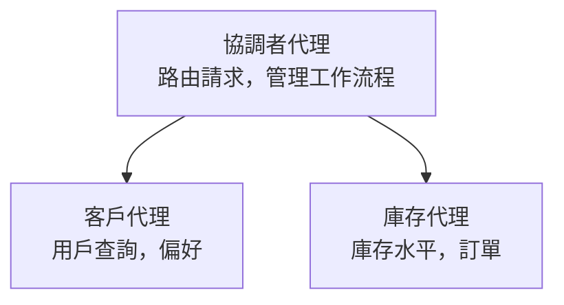

# 第五章：多代理 AI 解決方案

**📚 課程**：[AZD 初學者指南](../../README.md) | **⏱️ 時長**：2-3 小時 | **⭐ 複雜度**：進階

---

## 概覽

本章涵蓋進階多代理架構模式、代理協同編排，以及複雜場景中可投入生產的 AI 部署。

> 已於 2026 年七月使用 `azd 1.27.1` 驗證。

## 學習目標

完成本章後，您將能夠：
- 了解多代理架構模式
- 部署協同 AI 代理系統
- 實作代理間通訊
- 建構可投入生產的多代理解決方案

---

## 📚 課程列表

| # | 課程 | 描述 | 時間 |
|---|--------|-------------|------|
| 1 | [多代理基礎](multi-agent-basics.md) | 實作：用 `azd up` 部署可運作多代理應用程式 | 45 分鐘 |
| 2 | [協同模式](../chapter-06-pre-deployment/coordination-patterns.md) | 代理編排策略（續於第六章） | 30 分鐘 |
| 3 | [ARM 範本部署](../../examples/retail-multiagent-arm-template/README.md) | 一鍵部署範例 | 30 分鐘 |

> **請從課程 1 開始。** 是本章唯一完全實作可部署的課程。課程 2 在第六章（與預部署規劃共用），而[零售多代理解決方案](../../examples/retail-scenario.md)是架構藍圖—設計參考，非單命令範本。

---

## 🚀 快速開始

```bash
# 選項 1：從範本部署
azd init --template agent-openai-python-prompty
azd up

# 選項 2：從代理程式清單部署（需要 azure.ai.agents 擴充功能）
azd extension install azure.ai.agents
azd ai agent init -m agent-manifest.yaml
azd up
```

> **選擇哪種方式？** 使用 `azd init --template` 從現成範本開始。有代理清單時用 `azd ai agent init`。詳細指令請參見 [AZD AI CLI 參考](../chapter-08-production/production-ai-practices.md#azd-ai-cli-commands-and-extensions)。

---

## 🤖 多代理架構



---

## 🎯 精選解決方案：零售多代理

[零售多代理解決方案](../../examples/retail-scenario.md) 展示：

- <strong>客戶代理</strong>：處理使用者互動與偏好
- <strong>庫存代理</strong>：管理庫存與訂單處理
- <strong>編排者</strong>：協調代理間作業
- <strong>共用記憶體</strong>：跨代理上下文管理

### 使用服務

| 服務 | 用途 |
|---------|---------|
| Microsoft Foundry Models | 語言理解 |
| Azure AI Search | 產品目錄 |
| Cosmos DB | 代理狀態與記憶 |
| Container Apps | 代理主機 |
| Application Insights | 監控 |

---

## 🔗 導覽

| 導向 | 章節 |
|-----------|---------|
| <strong>上一章</strong> | [第四章：基礎建設](../chapter-04-infrastructure/README.md) |
| <strong>下一章</strong> | [第六章：預部署](../chapter-06-pre-deployment/README.md) |

---

## 📖 相關資源

- [AI 代理指南](../chapter-02-ai-development/agents.md)
- [生產 AI 實務](../chapter-08-production/production-ai-practices.md)
- [AI 疑難排解](../chapter-07-troubleshooting/ai-troubleshooting.md)

---

<!-- CO-OP TRANSLATOR DISCLAIMER START -->
**免責聲明**：
本文件由 AI 翻譯服務 [Co-op Translator](https://github.com/Azure/co-op-translator) 翻譯而成。雖然我們致力於確保準確性，但請注意，機器自動翻譯可能包含錯誤或不準確之處。原始文件的母語版本應被視為權威來源。對於重要資訊，建議進行專業人工翻譯。我們不對因使用本翻譯而產生的任何誤解或誤釋承擔責任。
<!-- CO-OP TRANSLATOR DISCLAIMER END -->