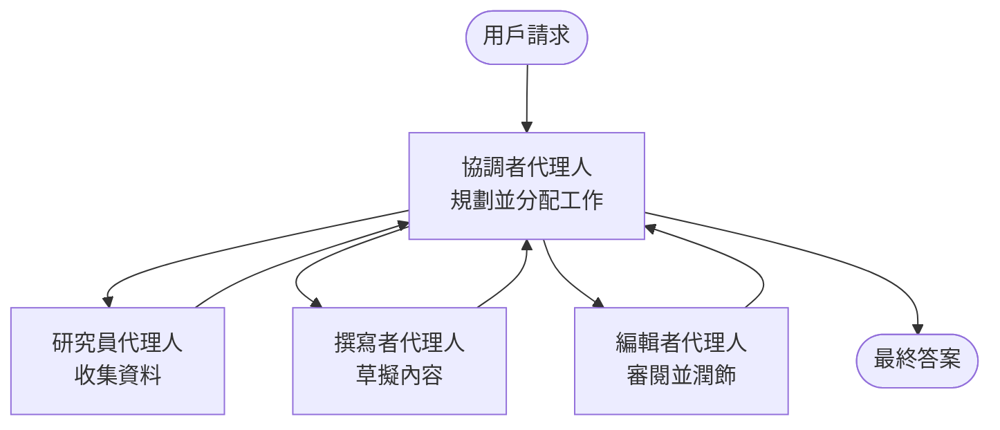

# Multi-Agent Basics - Deploy Your First Coordinated AI System

**Chapter Navigation:**
- **📚 Course Home**: [AZD For Beginners](../../README.md)
- **📖 Current Chapter**: 第 5 章 - 多代理 AI 解決方案
- **⬅️ Previous**: [Chapter 4: Infrastructure](../chapter-04-infrastructure/README.md)
- **➡️ Next**: [Coordination Patterns](../chapter-06-pre-deployment/coordination-patterns.md)

> 已於 2026 年 6 月，根據 `azd 1.25.6` 驗證。

## Introduction

在早前的章節，你已經部署了一個單一應用 — 在第 2 章你也部署了一個單一 AI 代理。本課程的下一步是：部署一個 <strong>多代理系統</strong>，由數個專門化代理協同工作，解決單一代理難以獨立處理的問題。

對初學者的好消息是：**你不需要新的命令。** 多代理解決方案仍然是一個 azd 專案。你會進行 `azd init`、`azd up`、測試，然後 `azd down` — 完全是你已經熟悉的工作流程。改變的只是應用內部的「形態」。

## Learning Goals

完成本課後，你將能：
- 了解「多代理」的含義，以及何時值得承擔額外複雜性
- 辨識多代理系統中常見的角色（協調者 + 專家）
- 使用 `azd up` 部署一個真實可運行的多代理範本
- 了解支援多代理應用的 Azure 資源
- 知道如何驗證、客製化並安全拆除該解決方案

## Learning Outcomes

完成本課程後，你將能夠：
- 解釋單一代理與多代理系統之間的差異
- 在「單一代理加工具」與「真正的多代理設計」之間做出選擇
- 使用 azd 從頭到尾部署並測試一個多代理範本
- 判別每個代理在哪裡運行以及它們如何通訊
- 清理解體所有資源以避免持續產生費用

---

## What Is a Multi-Agent System?

單一 AI 代理就是一個模型，加上一組指示，並且（可選）有一些工具。這對於聚焦的任務來說相當合適。但當任務擴大時──研究、寫作、編輯、事實查證等──把所有東西塞進一個 prompt 會讓代理變得更慢、不太可靠，也更難除錯。

一個 <strong>多代理系統</strong> 把工作拆成多個各自擅長的專家，由一個協調者負責協調：



### The two roles you'll always see

| Role | Job | Example |
|------|-----|---------|
| **Orchestrator** | Decides *what happens next* and routes work between agents | "First research, then write, then edit" |
| **Specialist** | Does one focused job and returns a result | A "researcher" that only gathers facts |

### Do you actually need multiple agents?

先從簡單做起。只有當下列情况之一成立時，才考慮使用多代理：

- ✅ 任務有 <strong>明確分階段</strong>，且不同階段需要不同指示（研究 vs. 寫作 vs. 審閱）
- ✅ 你希望專家可以 <strong>平行執行</strong> 以節省時間
- ✅ 不同步驟需要 <strong>不同的工具或資料來源</strong>
- ✅ 你需要讓每個步驟能夠 <strong>獨立測試與除錯</strong>

若你的任務只是單一問答或簡單的工具呼叫，則 <strong>單一代理加工具</strong>（第 2 章）更簡單、成本更低、也更容易操作。

> **新手提示：**「更多代理」並不代表「更好」。每增加一個代理就增加延遲、成本與新的監控項目。只有當問題明顯可以拆分成多個部分時才加代理。

---

## Two Ways to Build Multi-Agent on Azure

| Approach | What it is | Best for |
|----------|-----------|----------|
| **Single agent + tools** | One Foundry agent that calls functions/tools | 簡單工作流、入門學習 |
| **Multiple coordinated agents** | Several agents with an orchestrator | 明確分階段、平行工作、專業化分工 |

本課重點放在第二種方法，使用一個 <strong>現成範本</strong>，讓你在自己建立之前先看到真實的多代理系統運作。

---

## Hands-On: Deploy a Working Multi-Agent App

我們將部署 **Contoso Creative Writer**，這是官方的 Azure 範例，使用多個代理（researcher、writer、editor）協同產出文章。由於角色容易理解，它是很好的第一個多代理應用範例。

### Step 1: Initialize the template

```bash
# 建立一個工作資料夾
mkdir creative-writer && cd creative-writer

# 從官方多代理範本初始化
azd init --template contoso-creative-writer
```

> 隨時可以在 [Awesome AZD AI gallery](https://azure.github.io/awesome-azd/?tags=ai) 瀏覽更多多代理範本。其他適合初學者的選項包括 `get-started-with-ai-agents` 和 `azure-ai-travel-agents`。

### Step 2: Authenticate

```bash
# 為 azd 工作流程所需
azd auth login
```

### Step 3: Create an environment

```bash
azd env new dev
```

### Step 4: Preview, then deploy

```bash
# 在花任何錢之前先查看會建立什麼（建議）
azd provision --preview

# 一次過供應基礎設施並部署所有代理
azd up
```

`azd up` 會提示你選擇訂閱與區域，然後佈建 Azure 資源並部署應用。AI 部署可能比簡單 web 應用花更長時間 —— 若你部署的是較大的模型，可以延長部署逾時時間：

```bash
azd deploy --timeout 1800
```

> **關於成本與容量的小提醒：** 多代理應用會部署消耗配額並產生費用的 AI 模型。若 `azd up` 在模型配額上失敗，請參閱 [AI Troubleshooting](../chapter-07-troubleshooting/ai-troubleshooting.md) 取得區域與配額修復方法，並參考第 6 章的 [Capacity Planning](../chapter-06-pre-deployment/capacity-planning.md)。

---

## Understanding What You Deployed

像這樣的典型多代理應用會佈建一組 Azure 資源，這些資源與上方圖示中的職責直接對應：

| Resource | Why it's there |
|----------|----------------|
| **Microsoft Foundry / Models** | Hosts the language models each agent uses |
| **Azure AI Search** | Gives the researcher agent grounded data to search |
| **Container Apps** (or App Service) | Hosts the orchestrator and agent code |
| **Cosmos DB** (in some samples) | Stores shared state/memory passed between agents |
| **Application Insights** | Traces requests *across* agents so you can debug the flow |

### How the agents talk to each other

在大多數 azd 的多代理範例裡，<strong>協調者執行於應用程式程式碼中</strong>（例如使用像 Semantic Kernel 或 Microsoft Agent Framework 的框架）。協調者依序呼叫各個專家代理，傳遞結果，並組合最終答案。代理之間共享上下文的方式包括：

- **Function/tool calls** — 協調者呼叫某個專家並取得回傳結果
- **Shared memory** — 一個資料庫（通常是 Cosmos DB）保存雙方都能讀取的狀態
- **Messages/events** — 為了較鬆散的耦合，代理可透過佇列或 Service Bus 進行通訊

> **為何這對除錯很重要：** 因為每個步驟是分開的，Application Insights 可以告訴你是哪一個代理較慢或失敗。這正是把工作拆分到多個代理的主要原因之一。

---

## Verify the Deployment

在繼續之前確認系統確實可運作：

```bash
# 顯示已部署的端點
azd show

# 開啟應用程式的監控儀表板
azd monitor

# 如果出現異常就即時追蹤日誌
azd monitor --logs
```

然後從 `azd show` 開啟應用的 URL，並嘗試一個會讓所有代理參與的請求（對 Creative Writer，請求它就某個主題寫一篇短文章）。在 Application Insights 的 **transaction search** 中，你應該會看到請求在 researcher、writer 與 editor 步驟之間擴散的紀錄。

**成功準則：**
- ✅ `azd show` 列出一個可到達的端點
- ✅ 一個請求產生的結果明確經過多個階段
- ✅ Application Insights 顯示超過一個代理步驟的追蹤

---

## Customize: Add or Adjust an Agent

因為每個代理只是指令加上工具，所以客製化是可行的：

1. <strong>在範本中找到代理定義</strong>（通常是在 `prompts/`、`agents/`，或一組 `*.prompty` 檔案）。
2. <strong>調整代理指示</strong> — 例如，告訴 editor 代理強制特定語氣或字數。
3. <strong>只重新部署程式碼</strong>（基礎架構保持不變）：

   ```bash
   azd deploy
   ```

如要更進一步並從你自己的宣告檔建立代理，請使用 agent extension 及其完整生命週期：

```bash
azd extension install azure.ai.agents
azd ai agent init -m agent-manifest.yaml
azd up
azd ai agent invoke      # 測試，附有回應時間
```

參見 [Chapter 2: Agents](../chapter-02-ai-development/agents.md) 以及 [AZD AI CLI reference](../chapter-08-production/production-ai-practices.md#azd-ai-cli-commands-and-extensions) 以了解完整的代理生命週期（`invoke`、`eval generate`、`optimize`、`delete`）。

---

## Clean Up

多代理應用會運行多個會產生費用的服務。完成後請把所有東西拆掉：

```bash
azd down --force --purge
```

`--purge` 標誌也會移除軟刪除的 AI 資源（像 Foundry/Azure AI Services 帳戶），以免它們阻礙未來重新部署或繼續產生費用。

---

## A Note on Production Multi-Agent Systems

本 repo 中的 [Retail Multi-Agent Solution](../../examples/retail-scenario.md) 是一個 <strong>架構藍圖</strong>，而不是一個一鍵式的範本——它記錄了生產零售系統 <em>應該</em> 如何建置（並明確指出完整構建是一項重大工程）。在你部署了可運行的範例之後，可把它當作設計參考。關於生產環境的考量（韌性、成本、監控、治理），請繼續參閱 [Chapter 8: Production AI Practices](../chapter-08-production/production-ai-practices.md)。

---

## Summary

- 多代理系統把工作分配給由協調者協調的專家。
- 只有在任務具有明確分階段、可平行處理或每個步驟需要不同工具時才使用它；否則優先考慮單一代理。
- azd 的工作流程不變：`azd init` → `azd up` → 測試 → `azd down`。
- 像 `contoso-creative-writer` 這樣的真實範本讓你今天就能看到並客製化一個可運行的多代理應用。
- 跨代理的 Application Insights 追蹤是多代理設計最大的實務好處之一。

---

## 🔗 Navigation

| Direction | Lesson |
|-----------|--------|
| **Previous** | [Chapter 4: Infrastructure](../chapter-04-infrastructure/README.md) |
| **Next** | [Coordination Patterns](../chapter-06-pre-deployment/coordination-patterns.md) |

## 📖 Related Resources

- [AI Agents Guide](../chapter-02-ai-development/agents.md)
- [Coordination Patterns](../chapter-06-pre-deployment/coordination-patterns.md)
- [Production AI Practices](../chapter-08-production/production-ai-practices.md)
- [AI Troubleshooting](../chapter-07-troubleshooting/ai-troubleshooting.md)

---

<!-- CO-OP TRANSLATOR DISCLAIMER START -->
**免責聲明**：
本文件由 AI 翻譯服務 [Co-op Translator](https://github.com/Azure/co-op-translator) 翻譯而成。雖然我們致力於確保準確性，但請注意，機器自動翻譯可能包含錯誤或不準確之處。原始文件的母語版本應被視為權威來源。對於重要資訊，建議進行專業人工翻譯。我們不對因使用本翻譯而產生的任何誤解或誤釋承擔責任。
<!-- CO-OP TRANSLATOR DISCLAIMER END -->