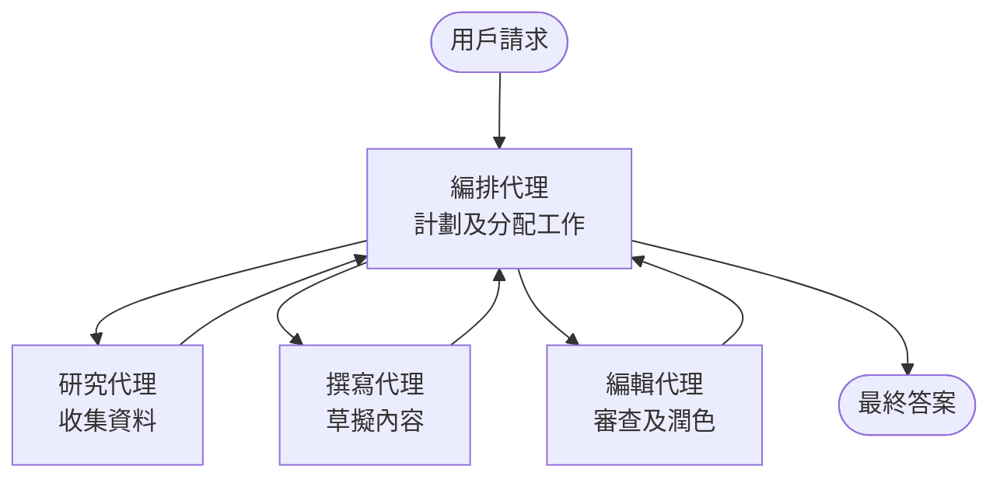

# 多代理基礎 - 部署你的第一個協調 AI 系統

**章節導航：**
- **📚 課程首頁**: [AZD 初學者指南](../../README.md)
- **📖 本章內容**: 第五章 - 多代理 AI 解決方案
- **⬅️ 上一章**: [第四章：基礎架構](../chapter-04-infrastructure/README.md)
- **➡️ 下一章**: [協調模式](../chapter-06-pre-deployment/coordination-patterns.md)

> 於 2026 年 7 月以 `azd 1.27.1` 驗證通過。

## 簡介

在前面章節中，你部署了一個單一應用程式—而在第二章中你部署了一個單獨的 AI 代理。本課程將邁出下一步：部署一個<strong>多代理系統</strong>，讓多個專門的代理一起協作，解決單一代理無法單獨有效處理的問題。

對初學者來說的好消息是：**你不需要學習新指令。** 多代理方案依然是 azd 專案。你會使用 `azd init`、`azd up`、測試，再 `azd down`—這和你已經知道的工作流程完全相同。改變的是內部應用程式的<em>架構</em>。

## 學習目標

完成本課後，你將能夠：
- 了解「多代理」的意義以及何時適合採用較高複雜度
- 辨識多代理系統中常見的角色（協調者 + 專家）
- 使用 `azd up` 部署一個真正可用的多代理範本
- 理解支援多代理應用程式的 Azure 資源
- 知道如何安全地驗證、自訂與拆除方案

## 學習成果

完成本課後，你將能夠：
- 說明單一代理和多代理系統的差異
- 在單一代理搭配工具與真正多代理設計間做出選擇
- 使用 azd 完成多代理範本的端到端部署與測試
- 辨識每個代理運行的位置及它們如何溝通
- 清理所有資源以避免持續產生費用

---

## 什麼是多代理系統？

單一 AI 代理是一個模型搭配一組指令以及（可選擇）一些工具。這對於專注任務很有效。但隨著任務增大─研究、寫作、校對、事實核查─把所有內容塞入一個提示會讓代理變得更慢、更不可靠且較難除錯。

<strong>多代理系統</strong>將工作分割成由協調者安排的專門角色：



### 你會常見的兩個角色

| 角色 | 任務 | 範例 |
|------|-----|---------|
| <strong>協調者</strong> | 決定<em>下一步要做什麼</em>並在代理間分配工作 | 「先研究、再寫作、最後校對」 |
| <strong>專家</strong> | 專注於做好一項任務並回傳結果 | 專門收集資料的「研究員」 |

### 你真的需要多個代理嗎？

從簡單開始。當以下情況之一成立時，才考慮使用多代理：

- ✅ 任務有<strong>明顯階段</strong>，每階段受益於不同指令（研究 vs. 寫作 vs. 校閱）
- ✅ 想讓專家<strong>平行作業</strong>以節省時間
- ✅ 不同步驟需要<strong>不同工具或資料來源</strong>
- ✅ 需要每步驟都<strong>能獨立測試和除錯</strong>

如果你的任務是單一問答或簡單的工具呼叫，<strong>搭配工具的單一代理</strong>（第二章）比較簡單、便宜且易於操作。

> **初學者小提醒：**「代理越多」不代表「越好」。每個代理都會增加延遲、成本和監控項目。只有當問題明確分成多部分時，才新增代理。

---

## 在 Azure 上建構多代理的兩種方式

| 方法 | 內容 | 適合場景 |
|----------|-----------|----------|
| **單一代理 + 工具** | 一個 Foundry 代理呼叫函數/工具 | 簡單流程，入門使用 |
| <strong>多個協調代理</strong> | 多個代理由協調者管理 | 明確階段、平行工作、專業分工 |

本課程聚焦第二種方法，使用<strong>現成範本</strong>，你可以先看到一個真實運行的多代理系統，然後再自行建立。

---

## 實作：部署一個多代理應用程式

我們將部署 **Contoso Creative Writer**，一個官方 Azure 範例，使用多個代理（研究員、作者、編輯）協同完成文章寫作。它是很好的多代理入門應用，角色容易理解。

### 步驟 1：初始化範本

```bash
# 建立一個工作資料夾
mkdir creative-writer && cd creative-writer

# 從官方多代理範本進行初始化
azd init --template contoso-creative-writer
```

> 你可以隨時在 [Awesome AZD AI gallery](https://azure.github.io/awesome-azd/?tags=ai) 瀏覽更多多代理範本。其他對初學者友善的選項包含 `get-started-with-ai-agents` 和 `azure-ai-travel-agents`。

### 步驟 2：驗證身份

```bash
# azd 工作流程所需
azd auth login
```

### 步驟 3：建立環境

```bash
azd env new dev
```

### 步驟 4：預覽，然後部署

```bash
# 在花費任何費用前先查看將會創建甚麼（建議）
azd provision --preview

# 一步完成基礎設施配置及所有代理部署
azd up
```

`azd up` 將提示你選擇訂閱和區域，接著會配置 Azure 資源並部署應用程式。AI 部署可能比普通網頁應用要花更長時間—如果你部署較大型模型，可以延長部署等待時間：

```bash
azd deploy --timeout 1800
```

> **關於成本與容量提醒：** 多代理應用部署 AI 模型需用配額並產生成本。如果 `azd up` 因模型配額失敗，請參考 [AI 疑難排解](../chapter-07-troubleshooting/ai-troubleshooting.md) 中的區域與配額調整，及第六章的 [容量規劃](../chapter-06-pre-deployment/capacity-planning.md)。

---

## 理解你部署的內容

一般這類多代理應用會配置一組 Azure 資源，與上圖中各職責直接對應：

| 資源 | 用途 |
|----------|----------------|
| **Microsoft Foundry / 模型** | 托管每個代理使用的語言模型 |
| **Azure AI 搜尋** | 提供研究員代理可以檢索的依據資料 |
| **Container Apps** (或 App Service) | 托管協調者與代理程式碼 |
| **Cosmos DB** (部分範例) | 儲存代理間共享的狀態／記憶資料 |
| **Application Insights** | 追蹤跨代理的請求，以便除錯流程 |

### 代理如何彼此溝通

大多數 azd 多代理範例中，<strong>協調者運行在你的應用程式碼中</strong>（例如用 Semantic Kernel 或 Microsoft Agent Framework 等框架）。協調者輪流呼叫專家代理，傳遞結果，組裝最終答案。代理間共享上下文方式有：

- **函數／工具呼叫** — 協調者調用專家代理並獲得結果
- <strong>共享記憶體</strong> — 使用資料庫（通常是 Cosmos DB）存取雙方均可讀取的狀態
- **訊息／事件** — 為鬆散耦合，代理間透過佇列或 Service Bus 通訊

> **這對除錯的重要性：** 因為每個步驟都是獨立的，Application Insights 可以告訴你到底是哪個代理變慢或失敗。這就是最初決定將工作拆分給多代理的主要原因。

---

## 驗證部署是否成功

在繼續之前，先確認系統實際在運作：

```bash
# 顯示已部署的端點
azd show

# 打開應用程式的監控儀表板
azd monitor

# 如果有異常，追蹤記錄檔
azd monitor --logs
```

接著從 `azd show` 拿到應用程式網址，嘗試一個可觸發所有代理的請求（例如在 Creative Writer 寫一篇指定主題的短文）。在 Application Insights 的<strong>交易搜尋</strong>中，應該看到請求分散至研究員、作者和編輯步驟。

**成功條件：**
- ✅ `azd show` 顯示可訪問的端點
- ✅ 一個請求結果明顯經過多階段處理
- ✅ Application Insights 顯示多於一個代理步驟的追蹤紀錄

---

## 自訂：新增或調整代理

由於每個代理就是指令加工具，自訂相對容易：

1. <strong>找到範本中的代理定義</strong>（通常在 `prompts/`、`agents/` 或 `*.prompty` 等檔案集）
2. <strong>調整代理指令</strong> — 例如告訴編輯代理做出特定語氣或字數限制
3. <strong>只部署程式碼</strong> 而基礎架構保持不變：

   ```bash
   azd deploy
   ```

若要進一步從<em>你自己的</em> manifest 建立代理，使用代理擴充與其完整生命週期：

```bash
azd extension install azure.ai.agents
azd ai agent init -m agent-manifest.yaml
azd up
azd ai agent invoke      # 測試，連同回應時間
```

詳見[第二章：代理](../chapter-02-ai-development/agents.md)與[AZD AI CLI 參考](../chapter-08-production/production-ai-practices.md#azd-ai-cli-commands-and-extensions)關於完整代理生命週期（`invoke`、`eval generate`、`optimize`、`delete`）。

---

## 清理資源

多代理應用會運作多個計費服務，使用完畢後請全部拆除：

```bash
azd down --force --purge
```

`--purge` 參數還會移除軟刪除的 AI 資源（例如 Foundry/Azure AI Services 帳戶），避免未來部署受阻或持續產生成本。

---

## 關於生產環境的多代理系統說明

此資源庫中的 [零售多代理方案](../../examples/retail-scenario.md) 是一個<strong>架構藍圖</strong>，非一鍵式範本—它說明正式生產的零售系統<em>應該</em>如何建置（並明確指出完整建置是一項龐大工程）。在你部署過此處工作範本後，可用它做設計參考。若要了解生產環境需求（韌性、成本、監控、治理），請繼續參閱[第八章：生產 AI 實務](../chapter-08-production/production-ai-practices.md)。

---

## 摘要

- 多代理系統將工作分配給專業代理，並由一名協調者負責協調。
- 只有在任務有明確階段、平行工作或每步不同工具時使用，否則建議用單一代理。
- azd 工作流程不變：`azd init` → `azd up` → 測試 → `azd down`。
- 真實範本如 `contoso-creative-writer` 現在就能讓你體驗並自訂運作中的多代理應用。
- 跨代理的 Application Insights 追蹤是多代理設計帶來的重要實務好處。

---

## 🔗 導覽

| 方向 | 課程 |
|-----------|--------|
| <strong>上一章</strong> | [第四章：基礎架構](../chapter-04-infrastructure/README.md) |
| <strong>下一章</strong> | [協調模式](../chapter-06-pre-deployment/coordination-patterns.md) |

## 📖 相關資源

- [AI 代理指南](../chapter-02-ai-development/agents.md)
- [協調模式](../chapter-06-pre-deployment/coordination-patterns.md)
- [生產 AI 實務](../chapter-08-production/production-ai-practices.md)
- [AI 疑難排解](../chapter-07-troubleshooting/ai-troubleshooting.md)

---

<!-- CO-OP TRANSLATOR DISCLAIMER START -->
**免責聲明**：
本文件由 AI 翻譯服務 [Co-op Translator](https://github.com/Azure/co-op-translator) 翻譯而成。雖然我們致力於確保準確性，但請注意，機器自動翻譯可能包含錯誤或不準確之處。原始文件的母語版本應被視為權威來源。對於重要資訊，建議進行專業人工翻譯。我們不對因使用本翻譯而產生的任何誤解或誤釋承擔責任。
<!-- CO-OP TRANSLATOR DISCLAIMER END -->