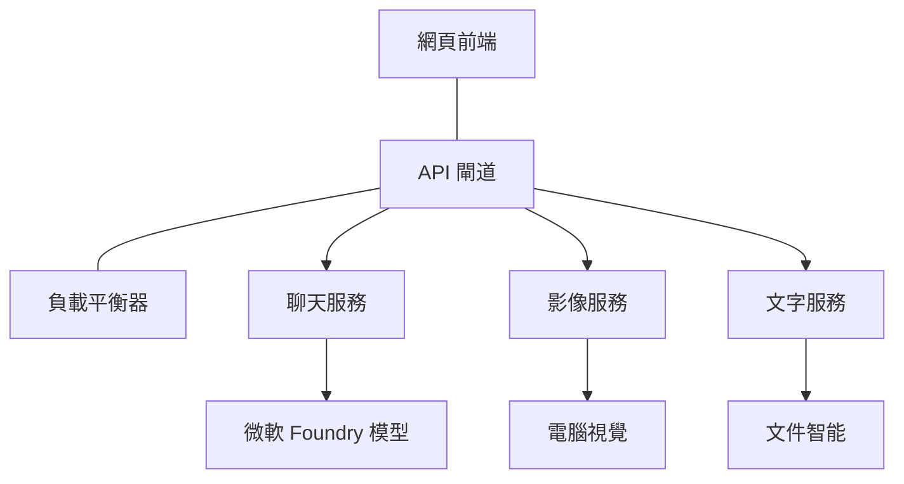

# Production AI Workload Best Practices with AZD

**Chapter Navigation:**
- **📚 Course Home**: [AZD For Beginners](../../README.md)
- **📖 Current Chapter**: Chapter 8 - Production & Enterprise Patterns
- **⬅️ Previous Chapter**: [Chapter 7: Troubleshooting](../chapter-07-troubleshooting/debugging.md)
- **⬅️ Also Related**: [AI Workshop Lab](ai-workshop-lab.md)
- **🎯 Course Complete**: [AZD For Beginners](../../README.md)

## Overview

本指南提供使用 Azure Developer CLI (AZD) 部署生產級 AI 工作負載的完整最佳實踐。根據 Microsoft Foundry Discord 社群反饋及實際客戶部署經驗，這些實踐針對生產 AI 系統中最常見的挑戰提供解決方案。

## Key Challenges Addressed

根據我們的社群投票結果，開發人員面臨的主要挑戰如下：

- **45%** 在多服務 AI 部署上遇到困難
- **38%** 在憑證和機密管理上有問題  
- **35%** 認為生產就緒性與擴展困難
- **32%** 需要更好的成本優化策略
- **29%** 需要改進監控與故障排除

## Architecture Patterns for Production AI

### Pattern 1: Microservices AI Architecture

<strong>何時使用</strong>：具備多種能力的複雜 AI 應用程式



**AZD Implementation**：

```yaml
# azure.yaml
name: enterprise-ai-platform
services:
  web:
    project: ./web
    host: staticwebapp
  api-gateway:
    project: ./api-gateway
    host: containerapp
  chat-service:
    project: ./services/chat
    host: containerapp
  vision-service:
    project: ./services/vision
    host: containerapp
  text-service:
    project: ./services/text
    host: containerapp
```

### Pattern 2: Event-Driven AI Processing

<strong>何時使用</strong>：批次處理、文件分析、異步工作流程

```bicep
// Event Hub for AI processing pipeline
resource eventHub 'Microsoft.EventHub/namespaces@2023-01-01-preview' = {
  name: eventHubNamespaceName
  location: location
  sku: {
    name: 'Standard'
    tier: 'Standard'
    capacity: 1
  }
}

// Service Bus for reliable message processing
resource serviceBus 'Microsoft.ServiceBus/namespaces@2022-10-01-preview' = {
  name: serviceBusNamespaceName
  location: location
  sku: {
    name: 'Premium'
    tier: 'Premium'
    capacity: 1
  }
}

// Function App for processing
resource functionApp 'Microsoft.Web/sites@2023-01-01' = {
  name: functionAppName
  location: location
  kind: 'functionapp,linux'
  properties: {
    siteConfig: {
      appSettings: [
        {
          name: 'FUNCTIONS_EXTENSION_VERSION'
          value: '~4'
        }
        {
          name: 'AZURE_OPENAI_ENDPOINT'
          value: '@Microsoft.KeyVault(VaultName=${keyVault.name};SecretName=openai-endpoint)'
        }
      ]
    }
  }
}
```

## Thinking About AI Agent Health

當傳統網頁應用程式故障時，症狀很明顯：頁面無法載入、API 回傳錯誤，或部署失敗。AI 驅動的應用程式可能會以相同方式故障，但也可能以較微妙的方式異常，且不會產生明顯錯誤訊息。

本節協助您建立 AI 工作負載監控的心智模型，讓您在異常時知道應該往哪裡找。

### How Agent Health Differs from Traditional App Health

傳統應用程式要麼正常運作，要麼就不運作。AI 代理程式可能看起來正常運作，但產生不理想的結果。可將代理程序健康狀態視為兩層：

| 層級 | 應關注項目 | 應查看位置 |
|-------|--------------|---------------|
| <strong>基礎設施健康</strong> | 服務是否運行中？資源是否已配置？端點是否可達？ | `azd monitor`、Azure 入口網站資源健康狀態、容器/應用程式日誌 |
| <strong>行為健康</strong> | 代理是否準確回應？回應是否及時？模型呼叫是否正確？ | Application Insights 追蹤、模型呼叫延遲指標、回應品質日誌 |

基礎設施健康是熟悉的，對任何 azd 應用程式都相同。行為健康則是 AI 工作負載新增的層級。

### Where to Look When AI Apps Don't Behave as Expected

如果您的 AI 應用程式未產生預期結果，以下是概念性的檢查清單：

1. **先從基本項目開始。** 應用程式在運行嗎？能連接其依賴服務嗎？像一般應用程式一樣檢查 `azd monitor` 和資源健康狀態。
2. **檢查模型連接。** 應用程式是否成功呼叫 AI 模型？失敗或逾時的模型呼叫為 AI 應用問題最常見原因，會在應用程式日誌中顯示。
3. **查看模型接收到的資料。** AI 的回應依賴於輸入（提示及檢索到的上下文）。若輸出錯誤，通常是輸入錯誤。檢查您的應用程式是否將正確數據發送給模型。
4. **檢視回應延遲。** AI 模型呼叫比典型 API 呼叫慢。如果您的應用程式感覺遲緩，檢查模型回應時間是否增加—這可能表示節流、容量限制或區域級別擁塞。
5. **注意成本訊號。** 突增的代幣使用量或 API 呼叫數量可能表示迴圈、提示配置錯誤或過度重試。

您不需要立刻掌握可觀察性工具。關鍵是：AI 應用程式多了一層行為監控，azd 內建監控 (`azd monitor`) 為您調查兩個層面提供起點。

---

## Security Best Practices

### 1. 零信任安全模型

<strong>實作策略</strong>：
- 無驗證不允許服務間通訊
- 所有 API 呼叫均使用受管身份
- 私有端點的網路隔離
- 最小權限存取控制

```bicep
// Managed Identity for each service
resource chatServiceIdentity 'Microsoft.ManagedIdentity/userAssignedIdentities@2023-01-31' = {
  name: 'chat-service-identity'
  location: location
}

// Role assignments with minimal permissions
resource openAIUserRole 'Microsoft.Authorization/roleAssignments@2022-04-01' = {
  scope: openAIAccount
  name: guid(openAIAccount.id, chatServiceIdentity.id, openAIUserRoleDefinitionId)
  properties: {
    roleDefinitionId: subscriptionResourceId('Microsoft.Authorization/roleDefinitions', '5e0bd9bd-7b93-4f28-af87-19fc36ad61bd')
    principalId: chatServiceIdentity.properties.principalId
    principalType: 'ServicePrincipal'
  }
}
```

### 2. 安全的機密管理

**Key Vault 整合模式**：

```bicep
// Key Vault with proper access policies
resource keyVault 'Microsoft.KeyVault/vaults@2023-02-01' = {
  name: keyVaultName
  location: location
  properties: {
    tenantId: tenant().tenantId
    sku: {
      family: 'A'
      name: 'premium'  // Use premium for production
    }
    enableRbacAuthorization: true  // Use RBAC instead of access policies
    enablePurgeProtection: true    // Prevent accidental deletion
    enableSoftDelete: true
    softDeleteRetentionInDays: 90
  }
}

// Store all AI service credentials
resource openAIKeySecret 'Microsoft.KeyVault/vaults/secrets@2023-02-01' = {
  parent: keyVault
  name: 'openai-api-key'
  properties: {
    value: openAIAccount.listKeys().key1
    attributes: {
      enabled: true
    }
  }
}
```

### 3. 網路安全

<strong>私有端點配置</strong>：

```bicep
// Virtual Network for AI services
resource virtualNetwork 'Microsoft.Network/virtualNetworks@2023-04-01' = {
  name: vnetName
  location: location
  properties: {
    addressSpace: {
      addressPrefixes: ['10.0.0.0/16']
    }
    subnets: [
      {
        name: 'ai-services-subnet'
        properties: {
          addressPrefix: '10.0.1.0/24'
          privateEndpointNetworkPolicies: 'Disabled'
        }
      }
      {
        name: 'app-services-subnet'
        properties: {
          addressPrefix: '10.0.2.0/24'
          delegations: [
            {
              name: 'Microsoft.Web/serverFarms'
              properties: {
                serviceName: 'Microsoft.Web/serverFarms'
              }
            }
          ]
        }
      }
    ]
  }
}

// Private endpoints for all AI services
resource openAIPrivateEndpoint 'Microsoft.Network/privateEndpoints@2023-04-01' = {
  name: '${openAIAccountName}-pe'
  location: location
  properties: {
    subnet: {
      id: virtualNetwork.properties.subnets[0].id
    }
    privateLinkServiceConnections: [
      {
        name: 'openai-connection'
        properties: {
          privateLinkServiceId: openAIAccount.id
          groupIds: ['account']
        }
      }
    ]
  }
}
```

## Performance and Scaling

### 1. 自動擴展策略

**Container Apps 自動擴展**：

```bicep
resource containerApp 'Microsoft.App/containerApps@2023-05-01' = {
  name: containerAppName
  location: location
  properties: {
    configuration: {
      ingress: {
        external: true
        targetPort: 8000
        transport: 'http'
      }
    }
    template: {
      scale: {
        minReplicas: 2  // Always have 2 instances minimum
        maxReplicas: 50 // Scale up to 50 for high load
        rules: [
          {
            name: 'http-scaling'
            http: {
              metadata: {
                concurrentRequests: '20'  // Scale when >20 concurrent requests
              }
            }
          }
          {
            name: 'cpu-scaling'
            custom: {
              type: 'cpu'
              metadata: {
                type: 'Utilization'
                value: '70'  // Scale when CPU >70%
              }
            }
          }
        ]
      }
    }
  }
}
```

### 2. 快取策略

**針對 AI 回應的 Redis 快取**：

```bicep
// Redis Premium for production workloads
resource redisCache 'Microsoft.Cache/redis@2023-04-01' = {
  name: redisCacheName
  location: location
  properties: {
    sku: {
      name: 'Premium'
      family: 'P'
      capacity: 1
    }
    enableNonSslPort: false
    minimumTlsVersion: '1.2'
    redisConfiguration: {
      'maxmemory-policy': 'allkeys-lru'
    }
    // Enable clustering for high availability
    redisVersion: '6.0'
    shardCount: 2
  }
}

// Cache configuration in application
var cacheConnectionString = '${redisCache.properties.hostName}:6380,password=${redisCache.listKeys().primaryKey},ssl=True,abortConnect=False'
```

### 3. 負載平衡與流量管理

**搭配 WAF 的應用閘道**：

```bicep
// Application Gateway with Web Application Firewall
resource applicationGateway 'Microsoft.Network/applicationGateways@2023-04-01' = {
  name: appGatewayName
  location: location
  properties: {
    sku: {
      name: 'WAF_v2'
      tier: 'WAF_v2'
      capacity: 2
    }
    webApplicationFirewallConfiguration: {
      enabled: true
      firewallMode: 'Prevention'
      ruleSetType: 'OWASP'
      ruleSetVersion: '3.2'
    }
    // Backend pools for AI services
    backendAddressPools: [
      {
        name: 'ai-services-pool'
        properties: {
          backendAddresses: [
            {
              fqdn: '${containerApp.properties.configuration.ingress.fqdn}'
            }
          ]
        }
      }
    ]
  }
}
```

## 💰 成本優化

### 1. 資源合理配置

<strong>環境特定配置</strong>：

```bash
# 開發環境
azd env new development
azd env set AZURE_OPENAI_SKU "S0"
azd env set AZURE_OPENAI_CAPACITY 10
azd env set AZURE_SEARCH_SKU "basic"
azd env set CONTAINER_CPU 0.5
azd env set CONTAINER_MEMORY 1.0

# 生產環境
azd env new production
azd env set AZURE_OPENAI_SKU "S0"
azd env set AZURE_OPENAI_CAPACITY 100
azd env set AZURE_SEARCH_SKU "standard"
azd env set CONTAINER_CPU 2.0
azd env set CONTAINER_MEMORY 4.0
```

### 2. 成本監控與預算

```bicep
// Cost management and budgets
resource budget 'Microsoft.Consumption/budgets@2023-05-01' = {
  name: 'ai-workload-budget'
  properties: {
    timePeriod: {
      startDate: '2024-01-01'
      endDate: '2024-12-31'
    }
    timeGrain: 'Monthly'
    amount: 2000  // $2000 monthly budget
    category: 'Cost'
    notifications: {
      warning: {
        enabled: true
        operator: 'GreaterThan'
        threshold: 80
        contactEmails: [
          'finance@company.com'
          'engineering@company.com'
        ]
        contactRoles: [
          'Owner'
          'Contributor'
        ]
      }
      critical: {
        enabled: true
        operator: 'GreaterThan'
        threshold: 95
        contactEmails: [
          'cto@company.com'
        ]
      }
    }
  }
}
```

### 3. 代幣使用優化

**OpenAI 成本管理**：

```typescript
// 應用層級嘅字元優化
class TokenOptimizer {
  private readonly maxTokens = 4000;
  private readonly reserveTokens = 500;
  
  optimizePrompt(userInput: string, context: string): string {
    const availableTokens = this.maxTokens - this.reserveTokens;
    const estimatedTokens = this.estimateTokens(userInput + context);
    
    if (estimatedTokens > availableTokens) {
      // 截斷上下文，唔係用戶輸入
      context = this.truncateContext(context, availableTokens - this.estimateTokens(userInput));
    }
    
    return `${context}\n\nUser: ${userInput}`;
  }
  
  private estimateTokens(text: string): number {
    // 粗略估計：1 個字元 ≈ 4 個字符
    return Math.ceil(text.length / 4);
  }
}
```

## Monitoring and Observability

### 1. 全面性的 Application Insights

```bicep
// Application Insights with advanced features
resource applicationInsights 'Microsoft.Insights/components@2020-02-02' = {
  name: applicationInsightsName
  location: location
  kind: 'web'
  properties: {
    Application_Type: 'web'
    WorkspaceResourceId: logAnalyticsWorkspace.id
    SamplingPercentage: 100  // Full sampling for AI apps
    DisableIpMasking: false  // Enable for security
  }
}

// Custom metrics for AI operations
resource aiMetricAlerts 'Microsoft.Insights/metricAlerts@2018-03-01' = {
  name: 'ai-high-error-rate'
  location: 'global'
  properties: {
    description: 'Alert when AI service error rate is high'
    severity: 2
    enabled: true
    scopes: [
      applicationInsights.id
    ]
    evaluationFrequency: 'PT1M'
    windowSize: 'PT5M'
    criteria: {
      'odata.type': 'Microsoft.Azure.Monitor.SingleResourceMultipleMetricCriteria'
      allOf: [
        {
          name: 'high-error-rate'
          metricName: 'requests/failed'
          operator: 'GreaterThan'
          threshold: 10
          timeAggregation: 'Count'
        }
      ]
    }
  }
}
```

### 2. AI 專屬監控

**AI 指標的自訂儀表板**：

```json
// Dashboard configuration for AI workloads
{
  "dashboard": {
    "name": "AI Application Monitoring",
    "tiles": [
      {
        "name": "OpenAI Request Volume",
        "query": "requests | where name contains 'openai' | summarize count() by bin(timestamp, 5m)"
      },
      {
        "name": "AI Response Latency",
        "query": "requests | where name contains 'openai' | summarize avg(duration) by bin(timestamp, 5m)"
      },
      {
        "name": "Token Usage",
        "query": "customMetrics | where name == 'openai_tokens_used' | summarize sum(value) by bin(timestamp, 1h)"
      },
      {
        "name": "Cost per Hour",
        "query": "customMetrics | where name == 'openai_cost' | summarize sum(value) by bin(timestamp, 1h)"
      }
    ]
  }
}
```

### 3. 健康檢查與正常運作時間監控

```bicep
// Application Insights availability tests
resource availabilityTest 'Microsoft.Insights/webtests@2022-06-15' = {
  name: 'ai-app-availability-test'
  location: location
  tags: {
    'hidden-link:${applicationInsights.id}': 'Resource'
  }
  properties: {
    SyntheticMonitorId: 'ai-app-availability-test'
    Name: 'AI Application Availability Test'
    Description: 'Tests AI application endpoints'
    Enabled: true
    Frequency: 300  // 5 minutes
    Timeout: 120    // 2 minutes
    Kind: 'ping'
    Locations: [
      {
        Id: 'us-east-2-azr'
      }
      {
        Id: 'us-west-2-azr'
      }
    ]
    Configuration: {
      WebTest: '''
        <WebTest Name="AI Health Check" 
                 Id="8d2de8d2-a2b0-4c2e-9a0d-8f9c9a0b8c8d" 
                 Enabled="True" 
                 CssProjectStructure="" 
                 CssIteration="" 
                 Timeout="120" 
                 WorkItemIds="" 
                 xmlns="http://microsoft.com/schemas/VisualStudio/TeamTest/2010" 
                 Description="" 
                 CredentialUserName="" 
                 CredentialPassword="" 
                 PreAuthenticate="True" 
                 Proxy="default" 
                 StopOnError="False" 
                 RecordedResultFile="" 
                 ResultsLocale="">
          <Items>
            <Request Method="GET" 
                     Guid="a5f10126-e4cd-570d-961c-cea43999a200" 
                     Version="1.1" 
                     Url="${webApp.properties.defaultHostName}/health" 
                     ThinkTime="0" 
                     Timeout="120" 
                     ParseDependentRequests="True" 
                     FollowRedirects="True" 
                     RecordResult="True" 
                     Cache="False" 
                     ResponseTimeGoal="0" 
                     Encoding="utf-8" 
                     ExpectedHttpStatusCode="200" 
                     ExpectedResponseUrl="" 
                     ReportingName="" 
                     IgnoreHttpStatusCode="False" />
          </Items>
        </WebTest>
      '''
    }
  }
}
```

## Disaster Recovery and High Availability

### 1. 多區域部署

```yaml
# azure.yaml - Multi-region configuration
name: ai-app-multiregion
services:
  api-primary:
    project: ./api
    host: containerapp
    env:
      - AZURE_REGION=eastus
  api-secondary:
    project: ./api
    host: containerapp
    env:
      - AZURE_REGION=westus2
```

```bicep
// Traffic Manager for global load balancing
resource trafficManager 'Microsoft.Network/trafficManagerProfiles@2022-04-01' = {
  name: trafficManagerProfileName
  location: 'global'
  properties: {
    profileStatus: 'Enabled'
    trafficRoutingMethod: 'Priority'
    dnsConfig: {
      relativeName: trafficManagerProfileName
      ttl: 30
    }
    monitorConfig: {
      protocol: 'HTTPS'
      port: 443
      path: '/health'
      intervalInSeconds: 30
      toleratedNumberOfFailures: 3
      timeoutInSeconds: 10
    }
    endpoints: [
      {
        name: 'primary-endpoint'
        type: 'Microsoft.Network/trafficManagerProfiles/azureEndpoints'
        properties: {
          targetResourceId: primaryAppService.id
          endpointStatus: 'Enabled'
          priority: 1
        }
      }
      {
        name: 'secondary-endpoint'
        type: 'Microsoft.Network/trafficManagerProfiles/azureEndpoints'
        properties: {
          targetResourceId: secondaryAppService.id
          endpointStatus: 'Enabled'
          priority: 2
        }
      }
    ]
  }
}
```

### 2. 資料備份與恢復

```bicep
// Backup configuration for critical data
resource backupVault 'Microsoft.DataProtection/backupVaults@2023-05-01' = {
  name: backupVaultName
  location: location
  identity: {
    type: 'SystemAssigned'
  }
  properties: {
    storageSettings: [
      {
        datastoreType: 'VaultStore'
        type: 'LocallyRedundant'
      }
    ]
  }
}

// Backup policy for AI models and data
resource backupPolicy 'Microsoft.DataProtection/backupVaults/backupPolicies@2023-05-01' = {
  parent: backupVault
  name: 'ai-data-backup-policy'
  properties: {
    policyRules: [
      {
        backupParameters: {
          backupType: 'Full'
          objectType: 'AzureBackupParams'
        }
        trigger: {
          schedule: {
            repeatingTimeIntervals: [
              'R/2024-01-01T02:00:00+00:00/P1D'  // Daily at 2 AM
            ]
          }
          objectType: 'ScheduleBasedTriggerContext'
        }
        dataStore: {
          datastoreType: 'VaultStore'
          objectType: 'DataStoreInfoBase'
        }
        name: 'BackupDaily'
        objectType: 'AzureBackupRule'
      }
    ]
  }
}
```

## DevOps and CI/CD Integration

### 1. GitHub Actions 工作流程

```yaml
# .github/workflows/deploy-ai-app.yml
name: Deploy AI Application

on:
  push:
    branches: [main]
  pull_request:
    branches: [main]

jobs:
  test:
    runs-on: ubuntu-latest
    steps:
      - uses: actions/checkout@v4
      
      - name: Setup Python
        uses: actions/setup-python@v4
        with:
          python-version: '3.11'
          
      - name: Install dependencies
        run: |
          pip install -r requirements.txt
          pip install pytest
          
      - name: Run tests
        run: pytest tests/
        
      - name: AI Safety Tests
        run: |
          python scripts/test_ai_safety.py
          python scripts/validate_prompts.py

  deploy-staging:
    needs: test
    if: github.event_name == 'pull_request'
    runs-on: ubuntu-latest
    steps:
      - uses: actions/checkout@v4
      
      - name: Setup AZD
        uses: Azure/setup-azd@v2
        
      - name: Login to Azure
        uses: azure/login@v1
        with:
          creds: ${{ secrets.AZURE_CREDENTIALS }}
          
      - name: Deploy to Staging
        run: |
          azd env select staging
          azd deploy

  deploy-production:
    needs: test
    if: github.ref == 'refs/heads/main'
    runs-on: ubuntu-latest
    steps:
      - uses: actions/checkout@v4
      
      - name: Setup AZD
        uses: Azure/setup-azd@v2
        
      - name: Login to Azure
        uses: azure/login@v1
        with:
          creds: ${{ secrets.AZURE_CREDENTIALS }}
          
      - name: Deploy to Production
        run: |
          azd env select production
          azd deploy
          
      - name: Run Production Health Checks
        run: |
          python scripts/health_check.py --env production
```

### 2. 基礎設施驗證

```bash
# scripts/validate_infrastructure.sh
#!/bin/bash

echo "Validating AI infrastructure deployment..."

# 檢查所有必需的服務是否正在運行
services=("openai" "search" "storage" "keyvault")
for service in "${services[@]}"; do
    echo "Checking $service..."
    if ! az resource list --resource-type "Microsoft.CognitiveServices/accounts" --query "[?contains(name, '$service')]" -o tsv; then
        echo "ERROR: $service not found"
        exit 1
    fi
done

# 驗證 OpenAI 模型部署
echo "Validating OpenAI model deployments..."
models=$(az cognitiveservices account deployment list --name $AZURE_OPENAI_NAME --resource-group $AZURE_RESOURCE_GROUP --query "[].name" -o tsv)
if [[ ! $models == *"gpt-4.1-mini"* ]]; then
  echo "ERROR: Required model gpt-4.1-mini not deployed"
    exit 1
fi

# 測試 AI 服務連接性
echo "Testing AI service connectivity..."
python scripts/test_connectivity.py

echo "Infrastructure validation completed successfully!"
```

## Production Readiness Checklist

### Security ✅
- [ ] 所有服務使用受管身份
- [ ] 機密儲存在 Key Vault
- [ ] 配置私有端點
- [ ] 實作網路安全群組
- [ ] RBAC 最小權限
- [ ] 公開端點啟用 WAF

### Performance ✅
- [ ] 配置自動擴展
- [ ] 實作快取
- [ ] 設定負載平衡
- [ ] CDN 用於靜態內容
- [ ] 資料庫連接池
- [ ] 優化代幣使用

### Monitoring ✅
- [ ] 配置 Application Insights
- [ ] 定義自訂指標
- [ ] 設定警示規則
- [ ] 建立儀表板
- [ ] 實作健康檢查
- [ ] 日誌保留政策

### Reliability ✅
- [ ] 多區域部署
- [ ] 備份與恢復計畫
- [ ] 實作斷路器
- [ ] 配置重試策略
- [ ] 優雅降級
- [ ] 健康檢查端點

### Cost Management ✅
- [ ] 預算警示配置
- [ ] 資源合理配置
- [ ] 應用開發/測試折扣
- [ ] 購買預留實例
- [ ] 成本監控儀表板
- [ ] 定期成本檢討

### Compliance ✅
- [ ] 符合資料區域要求
- [ ] 啟用稽核日誌
- [ ] 應用符合性政策
- [ ] 實作安全基準
- [ ] 定期安全評估
- [ ] 事件應對計畫

## Performance Benchmarks

### Typical Production Metrics

| 指標 | 目標 | 監控方式 |
|--------|--------|------------|
| <strong>回應時間</strong> | < 2 秒 | Application Insights |
| <strong>可用性</strong> | 99.9% | 運行時間監控 |
| <strong>錯誤率</strong> | < 0.1% | 應用日誌 |
| <strong>代幣使用量</strong> | < $500/月 | 成本管理 |
| <strong>同時用戶數</strong> | 1000+ | 壓力測試 |
| <strong>恢復時間</strong> | < 1 小時 | 災難恢復測試 |

### Load Testing

```bash
# AI 應用程式的負載測試腳本
python scripts/load_test.py \
  --endpoint https://your-ai-app.azurewebsites.net \
  --concurrent-users 100 \
  --duration 300 \
  --ramp-up 60
```

## 🤝 Community Best Practices

根據 Microsoft Foundry Discord 社群的反饋：

### Top Recommendations from the Community:

1. **從小做起，逐步擴展**：從基本 SKU 開始，依實際使用量擴充
2. <strong>全面監控</strong>：從第一天起設置全面監控
3. <strong>自動化安全</strong>：用基礎設施即代碼以確保持續一致的安全
4. <strong>徹底測試</strong>：在管線中包含 AI 專屬測試
5. <strong>預算規劃</strong>：早期監控代幣使用並設置預算警示

### Common Pitfalls to Avoid:

- ❌ 在程式碼中硬編 API 金鑰
- ❌ 未設置適當監控
- ❌ 忽略成本優化
- ❌ 未測試失敗情況
- ❌ 部署時未實作健康檢查

## AZD AI CLI Commands and Extensions

AZD 包含不斷增長的 AI 專屬命令和擴充套件，以簡化生產 AI 工作流程。這些工具彌合了本地開發與生產部署之間的差距。

### AZD Extensions for AI

AZD 使用擴展系統來添加 AI 特定功能。使用以下指令安裝與管理擴展：

```bash
# 列出所有可用的擴充功能（包括 AI）
azd extension list

# 檢查已安裝擴充功能的詳細資料
azd extension show azure.ai.agents

# 安裝 Foundry 代理擴充功能
azd extension install azure.ai.agents

# 安裝微調擴充功能
azd extension install azure.ai.finetune

# 安裝自定義模型擴充功能
azd extension install azure.ai.models

# 升級所有已安裝的擴充功能
azd extension upgrade --all
```

**可用的 AI 擴充套件：**

| 擴充套件 | 用途 | 狀態 |
|-----------|---------|--------|
| `azure.ai.agents` | Foundry 代理服務管理 | 預覽 |
| `azure.ai.skills` | 可重用的代理技能 | 預覽 |
| `azure.ai.connections` | Foundry 連接（資料來源、工具） | 預覽 |
| `azure.ai.finetune` | Foundry 模型微調 | 預覽 |
| `azure.ai.models` | Foundry 自訂模型 | 預覽 |
| `azure.coding-agent` | 程式碼代理配置 | 可用 |

> `azure.ai.agents` 擴充進化迅速。本課程驗證版本為 `0.1.40-preview`。執行 `azd extension upgrade --all` 以取得最新命令集，並以 `azd extension show azure.ai.agents` 確認已安裝版本。

**什麼是較新的 `skills` 和 `connections` 擴充？**

在代理工具出現的同時，還有兩個預覽擴充值得初學者瞭解：

- **`azure.ai.skills`<strong> — 一個 </strong>技能** 是可重用的能力（封裝的工具或行為），您可以附加到一個或多個代理，而非每次重寫。想像它是共享的組件：定義一次「搜尋文件」或「查訂單」技能，然後跨多個代理重用。這有助於保持多代理系統（第 5 章）一致，避免複製貼上。
- **`azure.ai.connections`<strong> — 一個 </strong>連接** 是從您的 Foundry 專案到代理所需外部資源的管理連結：資料來源（如 Azure AI 搜尋）、工具端點或其他服務。連接使得代理存取數據的「位置」與「方式」集中管理，憑證與端點集中存放，不分散在程式碼裡。

首次部署代理無需使用這些擴充—學習時先專注 `azure.ai.agents`。當您發現多個代理重複使用相同工具時，考慮使用 `skills`；多個代理共用同一資料來源時，則可使用 `connections`。

### Initializing Agent Projects with `azd ai agent init`

`azd ai agent init` 命令會搭建一個結合 Microsoft Foundry 代理服務的生產就緒 AI 代理專案：

```bash
# 從代理程式清單初始化一個新的代理項目
azd ai agent init -m <manifest-path-or-uri>

# 初始化並定位到特定的 Foundry 項目
azd ai agent init -m agent-manifest.yaml --project-id <foundry-project-id>

# 使用自定義來源目錄初始化
azd ai agent init -m agent-manifest.yaml --src ./agents/my-agent

# 將 Container Apps 作為主機目標
azd ai agent init -m agent-manifest.yaml --host containerapp
```

**主要參數說明：**

| 參數 | 說明 |
|------|-------------|
| `-m, --manifest` | 要加入您專案的代理清單路徑或 URI |
| `-p, --project-id` | 您的 azd 環境所用的現有 Microsoft Foundry 專案 ID |
| `-s, --src` | 下載代理定義的目錄（預設為 `src/<agent-id>`） |
| `--host` | 覆寫預設主機（例如 `containerapp`） |
| `-e, --environment` | 要使用的 azd 環境 |

<strong>生產建議</strong>：使用 `--project-id` 可直接連接現有 Foundry 專案，從一開始即將代理程式碼與雲端資源串接在一起。

### Managing the Agent Lifecycle

除了 `init`，`azure.ai.agents` 擴充還提供代理托管全生命周期命令——測試、評估、優化及退休：

```bash
# 調用已部署的代理並查看伺服器回應時間
# （總延遲和第一字節時間）
azd ai agent invoke

# 在更改前顯示即時端點配置
azd ai agent endpoint show

# 為代理生成評估數據集
azd ai agent eval generate --dataset ./eval/dataset.jsonl

# 根據您的評估數據優化代理指令
# （需要在代理項目中有optimization_model）
azd ai agent optimize

# 下載基於代碼的托管代理的已部署源代碼
# （附帶SHA-256驗證）
azd ai agent code download

# 刪除一個托管代理及其所有版本
# （--force 終止活動會話）
azd ai agent delete --force
```

**生命周期總覽：**

| 階段 | 命令 | 生產使用 |
|-------|---------|----------------|
| 測試 | `azd ai agent invoke` | 發佈前驗證回應並測量延遲 |
| 檢查 | `azd ai agent endpoint show` | 檢視端點授權/設定，提前發現破壞性變更 |
| 測量 | `azd ai agent eval generate` | 從真實追蹤建立可重複評估集 |
| 改善 | `azd ai agent optimize` | 依據品質指標調整指令 |
| 恢復 | `azd ai agent code download` | 取回部署版本原始碼以供稽核或回滾 |
| 退休 | `azd ai agent delete --force` | 清理下線代理及其版本 |

> 這些為預覽命令，擴充版本間可能有改動。執行 `azd ai agent --help` 可查看您安裝版本的實際子命令。

### Model Context Protocol (MCP) with `azd mcp`
AZD 包含內建的 MCP 伺服器支援（Alpha），讓 AI 代理和工具可以透過標準化協議與您的 Azure 資源互動：

```bash
# 為你的項目啟動 MCP 伺服器
azd mcp start

# 檢視當前 Copilot 執行工具的同意規則
azd copilot consent list
```

MCP 伺服器公開您的 azd 專案環境 — 環境、服務及 Azure 資源 — 給 AI 驅動的開發工具。這使得：

- **AI 輔助部署**：讓程式碼代理查詢您的專案狀態並觸發部署
- <strong>資源探索</strong>：AI 工具能發掘您的專案使用了哪些 Azure 資源
- <strong>環境管理</strong>：代理可在開發/預備/生產環境間切換

### 使用 `azd infra generate` 進行基礎架構生成

針對生產 AI 工作負載，您可以生成並自定義基礎架構即程式碼，而非依賴自動佈署：

```bash
# 從你的專案定義產生 Bicep/Terraform 檔案
azd infra generate
```

此命令會將 IaC 寫入磁碟，讓您能夠：
- 在部署前審查和稽核基礎架構
- 添加自訂安全性政策（網路規則、私有端點）
- 整合現有的 IaC 審核流程
- 將基礎架構變更與應用程式程式碼分開版本控制

### 生產生命週期掛鉤

AZD 掛鉤允許您在部署生命週期的每個階段注入自訂邏輯 — 對於生產 AI 工作流程至關重要：

```yaml
# azure.yaml - Production hooks example
name: ai-production-app
hooks:
  preprovision:
    shell: sh
    run: scripts/validate-quotas.sh    # Check AI model quota before provisioning
  postprovision:
    shell: sh
    run: scripts/configure-networking.sh  # Set up private endpoints
  predeploy:
    shell: sh
    run: scripts/run-ai-safety-tests.sh  # Run prompt safety checks
  postdeploy:
    shell: sh
    run: scripts/smoke-test.sh           # Verify agent responses post-deploy
services:
  agent-api:
    project: ./src/agent
    host: containerapp
    hooks:
      predeploy:
        shell: sh
        run: scripts/validate-model-access.sh  # Per-service hook
```

```bash
# 在開發期間手動執行特定的掛鉤
azd hooks run predeploy
```

**AI 工作負載推薦的生產掛鉤：**

| 掛鉤 | 使用案例 |
|------|----------|
| `preprovision` | 驗證訂閱配額以支援 AI 模型容量 |
| `postprovision` | 設定私有端點，部署模型權重 |
| `predeploy` | 執行 AI 安全測試，驗證提示範本 |
| `postdeploy` | 執行代理回應煙霧測試，驗證模型連線 |

### CI/CD 管線設定

使用 `azd pipeline config` 將您的專案連接到 GitHub Actions 或 Azure Pipelines，並使用安全的 Azure 驗證：

```bash
# 配置 CI/CD 管道（互動式）
azd pipeline config

# 使用特定供應商配置
azd pipeline config --provider github
```

此命令會：
- 建立具最低權限的服務主體
- 設定聯邦憑證（無儲存秘密）
- 產生或更新您的管線定義檔
- 在您的 CI/CD 系統中設定必要的環境變數

#### 逐步教學：您的第一個 GitHub Actions 管線

以下是從有效的 azd 專案到每次推送自動部署的完整流程。

**1. 確認您的專案已放到 GitHub**

```bash
git init
git add .
git commit -m "Initial azd project"
gh repo create my-ai-app --private --source=. --push
```

**2. 執行 pipeline config**

```bash
azd pipeline config --provider github
```

azd 將以互動方式：
- 詢問目標 Azure 訂閱和環境
- 為管線建立 Entra **應用註冊 + 服務主體**
- 設定 **聯邦憑證 (OIDC)** — 讓 GitHub 使用短時效令牌認證 Azure，且<strong>不儲存秘密</strong>
- 推送必要的 <strong>變數</strong> 至您的 GitHub 儲存庫（`AZURE_CLIENT_ID`、`AZURE_TENANT_ID`、`AZURE_SUBSCRIPTION_ID`、`AZURE_ENV_NAME`、`AZURE_LOCATION`）

**3. 了解自動產生的工作流程**

azd 新增 `.github/workflows/azure-dev.yml`。關鍵部分如下：

```yaml
# .github/workflows/azure-dev.yml
on:
  push:
    branches: [ main ]
  workflow_dispatch:        # lets you run it manually too

permissions:
  id-token: write           # required for OIDC federated login
  contents: read

jobs:
  build:
    runs-on: ubuntu-latest
    env:
      AZURE_CLIENT_ID: ${{ vars.AZURE_CLIENT_ID }}
      AZURE_TENANT_ID: ${{ vars.AZURE_TENANT_ID }}
      AZURE_SUBSCRIPTION_ID: ${{ vars.AZURE_SUBSCRIPTION_ID }}
      AZURE_ENV_NAME: ${{ vars.AZURE_ENV_NAME }}
      AZURE_LOCATION: ${{ vars.AZURE_LOCATION }}
    steps:
      - uses: actions/checkout@v4
      - name: Install azd
        uses: Azure/setup-azd@v2
      - name: Log in with OIDC
        run: azd auth login --client-id "$AZURE_CLIENT_ID" --federated-credential-provider "github" --tenant-id "$AZURE_TENANT_ID"
      - name: Provision infrastructure
        run: azd provision --no-prompt
      - name: Deploy application
        run: azd deploy --no-prompt
```

**4. 驗證其運作**

```bash
# 推送更改以觸發流水線
git commit -am "Trigger pipeline" --allow-empty
git push
```

打開您 GitHub 儲存庫的 **Actions** 標籤，觀察工作流程自動執行 `azd provision` 和 `azd deploy`。

> **為什麼聯邦憑證重要：** 舊有管線會將用戶端秘密儲存在 GitHub。OIDC 聯邦憑證完全移除此秘密 — GitHub 在執行時請求短時效令牌，安全性更高，且不需輪替或擔心洩漏。這是 `azd pipeline config` 的預設設置。

> **秘密 vs. 變數：** 非敏感識別碼（`AZURE_CLIENT_ID` 等）放在儲存庫 <strong>變數</strong>。若您的應用程序在建置時確實需要秘密，請將其作為 GitHub <strong>秘密</strong> 添加並以 `${{ secrets.NAME }}` 參考 — 但建議在運行時使用 Key Vault + 管理識別碼（參見 [第3章](../chapter-03-configuration/authsecurity.md)）。

**生產工作流程與 pipeline config：**

```bash
# 1. 設置生產環境
azd env new production
azd env set AZURE_OPENAI_CAPACITY 100

# 2. 配置管道
azd pipeline config --provider github

# 3. 管道在每次推送到 main 時執行 azd deploy
```

#### 逐步教學：Azure DevOps Pipelines

比較偏好使用 Azure DevOps 而非 GitHub Actions？azd 也原生支援 `azdo` 提供者。流程幾乎相同 — azd 產生管線檔案、建立服務連接並連接身份驗證。

**1. 確認您擁有 Azure DevOps 專案**

您需要在 `https://dev.azure.com/<your-org>` 擁有組織與專案。請產生具有 **Build（讀取與執行）、Code（讀/寫）、Service Connections（讀取、查詢與管理）** 權限的個人存取權杖（PAT） — azd 會提示您輸入。

**2. 配置管線**

```bash
azd pipeline config --provider azdo
```

azd 將會：
- 詢問您的 Azure DevOps 組織與專案
- 建立（或重用）連接 Azure 的 <strong>服務連接</strong>，使用服務主體
- 設定 **工作負載身份聯邦 (OIDC)**，因此不會儲存用戶端秘密
- 提交 `azure-dev.yml` 管線定義至您的儲存庫

**3. 檢視產生的 `azure-dev.yml`**

azd 會產生一個管線，會在每次推送到 `main` 時佈署並部署：

```yaml
# azure-dev.yml
trigger:
  - main

pool:
  vmImage: ubuntu-latest

steps:
  - task: setup-azd@1
    displayName: Install azd

  - script: azd provision --no-prompt
    displayName: Provision Infrastructure
    env:
      AZURE_SUBSCRIPTION_ID: $(AZURE_SUBSCRIPTION_ID)
      AZURE_ENV_NAME: $(AZURE_ENV_NAME)
      AZURE_LOCATION: $(AZURE_LOCATION)

  - script: azd deploy --no-prompt
    displayName: Deploy Application
    env:
      AZURE_SUBSCRIPTION_ID: $(AZURE_SUBSCRIPTION_ID)
      AZURE_ENV_NAME: $(AZURE_ENV_NAME)
      AZURE_LOCATION: $(AZURE_LOCATION)
```

**4. 變數來源**

azd 將環境變數（`AZURE_ENV_NAME`、`AZURE_LOCATION`、`AZURE_SUBSCRIPTION_ID`）儲存為 Azure DevOps 中的 <strong>變數群組</strong>，管線可讀取。您可以在 **Pipelines → Library** 頁面查看與編輯。

> **和 GitHub 同樣的 OIDC 好處：** `azdo` 提供者也預設設定工作負載身份聯邦，服務連接中不會儲存用戶端秘密 — Azure DevOps 會在執行時交換短期令牌。若您的組織尚無法使用 OIDC，才使用 `--auth-type client-credentials`。

**5. 執行**

```bash
git commit -am "Add Azure DevOps pipeline" --allow-empty
git push
```

打開 Azure DevOps 中的 **Pipelines**，觀看 `azd provision` 和 `azd deploy` 自動執行。

### 使用 `azd add` 新增元件

逐步新增 Azure 服務至現有專案：

```bash
# 互動式新增一個服務組件
azd add
```

這對於擴展生產 AI 應用特別有用，例如新增向量搜尋服務、新的代理端點或監控元件到現有部署。

## 額外資源

- **Azure 優良架構框架**：[AI 工作負載指導](https://learn.microsoft.com/azure/well-architected/ai/)
- **Microsoft Foundry 文件**：[官方文檔](https://learn.microsoft.com/azure/ai-studio/)
- <strong>社群範本</strong>：[Azure Samples](https://github.com/Azure-Samples)
- **Discord 社群**：[#Azure 頻道](https://discord.gg/microsoft-azure)
- **Azure 代理技能**：[microsoft/github-copilot-for-azure 在 skills.sh](https://skills.sh/microsoft/github-copilot-for-azure) — 包含 37 個開放代理技能，用於 Azure AI、Foundry、部署、成本優化和診斷。在您的編輯器安裝：
  ```bash
  npx skills add microsoft/github-copilot-for-azure
  ```

---

**章節導覽：**
- **📚 課程首頁**：[AZD 初學者指南](../../README.md)
- **📖 本章節**：第 8 章 - 生產與企業模式
- **⬅️ 上一章節**：[第 7 章：疑難排解](../chapter-07-troubleshooting/debugging.md)
- **⬅️ 相關章節**：[AI 實戰工作坊](ai-workshop-lab.md)
- **� 課程總結**：[AZD 初學者指南](../../README.md)

<strong>請記住</strong>：生產 AI 工作負載需要謹慎的規劃、監控與持續優化。從這些模式開始，並依照您的具體需求調整。

---

<!-- CO-OP TRANSLATOR DISCLAIMER START -->
**免責聲明**：
本文件由 AI 翻譯服務 [Co-op Translator](https://github.com/Azure/co-op-translator) 翻譯而成。雖然我們致力於確保準確性，但請注意，機器自動翻譯可能包含錯誤或不準確之處。原始文件的母語版本應被視為權威來源。對於重要資訊，建議進行專業人工翻譯。我們不對因使用本翻譯而產生的任何誤解或誤釋承擔責任。
<!-- CO-OP TRANSLATOR DISCLAIMER END -->