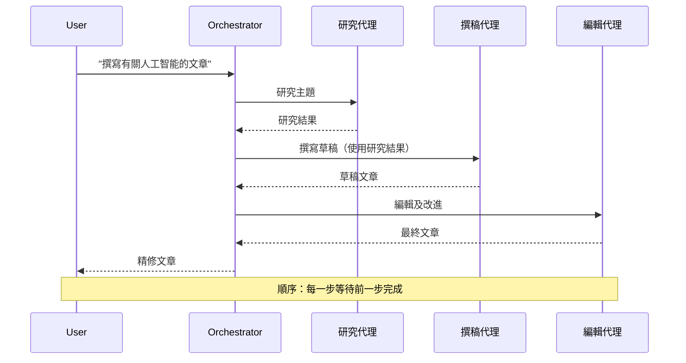
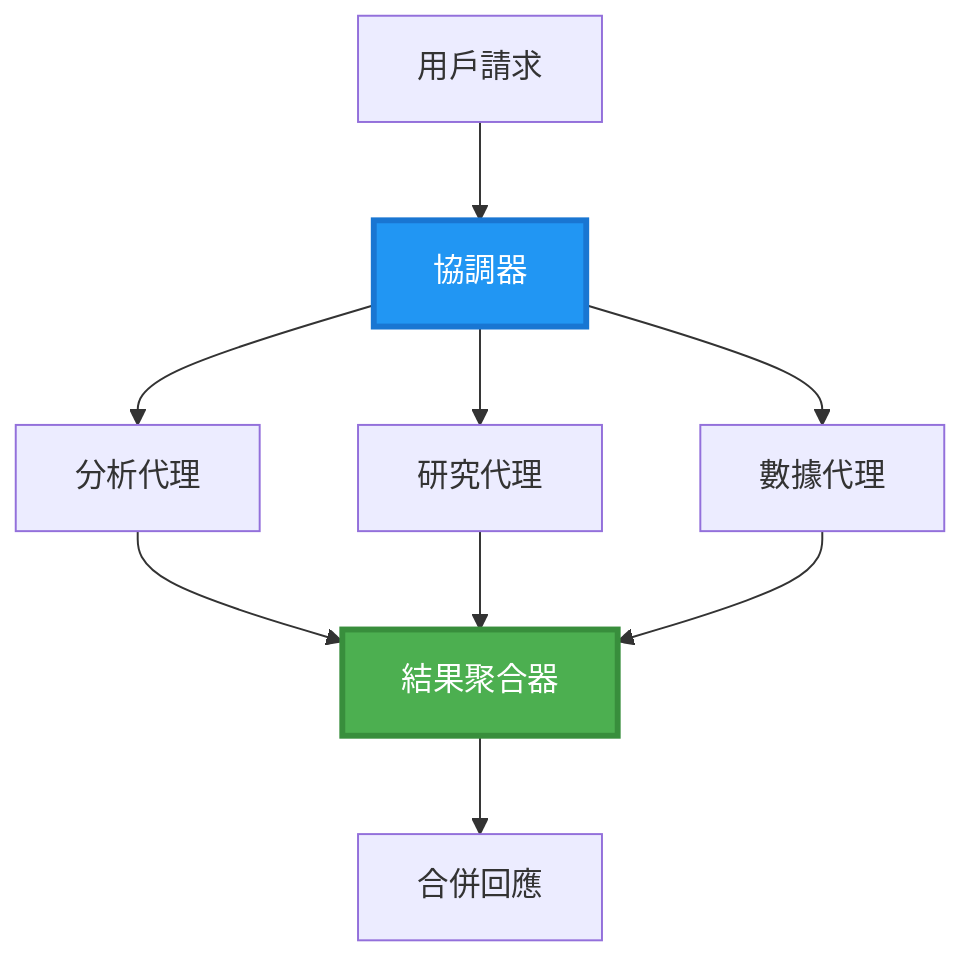
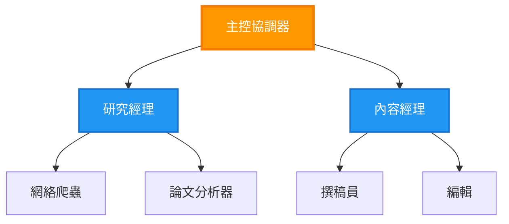
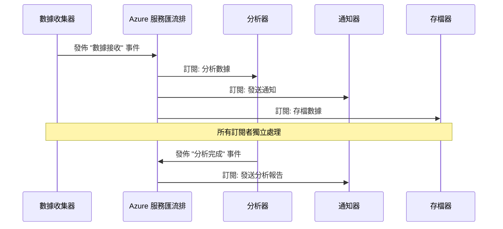
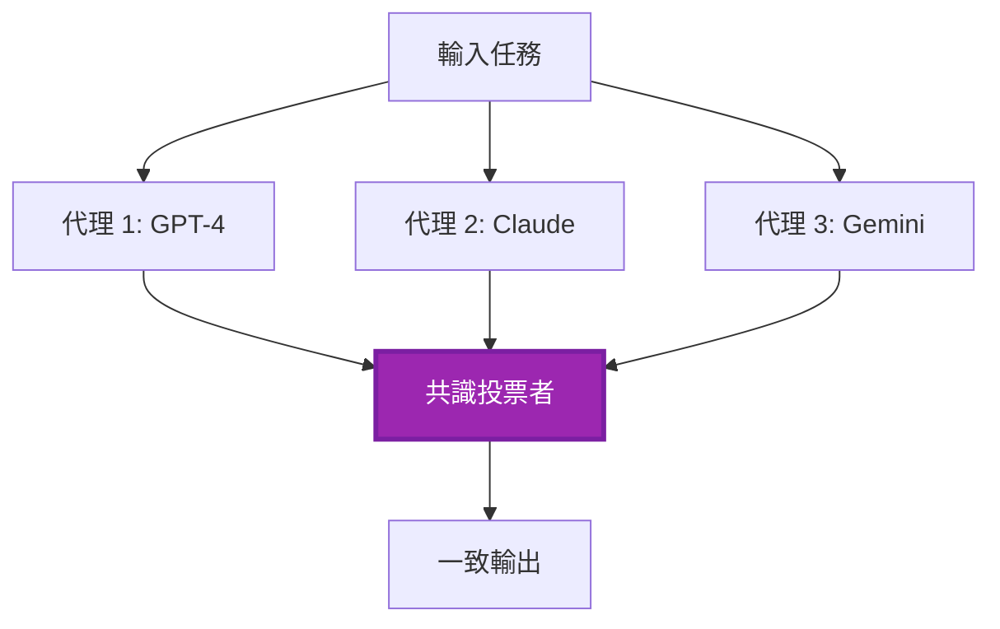
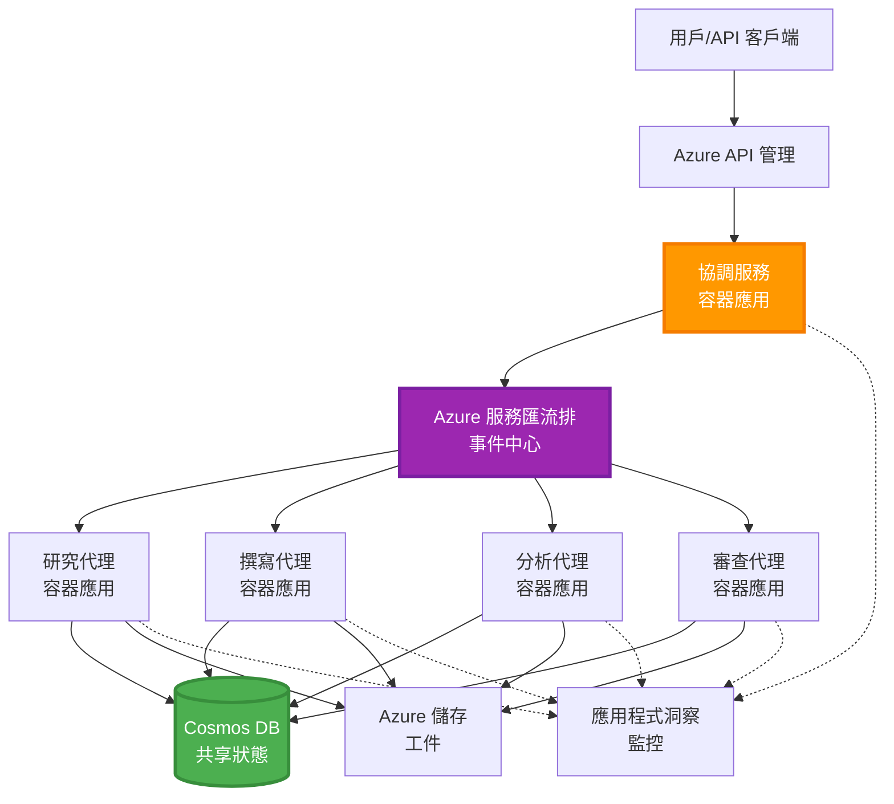

# 多代理協調模式

⏱️ **估計時間**: 60-75 分鐘 | 💰 **估計成本**: ~$100-300/月 | ⭐ **複雜度**: 高級

**📚 學習路徑:**
- ← 上一課: [容量規劃](capacity-planning.md) - 資源大小及擴展策略
- 🎯 **你現在的位置**: 多代理協調模式 (編排、通信、狀態管理)
- → 下一課: [SKU 選擇](sku-selection.md) - 選擇合適的 Azure 服務
- 🏠 [課程首頁](../../README.md)

---

## 你將學到什麼

完成本課後，你將能夠：
- 理解 **多代理架構** 模式及其使用時機
- 實現 **編排模式** (集中式、分散式、分層式)
- 設計 **代理通信** 策略 (同步、異步、事件驅動)
- 管理分布式代理的 **共享狀態**
- 在 Azure 上部署 **多代理系統**，使用 AZD
- 將 **協調模式** 應用於實際 AI 場景
- 監控及調試分布式代理系統

## 為什麼多代理協調很重要

### 演變：從單代理到多代理

**單代理 (簡單):**
```
User → Agent → Response
```
- ✅ 容易理解和實現
- ✅ 適合簡單任務的快速執行
- ❌ 受限於單一模型的能力
- ❌ 無法並行處理複雜任務
- ❌ 缺乏專業化

**多代理系統 (高級):**
```
           ┌─────────────┐
           │ Orchestrator│
           └──────┬──────┘
        ┌─────────┼─────────┐
        │         │         │
    ┌───▼──┐  ┌──▼───┐  ┌──▼────┐
    │Agent1│  │Agent2│  │Agent3 │
    │(Plan)│  │(Code)│  │(Review)│
    └──────┘  └──────┘  └───────┘
```
- ✅ 專業化代理執行特定任務
- ✅ 並行執行提高速度
- ✅ 模塊化且易於維護
- ✅ 更適合處理複雜工作流程
- ⚠️ 需要協調邏輯

**比喻**: 單代理就像一個人完成所有任務。多代理就像一個團隊，每個成員都有專業技能 (研究員、程式員、審核員、作家) 一起合作。

---

## 核心協調模式

### 模式 1: 順序協調 (責任鏈)

**使用時機**: 任務必須按特定順序完成，每個代理基於前一個的輸出。


**優點:**
- ✅ 數據流清晰
- ✅ 易於調試
- ✅ 執行順序可預測

**限制:**
- ❌ 較慢 (無並行性)
- ❌ 一個失敗會阻礙整個鏈條
- ❌ 無法處理相互依賴的任務

**示例使用場景:**
- 內容創作流程 (研究 → 撰寫 → 編輯 → 發佈)
- 程式碼生成 (計劃 → 實現 → 測試 → 部署)
- 報告生成 (數據收集 → 分析 → 可視化 → 摘要)

---

### 模式 2: 並行協調 (分散/合併)

**使用時機**: 獨立任務可同時運行，結果在最後合併。


**優點:**
- ✅ 快速 (並行執行)
- ✅ 容錯性高 (接受部分結果)
- ✅ 水平擴展能力強

**限制:**
- ⚠️ 結果可能無序到達
- ⚠️ 需要聚合邏輯
- ⚠️ 狀態管理複雜

**示例使用場景:**
- 多來源數據收集 (API + 數據庫 + 網頁抓取)
- 競爭性分析 (多個模型生成解決方案，選擇最佳)
- 翻譯服務 (同時翻譯成多種語言)

---

### 模式 3: 分層協調 (管理者-工作者)

**使用時機**: 複雜工作流程需要子任務及委派。


**優點:**
- ✅ 處理複雜工作流程
- ✅ 模塊化且易於維護
- ✅ 責任邊界清晰

**限制:**
- ⚠️ 架構更複雜
- ⚠️ 延遲更高 (多層協調)
- ⚠️ 需要高級編排技術

**示例使用場景:**
- 企業文檔處理 (分類 → 路由 → 處理 → 存檔)
- 多階段數據管道 (導入 → 清理 → 轉換 → 分析 → 報告)
- 複雜自動化工作流程 (計劃 → 資源分配 → 執行 → 監控)

---

### 模式 4: 事件驅動協調 (發布-訂閱)

**使用時機**: 代理需要對事件作出反應，並希望保持鬆耦合。


**優點:**
- ✅ 代理之間鬆耦合
- ✅ 易於添加新代理 (只需訂閱)
- ✅ 異步處理
- ✅ 韌性強 (消息持久性)

**限制:**
- ⚠️ 最終一致性
- ⚠️ 調試複雜
- ⚠️ 消息排序挑戰

**示例使用場景:**
- 實時監控系統 (警報、儀表板、日誌)
- 多渠道通知 (電郵、短信、推送、Slack)
- 數據處理管道 (同一數據的多個消費者)

---

### 模式 5: 基於共識的協調 (投票/法定人數)

**使用時機**: 需要多個代理達成一致後才能繼續。


**優點:**
- ✅ 更高準確性 (多方意見)
- ✅ 容錯性高 (少數失敗可接受)
- ✅ 內置質量保證

**限制:**
- ❌ 成本高 (多次模型調用)
- ❌ 較慢 (等待所有代理)
- ⚠️ 需要解決衝突

**示例使用場景:**
- 內容審核 (多個模型審核內容)
- 程式碼審查 (多個靜態分析工具)
- 醫療診斷 (多個 AI 模型及專家驗證)

---

## 架構概述

### Azure 上完整的多代理系統


**主要組件:**

| 組件 | 用途 | Azure 服務 |
|------|------|-----------|
| **API Gateway** | 入口點、速率限制、身份驗證 | API Management |
| **編排器** | 協調代理工作流程 | Container Apps |
| **消息隊列** | 異步通信 | Service Bus / Event Hubs |
| **代理** | 專業化 AI 工作者 | Container Apps / Functions |
| **狀態存儲** | 共享狀態、任務跟蹤 | Cosmos DB |
| **工件存儲** | 文檔、結果、日誌 | Blob Storage |
| **監控** | 分布式追蹤、日誌 | Application Insights |

---

## 先決條件

### 所需工具

```bash
# 驗證 Azure Developer CLI
azd version
# ✅ 預期：azd 版本 1.0.0 或更高

# 驗證 Azure CLI
az --version
# ✅ 預期：azure-cli 2.50.0 或更高

# 驗證 Docker（用於本地測試）
docker --version
# ✅ 預期：Docker 版本 20.10 或更高
```

### Azure 要求

- 活躍的 Azure 訂閱
- 創建以下資源的權限：
  - Container Apps
  - Service Bus 命名空間
  - Cosmos DB 帳戶
  - 存儲帳戶
  - Application Insights

### 知識要求

你應該已完成：
- [配置管理](../getting-started/configuration.md)
- [身份驗證與安全](../getting-started/authsecurity.md)
- [微服務示例](../../../../examples/microservices)

---

## 實施指南

### 項目結構

```
multi-agent-system/
├── azure.yaml                    # AZD configuration
├── infra/
│   ├── main.bicep               # Main infrastructure
│   ├── core/
│   │   ├── servicebus.bicep     # Message queue
│   │   ├── cosmos.bicep         # State store
│   │   ├── storage.bicep        # Artifact storage
│   │   └── monitoring.bicep     # Application Insights
│   └── app/
│       ├── orchestrator.bicep   # Orchestrator service
│       └── agent.bicep          # Agent template
└── src/
    ├── orchestrator/            # Orchestration logic
    │   ├── app.py
    │   ├── workflows.py
    │   └── Dockerfile
    ├── agents/
    │   ├── research/            # Research agent
    │   ├── writer/              # Writer agent
    │   ├── analyst/             # Analyst agent
    │   └── reviewer/            # Reviewer agent
    └── shared/
        ├── state_manager.py     # Shared state logic
        └── message_handler.py   # Message handling
```

---

## 第一課: 順序協調模式

### 實施: 內容創作流程

讓我們構建一個順序管道：研究 → 撰寫 → 編輯 → 發佈

### 1. AZD 配置

**文件: `azure.yaml`**

```yaml
name: content-pipeline
metadata:
  template: multi-agent-sequential@1.0.0

services:
  orchestrator:
    project: ./src/orchestrator
    language: python
    host: containerapp
  
  research-agent:
    project: ./src/agents/research
    language: python
    host: containerapp
  
  writer-agent:
    project: ./src/agents/writer
    language: python
    host: containerapp
  
  editor-agent:
    project: ./src/agents/editor
    language: python
    host: containerapp
```

### 2. 基礎設施: 用於協調的 Service Bus

**文件: `infra/core/servicebus.bicep`**

```bicep
param name string
param location string
param tags object = {}

resource serviceBusNamespace 'Microsoft.ServiceBus/namespaces@2022-10-01-preview' = {
  name: name
  location: location
  tags: tags
  sku: {
    name: 'Standard'
    tier: 'Standard'
  }
  properties: {
    minimumTlsVersion: '1.2'
  }
}

// Queue for orchestrator → research agent
resource researchQueue 'Microsoft.ServiceBus/namespaces/queues@2022-10-01-preview' = {
  parent: serviceBusNamespace
  name: 'research-tasks'
  properties: {
    maxDeliveryCount: 3
    lockDuration: 'PT5M'
    deadLetteringOnMessageExpiration: true
  }
}

// Queue for research agent → writer agent
resource writerQueue 'Microsoft.ServiceBus/namespaces/queues@2022-10-01-preview' = {
  parent: serviceBusNamespace
  name: 'writer-tasks'
  properties: {
    maxDeliveryCount: 3
    lockDuration: 'PT5M'
  }
}

// Queue for writer agent → editor agent
resource editorQueue 'Microsoft.ServiceBus/namespaces/queues@2022-10-01-preview' = {
  parent: serviceBusNamespace
  name: 'editor-tasks'
  properties: {
    maxDeliveryCount: 3
    lockDuration: 'PT5M'
  }
}

output namespace string = serviceBusNamespace.name
output connectionString string = listKeys('${serviceBusNamespace.id}/AuthorizationRules/RootManageSharedAccessKey', serviceBusNamespace.apiVersion).primaryConnectionString
```

### 3. 共享狀態管理器

**文件: `src/shared/state_manager.py`**

```python
from azure.cosmos import CosmosClient, PartitionKey
from datetime import datetime
import os

class StateManager:
    """Manages shared state across agents using Cosmos DB"""
    
    def __init__(self):
        endpoint = os.environ['COSMOS_ENDPOINT']
        key = os.environ['COSMOS_KEY']
        
        self.client = CosmosClient(endpoint, key)
        self.database = self.client.get_database_client('agent-state')
        self.container = self.database.get_container_client('tasks')
    
    def create_task(self, task_id: str, task_type: str, input_data: dict):
        """Create a new task"""
        task = {
            'id': task_id,
            'type': task_type,
            'status': 'pending',
            'input': input_data,
            'created_at': datetime.utcnow().isoformat(),
            'steps': []
        }
        self.container.create_item(task)
        return task
    
    def update_task_step(self, task_id: str, step_name: str, result: dict):
        """Update task with completed step"""
        task = self.container.read_item(task_id, partition_key=task_id)
        
        task['steps'].append({
            'name': step_name,
            'completed_at': datetime.utcnow().isoformat(),
            'result': result
        })
        
        self.container.replace_item(task_id, task)
        return task
    
    def complete_task(self, task_id: str, final_result: dict):
        """Mark task as complete"""
        task = self.container.read_item(task_id, partition_key=task_id)
        task['status'] = 'completed'
        task['result'] = final_result
        task['completed_at'] = datetime.utcnow().isoformat()
        self.container.replace_item(task_id, task)
        return task
    
    def get_task(self, task_id: str):
        """Retrieve task state"""
        return self.container.read_item(task_id, partition_key=task_id)
```

### 4. 編排器服務

**文件: `src/orchestrator/app.py`**

```python
from flask import Flask, request, jsonify
from azure.servicebus import ServiceBusClient, ServiceBusMessage
import json
import uuid
import os
from shared.state_manager import StateManager

app = Flask(__name__)
state_manager = StateManager()

# 服務匯流排連接
servicebus_connection_str = os.environ['SERVICEBUS_CONNECTION_STRING']
servicebus_client = ServiceBusClient.from_connection_string(servicebus_connection_str)

@app.route('/health', methods=['GET'])
def health():
    return jsonify({'status': 'healthy', 'service': 'orchestrator'})

@app.route('/create-content', methods=['POST'])
def create_content():
    """
    Sequential workflow: Research → Write → Edit → Publish
    """
    data = request.json
    topic = data.get('topic')
    
    if not topic:
        return jsonify({'error': 'Topic required'}), 400
    
    # 在狀態存儲中創建任務
    task_id = str(uuid.uuid4())
    task = state_manager.create_task(
        task_id=task_id,
        task_type='content_creation',
        input_data={'topic': topic}
    )
    
    # 發送訊息給研究代理（第一步）
    sender = servicebus_client.get_queue_sender('research-tasks')
    message = ServiceBusMessage(
        body=json.dumps({
            'task_id': task_id,
            'topic': topic,
            'next_queue': 'writer-tasks'  # 發送結果的地方
        }),
        content_type='application/json'
    )
    
    with sender:
        sender.send_messages(message)
    
    return jsonify({
        'task_id': task_id,
        'status': 'started',
        'workflow': 'sequential',
        'steps': ['research', 'write', 'edit', 'publish'],
        'message': 'Content creation pipeline initiated'
    }), 202

@app.route('/task/<task_id>', methods=['GET'])
def get_task_status(task_id):
    """Check task status"""
    try:
        task = state_manager.get_task(task_id)
        return jsonify(task)
    except Exception as e:
        return jsonify({'error': str(e)}), 404

if __name__ == '__main__':
    app.run(host='0.0.0.0', port=8080)
```

### 5. 研究代理

**文件: `src/agents/research/app.py`**

```python
from azure.servicebus import ServiceBusClient, ServiceBusMessage
from openai import AzureOpenAI
import json
import os
import time
from shared.state_manager import StateManager

# 初始化客戶端
state_manager = StateManager()
servicebus_client = ServiceBusClient.from_connection_string(
    os.environ['SERVICEBUS_CONNECTION_STRING']
)

openai_client = AzureOpenAI(
    api_key=os.environ['AZURE_OPENAI_API_KEY'],
    api_version="2024-02-01",
    azure_endpoint=os.environ['AZURE_OPENAI_ENDPOINT']
)

def process_research_task(message_data):
    """Process research request and pass to writer"""
    task_id = message_data['task_id']
    topic = message_data['topic']
    next_queue = message_data['next_queue']
    
    print(f"🔬 Researching: {topic}")
    
    # 呼叫 Azure OpenAI 進行研究
    response = openai_client.chat.completions.create(
        model="gpt-4",
        messages=[
            {"role": "system", "content": "You are a research assistant. Provide comprehensive research on the given topic."},
            {"role": "user", "content": f"Research this topic thoroughly: {topic}"}
        ],
        max_tokens=1500
    )
    
    research_results = response.choices[0].message.content
    
    # 更新狀態
    state_manager.update_task_step(
        task_id=task_id,
        step_name='research',
        result={'research': research_results}
    )
    
    # 發送至下一個代理（作家）
    sender = servicebus_client.get_queue_sender(next_queue)
    message = ServiceBusMessage(
        body=json.dumps({
            'task_id': task_id,
            'topic': topic,
            'research': research_results,
            'next_queue': 'editor-tasks'
        }),
        content_type='application/json'
    )
    
    with sender:
        sender.send_messages(message)
    
    print(f"✅ Research complete for task {task_id}")

def main():
    """Listen to research queue"""
    receiver = servicebus_client.get_queue_receiver('research-tasks')
    
    print("🔬 Research Agent started, listening for tasks...")
    
    with receiver:
        while True:
            messages = receiver.receive_messages(max_wait_time=5)
            for message in messages:
                try:
                    message_data = json.loads(str(message))
                    process_research_task(message_data)
                    receiver.complete_message(message)
                except Exception as e:
                    print(f"❌ Error processing message: {e}")
                    receiver.abandon_message(message)

if __name__ == '__main__':
    main()
```

### 6. 撰寫代理

**文件: `src/agents/writer/app.py`**

```python
from azure.servicebus import ServiceBusClient, ServiceBusMessage
from openai import AzureOpenAI
import json
import os
from shared.state_manager import StateManager

state_manager = StateManager()
servicebus_client = ServiceBusClient.from_connection_string(
    os.environ['SERVICEBUS_CONNECTION_STRING']
)

openai_client = AzureOpenAI(
    api_key=os.environ['AZURE_OPENAI_API_KEY'],
    api_version="2024-02-01",
    azure_endpoint=os.environ['AZURE_OPENAI_ENDPOINT']
)

def process_writing_task(message_data):
    """Write article based on research"""
    task_id = message_data['task_id']
    topic = message_data['topic']
    research = message_data['research']
    next_queue = message_data['next_queue']
    
    print(f"✍️ Writing article: {topic}")
    
    # 呼叫 Azure OpenAI 撰寫文章
    response = openai_client.chat.completions.create(
        model="gpt-4",
        messages=[
            {"role": "system", "content": "You are a professional writer. Write engaging, well-structured articles."},
            {"role": "user", "content": f"Based on this research:\n\n{research}\n\nWrite a comprehensive article about: {topic}"}
        ],
        max_tokens=2000
    )
    
    article_draft = response.choices[0].message.content
    
    # 更新狀態
    state_manager.update_task_step(
        task_id=task_id,
        step_name='writing',
        result={'draft': article_draft}
    )
    
    # 發送給編輯
    sender = servicebus_client.get_queue_sender(next_queue)
    message = ServiceBusMessage(
        body=json.dumps({
            'task_id': task_id,
            'topic': topic,
            'draft': article_draft
        }),
        content_type='application/json'
    )
    
    with sender:
        sender.send_messages(message)
    
    print(f"✅ Article draft complete for task {task_id}")

def main():
    """Listen to writer queue"""
    receiver = servicebus_client.get_queue_receiver('writer-tasks')
    
    print("✍️ Writer Agent started, listening for tasks...")
    
    with receiver:
        while True:
            messages = receiver.receive_messages(max_wait_time=5)
            for message in messages:
                try:
                    message_data = json.loads(str(message))
                    process_writing_task(message_data)
                    receiver.complete_message(message)
                except Exception as e:
                    print(f"❌ Error: {e}")
                    receiver.abandon_message(message)

if __name__ == '__main__':
    main()
```

### 7. 編輯代理

**文件: `src/agents/editor/app.py`**

```python
from azure.servicebus import ServiceBusClient
from openai import AzureOpenAI
import json
import os
from shared.state_manager import StateManager

state_manager = StateManager()
servicebus_client = ServiceBusClient.from_connection_string(
    os.environ['SERVICEBUS_CONNECTION_STRING']
)

openai_client = AzureOpenAI(
    api_key=os.environ['AZURE_OPENAI_API_KEY'],
    api_version="2024-02-01",
    azure_endpoint=os.environ['AZURE_OPENAI_ENDPOINT']
)

def process_editing_task(message_data):
    """Edit and finalize article"""
    task_id = message_data['task_id']
    topic = message_data['topic']
    draft = message_data['draft']
    
    print(f"📝 Editing article: {topic}")
    
    # 呼叫 Azure OpenAI 進行編輯
    response = openai_client.chat.completions.create(
        model="gpt-4",
        messages=[
            {"role": "system", "content": "You are an expert editor. Improve grammar, clarity, and structure."},
            {"role": "user", "content": f"Edit and improve this article:\n\n{draft}"}
        ],
        max_tokens=2000
    )
    
    final_article = response.choices[0].message.content
    
    # 標記任務為完成
    state_manager.complete_task(
        task_id=task_id,
        final_result={
            'topic': topic,
            'final_article': final_article,
            'word_count': len(final_article.split())
        }
    )
    
    print(f"✅ Article finalized for task {task_id}")

def main():
    """Listen to editor queue"""
    receiver = servicebus_client.get_queue_receiver('editor-tasks')
    
    print("📝 Editor Agent started, listening for tasks...")
    
    with receiver:
        while True:
            messages = receiver.receive_messages(max_wait_time=5)
            for message in messages:
                try:
                    message_data = json.loads(str(message))
                    process_editing_task(message_data)
                    receiver.complete_message(message)
                except Exception as e:
                    print(f"❌ Error: {e}")
                    receiver.abandon_message(message)

if __name__ == '__main__':
    main()
```

### 8. 部署及測試

```bash
# 初始化並部署
azd init
azd up

# 獲取編排器 URL
ORCHESTRATOR_URL=$(azd env get-values | grep ORCHESTRATOR_URL | cut -d '=' -f2 | tr -d '"')

# 建立內容
curl -X POST $ORCHESTRATOR_URL/create-content \
  -H "Content-Type: application/json" \
  -d '{"topic": "The Future of AI in Healthcare"}'
```

**✅ 預期輸出:**
```json
{
  "task_id": "a1b2c3d4-e5f6-7890-abcd-ef1234567890",
  "status": "started",
  "workflow": "sequential",
  "steps": ["research", "write", "edit", "publish"],
  "message": "Content creation pipeline initiated"
}
```

**檢查任務進度:**
```bash
TASK_ID="a1b2c3d4-e5f6-7890-abcd-ef1234567890"
curl $ORCHESTRATOR_URL/task/$TASK_ID
```

**✅ 預期輸出 (完成):**
```json
{
  "id": "a1b2c3d4-e5f6-7890-abcd-ef1234567890",
  "type": "content_creation",
  "status": "completed",
  "steps": [
    {
      "name": "research",
      "completed_at": "2025-11-19T10:30:00Z",
      "result": {"research": "..."}
    },
    {
      "name": "writing",
      "completed_at": "2025-11-19T10:32:00Z",
      "result": {"draft": "..."}
    }
  ],
  "result": {
    "topic": "The Future of AI in Healthcare",
    "final_article": "...",
    "word_count": 1500
  }
}
```

---

## 第二課: 並行協調模式

### 實施: 多來源研究聚合器

讓我們構建一個並行系統，同時從多個來源收集信息。

### 並行編排器

**文件: `src/orchestrator/parallel_workflow.py`**

```python
from flask import Flask, request, jsonify
from azure.servicebus import ServiceBusClient, ServiceBusMessage
import json
import uuid
import os
from shared.state_manager import StateManager

app = Flask(__name__)
state_manager = StateManager()

servicebus_client = ServiceBusClient.from_connection_string(
    os.environ['SERVICEBUS_CONNECTION_STRING']
)

@app.route('/research-parallel', methods=['POST'])
def research_parallel():
    """
    Parallel workflow: Multiple agents work simultaneously
    """
    data = request.json
    query = data.get('query')
    
    task_id = str(uuid.uuid4())
    task = state_manager.create_task(
        task_id=task_id,
        task_type='parallel_research',
        input_data={
            'query': query,
            'agents': ['web', 'academic', 'news', 'social']
        }
    )
    
    # 扇出：同時發送給所有代理
    agents = [
        ('web-research-queue', 'web'),
        ('academic-research-queue', 'academic'),
        ('news-research-queue', 'news'),
        ('social-research-queue', 'social')
    ]
    
    for queue_name, agent_type in agents:
        sender = servicebus_client.get_queue_sender(queue_name)
        message = ServiceBusMessage(
            body=json.dumps({
                'task_id': task_id,
                'query': query,
                'agent_type': agent_type,
                'result_queue': 'aggregation-queue'
            }),
            content_type='application/json'
        )
        
        with sender:
            sender.send_messages(message)
    
    return jsonify({
        'task_id': task_id,
        'status': 'started',
        'workflow': 'parallel',
        'agents_dispatched': 4,
        'message': 'Parallel research initiated'
    }), 202

if __name__ == '__main__':
    app.run(host='0.0.0.0', port=8080)
```

### 聚合邏輯

**文件: `src/agents/aggregator/app.py`**

```python
from azure.servicebus import ServiceBusClient
import json
import os
from collections import defaultdict
from shared.state_manager import StateManager

state_manager = StateManager()
servicebus_client = ServiceBusClient.from_connection_string(
    os.environ['SERVICEBUS_CONNECTION_STRING']
)

# 跟蹤每個任務的結果
task_results = defaultdict(list)
expected_agents = 4  # 網絡、學術、新聞、社交

def process_result(message_data):
    """Aggregate results from parallel agents"""
    task_id = message_data['task_id']
    agent_type = message_data['agent_type']
    result = message_data['result']
    
    # 儲存結果
    task_results[task_id].append({
        'agent': agent_type,
        'data': result
    })
    
    print(f"📊 Received result from {agent_type} agent ({len(task_results[task_id])}/{expected_agents})")
    
    # 檢查是否所有代理完成（匯聚）
    if len(task_results[task_id]) == expected_agents:
        print(f"✅ All agents completed for task {task_id}. Aggregating...")
        
        # 合併結果
        aggregated = {
            'query': message_data['query'],
            'sources': task_results[task_id],
            'summary': generate_summary(task_results[task_id])
        }
        
        # 標記完成
        state_manager.complete_task(task_id, aggregated)
        
        # 清理
        del task_results[task_id]
        
        print(f"✅ Aggregation complete for task {task_id}")

def generate_summary(results):
    """Generate summary from all sources"""
    summaries = [r['data'].get('summary', '') for r in results]
    return '\n\n'.join(summaries)

def main():
    """Listen to aggregation queue"""
    receiver = servicebus_client.get_queue_receiver('aggregation-queue')
    
    print("📊 Aggregator started, listening for results...")
    
    with receiver:
        while True:
            messages = receiver.receive_messages(max_wait_time=5)
            for message in messages:
                try:
                    message_data = json.loads(str(message))
                    process_result(message_data)
                    receiver.complete_message(message)
                except Exception as e:
                    print(f"❌ Error: {e}")
                    receiver.abandon_message(message)

if __name__ == '__main__':
    main()
```

**並行模式的優勢:**
- ⚡ **快 4 倍** (代理同時運行)
- 🔄 **容錯性高** (接受部分結果)
- 📈 **可擴展** (輕鬆添加更多代理)

---

## 實踐練習

### 練習 1: 添加超時處理 ⭐⭐ (中等)

**目標**: 實現超時邏輯，讓聚合器不會無限等待慢速代理。

**步驟**:

1. **向聚合器添加超時跟蹤:**

```python
from datetime import datetime, timedelta

task_timeouts = {}  # 任務ID -> 到期時間

def process_result(message_data):
    task_id = message_data['task_id']
    
    # 設置超時於第一個結果
    if task_id not in task_timeouts:
        task_timeouts[task_id] = datetime.utcnow() + timedelta(seconds=30)
    
    task_results[task_id].append({
        'agent': message_data['agent_type'],
        'data': message_data['result']
    })
    
    # 檢查是否完成或超時
    if len(task_results[task_id]) == expected_agents or \
       datetime.utcnow() > task_timeouts[task_id]:
        
        print(f"📊 Aggregating with {len(task_results[task_id])}/{expected_agents} results")
        
        aggregated = {
            'query': message_data['query'],
            'sources': task_results[task_id],
            'completed_agents': len(task_results[task_id]),
            'timed_out': len(task_results[task_id]) < expected_agents
        }
        
        state_manager.complete_task(task_id, aggregated)
        
        # 清理
        del task_results[task_id]
        del task_timeouts[task_id]
```

2. **使用人工延遲進行測試:**

```python
# 在其中一個代理中，加入延遲以模擬緩慢處理
import time
time.sleep(35)  # 超過30秒超時
```

3. **部署並驗證:**

```bash
azd deploy aggregator

# 提交任務
curl -X POST $ORCHESTRATOR_URL/research-parallel \
  -H "Content-Type: application/json" \
  -d '{"query": "AI safety research"}'

# 30秒後檢查結果
curl $ORCHESTRATOR_URL/task/$TASK_ID
```

**✅ 成功標準:**
- ✅ 任務在 30 秒後完成，即使代理未完成
- ✅ 響應指示部分結果 (`"timed_out": true`)
- ✅ 返回可用結果 (4 個代理中 3 個完成)

**時間**: 20-25 分鐘

---

### 練習 2: 實現重試邏輯 ⭐⭐⭐ (高級)

**目標**: 在放棄之前自動重試失敗的代理任務。

**步驟**:

1. **向編排器添加重試跟蹤:**

```python
from dataclasses import dataclass
from typing import Dict

@dataclass
class RetryConfig:
    max_retries: int = 3
    backoff_seconds: int = 5

retry_counts: Dict[str, int] = {}  # 訊息識別碼 -> 重試次數

def send_with_retry(queue_name: str, message_data: dict, retry_config: RetryConfig):
    """Send message with retry metadata"""
    message_id = message_data.get('message_id', str(uuid.uuid4()))
    message_data['message_id'] = message_id
    message_data['retry_count'] = retry_counts.get(message_id, 0)
    message_data['max_retries'] = retry_config.max_retries
    
    sender = servicebus_client.get_queue_sender(queue_name)
    message = ServiceBusMessage(
        body=json.dumps(message_data),
        content_type='application/json',
        message_id=message_id
    )
    
    with sender:
        sender.send_messages(message)
```

2. **向代理添加重試處理器:**

```python
def process_with_retry(message, receiver, process_func):
    """Process message with automatic retry on failure"""
    try:
        message_data = json.loads(str(message))
        
        # 處理訊息
        process_func(message_data)
        
        # 成功 - 完成
        receiver.complete_message(message)
        
    except Exception as e:
        message_id = message.message_id
        retry_count = message_data.get('retry_count', 0)
        max_retries = message_data.get('max_retries', 3)
        
        if retry_count < max_retries:
            # 重試：放棄並重新排隊，次數增加
            print(f"⚠️ Retry {retry_count + 1}/{max_retries} for message {message_id}")
            
            message_data['retry_count'] = retry_count + 1
            
            # 發送回同一隊列並延遲
            time.sleep(5 * (retry_count + 1))  # 指數回退
            send_with_retry(queue_name, message_data, RetryConfig())
            
            receiver.complete_message(message)  # 移除原件
        else:
            # 超過最大重試次數 - 移至死信隊列
            print(f"❌ Max retries exceeded for message {message_id}")
            receiver.dead_letter_message(
                message,
                reason="MaxRetriesExceeded",
                error_description=str(e)
            )
```

3. **監控死信隊列:**

```python
def monitor_dead_letters():
    """Check dead letter queue for failed messages"""
    receiver = servicebus_client.get_queue_receiver(
        'research-queue',
        sub_queue='deadletter'
    )
    
    with receiver:
        messages = receiver.receive_messages(max_wait_time=5)
        for message in messages:
            print(f"☠️ Dead letter: {message.message_id}")
            print(f"Reason: {message.dead_letter_reason}")
            print(f"Description: {message.dead_letter_error_description}")
```

**✅ 成功標準:**
- ✅ 失敗任務自動重試 (最多 3 次)
- ✅ 重試之間指數回退 (5 秒, 10 秒, 15 秒)
- ✅ 達到最大重試次數後，消息進入死信隊列
- ✅ 可監控並重播死信隊列

**時間**: 30-40 分鐘

---

### 練習 3: 實現熔斷器 ⭐⭐⭐ (高級)

**目標**: 防止失敗代理的連鎖反應，停止向其發送請求。

**步驟**:

1. **創建熔斷器類:**

```python
from enum import Enum
from datetime import datetime, timedelta

class CircuitState(Enum):
    CLOSED = "closed"      # 正常運作
    OPEN = "open"          # 故障，拒絕請求
    HALF_OPEN = "half_open"  # 測試是否已恢復

class CircuitBreaker:
    def __init__(self, failure_threshold=5, timeout_seconds=60):
        self.failure_threshold = failure_threshold
        self.timeout_seconds = timeout_seconds
        self.failure_count = 0
        self.last_failure_time = None
        self.state = CircuitState.CLOSED
    
    def call(self, func):
        """Execute function with circuit breaker protection"""
        if self.state == CircuitState.OPEN:
            # 檢查是否超時
            if datetime.utcnow() - self.last_failure_time > timedelta(seconds=self.timeout_seconds):
                self.state = CircuitState.HALF_OPEN
                print("🔄 Circuit breaker: HALF_OPEN (testing)")
            else:
                raise Exception(f"Circuit breaker OPEN for agent. Try again in {self.timeout_seconds}s")
        
        try:
            result = func()
            
            # 成功
            if self.state == CircuitState.HALF_OPEN:
                self.state = CircuitState.CLOSED
                self.failure_count = 0
                print("✅ Circuit breaker: CLOSED (recovered)")
            
            return result
            
        except Exception as e:
            self.failure_count += 1
            self.last_failure_time = datetime.utcnow()
            
            if self.failure_count >= self.failure_threshold:
                self.state = CircuitState.OPEN
                print(f"🔴 Circuit breaker: OPEN (too many failures)")
            
            raise e
```

2. **應用於代理調用:**

```python
# 在編排器中
agent_circuits = {
    'web': CircuitBreaker(failure_threshold=5, timeout_seconds=60),
    'academic': CircuitBreaker(failure_threshold=5, timeout_seconds=60),
    'news': CircuitBreaker(failure_threshold=5, timeout_seconds=60),
    'social': CircuitBreaker(failure_threshold=5, timeout_seconds=60)
}

def send_to_agent(agent_type, message_data):
    """Send with circuit breaker protection"""
    circuit = agent_circuits[agent_type]
    
    try:
        circuit.call(lambda: send_message(agent_type, message_data))
    except Exception as e:
        print(f"⚠️ Skipping {agent_type} agent: {e}")
        # 繼續與其他代理
```

3. **測試熔斷器:**

```bash
# 模擬重複失敗（停止一個代理）
az containerapp stop --name web-research-agent --resource-group rg-agents

# 發送多個請求
for i in {1..10}; do
  curl -X POST $ORCHESTRATOR_URL/research-parallel \
    -H "Content-Type: application/json" \
    -d '{"query": "test query '$i'"}'
  sleep 2
done

# 檢查日誌 - 應該在5次失敗後看到電路打開
azd logs orchestrator --tail 50
```

**✅ 成功標準:**
- ✅ 5 次失敗後，熔斷器打開 (拒絕請求)
- ✅ 60 秒後，熔斷器半開 (測試恢復)
- ✅ 其他代理正常工作
- ✅ 代理恢復後熔斷器自動關閉

**時間**: 40-50 分鐘

---

## 監控及調試

### 使用 Application Insights 進行分布式追蹤

**文件: `src/shared/tracing.py`**

```python
from opencensus.ext.azure.log_exporter import AzureLogHandler
from opencensus.ext.azure.trace_exporter import AzureExporter
from opencensus.trace import config_integration
from opencensus.trace.tracer import Tracer
from opencensus.trace.samplers import AlwaysOnSampler
import logging
import os

# 配置追蹤
config_integration.trace_integrations(['requests', 'logging'])

connection_string = os.environ.get('APPLICATIONINSIGHTS_CONNECTION_STRING')

# 建立追蹤器
tracer = Tracer(
    exporter=AzureExporter(connection_string=connection_string),
    sampler=AlwaysOnSampler()
)

# 配置日誌
logger = logging.getLogger(__name__)
logger.addHandler(AzureLogHandler(connection_string=connection_string))
logger.setLevel(logging.INFO)

def trace_agent_call(agent_name, task_id, operation):
    """Trace agent operations"""
    with tracer.span(name=f'{agent_name}.{operation}') as span:
        span.add_attribute('agent', agent_name)
        span.add_attribute('task_id', task_id)
        span.add_attribute('operation', operation)
        
        try:
            result = operation()
            span.add_attribute('status', 'success')
            return result
        except Exception as e:
            span.add_attribute('status', 'error')
            span.add_attribute('error', str(e))
            raise
```

### Application Insights 查詢

**追蹤多代理工作流程:**

```kusto
// Trace complete workflow for a task
traces
| where customDimensions.task_id == "a1b2c3d4-..."
| project timestamp, message, customDimensions.agent, customDimensions.operation
| order by timestamp asc
```

**代理性能比較:**

```kusto
// Compare agent execution times
dependencies
| where name contains "agent"
| summarize 
    avg_duration = avg(duration),
    p95_duration = percentile(duration, 95),
    count = count()
  by agent = tostring(customDimensions.agent)
| order by avg_duration desc
```

**故障分析:**

```kusto
// Find which agents fail most
exceptions
| where customDimensions.agent != ""
| summarize 
    failure_count = count(),
    unique_errors = dcount(outerMessage)
  by agent = tostring(customDimensions.agent)
| order by failure_count desc
```

---

## 成本分析

### 多代理系統成本 (每月估算)

| 組件 | 配置 | 成本 |
|------|------|------|
| **編排器** | 1 個 Container App (1 vCPU, 2GB) | $30-50 |
| **4 個代理** | 4 個 Container Apps (0.5 vCPU, 1GB 每個) | $60-120 |
| **Service Bus** | 標準層, 10M 消息 | $10-20 |
| **Cosmos DB** | 無伺服器, 5GB 存儲, 1M RUs | $25-50 |
| **Blob Storage** | 10GB 存儲, 100K 操作 | $5-10 |
| **Application Insights** | 5GB 數據攝取 | $10-15 |
| **Azure OpenAI** | GPT-4, 10M tokens | $100-300 |
| **總計** | | **$240-565/月** |

### 成本優化策略

1. **盡可能使用無伺服器:**
   ```bicep
   // Cosmos DB serverless (no minimum cost)
   properties: {
     databaseAccountOfferType: 'Standard'
     capabilities: [{ name: 'EnableServerless' }]
   }
   ```

2. **閒置時將代理縮減至零:**
   ```bicep
   scale: {
     minReplicas: 0  // Scale to zero when no messages
     maxReplicas: 10
   }
   ```

3. **為 Service Bus 使用批處理:**
   ```python
   # 批量發送訊息（較便宜）
   sender.send_messages([message1, message2, message3])
   ```

4. **緩存常用結果:**
   ```python
   # 使用 Azure Cache for Redis
   if cache.exists(query_hash):
       return cache.get(query_hash)
   ```

---

## 最佳實踐

### ✅ 建議:

1. **使用冪等操作**
   ```python
   # 代理可以安全地多次處理相同的訊息
   def process_task(task_id):
       if state_manager.task_exists(task_id):
           print(f"Task {task_id} already processed, skipping")
           return
       # 處理任務...
   ```

2. **實現全面的日誌記錄**
   ```python
   logger.info(f"Agent: {agent_name}, Task: {task_id}, Action: {action}")
   ```

3. **使用關聯 ID**
   ```python
   # 通過整個工作流程傳遞 task_id
   message_data = {
       'task_id': task_id,  # 關聯 ID
       'timestamp': datetime.utcnow().isoformat()
   }
   ```

4. **設置消息 TTL (存活時間)**
   ```bicep
   properties: {
     defaultMessageTimeToLive: 'PT1H'  // 1 hour max
   }
   ```

5. **監控死信隊列**
   ```python
   # 定期監察失敗的訊息
   monitor_dead_letters()
   ```

### ❌ 避免:

1. **避免創建循環依賴**
   ```python
   # ❌ 不好：代理 A → 代理 B → 代理 A（無限循環）
   # ✅ 好：定義清晰的有向無環圖（DAG）
   ```

2. **避免阻塞代理線程**
   ```python
   # ❌ 不好：同步等待
   while not task_complete:
       time.sleep(1)
   
   # ✅ 好：使用消息隊列回調
   ```

3. **避免忽略部分失敗**
   ```python
   # ❌ 不好：如果一個代理失敗，整個工作流程失敗
   # ✅ 好：返回部分結果並附上錯誤指示
   ```

4. **避免使用無限重試**
   ```python
   # ❌ 不好：無限重試
   # ✅ 好：最大重試次數 = 3，然後進入死信隊列
   ```

---
## 疑難排解指南

### 問題：訊息卡在佇列中

**症狀：**
- 訊息累積在佇列中
- Agent 沒有處理
- 任務狀態停留在「待處理」

**診斷：**
```bash
# 檢查隊列深度
az servicebus queue show \
  --namespace-name mybus \
  --name research-tasks \
  --query "countDetails"

# 檢查代理健康狀況
azd logs research-agent --tail 50
```

**解決方法：**

1. **增加 Agent 副本數量：**
   ```bash
   az containerapp update \
     --name research-agent \
     --min-replicas 3 \
     --max-replicas 10
   ```

2. **檢查死信佇列：**
   ```bash
   az servicebus queue show \
     --namespace-name mybus \
     --name research-tasks \
     --query "countDetails.deadLetterMessageCount"
   ```

---

### 問題：任務超時／無法完成

**症狀：**
- 任務狀態停留在「進行中」
- 部分 Agent 完成，其他未完成
- 沒有錯誤訊息

**診斷：**
```bash
# 檢查任務狀態
curl $ORCHESTRATOR_URL/task/$TASK_ID

# 檢查應用程式洞察
# 執行查詢：traces | where customDimensions.task_id == "..."
```

**解決方法：**

1. **在聚合器中實施超時機制（練習 1）**

2. **檢查 Agent 是否失敗：**
   ```bash
   azd logs --follow | grep "ERROR\|FAIL"
   ```

3. **確認所有 Agent 是否正在運行：**
   ```bash
   az containerapp list \
     --resource-group rg-agents \
     --query "[].{name:name, status:properties.runningStatus}"
   ```

---

## 了解更多

### 官方文件
- [Azure Service Bus](https://learn.microsoft.com/azure/service-bus-messaging/service-bus-messaging-overview)
- [Cosmos DB](https://learn.microsoft.com/azure/cosmos-db/introduction)
- [Container Apps DAPR](https://learn.microsoft.com/azure/container-apps/dapr-overview)
- [多 Agent 設計模式](https://learn.microsoft.com/azure/architecture/guide/ai/multi-agent-systems)

### 本課程的下一步
- ← 上一章：[容量規劃](capacity-planning.md)
- → 下一章：[SKU 選擇](sku-selection.md)
- 🏠 [課程首頁](../../README.md)

### 相關範例
- [微服務範例](../../../../examples/microservices) - 服務通訊模式
- [Azure OpenAI 範例](../../../../examples/azure-openai-chat) - AI 整合

---

## 總結

**你已學到：**
- ✅ 五種協調模式（順序、平行、階層式、事件驅動、共識）
- ✅ Azure 上的多 Agent 架構（Service Bus、Cosmos DB、Container Apps）
- ✅ 分散式 Agent 的狀態管理
- ✅ 超時處理、重試及斷路器
- ✅ 分散式系統的監控與除錯
- ✅ 成本優化策略

**關鍵要點：**
1. **選擇合適的模式** - 順序用於有序工作流，平行用於速度，事件驅動用於靈活性
2. **謹慎管理狀態** - 使用 Cosmos DB 或類似工具來管理共享狀態
3. **妥善處理失敗** - 超時、重試、斷路器、死信佇列
4. **監控一切** - 分散式追蹤對除錯至關重要
5. **優化成本** - 支援零擴展，使用無伺服器架構，實施快取

**下一步：**
1. 完成實作練習
2. 為你的使用案例建立多 Agent 系統
3. 學習 [SKU 選擇](sku-selection.md) 以優化效能與成本

---

<!-- CO-OP TRANSLATOR DISCLAIMER START -->
**免責聲明**：  
此文件已使用人工智能翻譯服務 [Co-op Translator](https://github.com/Azure/co-op-translator) 進行翻譯。我們致力於提供準確的翻譯，但請注意，自動翻譯可能包含錯誤或不準確之處。原始語言的文件應被視為權威來源。對於重要資訊，建議使用專業的人類翻譯。我們對因使用此翻譯而引起的任何誤解或誤釋不承擔責任。
<!-- CO-OP TRANSLATOR DISCLAIMER END -->