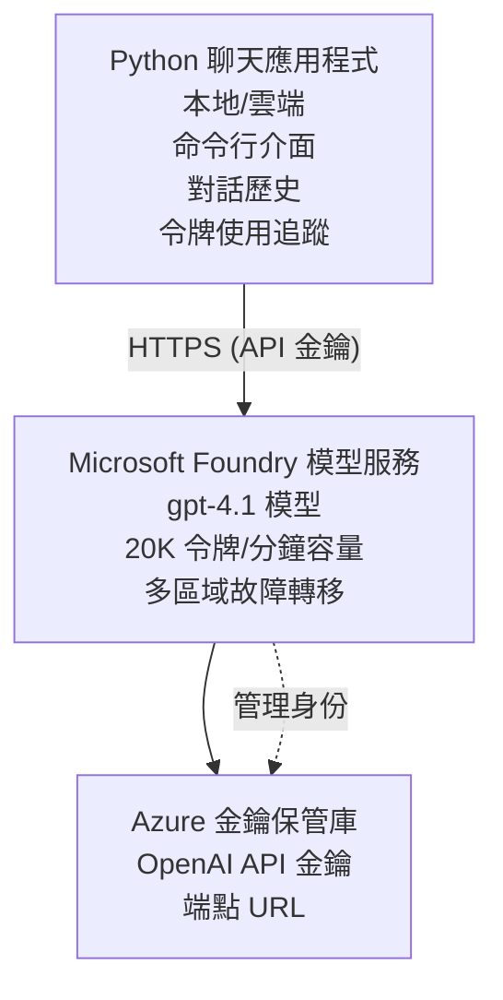

# Microsoft Foundry Models 聊天應用程式

**學習路線:** 中階 ⭐⭐ | **時間:** 35-45 分鐘 | **費用:** $50-200/月

一個使用 Azure Developer CLI (azd) 部署的完整 Microsoft Foundry Models 聊天應用程式範例。此範例展示了 gpt-4.1 部署、安全的 API 訪問以及簡單的聊天介面。

## 🎯 你將學到什麼

- 部署使用 gpt-4.1 模型的 Microsoft Foundry Models 服務
- 使用 Key Vault 保護 OpenAI API 金鑰
- 用 Python 建立簡單的聊天介面
- 監控代幣使用與費用
- 實作速率限制與錯誤處理

## 📦 包含內容

✅ **Microsoft Foundry Models 服務** - gpt-4.1 模型部署  
✅ **Python 聊天應用程式** - 簡單的命令列聊天介面  
✅ **Key Vault 整合** - 安全的 API 金鑰存儲  
✅ **ARM 範本** - 完整基礎設施即程式碼  
✅ <strong>費用監控</strong> - 代幣使用追蹤  
✅ <strong>速率限制</strong> - 預防配額耗盡  

## 架構


## 前置條件

### 必要項目

- **Azure Developer CLI (azd)** - [安裝指南](https://learn.microsoft.com/azure/developer/azure-developer-cli/install-azd)
- **具备 OpenAI 訪問權限的 Azure 訂閱** - [申請權限](https://aka.ms/oai/access)
- **Python 3.9+** - [安裝 Python](https://www.python.org/downloads/)

### 驗證前置條件

```bash
# 檢查 azd 版本（需要 1.5.0 或以上）
azd version

# 驗證 Azure 登入
azd auth login

# 檢查 Python 版本
python --version  # 或 python3 --version

# 驗證 OpenAI 訪問權限（在 Azure 入口網站檢查）
az cognitiveservices account list-skus \
  --kind OpenAI \
  --location eastus
```

> **⚠️ 重要:** Microsoft Foundry Models 需要應用程式批准。若尚未申請，請造訪 [aka.ms/oai/access](https://aka.ms/oai/access)。批准時間通常為 1-2 個工作天。

## ⏱️ 部署時間表

| 階段 | 時長 | 發生事項 |
|-------|----------|--------------|
| 前置條件檢查 | 2-3 分鐘 | 驗證 OpenAI 配額可用性 |
| 部署基礎設施 | 8-12 分鐘 | 建立 OpenAI、Key Vault 及模型部署 |
| 配置應用程式 | 2-3 分鐘 | 設定環境與相依套件 |
| <strong>總計</strong> | **12-18 分鐘** | 準備與 gpt-4.1 聊天 |

**注意:** 初次部署 OpenAI 可能因模型調度而較久。

## 快速開始

```bash
# 導航至範例
cd examples/azure-openai-chat

# 初始化環境
azd env new myopenai

# 部署所有內容（基礎設施 + 配置）
azd up
# 您將被提示：
# 1. 選擇 Azure 訂閱
# 2. 選擇具備 OpenAI 可用性的地點（例如，eastus、eastus2、westus）
# 3. 等待 12-18 分鐘進行部署

# 安裝 Python 依賴項
pip install -r requirements.txt

# 開始聊天！
python chat.py
```

**預期輸出:**
```
🤖 Microsoft Foundry Models Chat Application
Connected to: gpt-4.1 (eastus)
Type your message (or 'quit' to exit)

You: Hello! Tell me about Microsoft Foundry Models.
Assistant: Microsoft Foundry Models Service provides REST API access to OpenAI's powerful language models including gpt-4.1, GPT-3.5-Turbo, and Embeddings...

[Tokens used: 145 | Estimated cost: $0.0044]
```

## ✅ 驗證部署

### 第 1 步: 檢查 Azure 資源

```bash
# 查看已部署的資源
azd show

# 預期輸出顯示：
# - OpenAI 服務：（資源名稱）
# - 金鑰保管庫：（資源名稱）
# - 部署：gpt-4.1
# - 位置：eastus（或你選擇的地區）
```

### 第 2 步: 測試 OpenAI API

```bash
# 獲取 OpenAI 端點和金鑰
OPENAI_ENDPOINT=$(azd env get-value AZURE_OPENAI_ENDPOINT)
OPENAI_KEY=$(azd env get-value AZURE_OPENAI_API_KEY)

# 測試 API 調用
curl "$OPENAI_ENDPOINT/openai/deployments/gpt-4.1/chat/completions?api-version=2024-08-01-preview" \
  -H "Content-Type: application/json" \
  -H "api-key: $OPENAI_KEY" \
  -d '{
    "messages": [{"role": "user", "content": "Say hello!"}],
    "max_tokens": 50
  }'
```

**預期回應:**
```json
{
  "choices": [
    {
      "message": {
        "role": "assistant",
        "content": "Hello! How can I assist you today?"
      }
    }
  ],
  "usage": {
    "prompt_tokens": 8,
    "completion_tokens": 9,
    "total_tokens": 17
  }
}
```

### 第 3 步: 驗證 Key Vault 存取權

```bash
# 列出 Key Vault 中的秘密
KV_NAME=$(azd env get-value AZURE_KEY_VAULT_NAME)

az keyvault secret list \
  --vault-name $KV_NAME \
  --query "[].name" \
  --output table
```

**預期秘密資料:**
- `openai-api-key`
- `openai-endpoint`

**成功標準:**
- ✅ 使用 gpt-4.1 部署 OpenAI 服務
- ✅ API 呼叫返回有效回應
- ✅ 秘密資料已儲存於 Key Vault
- ✅ 代幣使用追蹤可運作

## 專案結構

```
azure-openai-chat/
├── README.md                   ✅ This guide
├── azure.yaml                  ✅ AZD configuration
├── infra/                      ✅ Infrastructure as Code
│   ├── main.bicep             ✅ Main Bicep template
│   ├── main.parameters.json   ✅ Parameters
│   └── openai.bicep           ✅ OpenAI resource definition
├── src/                        ✅ Application code
│   ├── chat.py                ✅ Chat interface
│   ├── config.py              ✅ Configuration loader
│   └── requirements.txt       ✅ Python dependencies
└── .gitignore                  ✅ Git ignore rules
```

## 應用程式功能

### 聊天介面 (`chat.py`)

聊天應用程式包含：

- <strong>對話歷史</strong> - 保持訊息上下文
- <strong>代幣計數</strong> - 追蹤使用和費用估算
- <strong>錯誤處理</strong> - 優雅處理速率限制與 API 錯誤
- <strong>費用估算</strong> - 每則訊息實時費用計算
- <strong>串流支援</strong> - 可選串流回應

### 指令

聊天時可使用:
- `quit` 或 `exit` - 結束會話
- `clear` - 清除對話歷史
- `tokens` - 顯示總代幣使用數
- `cost` - 顯示預估總費用

### 配置 (`config.py`)

從環境變數載入配置:
```python
AZURE_OPENAI_ENDPOINT  # 從金鑰保管庫
AZURE_OPENAI_API_KEY   # 從金鑰保管庫
AZURE_OPENAI_MODEL     # 預設值：gpt-4.1
AZURE_OPENAI_MAX_TOKENS # 預設值：800
```

## 使用範例

### 基本聊天

```bash
python chat.py
```

### 使用自訂模型聊天

```bash
export AZURE_OPENAI_MODEL=gpt-35-turbo
python chat.py
```

### 使用串流聊天

```bash
python chat.py --stream
```

### 範例對話

```
You: Explain Microsoft Foundry Models Service in 3 sentences.
Assistant: Microsoft Foundry Models Service is Microsoft Azure's cloud platform offering 
that provides access to OpenAI's powerful language models. It enables developers 
to integrate capabilities like gpt-4.1 into their applications with enterprise-grade 
security and compliance. The service includes features for content filtering, 
abuse monitoring, and responsible AI practices.

[Tokens used: 89 | Estimated cost: $0.0027]

You: What models are available?
Assistant: Microsoft Foundry Models Service offers several model families including gpt-4.1 
(most capable), GPT-3.5-Turbo (faster and cost-effective), and Embeddings models 
for vector search. Each model has different capabilities, pricing, and token limits.

[Tokens used: 67 | Estimated cost: $0.0020]

Total session: 156 tokens | $0.0047
```

## 費用管理

### 代幣定價 (gpt-4.1)

| 模型 | 輸入 (每 1K 代幣) | 輸出 (每 1K 代幣) |
|-------|----------------------|------------------------|
| gpt-4.1 | $0.03 | $0.06 |
| GPT-3.5-Turbo | $0.0015 | $0.002 |

### 預估月費

依據使用模式：

| 使用程度 | 每日訊息數 | 每日代幣數 | 月費 |
|-------------|--------------|------------|--------------|
| <strong>輕量</strong> | 20 訊息 | 3,000 代幣 | $3-5 |
| <strong>中等</strong> | 100 訊息 | 15,000 代幣 | $15-25 |
| <strong>重度</strong> | 500 訊息 | 75,000 代幣 | $75-125 |

**基礎設施費用:** $1-2/月 (Key Vault + 最小運算)

### 費用優化建議

```bash
# 1. 對較簡單嘅任務使用GPT-3.5-Turbo（成本低20倍）
export AZURE_OPENAI_MODEL=gpt-35-turbo

# 2. 減少最大標記數以獲得較短嘅回應
export AZURE_OPENAI_MAX_TOKENS=400

# 3. 監控標記使用情況
python chat.py --show-tokens

# 4. 設置預算警報
az consumption budget create \
  --budget-name "openai-budget" \
  --amount 50 \
  --time-grain Monthly
```

## 監控

### 查看代幣使用

```bash
# 於 Azure 入口網站：
# OpenAI 資源 → 指標 → 選擇「Token 交易」

# 或透過 Azure CLI：
az monitor metrics list \
  --resource $(azd env get-value AZURE_OPENAI_RESOURCE_ID) \
  --metric "TokenTransaction" \
  --start-time $(date -u -d '1 hour ago' '+%Y-%m-%dT%H:%M:%S') \
  --interval PT1M
```

### 查看 API 日誌

```bash
# 串流診斷日誌
az monitor diagnostic-settings create \
  --resource $(azd env get-value AZURE_OPENAI_RESOURCE_ID) \
  --name openai-logs \
  --logs '[{"category": "Audit", "enabled": true}]' \
  --workspace $(azd env get-value LOG_ANALYTICS_WORKSPACE_ID)

# 查詢日誌
az monitor log-analytics query \
  --workspace $(azd env get-value LOG_ANALYTICS_WORKSPACE_ID) \
  --analytics-query "AzureDiagnostics | where Category == 'Audit' | top 10 by TimeGenerated"
```

## 疑難排解

### 問題: “Access Denied” 權限拒絕

**症狀:** 呼叫 API 時出現 403 Forbidden

**解決方案:**
```bash
# 1. 驗證 OpenAI 訪問是否獲得批准
az cognitiveservices account show \
  --name $(azd env get-value AZURE_OPENAI_NAME) \
  --resource-group $(azd env get-value AZURE_RESOURCE_GROUP)

# 2. 檢查 API 金鑰是否正確
azd env get-value AZURE_OPENAI_API_KEY

# 3. 驗證端點 URL 格式
azd env get-value AZURE_OPENAI_ENDPOINT
# 應該是：https://[name].openai.azure.com/
```

### 問題: “Rate Limit Exceeded” 超過速率限制

**症狀:** 429 請求過多

**解決方案:**
```bash
# 1. 檢查當前配額
az cognitiveservices account deployment show \
  --name $(azd env get-value AZURE_OPENAI_NAME) \
  --resource-group $(azd env get-value AZURE_RESOURCE_GROUP) \
  --deployment-name gpt-4.1

# 2. 申請增加配額（如有需要）
# 前往 Azure 入口網站 → OpenAI 資源 → 配額 → 申請增加

# 3. 實作重試邏輯（已在 chat.py）
# 應用程式會自動用指數回退方式重試
```

### 問題: “Model Not Found” 找不到模型

**症狀:** 部署時出現 404 錯誤

**解決方案:**
```bash
# 1. 列出可用的部署
az cognitiveservices account deployment list \
  --name $(azd env get-value AZURE_OPENAI_NAME) \
  --resource-group $(azd env get-value AZURE_RESOURCE_GROUP)

# 2. 核實環境中的模型名稱
echo $AZURE_OPENAI_MODEL

# 3. 更新為正確的部署名稱
export AZURE_OPENAI_MODEL=gpt-4.1  # 或 gpt-35-turbo
```

### 問題: 高延遲

**症狀:** 回應時間過慢 (>5 秒)

**解決方案:**
```bash
# 1. 檢查地區延遲
# 部署到最接近用戶的地區

# 2. 減少最大令牌數以加快回應速度
export AZURE_OPENAI_MAX_TOKENS=400

# 3. 使用串流以提升用戶體驗
python chat.py --stream
```

## 安全最佳實務

### 1. 保護 API 金鑰

```bash
# 絕對不要將密鑰提交到原始碼控制
# 使用 Key Vault（已配置）

# 定期輪換密鑰
az cognitiveservices account keys regenerate \
  --name $(azd env get-value AZURE_OPENAI_NAME) \
  --resource-group $(azd env get-value AZURE_RESOURCE_GROUP) \
  --key-name key1
```

### 2. 實作內容過濾

```python
# Microsoft Foundry 模型包括內置內容過濾
# 在 Azure 入口網站中配置：
# OpenAI 資源 → 內容過濾器 → 創建自訂過濾器

# 類別：仇恨、性、暴力、自殘
# 等級：低、中、高過濾
```

### 3. 使用管理身分識別 (生產環境)

```bash
# 對於生產部署，請使用託管身份
# 取代 API 金鑰（需要應用程式託管於 Azure）

# 更新 infra/openai.bicep 以包括：
# identity: { type: 'SystemAssigned' }
```

## 開發

### 本地執行

```bash
# 安裝依賴項
pip install -r src/requirements.txt

# 設置環境變量
export AZURE_OPENAI_ENDPOINT="https://[name].openai.azure.com/"
export AZURE_OPENAI_API_KEY="your-api-key"
export AZURE_OPENAI_MODEL="gpt-4.1"

# 運行應用程序
python src/chat.py
```

### 執行測試

```bash
# 安裝測試依賴項
pip install pytest pytest-cov

# 執行測試
pytest tests/ -v

# 具覆蓋率
pytest tests/ --cov=src --cov-report=html
```

### 更新模型部署

```bash
# 部署不同的模型版本
az cognitiveservices account deployment create \
  --name $(azd env get-value AZURE_OPENAI_NAME) \
  --resource-group $(azd env get-value AZURE_RESOURCE_GROUP) \
  --deployment-name gpt-35-turbo \
  --model-name gpt-35-turbo \
  --model-version "0613" \
  --model-format OpenAI \
  --sku-capacity 20 \
  --sku-name "Standard"
```

## 清理

```bash
# 刪除所有 Azure 資源
azd down --force --purge

# 這會移除：
# - OpenAI 服務
# - Key Vault（擁有 90 天軟刪除）
# - 資源群組
# - 所有部署和設定
```

## 後續步驟

### 擴充此範例

1. <strong>新增網頁介面</strong> - 建立 React/Vue 前端
   ```bash
   # 將前端服務新增至 azure.yaml
   # 部署至 Azure 靜態網頁應用程式
   ```

2. **實作 RAG** - 加入 Azure AI 搜尋文件功能
   ```python
   # 整合 Azure 認知搜尋
   # 上傳文件並建立向量索引
   ```

3. <strong>新增函式呼叫</strong> - 啟用工具使用功能
   ```python
   # 在 chat.py 中定義函數
   # 讓 gpt-4.1 調用外部 API
   ```

4. <strong>多模型支援</strong> - 部署多個模型
   ```bash
   # 新增 gpt-35-turbo 及 embeddings 模型
   # 實現模型路由邏輯
   ```

### 相關範例

- **[零售多代理](../retail-scenario.md)** - 進階多代理架構
- **[資料庫應用](../../../../examples/database-app)** - 新增持久化儲存
- **[容器應用](../../../../examples/container-app)** - 部署為容器化服務

### 學習資源

- 📚 [AZD 初學者課程](../../README.md) - 主要課程首頁
- 📚 [Microsoft Foundry Models 文件](https://learn.microsoft.com/azure/ai-services/openai/) - 官方文件
- 📚 [OpenAI API 參考](https://platform.openai.com/docs/api-reference) - API 詳細資訊
- 📚 [負責任的 AI](https://www.microsoft.com/ai/responsible-ai) - 最佳實務

## 其他資源

### 文件
- **[Microsoft Foundry Models 服務](https://learn.microsoft.com/azure/ai-services/openai/)** - 完整指南
- **[gpt-4.1 模型](https://learn.microsoft.com/azure/ai-services/openai/concepts/models)** - 模型能力
- **[內容過濾](https://learn.microsoft.com/azure/ai-services/openai/concepts/content-filter)** - 安全功能
- **[Azure Developer CLI](https://learn.microsoft.com/azure/developer/azure-developer-cli/)** - azd 參考

### 教學
- **[OpenAI 快速入門](https://learn.microsoft.com/azure/ai-services/openai/quickstart)** - 初始部署
- **[聊天完成](https://learn.microsoft.com/azure/ai-services/openai/how-to/chatgpt)** - 建立聊天應用
- **[函式呼叫](https://learn.microsoft.com/azure/ai-services/openai/how-to/function-calling)** - 進階功能

### 工具
- **[Microsoft Foundry Models Studio](https://oai.azure.com/)** - 網頁版操控台
- **[提示工程指南](https://platform.openai.com/docs/guides/prompt-engineering)** - 提示撰寫技巧
- **[代幣計算機](https://platform.openai.com/tokenizer)** - 估算代幣使用量

### 社群
- **[Azure AI Discord](https://discord.gg/azure)** - 社群協助
- **[GitHub 討論區](https://github.com/Azure-Samples/openai/discussions)** - 問答論壇
- **[Azure 部落格](https://azure.microsoft.com/blog/tag/azure-openai-service/)** - 最新消息

---

**🎉 成功！** 您已部署 Microsoft Foundry Models 並建立運作中的聊天應用程式。開始探索 gpt-4.1 的功能，並嘗試不同提示與使用案例。

**有問題嗎？** [開啟問題回報](https://github.com/microsoft/AZD-for-beginners/issues) 或查看 [常見問題](../../resources/faq.md)

**費用提醒:** 測試完畢請記得執行 `azd down` 以避免持續費用（活躍使用約 $50-100/月）。

---

<!-- CO-OP TRANSLATOR DISCLAIMER START -->
**免責聲明**：  
本文件由 AI 翻譯服務 [Co-op Translator](https://github.com/Azure/co-op-translator) 翻譯而成。雖然我們致力於確保準確性，但請注意，自動翻譯可能包含錯誤或不準確之處。應以原始語言的文件為權威來源。對於重要資訊，建議尋求專業人工翻譯。我們不對因使用本翻譯而產生的任何誤解或誤釋負責。
<!-- CO-OP TRANSLATOR DISCLAIMER END -->