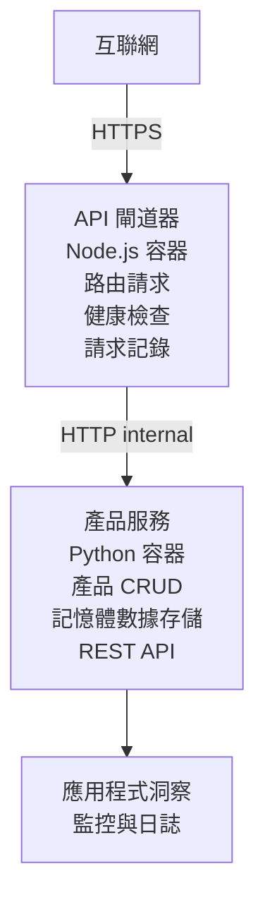

# 微服務架構 - Container App 範例

⏱️ <strong>預計時間</strong>：25-35 分鐘 | 💰 <strong>預計費用</strong>：約 $50-100/月 | ⭐ <strong>難度</strong>：進階

一個 <strong>簡化但功能完整</strong> 的微服務架構範例，使用 AZD CLI 部署至 Azure Container Apps。本範例展示服務間通訊、容器編排及監控，採用實用的兩服務設定。

> **📚 學習方法**：本範例從最簡的兩服務架構（API Gateway + 後端服務）開始，讓你可以實際部署與學習。掌握基礎後，我們提供擴展至完整微服務生態系的指引。

## 你將學習到

完成此範例後，你將會：
- 將多個容器部署到 Azure Container Apps
- 實作服務間內網通訊
- 根據環境設定自動調整擴縮及健康檢查
- 使用 Application Insights 監控分散式應用程式
- 了解微服務部署模式與最佳實踐
- 從簡到繁逐步擴展架構

## 架構說明

### 第一階段：我們要打造的系統（包含於本範例）


**為什麼從簡單開始？**
- ✅ 快速部署並理解（25-35 分鐘）
- ✅ 學習核心微服務模式，無複雜性
- ✅ 有實作可修改和測試的程式碼
- ✅ 學習成本低（約 $50-100/月 vs $300-1400/月）
- ✅ 建立信心，再加入資料庫與訊息佇列

<strong>比喻</strong>：就像學開車，先在空的停車場（兩服務）熟悉基礎後，再進入市區交通（五個以上服務含資料庫）。

### 第二階段：未來擴展（參考架構）

熟悉兩服務架構後，即可擴展成：

```
Full Architecture (Not Included - For Reference)
├── API Gateway (✅ Included)
├── Product Service (✅ Included)
├── Order Service (🔜 Add next)
├── User Service (🔜 Add next)
├── Notification Service (🔜 Add last)
├── Azure Service Bus (🔜 For async communication)
├── Cosmos DB (🔜 For product persistence)
├── Azure SQL (🔜 For order management)
└── Azure Storage (🔜 For file storage)
```

請參閱最末的「擴充指南」章節，取得逐步流程。

## 包含的功能

✅ <strong>服務發現</strong>：容器間自動 DNS 探索  
✅ <strong>負載平衡</strong>：跨複本的內建負載均衡  
✅ <strong>自動擴縮</strong>：依 HTTP 請求獨立調整各服務複本數  
✅ <strong>健康監控</strong>：活躍性（liveness）與準備好（readiness）檢查  
✅ <strong>分散式日誌</strong>：集中式 Application Insights 日誌  
✅ <strong>內部網路</strong>：安全的服務間通訊  
✅ <strong>容器編排</strong>：自動部署與擴縮  
✅ <strong>零停機更新</strong>：滾動更新搭配版本管理  

## 前置作業

### 需要的工具

開始前確認已安裝：

1. **[Azure Developer CLI (azd)](https://learn.microsoft.com/azure/developer/azure-developer-cli/install-azd)**（版本 1.0.0 或以上）
   ```bash
   azd version
   # 預期輸出：azd 版本 1.0.0 或更高版本
   ```

2. **[Azure CLI](https://learn.microsoft.com/cli/azure/install-azure-cli)**（版本 2.50.0 或以上）
   ```bash
   az --version
   # 預期輸出：azure-cli 2.50.0 或更高版本
   ```

3. **[Docker](https://www.docker.com/get-started)**（用於本機開發/測試 - 選用）
   ```bash
   docker --version
   # 預期輸出: Docker 版本 20.10 或以上
   ```

### Azure 要求

- 有效 **Azure 訂閱** （[建立免費帳戶](https://azure.microsoft.com/free/)）
- 在訂閱中有建立資源權限
- 訂閱或資源群組具備 **Contributor** 角色

### 知識基礎

此為 <strong>進階</strong> 範例，你應該：
- 完成 [Simple Flask API 範例](../../../../../examples/container-app/simple-flask-api) 
- 了解基本微服務架構
- 熟悉 REST API 與 HTTP
- 理解容器概念

**Container Apps 新手？** 建議先從 [Simple Flask API 範例](../../../../../examples/container-app/simple-flask-api) 學起。

## 快速開始（一步步操作）

### 步驟 1：克隆並切換目錄

```bash
git clone https://github.com/microsoft/AZD-for-beginners.git
cd AZD-for-beginners/examples/container-app/microservices
```

**✓ 成功檢查**：確認可看到 `azure.yaml` 檔案：
```bash
ls
# 預期：README.md、azure.yaml、infra/、src/
```

### 步驟 2：登入 Azure

```bash
azd auth login
```

此時會開啟瀏覽器，請以你的 Azure 帳號登入。

**✓ 成功檢查**：應看到：
```
Logged in to Azure.
```

### 步驟 3：初始化環境

```bash
azd init
```

<strong>將看到詢問</strong>：
- <strong>環境名稱</strong>：輸入簡短名稱（例如 `microservices-dev`）
- **Azure 訂閱**：選擇你的訂閱
- **Azure 地區**：選擇區域（如 `eastus`、`westeurope`）

**✓ 成功檢查**：應看到：
```
SUCCESS: New project initialized!
```

### 步驟 4：部署基礎設施及服務

```bash
azd up
```

<strong>流程說明</strong>（約 8-12 分鐘）：
1. 建立 Container Apps 環境
2. 建立 Application Insights 監控
3. 建構 API Gateway 容器（Node.js）
4. 建構產品服務容器（Python）
5. 部署兩個容器到 Azure
6. 配置網路與健康檢查
7. 設定監控與日誌

**✓ 成功檢查**：應看到：
```
SUCCESS: Your application was deployed to Azure in X minutes Y seconds.
Endpoint: https://api-gateway-<unique-id>.azurecontainerapps.io
```

**⏱️ 時間**：8-12 分鐘

### 步驟 5：測試部署結果

```bash
# 獲取閘道端點
GATEWAY_URL=$(azd env get-values | grep API_GATEWAY_URL | cut -d '=' -f2 | tr -d '"')

# 測試 API Gateway 健康狀況
curl $GATEWAY_URL/health

# 預期輸出：
# {"status":"healthy","service":"api-gateway","timestamp":"2025-11-19T10:30:00Z"}
```

**透過 Gateway 測試商品服務**：
```bash
# 列出產品
curl $GATEWAY_URL/api/products

# 預期輸出：
# [
#   {"id":1,"name":"筆記型電腦","price":999.99,"stock":50},
#   {"id":2,"name":"滑鼠","price":29.99,"stock":200},
#   {"id":3,"name":"鍵盤","price":79.99,"stock":150}
# ]
```

**✓ 成功檢查**：兩個端點皆回傳 JSON 資料且無錯誤。

---

**🎉 恭喜！** 你已成功部署一個微服務架構到 Azure！

## 專案結構

完整實作檔案皆包含，此為可運作的完整範例：

```
microservices/
│
├── README.md                         # This file
├── azure.yaml                        # AZD configuration
├── .gitignore                        # Git ignore patterns
│
├── infra/                           # Infrastructure as Code (Bicep)
│   ├── main.bicep                   # Main orchestration
│   ├── abbreviations.json           # Naming conventions
│   ├── core/                        # Shared infrastructure
│   │   ├── container-apps-environment.bicep  # Container environment + registry
│   │   └── monitor.bicep            # Application Insights + Log Analytics
│   └── app/                         # Service definitions
│       ├── api-gateway.bicep        # API Gateway container app
│       └── product-service.bicep    # Product Service container app
│
└── src/                             # Application source code
    ├── api-gateway/                 # Node.js API Gateway
    │   ├── app.js                   # Express server with routing
    │   ├── package.json             # Node dependencies
    │   └── Dockerfile               # Container definition
    └── product-service/             # Python Product Service
        ├── main.py                  # Flask API with product data
        ├── requirements.txt         # Python dependencies
        └── Dockerfile               # Container definition
```

**各元件說明：**

**基礎設施（infra/）**：
- `main.bicep`：負責協調所有 Azure 資源與其相依關係
- `core/container-apps-environment.bicep`：建立 Container Apps 環境與 Azure Container Registry
- `core/monitor.bicep`：建立 Application Insights 以做分散式日誌
- `app/*.bicep`：各個容器應用定義，包括擴縮及健康檢查

**API Gateway（src/api-gateway/）**：
- 對外公開，路由請求到後端服務
- 實現日誌記錄、錯誤處理及請求轉發
- 示範服務間 HTTP 通訊範例

**產品服務（src/product-service/）**：
- 內部服務，簡易商品目錄（記憶體方式）
- REST API，具健康檢查
- 展示後端微服務模式示範

## 服務一覽

### API Gateway (Node.js/Express)

<strong>連接埠</strong>：8080  
<strong>存取權限</strong>：公開（外部流量入口）  
<strong>用途</strong>：將請求導向相應後端服務  

<strong>端點</strong>：
- `GET /` - 服務資訊
- `GET /health` - 健康檢查端點
- `GET /api/products` - 轉發至產品服務（列所有）
- `GET /api/products/:id` - 轉發至產品服務（依 ID 查詢）

<strong>主要功能</strong>：
- 請求路由（使用 axios）
- 集中式日誌
- 錯誤處理與超時管理
- 透過環境變數做服務發現
- 整合 Application Insights

<strong>程式碼重點</strong>（`src/api-gateway/app.js`）：
```javascript
// 內部服務通訊
app.get('/api/products', async (req, res) => {
  const response = await axios.get(`${PRODUCT_SERVICE_URL}/products`);
  res.json(response.data);
});
```

### 產品服務 (Python/Flask)

<strong>連接埠</strong>：8000  
<strong>存取權限</strong>：僅內部可用（無外部入口）  
<strong>用途</strong>：管理商品目錄，使用記憶體資料  

<strong>端點</strong>：
- `GET /` - 服務資訊
- `GET /health` - 健康檢查端點
- `GET /products` - 列出所有商品
- `GET /products/<id>` - 依 ID 取得商品

<strong>主要功能</strong>：
- 使用 Flask 實作 RESTful API
- 記憶體儲存商品（簡單無資料庫需求）
- 健康檢查探針
- 結構化日誌
- 整合 Application Insights

<strong>資料模型</strong>：
```python
{
  "id": 1,
  "name": "Laptop",
  "description": "High-performance laptop",
  "price": 999.99,
  "stock": 50
}
```

**為何內部專用？**  
產品服務不公開，所有請求必須經由 API Gateway，提供：
- 安全性：控制存取點
- 彈性：可變更後端不影響客戶端
- 監控：集中式請求日誌

## 服務通訊理解

### 服務如何互相通訊

本範例中，API Gateway 透過 **內部 HTTP 呼叫** 與產品服務通訊：

```javascript
// API 網關 (src/api-gateway/app.js)
const PRODUCT_SERVICE_URL = process.env.PRODUCT_SERVICE_URL;

// 發出內部 HTTP 請求
const response = await axios.get(`${PRODUCT_SERVICE_URL}/products`);
```

<strong>重點</strong>：

1. **DNS 探索**：Container Apps 自動提供內部服務 DNS  
   - 產品服務完整域名：`product-service.internal.<environment>.azurecontainerapps.io`  
   - 簡化為：`http://product-service`（由 Container Apps 解析）

2. <strong>不公開外網</strong>：產品服務 Bicep 設定為 `external: false`  
   - 僅能從 Container Apps 環境內部存取  
   - 無法網際網路直接連線

3. <strong>環境變數</strong>：服務 URL 由部署期間注入  
   - Bicep 會將內部 FQDN 傳給 Gateway  
   - 程式碼無硬編 URL

<strong>比喻</strong>：如同辦公室中櫃檯（API Gateway，對外）與只有內部人員可進入的辦公室（產品服務）。訪客需先至櫃檯才能進辦公室。

## 部署選項

### 完整部署（推薦）

```bash
# 部署基礎設施及兩個服務
azd up
```

會部署：
1. Container Apps 環境
2. Application Insights
3. 容器註冊表
4. API Gateway 容器
5. 產品服務容器

<strong>時間</strong>：8-12 分鐘

### 單一服務部署

```bash
# 只部署一個服務（於初次 azd up 之後）
azd deploy api-gateway

# 或者部署產品服務
azd deploy product-service
```

<strong>用例</strong>：當你更新某項服務程式碼，只重新部署該服務。

### 更新設定

```bash
# 更改縮放參數
azd env set GATEWAY_MAX_REPLICAS 30

# 使用新配置重新部署
azd up
```

## 設定說明

### 擴縮設定

兩個服務在 Bicep 中均設有基於 HTTP 的自動擴縮：

**API Gateway**：
- 最小複本：2（確保可用性）
- 最大複本：20
- 擴縮觸發：每複本 50 個同時請求

<strong>產品服務</strong>：
- 最小複本：1（可縮減至 0）
- 最大複本：10
- 擴縮觸發：每複本 100 個同時請求

<strong>自訂擴縮</strong>（於 `infra/app/*.bicep`）：
```bicep
scale: {
  minReplicas: 1
  maxReplicas: 10
  rules: [
    {
      name: 'http-scale-rule'
      http: {
        metadata: {
          concurrentRequests: '100'  // Adjust this
        }
      }
    }
  ]
}
```

### 資源配置

**API Gateway**：
- CPU：1.0 vCPU
- 記憶體：2 GiB
- 理由：負責所有外部流量

<strong>產品服務</strong>：
- CPU：0.5 vCPU
- 記憶體：1 GiB
- 理由：輕量記憶體操作

### 健康檢查

兩服務皆包含活躍性與準備好檢查：

```bicep
probes: [
  {
    type: 'Liveness'
    httpGet: {
      path: '/health'
      port: 8080
    }
    initialDelaySeconds: 10
    periodSeconds: 30
  }
  {
    type: 'Readiness'
    httpGet: {
      path: '/health'
      port: 8080
    }
    initialDelaySeconds: 5
    periodSeconds: 10
  }
]
```

<strong>含義</strong>：
- <strong>活躍性檢查</strong>：若失敗，Container Apps 會重啟容器
- <strong>準備好檢查</strong>：若尚未準備，Container Apps 停止對該複本路由流量


## 監控與可觀察性

### 查看服務日誌

```bash
# 使用 azd monitor 檢視日誌
azd monitor --logs

# 或使用 Azure CLI 檢視特定容器應用程式：
# 從 API Gateway 串流日誌
az containerapp logs show --name api-gateway --resource-group $RG_NAME --follow

# 檢視最新的產品服務日誌
az containerapp logs show --name product-service --resource-group $RG_NAME --tail 100
```

<strong>預期輸出</strong>：
```
[api-gateway] API Gateway listening on port 8080
[api-gateway] Product Service URL: http://product-service
[api-gateway] GET /api/products 200 - 45ms
[product-service] Retrieved 5 products
```

### Application Insights 查詢

於 Azure 入口網站的 Application Insights 建立並執行以下查詢：

<strong>尋找慢速請求</strong>：
```kusto
requests
| where timestamp > ago(1h)
| where duration > 1000  // Requests taking >1 second
| summarize count() by name, cloud_RoleName
| order by count_ desc
```

<strong>追蹤服務間呼叫</strong>：
```kusto
dependencies
| where timestamp > ago(1h)
| where type == "Http"
| project timestamp, name, target, duration, success
| order by timestamp desc
```

<strong>按服務統計錯誤率</strong>：
```kusto
exceptions
| where timestamp > ago(24h)
| summarize errorCount = count() by cloud_RoleName, type
| order by errorCount desc
```

<strong>請求量隨時間變化</strong>：
```kusto
requests
| where timestamp > ago(1h)
| summarize requestCount = count() by bin(timestamp, 5m), cloud_RoleName
| render timechart
```

### 監控儀表板存取

```bash
# 獲取應用程式洞察詳細資訊
azd env get-values | grep APPLICATIONINSIGHTS

# 開啟 Azure 入口網站監控
az monitor app-insights component show \
  --app $(azd env get-values | grep APPLICATIONINSIGHTS_CONNECTION_STRING | cut -d '=' -f2) \
  --resource-group $(azd env get-values | grep AZURE_RESOURCE_GROUP | cut -d '=' -f2) \
  --query "appId" -o tsv
```

### 即時度量

1. 在 Azure 入口網站中開啟 Application Insights
2. 點擊「即時度量」
3. 查看即時請求數、失敗率和效能
4. 測試指令：`curl $(azd env get-values | grep API_GATEWAY_URL | cut -d '=' -f2 | tr -d '"')/api/products`

## 實務練習

[備註：完整練習請見上方「實務練習」章節，涵蓋部署驗證、資料修改、自動擴縮測試、錯誤處理及新增第三服務等詳盡步驟。]

## 成本分析

### 預估月費（此兩服務範例）

| 資源 | 配置 | 預估費用 |
|----------|--------------|----------------|
| API Gateway | 2-20 複本，1 vCPU，2GB 記憶體 | $30-150 |
| 產品服務 | 1-10 複本，0.5 vCPU，1GB 記憶體 | $15-75 |
| 容器註冊表 | Basic 等級 | $5 |
| Application Insights | 1-2 GB/月 | $5-10 |
| Log Analytics | 1 GB/月 | $3 |
| <strong>總計</strong> | | **$58-243/月** |

<strong>依使用量費用細分</strong>：
- <strong>低流量</strong>（測試/學習）：約 $60/月
- <strong>中流量</strong>（小型生產）：約 $120/月
- <strong>高流量</strong>（繁忙期間）：約 $240/月

### 成本優化建議

1. <strong>開發時縮減到零</strong>：
   ```bicep
   scale: {
     minReplicas: 0  // Save $30-40/month when not in use
     maxReplicas: 10
   }
   ```

2. **新增 Cosmos DB 時使用消費方案**：
   - 僅為使用量付費  
   - 無最低收費

3. **設定 Application Insights 抽樣**：
   ```javascript
   appInsights.defaultClient.config.samplingPercentage = 50; // 範例 50% 的請求
   ```

4. <strong>不使用時請清理資源</strong>：
   ```bash
   azd down
   ```

### 免費方案選擇

作為學習/測試用途，建議考慮：
- 使用 Azure 免費額度（首 30 天）
- 保持最少複本數量
- 測試後刪除（避免持續費用）

---

## 清理工作

為避免持續費用，請刪除所有資源：

```bash
azd down --force --purge
```

<strong>確認提示</strong>：
```
? Total resources to delete: 6, are you sure you want to continue? (y/N)
```

輸入 `y` 以確認。

<strong>刪除項目</strong>：
- Container Apps 環境
- 兩個 Container Apps（gateway 與 product service）
- Container Registry
- Application Insights
- Log Analytics 工作區
- 資源組

**✓ 驗證清理**：
```bash
az group list --query "[?starts_with(name,'rg-microservices')]" --output table
```

應該回傳空值。

---

## 擴展指南：從 2 個服務擴展到 5 個以上

一旦你掌握了這個兩服務架構，下面是擴展的方法：

### 階段 1：新增資料庫持久化（下一步）

**為產品服務新增 Cosmos DB**：

1. 建立 `infra/core/cosmos.bicep`：
   ```bicep
   resource cosmosAccount 'Microsoft.DocumentDB/databaseAccounts@2023-04-15' = {
     name: name
     location: location
     kind: 'GlobalDocumentDB'
     properties: {
       databaseAccountOfferType: 'Standard'
       locations: [{ locationName: location, failoverPriority: 0 }]
     }
   }
   ```

2. 更新產品服務以使用 Cosmos DB 取代記憶體資料

3. 預估額外費用：約 $25/月（serverless）

### 階段 2：新增第三個服務（訂單管理）

<strong>建立訂單服務</strong>：

1. 新資料夾：`src/order-service/`（Python/Node.js/C#）
2. 新 Bicep：`infra/app/order-service.bicep`
3. 更新 API Gateway 以路由 `/api/orders`
4. 新增 Azure SQL Database 來持久化訂單資料

<strong>架構如下</strong>：
```
API Gateway → Product Service (Cosmos DB)
           → Order Service (Azure SQL)
```

### 階段 3：新增非同步通訊（Service Bus）

<strong>實作事件驅動架構</strong>：

1. 新增 Azure Service Bus：`infra/core/servicebus.bicep`
2. 產品服務發佈「ProductCreated」事件
3. 訂單服務訂閱產品事件
4. 新增通知服務處理事件

<strong>模式</strong>：請求/回應 (HTTP) + 事件驅動 (Service Bus)

### 階段 4：新增用戶認證

<strong>實作用戶服務</strong>：

1. 建立 `src/user-service/`（Go/Node.js）
2. 新增 Azure AD B2C 或自訂 JWT 認證
3. API Gateway 驗證憑證
4. 服務端檢查用戶權限

### 階段 5：生產就緒

<strong>新增以下元件</strong>：
- Azure Front Door（全球負載平衡）
- Azure Key Vault（密鑰管理）
- Azure Monitor 工作簿（自訂儀表板）
- CI/CD Pipeline（GitHub Actions）
- 藍綠部署
- 所有服務的託管身分

<strong>完整生產架構費用</strong>：約 $300-1,400/月

---

## 了解更多

### 相關文件
- [Azure Container Apps 文件](https://learn.microsoft.com/azure/container-apps/)
- [微服務架構指南](https://learn.microsoft.com/azure/architecture/guide/architecture-styles/microservices)
- [分散式追蹤的 Application Insights](https://learn.microsoft.com/azure/azure-monitor/app/distributed-tracing)
- [Azure Developer CLI 文件](https://learn.microsoft.com/azure/developer/azure-developer-cli/)

### 課程後續步驟
- ← 上一節：[簡易 Flask API](../../../../../examples/container-app/simple-flask-api) - 初學單容器範例
- → 下一節：[AI 集成指南](../../../../../examples/docs/ai-foundry) - 新增 AI 功能
- 🏠 [課程首頁](../../README.md)

### 比較：使用時機

**單一 Container App**（簡易 Flask API 範例）：
- ✅ 簡單應用
- ✅ 單體架構
- ✅ 部署快速
- ❌ 可擴展性有限
- <strong>費用</strong>：約 $15-50/月

<strong>微服務</strong>（本範例）：
- ✅ 複雜應用
- ✅ 可獨立擴展服務
- ✅ 團隊自治（不同服務由不同團隊維護）
- ❌ 管理較複雜
- <strong>費用</strong>：約 $60-250/月

**Kubernetes (AKS)**：
- ✅ 最大控制與彈性
- ✅ 多雲可攜性
- ✅ 進階網路功能
- ❌ 需具備 Kubernetes 專業知識
- <strong>費用</strong>：最低約 $150-500/月

<strong>建議</strong>：先從 Container Apps（本範例）開始，只有在需要 Kubernetes 專屬功能時才考慮移轉到 AKS。

---

## 常見問題

**問：為什麼只有 2 個服務而不是 5 個以上？**  
答：為了學習進度漸進。透過簡單範例掌握基礎（服務通訊、監控、擴展），再加入複雜度。你學到的模式同樣適用於 100 個服務的架構。

**問：我可以自己新增更多服務嗎？**  
答：完全可以！請依擴展指南操作。每個新服務走同樣流程：新增 src 資料夾、建立 Bicep 檔案、更新 azure.yaml、部署。

**問：這適合生產環境嗎？**  
答：是穩固的基礎。生產環境還需加上：託管身分、Key Vault、資料庫持久化、CI/CD 管線、監控警示與備份策略。

**問：為什麼不使用 Dapr 或其他服務網格？**  
答：為了簡化學習。一旦你了解原生 Container Apps 網路，就能再加入 Dapr 來應對進階場景。

**問：如何本地除錯？**  
答：使用 Docker 本地執行服務：
```bash
cd src/api-gateway
docker build -t local-gateway .
docker run -p 8080:8080 -e PRODUCT_SERVICE_URL=http://localhost:8000 local-gateway
```

**問：可以用不同程式語言嗎？**  
答：可以！本範例示範 Node.js（gateway）+ Python（product service）。你可以混合任何能跑在容器的語言。

**問：如果我沒有 Azure 額度怎麼辦？**  
答：使用 Azure 免費層（新帳號前 30 天）或短暫測試後立即刪除。

---

> **🎓 學習路徑摘要**：你已學會部署具自動擴展、內部網路、集中監控和生產模式的多服務架構。這基礎幫助你邁向複雜分散式系統與企業微服務架構。

**📚 課程導覽：**
- ← 上一節：[簡易 Flask API](../../../../../examples/container-app/simple-flask-api)
- → 下一節：[資料庫整合範例](../../../../../examples/database-app)
- 🏠 [課程首頁](../../../README.md)
- 📖 [Container Apps 最佳實踐](../../../docs/chapter-04-infrastructure/deployment-guide.md)

---

<!-- CO-OP TRANSLATOR DISCLAIMER START -->
**免責聲明**：  
本文件使用 AI 翻譯服務 [Co-op Translator](https://github.com/Azure/co-op-translator) 進行翻譯。雖然我們致力於確保準確性，但請注意自動翻譯可能包含錯誤或不準確之處。原文文件的母語版本應被視為權威來源。對於重要資訊，建議尋求專業人工翻譯。我們對因使用此翻譯而引起的任何誤解或誤釋概不負責。
<!-- CO-OP TRANSLATOR DISCLAIMER END -->