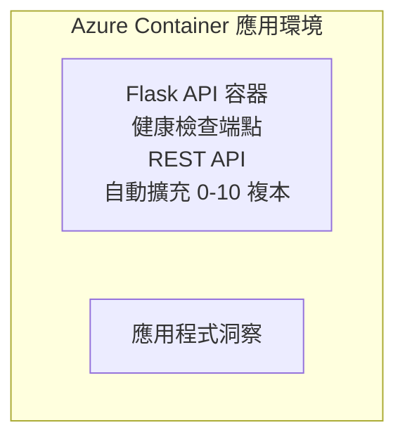

# Simple Flask API - Container App 範例

**學習路徑：** 初學者 ⭐ | **時間：** 25-35 分鐘 | **費用：** $0-15/月

一個完整的、運作中的 Python Flask REST API，使用 Azure Developer CLI (azd) 部署到 Azure Container Apps。本範例展示容器部署、自動擴展與監控基礎。

## 🎯 你將學會

- 將容器化的 Python 應用程式部署到 Azure
- 配置可擴展到零的自動擴展
- 實作健康偵測與準備狀態檢查
- 監控應用程式日誌與指標
- 使用 Azure Developer CLI 快速部署

## 📦 內容包含

✅ **Flask 應用程式** - 完整的 CRUD REST API (`src/app.py`)  
✅ **Dockerfile** - 生產環境容器配置  
✅ **Bicep 基礎設施** - Container Apps 環境與 API 部署  
✅ **AZD 配置** - 一鍵部署設定  
✅ <strong>健康探針</strong> - 已配置生命週期及準備檢查  
✅ <strong>自動擴展</strong> - HTTP 負載基礎的 0-10 副本數 

## 架構



## 前置需求

### 必備
- **Azure Developer CLI (azd)** - [安裝指南](https://learn.microsoft.com/azure/developer/azure-developer-cli/install-azd)
- **Azure 訂閱** - [免費帳戶](https://azure.microsoft.com/free/)
- **Docker Desktop** - [安裝 Docker](https://www.docker.com/products/docker-desktop/)（用於本地測試）

### 驗證前置需求

```bash
# 檢查 azd 版本（需要 1.5.0 或更高）
azd version

# 驗證 Azure 登入
azd auth login

# 檢查 Docker（可選，用於本地測試）
docker --version
```

## ⏱️ 部署時間表

| 階段 | 時間長度 | 發生事項 |
|-------|----------|--------------||
| 環境設置 | 30 秒 | 建立 azd 環境 |
| 建置容器 | 2-3 分鐘 | Docker 建置 Flask 應用 |
| 佈建基礎設施 | 3-5 分鐘 | 創建 Container Apps、映像庫、監控 |
| 部署應用程式 | 2-3 分鐘 | 推送映像並部署到 Container Apps |
| <strong>總計</strong> | **8-12 分鐘** | 完成部署準備 |

## 快速入門

```bash
# 導航至範例
cd examples/container-app/simple-flask-api

# 初始化環境（選擇唯一名稱）
azd env new myflaskapi

# 部署所有內容（基礎設施 + 應用程式）
azd up
# 你將會被提示：
# 1. 選擇 Azure 訂閱
# 2. 選擇地區（例如 eastus2）
# 3. 等待 8-12 分鐘以完成部署

# 取得你的 API 端點
azd env get-values

# 測試 API
curl $(azd env get-value API_ENDPOINT)/health
```

**預期輸出：**
```json
{
  "status": "healthy",
  "timestamp": "2025-11-19T10:30:00Z",
  "service": "simple-flask-api",
  "version": "1.0.0"
}
```

## ✅ 驗證部署

### 第 1 步：檢查部署狀態

```bash
# 查看已部署的服務
azd show

# 預期輸出顯示：
# - 服務：api
# - 端點：https://ca-api-[env].xxx.azurecontainerapps.io
# - 狀態：運行中
```

### 第 2 步：測試 API 端點

```bash
# 獲取 API 端點
API_URL=$(azd env get-value API_ENDPOINT)

# 測試健康狀況
curl $API_URL/health

# 測試根端點
curl $API_URL/

# 建立一個項目
curl -X POST $API_URL/api/items \
  -H "Content-Type: application/json" \
  -d '{"name": "Test Item", "description": "My first item"}'

# 獲取所有項目
curl $API_URL/api/items
```

**成功標準：**
- ✅ Health 端點返回 HTTP 200
- ✅ 根目錄端點顯示 API 資訊
- ✅ POST 建立項目並返回 HTTP 201
- ✅ GET 返回已建立的項目

### 第 3 步：查看日誌

```bash
# 使用 azd 監控實時串流日誌
azd monitor --logs

# 或使用 Azure CLI：
az containerapp logs show --name api --resource-group $RG_NAME --follow

# 你應該會看到：
# - Gunicorn 啟動訊息
# - HTTP 請求日誌
# - 應用程式資訊日誌
```

## 專案結構

```
simple-flask-api/
├── azure.yaml              # AZD configuration
├── infra/
│   ├── main.bicep         # Main infrastructure
│   ├── main.parameters.json
│   └── app/
│       ├── container-env.bicep
│       └── api.bicep
└── src/
    ├── app.py             # Flask application
    ├── requirements.txt
    └── Dockerfile
```

## API 端點

| 端點 | 方法 | 描述 |
|----------|--------|-------------|
| `/health` | GET | 健康檢查 |
| `/api/items` | GET | 列出所有項目 |
| `/api/items` | POST | 建立新項目 |
| `/api/items/{id}` | GET | 取得特定項目 |
| `/api/items/{id}` | PUT | 更新項目 |
| `/api/items/{id}` | DELETE | 刪除項目 |

## 配置

### 環境變數

```bash
# 設置自訂配置
azd env set PORT 8000
azd env set LOG_LEVEL info
azd env set MAX_REPLICAS 20
```

### 擴展配置

API 會根據 HTTP 流量自動伸縮：
- <strong>最小副本數</strong>：0（閒置時自動縮減至零）
- <strong>最大副本數</strong>：10
- <strong>每副本同時處理請求數</strong>：50

## 開發

### 本地運行

```bash
# 安裝依賴
cd src
pip install -r requirements.txt

# 運行應用程式
python app.py

# 本地測試
curl http://localhost:8000/health
```

### 建置及測試容器

```bash
# 建立 Docker 映像檔
docker build -t flask-api:local ./src

# 本地運行容器
docker run -p 8000:8000 flask-api:local

# 測試容器
curl http://localhost:8000/health
```

## 部署

### 完整部署

```bash
# 部署基礎設施及應用程式
azd up
```

### 僅程式碼部署

```bash
# 只部署應用程式代碼（基礎設施不變）
azd deploy api
```

### 更新配置

```bash
# 更新環境變量
azd env set API_KEY "new-api-key"

# 使用新配置重新部署
azd deploy api
```

## 監控

### 查看日誌

```bash
# 使用 azd monitor 串流即時日誌
azd monitor --logs

# 或使用 Azure CLI 管理容器應用：
az containerapp logs show --name api --resource-group $RG_NAME --follow

# 查看最近 100 行
az containerapp logs show --name api --resource-group $RG_NAME --tail 100
```

### 監控指標

```bash
# 打開 Azure 監控儀表板
azd monitor --overview

# 查看特定指標
az monitor metrics list \
  --resource $(azd show --output json | jq -r '.services.api.resourceId') \
  --metric "Requests,ResponseTime"
```

## 測試

### 健康檢查

```bash
curl $(azd show --output json | jq -r '.services.api.endpoint')/health
```

預期回應：
```json
{
  "status": "healthy",
  "timestamp": "2025-11-19T10:30:00Z"
}
```

### 建立項目

```bash
curl -X POST $(azd show --output json | jq -r '.services.api.endpoint')/api/items \
  -H "Content-Type: application/json" \
  -d '{"name": "Test Item", "description": "A test item"}'
```

### 取得所有項目

```bash
curl $(azd show --output json | jq -r '.services.api.endpoint')/api/items
```

## 成本優化

此部署使用可擴展至零功能，只有 API 處理請求時才計費：

- <strong>閒置成本</strong>：約 $0/月（縮減至零副本）
- <strong>活躍成本</strong>：約 $0.000024/秒/副本
- <strong>預期每月成本</strong>（輕度使用）：$5-15

### 進一步降低成本

```bash
# 將最大副本數調低至開發環境
azd env set MAX_REPLICAS 3

# 使用較短的空閒超時時間
azd env set SCALE_TO_ZERO_TIMEOUT 300  # 5分鐘
```

## 疑難排解

### 容器無法啟動

```bash
# 使用 Azure CLI 檢查容器日誌
az containerapp logs show --name api --resource-group $RG_NAME --tail 100

# 驗證 Docker 映像在本地構建
docker build -t test ./src
```

### API 無法存取

```bash
# 驗證入口是否為外部
az containerapp show --name api --resource-group rg-simple-flask-api \
  --query properties.configuration.ingress.external
```

### 回應時間過長

```bash
# 檢查 CPU/記憶體 使用情況
az monitor metrics list \
  --resource $(azd show --output json | jq -r '.services.api.resourceId') \
  --metric "CPUPercentage,MemoryPercentage"

# 如有需要，擴大資源規模
az containerapp update --name api --resource-group rg-simple-flask-api \
  --cpu 1.0 --memory 2Gi
```

## 清理

```bash
# 刪除所有資源
azd down --force --purge
```

## 下一步

### 擴充此範例

1. <strong>新增資料庫</strong> - 整合 Azure Cosmos DB 或 SQL 資料庫
   ```bash
   # 將 Cosmos DB 模組加入 infra/main.bicep
   # 使用資料庫連接更新 app.py
   ```

2. <strong>新增驗證</strong> - 實作 Microsoft Entra ID 或 API 金鑰
   ```python
   # 在 app.py 中新增身份驗證中介軟件
   from functools import wraps
   ```

3. **設定 CI/CD** - GitHub Actions 工作流程
   ```yaml
   # Create .github/workflows/deploy.yml
   name: Deploy to Azure
   on: [push]
   ```

4. <strong>新增託管身份</strong> - 安全存取 Azure 服務
   ```bicep
   # Update infra/app/api.bicep
   identity: { type: 'SystemAssigned' }
   ```

### 相關範例

- **[資料庫應用](../../../../../examples/database-app)** - 完整的 SQL 資料庫範例
- **[微服務](../../../../../examples/container-app/microservices)** - 多服務架構
- **[Container Apps 主導指南](../README.md)** - 所有容器部署範本

### 學習資源

- 📚 [AZD 初學者課程](../../../README.md) - 主課程首頁
- 📚 [Container Apps 範本集](../README.md) - 更多部署範本
- 📚 [AZD 範本庫](https://azure.github.io/awesome-azd/) - 社群範本

## 其他資源

### 文件
- **[Flask 文件](https://flask.palletsprojects.com/)** - Flask 框架指南
- **[Azure Container Apps](https://learn.microsoft.com/azure/container-apps/)** - 官方 Azure 文件
- **[Azure Developer CLI](https://learn.microsoft.com/azure/developer/azure-developer-cli/)** - azd 指令參考

### 教學
- **[Container Apps 快速開始](https://learn.microsoft.com/azure/container-apps/quickstart-portal)** - 部署你的第一個應用程式
- **[Python 在 Azure](https://learn.microsoft.com/azure/developer/python/)** - Python 開發指南
- **[Bicep 語言](https://learn.microsoft.com/azure/azure-resource-manager/bicep/)** - 基礎建設即程式碼

### 工具
- **[Azure 入口網站](https://portal.azure.com)** - 視覺化管理資源
- **[VS Code Azure 擴充](https://marketplace.visualstudio.com/items?itemName=ms-azuretools.vscode-azurecontainerapps)** - IDE 整合

---

**🎉 恭喜！** 你已成功部署具備自動擴展與監控的生產級 Flask API 至 Azure Container Apps。

**有問題？** [開啟 issue](https://github.com/microsoft/AZD-for-beginners/issues) 或查看 [常見問答](../../../resources/faq.md)

---

<!-- CO-OP TRANSLATOR DISCLAIMER START -->
**免責聲明**：
本文件由 AI 翻譯服務 [Co-op Translator](https://github.com/Azure/co-op-translator) 翻譯而成。雖然我們致力於確保準確性，但請注意，機器自動翻譯可能包含錯誤或不準確之處。原始文件的母語版本應被視為權威來源。對於重要資訊，建議進行專業人工翻譯。我們不對因使用本翻譯而產生的任何誤解或誤釋承擔責任。
<!-- CO-OP TRANSLATOR DISCLAIMER END -->