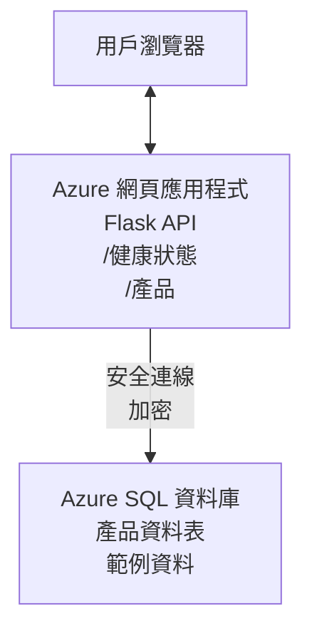

# 使用 AZD 部署 Microsoft SQL 資料庫與 Web 應用程式

⏱️ <strong>預估時間</strong>：20-30 分鐘 | 💰 <strong>預估成本</strong>：約 $15-25/月 | ⭐ <strong>難度</strong>：中階

此 <strong>完整且可運作的範例</strong> 示範如何使用 [Azure Developer CLI (azd)](https://learn.microsoft.com/azure/developer/azure-developer-cli/) 部署帶有 Microsoft SQL 資料庫的 Python Flask 網站應用程式至 Azure。所有程式碼均已包含並測試過 — 無需任何外部依賴。

## 您將會學到什麼

完成本範例後，您將能夠：
- 使用基礎建設即程式碼部署多層級應用程式（網站應用 + 資料庫）
- 安全配置資料庫連接，避免硬編碼密碼
- 使用 Application Insights 監控應用程式健康
- 使用 AZD CLI 高效管理 Azure 資源
- 遵循 Azure 最佳實務，確保安全性、成本優化與可觀察性

## 情境概述
- <strong>網站應用</strong>：具備資料庫連接的 Python Flask REST API
- <strong>資料庫</strong>：內含範例資料的 Azure SQL Database
- <strong>基礎建設</strong>：使用 Bicep（模組化且可重用的範本）配置
- <strong>部署</strong>：使用 `azd` 命令全自動完成
- <strong>監控</strong>：透過 Application Insights 收集日志與遙測

## 先決條件

### 必備工具

開始前，請確認已安裝以下工具：

1. **[Azure CLI](https://learn.microsoft.com/cli/azure/install-azure-cli)**（版本 2.50.0 或以上）
   ```sh
   az --version
   # 預期輸出：azure-cli 2.50.0 或更高版本
   ```

2. **[Azure Developer CLI (azd)](https://learn.microsoft.com/azure/developer/azure-developer-cli/install-azd)**（版本 1.0.0 或以上）
   ```sh
   azd version
   # 預期輸出：azd 版本 1.0.0 或更高
   ```

3. **[Python 3.8+](https://www.python.org/downloads/)**（本機開發用）
   ```sh
   python --version
   # 預期輸出：Python 3.8 或以上
   ```

4. **[Docker](https://www.docker.com/get-started)**（選用，供本機容器化開發）
   ```sh
   docker --version
   # 預期輸出：Docker 版本 20.10 或以上
   ```

### Azure 需求

- 有效且啟用中的 **Azure 訂閱**（[建立免費帳戶](https://azure.microsoft.com/free/)）
- 有訂閱內建立資源的許可權
- 在訂閱或資源群組擁有 <strong>擁有者</strong> 或 <strong>參與者</strong> 角色

### 知識預備

此範例屬 <strong>中階</strong>。建議您已熟悉：
- 基本指令列操作
- 雲端基本概念（資源、資源群組）
- 網站應用與資料庫基礎知識

**剛接觸 AZD？** 請先參考 [快速入門指南](../../docs/chapter-01-foundation/azd-basics.md)。

## 架構

此範例部署雙層架構，包含網站應用與 SQL 資料庫：



**資源部署：**
- <strong>資源群組</strong>：所有資源容器
- **App Service 計劃**：Linux 主機方案（B1 等級以控制成本）
- <strong>網站應用</strong>：Python 3.11 執行環境與 Flask 應用程式
- **SQL 伺服器**：具 TLS 1.2 以上安全性管理資料庫伺服器
- **SQL 資料庫**：基礎版（2GB，適合開發/測試）
- **Application Insights**：監控與日誌記錄
- **Log Analytics 工作區**：集中式日誌存放

<strong>比喻</strong>：就像餐廳（網站應用）有個冰庫（資料庫）。顧客透過菜單（API 端點）點餐，廚房（Flask 應用）從冰庫取出原料（資料）。餐廳經理（Application Insights）監控整個流程。

## 資料夾結構

本範例包含所有檔案 — 無需外部依賴：

```
examples/database-app/
│
├── README.md                    # This file
├── azure.yaml                   # AZD configuration file
├── .env.sample                  # Sample environment variables
├── .gitignore                   # Git ignore patterns
│
├── infra/                       # Infrastructure as Code (Bicep)
│   ├── main.bicep              # Main orchestration template
│   ├── abbreviations.json      # Azure naming conventions
│   └── resources/              # Modular resource templates
│       ├── sql-server.bicep    # SQL Server configuration
│       ├── sql-database.bicep  # Database configuration
│       ├── app-service-plan.bicep  # Hosting plan
│       ├── app-insights.bicep  # Monitoring setup
│       └── web-app.bicep       # Web application
│
└── src/
    └── web/                    # Application source code
        ├── app.py              # Flask REST API
        ├── requirements.txt    # Python dependencies
        └── Dockerfile          # Container definition
```

**各檔案功能說明：**
- **azure.yaml**：指示 AZD 部署內容與位置
- **infra/main.bicep**：協調所有 Azure 資源部署
- **infra/resources/*.bicep**：各單一資源定義（模組化重用）
- **src/web/app.py**：具資料庫邏輯的 Flask 應用
- **requirements.txt**：Python 套件依賴清單
- **Dockerfile**：容器化部署指令

## 快速開始（步驟指南）

### 步驟 1：克隆並切換目錄

```sh
git clone https://github.com/microsoft/AZD-for-beginners.git
cd AZD-for-beginners/examples/database-app
```

**✓ 成功檢查**：確認看到 `azure.yaml` 與 `infra/` 資料夾：
```sh
ls
# 預期: README.md, azure.yaml, infra/, src/
```

### 步驟 2：Azure 驗證登入

```sh
azd auth login
```

此步會開啟瀏覽器以登入 Azure，請使用您的 Azure 帳號登入。

**✓ 成功檢查**：您應看到：
```
Logged in to Azure.
```

### 步驟 3：初始化環境

```sh
azd init
```

<strong>發生什麼事</strong>：AZD 建立本地部署設定。

<strong>您會看到的提示</strong>：
- <strong>環境名稱</strong>：輸入簡短名稱（如 `dev`、`myapp`）
- **Azure 訂閱**：從清單中選擇您的訂閱
- **Azure 地區**：選擇部署區域（如 `eastus`、`westeurope`）

**✓ 成功檢查**：您應看到：
```
SUCCESS: New project initialized!
```

### 步驟 4：準備 Azure 資源

```sh
azd provision
```

<strong>發生什麼事</strong>：AZD 部署所有基礎建設（約需 5-8 分鐘）：
1. 建立資源群組
2. 建立 SQL 伺服器與資料庫
3. 建立 App Service 計劃
4. 建立網站應用
5. 建立 Application Insights
6. 設定網路與安全性

<strong>您需輸入</strong>：
- **SQL 管理員帳號**：輸入帳號名稱（例如 `sqladmin`）
- **SQL 管理員密碼**：輸入強密碼（請保存好！）

**✓ 成功檢查**：您應看到：
```
SUCCESS: Your application was provisioned in Azure in X minutes Y seconds.
You can view the resources created under the resource group rg-<env-name> in Azure Portal:
https://portal.azure.com/#@/resource/subscriptions/.../resourceGroups/rg-<env-name>
```

**⏱️ 時間**：5-8 分鐘

### 步驟 5：部署應用程式

```sh
azd deploy
```

<strong>發生什麼事</strong>：AZD 建置並部署 Flask 應用程式：
1. 打包 Python 應用
2. 建置 Docker 容器映像
3. 推送至 Azure Web App
4. 初始化資料庫含範例資料
5. 啟動應用程式

**✓ 成功檢查**：您應看到：
```
SUCCESS: Your application was deployed to Azure in X minutes Y seconds.
You can view the resources created under the resource group rg-<env-name> in Azure Portal:
https://portal.azure.com/#@/resource/subscriptions/.../resourceGroups/rg-<env-name>
```

**⏱️ 時間**：3-5 分鐘

### 步驟 6：瀏覽應用程式

```sh
azd browse
```

此步驟會在瀏覽器開啟部署好的網站應用，網址為 `https://app-<unique-id>.azurewebsites.net`

**✓ 成功檢查**：您應看到 JSON 輸出：
```json
{
  "message": "Welcome to the Database App API",
  "endpoints": {
    "/": "This help message",
    "/health": "Health check endpoint",
    "/products": "List all products",
    "/products/<id>": "Get product by ID"
  }
}
```

### 步驟 7：測試 API 端點

<strong>健康檢查</strong>（驗證資料庫連線）：
```sh
curl https://app-<your-id>.azurewebsites.net/health
```

<strong>預期回應</strong>：
```json
{
  "status": "healthy",
  "database": "connected"
}
```

<strong>列出產品</strong>（範例資料）：
```sh
curl https://app-<your-id>.azurewebsites.net/products
```

<strong>預期回應</strong>：
```json
[
  {
    "id": 1,
    "name": "Laptop",
    "description": "High-performance laptop",
    "price": 1299.99,
    "created_at": "2025-11-19T10:30:00"
  },
  ...
]
```

<strong>取得單一產品</strong>：
```sh
curl https://app-<your-id>.azurewebsites.net/products/1
```

**✓ 成功檢查**：所有端點都應回傳 JSON 且無錯誤。

---

**🎉 恭喜！** 您已成功使用 AZD 部署帶資料庫的網站應用程式至 Azure。

## 設定深入解析

### 環境變數

秘密管理由 Azure App Service 設定安全進行 — <strong>絕不在原始碼硬編碼</strong>。

**由 AZD 自動配置**：
- `SQL_CONNECTION_STRING`：加密憑證的資料庫連線字串
- `APPLICATIONINSIGHTS_CONNECTION_STRING`：監控遙測端點
- `SCM_DO_BUILD_DURING_DEPLOYMENT`：啟用自動相依安裝

<strong>秘密儲存位置</strong>：
1. 執行 `azd provision` 時，透過安全提示提供 SQL 憑證
2. AZD 將其存至本地 `.azure/<env-name>/.env` 檔案（Git 忽略）
3. AZD 注入憑證至 Azure App Service 設定（靜態加密）
4. 應用程式執行時透過 `os.getenv()` 存取

### 本機開發

本機測試可從範例建立 `.env` 檔：

```sh
cp .env.sample .env
# 使用本地數據庫連接編輯 .env
```

<strong>本機開發流程</strong>：
```sh
# 安裝依賴
cd src/web
pip install -r requirements.txt

# 設置環境變數
export SQL_CONNECTION_STRING="your-local-connection-string"

# 執行應用程式
python app.py
```

<strong>本地測試</strong>：
```sh
curl http://localhost:8000/health
# 預期: {"status": "healthy", "database": "connected"}
```

### 基礎建設即程式碼

所有 Azure 資源由 **Bicep 範本**（位於 `infra/` 資料夾）定義：

- <strong>模組化設計</strong>：各資源類型獨立檔案便於重用
- <strong>參數化配置</strong>：可自訂 SKU、地區、命名規範
- <strong>最佳實務</strong>：遵循 Azure 命名標準與安全預設
- <strong>版本控管</strong>：基礎建設變更用 Git 追蹤

<strong>自訂範例</strong>：
若要更改資料庫等級，請編輯 `infra/resources/sql-database.bicep`：
```bicep
sku: {
  name: 'Standard'  // Changed from 'Basic'
  tier: 'Standard'
  capacity: 10
}
```

## 安全最佳實務

本範例遵循 Azure 的安全最佳實務：

### 1. <strong>程式碼中不含任何秘密</strong>
- ✅ 憑證儲存在加密的 Azure App Service 設定
- ✅ `.env` 檔案透過 `.gitignore` 排除於 Git 之外
- ✅ 秘密透過部署參數安全傳遞

### 2. <strong>加密連線</strong>
- ✅ SQL 伺服器最少 TLS 1.2
- ✅ 網站應用強制 HTTPS
- ✅ 資料庫連線皆為加密通道

### 3. <strong>網路安全</strong>
- ✅ SQL 伺服器防火牆開啟僅允許 Azure 服務存取
- ✅ 封鎖公共網路存取（可進一步透過 Private Endpoints 鎖定）
- ✅ 網站應用中禁用 FTPS

### 4. <strong>身份驗證與授權</strong>
- ⚠️ <strong>現況</strong>：使用 SQL 身份驗證（帳號/密碼）
- ✅ <strong>生產建議</strong>：使用 Azure 託管身份達成無密碼驗證

**升級至託管身份（適用於生產環境）**：
1. 啟用網站應用的託管身份
2. 賦與身份 SQL 權限
3. 更新連線字串使用託管身份
4. 移除密碼驗證

### 5. <strong>稽核與合規</strong>
- ✅ Application Insights 記錄所有請求與錯誤
- ✅ 啟用 SQL 資料庫稽核（可用於合規需求）
- ✅ 所有資源皆標籤以利治理

<strong>生產前安全檢查清單</strong>：
- [ ] 啟用 Azure Defender for SQL
- [ ] 設定 SQL Database 私用端點
- [ ] 啟用 Web Application Firewall (WAF)
- [ ] 使用 Azure Key Vault 執行密碼輪替
- [ ] 配置 Microsoft Entra ID 驗證
- [ ] 啟用所有資源的診斷日誌

## 成本優化

<strong>月度預估成本</strong>（2025 年 11 月起）：

| 資源 | SKU／等級 | 預估成本 |
|----------|----------|----------------|
| App Service 計劃 | B1（基礎版） | 約 $13/月 |
| SQL 資料庫 | 基礎版 (2GB) | 約 $5/月 |
| Application Insights | 按用量付費 | 約 $2/月（低流量） |
| <strong>合計</strong> | | **約 $20/月** |

**💡 節省成本建議**：

1. <strong>學習階段使用免費方案</strong>：
   - App Service：F1 等級（免費，時間有限制）
   - SQL 資料庫：Azure SQL Database 無伺服器方案
   - Application Insights：每月 5GB 免費資料輸入量

2. <strong>不使用時暫停資源</strong>：
   ```sh
   # 停止網頁應用程式（數據庫仍會收費）
   az webapp stop --name <app-name> --resource-group <rg-name>
   
   # 需要時重啟
   az webapp start --name <app-name> --resource-group <rg-name>
   ```

3. <strong>測試後刪除所有資源</strong>：
   ```sh
   azd down
   ```
   此舉會移除全部資源並停止產生費用。

4. **開發與生產使用不同 SKU**：
   - <strong>開發</strong>：基礎版（此範例所用）
   - <strong>生產</strong>：標準版 / 進階版具高可用冗餘

<strong>成本監控</strong>：
- 於 [Azure 成本管理](https://portal.azure.com/#view/Microsoft_Azure_CostManagement) 查看成本
- 設定費用預警避免超支
- 給所有資源加上 `azd-env-name` 標籤以便追蹤

<strong>免費方案替代</strong>：
學習用途可修改 `infra/resources/app-service-plan.bicep`：
```bicep
sku: {
  name: 'F1'  // Free tier
  tier: 'Free'
}
```
<strong>注意</strong>：免費方案有使用限制（CPU 60 分鐘／日，無常開）。

## 監控與可觀察性

### Application Insights 整合

本範例內建 **Application Insights**，提供全面監控：

<strong>監控項目</strong>：
- ✅ HTTP 請求（延遲、狀態碼、端點）
- ✅ 應用程式錯誤與例外
- ✅ Flask 應用的自訂日誌
- ✅ 資料庫連線健康狀況
- ✅ 效能指標（CPU、記憶體）

**存取 Application Insights**：
1. 開啟 [Azure 入口網站](https://portal.azure.com)
2. 進入您的資源群組（`rg-<env-name>`）
3. 點選 Application Insights 資源（`appi-<unique-id>`）

<strong>有用查詢</strong>（Application Insights → 日誌）：

<strong>查看所有請求</strong>：
```kusto
requests
| where timestamp > ago(1h)
| order by timestamp desc
| project timestamp, name, url, resultCode, duration
```

<strong>尋找錯誤</strong>：
```kusto
exceptions
| where timestamp > ago(24h)
| order by timestamp desc
| project timestamp, type, outerMessage, operation_Name
```

<strong>檢查健康端點</strong>：
```kusto
requests
| where name contains "health"
| summarize count() by resultCode, bin(timestamp, 1h)
```

### SQL 資料庫稽核

<strong>啟用 SQL 資料庫稽核</strong>以追蹤：
- 資料庫存取模式
- 失敗的登入嘗試
- 架構變更
- 資料存取行為（合規用）

<strong>存取稽核日誌</strong>：
1. Azure 入口網站 → SQL 資料庫 → 稽核
2. 在 Log Analytics 工作區查看日誌

### 即時監控

<strong>查看即時指標</strong>：
1. Application Insights → 即時指標
2. 實時觀看請求、失敗與效能

<strong>設定警示</strong>：
為重要事件建構警示：
- HTTP 500 錯誤超過 5 次（5 分鐘內）
- 資料庫連線失敗
- 響應時間過長（>2 秒）

<strong>範例警示建立</strong>：
```sh
az monitor metrics alert create \
  --name "High-Response-Time" \
  --resource-group <rg-name> \
  --scopes <app-insights-resource-id> \
  --condition "avg requests/duration > 2000" \
  --description "Alert when response time exceeds 2 seconds"
```

## 疑難排解
### 常見問題及解決方案

#### 1. `azd provision` 顯示「Location not available」錯誤

<strong>症狀</strong>：
```
Error: The subscription is not registered for the resource type 'components' in the location 'centralus'.
```

<strong>解決方案</strong>：
選擇不同的 Azure 地區或註冊資源提供者：
```sh
az provider register --namespace Microsoft.Insights
```

#### 2. 部署時 SQL 連接失敗

<strong>症狀</strong>：
```
pyodbc.OperationalError: ('08001', '[08001] [Microsoft][ODBC Driver 18 for SQL Server]TCP Provider...')
```

<strong>解決方案</strong>：
- 確認 SQL Server 防火牆允許 Azure 服務（會自動設定）
- 檢查在 `azd provision` 執行時 SQL 管理員密碼是否輸入正確
- 確保 SQL Server 已完全佈建（大約需 2-3 分鐘）

<strong>驗證連線</strong>：
```sh
# 從 Azure 入口網站，前往 SQL 資料庫 → 查詢編輯器
# 嘗試使用你的憑證進行連接
```

#### 3. Web 應用顯示「Application Error」

<strong>症狀</strong>：
瀏覽器顯示一般錯誤頁面。

<strong>解決方案</strong>：
檢查應用日誌：
```sh
# 查看最近日誌
az webapp log tail --name <app-name> --resource-group <rg-name>
```

<strong>常見原因</strong>：
- 缺少環境變數（檢查 App Service → 設定）
- Python 套件安裝失敗（檢查部署日誌）
- 資料庫初始化錯誤（檢查 SQL 連線）

#### 4. `azd deploy` 顯示「Build Error」

<strong>症狀</strong>：
```
Error: Failed to build project
```

<strong>解決方案</strong>：
- 確保 `requirements.txt` 無語法錯誤
- 檢查 `infra/resources/web-app.bicep` 中是否指定 Python 3.11
- 確認 Dockerfile 使用正確的基底映像檔

<strong>本地除錯</strong>：
```sh
cd src/web
docker build -t test-app .
docker run -p 8000:8000 test-app
```

#### 5. 執行 AZD 命令時顯示「Unauthorized」

<strong>症狀</strong>：
```
ERROR: (Unauthorized) The client '<id>' with object id '<id>' does not have authorization
```

<strong>解決方案</strong>：
重新進行 Azure 認證：
```sh
# AZD 工作流程所必需
azd auth login

# 如果你同時直接使用 Azure CLI 命令，則可選擇性使用
az login
```

確認您在訂閱中擁有正確權限（參與者角色）。

#### 6. 資料庫支出過高

<strong>症狀</strong>：
意外收到較高 Azure 帳單。

<strong>解決方案</strong>：
- 檢查是否忘記測試後執行 `azd down`
- 確認 SQL 資料庫使用的是 Basic 層級（非 Premium）
- 檢視 Azure 成本管理中的費用
- 設定成本警示

### 尋求協助

**查看所有 AZD 環境變數**：
```sh
azd env get-values
```

<strong>檢查部署狀態</strong>：
```sh
az webapp show --name <app-name> --resource-group <rg-name> --query state
```

<strong>存取應用日誌</strong>：
```sh
az webapp log download --name <app-name> --resource-group <rg-name> --log-file app-logs.zip
```

**需要更多協助？**
- [AZD 疑難排解指南](../../docs/chapter-07-troubleshooting/common-issues.md)
- [Azure App Service 疑難排解](https://learn.microsoft.com/azure/app-service/troubleshoot-diagnostic-logs)
- [Azure SQL 疑難排解](https://learn.microsoft.com/azure/azure-sql/database/troubleshoot-common-errors-issues)

## 實作練習

### 練習 1：驗證部署（初學者）

<strong>目標</strong>：確認所有資源已部署且應用程式正常運作。

<strong>步驟</strong>：
1. 列出資源群組內所有資源：
   ```sh
   az resource list --resource-group rg-<env-name> --output table
   ```
   <strong>預期結果</strong>：6-7 個資源（Web App、SQL Server、SQL Database、App Service 計劃、Application Insights、Log Analytics）

2. 測試所有 API 端點：
   ```sh
   curl https://app-<your-id>.azurewebsites.net/
   curl https://app-<your-id>.azurewebsites.net/health
   curl https://app-<your-id>.azurewebsites.net/products
   curl https://app-<your-id>.azurewebsites.net/products/1
   ```
   <strong>預期結果</strong>：全部回傳有效 JSON，無錯誤

3. 查看 Application Insights：
   - 前往 Azure 入口網站內的 Application Insights
   - 進入「即時指標」
   - 在 Web 應用頁面重新整理瀏覽器
   <strong>預期</strong>：能看到請求即時出現

<strong>成功標準</strong>：6-7 個資源存在，所有端點回傳資料，即時指標顯示有活動。

---

### 練習 2：新增 API 端點（中階）

<strong>目標</strong>：擴充 Flask 應用程式的 API 端點。

<strong>範例程式碼</strong>：目前端點位於 `src/web/app.py`

<strong>步驟</strong>：
1. 編輯 `src/web/app.py`，並在 `get_product()` 函式之後新增一個端點：
   ```python
   @app.route('/products/search/<keyword>')
   def search_products(keyword):
       """Search products by name or description."""
       try:
           conn = get_db_connection()
           cursor = conn.cursor()
           cursor.execute(
               "SELECT id, name, description, price, created_at FROM products WHERE name LIKE ? OR description LIKE ?",
               (f'%{keyword}%', f'%{keyword}%')
           )
           
           products = []
           for row in cursor.fetchall():
               products.append({
                   'id': row[0],
                   'name': row[1],
                   'description': row[2],
                   'price': float(row[3]) if row[3] else None,
                   'created_at': row[4].isoformat() if row[4] else None
               })
           
           cursor.close()
           conn.close()
           
           logger.info(f"Search for '{keyword}' returned {len(products)} results")
           return jsonify(products), 200
           
       except Exception as e:
           logger.error(f"Error searching products: {str(e)}")
           return jsonify({'error': str(e)}), 500
   ```

2. 部署更新的應用程式：
   ```sh
   azd deploy
   ```

3. 測試新端點：
   ```sh
   curl https://app-<your-id>.azurewebsites.net/products/search/laptop
   ```
   <strong>預期結果</strong>：回傳符合 "laptop" 的產品清單

<strong>成功標準</strong>：新端點正常工作，回傳篩選結果，且能在 Application Insights 日誌中看到。

---

### 練習 3：新增監控和警示（進階）

<strong>目標</strong>：設定主動監控與警示通知。

<strong>步驟</strong>：
1. 建立 HTTP 500 錯誤警示：
   ```sh
   # 獲取 Application Insights 資源 ID
   AI_ID=$(az monitor app-insights component show \
     --app appi-<your-id> \
     --resource-group rg-<env-name> \
     --query id -o tsv)
   
   # 建立警報
   az monitor metrics alert create \
     --name "High-Error-Rate" \
     --resource-group rg-<env-name> \
     --scopes $AI_ID \
     --condition "count requests/failed > 5" \
     --window-size 5m \
     --evaluation-frequency 1m \
     --description "Alert when >5 failed requests in 5 minutes"
   ```

2. 製造錯誤以觸發警示：
   ```sh
   # 請求一個不存在的產品
   for i in {1..10}; do curl https://app-<your-id>.azurewebsites.net/products/999; done
   ```

3. 檢查警示是否觸發：
   - Azure 入口網站 → 警示 → 警示規則
   - 檢查電子郵件（如有設定）

<strong>成功標準</strong>：警示規則已建立，能觸發錯誤時啟動，且收到通知。

---

### 練習 4：資料庫結構變更（進階）

<strong>目標</strong>：新增資料表並修改應用程式以使用該資料表。

<strong>步驟</strong>：
1. 透過 Azure 入口網站查詢編輯器連接 SQL Database

2. 建立新的 `categories` 資料表：
   ```sql
   CREATE TABLE categories (
       id INT PRIMARY KEY IDENTITY(1,1),
       name NVARCHAR(50) NOT NULL,
       description NVARCHAR(200)
   );
   
   INSERT INTO categories (name, description) VALUES
   ('Electronics', 'Electronic devices and accessories'),
   ('Office Supplies', 'Office equipment and supplies');
   
   -- Add category to products table
   ALTER TABLE products ADD category_id INT;
   UPDATE products SET category_id = 1; -- Set all to Electronics
   ```

3. 修改 `src/web/app.py`，將分類資訊包含進回應中

4. 部署並測試

<strong>成功標準</strong>：新資料表建立完成，產品顯示分類資訊，應用程式正常運作。

---

### 練習 5：實作快取（專家）

<strong>目標</strong>：新增 Azure Redis 快取以提升效能。

<strong>步驟</strong>：
1. 在 `infra/main.bicep` 中加入 Redis 快取
2. 更新 `src/web/app.py`，對產品查詢做快取
3. 利用 Application Insights 測量效能提升
4. 比較快取前後的回應時間差異

<strong>成功標準</strong>：Redis 已部署，快取機制正常運作，回應時間改善超過 50%。

<strong>提示</strong>：可先參考 [Azure Cache for Redis 文件](https://learn.microsoft.com/azure/azure-cache-for-redis/)。

---

## 清理資源

為避免持續產生費用，完成後請刪除所有資源：

```sh
azd down
```

<strong>確認提示</strong>：
```
? Total resources to delete: 7, are you sure you want to continue? (y/N)
```

輸入 `y` 以確認。

**✓ 成功檢查**：
- Azure 入口網站中所有資源均已刪除
- 無持續費用產生
- 可刪除本地 `.azure/<env-name>` 資料夾

<strong>替代方案</strong>（保留基礎設施，只刪除資料）：
```sh
# 只刪除資源組（保留 AZD 配置）
az group delete --name rg-<env-name> --yes
```
## 了解更多

### 相關文件
- [Azure Developer CLI 文件](https://learn.microsoft.com/azure/developer/azure-developer-cli/)
- [Azure SQL Database 文件](https://learn.microsoft.com/azure/azure-sql/database/)
- [Azure App Service 文件](https://learn.microsoft.com/azure/app-service/)
- [Application Insights 文件](https://learn.microsoft.com/azure/azure-monitor/app/app-insights-overview)
- [Bicep 語言參考](https://learn.microsoft.com/azure/azure-resource-manager/bicep/)

### 本課程後續步驟
- **[Container Apps 範例](../../../../examples/container-app)**：使用 Azure Container Apps 部署微服務
- **[AI 整合指南](../../../../docs/ai-foundry)**：為應用程式新增 AI 功能
- **[部署最佳實務](../../docs/chapter-04-infrastructure/deployment-guide.md)**：生產環境部署模式

### 進階主題
- <strong>托管身分識別</strong>：移除密碼，使用 Microsoft Entra ID 驗證
- <strong>私用端點</strong>：在虛擬網路內安全連接資料庫
- **CI/CD 整合**：使用 GitHub Actions 或 Azure DevOps 自動化部署
- <strong>多環境管理</strong>：設定開發、測試與生產環境
- <strong>資料庫遷移</strong>：使用 Alembic 或 Entity Framework 管理結構版本

### 與其他方法比較

**AZD vs. ARM Templates**：
- ✅ AZD：較高階抽象，指令簡單
- ⚠️ ARM：更詳細，控制更細膩

**AZD vs. Terraform**：
- ✅ AZD：Azure 原生，與 Azure 服務整合
- ⚠️ Terraform：多雲支援，生態系較大

**AZD vs. Azure 入口網站**：
- ✅ AZD：可重複使用、版本控管、自動化
- ⚠️ 入口網站：手動操作，難以復現

**將 AZD 想成**：Azure 的 Docker Compose—簡化複雜部署的設定方式。

---

## 常見問題

**問：我可以使用其他程式語言嗎？**  
答：可以！將 `src/web/` 替換成 Node.js、C#、Go 或任意語言，並更新 `azure.yaml` 與 Bicep 即可。

**問：如何新增更多資料庫？**  
答：在 `infra/main.bicep` 中新增另一個 SQL Database 模組，或者使用 Azure Database 的 PostgreSQL/MySQL。

**問：我能用這個做生產環境嗎？**  
答：這是起點。生產環境請加上托管身分識別、私用端點、冗餘備援、備份策略、WAF 及增強監控。

**問：如果想用容器代替原始碼部署怎麼辦？**  
答：請參考 [Container Apps 範例](../../../../examples/container-app)，整合使用 Docker 容器。

**問：如何從本機連接資料庫？**  
答：將本機 IP 加入 SQL Server 防火牆：
```sh
az sql server firewall-rule create \
  --resource-group rg-<env-name> \
  --server sql-<unique-id> \
  --name AllowMyIP \
  --start-ip-address <your-ip> \
  --end-ip-address <your-ip>
```

**問：可以指定使用既有資料庫嗎？**  
答：可以，修改 `infra/main.bicep` 參考現有 SQL Server，並更新連線字串參數。

---

> **注意：** 本範例展現使用 AZD 部署含資料庫的 Web 應用最佳實務，包含完整程式碼、詳盡文件與實作練習。生產環境部署請視貴組織需求評估安全性、擴充性、合規與成本。

**📚 課程導航：**  
- ← 上一課：[Container Apps 範例](../../../../examples/container-app)  
- → 下一課：[AI 整合指南](../../../../docs/ai-foundry)  
- 🏠 [課程首頁](../../README.md)

---

<!-- CO-OP TRANSLATOR DISCLAIMER START -->
**免責聲明**：
本文件由 AI 翻譯服務 [Co-op Translator](https://github.com/Azure/co-op-translator) 翻譯而成。雖然我們致力於確保準確性，但請注意，機器自動翻譯可能包含錯誤或不準確之處。原始文件的母語版本應被視為權威來源。對於重要資訊，建議進行專業人工翻譯。我們不對因使用本翻譯而產生的任何誤解或誤釋承擔責任。
<!-- CO-OP TRANSLATOR DISCLAIMER END -->