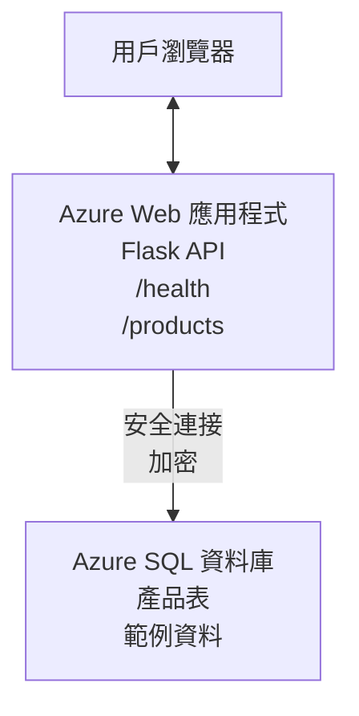

# 使用 AZD 部署 Microsoft SQL 資料庫與網頁應用程式

⏱️ <strong>預計時間</strong>：20-30 分鐘 | 💰 <strong>預計費用</strong>：約 15-25 美元/月 | ⭐ <strong>複雜度</strong>：中階

此 <strong>完整可運行範例</strong> 示範如何使用 [Azure Developer CLI (azd)](https://learn.microsoft.com/azure/developer/azure-developer-cli/) 將帶有 Microsoft SQL 資料庫的 Python Flask 網頁應用程式部署至 Azure。所有程式碼均已包含與測試完成—不需外部依賴。

## 你將學到什麼

完成此範例後，你將能夠：
- 使用基礎架構即程式碼部署多層應用程式（網頁應用 + 資料庫）
- 設定安全的資料庫連線，無需在程式碼中硬編祕密
- 使用 Application Insights 監控應用程式健康狀況
- 使用 AZD CLI 高效率管理 Azure 資源
- 遵循 Azure 的安全、成本優化及可觀察性最佳實務

## 情境概述
- <strong>網頁應用</strong>：具有資料庫連接的 Python Flask REST API
- <strong>資料庫</strong>：Azure SQL 資料庫，含範例資料
- <strong>基礎架構</strong>：使用 Bicep （模組化、可重用範本）配置
- <strong>部署</strong>：全部自動化，以 `azd` 指令完成
- <strong>監控</strong>：使用 Application Insights 收集日誌與遙測

## 先決條件

### 必備工具

開始前請確認已安裝以下工具：

1. **[Azure CLI](https://learn.microsoft.com/cli/azure/install-azure-cli)**（版本 2.50.0 以上）
   ```sh
   az --version
   # 預期輸出：azure-cli 2.50.0 或以上版本
   ```

2. **[Azure Developer CLI (azd)](https://learn.microsoft.com/azure/developer/azure-developer-cli/install-azd)**（版本 1.0.0 以上）
   ```sh
   azd version
   # 預期輸出：azd 版本 1.0.0 或以上
   ```

3. **[Python 3.8+](https://www.python.org/downloads/)**（用於本機開發）
   ```sh
   python --version
   # 預期輸出：Python 3.8 或以上版本
   ```

4. **[Docker](https://www.docker.com/get-started)**（選用，用於本機容器化開發）
   ```sh
   docker --version
   # 預期輸出：Docker 版本 20.10 或以上
   ```

### Azure 要求

- 有效的 **Azure 訂閱**（[建立免費帳號](https://azure.microsoft.com/free/)）
- 有權限在訂閱中建立資源
- 擁有訂閱或資源群組的 <strong>擁有者</strong> 或 <strong>參與者</strong> 角色

### 知識先備

此為 <strong>中階</strong> 範例。你應具備：
- 基本命令列操作
- 雲端基礎概念（資源、資源群組）
- 基本的網頁應用與資料庫知識

**剛接觸 AZD？** 請先參閱 [入門指南](../../docs/chapter-01-foundation/azd-basics.md) 。

## 架構

此範例部署兩層架構，包括網頁應用與 SQL 資料庫：


**資源部署：**
- <strong>資源群組</strong>：所有資源的容器
- **App Service 計劃**：基於 Linux 的主機（B1 層級，節省成本）
- <strong>網頁應用</strong>：Python 3.11 及 Flask 應用程式
- **SQL 伺服器**：托管資料庫伺服器，最低支援 TLS 1.2
- **SQL 資料庫**：基礎層（2GB，適合開發/測試）
- **Application Insights**：監控與日誌
- **Log Analytics 工作區**：集中日誌儲存

<strong>比喻</strong>：想像這是一間餐廳（網頁應用）配備一個冷凍庫（資料庫）。顧客從菜單（API 端點）點餐，廚房（Flask 應用）從冷凍庫取食材（資料）。餐廳經理（Application Insights）負責追蹤一切狀況。

## 資料夾結構

此範例包含所有檔案—不需外部依賴：

```
examples/database-app/
│
├── README.md                    # This file
├── azure.yaml                   # AZD configuration file
├── .env.sample                  # Sample environment variables
├── .gitignore                   # Git ignore patterns
│
├── infra/                       # Infrastructure as Code (Bicep)
│   ├── main.bicep              # Main orchestration template
│   ├── abbreviations.json      # Azure naming conventions
│   └── resources/              # Modular resource templates
│       ├── sql-server.bicep    # SQL Server configuration
│       ├── sql-database.bicep  # Database configuration
│       ├── app-service-plan.bicep  # Hosting plan
│       ├── app-insights.bicep  # Monitoring setup
│       └── web-app.bicep       # Web application
│
└── src/
    └── web/                    # Application source code
        ├── app.py              # Flask REST API
        ├── requirements.txt    # Python dependencies
        └── Dockerfile          # Container definition
```

**各檔案說明：**
- **azure.yaml**：告訴 AZD 部署內容與位置
- **infra/main.bicep**：協調所有 Azure 資源
- **infra/resources/*.bicep**：獨立資源定義（模組化可重用）
- **src/web/app.py**：帶有資料庫邏輯的 Flask 應用
- **requirements.txt**：Python 套件依賴
- **Dockerfile**：容器化部署指令

## 快速上手（步驟式）

### 第 1 步：複製並切換目錄

```sh
git clone https://github.com/microsoft/AZD-for-beginners.git
cd AZD-for-beginners/examples/database-app
```

**✓ 成功檢查**：確認看到 `azure.yaml` 和 `infra/` 資料夾：
```sh
ls
# 預期：README.md、azure.yaml、infra/、src/
```

### 第 2 步：Azure 認證登入

```sh
azd auth login
```

此步驟會開啟瀏覽器以登入 Azure，請使用你的 Azure 帳號登入。

**✓ 成功檢查**：應看到：
```
Logged in to Azure.
```

### 第 3 步：初始化環境

```sh
azd init
```

<strong>過程說明</strong>：AZD 會為你的部署建立本地設定。

<strong>你會看到的提示</strong>：
- <strong>環境名稱</strong>：輸入短名稱（例如 `dev`、`myapp`）
- **Azure 訂閱**：從清單中選擇訂閱
- **Azure 地區**：選擇區域（例如 `eastus`、`westeurope`）

**✓ 成功檢查**：應看到：
```
SUCCESS: New project initialized!
```

### 第 4 步：建立 Azure 資源

```sh
azd provision
```

<strong>過程說明</strong>：AZD 部署所有基礎架構（約 5-8 分鐘）：
1. 建立資源群組
2. 建立 SQL 伺服器與資料庫
3. 建立 App Service 計劃
4. 建立網頁應用
5. 建立 Application Insights
6. 設定網路與安全性

<strong>系統會提示你輸入</strong>：
- **SQL 管理員帳號**：輸入使用者名稱（例如 `sqladmin`）
- **SQL 管理員密碼**：輸入強密碼（請務必保存！）

**✓ 成功檢查**：應看到：
```
SUCCESS: Your application was provisioned in Azure in X minutes Y seconds.
You can view the resources created under the resource group rg-<env-name> in Azure Portal:
https://portal.azure.com/#@/resource/subscriptions/.../resourceGroups/rg-<env-name>
```

**⏱️ 時間**：5-8 分鐘

### 第 5 步：部署應用程式

```sh
azd deploy
```

<strong>過程說明</strong>：AZD 會建置並部署 Flask 應用程式：
1. 打包 Python 應用程式
2. 建置 Docker 容器
3. 推送到 Azure 網頁應用
4. 以範例資料初始化資料庫
5. 啟動應用程式

**✓ 成功檢查**：應看到：
```
SUCCESS: Your application was deployed to Azure in X minutes Y seconds.
You can view the resources created under the resource group rg-<env-name> in Azure Portal:
https://portal.azure.com/#@/resource/subscriptions/.../resourceGroups/rg-<env-name>
```

**⏱️ 時間**：3-5 分鐘

### 第 6 步：瀏覽應用程式

```sh
azd browse
```

此步驟會在瀏覽器開啟部署完成的網頁應用，位址為 `https://app-<unique-id>.azurewebsites.net`

**✓ 成功檢查**：應看到 JSON 輸出：
```json
{
  "message": "Welcome to the Database App API",
  "endpoints": {
    "/": "This help message",
    "/health": "Health check endpoint",
    "/products": "List all products",
    "/products/<id>": "Get product by ID"
  }
}
```

### 第 7 步：測試 API 端點

<strong>健康檢查</strong>（驗證資料庫連線）：
```sh
curl https://app-<your-id>.azurewebsites.net/health
```

<strong>預期回應</strong>：
```json
{
  "status": "healthy",
  "database": "connected"
}
```

<strong>查詢產品清單</strong>（範例資料）：
```sh
curl https://app-<your-id>.azurewebsites.net/products
```

<strong>預期回應</strong>：
```json
[
  {
    "id": 1,
    "name": "Laptop",
    "description": "High-performance laptop",
    "price": 1299.99,
    "created_at": "2025-11-19T10:30:00"
  },
  ...
]
```

<strong>取得單一產品</strong>：
```sh
curl https://app-<your-id>.azurewebsites.net/products/1
```

**✓ 成功檢查**：所有端點皆回傳無錯誤的 JSON 資料。

---

**🎉 恭喜你！** 你已經成功使用 AZD 在 Azure 上部署網站應用程式與資料庫。

## 配置深入解析

### 環境變數

祕密安全地由 Azure App Service 設定管理—<strong>絕不硬編至程式碼中</strong>。

**由 AZD 自動設定：**
- `SQL_CONNECTION_STRING`：含加密憑證的資料庫連線字串
- `APPLICATIONINSIGHTS_CONNECTION_STRING`：監控遙測端點
- `SCM_DO_BUILD_DURING_DEPLOYMENT`：啟用自動依賴安裝

**祕密儲存位置：**
1. 部署時 `azd provision` 會提示你輸入 SQL 憑證
2. AZD 將祕密存到本地 `.azure/<env-name>/.env` 檔案（git 忽略）
3. AZD 注入至 Azure App Service 設定（靜態加密儲存）
4. 應用程式透過 `os.getenv()` 在執行時讀取變數

### 本機開發

本機測試可從範例建立 `.env`：

```sh
cp .env.sample .env
# 使用本地資料庫連線編輯 .env
```

<strong>本機開發流程</strong>：
```sh
# 安裝依賴
cd src/web
pip install -r requirements.txt

# 設置環境變量
export SQL_CONNECTION_STRING="your-local-connection-string"

# 運行應用程序
python app.py
```

<strong>本機測試</strong>：
```sh
curl http://localhost:8000/health
# 預期結果: {"status": "healthy", "database": "connected"}
```

### 基礎架構即程式碼

所有 Azure 資源均由 **Bicep 範本** 定義（`infra/` 資料夾）：

- <strong>模組化設計</strong>：每種資源型別獨立檔案，有利重用
- <strong>參數化</strong>：可自訂 SKU、區域、命名規則
- <strong>最佳實務</strong>：符合 Azure 命名標準與安全預設
- <strong>版本控管</strong>：基礎架構變更皆在 Git 追蹤

<strong>客製化範例</strong>：
更改資料庫層級，編輯 `infra/resources/sql-database.bicep`：
```bicep
sku: {
  name: 'Standard'  // Changed from 'Basic'
  tier: 'Standard'
  capacity: 10
}
```

## 安全最佳實務

此範例遵循 Azure 安全最佳實務：

### 1. <strong>不在程式碼中放祕密</strong>
- ✅ 憑證儲存在 Azure App Service 設定中（加密）
- ✅ `.env` 檔案以 `.gitignore` 排除於 Git 外
- ✅ 透過安全參數注入祕密於部署中

### 2. <strong>加密連線</strong>
- ✅ SQL 伺服器最低 TLS 1.2
- ✅ 僅允許 HTTPS 訪問網頁應用
- ✅ 資料庫連線透過加密通道

### 3. <strong>網路安全</strong>
- ✅ SQL 伺服器防火牆僅允許 Azure 服務存取
- ✅ 限制公網存取（可用 Private Endpoints 進一步設定）
- ✅ 網頁應用停用 FTPS

### 4. <strong>身份驗證與授權</strong>
- ⚠️ <strong>目前</strong>：SQL 驗證（帳號/密碼）
- ✅ <strong>生產環境建議</strong>：使用 Azure 托管身份，免密碼驗證

<strong>升級為托管身份</strong>（生產環境）：
1. 啟用網頁應用的托管身份
2. 授予身份 SQL 權限
3. 修改連線字串改用托管身份
4. 移除基於密碼的驗證

### 5. <strong>稽核與合規</strong>
- ✅ Application Insights 紀錄所有請求與錯誤
- ✅ 啟用 SQL 資料庫稽核（可配置合規需求）
- ✅ 所有資源均已標記便於治理管理

<strong>生產前安全檢查清單</strong>：
- [ ] 啟用 Azure Defender for SQL
- [ ] 設定 SQL 資料庫私用端點
- [ ] 啟用 Web 應用防火牆（WAF）
- [ ] 使用 Azure Key Vault 進行祕密輪替
- [ ] 設定 Azure AD 身份驗證
- [ ] 啟用所有資源的診斷日誌

## 成本優化

<strong>預估月費用</strong>（截至 2025 年 11 月）：

| 資源 | SKU/層級 | 預估費用 |
|--------|----------|------------|
| App Service 計劃 | B1 (基礎) | 約 13 美元/月 |
| SQL 資料庫 | 基礎層 (2GB) | 約 5 美元/月 |
| Application Insights | 按用量付費 | 約 2 美元/月（低流量） |
| <strong>合計</strong> | | **約 20 美元/月** |

**💡 節省成本技巧**：

1. <strong>使用免費層學習</strong>：
   - App Service：F1 層（免費，有限使用時數）
   - SQL 資料庫：Azure SQL serverless
   - Application Insights：每月 5GB 免費資料量

2. <strong>不用時暫停資源</strong>：
   ```sh
   # 停止網頁應用程式（資料庫仍會收費）
   az webapp stop --name <app-name> --resource-group <rg-name>
   
   # 需要時重新啟動
   az webapp start --name <app-name> --resource-group <rg-name>
   ```

3. <strong>測試結束後刪除全部資源</strong>：
   ```sh
   azd down
   ```
   這會移除全部資源並停止產生費用。

4. **開發與生產用 SKU 差異**：
   - <strong>開發</strong>：本範例使用基礎層
   - <strong>生產</strong>：使用標準或高級層，提供冗餘備援

<strong>成本監控</strong>：
- 使用 [Azure 成本管理](https://portal.azure.com/#view/Microsoft_Azure_CostManagement) 查詢費用
- 設定成本警示避免異常支出
- 為所有資源加標籤 `azd-env-name` 方便管理

<strong>免費層替代配置</strong>：
學習用途可修改 `infra/resources/app-service-plan.bicep`：
```bicep
sku: {
  name: 'F1'  // Free tier
  tier: 'Free'
}
```
<strong>注意</strong>：免費層有限制（每日 CPU 時間 60 分鐘，無 Always-on）。

## 監控與可觀察性

### Application Insights 整合

此範例包含 **Application Insights** 以進行全面監控：

<strong>監控項目</strong>：
- ✅ HTTP 請求（延遲、狀態碼、端點）
- ✅ 應用錯誤與例外狀況
- ✅ Flask 應用自定義日誌
- ✅ 資料庫連線狀態
- ✅ 性能指標（CPU、記憶體）

**訪問 Application Insights**：
1. 開啟 [Azure 入口網站](https://portal.azure.com)
2. 前往你的資源群組（`rg-<env-name>`）
3. 點選 Application Insights 資源（`appi-<unique-id>`）

<strong>實用查詢</strong>（Application Insights → 日誌）：

<strong>查看所有請求</strong>：
```kusto
requests
| where timestamp > ago(1h)
| order by timestamp desc
| project timestamp, name, url, resultCode, duration
```

<strong>尋找錯誤</strong>：
```kusto
exceptions
| where timestamp > ago(24h)
| order by timestamp desc
| project timestamp, type, outerMessage, operation_Name
```

<strong>檢查健康端點</strong>：
```kusto
requests
| where name contains "health"
| summarize count() by resultCode, bin(timestamp, 1h)
```

### SQL 資料庫稽核

<strong>已啟用 SQL 資料庫稽核</strong>以追蹤：
- 資料庫存取模式
- 登入失敗嘗試
- 架構變更
- 資料存取（符合合規）

<strong>存取稽核日誌</strong>：
1. Azure 入口網站 → SQL 資料庫 → 稽核
2. 在 Log Analytics 工作區察看日誌

### 即時監控

<strong>查看即時指標</strong>：
1. Application Insights → 即時指標
2. 可即時查看請求數、失敗率與性能指標

<strong>設定警示</strong>：
針對關鍵事件建立警示：
- 5 分鐘內 HTTP 500 錯誤超過 5 次
- 資料庫連線失敗
- 高響應時間（>2 秒）

<strong>範例警示建立</strong>：
```sh
az monitor metrics alert create \
  --name "High-Response-Time" \
  --resource-group <rg-name> \
  --scopes <app-insights-resource-id> \
  --condition "avg requests/duration > 2000" \
  --description "Alert when response time exceeds 2 seconds"
```

## 疑難排解
### 常見問題與解決方案

#### 1. `azd provision` 失敗並顯示「Location not available」

<strong>症狀</strong>：  
```
Error: The subscription is not registered for the resource type 'components' in the location 'centralus'.
```
  
<strong>解決方案</strong>：  
選擇不同的 Azure 區域或註冊資源提供者：  
```sh
az provider register --namespace Microsoft.Insights
```
  
#### 2. 部署期間 SQL 連線失敗

<strong>症狀</strong>：  
```
pyodbc.OperationalError: ('08001', '[08001] [Microsoft][ODBC Driver 18 for SQL Server]TCP Provider...')
```
  
<strong>解決方案</strong>：  
- 確認 SQL Server 防火牆允許 Azure 服務（自動設定）  
- 檢查在 `azd provision` 過程中是否正確輸入 SQL 管理員密碼  
- 確保 SQL Server 已完整配置（可能需 2-3 分鐘）  

<strong>驗證連線</strong>：  
```sh
# 從 Azure 入口網站，前往 SQL 資料庫 → 查詢編輯器
# 嘗試使用您的認證連接
```
  
#### 3. Web 應用顯示「Application Error」

<strong>症狀</strong>：  
瀏覽器顯示一般錯誤頁面。  

<strong>解決方案</strong>：  
檢查應用程式日誌：  
```sh
# 查看最近的日誌
az webapp log tail --name <app-name> --resource-group <rg-name>
```
  
<strong>常見原因</strong>：  
- 缺少環境變數（檢查 App Service → 設定）  
- Python 套件安裝失敗（檢查部署日誌）  
- 資料庫初始化錯誤（檢查 SQL 連線）  

#### 4. `azd deploy` 失敗並顯示「Build Error」

<strong>症狀</strong>：  
```
Error: Failed to build project
```
  
<strong>解決方案</strong>：  
- 確保 `requirements.txt` 無語法錯誤  
- 確認 `infra/resources/web-app.bicep` 指定 Python 3.11  
- 驗證 Dockerfile 使用正確的基底映像  

<strong>本機除錯</strong>：  
```sh
cd src/web
docker build -t test-app .
docker run -p 8000:8000 test-app
```
  
#### 5. 執行 AZD 指令時顯示「Unauthorized」

<strong>症狀</strong>：  
```
ERROR: (Unauthorized) The client '<id>' with object id '<id>' does not have authorization
```
  
<strong>解決方案</strong>：  
重新登入 Azure：  
```sh
azd auth login
az login
```
  
確認您對訂閱擁有正確權限（Contributor 角色）。  

#### 6. 資料庫費用過高

<strong>症狀</strong>：  
意外的 Azure 帳單。  

<strong>解決方案</strong>：  
- 檢查是否忘記在測試後執行 `azd down`  
- 確認 SQL Database 使用的是 Basic 層級（非 Premium）  
- 檢視 Azure 成本管理中的花費  
- 設定成本警示  

### 尋求協助

**檢視所有 AZD 環境變數**：  
```sh
azd env get-values
```
  
<strong>檢查部署狀態</strong>：  
```sh
az webapp show --name <app-name> --resource-group <rg-name> --query state
```
  
<strong>存取應用程式日志</strong>：  
```sh
az webapp log download --name <app-name> --resource-group <rg-name> --log-file app-logs.zip
```
  
**需要更多幫助？**  
- [AZD 疑難排解指南](../../docs/chapter-07-troubleshooting/common-issues.md)  
- [Azure App Service 疑難排解](https://learn.microsoft.com/azure/app-service/troubleshoot-diagnostic-logs)  
- [Azure SQL 疑難排解](https://learn.microsoft.com/azure/azure-sql/database/troubleshoot-common-errors-issues)  

## 實作練習

### 練習 1：驗證您的部署（初階）

<strong>目標</strong>：確認所有資源已部署且應用程式運作正常。  

<strong>步驟</strong>：  
1. 列出資源群組中的所有資源：  
   ```sh
   az resource list --resource-group rg-<env-name> --output table
   ```
   <strong>預期</strong>：出現 6-7 個資源（Web App、SQL Server、SQL Database、App Service Plan、Application Insights、Log Analytics）  

2. 測試所有 API 端點：  
   ```sh
   curl https://app-<your-id>.azurewebsites.net/
   curl https://app-<your-id>.azurewebsites.net/health
   curl https://app-<your-id>.azurewebsites.net/products
   curl https://app-<your-id>.azurewebsites.net/products/1
   ```
   <strong>預期</strong>：全部返回有效 JSON，且無錯誤  

3. 檢查 Application Insights：  
   - 在 Azure 入口網站中開啟 Application Insights  
   - 進入「即時指標」  
   - 在 Web 應用程式頁面重新整理瀏覽器  
   <strong>預期</strong>：能即時看到請求數據  

<strong>成功標準</strong>：所有 6-7 個資源存在，所有端點返回資料，Live Metrics 顯示活動。  

---

### 練習 2：新增 API 端點（中階）

<strong>目標</strong>：擴展 Flask 應用程式，新增一個端點。  

<strong>起始程式碼</strong>：目前位於 `src/web/app.py` 的端點  

<strong>步驟</strong>：  
1. 編輯 `src/web/app.py`，於 `get_product()` 函式後新增端點：  
   ```python
   @app.route('/products/search/<keyword>')
   def search_products(keyword):
       """Search products by name or description."""
       try:
           conn = get_db_connection()
           cursor = conn.cursor()
           cursor.execute(
               "SELECT id, name, description, price, created_at FROM products WHERE name LIKE ? OR description LIKE ?",
               (f'%{keyword}%', f'%{keyword}%')
           )
           
           products = []
           for row in cursor.fetchall():
               products.append({
                   'id': row[0],
                   'name': row[1],
                   'description': row[2],
                   'price': float(row[3]) if row[3] else None,
                   'created_at': row[4].isoformat() if row[4] else None
               })
           
           cursor.close()
           conn.close()
           
           logger.info(f"Search for '{keyword}' returned {len(products)} results")
           return jsonify(products), 200
           
       except Exception as e:
           logger.error(f"Error searching products: {str(e)}")
           return jsonify({'error': str(e)}), 500
   ```
  
2. 部署更新的應用程式：  
   ```sh
   azd deploy
   ```
  
3. 測試新增端點：  
   ```sh
   curl https://app-<your-id>.azurewebsites.net/products/search/laptop
   ```
   <strong>預期</strong>：返回符合「laptop」的商品  

<strong>成功標準</strong>：新增端點正常運作，返回過濾結果，並顯示在 Application Insights 日誌中。  

---

### 練習 3：新增監控與警示（高階）

<strong>目標</strong>：建立主動監控與警示機制。  

<strong>步驟</strong>：  
1. 建立 HTTP 500 錯誤警示：  
   ```sh
   # 獲取 Application Insights 資源 ID
   AI_ID=$(az monitor app-insights component show \
     --app appi-<your-id> \
     --resource-group rg-<env-name> \
     --query id -o tsv)
   
   # 建立警報
   az monitor metrics alert create \
     --name "High-Error-Rate" \
     --resource-group rg-<env-name> \
     --scopes $AI_ID \
     --condition "count requests/failed > 5" \
     --window-size 5m \
     --evaluation-frequency 1m \
     --description "Alert when >5 failed requests in 5 minutes"
   ```
  
2. 透過造成錯誤觸發警示：  
   ```sh
   # 請求一個不存在的產品
   for i in {1..10}; do curl https://app-<your-id>.azurewebsites.net/products/999; done
   ```
  
3. 檢查是否觸發警示：  
   - Azure 入口網站 → 警示 → 警示規則  
   - 檢查電子郵件（若已設定）  

<strong>成功標準</strong>：警示規則建立，錯誤發生時可觸發，能收到通知。  

---

### 練習 4：資料庫結構變更（高階）

<strong>目標</strong>：新增資料表並修改應用程式使用它。  

<strong>步驟</strong>：  
1. 透過 Azure 入口網站查詢編輯器連線 SQL Database  

2. 新增 `categories` 資料表：  
   ```sql
   CREATE TABLE categories (
       id INT PRIMARY KEY IDENTITY(1,1),
       name NVARCHAR(50) NOT NULL,
       description NVARCHAR(200)
   );
   
   INSERT INTO categories (name, description) VALUES
   ('Electronics', 'Electronic devices and accessories'),
   ('Office Supplies', 'Office equipment and supplies');
   
   -- Add category to products table
   ALTER TABLE products ADD category_id INT;
   UPDATE products SET category_id = 1; -- Set all to Electronics
   ```
  
3. 更新 `src/web/app.py` 於回應中包含類別資訊  

4. 部署並測試  

<strong>成功標準</strong>：新增資料表存在，產品包括類別資訊，且應用程式正常運作。  

---

### 練習 5：實作快取（專家）

<strong>目標</strong>：新增 Azure Redis Cache 以提升效能。  

<strong>步驟</strong>：  
1. 在 `infra/main.bicep` 新增 Redis Cache  
2. 更新 `src/web/app.py` 快取商品查詢結果  
3. 使用 Application Insights 測量效能改進  
4. 比較使用快取前後的回應時間  

<strong>成功標準</strong>：Redis 成功部署，快取功能正常，回應時間提升超過 50%。  

<strong>提示</strong>：參考 [Azure Cache for Redis 文件](https://learn.microsoft.com/azure/azure-cache-for-redis/)。  

---

## 清理資源

完成後為避免持續計費，請刪除所有資源：  

```sh
azd down
```
  
<strong>確認提示</strong>：  
```
? Total resources to delete: 7, are you sure you want to continue? (y/N)
```
  
輸入 `y` 確認。  

**✓ 成功檢查**：  
- Azure 入口網站中所有資源已刪除  
- 無持續費用  
- 可刪除本機的 `.azure/<env-name>` 資料夾  

<strong>替代方案</strong>（保留基礎架構，刪除資料）：  
```sh
# 只刪除資源組（保留 AZD 配置）
az group delete --name rg-<env-name> --yes
```
  
## 進一步學習

### 相關文件  
- [Azure Developer CLI 文件](https://learn.microsoft.com/azure/developer/azure-developer-cli/)  
- [Azure SQL Database 文件](https://learn.microsoft.com/azure/azure-sql/database/)  
- [Azure App Service 文件](https://learn.microsoft.com/azure/app-service/)  
- [Application Insights 文件](https://learn.microsoft.com/azure/azure-monitor/app/app-insights-overview)  
- [Bicep 語言參考](https://learn.microsoft.com/azure/azure-resource-manager/bicep/)  

### 課程下一步  
- **[Container Apps 範例](../../../../examples/container-app)**：部署搭配 Azure Container Apps 的微服務  
- **[AI 整合指南](../../../../docs/ai-foundry)**：為應用程式加入 AI 功能  
- **[部署最佳實務](../../docs/chapter-04-infrastructure/deployment-guide.md)**：生產環境部署模式  

### 進階主題  
- **Managed Identity**：移除密碼，改用 Azure AD 認證  
- **Private Endpoints**：在虛擬網路內安全連接資料庫  
- **CI/CD 整合**：使用 GitHub Actions 或 Azure DevOps 自動部署  
- <strong>多環境管理</strong>：設置開發、測試及生產環境  
- <strong>資料庫遷移</strong>：運用 Alembic 或 Entity Framework 管理結構版本  

### 與其他方案的比較

**AZD 與 ARM 模板相比**：  
- ✅ AZD：較高階抽象，指令簡單  
- ⚠️ ARM：語法冗長，控制更細節  

**AZD 與 Terraform相比**：  
- ✅ AZD：Azure 原生，與 Azure 服務整合度高  
- ⚠️ Terraform：支援多雲，生態系較大  

**AZD 與 Azure 入口網站相比**：  
- ✅ AZD：可重複、版本控制、自動化  
- ⚠️ 入口網站：手動點擊，不易複現  

**AZD 就像**：Azure 版的 Docker Compose—簡化複雜部署的設定。  

---

## 常見問題

**問：我可以使用其他程式語言嗎？**  
答：可以！將 `src/web/` 替換為 Node.js、C#、Go 或任意語言，並更新 `azure.yaml` 與 Bicep。  

**問：如何新增更多資料庫？**  
答：在 `infra/main.bicep` 新增另一個 SQL Database 模組，或使用 Azure Database 的 PostgreSQL/MySQL。  

**問：可以用於生產環境嗎？**  
答：這是起點。生產環境建議加入：Managed Identity、Private Endpoints、冗餘備援、備份策略、WAF 和強化監控。  

**問：如果想用容器部署而非原始碼部署怎麼辦？**  
答：請參閱 [Container Apps 範例](../../../../examples/container-app)，全程使用 Docker 容器。  

**問：如何從本機連線資料庫？**  
答：在 SQL Server 防火牆加入您的 IP：  
```sh
az sql server firewall-rule create \
  --resource-group rg-<env-name> \
  --server sql-<unique-id> \
  --name AllowMyIP \
  --start-ip-address <your-ip> \
  --end-ip-address <your-ip>
```
  
**問：可否使用現有資料庫而非建立新資料庫？**  
答：可以，修改 `infra/main.bicep` 指向現有 SQL Server，並更新連線字串參數。  

---

> **注意：** 本範例展示使用 AZD 部署帶資料庫的 Web 應用的最佳實務，包含範例程式碼、完整文件與實作練習以強化學習。生產部署前請評估安全性、擴充性、合規性及成本需求。  

**📚 課程導覽：**  
- ← 上一章節：[Container Apps 範例](../../../../examples/container-app)  
- → 下一章節：[AI 整合指南](../../../../docs/ai-foundry)  
- 🏠 [課程首頁](../../README.md)

---

<!-- CO-OP TRANSLATOR DISCLAIMER START -->
**免責聲明**：  
本文件由 AI 翻譯服務 [Co-op Translator](https://github.com/Azure/co-op-translator) 進行翻譯。雖然我們致力於準確性，但請注意自動翻譯可能包含錯誤或不準確之處。原始文件的本地語言版本應視為權威來源。對於重要資訊，建議尋求專業人工翻譯。我們不對因使用此翻譯而引起的任何誤解或曲解承擔責任。
<!-- CO-OP TRANSLATOR DISCLAIMER END -->