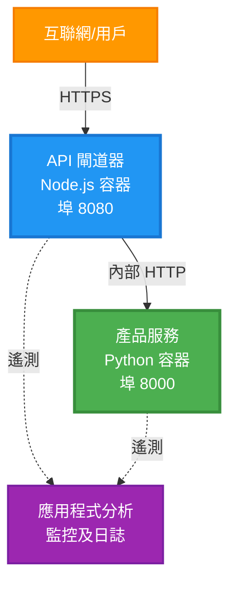
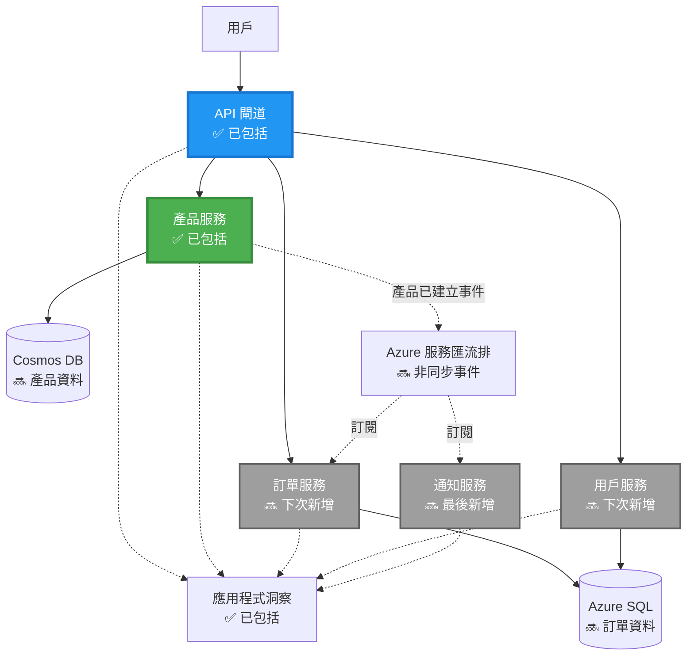
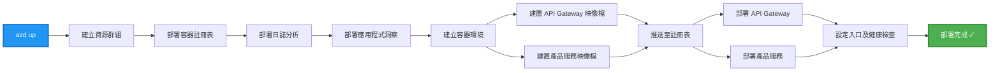
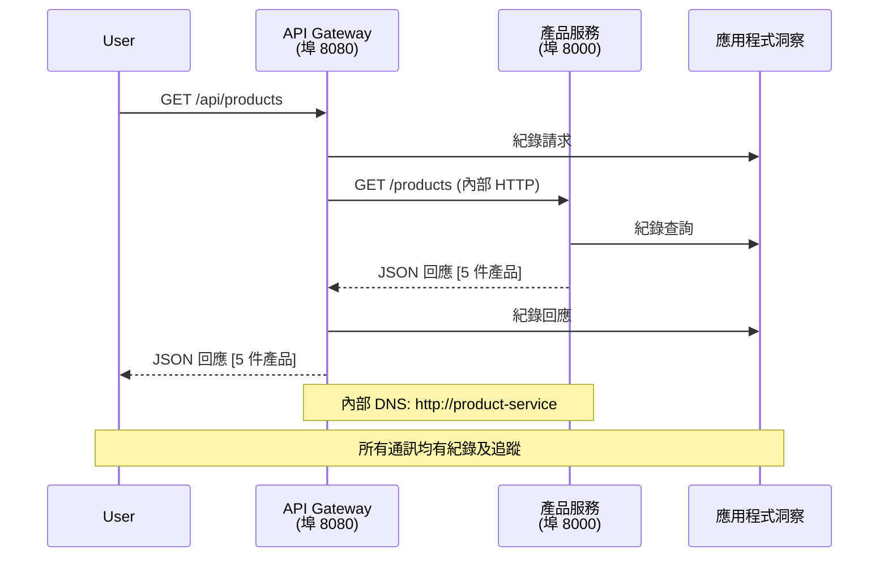

# 微服務架構 - Container App 範例

⏱️ **預計時間**：25-35 分鐘 | 💰 **預計成本**：約 $50-100/月 | ⭐ **難度**：進階

**📚 學習路徑：**
- ← 上一章： [Simple Flask API](../../../../examples/container-app/simple-flask-api) - 單容器基礎
- 🎯 **您在此處**：微服務架構（2 服務基礎）
- → 下一章： [AI 整合](../../../../docs/ai-foundry) - 為服務添加智慧
- 🏠 [課程首頁](../../README.md)

---

一個 **簡化但功能齊全** 的微服務架構，使用 AZD CLI 部署到 Azure Container Apps。本範例展示服務間通訊、容器編排及監控，採用實用的 2 服務設置。

> **📚 學習方法**：本範例從最簡 2 服務架構（API Gateway + 後端服務）開始，您可以實際部署學習。掌握基礎後，我們會提供指南擴展成完整微服務生態系統。

## 您將學到什麼

完成本範例後，您將會：
- 部署多個容器於 Azure Container Apps
- 實作服務間通訊及內部網路配置
- 配置基於環境的自動擴展與健康檢查
- 使用 Application Insights 監控分布式應用
- 理解微服務部署模式及最佳實踐
- 學習由簡入繁的漸進擴展方法

## 架構

### 階段 1：我們正在建置什麼（本範例包含）


**組件細節：**

| 組件 | 目的 | 存取 | 資源 |
|-----------|---------|--------|-----------|
| **API Gateway** | 將外部請求路由至後端服務 | 公開 (HTTPS) | 1 vCPU, 2GB RAM, 2-20 複本 |
| **產品服務** | 管理產品目錄，使用記憶體資料 | 僅限內部 | 0.5 vCPU, 1GB RAM, 1-10 複本 |
| **Application Insights** | 集中式日誌與分布式追蹤 | Azure 入口網站 | 1-2 GB/月資料收集 |

**為什麼從簡單開始？**
- ✅ 快速部署與理解（25-35 分鐘）
- ✅ 學習核心微服務模式，無複雜度
- ✅ 可修改與實驗的運作程式碼
- ✅ 低成本學習（約 $50-100/月，相較於 $300-1400/月）
- ✅ 建立信心後再加入資料庫及訊息佇列

**比喻**：就像學開車。先從空蕩停車場（2 服務）起步，掌握基礎，然後再挑戰城市交通（5+ 服務含資料庫）。

### 階段 2：未來擴展（參考架構）

掌握 2 服務架構後，可擴展為：


詳見末尾「擴展指南」章節，附逐步說明。

## 包含功能

✅ **服務發現**：容器間自動 DNS 探測  
✅ **負載均衡**：複本間內建負載平衡  
✅ **自動擴縮**：依據 HTTP 請求獨立調整服務規模  
✅ **健康監控**：存活與就緒探針雙重檢測  
✅ **分布式日誌**：Application Insights 集中日誌  
✅ **內部網路**：安全的服務間通訊  
✅ **容器編排**：自動部署與擴展  
✅ **零停機更新**：滾動更新與修訂管理  

## 前置條件

### 必備工具

開始前請確認安裝以下工具：

1. **[Azure Developer CLI (azd)](https://learn.microsoft.com/azure/developer/azure-developer-cli/install-azd)**（版本 1.0.0 或以上）
   ```bash
   azd version
   # 預期輸出：azd 版本 1.0.0 或以上
   ```

2. **[Azure CLI](https://learn.microsoft.com/cli/azure/install-azure-cli)**（版本 2.50.0 或以上）
   ```bash
   az --version
   # 預期輸出：azure-cli 2.50.0 或以上版本
   ```

3. **[Docker](https://www.docker.com/get-started)**（本地開發/測試使用-非必需）
   ```bash
   docker --version
   # 預期輸出：Docker 版本 20.10 或更高
   ```

### 驗證您的設置

執行以下指令確認準備就緒：

```bash
# 檢查 Azure Developer CLI
azd version
# ✅ 預期：azd 版本 1.0.0 或以上

# 檢查 Azure CLI
az --version
# ✅ 預期：azure-cli 版本 2.50.0 或以上

# 檢查 Docker（可選）
docker --version
# ✅ 預期：Docker 版本 20.10 或以上
```

**成功標準**：所有指令回傳版本號符合最低要求。

### Azure 要求

- 有效的 **Azure 訂閱**（[建立免費帳號](https://azure.microsoft.com/free/)）
- 可於訂閱下建立資源的權限
- 訂閱或資源群組具備 **協作者** 角色

### 知識前提

此範例屬 **進階級**。您應具備：
- 完成 [Simple Flask API 範例](../../../../examples/container-app/simple-flask-api)
- 基本微服務架構認知
- 熟悉 REST API 與 HTTP
- 了解容器相關概念

**剛接觸 Container Apps？** 可先從 [Simple Flask API 範例](../../../../examples/container-app/simple-flask-api) 學習基礎。

## 快速開始（逐步指引）

### 步驟 1：複製並進入目錄

```bash
git clone https://github.com/microsoft/AZD-for-beginners.git
cd AZD-for-beginners/examples/microservices
```

**✓ 成功驗證**：確認可見 `azure.yaml` 檔案：
```bash
ls
# 預期: README.md, azure.yaml, infra/, src/
```

### 步驟 2：登入 Azure 認證

```bash
azd auth login
```

此會開啟瀏覽器進行 Azure 登入，請輸入您的 Azure 帳號。

**✓ 成功驗證**：您應看到：
```
Logged in to Azure.
```

### 步驟 3：初始化環境

```bash
azd init
```

**您會看到的提示**：
- **環境名稱**：輸入簡短名稱（例如 `microservices-dev`）
- **Azure 訂閱**：選擇您的訂閱
- **Azure 區域**：選定區域（例如 `eastus`、`westeurope`）

**✓ 成功驗證**：您應看到：
```
SUCCESS: New project initialized!
```

### 步驟 4：部署基礎設施與服務

```bash
azd up
```

**過程說明**（約 8-12 分鐘）：


**✓ 成功驗證**：您應看到：
```
SUCCESS: Your application was deployed to Azure in X minutes Y seconds.
Endpoint: https://api-gateway-<unique-id>.azurecontainerapps.io
```

**⏱️ 時間**：8-12 分鐘

### 步驟 5：測試部署結果

```bash
# 獲取閘道器端點
GATEWAY_URL=$(azd env get-values | grep API_GATEWAY_URL | cut -d '=' -f2 | tr -d '"')

# 測試 API 閘道器健康狀態
curl $GATEWAY_URL/health
```

**✅ 預期輸出：**
```json
{
  "status": "healthy",
  "service": "api-gateway",
  "timestamp": "2025-11-19T10:30:00Z"
}
```

**經由 Gateway 測試產品服務**：
```bash
# 列出產品
curl $GATEWAY_URL/api/products
```

**✅ 預期輸出：**
```json
[
  {"id":1,"name":"Laptop","price":999.99,"stock":50},
  {"id":2,"name":"Mouse","price":29.99,"stock":200},
  {"id":3,"name":"Keyboard","price":79.99,"stock":150}
]
```

**✓ 成功驗證**：兩個端點皆正確返回 JSON，無錯誤。

---

**🎉 恭喜！** 您已成功部署微服務架構到 Azure！

## 專案結構

所有實作檔案皆包含其中—這是完整且可運行的範例：

```
microservices/
│
├── README.md                         # This file
├── azure.yaml                        # AZD configuration
├── .gitignore                        # Git ignore patterns
│
├── infra/                           # Infrastructure as Code (Bicep)
│   ├── main.bicep                   # Main orchestration
│   ├── abbreviations.json           # Naming conventions
│   ├── core/                        # Shared infrastructure
│   │   ├── container-apps-environment.bicep  # Container environment + registry
│   │   └── monitor.bicep            # Application Insights + Log Analytics
│   └── app/                         # Service definitions
│       ├── api-gateway.bicep        # API Gateway container app
│       └── product-service.bicep    # Product Service container app
│
└── src/                             # Application source code
    ├── api-gateway/                 # Node.js API Gateway
    │   ├── app.js                   # Express server with routing
    │   ├── package.json             # Node dependencies
    │   └── Dockerfile               # Container definition
    └── product-service/             # Python Product Service
        ├── main.py                  # Flask API with product data
        ├── requirements.txt         # Python dependencies
        └── Dockerfile               # Container definition
```

**各組件功能說明：**

**基礎設施 (infra/)**：
- `main.bicep`：協調所有 Azure 資源與相依性
- `core/container-apps-environment.bicep`：建立 Container Apps 環境及 Azure Container Registry
- `core/monitor.bicep`：設置 Application Insights 以支援分布式日誌
- `app/*.bicep`：個別容器應用定義（含擴展及健康檢查）

**API Gateway (src/api-gateway/)**：
- 公開端服務，將請求路由至後端服務
- 實作日誌、錯誤處理與請求轉發
- 展示服務間 HTTP 通訊範例

**產品服務 (src/product-service/)**：
- 內部服務，維護產品目錄（使用記憶體簡化）
- REST API 並支援健康探針
- 後端微服務範例

## 服務概覽

### API Gateway (Node.js/Express)

**埠號**：8080  
**存取**：公開（外部入口）  
**用途**：路由收進來的請求到適合的後端服務  

**端點**：
- `GET /` - 服務資訊
- `GET /health` - 健康檢查端點
- `GET /api/products` - 轉發至產品服務（列出所有）
- `GET /api/products/:id` - 轉發至產品服務（以 ID 查詢）

**主要功能**：
- 使用 axios 進行請求路由
- 中央日誌管理
- 錯誤處理與逾時管控
- 利用環境變數實現服務發現
- Application Insights 整合

**程式碼重點** (`src/api-gateway/app.js`)：
```javascript
// 內部服務通訊
app.get('/api/products', async (req, res) => {
  const response = await axios.get(`${PRODUCT_SERVICE_URL}/products`, {
    timeout: 5000
  });
  res.json(response.data);
});
```

### 產品服務 (Python/Flask)

**埠號**：8000  
**存取**：僅限內部（無公開入口）  
**用途**：管理產品目錄，以記憶體資料為主  

**端點**：
- `GET /` - 服務資訊
- `GET /health` - 健康檢查端點
- `GET /products` - 列出所有產品
- `GET /products/<id>` - 以 ID 查詢產品

**主要功能**：
- 使用 Flask 建立 REST API
- 記憶體中產品儲存（簡化，不需資料庫）
- 設置健康監控探針
- 結構化日誌
- Application Insights 整合

**資料模型**：
```python
{
  "id": 1,
  "name": "Laptop",
  "description": "High-performance laptop",
  "price": 999.99,
  "stock": 50
}
```

**為何僅限內部？**
產品服務不對外公開，所有請求必須經過 API Gateway，確保：
- 安全：控制入口權限
- 彈性：後端可變更，不影響用戶端
- 監控：集中請求日誌

## 了解服務間通訊

### 服務如何相互溝通


在此範例中，API Gateway 使用 **內部 HTTP 呼叫** 與產品服務溝通：

```javascript
// API 閘道器 (src/api-gateway/app.js)
const PRODUCT_SERVICE_URL = process.env.PRODUCT_SERVICE_URL;

// 發出內部 HTTP 請求
const response = await axios.get(`${PRODUCT_SERVICE_URL}/products`);
```

**重點說明**：

1. **基於 DNS 的發現**：Container Apps 自動提供內部服務 DNS  
   - 產品服務完全域名：`product-service.internal.<environment>.azurecontainerapps.io`  
   - 簡化為：`http://product-service`（Container Apps 會解譯）

2. **無公開暴露**：產品服務 Bicep 指定 `external: false`  
   - 僅能在 Container Apps 環境內存取  
   - 網路上無法直接抵達

3. **環境變數注入**：服務 URL 在部署時注入  
   - Bicep 將內部 FQDN 傳給 Gateway  
   - 程式碼中無硬編碼 URL

**比喻**：像辦公室房間。API Gateway 是接待櫃檯（對外窗口），產品服務是內部辦公室。訪客需經接待才能進入辦公室。

## 部署選項

### 完整部署（推薦）

```bash
# 部署基礎設施及兩個服務
azd up
```

此部署包含：
1. Container Apps 環境
2. Application Insights
3. Container Registry
4. API Gateway 容器
5. 產品服務容器

**時間**：8-12 分鐘

### 部署單一服務

```bash
# 只部署一個服務（在首次 azd up 後）
azd deploy api-gateway

# 或部署產品服務
azd deploy product-service
```

**使用場景**：當您更新某個服務程式碼，只想重部署該服務。

### 更新設定

```bash
# 更改縮放參數
azd env set GATEWAY_MAX_REPLICAS 30

# 使用新配置重新部署
azd up
```

## 配置

### 擴縮配置

兩服務的 Bicep 檔案中均設定了基於 HTTP 流量的自動擴縮：

**API Gateway**：
- 最小複本數：2（至少兩個以維持可用性）
- 最大複本數：20
- 擴縮觸發：每複本 50 個同時請求

**產品服務**：
- 最小複本數：1（必要時可擴至 0）
- 最大複本數：10
- 擴縮觸發：每複本 100 個同時請求

**調整擴縮**（`infra/app/*.bicep` 中）：
```bicep
scale: {
  minReplicas: 1
  maxReplicas: 10
  rules: [
    {
      name: 'http-scale-rule'
      http: {
        metadata: {
          concurrentRequests: '100'  // Adjust this
        }
      }
    }
  ]
}
```

### 資源分配

**API Gateway**：
- CPU：1.0 vCPU
- 記憶體：2 GiB
- 原因：處理全部外部流量

**產品服務**：
- CPU：0.5 vCPU
- 記憶體：1 GiB
- 原因：輕量級記憶體運算

### 健康檢查

兩服務皆包含存活與就緒探針：

```bicep
probes: [
  {
    type: 'Liveness'
    httpGet: {
      path: '/health'
      port: 8080
    }
    initialDelaySeconds: 10
    periodSeconds: 30
  }
  {
    type: 'Readiness'
    httpGet: {
      path: '/health'
      port: 8080
    }
    initialDelaySeconds: 5
    periodSeconds: 10
  }
]
```

**意涵**：
- **存活探針**：若檢查失敗，Container Apps 會重新啟動容器
- **就緒探針**：若未就緒，Container Apps 不會路由流量到該複本

## 監控與可觀測性

### 查看服務日誌

```bash
# 使用 azd 監視器查看日誌
azd monitor --logs

# 或使用 Azure CLI 查詢特定的容器應用程式：
# 從 API Gateway 串流日誌
az containerapp logs show --name api-gateway --resource-group $RG_NAME --follow

# 查看近期產品服務日誌
az containerapp logs show --name product-service --resource-group $RG_NAME --tail 100
```

**預期輸出**：
```
[api-gateway] API Gateway listening on port 8080
[api-gateway] Product Service URL: http://product-service
[api-gateway] GET /api/products 200 - 45ms
[product-service] Retrieved 5 products
```

### Application Insights 查詢

進入 Azure 入口網站的 Application Insights，執行下列查詢：

**尋找慢速請求**：
```kusto
requests
| where timestamp > ago(1h)
| where duration > 1000  // Requests taking >1 second
| summarize count() by name, cloud_RoleName
| order by count_ desc
```

**追蹤服務間呼叫**：
```kusto
dependencies
| where timestamp > ago(1h)
| where type == "Http"
| project timestamp, name, target, duration, success
| order by timestamp desc
```

**各服務錯誤率**：
```kusto
exceptions
| where timestamp > ago(24h)
| summarize errorCount = count() by cloud_RoleName, type
| order by errorCount desc
```

**請求量隨時間**：
```kusto
requests
| where timestamp > ago(1h)
| summarize requestCount = count() by bin(timestamp, 5m), cloud_RoleName
| render timechart
```

### 存取監控儀表板

```bash
# 獲取 Application Insights 詳情
azd env get-values | grep APPLICATIONINSIGHTS

# 開啟 Azure 入口網站監察
az monitor app-insights component show \
  --app $(azd env get-values | grep APPLICATIONINSIGHTS_CONNECTION_STRING | cut -d '=' -f2) \
  --resource-group $(azd env get-values | grep AZURE_RESOURCE_GROUP | cut -d '=' -f2) \
  --query "appId" -o tsv
```

### 即時指標

1. 於 Azure Portal 進入 Application Insights
2. 點選「Live Metrics」
3. 觀察即時請求、失敗及效能
4. 測試指令：`curl $(azd env get-values | grep API_GATEWAY_URL | cut -d '=' -f2 | tr -d '"')/api/products`

## 實作練習

### 練習 1：新增產品端點 ⭐（簡單）

**目標**：新增 POST 端點以建立新產品

**起點**：`src/product-service/main.py`

**步驟**：

1. 在 `main.py` 中 `get_product` 函式後新增此端點：

```python
@app.route('/products', methods=['POST'])
def create_product():
    """Create a new product"""
    data = request.get_json()
    
    # 驗證必填欄位
    if not data or 'name' not in data or 'price' not in data:
        return jsonify({'error': 'Missing required fields: name, price'}), 400
    
    new_id = max(p['id'] for p in products) + 1
    new_product = {
        'id': new_id,
        'name': data['name'],
        'description': data.get('description', ''),
        'price': float(data['price']),
        'stock': int(data.get('stock', 0))
    }
    products.append(new_product)
    logger.info(f"Created product {new_id}")
    return jsonify(new_product), 201
```

2. 在 API Gateway (`src/api-gateway/app.js`) 中新增 POST 路由：

```javascript
// 加喺 GET /api/products 路由之後
app.post('/api/products', async (req, res) => {
  try {
    console.log(`Forwarding POST request to ${PRODUCT_SERVICE_URL}/products`);
    const response = await axios.post(`${PRODUCT_SERVICE_URL}/products`, req.body, {
      timeout: 5000
    });
    res.status(201).json(response.data);
  } catch (error) {
    console.error('Error calling product service:', error.message);
    res.status(503).json({
      error: 'Product service unavailable',
      message: error.message
    });
  }
});
```

3. 重新部署兩個服務：

```bash
azd deploy product-service
azd deploy api-gateway
```

4. 測試新端點：

```bash
GATEWAY_URL=$(azd env get-values | grep API_GATEWAY_URL | cut -d '=' -f2 | tr -d '"')

# 建立一個新產品
curl -X POST $GATEWAY_URL/api/products \
  -H "Content-Type: application/json" \
  -d '{"name":"USB Cable","price":9.99,"stock":500}'
```

**✅ 預期輸出：**
```json
{"id":6,"name":"USB Cable","description":"","price":9.99,"stock":500}
```

5. 驗證它是否顯示在清單中：

```bash
curl $GATEWAY_URL/api/products
# 現在應該顯示包括新USB線在內的6款產品
```

**成功標準**：
- ✅ POST 請求回傳 HTTP 201
- ✅ 新產品出現在 GET /api/products 列表中
- ✅ 產品有自動遞增 ID

**時間**：10-15 分鐘

---

### 練習 2：修改自動調整規則 ⭐⭐（中階）

**目標**：讓產品服務更積極地擴縮

**起點**：`infra/app/product-service.bicep`

**步驟**：

1. 打開 `infra/app/product-service.bicep`，找到 `scale` 區塊（大約第 95 行）

2. 從：
```bicep
scale: {
  minReplicas: 1
  maxReplicas: 10
  rules: [
    {
      name: 'http-scale-rule'
      http: {
        metadata: {
          concurrentRequests: '100'  // OLD
        }
      }
    }
  ]
}
```

改為：
```bicep
scale: {
  minReplicas: 2  // Always have 2 running
  maxReplicas: 20  // Allow more scaling
  rules: [
    {
      name: 'http-scale-rule'
      http: {
        metadata: {
          concurrentRequests: '20'  // Scale at lower threshold
        }
      }
    }
  ]
}
```

3. 重新部署基礎架構：

```bash
azd up
```

4. 驗證新的擴縮配置：

```bash
az containerapp show \
  --name $(azd env get-values | grep PRODUCT_SERVICE | head -1 | cut -d '/' -f5) \
  --resource-group $(azd env get-values | grep AZURE_RESOURCE_GROUP | cut -d '=' -f2 | tr -d '"') \
  --query "properties.template.scale" -o json
```

**✅ 預期輸出：**
```json
{
  "minReplicas": 2,
  "maxReplicas": 20,
  "rules": [...]
}
```

5. 使用負載測試自動調整：

```bash
# 產生並發請求
for i in {1..500}; do curl $GATEWAY_URL/api/products & done

# 使用 Azure CLI 觀察擴展情況
az containerapp logs show --name product-service --resource-group $RG_NAME --follow
# 尋找：容器應用擴展事件
```

**成功標準**：
- ✅ 產品服務至少維持 2 個副本執行
- ✅ 在負載狀況下，會擴縮超過 2 個副本
- ✅ Azure 入口網站顯示新的擴縮規則

**時間**：15-20 分鐘

---

### 練習 3：新增自訂監控查詢 ⭐⭐（中階）

**目標**：建立自訂 Application Insights 查詢以追蹤產品 API 效能

**步驟**：

1. 前往 Azure 入口網站中的 Application Insights：
   - 打開 Azure 入口網站
   - 找到你的資源群組（rg-microservices-*）
   - 點擊 Application Insights 資源

2. 左方選單點選「Logs」

3. 建立此查詢：

```kusto
requests
| where timestamp > ago(1h)
| where name contains "products"
| summarize 
    RequestCount = count(),
    AvgDuration = avg(duration),
    P95Duration = percentile(duration, 95),
    SuccessRate = 100.0 * countif(success == true) / count()
  by bin(timestamp, 5m)
| render timechart
```

4. 點擊「Run」執行查詢

5. 儲存查詢：
   - 點擊「Save」
   - 名稱："Product API Performance"
   - 類別："Performance"

6. 產生測試流量：

```bash
for i in {1..100}; do curl $GATEWAY_URL/api/products; sleep 1; done
```

7. 重新整理查詢以查看資料

**✅ 預期輸出：**
- 顯示請求數量隨時間變化的圖表
- 平均持續時間 < 500ms
- 成功率 = 100%
- 時間區間為 5 分鐘

**成功標準**：
- ✅ 查詢顯示 100+ 次請求
- ✅ 成功率為 100%
- ✅ 平均持續時間 < 500ms
- ✅ 圖表呈現 5 分鐘時間區間

**學習成果**：了解如何以自訂查詢監控服務效能

**時間**：10-15 分鐘

---

### 練習 4：實作重試邏輯 ⭐⭐⭐（進階）

**目標**：當產品服務暫時不可用時，為 API Gateway 新增重試邏輯

**起點**：`src/api-gateway/app.js`

**步驟**：

1. 安裝重試函式庫：

```bash
cd src/api-gateway
npm install axios-retry --save
cd ../..
```

2. 更新 `src/api-gateway/app.js`（在 axios 匯入後新增）：

```javascript
const axiosRetry = require('axios-retry');

// 配置重試邏輯
axiosRetry(axios, {
  retries: 3,
  retryDelay: (retryCount) => {
    return retryCount * 1000; // 1秒, 2秒, 3秒
  },
  retryCondition: (error) => {
    // 在網絡錯誤或5xx響應時重試
    return axiosRetry.isNetworkOrIdempotentRequestError(error) ||
           (error.response && error.response.status >= 500);
  }
});

console.log('Retry logic configured: 3 retries with exponential backoff');
```

3. 重新部署 API Gateway：

```bash
azd deploy api-gateway
```

4. 透過模擬服務故障測試重試行為：

```bash
# 將產品服務縮減至0（模擬故障）
az containerapp update \
  --name $(azd env get-values | grep PRODUCT_SERVICE | head -1 | cut -d '/' -f5) \
  --resource-group $(azd env get-values | grep AZURE_RESOURCE_GROUP | cut -d '=' -f2 | tr -d '"') \
  --min-replicas 0 \
  --max-replicas 0

# 嘗試存取產品（會重試3次）
time curl -v $GATEWAY_URL/api/products
# 觀察：回應大約需時6秒（1秒 + 2秒 + 3秒重試）

# 恢復產品服務
az containerapp update \
  --name $(azd env get-values | grep PRODUCT_SERVICE | head -1 | cut -d '/' -f5) \
  --resource-group $(azd env get-values | grep AZURE_RESOURCE_GROUP | cut -d '=' -f2 | tr -d '"') \
  --min-replicas 1 \
  --max-replicas 10
```

5. 查看重試日誌：

```bash
az containerapp logs show --name api-gateway --resource-group $RG_NAME --tail 50
# 尋找：重試嘗試訊息
```

**✅ 預期行為：**
- 請求在失敗前會重試 3 次
- 每次重試等待時間增加（1秒、2秒、3秒）
- 服務重啟後請求成功
- 日誌顯示重試嘗試紀錄

**成功標準**：
- ✅ 請求重試 3 次後才失敗
- ✅ 每次重試等待時間增加（指數退避）
- ✅ 服務重啟後請求成功
- ✅ 日誌顯示重試嘗試

**學習成果**：了解微服務中的韌性模式（斷路器、重試、逾時）

**時間**：20-25 分鐘

---

## 知識檢查點

完成此範例後，確認你的理解：

### 1. 服務通訊 ✓

測試你的知識：
- [ ] 你能解釋 API Gateway 如何發現產品服務嗎？（基於 DNS 的服務發現）
- [ ] 產品服務當掉時會發生什麼？（Gateway 回傳 503 錯誤）
- [ ] 你會如何新增第三個服務？（建立新的 Bicep 檔案，加入 main.bicep，建立 src 資料夾）

**實操驗證：**
```bash
# 模擬服務失敗
az containerapp update --name <product-service-name> --min-replicas 0 --max-replicas 0
curl $GATEWAY_URL/api/products
# ✅ 預期：503 服務不可用

# 恢復服務
az containerapp update --name <product-service-name> --min-replicas 1 --max-replicas 10
```

### 2. 監控與可觀察性 ✓

測試你的知識：
- [ ] 你在哪裡看到分散式日誌？（Azure 入口網站的 Application Insights）
- [ ] 如何追蹤慢請求？（Kusto 查詢：`requests | where duration > 1000`）
- [ ] 你能判別是哪個服務造成錯誤？（檢查日誌中的 `cloud_RoleName` 欄位）

**實操驗證：**
```bash
# 生成一個慢請求模擬
curl "$GATEWAY_URL/api/products?delay=2000"

# 查詢 Application Insights 的慢請求
# 前往 Azure 入口網站 → Application Insights → 日誌
# 執行: requests | where duration > 1000 | project timestamp, name, duration, cloud_RoleName
```

### 3. 擴縮與效能 ✓

測試你的知識：
- [ ] 什麼觸發自動調整？（HTTP 同時請求規則：gateway 為 50，product 為 100）
- [ ] 目前有多少副本在執行？（使用 `az containerapp revision list` 檢查）
- [ ] 你會如何將產品服務擴展到 5 個副本？（更新 Bicep 中的 minReplicas）

**實操驗證：**
```bash
# 產生負載以測試自動擴充
for i in {1..1000}; do curl $GATEWAY_URL/api/products & done

# 使用 Azure CLI 觀察副本增加
az containerapp logs show --name api-gateway --resource-group $RG_NAME --follow
# ✅ 預期：在日誌中看到擴充事件
```

**成功標準**：你能回答所有問題並用實操指令驗證。

---

## 成本分析

### 預估每月成本（本 2 服務範例）

| 資源 | 配置 | 預估成本 |
|----------|--------------|----------------|
| API Gateway | 2-20 個副本，1 vCPU，2GB RAM | $30-150 |
| 產品服務 | 1-10 個副本，0.5 vCPU，1GB RAM | $15-75 |
| 容器註冊表 | 基本層 | $5 |
| Application Insights | 1-2 GB/月 | $5-10 |
| Log Analytics | 1 GB/月 | $3 |
| **總計** | | **$58-243/月** |

### 按使用量成本拆解

**輕量流量**（測試/學習）：約 $60/月
- API Gateway：2 個副本 × 全天候 = $30
- 產品服務：1 個副本 × 全天候 = $15
- 監控 + 註冊表 = $13

**中度流量**（小型生產）：約 $120/月
- API Gateway：平均 5 個副本 = $75
- 產品服務：平均 3 個副本 = $45
- 監控 + 註冊表 = $13

**高流量**（忙碌時段）：約 $240/月
- API Gateway：平均 15 個副本 = $225
- 產品服務：平均 8 個副本 = $120
- 監控 + 註冊表 = $13

### 成本優化建議

1. **開發用時縮減至零副本**：
   ```bicep
   scale: {
     minReplicas: 0  // Save $30-40/month when not in use
     maxReplicas: 10
   }
   ```

2. **Cosmos DB 使用消耗計費模式**（當你加入時）：
   - 僅付你使用的部分
   - 無最低收費

3. **設定 Application Insights 取樣**：
   ```javascript
   appInsights.defaultClient.config.samplingPercentage = 50; // 抽取50%的請求樣本
   ```

4. **不用時清理**：
   ```bash
   azd down --force --purge
   ```


### 免費層選項

學習/測試時可考慮：  
- ✅ 使用 Azure 免費額度（新帳號前 30 天 $200）
- ✅ 保持最少副本數（可節省約 50% 成本）
- ✅ 測試後刪除（無持續收費）
- ✅ 學習間歇時將副本縮至零

**示範**：每天使用此範例 2 小時 × 30 天 = 約 $5/月，而非 $60/月

---

## 疑難排解快速參考

### 問題：`azd up` 失敗，出現「找不到訂閱」

**解決方案**：
```bash
# 以明確訂閱重新登入
az account set --subscription <your-subscription-id>
azd env set AZURE_SUBSCRIPTION_ID <your-subscription-id>
azd up
```

### 問題：API Gateway 回傳 503「產品服務不可用」

**診斷**：
```bash
# 使用 Azure CLI 檢查產品服務日誌
az containerapp logs show --name product-service --resource-group $RG_NAME --tail 50

# 檢查產品服務狀態
az containerapp show \
  --name $(azd env get-values | grep PRODUCT_SERVICE | head -1 | cut -d '/' -f5) \
  --resource-group $(azd env get-values | grep AZURE_RESOURCE_GROUP | cut -d '=' -f2 | tr -d '"') \
  --query "properties.runningStatus"
```

**常見原因**：
1. 產品服務未啟動（檢查 Python 錯誤日誌）
2. 健康檢查失敗（確保 `/health` 端點正常）
3. 容器映像建立失敗（檢查註冊表映像）

### 問題：自動擴縮不起作用

**診斷**：
```bash
# 檢查目前複本數量
az containerapp revision list \
  --name $(azd env get-values | grep API_GATEWAY | head -1 | cut -d '/' -f5) \
  --resource-group $(azd env get-values | grep AZURE_RESOURCE_GROUP | cut -d '=' -f2 | tr -d '"') \
  --query "[].properties.replicas"

# 產生負載進行測試
for i in {1..1000}; do curl $GATEWAY_URL/api/products & done

# 使用 Azure CLI 監察擴展事件
az containerapp logs show --name api-gateway --resource-group $RG_NAME --follow | grep -i scale
```

**常見原因**：
1. 載入不足以觸發擴縮規則（需 >50 同時請求）
2. 已達最大副本數（檢查 Bicep 配置）
3. 擴縮規則在 Bicep 中錯誤設定（確認 concurrentRequests 值）

### 問題：Application Insights 沒有顯示日誌

**診斷**：
```bash
# 驗證連接字串是否已設定
azd env get-values | grep APPLICATIONINSIGHTS

# 檢查服務是否正在發送遙測資料
az monitor app-insights component show \
  --app $(azd env get-values | grep APPLICATIONINSIGHTS_NAME | cut -d '=' -f2 | tr -d '"') \
  --resource-group $(azd env get-values | grep AZURE_RESOURCE_GROUP | cut -d '=' -f2 | tr -d '"') \
  --query "properties.InstrumentationKey"
```

**常見原因**：
1. 連接字串未傳入容器（檢查環境變數）
2. Application Insights SDK 未設定（確認程式碼中的匯入）
3. 防火牆阻擋遙測（罕見，檢查網路規則）

### 問題：Docker 本地建置失敗

**診斷**：
```bash
# 測試 API Gateway 建構
cd src/api-gateway
docker build -t test-gateway .

# 測試產品服務建構
cd ../product-service
docker build -t test-product .
```

**常見原因**：
1. package.json/requirements.txt 中缺依賴
2. Dockerfile 語法錯誤
3. 網路問題導致無法下載依賴

**還卡住？** 請參考 [常見問題指南](../../docs/chapter-07-troubleshooting/common-issues.md) 或 [Azure Container Apps 疑難排解](https://learn.microsoft.com/azure/container-apps/troubleshooting)

---

## 清理資源

避免持續收費，刪除所有資源：

```bash
azd down --force --purge
```

**確認提示**：
```
? Total resources to delete: 6, are you sure you want to continue? (y/N)
```

輸入 `y` 以確認。

**刪除項目**：
- Container Apps 環境
- 兩個 Container Apps（gateway 和 product service）
- 容器註冊表
- Application Insights
- Log Analytics 工作區
- 資源群組

**✓ 驗證清理**：
```bash
az group list --query "[?starts_with(name,'rg-microservices')]" --output table
```

應回傳空清單。

---

## 擴展指南：從 2 個服務到 5+ 個服務

掌握此 2 服務架構後，如何擴展：

### 階段 1：新增資料庫持久化（下一步）

**為產品服務新增 Cosmos DB**：

1. 創建 `infra/core/cosmos.bicep`：
   ```bicep
   resource cosmosAccount 'Microsoft.DocumentDB/databaseAccounts@2023-04-15' = {
     name: name
     location: location
     kind: 'GlobalDocumentDB'
     properties: {
       databaseAccountOfferType: 'Standard'
       consistencyPolicy: { defaultConsistencyLevel: 'Session' }
       locations: [{ locationName: location, failoverPriority: 0 }]
     }
   }
   ```

2. 將產品服務改用 Azure Cosmos DB Python SDK，而非記憶體資料

3. 預估額外成本：約 $25/月（無伺服器模式）

### 階段 2：新增第三個服務（訂單管理）

**建立訂單服務**：

1. 新資料夾：`src/order-service/`（Python/Node.js/C#）
2. 新 Bicep：`infra/app/order-service.bicep`
3. 更新 API Gateway，新增路由 `/api/orders`
4. 加入 Azure SQL Database 做訂單持久化

**架構變更**：
```
API Gateway → Product Service (Cosmos DB)
           → Order Service (Azure SQL)
```

### 階段 3：新增非同步通訊（Service Bus）

**實作事件驅動架構**：

1. 新增 Azure Service Bus：`infra/core/servicebus.bicep`
2. 產品服務發布「ProductCreated」事件
3. 訂單服務訂閱產品事件
4. 新增通知服務處理事件

**模式**：請求/回應 (HTTP) + 事件驅動 (Service Bus)

### 階段 4：新增用戶驗證

**實作用戶服務**：

1. 新增 `src/user-service/`（Go/Node.js）
2. 加入 Azure AD B2C 或自訂 JWT 認證
3. API Gateway 先驗證 token 再導流
4. 服務檢查用戶權限

### 階段 5：生產準備

**新增這些元件**：
- ✅ Azure Front Door（全球負載平衡）
- ✅ Azure Key Vault（機密管理）
- ✅ Azure Monitor Workbooks（自訂儀表板）
- ✅ CI/CD Pipeline（GitHub Actions）
- ✅ 藍綠部署
- ✅ 所有服務使用 Managed Identity

**完整生產架構成本**：約 $300-1,400/月

---

## 深入學習

### 相關文件
- [Azure Container Apps 文件](https://learn.microsoft.com/azure/container-apps/)
- [微服務架構指南](https://learn.microsoft.com/azure/architecture/guide/architecture-styles/microservices)
- [Application Insights 分散式追蹤](https://learn.microsoft.com/azure/azure-monitor/app/distributed-tracing)
- [Azure Developer CLI 文件](https://learn.microsoft.com/azure/developer/azure-developer-cli/)

### 本課程接下來步驟
- ← 上一章：[簡單 Flask API](../../../../examples/container-app/simple-flask-api) - 初學者單一容器範例
- → 下一章：[AI 整合指南](../../../../docs/ai-foundry) - 新增 AI 功能
- 🏠 [課程首頁](../../README.md)

### 比較：何時使用哪種方案

| 功能 | 單一容器 | 微服務（本案例） | Kubernetes (AKS) |
|---------|-----------------|---------------------|------------------|
| **使用情境** | 簡單應用 | 複雜應用 | 企業級應用 |
| **可擴展性** | 單服務擴展 | 各服務獨立擴展 | 最大彈性 |
| **複雜度** | 低 | 中等 | 高 |
| **團隊規模** | 1-3 人 | 3-10 人 | 10 人以上 |
| **成本** | 約 $15-50/月 | 約 $60-250/月 | 約 $150-500/月 |
| **部署時間** | 5-10 分鐘 | 8-12 分鐘 | 15-30 分鐘 |
| **最佳用途** | MVPs、原型 | 生產應用程式 | 多雲、進階網絡 |

**建議**：從 Container Apps 開始（本範例），只有在需要 Kubernetes 專用功能時才轉用 AKS。

---

## 常見問題解答

**問：為什麼只有 2 個服務而不是 5 個以上？**  
答：為了教學進度。先用簡單範例掌握基礎（服務通訊、監控、擴充），再加入複雜性。這裡學到的模式適用於 100 個服務的架構。

**問：我可以自己新增更多服務嗎？**  
答：當然可以！遵循上方擴展指南。每個新服務遵循相同模式：建立 src 資料夾、建立 Bicep 檔案、更新 azure.yaml、部署。

**問：這可以用於生產環境嗎？**  
答：這是堅實的基礎。生產環境需額外加入：託管身份、Key Vault、持久化資料庫、CI/CD 流程、監控警示和備份策略。

**問：為什麼不使用 Dapr 或其他服務網格？**  
答：為了學習保持簡單。一旦你了解 Container Apps 原生網絡功能，就可以加用 Dapr 來支援進階場景（狀態管理、pub/sub、bindings）。

**問：我如何在本地除錯？**  
答：用 Docker 本地執行服務：  
```bash
cd src/api-gateway
docker build -t local-gateway .
docker run -p 8080:8080 -e PRODUCT_SERVICE_URL=http://localhost:8000 local-gateway
```
  
**問：我可以使用不同的程式語言嗎？**  
答：可以！本範例示範 Node.js（gateway）＋ Python（產品服務）。你可以混用任何可在容器執行的語言：C#, Go, Java, Ruby, PHP 等。

**問：如果我沒有 Azure 點數怎麼辦？**  
答：可使用 Azure 免費層（新帳號前 30 天內有 200 美元點數）或短期測試後立即刪除。本範例約需 2 美元/天。

**問：這和 Azure Kubernetes Service (AKS) 有何不同？**  
答：Container Apps 較簡單（不需 Kubernetes 知識）但彈性較低。AKS 可完全掌控 Kubernetes，但需更多專業知識。建議先用 Container Apps，必要時再學 AKS。

**問：我可以和現有的 Azure 服務一起使用嗎？**  
答：可以！可連接現有資料庫、儲存帳戶、Service Bus 等。更新 Bicep 檔案引用現有資源，而非建立新資源。

---

> **🎓 學習路徑總結**：你已學會部署具自動擴充、內部網絡、集中監控和生產級模式的多服務架構。這基礎將助你面對複雜的分散式系統及企業微服務架構。

**📚 課程導航：**  
- ← 上一課：[Simple Flask API](../../../../examples/container-app/simple-flask-api)  
- → 下一課：[Database Integration Example](../../../../database-app)  
- 🏠 [課程首頁](../../README.md)  
- 📖 [Container Apps 最佳實踐](../../docs/chapter-04-infrastructure/deployment-guide.md)

---

**✨ 恭喜！** 你已完成微服務範例。現在你了解如何在 Azure Container Apps 上構建、部署和監控分散式應用程式。準備好加入 AI 功能了嗎？請參考 [AI 整合指南](../../../../docs/ai-foundry)！

---

<!-- CO-OP TRANSLATOR DISCLAIMER START -->
**免責聲明**：  
本文件乃透過人工智能翻譯服務「Co-op Translator」（https://github.com/Azure/co-op-translator）進行翻譯。雖然我們力求準確，但請注意，自動翻譯可能包含錯誤或不準確之處。原始文件的母語版本應被視為權威來源。對於重要資訊，建議採用專業人工翻譯。我們不對因使用本翻譯而產生的任何誤解或誤釋承擔責任。
<!-- CO-OP TRANSLATOR DISCLAIMER END -->