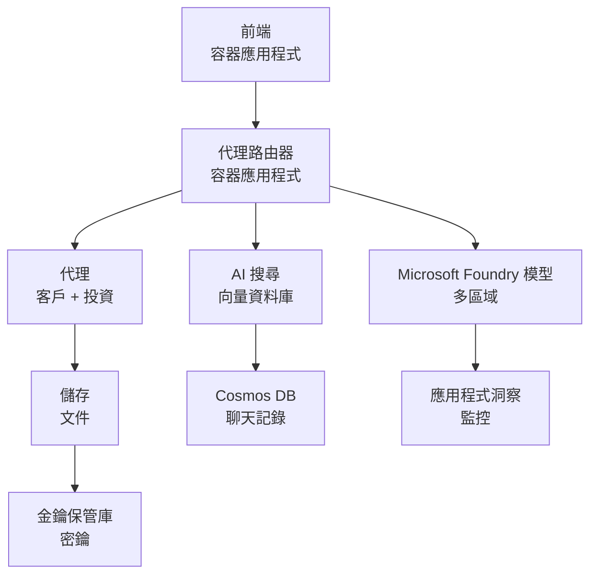

# Retail 多代理解決方案 - 基礎架構範本

**第 5 章：生產部署套件**  
- **📚 課程首頁**: [AZD For Beginners](../../README.md)  
- **📖 相關章節**: [第 5 章：多代理 AI 解決方案](../../README.md#-chapter-5-multi-agent-ai-solutions-advanced)  
- **📝 情境指南**: [完整架構](../retail-scenario.md)  
- **🎯 快速部署**: [一鍵部署](#-quick-deployment)  

> **⚠️ 僅限基礎架構範本**  
> 此 ARM 範本會部署多代理系統的 **Azure 資源**。  
>  
> **部署內容 (約 15-25 分鐘):**  
> - ✅ Microsoft Foundry 模型 (gpt-4.1, gpt-4.1-mini, 三個區域的向量嵌入模型)  
> - ✅ AI 搜尋服務 (空白，準備建立索引)  
> - ✅ 容器應用 (佔位圖像，準備部署您的程式碼)  
> - ✅ 儲存體、Cosmos DB、Key Vault、Application Insights  
>  
> **不包含內容 (需要開發):**  
> - ❌ 代理程式碼實作 (客戶代理、庫存代理)  
> - ❌ 路由邏輯與 API 端點  
> - ❌ 前端聊天 UI  
> - ❌ 搜尋索引結構與數據流程  
> - ❌ **估計開發工時：80-120 小時**  
>  
> **此範本適用於：**  
> - ✅ 您想為多代理專案配置 Azure 基礎架構  
> - ✅ 您計畫分別開發代理程式碼  
> - ✅ 您需要生產準備的基礎架構基線  
>  
> **不適合使用的情況：**  
> - ❌ 您期望立刻有可用的多代理示範  
> - ❌ 您尋找完整的應用程式程式碼範例  

## 總覽

本目錄包含一個完整的 Azure Resource Manager (ARM) 範本，用於部署多代理客服系統的 <strong>基礎架構基礎</strong>。此範本會配置所有必要的 Azure 服務，適當設置並互相連接，準備好供您進行應用程式開發。

**部署後，您將擁有：** 生產就緒的 Azure 基礎架構  
**系統完整所需：** 代理程式碼、前端 UI 及數據配置(請參考 [架構指南](../retail-scenario.md))

## 🎯 部署內容

### 核心基礎架構 (部署後狀態)

✅ **Microsoft Foundry 模型服務** (隨時可呼叫 API)  
  - 主要區域：gpt-4.1 部署 (20K TPM 容量)  
  - 次要區域：gpt-4.1-mini 部署 (10K TPM 容量)  
  - 第三區域：文字向量嵌入模型 (30K TPM 容量)  
  - 評估區域：gpt-4.1 態度評分模型 (15K TPM 容量)  
  - **狀態：** 完全運作中—立即可用 API 呼叫  

✅ **Azure AI 搜尋** (空白—準備設定)  
  - 啟用向量搜尋功能  
  - 標準層級，1 分區，1 複本  
  - **狀態：** 服務運作中，需要建立索引  
  - **需採取措施：** 以您定義的結構建立搜尋索引  

✅ **Azure 儲存體帳戶** (空白—準備上傳)  
  - Blob 容器：`documents`、`uploads`  
  - 安全配置（僅 HTTPS，無公開存取）  
  - **狀態：** 準備接收檔案  
  - **需採取措施：** 上傳您的產品資料與文件  

⚠️ <strong>容器應用環境</strong> (已部署佔位圖像)  
  - 代理路由應用 (nginx 預設映像)  
  - 前端應用 (nginx 預設映像)  
  - 自動擴展設定 (0-10 實例)  
  - **狀態：** 運行佔位符容器  
  - **需採取措施：** 建構並部署您的代理應用  

✅ **Azure Cosmos DB** (空白—準備資料儲存)  
  - 預配置資料庫與容器  
  - 優化低延遲操作  
  - 啟用 TTL 自動清理  
  - **狀態：** 準備儲存聊天歷史紀錄  

✅ **Azure Key Vault** (選用—準備存放機密)  
  - 啟用軟刪除  
  - RBAC 配置給管理身份  
  - **狀態：** 準備儲存 API 金鑰與連線字串  

✅ **Application Insights** (選用—監控啟用中)  
  - 連接至 Log Analytics 工作區  
  - 自訂指標與警示配置  
  - **狀態：** 準備接收應用程式遙測資料  

✅ <strong>文件智能</strong> (準備 API 呼叫)  
  - S0 等級適用於生產工作量  
  - **狀態：** 準備處理上傳文件  

✅ **Bing 搜尋 API** (準備 API 呼叫)  
  - S1 等級提供即時搜索  
  - **狀態：** 準備網頁搜尋查詢  

### 部署模式

| 模式 | OpenAI 容量 | 容器實例數 | 搜尋層級 | 儲存冗餘 | 適用場合 |
|------|-------------|------------|----------|----------|----------|
| <strong>最小化</strong> | 10K-20K TPM | 0-2 複本 | 基本 | LRS (本地冗餘) | 開發/測試、學習、概念驗證 |
| <strong>標準</strong> | 30K-60K TPM | 2-5 複本 | 標準 | ZRS (區域冗餘) | 生產、中等流量 (<10K 使用者) |
| <strong>高級</strong> | 80K-150K TPM | 5-10 複本，區域冗餘 | 高級 | GRS (地理冗餘) | 企業、大流量 (>10K 使用者)，99.99% SLA |

**成本影響：**  
- **最小化 → 標準:** 約 4 倍成本上升(從 $100-370/月 到 $420-1,450/月)  
- **標準 → 高級:** 約 3 倍成本上升(從 $420-1,450/月 到 $1,150-3,500/月)  
- **選擇依據：** 預期負載、SLA 需求、預算限制  

**容量規劃：**  
- **TPM（每分鐘代幣數）:** 全部模型部署總和  
- **容器實例數:** 自動縮放範圍（最小-最大複本數）  
- **搜尋層級:** 影響查詢效能與索引大小限制  

## 📋 前置條件

### 所需工具  
1. **Azure CLI**（版本 2.50.0 或以上）  
   ```bash
   az --version  # 檢查版本
   az login      # 認證
   ```
  
2. **有效的 Azure 訂閱**，擁有擁有者或參與者權限  
   ```bash
   az account show  # 驗證訂閱
   ```
  

### Azure 配額需求

部署前請確認目標區域配額充足：  

```bash
# 檢查您地區嘅 Microsoft Foundry Models 可用性
az cognitiveservices account list-skus \
  --kind OpenAI \
  --location eastus2

# 驗證 OpenAI 配額（以 gpt-4.1 為例）
az cognitiveservices usage list \
  --location eastus2 \
  --query "[?name.value=='OpenAI.Standard.gpt-4.1']"

# 檢查容器應用程序配額
az provider show \
  --namespace Microsoft.App \
  --query "resourceTypes[?resourceType=='managedEnvironments'].locations"
```
  
**最低需求配額：**  
- **Microsoft Foundry 模型：** 3-4 個模型部署於各區域  
  - gpt-4.1：20K TPM  
  - gpt-4.1-mini：10K TPM  
  - text-embedding-ada-002：30K TPM  
  - **備註：** gpt-4.1 於某些區域可能需等待清單，詳見 [模型可用性](https://learn.microsoft.com/azure/ai-services/openai/concepts/models)  
- **容器應用：** 管理環境 + 2-10 容器實例  
- **AI 搜尋：** 標準層（基本層無法支援向量搜尋）  
- **Cosmos DB：** 標準預配吞吐量  

**配額不足時：**  
1. 前往 Azure 入口網站 → 配額 → 申請提升  
2. 或使用 Azure CLI:  
   ```bash
   az support tickets create \
     --ticket-name "OpenAI-Quota-Increase" \
     --severity "minimal" \
     --description "Request quota increase for Microsoft Foundry Models gpt-4.1 in eastus2"
   ```
  
3. 考慮使用其他有供應的區域  

## 🚀 快速部署

### 選項 1：使用 Azure CLI

```bash
# 複製或下載範本檔案
git clone <repository-url>
cd examples/retail-multiagent-arm-template

# 設定部署腳本為可執行
chmod +x deploy.sh

# 使用預設設定部署
./deploy.sh -g myResourceGroup

# 使用高級功能進行生產環境部署
./deploy.sh -g myProdRG -e prod -m premium -l eastus2
```
  
### 選項 2：使用 Azure 入口網站  

[](https://portal.azure.com/#create/Microsoft.Template/uri/https%3A%2F%2Fraw.githubusercontent.com%2Fmicrosoft%2Fazd-for-beginners%2Fmain%2Fexamples%2Fretail-multiagent-arm-template%2Fazuredeploy.json)  

### 選項 3：直接使用 Azure CLI  

```bash
# 建立資源群組
az group create --name myResourceGroup --location eastus2

# 部署範本
az deployment group create \
  --resource-group myResourceGroup \
  --template-file azuredeploy.json \
  --parameters azuredeploy.parameters.json
```
  

## ⏱️ 部署時程

### 預期流程  

| 階段 | 時間 | 活動內容 |  
|-------|-------|----------|  
| <strong>範本驗證</strong> | 30-60 秒 | Azure 驗證 ARM 範本語法及參數 |  
| <strong>資源群組建立</strong> | 10-20 秒 | 若無資源群組則建立 |  
| **OpenAI 資源建立** | 5-8 分鐘 | 建立 3-4 個 OpenAI 帳戶與模型部署 |  
| <strong>容器應用</strong> | 3-5 分鐘 | 建立環境並部署佔位容器 |  
| <strong>搜尋及儲存</strong> | 2-4 分鐘 | 配置 AI 搜尋服務與儲存帳戶 |  
| **Cosmos DB** | 2-3 分鐘 | 建立資料庫及配置容器 |  
| <strong>監控系統設定</strong> | 2-3 分鐘 | 部署 Application Insights 與 Log Analytics |  
| **RBAC 設定** | 1-2 分鐘 | 配置管理身份與權限 |  
| <strong>總部署時間</strong> | **15-25 分鐘** | 全部基礎架構完成 |  

**部署後：**  
- ✅ **基礎架構就緒：** 全部 Azure 服務已設置完成並運作中  
- ⏱️ **應用程式開發階段：** 80-120 小時（需自行負責）  
- ⏱️ **索引設定：** 15-30 分鐘（需自行定義結構）  
- ⏱️ **資料上傳：** 依資料集大小而異  
- ⏱️ **測試與驗證：** 2-4 小時  

---

## ✅ 驗證部署是否成功

### 第 1 步：檢查資源佈署狀態 (約 2 分鐘)

```bash
# 驗證所有資源已成功部署
az resource list \
  --resource-group myResourceGroup \
  --query "[?provisioningState!='Succeeded'].{Name:name, Status:provisioningState, Type:type}" \
  --output table
```
  
**預期結果：** 空清單，所有資源顯示狀態為「Succeeded」  

### 第 2 步：確認 Microsoft Foundry 模型部署 (約 3 分鐘)

```bash
# 列出所有 OpenAI 帳戶
az cognitiveservices account list \
  --resource-group myResourceGroup \
  --query "[?kind=='OpenAI'].{Name:name, Location:location, Status:properties.provisioningState}" \
  --output table

# 檢查主要區域的模型部署
OPENAI_NAME=$(az cognitiveservices account list \
  --resource-group myResourceGroup \
  --query "[?kind=='OpenAI'] | [0].name" -o tsv)

az cognitiveservices account deployment list \
  --name $OPENAI_NAME \
  --resource-group myResourceGroup \
  --output table
```
  
**預期結果：**  
- 3-4 個 OpenAI 帳戶（主、次、第三及評估區域）  
- 每帳戶部署 1-2 個模型 (gpt-4.1, gpt-4.1-mini, text-embedding-ada-002)  

### 第 3 步：測試基礎架構端點 (約 5 分鐘)

```bash
# 獲取容器應用程式網址
az containerapp list \
  --resource-group myResourceGroup \
  --query "[].{Name:name, URL:properties.configuration.ingress.fqdn, Status:properties.runningStatus}" \
  --output table

# 測試路由端點（會回應佔位符圖像）
ROUTER_URL=$(az containerapp show \
  --name retail-router \
  --resource-group myResourceGroup \
  --query "properties.configuration.ingress.fqdn" -o tsv)

echo "Testing: https://$ROUTER_URL"
curl -I https://$ROUTER_URL || echo "Container running (placeholder image - expected)"
```
  
**預期結果：**  
- 容器應用狀態為「Running」  
- 佔位 nginx 回傳 HTTP 200 或 404 (尚無應用程式程式碼)  

### 第 4 步：驗證 Microsoft Foundry 模型 API 存取權 (約 3 分鐘)

```bash
# 獲取 OpenAI 端點和金鑰
OPENAI_ENDPOINT=$(az cognitiveservices account show \
  --name $OPENAI_NAME \
  --resource-group myResourceGroup \
  --query "properties.endpoint" -o tsv)

OPENAI_KEY=$(az cognitiveservices account keys list \
  --name $OPENAI_NAME \
  --resource-group myResourceGroup \
  --query "key1" -o tsv)

# 測試 gpt-4.1 部署
curl "${OPENAI_ENDPOINT}openai/deployments/gpt-4.1/chat/completions?api-version=2024-08-01-preview" \
  -H "Content-Type: application/json" \
  -H "api-key: $OPENAI_KEY" \
  -d '{
    "messages": [{"role": "user", "content": "Say hello"}],
    "max_tokens": 10
  }'
```
  
**預期結果：** JSON 回應包含聊天完成結果（確認 OpenAI 功能正常）  

### 運作與未運作項目比較

**✅ 部署成功後可用：**  
- Microsoft Foundry 模型已部署並可呼叫 API  
- AI 搜尋服務運作中（空白無索引）  
- 容器應用正在運行（nginx 佔位映像）  
- 儲存帳戶可存取並接受上傳  
- Cosmos DB 準備好資料存取  
- Application Insights 收集基礎架構遙測  
- Key Vault 可存放機密資料  

**❌ 尚未可用（需要開發）：**  
- 代理端點（尚無應用程式程式碼部署）  
- 聊天功能（需前端加後端實作）  
- 搜尋查詢（尚未建立搜尋索引）  
- 文件處理流程（尚無資料上傳）  
- 自訂遙測（需應用程式儀器化）  

**後續步驟：** 請參見 [部署後設定](#-post-deployment-next-steps)，開始開發及部署您的應用程式  

---

## ⚙️ 配置選項

### 範本參數

| 參數 | 類型 | 預設值 | 說明 |  
|-------|------|--------|------|  
| `projectName` | string | "retail" | 所有資源名稱的前綴詞 |  
| `location` | string | 資源群組所在位置 | 主要部署區域 |  
| `secondaryLocation` | string | 「westus2」 | 多區域部署的次要區域 |  
| `tertiaryLocation` | string | 「francecentral」 | 向量嵌入模型部署區域 |  
| `environmentName` | string | 「dev」 | 環境標識（開發/測試/生產） |  
| `deploymentMode` | string | 「standard」 | 部署設定（minimal/standard/premium） |  
| `enableMultiRegion` | bool | true | 啟用多區域部署 |  
| `enableMonitoring` | bool | true | 啟用 Application Insights 與記錄 |  
| `enableSecurity` | bool | true | 啟用 Key Vault 與強化安全措施 |  

### 自訂參數

編輯 `azuredeploy.parameters.json`：  

```json
{
  "$schema": "https://schema.management.azure.com/schemas/2019-04-01/deploymentParameters.json#",
  "contentVersion": "1.0.0.0",
  "parameters": {
    "projectName": {
      "value": "mycompany"
    },
    "environmentName": {
      "value": "prod"
    },
    "deploymentMode": {
      "value": "premium"
    },
    "location": {
      "value": "eastus2"
    }
  }
}
```
  

## 🏗️ 架構總覽  



## 📖 部署腳本使用說明  

`deploy.sh` 腳本提供互動式部署體驗：  

```bash
# 顯示說明
./deploy.sh --help

# 基本部署
./deploy.sh -g myResourceGroup

# 使用自訂設定的進階部署
./deploy.sh \
  -g myProductionRG \
  -p companyname \
  -e prod \
  -m premium \
  -l eastus2

# 不含多區域的開發部署
./deploy.sh \
  -g myDevRG \
  -e dev \
  -m minimal \
  --no-multi-region \
  --no-security
```
  

### 腳本特色  

- ✅ <strong>前置條件驗證</strong>（Azure CLI、登入狀態、範本檔案）  
- ✅ <strong>資源群組管理</strong>（若無則建立）  
- ✅ <strong>部署前範本驗證</strong>  
- ✅ <strong>彩色輸出監控部署進度</strong>  
- ✅ <strong>顯示部署輸出結果</strong>  
- ✅ <strong>部署後指引</strong>  

## 📊 監控部署狀態

### 檢查部署狀態  

```bash
# 列出部署
az deployment group list --resource-group myResourceGroup --output table

# 獲取部署詳情
az deployment group show \
  --resource-group myResourceGroup \
  --name retail-deployment-YYYYMMDD-HHMMSS

# 監察部署進度
az deployment group create \
  --resource-group myResourceGroup \
  --template-file azuredeploy.json \
  --parameters azuredeploy.parameters.json \
  --verbose
```
  

### 部署輸出  

成功部署後，可用以下輸出資訊：  

- **前端 URL**：網頁介面公開端點  
- **路由器 URL**：代理路由的 API 端點  
- **OpenAI 端點**：主次 OpenAI 服務端點  
- <strong>搜尋服務</strong>：Azure AI 搜尋服務端點  
- <strong>儲存帳戶</strong>：文件儲存帳戶名稱  
- **Key Vault**：金鑰保管庫名稱（若啟用）  
- **Application Insights**：監控服務名稱（若啟用）  

## 🔧 部署後：後續工作
> **📝 重要提醒：** 基礎設施已部署完成，但你需要開發並部署應用程式代碼。

### 第 1 階段：開發代理應用程式（你的職責）

ARM 模板會建立使用 nginx 佔位符映像的<strong>空容器應用程式</strong>。你必須：

**必要開發工作：**
1. <strong>代理實作</strong>（30-40 小時）
   - 支援 gpt-4.1 整合的客戶服務代理
   - 支援 gpt-4.1-mini 整合的庫存代理
   - 代理路由邏輯

2. <strong>前端開發</strong>（20-30 小時）
   - 聊天介面 UI（React/Vue/Angular）
   - 檔案上傳功能
   - 回應渲染與格式化

3. <strong>後端服務</strong>（12-16 小時）
   - FastAPI 或 Express 路由
   - 認證中介軟體
   - 遙測整合

**參考：** [架構指南](../retail-scenario.md) 以查看詳細實作範例和程式碼示例

### 第 2 階段：設定 AI 搜尋索引（15-30 分鐘）

建立匹配你資料模型的搜尋索引：

```bash
# 獲取搜索服務詳情
SEARCH_NAME=$(az search service list \
  --resource-group myResourceGroup \
  --query "[0].name" -o tsv)

SEARCH_KEY=$(az search admin-key show \
  --service-name $SEARCH_NAME \
  --resource-group myResourceGroup \
  --query "primaryKey" -o tsv)

# 使用您的結構建立索引（範例）
curl -X POST "https://${SEARCH_NAME}.search.windows.net/indexes?api-version=2023-11-01" \
  -H "Content-Type: application/json" \
  -H "api-key: ${SEARCH_KEY}" \
  -d '{
    "name": "products",
    "fields": [
      {"name": "id", "type": "Edm.String", "key": true},
      {"name": "title", "type": "Edm.String", "searchable": true},
      {"name": "content", "type": "Edm.String", "searchable": true},
      {"name": "category", "type": "Edm.String", "filterable": true},
      {"name": "content_vector", "type": "Collection(Edm.Single)", 
       "searchable": true, "dimensions": 1536, "vectorSearchProfile": "default"}
    ],
    "vectorSearch": {
      "algorithms": [{"name": "default", "kind": "hnsw"}],
      "profiles": [{"name": "default", "algorithm": "default"}]
    }
  }'
```

**資源：**
- [AI 搜尋索引架構設計](https://learn.microsoft.com/azure/search/search-what-is-an-index)
- [向量搜尋設定方式](https://learn.microsoft.com/azure/search/vector-search-how-to-create-index)

### 第 3 階段：上傳你的資料（耗時視情況而定）

當你有產品資料和文件時：

```bash
# 獲取儲存帳戶詳情
STORAGE_NAME=$(az storage account list \
  --resource-group myResourceGroup \
  --query "[0].name" -o tsv)

STORAGE_KEY=$(az storage account keys list \
  --account-name $STORAGE_NAME \
  --resource-group myResourceGroup \
  --query "[0].value" -o tsv)

# 上載您的文件
az storage blob upload-batch \
  --destination documents \
  --source /path/to/your/product/docs \
  --account-name $STORAGE_NAME \
  --account-key $STORAGE_KEY

# 範例：上載單一檔案
az storage blob upload \
  --container-name documents \
  --name "product-manual.pdf" \
  --file /path/to/product-manual.pdf \
  --account-name $STORAGE_NAME \
  --account-key $STORAGE_KEY
```

### 第 4 階段：建置並部署你的應用程式（8-12 小時）

當你開發完成代理程式碼後：

```bash
# 1. 建立 Azure 容器登錄庫（如有需要）
az acr create \
  --name myregistry \
  --resource-group myResourceGroup \
  --sku Basic

# 2. 建構並推送代理路由器映像
docker build -t myregistry.azurecr.io/agent-router:v1 /path/to/your/router/code
az acr login --name myregistry
docker push myregistry.azurecr.io/agent-router:v1

# 3. 建構並推送前端映像
docker build -t myregistry.azurecr.io/frontend:v1 /path/to/your/frontend/code
docker push myregistry.azurecr.io/frontend:v1

# 4. 使用你的映像更新容器應用程式
az containerapp update \
  --name retail-router \
  --resource-group myResourceGroup \
  --image myregistry.azurecr.io/agent-router:v1

az containerapp update \
  --name retail-frontend \
  --resource-group myResourceGroup \
  --image myregistry.azurecr.io/frontend:v1

# 5. 配置環境變數
az containerapp update \
  --name retail-router \
  --resource-group myResourceGroup \
  --set-env-vars \
    OPENAI_ENDPOINT=secretref:openai-endpoint \
    OPENAI_KEY=secretref:openai-key \
    SEARCH_ENDPOINT=secretref:search-endpoint \
    SEARCH_KEY=secretref:search-key
```

### 第 5 階段：測試你的應用程式（2-4 小時）

```bash
# 取得你的應用程式網址
ROUTER_URL=$(az containerapp show \
  --name retail-router \
  --resource-group myResourceGroup \
  --query "properties.configuration.ingress.fqdn" -o tsv)

# 測試代理端點（當你的程式碼部署後）
curl -X POST "https://${ROUTER_URL}/chat" \
  -H "Content-Type: application/json" \
  -d '{
    "message": "Hello, I need help with my order",
    "agent": "customer"
  }'

# 檢查應用程式日誌
az containerapp logs show \
  --name retail-router \
  --resource-group myResourceGroup \
  --follow
```

### 實作資源

**架構與設計：**
- 📖 [完整架構指南](../retail-scenario.md) - 詳細實作範例
- 📖 [多代理設計模式](https://learn.microsoft.com/azure/architecture/ai-ml/guide/multi-agent-systems)

**程式碼範例：**
- 🔗 [Microsoft Foundry 模型聊天示例](https://github.com/Azure-Samples/azure-search-openai-demo) - RAG 模式
- 🔗 [Semantic Kernel](https://github.com/microsoft/semantic-kernel) - 代理框架（C#）
- 🔗 [LangChain Azure](https://github.com/langchain-ai/langchain) - 代理協調（Python）
- 🔗 [AutoGen](https://github.com/microsoft/autogen) - 多代理對話

**預估總工作量：**
- 基礎設施部署：15-25 分鐘（✅ 已完成）
- 應用程式開發：80-120 小時（🔨 你的工作）
- 測試與優化：15-25 小時（🔨 你的工作）

## 🛠️ 疑難排解

### 常見問題

#### 1. Microsoft Foundry 模型額度超過

```bash
# 檢查當前配額使用情況
az cognitiveservices usage list --location eastus2

# 請求增加配額
az support tickets create \
  --ticket-name "OpenAI-Quota-Increase" \
  --severity "minimal" \
  --description "Request quota increase for Microsoft Foundry Models in region X"
```

#### 2. 容器應用程式部署失敗

```bash
# 檢查容器應用程式日誌
az containerapp logs show \
  --name retail-router \
  --resource-group myResourceGroup \
  --follow

# 重新啟動容器應用程式
az containerapp revision restart \
  --name retail-router \
  --resource-group myResourceGroup
```

#### 3. 搜尋服務初始化

```bash
# 驗證搜尋服務狀態
az search service show \
  --name <search-service-name> \
  --resource-group myResourceGroup

# 測試搜尋服務連接性
curl -X GET "https://<search-service-name>.search.windows.net/indexes?api-version=2023-11-01" \
  -H "api-key: <search-admin-key>"
```

### 部署驗證

```bash
# 驗證所有資源已被創建
az resource list \
  --resource-group myResourceGroup \
  --output table

# 檢查資源健康狀況
az resource list \
  --resource-group myResourceGroup \
  --query "[?provisioningState!='Succeeded'].{Name:name, Status:provisioningState, Type:type}" \
  --output table
```

## 🔐 安全考量

### 金鑰管理
- 所有機密皆儲存於 Azure Key Vault（啟用時）
- 容器應用程式使用受管理身份驗證
- 儲存帳戶具備安全預設（僅 HTTPS，無公開 Blob 存取）

### 網路安全
- 容器應用盡量使用內部網路
- 搜尋服務設定私有端點選項
- Cosmos DB 配置最低必要權限

### 角色型存取控制（RBAC）配置
```bash
# 為受管理身分指派必要角色
az role assignment create \
  --assignee <container-app-managed-identity> \
  --role "Cognitive Services OpenAI User" \
  --scope <openai-resource-id>
```

## 💰 成本優化

### 成本估算（每月，美金）

| 模式 | OpenAI | 容器應用程式 | 搜尋 | 儲存 | 總估算 |
|------|--------|--------------|------|------|--------|
| 最小 | $50-200 | $20-50 | $25-100 | $5-20 | $100-370 |
| 標準 | $200-800 | $100-300 | $100-300 | $20-50 | $420-1450 |
| 頂級 | $500-2000 | $300-800 | $300-600 | $50-100 | $1150-3500 |

### 成本監控

```bash
# 設定預算警報
az consumption budget create \
  --account-name <subscription-id> \
  --budget-name "retail-budget" \
  --amount 500 \
  --time-grain Monthly \
  --start-date 2024-01-01 \
  --end-date 2024-12-31
```

## 🔄 更新與維護

### 模板更新
- 透過版本控制管理 ARM 模板檔案
- 先在開發環境進行變更測試
- 以增量部署模式更新

### 資源更新
```bash
# 使用新參數更新
az deployment group create \
  --resource-group myResourceGroup \
  --template-file azuredeploy.json \
  --parameters azuredeploy.parameters.json \
  --mode Incremental
```

### 備份與復原
- Cosmos DB 已啟用自動備份
- Key Vault 啟用軟刪除功能
- 容器應用保留修訂版本以便回滾

## 📞 支援

- <strong>模板問題</strong>：[GitHub Issues](https://github.com/microsoft/azd-for-beginners/issues)
- **Azure 支援**：[Azure 支援入口網站](https://portal.azure.com/#blade/Microsoft_Azure_Support/HelpAndSupportBlade)
- <strong>社群</strong>：[Azure AI Discord](https://discord.gg/microsoft-azure)

---

**⚡ 準備好部署你的多代理方案了嗎？**

從這裡開始：`./deploy.sh -g myResourceGroup`

---

<!-- CO-OP TRANSLATOR DISCLAIMER START -->
**免責聲明**：  
本文件由 AI 翻譯服務 [Co-op Translator](https://github.com/Azure/co-op-translator) 翻譯而成。雖然我們致力於確保準確性，但請注意自動翻譯可能包含錯誤或不準確之處。原始文件的原文版本應被視為權威來源。對於重要資訊，建議採用專業人工翻譯。我們不對因使用本翻譯而產生的任何誤解或誤譯承擔責任。
<!-- CO-OP TRANSLATOR DISCLAIMER END -->