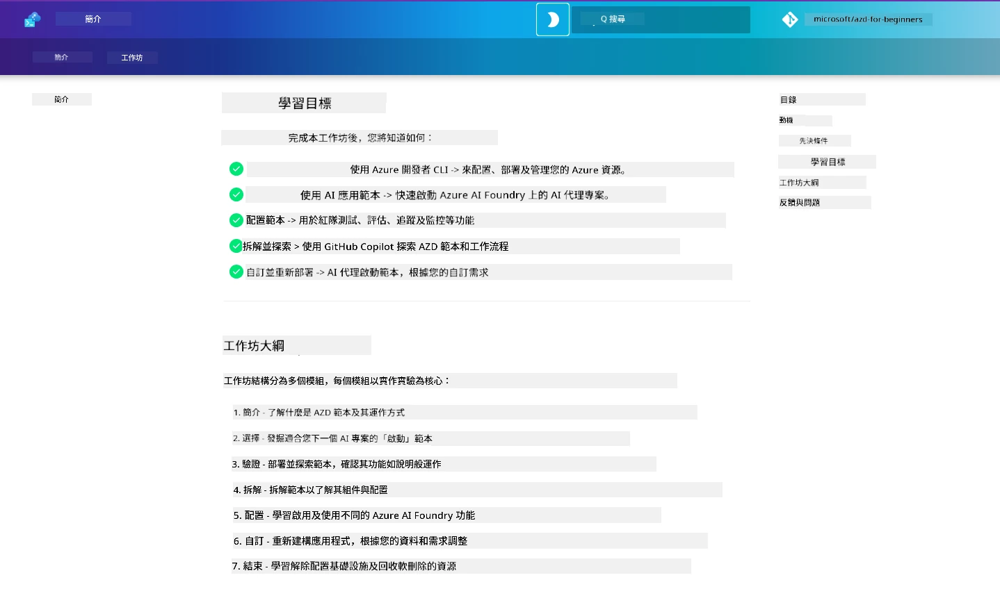

<div align="center">
  <div style="background: linear-gradient(135deg, #0078d4, #106ebe); border-radius: 10px; padding: 20px; margin: 20px 0; box-shadow: 0 4px 15px rgba(0, 120, 212, 0.3); border: 2px solid #005a9e;">
    <h2 style="color: white; margin: 0; font-size: 24px; text-shadow: 1px 1px 2px rgba(0,0,0,0.3);">
      🎯 AZD AI 開發者工作坊
    </h2>
    <p style="color: white; margin: 10px 0 0 0; font-size: 16px; text-shadow: 1px 1px 2px rgba(0,0,0,0.3);">
      <strong>一個利用 Azure Developer CLI 構建 AI 應用的親身操作工作坊。</strong><br>
      完成7個模組，掌握AZD範本及AI部署工作流程。
    </p>
    <div style="margin-top: 15px;">
      <span style="background: rgba(255,255,255,0.2); padding: 5px 10px; border-radius: 15px; color: white; font-size: 14px;">
        📅 最近更新：2026年2月
      </span>
    </div>
  </div>
</div>

# AZD AI 開發者工作坊

歡迎參加專注於AI應用部署的Azure Developer CLI (AZD)學習親手操作工作坊。此工作坊將透過3步驟，協助你實際了解AZD範本：

1. **發掘** - 找到適合你的範本。
1. **部署** - 部署並驗證是否正常運作
1. **自訂** - 修改並迭代，將它變成你的專屬作品！

在此工作坊過程中，你也將接觸核心開發工具及工作流程，幫助你順暢完成端對端開發旅程。

<br/>

## 瀏覽器內指引

工作坊課程是以 Markdown 編寫。你可以直接在 GitHub 瀏覽，或按照下方截圖示範啟動瀏覽器預覽。



若要使用此選項 - 請將此倉庫分叉到你的個人帳戶，然後啟動 GitHub Codespaces。當 VS Code 終端機啟動後，輸入以下命令：

```bash title="" linenums="0"
mkdocs serve > /dev/null 2>&1 &
```

幾秒鐘後會看到彈出對話框。選擇`Open in browser`選項。基於網頁的指南會在新分頁開啟。此預覽有幾項好處：

1. **內建搜尋** - 快速找到關鍵字或課程。
1. **複製圖示** - 滑鼠停留在程式碼區塊時會顯示此選項
1. **主題切換** - 在深色和淺色主題間切換
1. **求助支援** - 點擊頁腳Discord圖示加入社群！

<br/>

## 工作坊總覽

**時長：** 3-4小時  
**程度：** 初學者到中階  
**先備知識：** 熟悉Azure、AI概念、VS Code及命令列工具。

這是一個以實作學習為主的工作坊。當你完成所有練習後，建議回顧 AZD 初學者課程，繼續學習安全及生產力最佳實務。

| 時間| 模組  | 目標 |
|:---|:---|:---|
| 15 分鐘 | [簡介](docs/instructions/0-Introduction.md) | 建立基調，理解目標 |
| 30 分鐘 | [選擇 AI 範本](docs/instructions/1-Select-AI-Template.md) | 探索選項並選擇入門範本 | 
| 30 分鐘 | [驗證 AI 範本](docs/instructions/2-Validate-AI-Template.md) | 部署預設方案至 Azure |
| 30 分鐘 | [解構 AI 範本](docs/instructions/3-Deconstruct-AI-Template.md) | 探索結構與設定檔 |
| 30 分鐘 | [配置 AI 範本](docs/instructions/4-Configure-AI-Template.md) | 啟用並試用可用功能 |
| 30 分鐘 | [自訂 AI 範本](docs/instructions/5-Customize-AI-Template.md) | 依需求調整範本 |
| 30 分鐘 | [拆除基礎架構](docs/instructions/6-Teardown-Infrastructure.md) | 清理與釋放資源 |
| 15 分鐘 | [總結與後續](docs/instructions/7-Wrap-up.md) | 學習資源，工作坊挑戰 |

<br/>

## 你將學到什麼？

將AZD範本視為一個學習沙盒，探索Microsoft Foundry端對端開發的各種能力及工具。完成工作坊後，你應能直覺掌握相關工具及概念。

| 概念  | 目標 |
|:---|:---|
| **Azure Developer CLI** | 了解工具指令與工作流程|
| **AZD 範本**| 了解專案結構及設定檔|
| **Azure AI Agent**| 部署 Microsoft Foundry 專案 |
| **Azure AI Search**| 利用代理人實現情境工程 |
| **可觀察性**| 探索追蹤、監控和評估 |
| **紅隊測試**| 探索對抗測試與防範措施 |

<br/>

## 工作坊架構

工作坊結構設計帶你從範本發掘、部署、解構到自訂，使用官方[Getting Started with AI Agents](https://github.com/Azure-Samples/get-started-with-ai-agents)入門範本作為基礎。

### [模組 1：選擇 AI 範本](docs/instructions/1-Select-AI-Template.md) (30 分鐘)

- 什麼是 AI 範本？
- 我在哪裡找到 AI 範本？
- 如何開始建構 AI 代理人？
- **實驗**：快速開始 GitHub Codespaces

### [模組 2：驗證 AI 範本](docs/instructions/2-Validate-AI-Template.md) (30 分鐘)

- AI 範本架構是什麼？
- AZD 開發工作流程是什麼？
- 如何獲得 AZD 開發幫助？
- **實驗**：部署並驗證 AI 代理人範本

### [模組 3：解構 AI 範本](docs/instructions/3-Deconstruct-AI-Template.md) (30 分鐘)

- 探索 `.azure/` 環境
- 探索 `infra/` 資源配置
- 探索 `azure.yaml` AZD 設定
- **實驗**：修改環境變數並重新部署

### [模組 4：配置 AI 範本](docs/instructions/4-Configure-AI-Template.md) (30 分鐘)
- 探索：增強型檢索生成
- 探索：代理人評估與紅隊測試
- 探索：追蹤與監控
- **實驗**：探索 AI 代理人 + 可觀察性 

### [模組 5：自訂 AI 範本](docs/instructions/5-Customize-AI-Template.md) (30 分鐘)
- 定義：含場景需求的產品需求文件 (PRD)
- 配置：AZD 環境變數
- 實作：生命週期掛鉤新增任務
- **實驗**：為我的場景自訂範本

### [模組 6：拆除基礎架構](docs/instructions/6-Teardown-Infrastructure.md) (30 分鐘)
- 回顧：什麼是 AZD 範本？
- 回顧：為何使用 Azure Developer CLI？
- 後續步驟：嘗試不同範本！
- **實驗**：解除基礎架構與清理

<br/>

## 工作坊挑戰

想挑戰自己做更多嗎？以下是一些專案建議，當然也歡迎與我們分享你的想法！

| 專案 | 說明 |
|:---|:---|
|1. **解構複雜 AI 範本** | 利用我們介紹的流程和工具，試著部署、驗證與自訂不同的 AI 解決方案範本。 _你學到了什麼？_|
|2. **以你的場景自訂**  | 嘗試為不同場景撰寫PRD（產品需求文件）。接著在範本儲存庫以代理模型使用 GitHub Copilot，請它生成客製化工作流程。 _你學到了什麼？如何改善這些建議？_|
| | |

## 有意見反饋？

1. 在本倉庫發佈 Issue - 請標註 `Workshop` 標籤方便識別。
1. 加入 Microsoft Foundry Discord - 與其他學員交流！

| | | 
|:---|:---|
| **📚 課程主頁**| [AZD 初學者](../README.md)|
| **📖 文件** | [AI 範本快速入門](https://learn.microsoft.com/en-us/azure/ai-foundry/how-to/develop/ai-template-get-started)|
| **🛠️ AI 範本** | [Microsoft Foundry 範本](https://ai.azure.com/templates) |
|**🚀 往下進階** | [開始工作坊](../../../workshop) |
| | |

<br/>

---

**導覽：** [主課程](../README.md) | [簡介](docs/instructions/0-Introduction.md) | [模組 1：選擇範本](docs/instructions/1-Select-AI-Template.md)

**準備好用 AZD 開發 AI 應用了嗎？**

[開始工作坊：簡介 →](docs/instructions/0-Introduction.md)

---

<!-- CO-OP TRANSLATOR DISCLAIMER START -->
**免責聲明**：  
本文件已使用 AI 翻譯服務 [Co-op Translator](https://github.com/Azure/co-op-translator) 進行翻譯。儘管我們力求準確，但請注意，自動翻譯可能包含錯誤或不準確之處。原始文件及其母語版本應被視為權威來源。對於重要資訊，建議採用專業人工翻譯。本公司不對因使用此翻譯而引致的任何誤解或誤釋負責。
<!-- CO-OP TRANSLATOR DISCLAIMER END -->