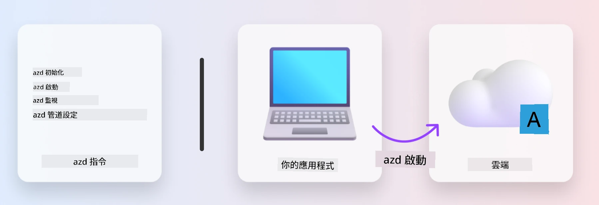
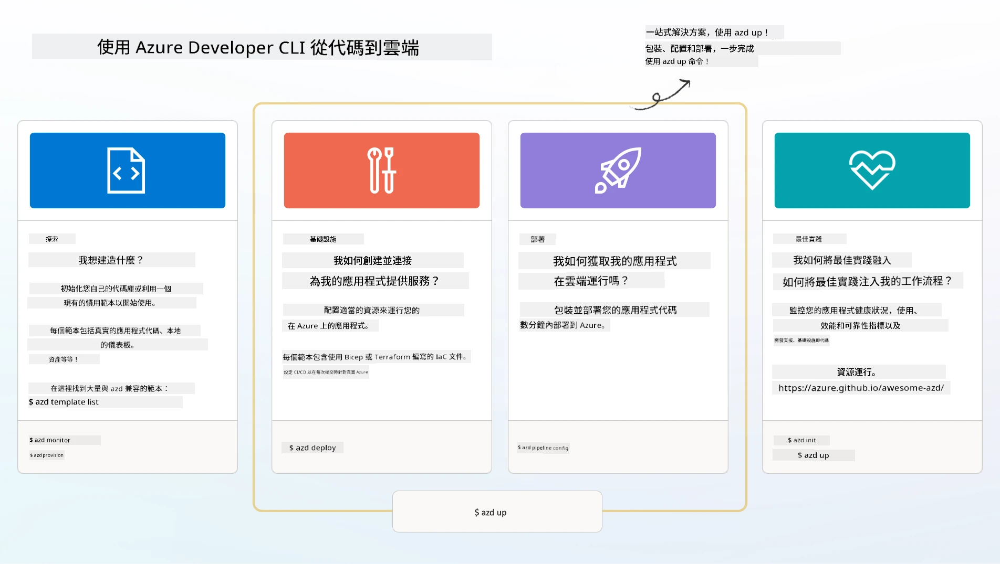

# 1. 選擇範本

!!! tip "在本單元結束時你將能夠"

    - [ ] 描述什麼是 AZD 範本
    - [ ] 找到並使用用於 AI 的 AZD 範本
    - [ ] 開始使用 AI Agents 範本
    - [ ] **實驗 1：** 在 Codespaces 或開發容器中進行 AZD 快速入門

---

## 1. 建築者比喻

從零開始構建一個現代、企業級的 AI 應用程式可能令人生畏。這有點像自己一磚一瓦地建造新居。是的，可以做到！但這並不是達到理想結果的最有效方法！

相反地，我們通常會從現有的「設計藍圖」開始，並與建築師合作以按個人需求進行客製化。這正是構建智能應用程式時應採取的方法。首先，找到一個適合你問題領域的良好設計架構。然後與解決方案架構師合作，為你的特定情境進行客製化和開發。

但我們在哪裡可以找到這些設計藍圖？又如何找到願意教我們如何自行客製化和部署這些藍圖的架構師？在本工作坊中，我們透過介紹三項技術來回答這些問題：

1. [Azure Developer CLI](https://aka.ms/azd) - 一個開源工具，可加速從本地開發（建置）到雲端部署（發佈）的開發者流程。
1. [Microsoft Foundry Templates](https://ai.azure.com/templates) - 標準化的開源儲存庫，包含範例程式碼、基礎結構和配置檔，用於部署 AI 解決方案架構。
1. [GitHub Copilot Agent Mode](https://code.visualstudio.com/docs/copilot/chat/chat-agent-mode) - 以 Azure 知識為基礎的編碼代理，能以自然語言指引我們瀏覽程式碼庫並進行更改。

有了這些工具，我們現在可以「發現」適合的範本、「部署」以驗證其運作，並「客製化」以符合我們的特定情境。讓我們深入了解這些工具如何運作。

---

## 2. Azure Developer CLI

[Azure Developer CLI](https://learn.microsoft.com/en-us/azure/developer/azure-developer-cli/)（或 `azd`）是一個開源命令列工具，透過一組適合開發者的指令，能在你的 IDE（開發）和 CI/CD（DevOps）環境中一致地加速你的程式碼到雲端旅程。

使用 `azd`，你的部署旅程可以簡化為：

- `azd init` - 從現有的 AZD 範本初始化新的 AI 專案。
- `azd up` - 一步驟配置基礎結構並部署你的應用程式。
- `azd monitor` - 取得已部署應用程式的即時監控與診斷。
- `azd pipeline config` - 設定 CI/CD 管線以自動化部署到 Azure。

**🎯 | 練習**: <br/> 立即在你目前的工作坊環境中探索 `azd` 命令列工具。這可以是 GitHub Codespaces、開發容器，或已安裝先決條件的本地複本。先輸入以下指令以查看該工具能做什麼：

```bash title="" linenums="0"
azd help
```



---

## 3. AZD 範本

為了讓 `azd` 實現上述功能，它需要知道要佈建的基礎結構、要強制的配置設定，以及要部署的應用程式。這就是 [AZD 範本](https://learn.microsoft.com/en-us/azure/developer/azure-developer-cli/azd-templates?tabs=csharp) 的用途。

AZD 範本是將範例程式碼與部署該解決方案架構所需的基礎結構與配置檔案結合在一起的開源儲存庫。透過採用「基礎建設即程式碼」（Infrastructure-as-Code, IaC）方法，它們允許範本資源定義和配置設定像應用程式原始碼一樣被版本控制——在該專案的使用者之間建立可重用且一致的工作流程。

在為_你的_情境建立或重用 AZD 範本時，請考慮以下問題：

1. 你在構建什麼？ → 是否有包含該情境起始程式碼的範本？
1. 你的解決方案如何被架構化？ → 是否有包含必要資源的範本？
1. 你的解決方案如何部署？ → 設想帶有 pre/post 處理鉤子的 `azd deploy`！
1. 你如何進一步優化它？ → 設想內建的監控和自動化管線！

**🎯 | 練習**: <br/> 
造訪 [Awesome AZD](https://azure.github.io/awesome-azd/) 展示頁，並使用篩選器瀏覽目前可用的 250+ 範本。看看你是否能找到符合_你_情境需求的範本。



---

## 4. AI 應用範本

針對 AI 驅動的應用程式，Microsoft 提供了以 **Microsoft Foundry** 和 **Foundry Agents** 為特色的專門範本。這些範本能加速你建立智能、可投入生產的應用程式的路徑。

### Microsoft Foundry 與 Foundry Agents 範本

在下方選擇一個範本進行部署。每個範本皆可在 [Awesome AZD](https://azure.github.io/awesome-azd/) 找到，並可用單一指令初始化。

| Template | Description | Deploy Command |
|----------|-------------|----------------|
| **[AI Chat with RAG](https://azure.github.io/awesome-azd/?tags=ai&tags=rag)** | 使用 Microsoft Foundry 的檢索增強生成（RAG）聊天應用 | `azd init -t azure-samples/azure-search-openai-demo` |
| **[Foundry Agent Service Starter](https://azure.github.io/awesome-azd/?tags=ai&tags=agents)** | 使用 Foundry Agents 建立可自動執行任務的 AI 代理 | `azd init -t azure-samples/foundry-agent-service-starter` |
| **[Multi-Agent Orchestration](https://azure.github.io/awesome-azd/?tags=ai&tags=agents)** | 協調多個 Foundry Agents 以處理複雜工作流程 | `azd init -t azure-samples/multi-agent-orchestration` |
| **[AI Document Intelligence](https://azure.github.io/awesome-azd/?tags=ai&tags=document)** | 使用 Microsoft Foundry 模型擷取與分析文件 | `azd init -t azure-samples/ai-document-processing` |
| **[Conversational AI Bot](https://azure.github.io/awesome-azd/?tags=ai&tags=bot)** | 建立與 Microsoft Foundry 整合的智能聊天機器人 | `azd init -t azure-samples/ai-chat-protocol` |
| **[AI Image Generation](https://azure.github.io/awesome-azd/?tags=ai&tags=dalle)** | 使用 Microsoft Foundry 的 DALL-E 生成影像 | `azd init -t azure-samples/ai-image-generation` |
| **[Semantic Kernel Agent](https://azure.github.io/awesome-azd/?tags=ai&tags=semantic-kernel)** | 使用 Semantic Kernel 與 Foundry Agents 的 AI 代理 | `azd init -t azure-samples/semantic-kernel-agent` |
| **[AutoGen Multi-Agent](https://azure.github.io/awesome-azd/?tags=ai&tags=autogen)** | 使用 AutoGen 架構的多代理系統 | `azd init -t azure-samples/autogen-multi-agent` |

### 快速上手

1. <strong>瀏覽範本</strong>: 前往 [https://azure.github.io/awesome-azd/](https://azure.github.io/awesome-azd/) 並以 `AI`、`Agents` 或 `Microsoft Foundry` 做篩選
2. <strong>選擇你的範本</strong>: 選一個符合你使用案例的範本
3. <strong>初始化</strong>: 執行你所選範本的 `azd init` 指令
4. <strong>部署</strong>: 執行 `azd up` 以進行配置與部署

**🎯 | 練習**: <br/>
根據你的情境從上方範本中選擇一個：

- **要建立聊天機器人？** → 從 **AI Chat with RAG** 或 **Conversational AI Bot** 開始
- **需要自主代理？** → 嘗試 **Foundry Agent Service Starter** 或 **Multi-Agent Orchestration**
- **要處理文件？** → 使用 **AI Document Intelligence**
- **想要 AI 程式碼協助？** → 探索 **Semantic Kernel Agent** 或 **AutoGen Multi-Agent**

```bash title="Example: Deploy the AI Chat with RAG template" linenums="0"
azd init -t azure-samples/azure-search-openai-demo
azd up
```

!!! info "探索更多範本"
    [Awesome AZD Gallery](https://azure.github.io/awesome-azd/) 包含 250+ 範本。使用篩選器以找到符合你在語言、框架和 Azure 服務方面具體需求的範本。

---

<!-- CO-OP TRANSLATOR DISCLAIMER START -->
**免責聲明**:
本文件已使用 AI 翻譯服務 [Co-op Translator](https://github.com/Azure/co-op-translator) 進行翻譯。儘管我們力求準確，但請注意，自動翻譯可能包含錯誤或不準確之處。以原始語言撰寫的原文應被視為具權威性的版本。若涉及重要資訊，建議採用專業人工翻譯。我們不就因使用本翻譯而引致的任何誤解或誤釋承擔任何責任。
<!-- CO-OP TRANSLATOR DISCLAIMER END -->