# 2. 驗證範本

!!! tip "完成本單元後你將能夠"

    - [ ] 分析 AI 解決方案架構
    - [ ] 了解 AZD 部署工作流程
    - [ ] 使用 GitHub Copilot 取得 AZD 用法協助
    - [ ] **實驗 2：** 部署與驗證 AI Agents 範本

---


## 1. 介紹

[Azure Developer CLI](https://learn.microsoft.com/en-us/azure/developer/azure-developer-cli/) 或 `azd` 是一個開源命令列工具，可簡化開發人員在 Azure 上構建和部署應用的工作流程。

[AZD 範本](https://learn.microsoft.com/azure/developer/azure-developer-cli/azd-templates) 是標準化的資料庫，其中包含範例應用程式代碼、_基礎結構即代碼_ 資產和 `azd` 配置檔，以打造一致的解決方案架構。基礎結構的佈建只需簡單的 `azd provision` 命令，而使用 `azd up` 則能一次完成基礎結構佈建 **與** 應用部署！

因此，啟動應用程式開發流程可以簡單至尋找最接近你應用與基礎結構需求的 _AZD 起始範本_，並自訂存放庫以符合你的方案需求。

開始前，請先確保你已安裝 Azure Developer CLI。

1. 開啟 VS Code 終端機並輸入此命令：

      ```bash title="" linenums="0"
      azd version
      ```

1. 你應該會看到類似以下的資訊！

      ```bash title="" linenums="0"
      azd version 1.19.0 (commit b3d68cea969b2bfbaa7b7fa289424428edb93e97)
      ```

**你已準備好使用 azd 選擇並部署範本**

---

## 2. 範本選擇

Microsoft Foundry 平台附帶一組 [建議的 AZD 範本](https://learn.microsoft.com/en-us/azure/ai-foundry/how-to/develop/ai-template-get-started)，涵蓋流行解決方案場景如 _多代理人工作流程自動化_ 與 _多模態內容處理_。你也可以透過造訪 Microsoft Foundry 入口網站找到這些範本。

1. 造訪 [https://ai.azure.com/templates](https://ai.azure.com/templates)
1. 當系統提示時登入 Microsoft Foundry 入口網站 — 你會看到類似以下畫面。

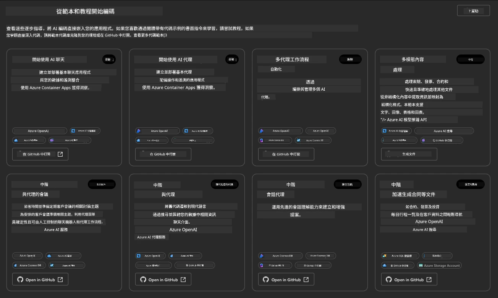


**Basic** 選項是你的起始範本：

1. [ ] [使用 AI Chat 入門](https://github.com/Azure-Samples/get-started-with-ai-chat)，可部署一個基本聊天應用程式 _搭配你的資料_ 至 Azure Container Apps。用來探索基本 AI 聊天機器人場景。
1. [X] [使用 AI Agents 入門](https://github.com/Azure-Samples/get-started-with-ai-agents)，同時部署標準 AI 代理人（搭配 Foundry Agents）。用來熟悉包含工具和模型的代理人式 AI 解決方案。

請在新分頁造訪第二個連結（或點擊相關卡片的 `Open in GitHub`）。你應該會看到此 AZD 範本的存放庫。花點時間瀏覽 README。應用架構如下：

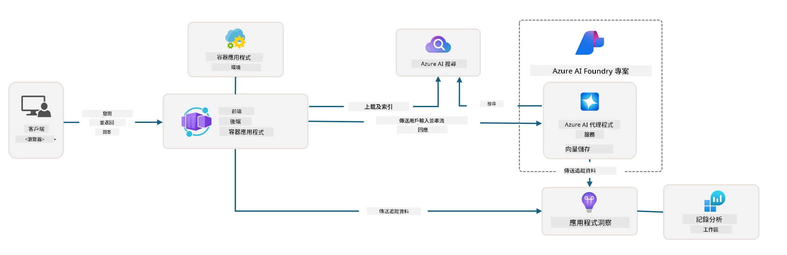

---

## 3. 範本啟動

我們試著部署此範本並確保其有效性。我們將依循 [Getting Started](https://github.com/Azure-Samples/get-started-with-ai-agents?tab=readme-ov-file#getting-started) 區段的指引。

1. 點擊 [此連結](https://github.com/codespaces/new/Azure-Samples/get-started-with-ai-agents) — 確認預設動作為 `Create codespace`
1. 這會在新分頁開啟 — 等候 GitHub Codespaces 會話載入完成
1. 在 Codespaces 中開啟 VS Code 終端機，輸入下列命令：

   ```bash title="" linenums="0"
   azd up
   ```

完成會觸發的工作流程步驟：

1. 系統會提示你登入 Azure — 按指示完成驗證
1. 輸入一個獨特的環境名稱 — 例如我用 `nitya-mshack-azd`
1. 這會建立一個 `.azure/` 資料夾 — 你會看到環境名稱的子資料夾
1. 系統會提示選擇訂閱名稱 — 選擇預設值
1. 系統會提示輸入地點 — 使用 `East US 2`

現在，等待基礎結構佈建完成。**這需要 10-15 分鐘**

1. 完成後，你的終端機會顯示成功訊息如下：
      ```bash title="" linenums="0"
      SUCCESS: Your up workflow to provision and deploy to Azure completed in 10 minutes 17 seconds.
      ```
1. 你的 Azure 入口網站將會有一個以該環境名稱建立的資源群組：

      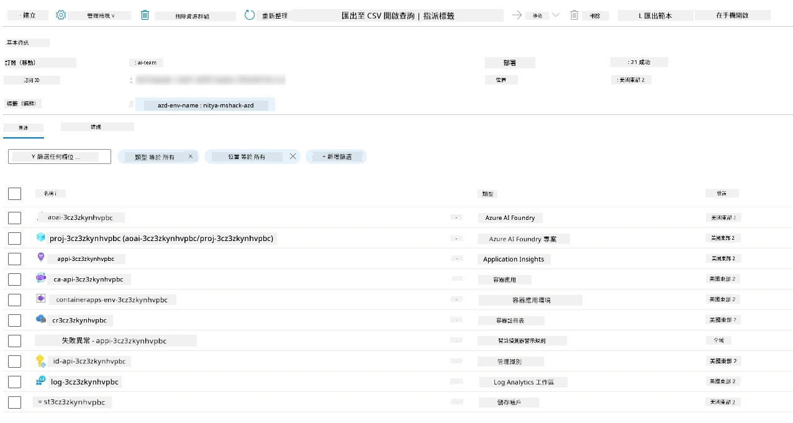

1. **你已準備好驗證已部署的基礎結構與應用程式**。

---

## 4. 範本驗證

1. 造訪 Azure 入口網站的 [資源群組](https://portal.azure.com/#browse/resourcegroups) 頁面 — 當系統提示時登入
1. 點擊你環境名稱的資源群組 — 你會看到前述頁面

      - 點擊 Azure Container Apps 資源
      - 點擊 _Essentials_ 區塊（右上）中的應用程式網址

1. 你應該會看到類似這樣的託管應用前端 UI：

   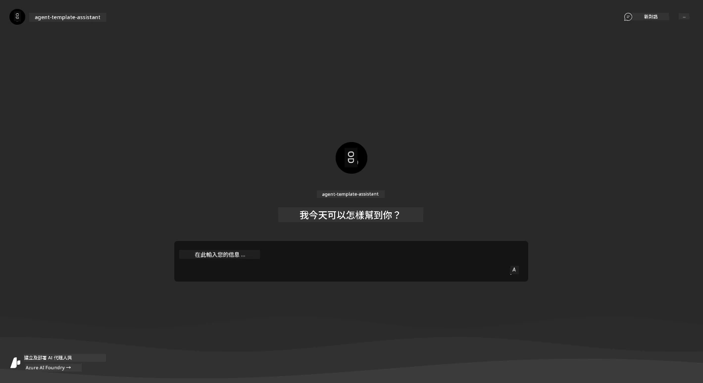

1. 試著提問幾個 [範例問題](https://github.com/Azure-Samples/get-started-with-ai-agents/blob/main/docs/sample_questions.md)

      1. 問：「```法國的首都是哪裡？```」 
      1. 問：「```適合兩人的 200 美元以下最佳帳篷是什麼，包含哪些特色？```」

1. 你應該會獲得類似下圖的回答。_但這是怎麼運作的？_ 

      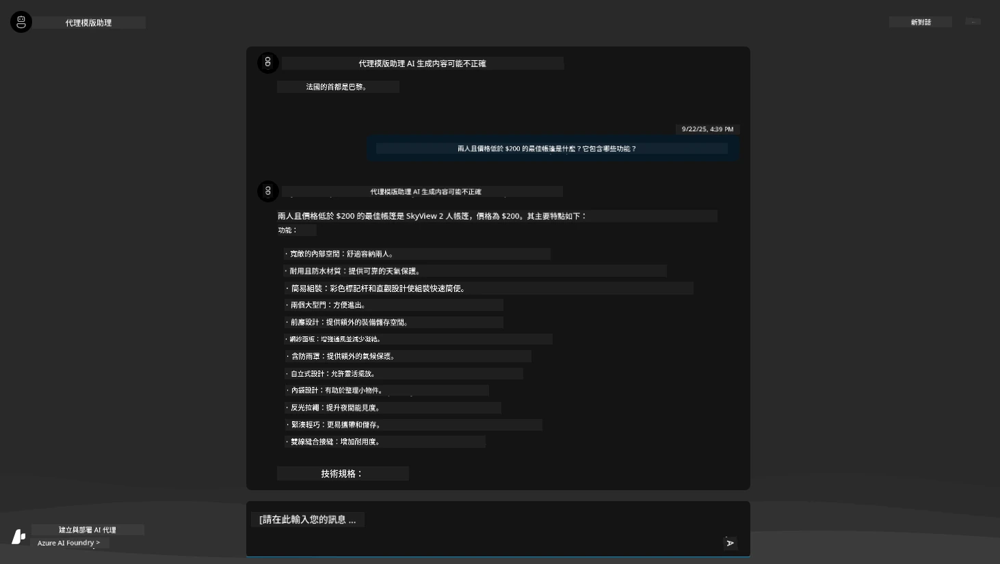

---

## 5. 代理人驗證

Azure Container App 部署了一個端點，連接到為此範本在 Microsoft Foundry 項目中佈建的 AI 代理人。讓我們看看這代表什麼。

1. 回到 Azure 入口網站你的資源群組的 _概覽_ 頁面

1. 點擊該清單中的 `Microsoft Foundry` 資源

1. 你應該會看到此頁。點擊 `前往 Microsoft Foundry 入口網站` 按鈕。
   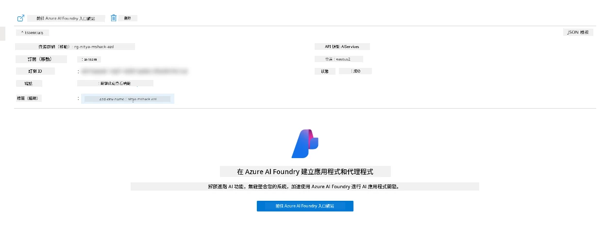

1. 你應該會看到你 AI 應用程式的 Foundry 項目頁面
   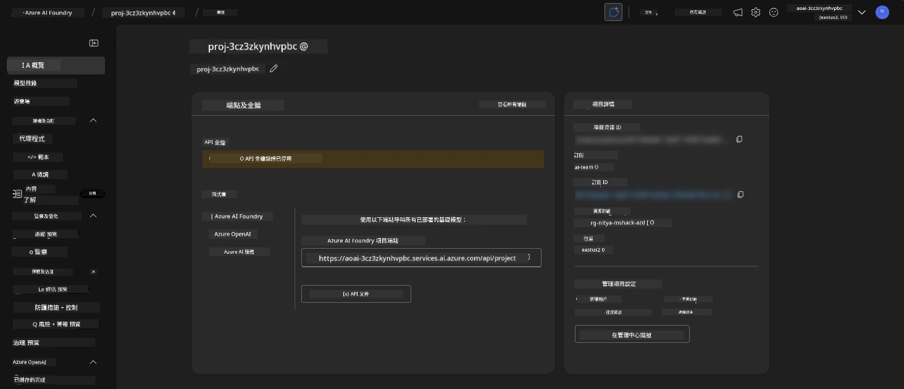

1. 點擊 `Agents` — 你會看到專案中佈建的預設代理人
   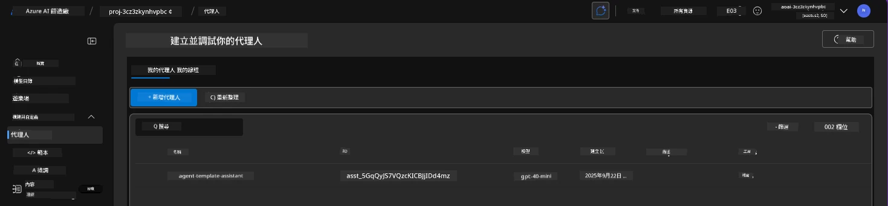

1. 選取它 — 你會看到代理人詳細資訊。注意以下：

      - 該代理人預設使用檔案搜尋（永遠如此）
      - 代理人 `Knowledge` 表示已上傳 32 個檔案（用於檔案搜尋）
      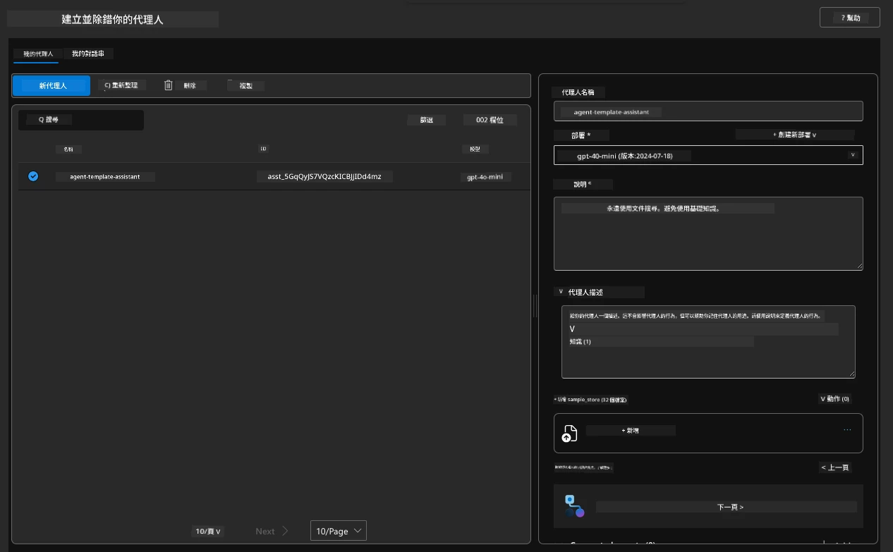

1. 在左側選單找到 `Data+indexes` 項目並點擊查看詳細資訊。

      - 你會看到用於知識的 32 個資料檔案
      - 這些對應 `src/files` 目錄下的 12 個客戶檔案和 20 個產品檔案
      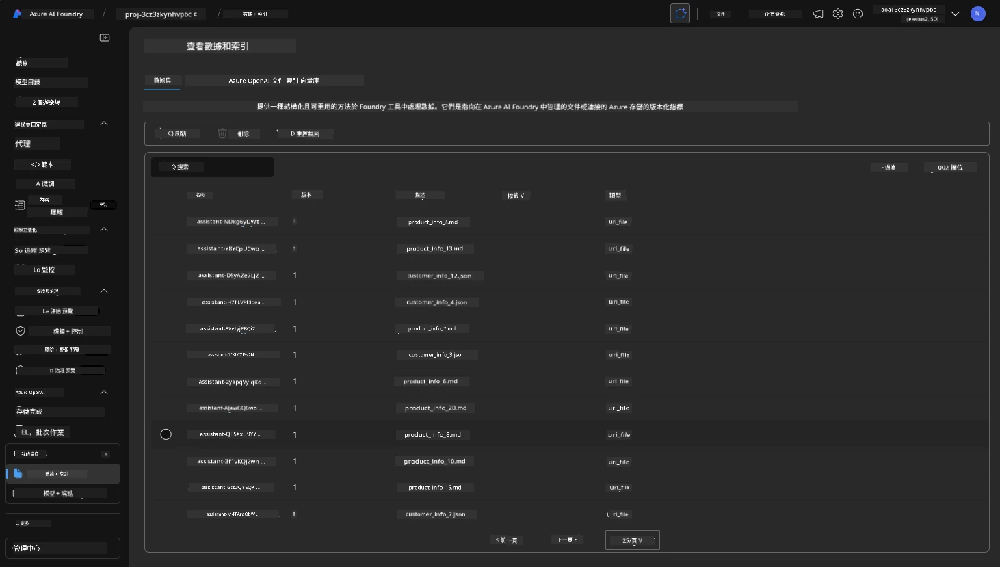

**你已經驗證代理人的運作！**

1. 代理人的回答是基於這些檔案內的知識為基礎。
1. 你現在可以對該資料相關問題發問並獲得有根據的回答。
1. 例如：`customer_info_10.json` 描述「Amanda Perez」的 3 筆購買紀錄。

回到有 Container App 端點的瀏覽器分頁，問：「Amanda Perez 擁有哪些產品？」你應該會看到類似以下的畫面：

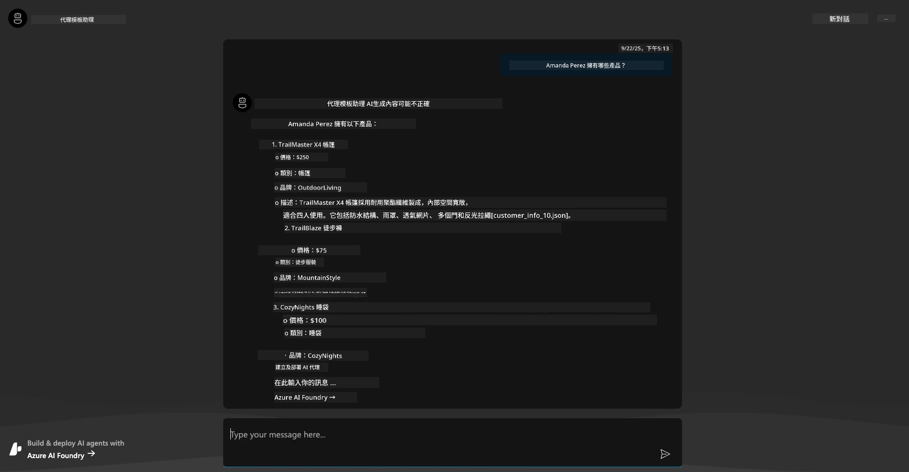

---

## 6. 代理人遊樂場

讓我們藉由在代理人遊樂場中試用代理人，來建立對 Microsoft Foundry 功能的更多直覺。

1. 回到 Microsoft Foundry 的 `Agents` 頁面 — 選取預設代理人
1. 點擊 `在遊樂場中嘗試` 選項 — 你將看到一個如圖的遊樂場介面
1. 再問一次相同問題：「Amanda Perez 擁有哪些產品？」

    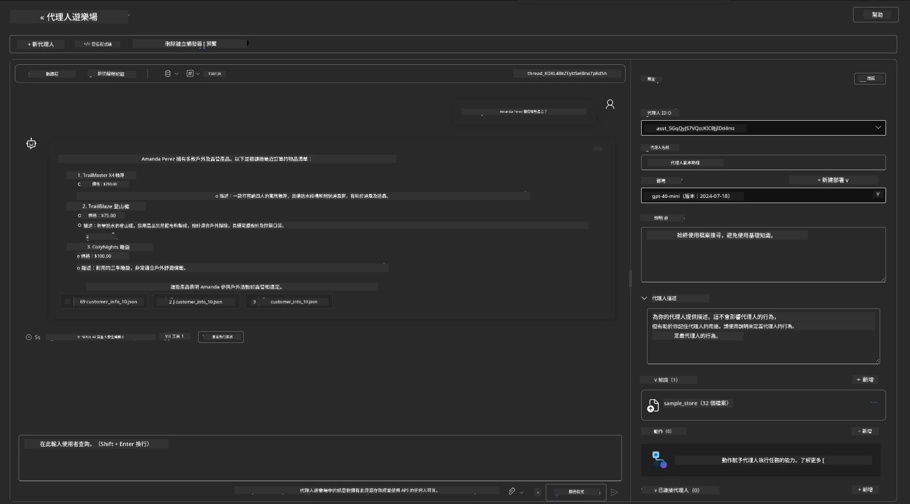

你會得到相同（或相似）回答 — 但你還會獲得附加資訊，協助你理解代理人式應用的品質、成本及效能。例如：

1. 注意回答中引用用以「基礎」該回答的資料檔案
1. 將滑鼠移至任一檔案標籤上 — 資料是否與你的查詢和回答相符？

你也會看到回答下方的 _stats_ 行。

1. 將滑鼠移至任何一個指標 — 例如 Safety，你會看到如下畫面
1. 評定是否符合你對回答安全性的直覺？

      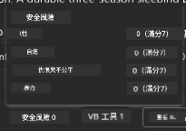

---

## 7. 內建可觀察性

可觀察性是指在你的應用中安裝儀器，以產生可用於理解、除錯和優化操作的資料。為了感受這點：

1. 點擊 `檢視執行資訊` 按鈕 — 你應該會看到此視圖。這是 [代理人追蹤](https://learn.microsoft.com/en-us/azure/ai-foundry/how-to/develop/trace-agents-sdk#view-trace-results-in-the-azure-ai-foundry-agents-playground) 的實例視圖。_你也可以透過點擊頂層選單的 Thread Logs 獲得此視圖_。

   - 瞭解代理人執行的步驟和使用的工具
   - 瞭解總 Token 計數（與輸出 token 使用數）以回應
   - 瞭解延遲以及執行中時間分佈

      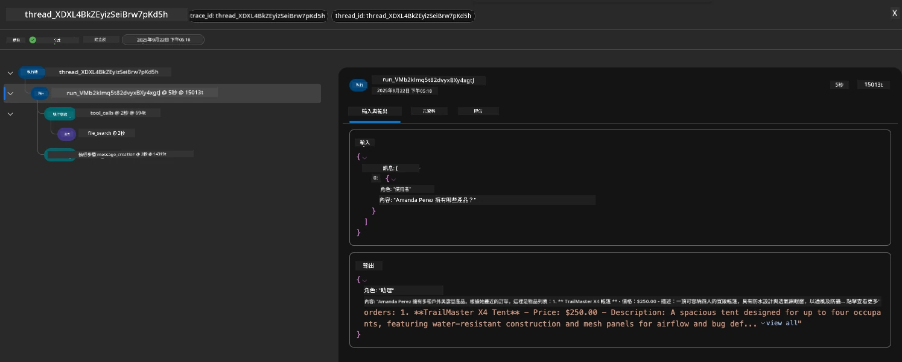

1. 點擊 `Metadata` 索引標籤，檢視執行的其他屬性，可能有助於日後偵錯。

      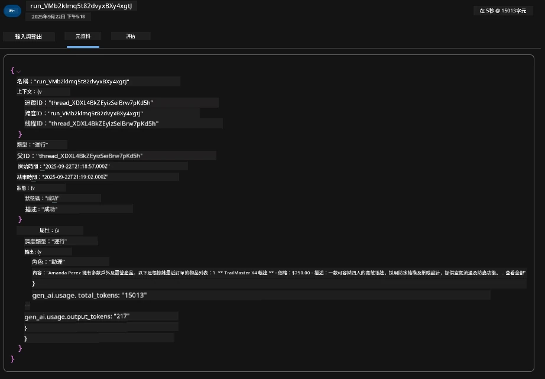


1. 點擊 `Evaluations` 索引標籤，檢視對代理人回答的自動評估。包括安全性評估（如自我傷害）及代理人特定評估（如意圖解析、任務遵循）。

      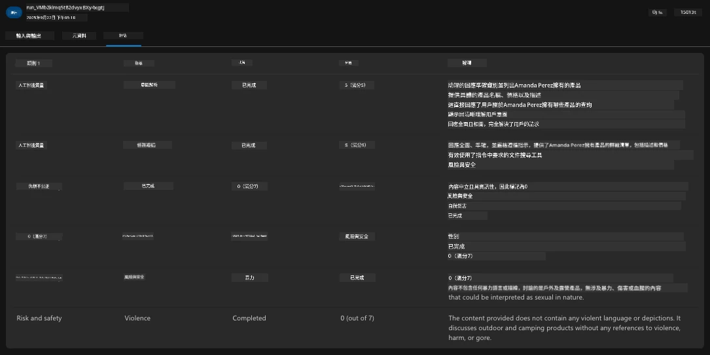

1. 最後，點擊側邊選單的 `Monitoring` 索引標籤。

      - 選擇頁面中的 `Resource usage` 標籤 — 檢視指標。
      - 追蹤應用程式使用量，包括成本（tokens）與負載（請求數）。
      - 追蹤應用程式從接收輸入到輸出最後位元組的延遲。

      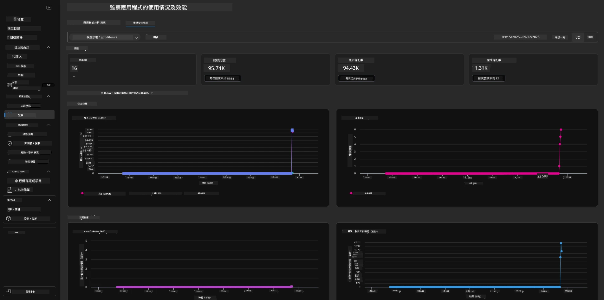

---

## 8. 環境變數

到目前為止，我們使用瀏覽器導覽部署程序，並驗證基礎架構佈建與應用運作。但如果要以 _代碼優先_ 方式工作，需將相關變數設定到本地開發環境，以便配合這些資源。使用 `azd` 很簡單。

1. Azure Developer CLI [使用環境變數](https://learn.microsoft.com/en-us/azure/developer/azure-developer-cli/manage-environment-variables?tabs=bash) 儲存與管理應用程式部署的配置設定。

1. 環境變數儲存在 `.azure/<env-name>/.env`，其作用範圍限定在部署期間所用的 `env-name` 環境，有助於在同一存放庫中隔離多個部署目標的環境。

1. 每當 `azd` 執行特定命令（例如 `azd up`）時，會自動載入環境變數。請注意，`azd` 不會自動讀取 _作業系統層級_ 的環境變數（例如 shell 中設定的），而是使用 `azd set env` 和 `azd get env` 在腳本中轉移資訊。

我們試試幾個命令：

1. 取得此環境中為 `azd` 設定的所有環境變數：

      ```bash title="" linenums="0"
      azd env get-values
      ```
      
      你會看到類似：

      ```bash title="" linenums="0"
      AZURE_AI_AGENT_DEPLOYMENT_NAME="gpt-4o-mini"
      AZURE_AI_AGENT_NAME="agent-template-assistant"
      AZURE_AI_EMBED_DEPLOYMENT_NAME="text-embedding-3-small"
      AZURE_AI_EMBED_DIMENSIONS=100
      ...
      ```

1. 取得特定值 — 例如我想知道是否設置了 `AZURE_AI_AGENT_MODEL_NAME` 的值

      ```bash title="" linenums="0"
      azd env get-value AZURE_AI_AGENT_MODEL_NAME 
      ```
      
      你會看到類似這樣的結果 — 預設未設置此值！

      ```bash title="" linenums="0"
      ERROR: key 'AZURE_AI_AGENT_MODEL_NAME' not found in the environment values
      ```

1. 為 `azd` 設置新環境變數。這裡我們更新代理人模型名稱。_注意：任何更動會立即反映在 `.azure/<env-name>/.env` 檔案中。_

      ```bash title="" linenums="0"
      azd env set AZURE_AI_AGENT_MODEL_NAME gpt-4.1
      azd env set AZURE_AI_AGENT_MODEL_VERSION 2025-04-14
      azd env set AZURE_AI_AGENT_DEPLOYMENT_CAPACITY 150
      ```

      現在，我們應該會找到已設定的值：

      ```bash title="" linenums="0"
      azd env get-value AZURE_AI_AGENT_MODEL_NAME 
      ```

1. 請注意，某些資源是持久化的（例如模型部署），需要不止一次 `azd up` 來強制重新部署。讓我們嘗試先拆除原有部署，然後用更新的環境變數重新部署。

1. **重新整理** 如果你先前已使用 azd 範本部署基礎架構 — 你可以使用此命令基於你 Azure 部署的當前狀態，_重新整理_ 本地環境變數的狀態：

      ```bash title="" linenums="0"
      azd env refresh
      ```

      這是一種強大的方法，可以在兩個或更多本地開發環境（例如，有多位開發人員的團隊）之間同步環境變數 —— 讓已部署的基礎設施成為環境變數狀態的真實依據。團隊成員只需刷新變數即可重新同步。

---

## 9. 恭喜你 🏆

你剛完成了一個端到端的工作流程，其中你：

- [X] 選擇了你想使用的 AZD 模板
- [X] 使用 GitHub Codespaces 啓動了該模板
- [X] 部署了該模板並驗證其可用性

---

<!-- CO-OP TRANSLATOR DISCLAIMER START -->
**免責聲明**：  
本文件使用 AI 翻譯服務 [Co-op Translator](https://github.com/Azure/co-op-translator) 進行翻譯。儘管我們努力確保準確性，但請注意，自動翻譯可能包含錯誤或不準確之處。原始文件以其原文語言版本為權威來源。對於關鍵資訊，建議使用專業人工翻譯。我們不承擔因使用本翻譯而引起的任何誤解或誤釋的責任。
<!-- CO-OP TRANSLATOR DISCLAIMER END -->