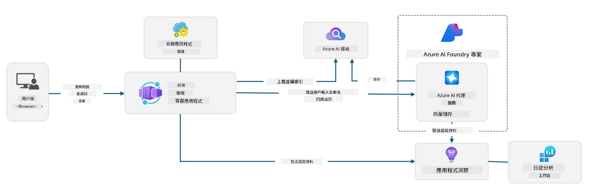

# 3. 拆解範本

!!! tip "在本單元結束時，你將能夠"

    - [ ] 啟用 GitHub Copilot 並使用 MCP 伺服器以取得 Azure 協助
    - [ ] 了解 AZD 範本的資料夾結構與組件
    - [ ] 探索基礎結構即程式碼（Bicep）的組織模式
    - [ ] **實驗 3：** 使用 GitHub Copilot 探索並理解儲存庫架構 

---


有了 AZD 範本和 Azure Developer CLI（`azd`），我們可以透過標準化的儲存庫快速啟動 AI 開發旅程，這些儲存庫提供範例程式碼、基礎設施與設定檔——以一個可立即部署的 _starter_ 專案形式呈現。

**但現在，我們需要了解專案結構與程式碼庫——並能夠自訂 AZD 範本——即使沒有任何先前的 AZD 使用經驗或理解！**

---

## 1. 啟用 GitHub Copilot

### 1.1 安裝 GitHub Copilot Chat

現在是探索 [GitHub Copilot with Agent Mode](https://code.visualstudio.com/docs/copilot/chat/chat-agent-mode) 的時候了。我們可以用自然語言描述高階任務，並獲得執行上的協助。對於此實驗，我們會使用有每月完成次數與聊天互動限制的 [Copilot Free plan](https://github.com/github-copilot/signup)。

此擴充套件可從市集中安裝，且通常在 Codespaces 或開發容器環境中已可用。_從 Copilot 圖示下拉選單點選 `Open Chat` - 然後輸入提示例如 `What can you do?`_ - 你可能需要登入。**GitHub Copilot Chat 已就緒**。

### 1.2. 安裝 MCP 伺服器

為了讓 Agent 模式有效，它需要存取合適的工具來協助檢索知識或執行動作。這就是 MCP 伺服器能派上用場的地方。我們會設定以下伺服器：

1. [Azure MCP Server](../../../../../workshop/docs/instructions)
1. [Microsoft Docs MCP Server](../../../../../workshop/docs/instructions)

要啟用這些：

1. 建立一個名為 `.vscode/mcp.json` 的檔案（如果尚不存在）
1. 將下列內容複製到該檔案中 - 然後啟動伺服器！
   ```json title=".vscode/mcp.json"
   {
      "servers": {
         "Azure MCP Server": {
            "command": "npx",
            "args": [
            "-y",
            "@azure/mcp@latest",
            "server",
            "start"
            ]
         },
         "microsoft.docs.mcp": {
            "type": "http",
            "url": "https://learn.microsoft.com/api/mcp"
         }
      }
   }
   ```

??? warning "你可能會看到 `npx` 未安裝的錯誤（點擊展開修正方式）"

      要修正此問題，請開啟 `.devcontainer/devcontainer.json` 檔案並在 features 區段新增這一行。之後重建容器。你應該會有 `npx` 可用。

      ```title="" linenums="0"
         "features": {
            "ghcr.io/devcontainers/features/node:1": {},
            ...
         },
      ```

---

### 1.3. 測試 GitHub Copilot Chat

**首先使用 `azd auth login` 來從 VS Code 命令列向 Azure 驗證。若你打算直接執行 Azure CLI 指令，也可使用 `az login`。**

你現在應該能查詢你的 Azure 訂閱狀態，並詢問已部署資源或設定的問題。試試這些提示：

1. `List my Azure resource groups`
1. `#foundry list my current deployments`

你也可以詢問關於 Azure 文件的問題，並從 Microsoft Docs MCP 伺服器取得有根據的回應。試試這些提示：

1. `#microsoft_docs_search What is Azure Developer CLI?`
1. `#microsoft_docs_search Show me a Python tutorial to chat with deployed model`

或者你可以要求程式碼片段以完成任務。試試這個提示。

1. `Give me a Python code example that uses AAD for an interactive chat client`

在「Ask」模式中，這會提供可以複製貼上並試用的程式碼。在「Agent」模式中，可能會更進一步為你建立相關資源——包括設定腳本與文件——協助你執行該任務。

<strong>你現在已具備開始探索範本儲存庫的能力</strong>

---

## 2. 拆解架構

??? prompt "ASK: 解釋 docs/images/architecture.png 中的應用程式架構（用 1 段落）"

      此應用程式是一個建立於 Azure 上的 AI 驅動聊天應用，展示了現代的 agent-based 架構。解決方案以一個 Azure Container App 為核心，承載主要應用程式程式碼，負責處理使用者輸入並透過 AI agent 產生智慧回應。
      
      架構以 Microsoft Foundry Project 作為 AI 能力的基底，連接至提供底層語言模型（例如 gpt-4.1-mini）與 agent 功能的 Azure AI 服務。使用者互動從基於 React 的前端流向 FastAPI 後端，後端與 AI agent 服務通訊以產生具情境性的回應。
      
      系統透過檔案搜尋或 Azure AI Search 服務提供知識檢索功能，允許 agent 存取並引用上傳的文件以獲取資訊。為達到營運卓越，架構包含透過 Application Insights 與 Log Analytics Workspace 的完整監控，方便追蹤、記錄與效能優化。
      
      Azure Storage 提供應用資料與檔案上傳的 blob 儲存，而 Managed Identity 確保 Azure 資源之間的安全存取，無需儲存憑證。整個解決方案以可擴充性與可維護性為設計重點，容器化應用可依需求自動擴展，同時透過 Azure 的受管服務生態系提供內建的安全、監控與 CI/CD 能力。



---

## 3. 儲存庫結構

!!! prompt "ASK: 解釋範本資料夾結構。請從視覺層級圖開始。"

??? info "ANSWER: 視覺層級圖示"

      ```bash title="" 
      get-started-with-ai-agents/
      ├── 📋 Configuration & Setup
      │   ├── azure.yaml                    # Azure Developer CLI 設定
      │   ├── docker-compose.yaml           # 本地開發容器
      │   ├── pyproject.toml                # Python 專案設定
      │   ├── requirements-dev.txt          # 開發用相依套件
      │   └── .devcontainer/                # VS Code 開發容器設定
      │
      ├── 🏗️ Infrastructure (infra/)
      │   ├── main.bicep                    # 主要基礎設施範本
      │   ├── api.bicep                     # API 專屬資源
      │   ├── main.parameters.json          # 基礎設施參數
      │   └── core/                         # 模組化基礎設施元件
      │       ├── ai/                       # AI 服務設定
      │       ├── host/                     # 主機託管基礎設施
      │       ├── monitor/                  # 監控與日誌記錄
      │       ├── search/                   # Azure AI Search 設定
      │       ├── security/                 # 安全性與身分識別
      │       └── storage/                  # 儲存體帳戶設定
      │
      ├── 💻 Application Source (src/)
      │   ├── api/                          # 後端 API
      │   │   ├── main.py                   # FastAPI 應用程式進入點
      │   │   ├── routes.py                 # API 路由定義
      │   │   ├── search_index_manager.py   # 搜尋功能
      │   │   ├── data/                     # API 資料處理
      │   │   ├── static/                   # 靜態網頁資產
      │   │   └── templates/                # HTML 範本
      │   ├── frontend/                     # React/TypeScript 前端
      │   │   ├── package.json              # Node.js 相依套件
      │   │   ├── vite.config.ts            # Vite 建置設定
      │   │   └── src/                      # 前端原始碼
      │   ├── data/                         # 範例資料檔案
      │   │   └── embeddings.csv            # 預先計算的 embeddings
      │   ├── files/                        # 知識庫檔案
      │   │   ├── customer_info_*.json      # 客戶資料範例
      │   │   └── product_info_*.md         # 產品文件
      │   ├── Dockerfile                    # 容器設定
      │   └── requirements.txt              # Python 相依套件
      │
      ├── 🔧 Automation & Scripts (scripts/)
      │   ├── postdeploy.sh/.ps1           # 部署後設定
      │   ├── setup_credential.sh/.ps1     # 憑證設定
      │   ├── validate_env_vars.sh/.ps1    # 環境驗證
      │   └── resolve_model_quota.sh/.ps1  # 模型配額管理
      │
      ├── 🧪 Testing & Evaluation
      │   ├── tests/                        # 單元和整合測試
      │   │   └── test_search_index_manager.py
      │   ├── evals/                        # Agent 評估框架
      │   │   ├── evaluate.py               # 評估執行程式
      │   │   ├── eval-queries.json         # 測試查詢
      │   │   └── eval-action-data-path.json
      │   ├── sandbox/                      # 開發沙盒
      │   │   ├── 1-quickstart.py           # 快速上手範例
      │   │   └── aad-interactive-chat.py   # 認證範例
      │   └── airedteaming/                 # AI 安全性評估
      │       └── ai_redteaming.py          # 紅隊測試
      │
      ├── 📚 Documentation (docs/)
      │   ├── deployment.md                 # 部署指南
      │   ├── local_development.md          # 本地設定說明
      │   ├── troubleshooting.md            # 常見問題與修復
      │   ├── azure_account_setup.md        # Azure 前置條件
      │   └── images/                       # 文件資產
      │
      └── 📄 Project Metadata
         ├── README.md                     # 專案概覽
         ├── CODE_OF_CONDUCT.md           # 社群守則
         ├── CONTRIBUTING.md              # 貢獻指南
         ├── LICENSE                      # 授權條款
         └── next-steps.md                # 部署後指引
      ```

### 3.1. 核心應用架構

此範本遵循一個 <strong>全端網頁應用</strong> 模式，包含：

- <strong>後端</strong>：使用與 Azure AI 整合的 Python FastAPI
- <strong>前端</strong>：TypeScript/React，採用 Vite 建置系統
- <strong>基礎設施</strong>：使用 Azure Bicep 範本來管理雲端資源
- <strong>容器化</strong>：使用 Docker 以確保部署一致性

### 3.2 基礎設施即程式碼（bicep）

基礎設施層使用模組化的 **Azure Bicep** 範本組織：

   - **`main.bicep`**：協調所有 Azure 資源
   - **`core/` modules**：不同服務的可重用元件
      - AI 服務（Microsoft Foundry Models、AI Search）
      - 容器託管（Azure Container Apps）
      - 監控（Application Insights、Log Analytics）
      - 安全（Key Vault、Managed Identity）

### 3.3 應用程式原始碼（`src/`）

**後端 API（`src/api/`）**：

- 基於 FastAPI 的 REST API
- Foundry Agents 整合
- 用於知識檢索的搜尋索引管理
- 檔案上傳與處理功能

**前端（`src/frontend/`）**：

- 現代化的 React/TypeScript 單頁應用
- 使用 Vite 以加速開發與最佳化建置
- 用於 agent 互動的聊天介面

**知識庫（`src/files/`）**：

- 範例客戶與產品資料
- 示範以檔案為基礎的知識檢索
- JSON 與 Markdown 格式範例


### 3.4 DevOps 與自動化

**腳本（`scripts/`）**：

- 跨平台的 PowerShell 與 Bash 腳本
- 環境驗證與設定
- 部署後設定
- 模型配額管理

**Azure Developer CLI 整合**：

- 用於 `azd` 工作流程的 `azure.yaml` 配置
- 自動化佈建與部署
- 環境變數管理

### 3.5 測試與品質保證

**評估框架（`evals/`）**：

- Agent 效能評估
- 查詢-回應品質測試
- 自動化評估流程

**AI 安全（`airedteaming/`）**：

- 針對 AI 安全性的紅隊測試
- 安全性弱點掃描
- 負責任的 AI 實務

---

## 4. 恭喜你 🏆

你已成功使用 GitHub Copilot Chat 與 MCP 伺服器來探索該儲存庫。

- [X] 已為 Azure 啟用 GitHub Copilot
- [X] 已了解應用程式架構
- [X] 已探索 AZD 範本結構

這讓你對此範本的 _infrastructure as code_ 資產有了一個概念。接下來，我們會檢視 AZD 的設定檔。

---

<!-- CO-OP TRANSLATOR DISCLAIMER START -->
**Disclaimer**:
本文件已使用 AI 翻譯服務 [Co-op Translator](https://github.com/Azure/co-op-translator) 進行翻譯。雖然我們盡力確保準確性，但請注意自動翻譯可能包含錯誤或不準確之處。原始文件之母語版本應被視為具權威性的來源。對於重要或關鍵資訊，建議採用專業人工翻譯。我們不會就因使用本翻譯而導致的任何誤解或曲解承擔責任。
<!-- CO-OP TRANSLATOR DISCLAIMER END -->