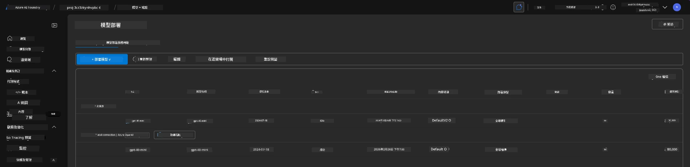
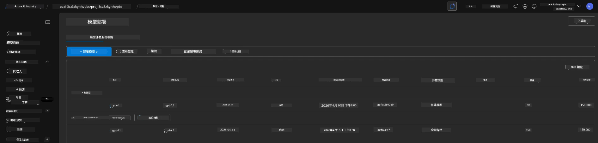

# 6. 拆卸基礎設施

!!! tip "在本模組結束時，您將能夠"

    - [ ] 了解資源清理和成本管理的重要性
    - [ ] 使用 `azd down` 安全地取消基礎設施配置
    - [ ] 必要時恢復軟刪除的認知服務
    - [ ] **實驗 6:** 清理 Azure 資源並驗證移除

---

## 額外練習

在拆卸專案之前，花幾分鐘進行一些開放式探索。

!!! info "嘗試這些探索提示"

    **與 GitHub Copilot 進行實驗：**
    
    1. 詢問：`我還可以嘗試哪些適用於多代理場景的 AZD 範本？`
    2. 詢問：`如何為醫療保健用例自訂代理指令？`
    3. 詢問：`哪些環境變量控制成本優化？`
    
    **探索 Azure 入口網站：**
    
    1. 查看您部署的 Application Insights 指標
    2. 檢查已配置資源的成本分析
    3. 再次探索 Microsoft Foundry 入口網站代理人遊樂場

---

## 取消配置基礎設施

1. 拆卸基礎設施非常簡單：
      
      ```bash title="" linenums="0"
      azd down --purge
      ```
1. `--purge` 旗標確保它同時清除軟刪除的認知服務資源，從而釋放這些資源佔用的配額。完成後您會看到類似這樣的訊息：
      
      ```bash title="" linenums="0"
      ? Total resources to delete: 11, are you sure you want to continue? Yes
      Deleting your resources can take some time.
      (✓) Done: Deleted resource group rg-nitya-mshack-azd
      (✓) Done: Purging Cognitive Account: aoai-3cz3zkynhvpbc

      SUCCESS: Your application was removed from Azure in 11 minutes 4 seconds.
      ```

1.（可選）如果您現在再次執行 `azd up`，會注意到因為環境變數在本地 `.azure` 資料夾中被更改（並儲存），所以會部署 gpt-4.1 模型。

      以下是部署模型的**之前**狀態：

      

      這是**之後**的狀態：
      

---

<!-- CO-OP TRANSLATOR DISCLAIMER START -->
**免責聲明**：
本文件乃使用人工智能翻譯服務 [Co-op Translator](https://github.com/Azure/co-op-translator) 進行翻譯。雖然我們力求準確，但請注意自動翻譯可能包含錯誤或不準確之處。原始文件的母語版本應視為權威來源。對於關鍵資訊，建議尋求專業人工翻譯。我們不對因使用本翻譯而引起的任何誤解或誤釋負責。
<!-- CO-OP TRANSLATOR DISCLAIMER END -->