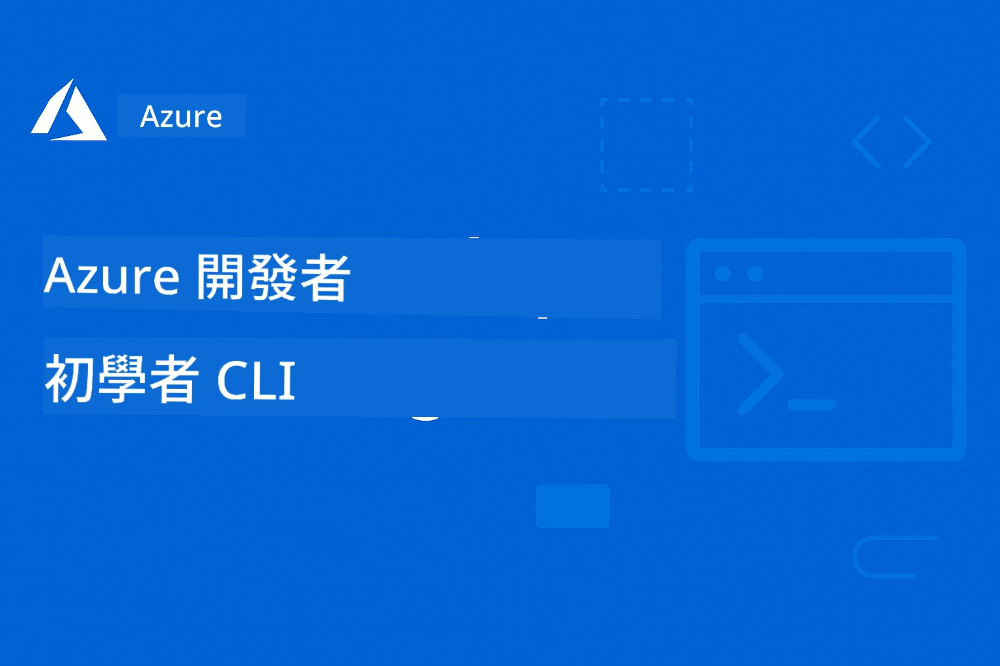

# AZD 初學者指南：有結構的學習之旅

 

[](https://GitHub.com/microsoft/azd-for-beginners/watchers/)
[](https://GitHub.com/microsoft/azd-for-beginners/network/)
[](https://GitHub.com/microsoft/azd-for-beginners/stargazers/)

[](https://discord.gg/microsoft-azure)
[](https://discord.gg/nTYy5BXMWG)

---

### 自動翻譯（隨時更新）

<!-- CO-OP TRANSLATOR LANGUAGES TABLE START -->
[阿拉伯語](../ar/README.md) | [孟加拉語](../bn/README.md) | [保加利亞語](../bg/README.md) | [緬甸語（Myanmar）](../my/README.md) | [中文（簡體）](../zh-CN/README.md) | [中文（繁體，香港）](../zh-HK/README.md) | [中文（繁體，澳門）](./README.md) | [中文（繁體，台灣）](../zh-TW/README.md) | [克羅地亞語](../hr/README.md) | [捷克語](../cs/README.md) | [丹麥語](../da/README.md) | [荷蘭語](../nl/README.md) | [愛沙尼亞語](../et/README.md) | [芬蘭語](../fi/README.md) | [法語](../fr/README.md) | [德語](../de/README.md) | [希臘語](../el/README.md) | [希伯來語](../he/README.md) | [印地語](../hi/README.md) | [匈牙利語](../hu/README.md) | [印尼語](../id/README.md) | [義大利語](../it/README.md) | [日語](../ja/README.md) | [卡納達語](../kn/README.md) | [韓語](../ko/README.md) | [立陶宛語](../lt/README.md) | [馬來語](../ms/README.md) | [馬拉雅拉姆語](../ml/README.md) | [馬拉地語](../mr/README.md) | [尼泊爾語](../ne/README.md) | [奈及利亞皮欽語](../pcm/README.md) | [挪威語](../no/README.md) | [波斯語（Farsi）](../fa/README.md) | [波蘭語](../pl/README.md) | [葡萄牙語（巴西）](../pt-BR/README.md) | [葡萄牙語（葡萄牙）](../pt-PT/README.md) | [旁遮普語（Gurmukhi）](../pa/README.md) | [羅馬尼亞語](../ro/README.md) | [俄語](../ru/README.md) | [塞爾維亞語（西里爾文）](../sr/README.md) | [斯洛伐克語](../sk/README.md) | [斯洛文尼亞語](../sl/README.md) | [西班牙語](../es/README.md) | [史瓦西里語](../sw/README.md) | [瑞典語](../sv/README.md) | [他加祿語（菲律賓語）](../tl/README.md) | [泰米爾語](../ta/README.md) | [泰盧固語](../te/README.md) | [泰語](../th/README.md) | [土耳其語](../tr/README.md) | [烏克蘭語](../uk/README.md) | [烏爾都語](../ur/README.md) | [越南語](../vi/README.md)

> **想在本機複製？**

> 這個儲存庫包含超過 50 種語言的翻譯，會顯著增加下載大小。要在不包含翻譯的情況下複製，請使用稀疏檢出（sparse checkout）：
> ```bash
> git clone --filter=blob:none --sparse https://github.com/microsoft/AZD-for-beginners.git
> cd AZD-for-beginners
> git sparse-checkout set --no-cone '/*' '!translations' '!translated_images'
> ```
> 這會為你提供完成課程所需的一切，並大幅縮短下載時間。
<!-- CO-OP TRANSLATOR LANGUAGES TABLE END -->

## 🚀 什麼是 Azure Developer CLI (azd)？

**Azure Developer CLI (azd)** 是一個以開發者為導向的命令列工具，可以讓部署應用程式到 Azure 變得簡單。你不需要手動建立和連接數十個 Azure 資源，只要用一個指令就能部署完整的應用程式。

### `azd up` 的魔力

```bash
# 這個單一指令完成所有工作：
# ✅ 創建所有 Azure 資源
# ✅ 配置網路和安全性
# ✅ 建構你的應用程式代碼
# ✅ 部署到 Azure
# ✅ 提供你一個可用的網址
azd up
```

**就這樣！** 不用點選 Azure 入口網站、也不用先學複雜的 ARM 模板、也不用手動設定 — 你的應用程式會直接在 Azure 上運行。

---

## ❓ Azure Developer CLI 與 Azure CLI：有什麼差別？

這是初學者最常問的問題。這裡有個簡單的答案：

| Feature | **Azure CLI (`az`)** | **Azure Developer CLI (`azd`)** |
|---------|---------------------|--------------------------------|
| **Purpose** | 管理單一的 Azure 資源 | 部署完整的應用程式 |
| **Mindset** | 以基礎架構為中心 | 以應用程式為中心 |
| **Example** | `az webapp create --name myapp...` | `azd up` |
| **Learning Curve** | 需要了解 Azure 服務 | 只需了解你的應用程式 |
| **Best For** | DevOps、基礎架構管理 | 開發者、快速原型設計 |

### 簡單類比

- **Azure CLI** 就像擁有建房子的所有工具 — 錘子、鋸子、釘子。你可以建任何東西，但你要知道建築工藝。
- **Azure Developer CLI** 就像請了一個承包商 — 你描述你想要的，他們負責建造。

### 何時使用哪一個

| Scenario | Use This |
|----------|----------|
|「我想快速部署我的網站應用程式」 | `azd up` |
|「我只需要建立一個儲存帳戶」 | `az storage account create` |
|「我要建立完整的 AI 應用」 | `azd init --template azure-search-openai-demo` |
|「我要除錯某個特定的 Azure 資源」 | `az resource show` |
|「我想在幾分鐘內進行生產就緒的部署」 | `azd up --environment production` |

### 它們可以一起使用！

AZD 在底層會使用 Azure CLI。你可以兩者並用：
```bash
# 使用 AZD 部署您的應用程式
azd up

# 然後使用 Azure CLI 微調特定資源
az webapp config set --name myapp --always-on true
```

---

## 🌟 在 Awesome AZD 找模板

別從頭開始！**Awesome AZD** 是社群整理的可直接部署模板集合：

| Resource | Description |
|----------|-------------|
| 🔗 [**Awesome AZD 展示館**](https://azure.github.io/awesome-azd/) | 瀏覽 200+ 模板並一鍵部署 |
| 🔗 [**提交模板**](https://github.com/Azure/awesome-azd/issues) | 將你的模板貢獻給社群 |
| 🔗 [**GitHub 倉庫**](https://github.com/Azure/awesome-azd) | 收藏並探索原始碼 |

### Awesome AZD 中熱門的 AI 模板

```bash
# 使用 Azure OpenAI + AI 搜尋的 RAG 聊天
azd init --template azure-search-openai-demo

# 快速 AI 聊天應用程式
azd init --template openai-chat-app-quickstart

# 使用 Foundry Agents 的 AI 代理
azd init --template get-started-with-ai-agents
```

---

## 🎯 用三個步驟開始

### 步驟 1：安裝 AZD（2 分鐘）

**Windows:**
```powershell
winget install microsoft.azd
```

**macOS:**
```bash
brew tap azure/azd && brew install azd
```

**Linux:**
```bash
curl -fsSL https://aka.ms/install-azd.sh | bash
```

### 步驟 2：登入 Azure

```bash
azd auth login
```

### 步驟 3：部署你的第一個應用程式

```bash
# 從範本初始化
azd init --template todo-nodejs-mongo

# 部署到 Azure（建立所有項目！）
azd up
```

**🎉 就這樣！** 你的應用程式現在已在 Azure 上線。

### 清理（別忘了！）

```bash
# Remove all resources when done experimenting
azd down --force --purge
```

---

## 📚 如何使用本課程

本課程以「漸進式學習」設計 — 從你熟悉的起點開始，逐步深入：

| Your Experience | Start Here |
|-----------------|------------|
| **剛接觸 Azure** | [第 1 章：基礎](../..) |
| **懂 Azure、剛接觸 AZD** | [第 1 章：基礎](../..) |
| **想部署 AI 應用** | [第 2 章：以 AI 為先的開發](../..) |
| **想要實作練習** | [🎓 互動工作坊](workshop/README.md) - 3-4 小時的引導實驗 |
| **需要生產模式範式** | [第 8 章：生產與企業模式](../..) |

### 快速設定

1. **Fork 本倉庫**: [](https://GitHub.com/microsoft/azd-for-beginners/fork)
2. **複製到本機**: `git clone https://github.com/YOUR-USERNAME/azd-for-beginners.git`
3. **尋求協助**: [Azure Discord 社群](https://discord.com/invite/ByRwuEEgH4)

> **想在本機複製？**

> 這個儲存庫包含超過 50 種語言的翻譯，會顯著增加下載大小。要在不包含翻譯的情況下複製，請使用稀疏檢出（sparse checkout）：
> ```bash
> git clone --filter=blob:none --sparse https://github.com/microsoft/AZD-for-beginners.git
> cd AZD-for-beginners
> git sparse-checkout set --no-cone '/*' '!translations' '!translated_images'
> ```
> 這會為你提供完成課程所需的一切，並大幅縮短下載時間。


## 課程總覽

透過結構化章節掌握 Azure Developer CLI (azd)，課程設計為漸進式學習。**特別強調使用 Microsoft Foundry 整合來部署 AI 應用程式。**

### 為何本課程對現代開發者至關重要

根據 Microsoft Foundry Discord 社群的見解，**45% 的開發者想要使用 AZD 來處理 AI 工作負載**，但會遇到以下挑戰：
- 複雜的多服務 AI 架構
- AI 生產部署的最佳實務  
- Azure AI 服務的整合與設定
- AI 工作負載的成本優化
- 偵錯 AI 特有的部署問題

### 學習目標

完成本結構化課程後，你將能：
- **掌握 AZD 基礎**：核心概念、安裝與設定
- **部署 AI 應用程式**：使用 AZD 與 Microsoft Foundry 服務
- **實作基礎架構即程式碼（IaC）**：使用 Bicep 模板管理 Azure 資源
- **排除部署問題**：解決常見問題與偵錯
- **為生產環境優化**：安全、擴展、監控與成本管理
- **構建多代理解決方案**：部署複雜的 AI 架構

## 🗺️ 課程地圖：按章節快速導航

每個章節都有專屬 README，包含學習目標、快速入門與練習：

| Chapter | Topic | Lessons | Duration | Complexity |
|---------|-------|---------|----------|------------|
| **[第 1 章：基礎](docs/chapter-01-foundation/README.md)** | 入門 | [AZD 基礎](docs/chapter-01-foundation/azd-basics.md) &#124; [安裝](docs/chapter-01-foundation/installation.md) &#124; [第一個專案](docs/chapter-01-foundation/first-project.md) | 30-45 min | ⭐ |
| **[第 2 章：AI 開發](docs/chapter-02-ai-development/README.md)** | 以 AI 為先的應用 | [Foundry 整合](docs/chapter-02-ai-development/microsoft-foundry-integration.md) &#124; [AI 代理](docs/chapter-02-ai-development/agents.md) &#124; [模型部署](docs/chapter-02-ai-development/ai-model-deployment.md) &#124; [工作坊](docs/chapter-02-ai-development/ai-workshop-lab.md) | 1-2 hrs | ⭐⭐ |
| **[第 3 章：設定](docs/chapter-03-configuration/README.md)** | 認證與安全 | [設定](docs/chapter-03-configuration/configuration.md) &#124; [認證與安全](docs/chapter-03-configuration/authsecurity.md) | 45-60 min | ⭐⭐ |
| **[第 4 章：基礎架構](docs/chapter-04-infrastructure/README.md)** | IaC 與部署 | [部署指南](docs/chapter-04-infrastructure/deployment-guide.md) &#124; [資源佈建](docs/chapter-04-infrastructure/provisioning.md) | 1-1.5 hrs | ⭐⭐⭐ |
| **[第 5 章：多代理](docs/chapter-05-multi-agent/README.md)** | AI 代理解決方案 | [零售範例](examples/retail-scenario.md) &#124; [協調模式](docs/chapter-06-pre-deployment/coordination-patterns.md) | 2-3 小時 | ⭐⭐⭐⭐ |
| **[第 6 章：部署前](docs/chapter-06-pre-deployment/README.md)** | 規劃與驗證 | [部署前檢查](docs/chapter-06-pre-deployment/preflight-checks.md) &#124; [容量規劃](docs/chapter-06-pre-deployment/capacity-planning.md) &#124; [SKU 選擇](docs/chapter-06-pre-deployment/sku-selection.md) &#124; [應用程式洞察](docs/chapter-06-pre-deployment/application-insights.md) | 1 小時 | ⭐⭐ |
| **[第 7 章：故障排除](docs/chapter-07-troubleshooting/README.md)** | 除錯與修復 | [常見問題](docs/chapter-07-troubleshooting/common-issues.md) &#124; [除錯](docs/chapter-07-troubleshooting/debugging.md) &#124; [AI 疑難排解](docs/chapter-07-troubleshooting/ai-troubleshooting.md) | 1-1.5 小時 | ⭐⭐ |
| **[第 8 章：生產](docs/chapter-08-production/README.md)** | 企業模式 | [生產實務](docs/chapter-08-production/production-ai-practices.md) | 2-3 小時 | ⭐⭐⭐⭐ |
| **[🎓 工作坊](workshop/README.md)** | 實作實驗室 | [介紹](workshop/docs/instructions/0-Introduction.md) &#124; [範本選擇](workshop/docs/instructions/1-Select-AI-Template.md) &#124; [驗證](workshop/docs/instructions/2-Validate-AI-Template.md) &#124; [拆解](workshop/docs/instructions/3-Deconstruct-AI-Template.md) &#124; [設定](workshop/docs/instructions/4-Configure-AI-Template.md) &#124; [自訂](workshop/docs/instructions/5-Customize-AI-Template.md) &#124; [還原基礎設施](workshop/docs/instructions/6-Teardown-Infrastructure.md) &#124; [總結](workshop/docs/instructions/7-Wrap-up.md) | 3-4 小時 | ⭐⭐ |

**課程總時長：** ~10-14 小時 | **技能進階：** 入門 → 生產就緒

---

## 📚 學習章節

*根據經驗等級與目標選擇您的學習路徑*

### 🚀 第 1 章：基礎與快速上手
**先決條件**: Azure 訂閱、基本命令列知識  
**時長**: 30-45 分鐘  
**複雜度**: ⭐

#### 您將學到的內容
- 了解 Azure Developer CLI 的基礎
- 在您的平台上安裝 AZD
- 您的第一次成功部署

#### 學習資源
- **🎯 從這裡開始**: [什麼是 Azure Developer CLI？](../..)
- **📖 理論**: [AZD 基礎](docs/chapter-01-foundation/azd-basics.md) - 核心概念與術語
- **⚙️ 設定**: [安裝與設定](docs/chapter-01-foundation/installation.md) - 平台相關指南
- **🛠️ 實作**: [您的第一個專案](docs/chapter-01-foundation/first-project.md) - 逐步教學
- **📋 快速參考**: [指令速查表](resources/cheat-sheet.md)

#### 實作練習
```bash
# 快速安裝檢查
azd version

# 部署您的第一個應用程式
azd init --template todo-nodejs-mongo
azd up
```

**💡 章節成果**: 使用 AZD 成功將一個簡單的網頁應用部署到 Azure

**✅ 成功驗證：**
```bash
# 完成第一章後，您應該能夠：
azd version              # 顯示已安裝的版本
azd init --template todo-nodejs-mongo  # 初始化專案
azd up                  # 部署到 Azure
azd show                # 顯示正在執行的應用程式網址
# 應用程式會在瀏覽器中開啟並正常運作
azd down --force --purge  # 清理資源
```

**📊 時間投入：** 30-45 分鐘  
**📈 完成後技能等級：** 能夠獨立部署基礎應用程式

**✅ 成功驗證：**
```bash
# 完成第一章後，你應該能夠：
azd version              # 顯示已安裝的版本
azd init --template todo-nodejs-mongo  # 初始化專案
azd up                  # 部署到 Azure
azd show                # 顯示執行中應用程式的 URL
# 應用程式在瀏覽器中開啟並正常運作
azd down --force --purge  # 清理資源
```

**📊 時間投入：** 30-45 分鐘  
**📈 完成後技能等級：** 能夠獨立部署基礎應用程式

---

### 🤖 第 2 章：以 AI 為先的開發（建議給 AI 開發者）
**先決條件**: 完成第 1 章  
**時長**: 1-2 小時  
**複雜度**: ⭐⭐

#### 您將學到的內容
- Microsoft Foundry 與 AZD 的整合
- 部署具 AI 能力的應用
- 了解 AI 服務設定

#### 學習資源
- **🎯 從這裡開始**: [Microsoft Foundry Integration](docs/chapter-02-ai-development/microsoft-foundry-integration.md)
- **🤖 AI 代理**: [AI Agents Guide](docs/chapter-02-ai-development/agents.md) - 使用 AZD 部署智慧代理
- **📖 模式**: [AI 模型部署](docs/chapter-02-ai-development/ai-model-deployment.md) - 部署與管理 AI 模型
- **🛠️ 工作坊**: [AI 工作坊實驗室](docs/chapter-02-ai-development/ai-workshop-lab.md) - 讓您的 AI 解決方案符合 AZD
- **🎥 互動式指南**: [Workshop Materials](workshop/README.md) - 以瀏覽器為基礎的學習，搭配 MkDocs * DevContainer 環境
- **📋 範本**: [Microsoft Foundry Templates](../..)
- **📝 範例**: [AZD 部署範例](examples/README.md)

#### 實作練習
```bash
# 部署您的第一個 AI 應用程式
azd init --template azure-search-openai-demo
azd up

# 試用其他 AI 範本
azd init --template openai-chat-app-quickstart
azd init --template agent-openai-python-prompty
```

**💡 章節成果**: 部署並設定具有 RAG 功能的 AI 聊天應用

**✅ 成功驗證：**
```bash
# 完成第二章後，你應該能夠：
azd init --template azure-search-openai-demo
azd up
# 測試 AI 聊天介面
# 提出問題並取得附有來源的 AI 回應
# 驗證搜尋整合是否運作
azd monitor  # 檢查 Application Insights 是否顯示遙測資料
azd down --force --purge
```

**📊 時間投入：** 1-2 小時  
**📈 完成後技能等級：** 能夠部署並設定可投入生產的 AI 應用  
**💰 成本意識：** 了解開發環境約 $80-150/月，生產環境約 $300-3500/月

#### 💰 AI 部署的成本考量

**開發環境（估計 $80-150/月）：**
- Azure OpenAI（依使用付費）：$0-50/月（依 token 使用量）
- AI Search（基本層）：$75/月
- Container Apps（Consumption）：$0-20/月
- 儲存（標準）：$1-5/月

**生產環境（估計 $300-3,500+/月）：**
- Azure OpenAI（PTU 以穩定效能）：$3,000+/月 或 高用量時採依使用付費
- AI Search（標準層）：$250/月
- Container Apps（專用）：$50-100/月
- Application Insights：$5-50/月
- 儲存（高階）：$10-50/月

**💡 成本最佳化建議：**
- 學習時使用 **免費層** Azure OpenAI（包含每月 50,000 tokens）
- 在不開發時執行 `azd down` 以取消配置資源
- 以消耗付費模式開始，僅在生產環境時升級至 PTU
- 使用 `azd provision --preview` 在部署前估算成本
- 啟用自動擴充：只為實際使用付費

**成本監控：**
```bash
# 檢查估計的每月費用
azd provision --preview

# 在 Azure 入口網站監控實際費用
az consumption budget list --resource-group <your-rg>
```

---

### ⚙️ 第 3 章：設定與驗證
**先決條件**: 完成第 1 章  
**時長**: 45-60 分鐘  
**複雜度**: ⭐⭐

#### 您將學到的內容
- 環境設定與管理
- 驗證與安全最佳實務
- 資源命名與組織方式

#### 學習資源
- **📖 設定**: [Configuration Guide](docs/chapter-03-configuration/configuration.md) - 環境設定
- **🔐 安全**: [Authentication patterns and managed identity](docs/chapter-03-configuration/authsecurity.md) - 驗證模式
- **📝 範例**: [Database App Example](examples/database-app/README.md) - AZD 資料庫範例

#### 實作練習
- 設定多個環境（dev、staging、prod）
- 建立受管理身分驗證
- 實作環境特定設定

**💡 章節成果**: 以適當驗證與安全機制管理多個環境

---

### 🏗️ 第 4 章：基礎建設即程式碼與部署
**先決條件**: 完成第 1-3 章  
**時長**: 1-1.5 小時  
**複雜度**: ⭐⭐⭐

#### 您將學到的內容
- 進階部署模式
- 使用 Bicep 的基礎建設即程式碼
- 資源佈建策略

#### 學習資源
- **📖 部署**: [Deployment Guide](docs/chapter-04-infrastructure/deployment-guide.md) - 完整工作流程
- **🏗️ 佈建**: [Provisioning Resources](docs/chapter-04-infrastructure/provisioning.md) - Azure 資源管理
- **📝 範例**: [Container App Example](../../examples/container-app) - 容器化部署範例

#### 實作練習
- 建立自訂 Bicep 範本
- 部署多服務應用
- 實作藍綠部署策略

**💡 章節成果**: 使用自訂基礎建設範本部署複雜的多服務應用

---

### 🎯 第 5 章：多代理 AI 解決方案（進階）
**先決條件**: 完成第 1-2 章  
**時長**: 2-3 小時  
**複雜度**: ⭐⭐⭐⭐

#### 您將學到的內容
- 多代理架構模式
- 代理編排與協調
- 可投入生產的 AI 部署

#### 學習資源
- **🤖 精選專案**: [Retail Multi-Agent Solution](examples/retail-scenario.md) - 完整實作
- **🛠️ ARM 範本**: [ARM Template Package](../../examples/retail-multiagent-arm-template) - 一鍵部署
- **📖 架構**: [Multi-agent coordination patterns](docs/chapter-06-pre-deployment/coordination-patterns.md) - 協調模式

#### 實作練習
```bash
# 部署完整的零售多代理解決方案
cd examples/retail-multiagent-arm-template
./deploy.sh

# 探索代理設定
az deployment group show --resource-group <rg-name> --name <deployment-name>
```

**💡 章節成果**: 部署並管理具備客戶與庫存代理的可投入生產多代理 AI 解決方案

---

### 🔍 第 6 章：部署前驗證與規劃
**先決條件**: 完成第 4 章  
**時長**: 1 小時  
**複雜度**: ⭐⭐

#### 您將學到的內容
- 容量規劃與資源驗證
- SKU 選擇策略
- 部署前檢查與自動化

#### 學習資源
- **📊 規劃**: [Capacity Planning](docs/chapter-06-pre-deployment/capacity-planning.md) - 資源驗證
- **💰 選擇**: [SKU Selection](docs/chapter-06-pre-deployment/sku-selection.md) - 成本效益選擇
- **✅ 驗證**: [Pre-flight Checks](docs/chapter-06-pre-deployment/preflight-checks.md) - 自動化腳本

#### 實作練習
- 執行容量驗證腳本
- 優化成本考量下的 SKU 選擇
- 實作自動化的部署前檢查

**💡 章節成果**: 在執行前驗證並優化部署

---

### 🚨 第 7 章：故障排除與除錯
**先決條件**: 任何部署章節已完成  
**時長**: 1-1.5 小時  
**複雜度**: ⭐⭐

#### 您將學到的內容
- 系統化的除錯方法
- 常見問題與解決方案
- AI 專用疑難排解

#### 學習資源
- **🔧 常見問題**: [Common Issues](docs/chapter-07-troubleshooting/common-issues.md) - 常見問答與解決方案
- **🕵️ 除錯**: [Debugging Guide](docs/chapter-07-troubleshooting/debugging.md) - 逐步策略
- **🤖 AI 問題**: [AI-Specific Troubleshooting](docs/chapter-07-troubleshooting/ai-troubleshooting.md) - AI 服務問題

#### 實作練習
- 診斷部署失敗
- 解決驗證相關問題
- 除錯 AI 服務連線

**💡 章節成果**: 能夠獨立診斷並解決常見的部署問題

---

### 🏢 第 8 章：生產與企業模式
**先決條件**: 完成第 1-4 章  
**時長**: 2-3 小時  
**複雜度**: ⭐⭐⭐⭐

#### 您將學到的內容
- 生產部署策略
- 企業安全模式
- 監控與成本最佳化

#### 學習資源
- **🏭 生產**: [Production AI Best Practices](docs/chapter-08-production/production-ai-practices.md) - 企業模式
- **📝 範例**: [Microservices Example](../../examples/microservices) - 複雜架構範例
- **📊 監控**: [Application Insights integration](docs/chapter-06-pre-deployment/application-insights.md) - 監控

#### 實作練習
- 實作企業安全模式
- 設定完整監控
- 在具備適當治理下部署到生產環境

**💡 章節成果**: 部署具備完整生產能力的企業級應用

---

## 🎓 工作坊概覽：實作學習體驗

> **⚠️ 工作坊狀態：正在開發中**  
> 工作坊教材目前正在開發與精修中。核心模組可運作，但部分進階單元尚未完成。我們正積極完成所有內容。[追蹤進度 →](workshop/README.md)

### 互動式工作坊教材
**使用瀏覽器工具與引導練習的完整實作學習體驗**
我們的工作坊教材提供結構化、互動式的學習體驗，補充上方以章節為基礎的課程。工作坊適合自學或講師主導的教學。

#### 🛠️ 工作坊功能
- **以瀏覽器為基礎的介面**: Complete MkDocs-powered workshop with search, copy, and theme features
- **整合 GitHub Codespaces**: One-click development environment setup
- **結構化學習路徑**: 8-module guided exercises (3-4 hours total)
- **漸進式方法**: Introduction → Selection → Validation → Deconstruction → Configuration → Customization → Teardown → Wrap-up
- **互動式 DevContainer 環境**: Pre-configured tools and dependencies

#### 📚 工作坊模組結構
工作坊遵循一個 **8 模組的漸進式方法**，帶你從探索到部署精通：

| 模組 | 主題 | 你將會做什麼 | 時間 |
|--------|-------|----------------|----------|
| **0. 介紹** | 工作坊概覽 | 了解學習目標、先決條件與工作坊結構 | 15 min |
| **1. 選擇** | 範本探索 | 探索 AZD 範本並為你的情境選擇合適的 AI 範本 | 20 min |
| **2. 驗證** | 部署與驗證 | 使用 `azd up` 部署範本並驗證基礎架構是否運作 | 30 min |
| **3. 解構** | 了解結構 | 使用 GitHub Copilot 探索範本架構、Bicep 檔案與程式碼組織 | 30 min |
| **4. 設定** | azure.yaml 深入解析 | 精通 `azure.yaml` 設定、生命週期掛鉤與環境變數 | 30 min |
| **5. 客製化** | 量身打造 | 啟用 AI Search、追蹤、評估，並為你的情境進行客製化 | 45 min |
| **6. 清理** | 清除資源 | 使用 `azd down --purge` 安全移除資源 | 15 min |
| **7. 總結** | 後續步驟 | 回顧成果、關鍵概念，並延續你的學習旅程 | 15 min |

**工作坊流程：**
```
Introduction → Selection → Validation → Deconstruction → Configuration → Customization → Teardown → Wrap-up
     ↓            ↓           ↓              ↓               ↓              ↓            ↓           ↓
  Overview    Find the     Deploy &      Explore        Master         Customize     Clean up    Review &
             right        verify        code &        azure.yaml      for your      resources   next steps
             template                   structure                     scenario
```

#### 🚀 開始工作坊
```bash
# 選項 1：GitHub Codespaces（建議）
# 在儲存庫中點選「Code」→「Create codespace on main」

# 選項 2：本地開發
git clone https://github.com/microsoft/azd-for-beginners.git
cd azd-for-beginners/workshop
# 請依照 workshop/README.md 中的設定說明
```

#### 🎯 工作坊學習成果
完成工作坊後，參與者將會：
- **部署生產等級的 AI 應用**: Use AZD with Microsoft Foundry services
- **精通多代理架構**: Implement coordinated AI agent solutions
- **實施安全最佳實務**: Configure authentication and access control
- **為擴展進行優化**: Design cost-effective, performant deployments
- **排解部署問題**: Resolve common issues independently

#### 📖 工作坊資源
- **🎥 互動式指南**: [研討會教材](workshop/README.md) - Browser-based learning environment
- **📋 模組逐步指引**:
  - [0. 介紹](workshop/docs/instructions/0-Introduction.md) - 工作坊概覽與目標
  - [1. 選擇](workshop/docs/instructions/1-Select-AI-Template.md) - 尋找並選擇 AI 範本
  - [2. 驗證](workshop/docs/instructions/2-Validate-AI-Template.md) - 部署並驗證範本
  - [3. 解構](workshop/docs/instructions/3-Deconstruct-AI-Template.md) - 探索範本架構
  - [4. 設定](workshop/docs/instructions/4-Configure-AI-Template.md) - 精通 azure.yaml
  - [5. 客製化](workshop/docs/instructions/5-Customize-AI-Template.md) - 為你的情境進行客製化
  - [6. 清理](workshop/docs/instructions/6-Teardown-Infrastructure.md) - 清理資源
  - [7. 總結](workshop/docs/instructions/7-Wrap-up.md) - 回顧與後續步驟
- **🛠️ AI 工作坊實驗室**: [AI 工作坊實驗室](docs/chapter-02-ai-development/ai-workshop-lab.md) - AI-focused exercises
- **💡 快速入門**: [工作坊設定指南](workshop/README.md#quick-start) - 環境配置

**適合對象**: 企業訓練、大學課程、自主學習與開發者實戰營。

---

## 📖 深入探討：AZD 能力

超越基礎，AZD 為生產部署提供強大的功能：

- **基於範本的部署** - Use pre-built templates for common application patterns
- **基礎設施即程式碼** - Manage Azure resources using Bicep or Terraform  
- **整合化工作流程** - Seamlessly provision, deploy, and monitor applications
- **開發者友好** - Optimized for developer productivity and experience

### **AZD 與 Microsoft Foundry：AI 部署的完美組合**

**為何選擇 AZD 作為 AI 解決方案？** AZD 解決 AI 開發者面臨的主要挑戰：

- **AI 準備好的範本** - Pre-configured templates for Azure OpenAI, Cognitive Services, and ML workloads
- **安全的 AI 部署** - Built-in security patterns for AI services, API keys, and model endpoints  
- **生產級 AI 模式** - Best practices for scalable, cost-effective AI application deployments
- **端到端 AI 工作流程** - From model development to production deployment with proper monitoring
- **成本優化** - Smart resource allocation and scaling strategies for AI workloads
- **整合 Microsoft Foundry** - Seamless connection to Microsoft Foundry model catalog and endpoints

---

## 🎯 範本與範例庫

### 精選：Microsoft Foundry 範本
**如果你要部署 AI 應用，請從這裡開始！**

> **注意：** 這些範本示範了各種 AI 模式。有些來自外部的 Azure Samples，其他則為本地實作。

| 範本 | 章節 | 複雜度 | 服務 | 類型 |
|----------|---------|------------|----------|------|
| [**Get started with AI chat**](https://github.com/Azure-Samples/get-started-with-ai-chat) | 第 2 章 | ⭐⭐ | AzureOpenAI + Azure AI Model Inference API + Azure AI Search + Azure Container Apps + Application Insights | 外部 |
| [**Get started with AI agents**](https://github.com/Azure-Samples/get-started-with-ai-agents) | 第 2 章 | ⭐⭐ | Foundry Agents + AzureOpenAI + Azure AI Search + Azure Container Apps + Application Insights| 外部 |
| [**Azure Search + OpenAI Demo**](https://github.com/Azure-Samples/azure-search-openai-demo) | 第 2 章 | ⭐⭐ | AzureOpenAI + Azure AI Search + App Service + Storage | 外部 |
| [**OpenAI Chat App Quickstart**](https://github.com/Azure-Samples/openai-chat-app-quickstart) | 第 2 章 | ⭐ | AzureOpenAI + Container Apps + Application Insights | 外部 |
| [**Agent OpenAI Python Prompty**](https://github.com/Azure-Samples/agent-openai-python-prompty) | 第 5 章 | ⭐⭐⭐ | AzureOpenAI + Azure Functions + Prompty | 外部 |
| [**Contoso Chat RAG**](https://github.com/Azure-Samples/contoso-chat) | 第 8 章 | ⭐⭐⭐⭐ | AzureOpenAI + AI Search + Cosmos DB + Container Apps | 外部 |
| [**Retail Multi-Agent Solution**](examples/retail-scenario.md) | 第 5 章 | ⭐⭐⭐⭐ | AzureOpenAI + AI Search + Storage + Container Apps + Cosmos DB | **本地** |

### 精選：完整學習場景
**對應學習章節的生產就緒應用範本**

| 範本 | 對應學習章節 | 複雜度 | 主要學習要點 |
|----------|------------------|------------|--------------|
| [**openai-chat-app-quickstart**](https://github.com/Azure-Samples/openai-chat-app-quickstart) | 第 2 章 | ⭐ | Basic AI deployment patterns |
| [**azure-search-openai-demo**](https://github.com/Azure-Samples/azure-search-openai-demo) | 第 2 章 | ⭐⭐ | RAG implementation with Azure AI Search |
| [**ai-document-processing**](https://github.com/Azure-Samples/ai-document-processing) | 第 4 章 | ⭐⭐ | Document Intelligence integration |
| [**agent-openai-python-prompty**](https://github.com/Azure-Samples/agent-openai-python-prompty) | 第 5 章 | ⭐⭐⭐ | Agent framework and function calling |
| [**contoso-chat**](https://github.com/Azure-Samples/contoso-chat) | 第 8 章 | ⭐⭐⭐ | Enterprise AI orchestration |
| [**retail-multi-agent-solution**](examples/retail-scenario.md) | 第 5 章 | ⭐⭐⭐⭐ | Multi-agent architecture with Customer and Inventory agents |

### 以範例類型學習

> **📌 本地與外部範例：**  
> **本地範例** (在此儲存庫中) = 可立即使用  
> **外部範例** (Azure Samples) = 從連結的儲存庫 clone

#### 本地範例（可立即使用）
- [**零售多代理解決方案**](examples/retail-scenario.md) - 完整的生產就緒實作，包含 ARM 範本
  - 多代理架構（Customer + Inventory agents）
  - 全面的監控與評估
  - 透過 ARM 範本一鍵部署

#### 本地範例 - 容器應用（第 2-5 章）
**本儲存庫中的完整容器部署範例：**
- [**容器應用範例**](examples/container-app/README.md) - Complete guide to containerized deployments
  - [簡易 Flask API](../../examples/container-app/simple-flask-api) - Basic REST API with scale-to-zero
  - [微服務架構](../../examples/container-app/microservices) - Production-ready multi-service deployment
  - Quick Start, Production, and Advanced deployment patterns
  - Monitoring, security, and cost optimization guidance

#### 外部範例 - 簡單應用（第 1-2 章）
**複製這些 Azure Samples 儲存庫以開始：**
- [Simple Web App - Node.js + MongoDB](https://github.com/Azure-Samples/todo-nodejs-mongo) - Basic deployment patterns
- [Static Website - React SPA](https://github.com/Azure-Samples/todo-csharp-sql-swa-func) - Static content deployment
- [Container App - Python Flask](https://github.com/Azure-Samples/container-apps-store-api-microservice) - REST API deployment

#### 外部範例 - 資料庫整合（第 3-4 章）  
- [Database App - C# + SQL](https://github.com/Azure-Samples/todo-csharp-sql) - Database connectivity patterns
- [Functions + Cosmos DB](https://github.com/Azure-Samples/todo-python-mongo-swa-func) - Serverless data workflow

#### 外部範例 - 進階模式（第 4-8 章）
- [Java Microservices](https://github.com/Azure-Samples/java-microservices-aca-lab) - Multi-service architectures
- [Container Apps Jobs](https://github.com/Azure-Samples/container-apps-jobs) - Background processing  
- [Enterprise ML Pipeline](https://github.com/Azure-Samples/mlops-v2) - Production-ready ML patterns

### 外部範本集合
- [**Official AZD Template Gallery**](https://azure.github.io/awesome-azd/) - Curated collection of official and community templates
- [**Azure Developer CLI Templates**](https://learn.microsoft.com/en-us/azure/developer/azure-developer-cli/azd-templates) - Microsoft Learn template documentation
- [**Examples Directory**](examples/README.md) - Local learning examples with detailed explanations

---

## 📚 學習資源與參考

### 快速參考
- [**指令速查表**](resources/cheat-sheet.md) - Essential azd commands organized by chapter
- [**術語表**](resources/glossary.md) - Azure and azd terminology  
- [**常見問題**](resources/faq.md) - Common questions organized by learning chapter
- [**學習指南**](resources/study-guide.md) - Comprehensive practice exercises

### 實作工作坊
- [**AI 工作坊實驗室**](docs/chapter-02-ai-development/ai-workshop-lab.md) - Make your AI solutions AZD-deployable (2-3 hours)
- [**互動式工作坊**](workshop/README.md) - 8-module guided exercises with MkDocs and GitHub Codespaces
  - 流程：介紹 → 選擇 → 驗證 → 解構 → 設定 → 客製化 → 清理 → 總結

### 外部學習資源
- [Azure Developer CLI 文件](https://learn.microsoft.com/en-us/azure/developer/azure-developer-cli/)
- [Azure 架構中心](https://learn.microsoft.com/en-us/azure/architecture/)
- [Azure 價格計算機](https://azure.microsoft.com/pricing/calculator/)
- [Azure 狀態](https://status.azure.com/)

---

## 🔧 快速疑難排解指南

**初學者常遇到的問題與即時解決方法：**

<details>
<summary><strong>❌ "azd: 指令未找到"</strong></summary>

```bash
# 先安裝 AZD
# Windows（PowerShell）：
winget install microsoft.azd

# macOS：
brew tap azure/azd && brew install azd

# Linux：
curl -fsSL https://aka.ms/install-azd.sh | bash

# 驗證安裝
azd version
```
</details>

<details>
<summary><strong>❌ "找不到訂閱" 或 "未設定訂閱"</strong></summary>

```bash
# 列出可用的訂閱
az account list --output table

# 設定預設訂閱
az account set --subscription "<subscription-id-or-name>"

# 為 AZD 環境設定
azd env set AZURE_SUBSCRIPTION_ID "<subscription-id>"

# 驗證
az account show
```
</details>

<details>
<summary><strong>❌ "InsufficientQuota" 或 "配額已超出"</strong></summary>

```bash
# 嘗試不同的 Azure 區域
azd env set AZURE_LOCATION "westus2"
azd up

# 或在開發環境使用較小的 SKU
# 編輯 infra/main.parameters.json:
{
  "sku": "B1"  // Instead of "P1V2"
}
```
</details>

<details>
<summary><strong>❌ "azd up" 在執行途中失敗</strong></summary>
```bash
# 選項 1：清理並重試
azd down --force --purge
azd up

# 選項 2：只修復基礎設施
azd provision

# 選項 3：檢查詳細狀態
azd show

# 選項 4：在 Azure Monitor 檢查日誌
azd monitor --logs
```
</details>

<details>
<summary><strong>❌ 「驗證失敗」或「令牌已過期」</strong></summary>

```bash
# 重新驗證
az logout
az login

azd auth logout
azd auth login

# 驗證身份
az account show
```
</details>

<details>
<summary><strong>❌ 「資源已存在」或命名衝突</strong></summary>

```bash
# AZD 會產生唯一名稱，但若發生衝突：
azd down --force --purge

# 然後以全新環境重試
azd env new dev-v2
azd up
```
</details>

<details>
<summary><strong>❌ 範本部署耗時過長</strong></summary>

**Normal wait times:**
- 簡單 web app: 5-10 minutes
- 含資料庫的應用程式: 10-15 minutes
- AI applications: 15-25 minutes (OpenAI 佈建較慢)

```bash
# 檢查進度
azd show

# 如果卡住超過30分鐘，請檢查 Azure 入口網站：
azd monitor
# 尋找失敗的部署
```
</details>

<details>
<summary><strong>❌ 「權限被拒」或「禁止存取」</strong></summary>

```bash
# 檢查您的 Azure 角色
az role assignment list --assignee $(az account show --query user.name -o tsv)

# 您至少需要「參與者 (Contributor)」角色
# 請向您的 Azure 管理員要求授予:
# - 參與者（用於資源）
# - 使用者存取管理員（用於角色指派）
```
</details>

<details>
<summary><strong>❌ 找不到已部署的應用程式 URL</strong></summary>

```bash
# 顯示所有服務端點
azd show

# 或開啟 Azure 入口網站
azd monitor

# 檢查特定服務
azd env get-values
# 尋找 *_URL 變數
```
</details>

### 📚 完整疑難排解資源

- **Common Issues Guide:** [詳細解決方案](docs/chapter-07-troubleshooting/common-issues.md)
- **AI-Specific Issues:** [AI 疑難排解](docs/chapter-07-troubleshooting/ai-troubleshooting.md)
- **Debugging Guide:** [逐步除錯](docs/chapter-07-troubleshooting/debugging.md)
- **Get Help:** [Azure Discord](https://discord.gg/microsoft-azure) #azure-developer-cli

---

## 🎓 課程完成與認證

### Progress Tracking
追蹤你在各章節的學習進度：

- [ ] **第 1 章**: Foundation & Quick Start ✅
- [ ] **第 2 章**: AI-First Development ✅  
- [ ] **第 3 章**: Configuration & Authentication ✅
- [ ] **第 4 章**: Infrastructure as Code & Deployment ✅
- [ ] **第 5 章**: Multi-Agent AI Solutions ✅
- [ ] **第 6 章**: Pre-Deployment Validation & Planning ✅
- [ ] **第 7 章**: Troubleshooting & Debugging ✅
- [ ] **第 8 章**: Production & Enterprise Patterns ✅

### 學習驗證
完成每章後，透過以下方式驗證你的知識：
1. **Practical Exercise**: 完成本章的動手部署
2. **Knowledge Check**: 檢視本章的常見問答
3. **Community Discussion**: 在 Azure Discord 分享你的經驗
4. **Next Chapter**: 前往下一個複雜度等級

### 課程完成福利
完成所有章節後，你將獲得：
- **實務經驗**: 將實際 AI 應用部署到 Azure
- **專業技能**: 具備企業級的部署能力  
- **社群認可**: 成為 Azure 開發者社群的活躍成員
- **職涯提升**: 具備熱門的 AZD 和 AI 部署專業技能

---

## 🤝 社群與支援

### 取得協助與支援
- **Technical Issues**: [回報錯誤與功能請求](https://github.com/microsoft/azd-for-beginners/issues)
- **Learning Questions**: [Microsoft Azure Discord 社群](https://discord.gg/microsoft-azure) 以及 [](https://discord.gg/nTYy5BXMWG)
- **AI-Specific Help**: Join the [](https://discord.gg/nTYy5BXMWG)
- **Documentation**: [官方 Azure Developer CLI 文件](https://learn.microsoft.com/en-us/azure/developer/azure-developer-cli/)

### 來自 Microsoft Foundry Discord 的社群洞察

**#Azure 頻道近期投票結果：**
- **45%** 的開發者希望將 AZD 用於 AI 工作負載
- **主要挑戰**: 多服務部署、憑證管理、上線準備  
- **最常被要求**: AI 專屬範本、疑難排解指南、最佳實務

**加入我們的社群以：**
- 分享你的 AZD + AI 經驗並獲得協助
- 取得新 AI 範本的早期預覽
- 為 AI 部署最佳實務做出貢獻
- 影響未來 AI + AZD 功能開發

### 對課程的貢獻
我們歡迎貢獻！請閱讀我們的 [貢獻指南](CONTRIBUTING.md) 以了解詳情：
- **內容改進**: 強化現有章節與範例
- **新增範例**: 加入實際場景與範本  
- **翻譯**: 協助維護多語言支援
- **錯誤回報**: 提升準確性與清晰度
- **社群準則**: 遵循我們包容性的社群指南

---

## 📄 課程資訊

### 授權
本專案採用 MIT 授權 - 詳情請見 [LICENSE](../../LICENSE) 檔案。

### 相關 Microsoft 學習資源

我們的團隊也製作其他完整的學習課程：

<!-- CO-OP TRANSLATOR OTHER COURSES START -->
### LangChain
[](https://aka.ms/langchain4j-for-beginners)
[](https://aka.ms/langchainjs-for-beginners?WT.mc_id=m365-94501-dwahlin)
[](https://github.com/microsoft/langchain-for-beginners?WT.mc_id=m365-94501-dwahlin)
---

### Azure / Edge / MCP / Agents
[](https://github.com/microsoft/AZD-for-beginners?WT.mc_id=academic-105485-koreyst)
[](https://github.com/microsoft/edgeai-for-beginners?WT.mc_id=academic-105485-koreyst)
[](https://github.com/microsoft/mcp-for-beginners?WT.mc_id=academic-105485-koreyst)
[](https://github.com/microsoft/ai-agents-for-beginners?WT.mc_id=academic-105485-koreyst)

---
 
### 生成式 AI 系列
[](https://github.com/microsoft/generative-ai-for-beginners?WT.mc_id=academic-105485-koreyst)
[-9333EA?style=for-the-badge&labelColor=E5E7EB&color=9333EA)](https://github.com/microsoft/Generative-AI-for-beginners-dotnet?WT.mc_id=academic-105485-koreyst)
[-C084FC?style=for-the-badge&labelColor=E5E7EB&color=C084FC)](https://github.com/microsoft/generative-ai-for-beginners-java?WT.mc_id=academic-105485-koreyst)
[-E879F9?style=for-the-badge&labelColor=E5E7EB&color=E879F9)](https://github.com/microsoft/generative-ai-with-javascript?WT.mc_id=academic-105485-koreyst)

---
 
### 核心學習
[](https://aka.ms/ml-beginners?WT.mc_id=academic-105485-koreyst)
[](https://aka.ms/datascience-beginners?WT.mc_id=academic-105485-koreyst)
[](https://aka.ms/ai-beginners?WT.mc_id=academic-105485-koreyst)
[](https://github.com/microsoft/Security-101?WT.mc_id=academic-96948-sayoung)
[](https://aka.ms/webdev-beginners?WT.mc_id=academic-105485-koreyst)
[](https://aka.ms/iot-beginners?WT.mc_id=academic-105485-koreyst)
[](https://github.com/microsoft/xr-development-for-beginners?WT.mc_id=academic-105485-koreyst)

---
 
### Copilot 系列
[](https://aka.ms/GitHubCopilotAI?WT.mc_id=academic-105485-koreyst)
[](https://github.com/microsoft/mastering-github-copilot-for-dotnet-csharp-developers?WT.mc_id=academic-105485-koreyst)
[](https://github.com/microsoft/CopilotAdventures?WT.mc_id=academic-105485-koreyst)
<!-- CO-OP TRANSLATOR OTHER COURSES END -->

---

## 🗺️ 課程導覽

**🚀 準備好開始學習了嗎？**

**初學者**: Start with [Chapter 1: Foundation & Quick Start](../..)
**AI 開發人員**: 跳至 [第 2 章：以 AI 為先的開發](../..)  
**資深開發人員**: 從 [第 3 章：設定與驗證](../..) 開始

**後續步驟**: [開始第 1 章 - AZD 基礎](docs/chapter-01-foundation/azd-basics.md) →

---

<!-- CO-OP TRANSLATOR DISCLAIMER START -->
免責聲明：
本文件係使用人工智能（AI）翻譯服務 [Co-op Translator](https://github.com/Azure/co-op-translator) 所翻譯。雖然我們力求準確，但請注意，自動翻譯可能包含錯誤或不準確之處。原始語言之文件應被視為具權威性的版本。對於重要資訊，建議採用專業人工翻譯。我們不對因使用本翻譯而引致之任何誤解或錯誤解讀承擔任何責任。
<!-- CO-OP TRANSLATOR DISCLAIMER END -->