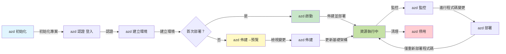
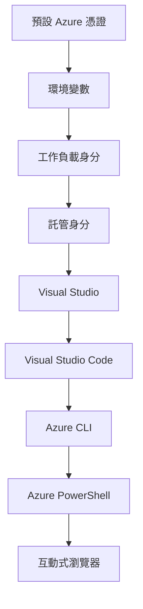

# AZD Basics - Understanding Azure Developer CLI

# AZD Basics - Core Concepts and Fundamentals

**Chapter Navigation:**
- **📚 課程首頁**: [AZD For Beginners](../../README.md)
- **📖 本章節**: 第 1 章 - 基礎與快速入門
- **⬅️ 上一個**: [Course Overview](../../README.md#-chapter-1-foundation--quick-start)
- **➡️ 下一個**: [Installation & Setup](installation.md)
- **🚀 下一章**: [第 2 章：以 AI 為先的開發](../chapter-02-ai-development/microsoft-foundry-integration.md)

## Introduction

本課程介紹 Azure Developer CLI (azd)，這是一個強大的命令列工具，可加速你從本地開發到 Azure 部署的旅程。你將學習基本概念、核心功能，並了解 azd 如何簡化雲原生應用的部署。

## Learning Goals

在本課程結束時，你將能夠：
- 了解 Azure Developer CLI 是什麼及其主要用途
- 學習範本、環境與服務的核心概念
- 探索包括範本驅動開發與基礎設施即代碼在內的關鍵功能
- 了解 azd 專案結構與工作流程
- 準備好在你的開發環境中安裝與設定 azd

## Learning Outcomes

完成本課程後，你將能夠：
- 說明 azd 在現代雲端開發工作流程中的角色
- 辨識 azd 專案結構的組成部分
- 描述範本、環境與服務如何協同運作
- 了解使用 azd 的基礎設施即代碼之優點
- 辨認不同 azd 指令及其用途

## What is Azure Developer CLI (azd)?

Azure Developer CLI (azd) 是一個命令列工具，旨在加速你從本地開發到 Azure 部署的旅程。它簡化了在 Azure 上構建、部署與管理雲原生應用的流程。

### What Can You Deploy with azd?

azd 支援各種工作負載——而且清單持續在擴展。今天，你可以使用 azd 部署：

| 工作負載類型 | 範例 | 相同工作流程？ |
|---------------|----------|----------------|
| <strong>傳統應用程式</strong> | Web 應用、REST API、靜態網站 | ✅ `azd up` |
| <strong>服務與微服務</strong> | Container Apps、Function Apps、多人服務後端 | ✅ `azd up` |
| **AI 驅動應用程式** | 使用 Microsoft Foundry Models 的聊天應用、結合 AI Search 的 RAG 解決方案 | ✅ `azd up` |
| <strong>智慧型代理</strong> | 在 Foundry 托管的代理、多代理協調 | ✅ `azd up` |

關鍵在於，無論你部署的是什麼，**azd 的生命週期都保持相同**。你會初始化專案、佈建基礎設施、部署程式碼、監控應用，然後清理——不論是簡單網站或複雜的 AI 代理。

這種連續性是設計使然。azd 將 AI 能力視為應用可以使用的另一類服務，而不是根本不同的東西。對 azd 來說，由 Microsoft Foundry Models 支持的聊天端點，只不過是另一個要設定與部署的服務。

### 🎯 為何使用 AZD？實務比較

讓我們比較部署一個簡單的 web 應用與資料庫的流程：

#### ❌ 沒有 AZD：手動 Azure 部署（30+ 分鐘）

```bash
# 第1步：建立資源群組
az group create --name myapp-rg --location eastus

# 第2步：建立應用服務方案
az appservice plan create --name myapp-plan \
  --resource-group myapp-rg \
  --sku B1 --is-linux

# 第3步：建立 Web 應用程式
az webapp create --name myapp-web-unique123 \
  --resource-group myapp-rg \
  --plan myapp-plan \
  --runtime "NODE:18-lts"

# 第4步：建立 Cosmos DB 帳戶（10-15 分鐘）
az cosmosdb create --name myapp-cosmos-unique123 \
  --resource-group myapp-rg \
  --kind MongoDB

# 第5步：建立資料庫
az cosmosdb mongodb database create \
  --account-name myapp-cosmos-unique123 \
  --resource-group myapp-rg \
  --name tododb

# 第6步：建立集合
az cosmosdb mongodb collection create \
  --account-name myapp-cosmos-unique123 \
  --resource-group myapp-rg \
  --database-name tododb \
  --name todos

# 第7步：取得連線字串
CONN_STR=$(az cosmosdb keys list \
  --name myapp-cosmos-unique123 \
  --resource-group myapp-rg \
  --type connection-strings \
  --query "connectionStrings[0].connectionString" -o tsv)

# 第8步：設定應用程式設定
az webapp config appsettings set \
  --name myapp-web-unique123 \
  --resource-group myapp-rg \
  --settings MONGODB_URI="$CONN_STR"

# 第9步：啟用記錄
az webapp log config --name myapp-web-unique123 \
  --resource-group myapp-rg \
  --application-logging filesystem \
  --detailed-error-messages true

# 第10步：設定 Application Insights
az monitor app-insights component create \
  --app myapp-insights \
  --location eastus \
  --resource-group myapp-rg

# 第11步：將 Application Insights 連結到 Web 應用程式
INSTRUMENTATION_KEY=$(az monitor app-insights component show \
  --app myapp-insights \
  --resource-group myapp-rg \
  --query "instrumentationKey" -o tsv)

az webapp config appsettings set \
  --name myapp-web-unique123 \
  --resource-group myapp-rg \
  --settings APPINSIGHTS_INSTRUMENTATIONKEY="$INSTRUMENTATION_KEY"

# 第12步：在本機建置應用程式
npm install
npm run build

# 第13步：建立部署封包
zip -r app.zip . -x "*.git*" "node_modules/*"

# 第14步：部署應用程式
az webapp deployment source config-zip \
  --resource-group myapp-rg \
  --name myapp-web-unique123 \
  --src app.zip

# 第15步：等待並祈禱它能正常運作 🙏
# （無自動驗證，需手動測試）
```

**問題：**
- ❌ 需要記住並依序執行 15+ 個命令
- ❌ 30-45 分鐘的手動操作
- ❌ 容易出錯（打字錯誤、參數錯誤）
- ❌ 連線字串會暴露在終端機歷史紀錄中
- ❌ 若發生錯誤，沒有自動回滾
- ❌ 團隊成員難以複現
- ❌ 每次都不同（無法重現）

#### ✅ 使用 AZD：自動化部署（5 個命令，10-15 分鐘）

```bash
# 步驟 1：從範本初始化
azd init --template todo-nodejs-mongo

# 步驟 2：驗證身份
azd auth login

# 步驟 3：建立環境
azd env new dev

# 步驟 4：預覽變更（可選，但建議）
azd provision --preview

# 步驟 5：部署所有項目
azd up

# ✨ 完成！所有項目已部署、已設定並受監控
```

**好處：**
- ✅ **5 個命令** 對比 15+ 個手動步驟
- ✅ **10-15 分鐘** 總時間（主要是等待 Azure）
- ✅ <strong>較少手動錯誤</strong> - 一致的範本驅動工作流程
- ✅ <strong>安全的機密處理</strong> - 許多範本使用 Azure 管理的機密儲存
- ✅ <strong>可重複部署</strong> - 每次相同的工作流程
- ✅ <strong>完全可重現</strong> - 每次產生相同結果
- ✅ <strong>團隊可用</strong> - 任何人都能用相同命令部署
- ✅ <strong>基礎設施即代碼</strong> - Bicep 範本受版本控制
- ✅ <strong>內建監控</strong> - 自動設定 Application Insights

### 📊 時間與錯誤減少

| 指標 | 手動部署 | AZD 部署 | 改善 |
|:-------|:------------------|:---------------|:------------|
| <strong>命令數</strong> | 15+ | 5 | 少 67% |
| <strong>時間</strong> | 30-45 分鐘 | 10-15 分鐘 | 快 60% |
| <strong>錯誤率</strong> | 約 40% | <5% | 減少 88% |
| <strong>一致性</strong> | 低（手動） | 100%（自動） | 完美 |
| <strong>團隊上手時間</strong> | 2-4 小時 | 30 分鐘 | 快 75% |
| <strong>回滾時間</strong> | 30+ 分鐘（手動） | 2 分鐘（自動） | 快 93% |

## Core Concepts

### Templates
範本是 azd 的基礎。它們包含：
- <strong>應用程式程式碼</strong> - 你的原始程式碼與相依項
- <strong>基礎設施設定</strong> - 使用 Bicep 或 Terraform 定義的 Azure 資源
- <strong>設定檔</strong> - 設定與環境變數
- <strong>部署腳本</strong> - 自動化部署工作流程

### Environments
環境代表不同的部署目標：
- **開發（Development）** - 用於測試與開發
- **預備（Staging）** - 上線前環境
- **生產（Production）** - 實際運行的生產環境

每個環境各自維護：
- Azure 資源群組
- 設定參數
- 部署狀態

### Services
服務是應用的構建模組：
- <strong>前端</strong> - 網頁應用、單頁應用（SPA）
- <strong>後端</strong> - API、微服務
- <strong>資料庫</strong> - 資料儲存解決方案
- <strong>儲存</strong> - 檔案與 Blob 儲存

## Key Features

### 1. Template-Driven Development
```bash
# 瀏覽可用範本
azd template list

# 從範本初始化
azd init --template <template-name>
```

### 2. Infrastructure as Code
- **Bicep** - Azure 的領域專用語言
- **Terraform** - 多雲基礎設施工具
- **ARM Templates** - Azure Resource Manager 範本

### 3. Integrated Workflows
```bash
# 完整部署工作流程
azd up            # Provision + Deploy：首次設定時可全自動執行

# 🧪 新：在部署前預覽基礎設施變更（安全）
azd provision --preview    # 模擬基礎設施部署而不做出變更

azd provision     # 若更新基礎設施且需建立 Azure 資源，請使用此功能
azd deploy        # 部署應用程式程式碼，或在更新後重新部署
azd down          # 清理資源
```

#### 🛡️ 使用預覽進行安全的基礎設施規劃
`azd provision --preview` 指令是安全部署的關鍵工具：
- <strong>模擬執行分析</strong> - 顯示將會被建立、修改或刪除的項目
- <strong>零風險</strong> - 不會對 Azure 環境做出實際變更
- <strong>團隊協作</strong> - 在部署前共享預覽結果
- <strong>成本估算</strong> - 在承諾之前了解資源成本

```bash
# 範例預覽工作流程
azd provision --preview           # 查看將會變更的內容
# 檢視輸出，與團隊討論
azd provision                     # 放心套用變更
```

### 📊 視覺化：AZD 開發工作流程



**工作流程說明：**
1. **Init** - 從範本或新專案開始
2. **Auth** - 與 Azure 驗證
3. **Environment** - 建立隔離的部署環境
4. **Preview** - 🆕 始終先預覽基礎設施變更（安全做法）
5. **Provision** - 建立/更新 Azure 資源
6. **Deploy** - 推送你的應用程式程式碼
7. **Monitor** - 觀察應用程式效能
8. **Iterate** - 作出變更並重新部署程式碼
9. **Cleanup** - 完成後移除資源

### 4. Environment Management
```bash
# 建立及管理環境
azd env new <environment-name>
azd env select <environment-name>
azd env list
```

### 5. Extensions and AI Commands

azd 使用擴充系統來增加核心 CLI 之外的功能。這對 AI 工作負載特別有用：

```bash
# 列出可用的擴充套件
azd extension list

# 安裝 Foundry agents 擴充套件
azd extension install azure.ai.agents

# 從 manifest 檔案初始化 AI 代理專案
azd ai agent init -m agent-manifest.yaml

# 測試已部署的代理（顯示延遲及首位元組時間）
azd ai agent invoke

# 啟動 MCP 伺服器以進行 AI 輔助開發（Alpha）
azd mcp start
```

**代理生命週期，端到端。** 一旦你安裝了 `azure.ai.agents`，單一工作流程即可將你的構想帶到運行並受監控的代理。你不需要在第一天就使用所有這些功能——只要知道它們存在：

| 階段 | 指令 | 功能說明 |
|-------|---------|--------------|
| **Scaffold** | `azd ai agent init -m <manifest>` | 根據 manifest 產生一個代理專案 |
| **Test** | `azd ai agent invoke` | 呼叫代理並檢視回應時間 |
| **Measure** | `azd ai agent eval generate` | 為代理建立評估資料集 |
| **Improve** | `azd ai agent optimize` | 根據你的資料優化代理指令 |
| **Inspect** | `azd ai agent endpoint show` | 檢視線上端點設定 |
| **Clean up** | `azd ai agent delete` | 刪除一個託管代理及其所有版本 |

> 擴充內容在 [第 2 章：以 AI 為先的開發](../chapter-02-ai-development/agents.md) 與 [AZD AI CLI 指令](../chapter-08-production/production-ai-practices.md#azd-ai-cli-commands-and-extensions) 參考中有詳細說明。

## 📁 Project Structure

一個典型的 azd 專案結構：
```
my-app/
├── .azd/                    # azd configuration
│   └── config.json
├── .azure/                  # Azure deployment artifacts
├── .devcontainer/          # Development container config
├── .github/workflows/      # GitHub Actions
├── .vscode/               # VS Code settings
├── infra/                 # Infrastructure code
│   ├── main.bicep        # Main infrastructure template
│   ├── main.parameters.json
│   └── modules/          # Reusable modules
├── src/                  # Application source code
│   ├── api/             # Backend services
│   └── web/             # Frontend application
├── azure.yaml           # azd project configuration
└── README.md
```

## 🔧 Configuration Files

### azure.yaml
主要的專案設定檔：
```yaml
name: my-awesome-app
metadata:
  template: my-template@1.0.0

services:
  web:
    project: ./src/web
    language: js
    host: appservice
  api:
    project: ./src/api
    language: js
    host: appservice

hooks:
  preprovision:
    shell: pwsh
    run: echo "Preparing to provision..."
```

### .azure/config.json
環境特定的設定：
```json
{
  "version": 1,
  "defaultEnvironment": "dev",
  "environments": {
    "dev": {
      "subscriptionId": "your-subscription-id",
      "location": "eastus"
    }
  }
}
```

## 🎪 Common Workflows with Hands-On Exercises

> **💡 學習小提示：** 按順序完成這些練習，以逐步建立你的 AZD 技能。

### 🎯 Exercise 1: Initialize Your First Project

**目標：** 建立一個 AZD 專案並探索其結構

**步驟：**
```bash
# 使用已驗證的範本
azd init --template todo-nodejs-mongo

# 檢視已產生的檔案
ls -la  # 查看所有檔案，包括隱藏檔案

# 已建立的主要檔案：
# - azure.yaml (主要設定)
# - infra/ (基礎架構程式碼)
# - src/ (應用程式的程式碼)
```

**✅ 成功條件：** 你已擁有 azure.yaml、infra/ 和 src/ 目錄

---

### 🎯 Exercise 2: Deploy to Azure

**目標：** 完成端到端部署

**步驟：**
```bash
# 1. 驗證身份
az login && azd auth login

# 2. 建立環境
azd env new dev
azd env set AZURE_LOCATION eastus

# 3. 預覽變更 (建議)
azd provision --preview

# 4. 部署全部
azd up

# 5. 驗證部署
azd show    # 檢視你的應用程式網址
```

**預計時間：** 10-15 分鐘  
**✅ 成功條件：** 應用程式 URL 可在瀏覽器中開啟

---

### 🎯 Exercise 3: Multiple Environments

**目標：** 部署到 dev 與 staging

**步驟：**
```bash
# 已經有 dev，建立 staging
azd env new staging
azd env set AZURE_LOCATION westus2
azd up

# 在它們之間切換
azd env list
azd env select dev
```

**✅ 成功條件：** 在 Azure 入口網站中有兩個獨立的資源群組

---

### 🛡️ 清空環境：`azd down --force --purge`

當你需要完全重設時：

```bash
azd down --force --purge
```

**它的功能：**
- `--force`: 無確認提示
- `--purge`: 刪除所有本地狀態與 Azure 資源

**使用時機：**
- 部署中途失敗
- 切換專案
- 需要全新開始

---

## 🎪 Original Workflow Reference

### Starting a New Project
```bash
# 方法 1：使用現有範本
azd init --template todo-nodejs-mongo

# 方法 2：從頭開始
azd init

# 方法 3：使用當前目錄
azd init .
```

### Development Cycle
```bash
# 設定開發環境
azd auth login
azd env new dev
azd env select dev

# 部署所有項目
azd up

# 做出更改並重新部署
azd deploy

# 完成後清理
azd down --force --purge # Azure Developer CLI 中的命令是對您的環境進行**強制重設**—在您排查部署失敗、清理孤立資源，或準備重新部署時尤其有用。
```

## Understanding `azd down --force --purge`
`azd down --force --purge` 指令是完全拆除你的 azd 環境與所有相關資源的強大方式。以下是每個旗標的說明：
```
--force
```
- 跳過確認提示。
- 對於自動化或無法進行人工輸入的腳本很有用。
- 確保拆除過程不中斷，即使 CLI 偵測到不一致性也會繼續。

```
--purge
```
刪除 **所有相關的 metadata**，包括：
Environment state
Local `.azure` folder
Cached deployment info
避免 azd “記住” 先前的部署，這可能會導致資源群組不匹配或快取的註冊表參考等問題。

### 為何同時使用兩者？
當你因為殘留狀態或部分部署而無法成功執行 `azd up` 時，這組合可確保一個 <strong>乾淨的起點</strong>。

在你於 Azure 入口網站手動刪除資源後，或切換範本、環境或資源群組命名慣例時，這特別有幫助。

### Managing Multiple Environments
```bash
# 建立暫存環境
azd env new staging
azd env select staging
azd up

# 切換回開發環境
azd env select dev

# 比較各環境
azd env list
```

## 🔐 Authentication and Credentials

了解身分驗證對成功的 azd 部署至關重要。Azure 使用多種驗證方法，而 azd 借用其他 Azure 工具所使用的相同憑證鏈。

### Azure CLI Authentication (`az login`)

在使用 azd 之前，你需要先對 Azure 進行驗證。最常見的方法是使用 Azure CLI：

```bash
# 互動式登入（會開啟瀏覽器）
az login

# 以特定租戶登入
az login --tenant <tenant-id>

# 使用服務主體登入
az login --service-principal -u <app-id> -p <password> --tenant <tenant-id>

# 檢查目前登入狀態
az account show

# 列出可用的訂閱
az account list --output table

# 設定預設訂閱
az account set --subscription <subscription-id>
```

### Authentication Flow
1. <strong>互動式登入</strong>：開啟預設瀏覽器以進行驗證
2. **裝置代碼流程（Device Code Flow）**：用於無瀏覽器存取的環境
3. **服務主體（Service Principal）**：用於自動化與 CI/CD 情境
4. **受管身分（Managed Identity）**：用於 Azure 托管的應用程式

### DefaultAzureCredential Chain

`DefaultAzureCredential` 是一種提供簡化驗證體驗的憑證類型，會自動按特定順序嘗試多種憑證來源：

#### Credential Chain Order


#### 1. Environment Variables
```bash
# 為服務主體設定環境變數
export AZURE_CLIENT_ID="<app-id>"
export AZURE_CLIENT_SECRET="<password>"
export AZURE_TENANT_ID="<tenant-id>"
```

#### 2. Workload Identity (Kubernetes/GitHub Actions)
自動使用於：
- 在具有 Workload Identity 的 Azure Kubernetes Service (AKS)
- 使用 OIDC 聯合的 GitHub Actions
- 其他聯合身分情境

#### 3. Managed Identity
適用於像是下列的 Azure 資源：
- 虛擬機（Virtual Machines）
- App Service
- Azure Functions
- Container Instances

```bash
# 檢查是否在具有受管理身分的 Azure 資源上執行
az account show --query "user.type" --output tsv
# 回傳：若使用受管理身分則為 "servicePrincipal"
```

#### 4. Developer Tools Integration
- **Visual Studio**：自動使用已登入的帳戶
- **VS Code**：使用 Azure Account 擴充的憑證
- **Azure CLI**：使用 `az login` 的憑證（本地開發最常見）

### AZD Authentication Setup

```bash
# 方法 1：使用 Azure CLI（建議用於開發）
az login
azd auth login  # 使用現有的 Azure CLI 認證

# 方法 2：直接使用 azd 進行認證
azd auth login --use-device-code  # 適用於無頭環境

# 方法 3：檢查認證狀態
azd auth login --check-status

# 方法 4：登出並重新認證
azd auth logout
azd auth login
```

### Authentication Best Practices

#### For Local Development
```bash
# 使用 Azure CLI 登入
az login

# 驗證所選訂閱是否正確
az account show
az account set --subscription "Your Subscription Name"

# 使用現有認證搭配 azd
azd auth login
```

#### CI/CD 管線用
```yaml
# GitHub Actions example
- name: Azure Login
  uses: azure/login@v1
  with:
    creds: ${{ secrets.AZURE_CREDENTIALS }}

- name: Deploy with azd
  run: |
    azd auth login --client-id ${{ secrets.AZURE_CLIENT_ID }} \
                    --client-secret ${{ secrets.AZURE_CLIENT_SECRET }} \
                    --tenant-id ${{ secrets.AZURE_TENANT_ID }}
    azd up --no-prompt
```

#### 針對生產環境
- 在 Azure 資源上執行時使用 **Managed Identity**
- 在自動化情境中使用 **Service Principal**
- 避免在程式碼或組態檔中儲存憑證
- 對於敏感組態使用 **Azure Key Vault**

### 常見認證問題與解決方案

#### 問題："找不到訂閱"
```bash
# 解決方法：設定預設訂閱
az account list --output table
az account set --subscription "<subscription-id>"
azd env set AZURE_SUBSCRIPTION_ID "<subscription-id>"
```

#### 問題："權限不足"
```bash
# 解決方案：檢查並指派所需角色
az role assignment list --assignee $(az account show --query user.name --output tsv)

# 常見所需角色：
# - 貢獻者（用於資源管理）
# - 使用者存取管理員（用於角色指派）
```

#### 問題："權杖已過期"
```bash
# 解決方法：重新驗證
az logout
az login
azd auth logout
azd auth login
```

### 不同情境下的認證

#### 本地開發
```bash
# 個人發展帳戶
az login
azd auth login
```

#### 團隊開發
```bash
# 為組織使用特定租戶
az login --tenant contoso.onmicrosoft.com
azd auth login
```

#### 多租戶情境
```bash
# 在租戶之間切換
az login --tenant tenant1.onmicrosoft.com
# 部署到租戶 1
azd up

az login --tenant tenant2.onmicrosoft.com  
# 部署到租戶 2
azd up
```

### 安全考量

1. <strong>憑證儲存</strong>：切勿在原始程式碼中儲存憑證
2. <strong>權限範圍限制</strong>：對 **Service Principal** 採用最小權限原則
3. <strong>權杖輪換</strong>：定期輪換 service principal 的秘密
4. <strong>稽核追蹤</strong>：監控認證與部署活動
5. <strong>網路安全</strong>：在可能時使用私人端點

### 認證故障排除

```bash
# 除錯驗證問題
azd auth login --check-status
az account show
az account get-access-token

# 常見診斷命令
whoami                          # 目前使用者上下文
az ad signed-in-user show      # Microsoft Entra ID 使用者詳細資料
az group list                  # 測試資源存取
```

## 了解 `azd down --force --purge`

### 探索
```bash
azd template list              # 瀏覽範本
azd template show <template>   # 範本詳情
azd init --help               # 初始化選項
```

### 專案管理
```bash
azd show                     # 專案概覽
azd env list                # 可用環境及選定的預設
azd config show            # 組態設定
```

### 監控
```bash
azd monitor                  # 開啟 Azure 入口網站監控
azd monitor --logs           # 檢視應用程式日誌
azd monitor --live           # 檢視即時指標
azd pipeline config          # 設定 CI/CD
```

## 最佳實務

### 1. 使用有意義的名稱
```bash
# 好
azd env new production-east
azd init --template web-app-secure

# 避免
azd env new env1
azd init --template template1
```

### 2. 利用範本
- 從現有範本開始
- 根據需求自訂
- 為組織建立可重用的範本

### 3. 環境隔離
- 為 dev/staging/prod 使用獨立環境
- 絕勿從本機直接部署到生產環境
- 對生產部署使用 CI/CD 管線

### 4. 組態管理
- 對敏感資料使用環境變數
- 將組態保存在版本控制
- 記錄環境特定設定

## 學習進度

### 初學者（第 1-2 週）
1. 安裝 azd 並進行認證
2. 部署一個簡單範本
3. 了解專案結構
4. 學習基本指令（up, down, deploy）

### 進階（第 3-4 週）
1. 自訂範本
2. 管理多個環境
3. 了解基礎結構程式碼
4. 設定 CI/CD 管線

### 高階（第 5 週起）
1. 建立自訂範本
2. 進階基礎結構模式
3. 多區域部署
4. 企業級設定

## 下一步

**📖 繼續第 1 章學習：**
- [安裝與設定](installation.md) - 安裝並設定 azd
- [你的第一個專案](first-project.md) - 完成實作教學
- [組態指南](configuration.md) - 進階組態選項

**🎯 準備好下一章了嗎？**
- [第 2 章：以 AI 為先的開發](../chapter-02-ai-development/microsoft-foundry-integration.md) - 開始建立 AI 應用程式

## 附加資源

- [Azure Developer CLI 概覽](https://learn.microsoft.com/en-us/azure/developer/azure-developer-cli/)
- [範本集錦](https://azure.github.io/awesome-azd/)
- [社群範例](https://github.com/Azure-Samples)

---

## 🙋 常見問題

### 一般問題

**問：AZD 與 Azure CLI 有何不同？**

答：Azure CLI（`az`）用於管理單一的 Azure 資源。AZD（`azd`）用於管理整個應用程式：

```bash
# Azure CLI - 低階資源管理
az webapp create --name myapp --resource-group rg
az sql server create --name myserver --resource-group rg
# ...需要更多命令

# AZD - 應用程式層級管理
azd up  # 部署整個應用程式及所有資源
```

**可以這麼想：**
- `az` = 操作單顆樂高積木
- `azd` = 使用完整的樂高組合包

---

**問：使用 AZD 需要會 Bicep 或 Terraform 嗎？**

答：不需要！從範本開始：
```bash
# 使用現有範本 - 無需 IaC 知識
azd init --template todo-nodejs-mongo
azd up
```

你可以之後再學 Bicep 以自訂基礎結構。範本提供可實作的範例讓你學習。

---

**問：執行 AZD 範本需要多少費用？**

答：費用依範本而異。大多數開發範本的費用為每月 $50-150：
```bash
# 在部署前預覽成本
azd provision --preview

# 不使用時務必清理
azd down --force --purge  # 移除所有資源
```

**專業提示：** 在可用時使用免費等級：
- App Service：F1（免費）等級
- Microsoft Foundry Models：Azure OpenAI 每月 50,000 tokens 免費
- Cosmos DB：1000 RU/s 免費等級

---

**問：我可以用現有的 Azure 資源使用 AZD 嗎？**

答：可以，但從頭開始會比較容易。當 AZD 管理完整生命週期時效能最佳。對於現有資源：
```bash
# 選項 1：匯入現有資源（進階）
azd init
# 然後修改 infra/ 以參考現有資源

# 選項 2：從頭開始（建議）
azd init --template matching-your-stack
azd up  # 建立新環境
```

---

**問：如何與團隊成員共享我的專案？**

答：將 AZD 專案提交到 Git（但不要提交 .azure 資料夾）：
```bash
# 已預設包含於 .gitignore
.azure/        # 包含機密與環境資料
*.env          # 環境變數

# 當時的團隊成員：
git clone <your-repo>
azd auth login
azd env new <their-name>-dev
azd up
```

每個人都從相同的範本獲得相同的基礎結構。

---

### 疑難排解問題

**問：執行 "azd up" 中途失敗。我該怎麼辦？**

答：檢查錯誤、修正後再重試：
```bash
# 檢視詳細日誌
azd show

# 常見修復方法：

# 1. 如果超出配額：
azd env set AZURE_LOCATION "westus2"  # 嘗試不同區域

# 2. 如果資源名稱衝突：
azd down --force --purge  # 重設至初始狀態
azd up  # 重試

# 3. 如果認證已過期：
az login
azd auth login
azd up
```

**最常見的問題：** 選錯 Azure 訂閱
```bash
az account list --output table
az account set --subscription "<correct-subscription>"
```

---

**問：如何只部署程式碼變更而不重新佈建？**

答：使用 `azd deploy` 來代替 `azd up`：
```bash
azd up          # 首次：準備與部署（較慢）

# 修改程式碼...

azd deploy      # 後續：僅部署（較快）
```

速度比較：
- `azd up`：10-15 分鐘（佈建基礎結構）
- `azd deploy`：2-5 分鐘（僅程式碼）

---

**問：我可以自訂基礎結構範本嗎？**

答：可以！編輯 `infra/` 中的 Bicep 檔案：
```bash
# 執行 azd init 之後
cd infra/
code main.bicep  # 在 VS Code 編輯

# 預覽變更
azd provision --preview

# 套用變更
azd provision
```

**提示：** 從小處開始－先更改 SKU：
```bicep
// infra/main.bicep
sku: {
  name: 'B1'  // Change to 'P1V2' for production
}
```

---

**問：如何刪除 AZD 所建立的一切？**

答：一個指令即可移除所有資源：
```bash
azd down --force --purge

# 這會刪除:
# - 所有 Azure 資源
# - 資源群組
# - 本地環境狀態
# - 快取的部署資料
```

**每次在以下情況都要執行：**
- 測試範本完成時
- 轉換到不同專案時
- 想要重新開始時

**節省成本：** 刪除未使用資源 = $0 費用

---

**問：如果我在 Azure 入口網站不小心刪除了資源怎麼辦？**

答：AZD 的狀態可能不同步。採用清空重新開始的方式：
```bash
# 移除本地狀態
azd down --force --purge

# 重新開始
azd up

# 替代方案：讓 AZD 偵測並修復
azd provision  # 會建立缺失的資源
```

---

### 進階問題

**問：我可以在 CI/CD 管線中使用 AZD 嗎？**

答：可以！以下為 GitHub Actions 範例：
```yaml
# .github/workflows/deploy.yml
name: Deploy with AZD

on:
  push:
    branches: [main]

jobs:
  deploy:
    runs-on: ubuntu-latest
    steps:
      - uses: actions/checkout@v2
      
      - name: Install azd
        run: curl -fsSL https://aka.ms/install-azd.sh | bash
      
      - name: Azure Login
        run: |
          azd auth login \
            --client-id ${{ secrets.AZURE_CLIENT_ID }} \
            --client-secret ${{ secrets.AZURE_CLIENT_SECRET }} \
            --tenant-id ${{ secrets.AZURE_TENANT_ID }}
      
      - name: Deploy
        run: azd up --no-prompt
```

---

**問：我該如何處理秘密與敏感資料？**

答：AZD 會自動整合 Azure Key Vault：
```bash
# 機密會儲存在金鑰保管庫，而不是程式碼內
azd env set DATABASE_PASSWORD "$(openssl rand -base64 32)"

# AZD 會自動執行：
# 1. 建立金鑰保管庫
# 2. 儲存機密
# 3. 透過 Managed Identity（受管理的身分）授予應用程式存取權
# 4. 在執行時注入
```

**切勿提交：**
- `.azure/` 資料夾（含環境資料）
- `.env` 檔案（本機秘密）
- 連線字串

---

**問：我可以部署到多個區域嗎？**

答：可以，為每個區域建立環境：
```bash
# 美國東部環境
azd env new prod-eastus
azd env set AZURE_LOCATION eastus
azd up

# 歐洲西部環境
azd env new prod-westeurope
azd env set AZURE_LOCATION westeurope
azd up

# 每個環境都是獨立的
azd env list
```

對於真正的多區域應用，請自訂 Bicep 範本以同時部署到多個區域。

---

**問：如果卡住了該去哪裡求助？**

1. **AZD 文件：** https://learn.microsoft.com/azure/developer/azure-developer-cli/
2. **GitHub Issues：** https://github.com/Azure/azure-dev/issues
3. **Discord：** [Azure Discord](https://discord.gg/microsoft-azure) - #azure-developer-cli 頻道
4. **Stack Overflow：** 標籤 `azure-developer-cli`
5. **本課程：** [疑難排解指南](../chapter-07-troubleshooting/common-issues.md)

**專業提示：** 在提問前，執行：
```bash
azd show       # 顯示目前狀態
azd version    # 顯示你的版本
```
請在提問時包含這些資訊以加速獲得協助。

---

## 🎓 接下來做什麼？

你現在已了解 AZD 基本概念。選擇你的路徑：

### 🎯 初學者：
1. **下一步：** [安裝與設定](installation.md) - 在你的機器上安裝 AZD
2. **然後：** [你的第一個專案](first-project.md) - 部署你的第一個應用程式
3. **練習：** 完成本課的所有 3 個練習

### 🚀 AI 開發者：
1. **跳到：** [第 2 章：以 AI 為先的開發](../chapter-02-ai-development/microsoft-foundry-integration.md)
2. **部署：** 從 `azd init --template get-started-with-ai-chat` 開始
3. **學習：** 一邊部署一邊構建

### 🏗️ 進階開發者：
1. **檢閱：** [組態指南](configuration.md) - 進階設定
2. **探索：** [基礎結構即程式碼](../chapter-04-infrastructure/provisioning.md) - Bicep 深入解析
3. **構建：** 為你的堆棧建立自訂範本

---

**章節導覽：**
- **📚 課程首頁**： [AZD 初學者](../../README.md)
- **📖 目前章節**：第 1 章 - 基礎與快速入門  
- **⬅️ 上一章**： [課程總覽](../../README.md#-chapter-1-foundation--quick-start)
- **➡️ 下一步**： [安裝與設定](installation.md)
- **🚀 下一章**： [第 2 章：以 AI 為先的開發](../chapter-02-ai-development/microsoft-foundry-integration.md)

---

<!-- CO-OP TRANSLATOR DISCLAIMER START -->
**免責聲明**：
本文件使用 AI 翻譯服務 [Co-op Translator](https://github.com/Azure/co-op-translator) 進行翻譯。雖然我們力求準確，但請注意，自動翻譯可能包含錯誤或不準確之處。原始文件的母語版本應被視為權威來源。對於重要資訊，建議尋求專業人工翻譯。我們不對因使用本翻譯而引起的任何誤解或曲解承擔責任。
<!-- CO-OP TRANSLATOR DISCLAIMER END -->