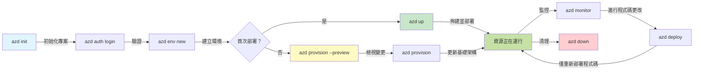
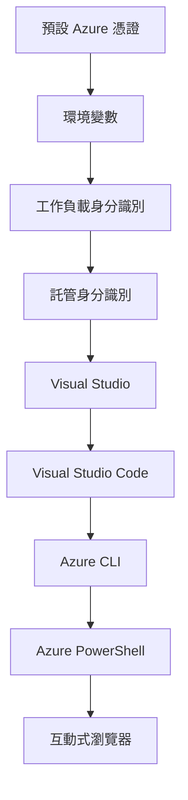

# AZD Basics - 了解 Azure Developer CLI

# AZD Basics - 核心概念與基礎

**章節導覽：**
- **📚 課程主頁**: [AZD For Beginners](../../README.md)
- **📖 目前章節**: 第 1 章 - 基礎與快速開始
- **⬅️ 上一章**: [課程總覽](../../README.md#-chapter-1-foundation--quick-start)
- **➡️ 下一章**: [安裝與設定](installation.md)
- **🚀 下一章節**: [第 2 章: 以 AI 為先的開發](../chapter-02-ai-development/microsoft-foundry-integration.md)

## 介紹

本課將向您介紹 Azure Developer CLI (azd)，一個可加速您從本地開發到 Azure 部署旅程的強大命令列工具。您將學習基本概念、核心功能，並了解 azd 如何簡化雲原生應用程式的部署。

## 學習目標

到本課結束，您將能：
- 了解 Azure Developer CLI 是什麼以及其主要用途
- 學習模板、環境與服務的核心概念
- 探索主要功能，包括以模板為驅動的開發與基礎設施即程式碼 (Infrastructure as Code)
- 了解 azd 專案結構與工作流程
- 準備好為您的開發環境安裝與設定 azd

## 學習成果

完成本課後，您將能：
- 能說明 azd 在現代雲端開發工作流程中的角色
- 識別 azd 專案結構的組成部分
- 描述模板、環境與服務如何協同運作
- 了解使用 azd 進行基礎設施即程式碼的好處
- 辨識不同的 azd 指令及其用途

## 什麼是 Azure Developer CLI (azd)？

Azure Developer CLI (azd) 是一個旨在加速您從本地開發到 Azure 部署旅程的命令列工具。它簡化了在 Azure 上建置、部署及管理雲原生應用程式的流程。

### 使用 azd 可以部署什麼？

azd 支援廣泛的工作負載—且支援的清單持續擴充。今天，您可以使用 azd 部署：

| 工作負載類型 | 範例 | 是否相同的工作流程？ |
|---------------|----------|----------------|
| <strong>傳統應用程式</strong> | Web 應用、REST API、靜態網站 | ✅ `azd up` |
| <strong>服務與微服務</strong> | Container Apps、Function Apps、多服務後端 | ✅ `azd up` |
| **AI 驅動應用** | 使用 Microsoft Foundry Models 的聊天應用、搭配 AI Search 的 RAG 解決方案 | ✅ `azd up` |
| <strong>智慧型代理</strong> | 由 Foundry 托管的代理、多代理協同編排 | ✅ `azd up` |

關鍵在於 azd 的生命週期無論您部署什麼都保持一致。您會初始化專案、佈建基礎設施、部署程式碼、監控您的應用，並在完成後清理資源——不論是簡單的網站或複雜的 AI 代理。

這種一致性是設計使然。azd 將 AI 功能視為應用可使用的另一種服務，而非本質上不同的東西。從 azd 的角度來看，由 Microsoft Foundry Models 支援的聊天端點，只不過是另一個要配置與部署的服務。

### 🎯 為什麼使用 AZD？一個實務比較

讓我們比較部署一個帶資料庫的簡單網頁應用：

#### ❌ 不使用 AZD：手動 Azure 部署（30 分鐘以上）

```bash
# 第 1 步：建立資源群組
az group create --name myapp-rg --location eastus

# 第 2 步：建立 App Service 計劃
az appservice plan create --name myapp-plan \
  --resource-group myapp-rg \
  --sku B1 --is-linux

# 第 3 步：建立 Web 應用
az webapp create --name myapp-web-unique123 \
  --resource-group myapp-rg \
  --plan myapp-plan \
  --runtime "NODE:18-lts"

# 第 4 步：建立 Cosmos DB 帳戶（10–15 分鐘）
az cosmosdb create --name myapp-cosmos-unique123 \
  --resource-group myapp-rg \
  --kind MongoDB

# 第 5 步：建立資料庫
az cosmosdb mongodb database create \
  --account-name myapp-cosmos-unique123 \
  --resource-group myapp-rg \
  --name tododb

# 第 6 步：建立集合
az cosmosdb mongodb collection create \
  --account-name myapp-cosmos-unique123 \
  --resource-group myapp-rg \
  --database-name tododb \
  --name todos

# 第 7 步：取得連線字串
CONN_STR=$(az cosmosdb keys list \
  --name myapp-cosmos-unique123 \
  --resource-group myapp-rg \
  --type connection-strings \
  --query "connectionStrings[0].connectionString" -o tsv)

# 第 8 步：設定應用程式設定
az webapp config appsettings set \
  --name myapp-web-unique123 \
  --resource-group myapp-rg \
  --settings MONGODB_URI="$CONN_STR"

# 第 9 步：啟用日誌記錄
az webapp log config --name myapp-web-unique123 \
  --resource-group myapp-rg \
  --application-logging filesystem \
  --detailed-error-messages true

# 第 10 步：設定 Application Insights
az monitor app-insights component create \
  --app myapp-insights \
  --location eastus \
  --resource-group myapp-rg

# 第 11 步：將 Application Insights 連結到 Web 應用
INSTRUMENTATION_KEY=$(az monitor app-insights component show \
  --app myapp-insights \
  --resource-group myapp-rg \
  --query "instrumentationKey" -o tsv)

az webapp config appsettings set \
  --name myapp-web-unique123 \
  --resource-group myapp-rg \
  --settings APPINSIGHTS_INSTRUMENTATIONKEY="$INSTRUMENTATION_KEY"

# 第 12 步：在本機建置應用程式
npm install
npm run build

# 第 13 步：建立部署套件
zip -r app.zip . -x "*.git*" "node_modules/*"

# 第 14 步：部署應用程式
az webapp deployment source config-zip \
  --resource-group myapp-rg \
  --name myapp-web-unique123 \
  --src app.zip

# 第 15 步：等候並祈禱它能運作 🙏
# （無自動驗證，需要手動測試）
```

**問題：**
- ❌ 需要記住並依序執行 15 條以上指令
- ❌ 需要 30–45 分鐘的手動操作
- ❌ 容易出錯（例如打字錯誤、參數錯誤）
- ❌ 連線字串會出現在終端機歷史紀錄中
- ❌ 若發生錯誤則無自動回滾
- ❌ 因此難以讓團隊成員重現
- ❌ 每次都不同（不可重複）

#### ✅ 使用 AZD：自動化部署（5 個指令，10–15 分鐘）

```bash
# 步驟 1：從範本初始化
azd init --template todo-nodejs-mongo

# 步驟 2：驗證身分
azd auth login

# 步驟 3：建立環境
azd env new dev

# 步驟 4：預覽變更 (可選但建議)
azd provision --preview

# 步驟 5：部署所有項目
azd up

# ✨ 完成！所有項目已部署、設定並受到監控
```

**好處：**
- ✅ **5 個指令**，相較於 15 步以上的手動流程
- ✅ **10–15 分鐘** 總時間（大多在等待 Azure）
- ✅ <strong>零錯誤</strong> - 自動化且經過測試
- ✅ **機密由 Key Vault 安全管理**
- ✅ <strong>失敗時自動回滾</strong>
- ✅ <strong>完全可重現</strong> - 每次結果一致
- ✅ <strong>團隊就緒</strong> - 任何人都能用相同指令部署
- ✅ <strong>基礎設施即程式碼</strong> - Bicep 範本進行版本控制
- ✅ <strong>內建監控</strong> - 自動設定 Application Insights

### 📊 時間與錯誤減少

| 指標 | 手動部署 | 使用 AZD 的部署 | 改善 |
|:-------|:------------------|:---------------|:------------|
| <strong>指令數</strong> | 15+ | 5 | 少 67% |
| <strong>時間</strong> | 30–45 分鐘 | 10–15 分鐘 | 快 60% |
| <strong>錯誤率</strong> | 約 40% | <5% | 減少 88% |
| <strong>一致性</strong> | 低（手動） | 100%（自動化） | 完美 |
| <strong>團隊上手時間</strong> | 2–4 小時 | 30 分鐘 | 快 75% |
| <strong>回滾時間</strong> | 30 分鐘以上（手動） | 2 分鐘（自動） | 快 93% |

## 核心概念

### 範本
範本是 azd 的基礎。它們包含：
- <strong>應用程式程式碼</strong> - 您的原始程式碼與相依項目
- <strong>基礎設施定義</strong> - 以 Bicep 或 Terraform 定義的 Azure 資源
- <strong>設定檔</strong> - 設定與環境變數
- <strong>部署腳本</strong> - 自動化部署工作流程

### 環境
環境代表不同的部署目標：
- **開發（Development）** - 用於測試與開發
- **預備（Staging）** - 預生產環境
- **生產（Production）** - 線上生產環境

每個環境維護自己的：
- Azure 資源群組
- 設定值
- 部署狀態

### 服務
服務是您應用的組成建置塊：
- **前端（Frontend）** - Web 應用、單頁應用（SPA）
- **後端（Backend）** - API、微服務
- **資料庫（Database）** - 資料儲存解決方案
- **儲存（Storage）** - 檔案與 Blob 儲存

## 主要功能

### 1. 以範本驅動的開發
```bash
# 瀏覽可用的範本
azd template list

# 從範本初始化
azd init --template <template-name>
```

### 2. 基礎設施即程式碼
- **Bicep** - Azure 的領域專用語言
- **Terraform** - 多雲基礎設施工具
- **ARM Templates** - Azure 資源管理器範本

### 3. 整合工作流程
```bash
# 完整部署工作流程
azd up            # 配置 + 部署：首次設定免手動操作

# 🧪 新增：於部署前預覽基礎設施變更（安全）
azd provision --preview    # 在不作出更改的情況下模擬基礎設施部署

azd provision     # 建立 Azure 資源：如要更新基礎設施請使用此項
azd deploy        # 部署或在更新後重新部署應用程式程式碼
azd down          # 清理資源
```

#### 🛡️ 使用預覽進行安全的基礎設施規劃
命令 `azd provision --preview` 為安全部署帶來重大改變：
- **模擬執行分析（Dry-run analysis）** - 顯示將建立、修改或刪除的項目
- <strong>零風險</strong> - 不會對您的 Azure 環境做出任何實際更改
- <strong>團隊協作</strong> - 在部署前分享預覽結果
- <strong>成本估算</strong> - 在承諾前了解資源成本

```bash
# 範例預覽工作流程
azd provision --preview           # 查看將會變更的內容
# 檢視輸出，與團隊討論
azd provision                     # 有把握地套用變更
```

### 📊 圖示：AZD 開發工作流程


**工作流程說明：**
1. **Init** - 從範本或新專案開始
2. **Auth** - 與 Azure 驗證
3. **Environment** - 建立隔離的部署環境
4. **Preview** - 🆕 始終先預覽基礎設施變更（安全做法）
5. **Provision** - 建立/更新 Azure 資源
6. **Deploy** - 推送您的應用程式程式碼
7. **Monitor** - 觀察應用程式效能
8. **Iterate** - 做出變更並重新部署程式碼
9. **Cleanup** - 完成後移除資源

### 4. 環境管理
```bash
# 建立及管理環境
azd env new <environment-name>
azd env select <environment-name>
azd env list
```

### 5. 延伸與 AI 指令

azd 使用延伸系統來為核心 CLI 新增功能。這對 AI 工作負載特別有用：

```bash
# 列出可用的擴充功能
azd extension list

# 安裝 Foundry agents 擴充功能
azd extension install azure.ai.agents

# 從清單初始化一個 AI 代理專案
azd ai agent init -m agent-manifest.yaml

# 啟動 MCP 伺服器以進行 AI 輔助開發（Alpha）
azd mcp start
```

> 延伸功能在 [第 2 章：以 AI 為先的開發](../chapter-02-ai-development/agents.md) 以及 [AZD AI CLI 指令](../chapter-08-production/production-ai-practices.md#azd-ai-cli-commands-and-extensions) 參考中有詳細介紹。

## 📁 專案結構

典型的 azd 專案結構：
```
my-app/
├── .azd/                    # azd configuration
│   └── config.json
├── .azure/                  # Azure deployment artifacts
├── .devcontainer/          # Development container config
├── .github/workflows/      # GitHub Actions
├── .vscode/               # VS Code settings
├── infra/                 # Infrastructure code
│   ├── main.bicep        # Main infrastructure template
│   ├── main.parameters.json
│   └── modules/          # Reusable modules
├── src/                  # Application source code
│   ├── api/             # Backend services
│   └── web/             # Frontend application
├── azure.yaml           # azd project configuration
└── README.md
```

## 🔧 設定檔

### azure.yaml
主要的專案設定檔：
```yaml
name: my-awesome-app
metadata:
  template: my-template@1.0.0

services:
  web:
    project: ./src/web
    language: js
    host: appservice
  api:
    project: ./src/api
    language: js
    host: appservice

hooks:
  preprovision:
    shell: pwsh
    run: echo "Preparing to provision..."
```

### .azure/config.json
依環境的設定：
```json
{
  "version": 1,
  "defaultEnvironment": "dev",
  "environments": {
    "dev": {
      "subscriptionId": "your-subscription-id",
      "location": "eastus"
    }
  }
}
```

## 🎪 常見工作流程與實作練習

> **💡 學習提示：** 按順序完成這些練習以循序漸進地建立您的 AZD 技能。

### 🎯 練習 1：初始化您的第一個專案

**目標：** 建立一個 AZD 專案並探索其結構

**步驟：**
```bash
# 使用已驗證的範本
azd init --template todo-nodejs-mongo

# 瀏覽已產生的檔案
ls -la  # 檢視所有檔案，包括隱藏檔案

# 建立的主要檔案：
# - azure.yaml（主要設定）
# - infra/（基礎架構程式碼）
# - src/（應用程式原始碼）
```

**✅ 成功：** 您擁有 azure.yaml、infra/ 與 src/ 目錄

---

### 🎯 練習 2：部署到 Azure

**目標：** 完成端到端部署

**步驟：**
```bash
# 1. 驗證身份
az login && azd auth login

# 2. 建立環境
azd env new dev
azd env set AZURE_LOCATION eastus

# 3. 預覽變更（建議）
azd provision --preview

# 4. 部署所有項目
azd up

# 5. 驗證部署
azd show    # 檢視你的應用程式網址
```

**預期時間：** 10–15 分鐘  
**✅ 成功：** 應用程式 URL 在瀏覽器中開啟

---

### 🎯 練習 3：多個環境

**目標：** 部署到 dev 與 staging

**步驟：**
```bash
# 已經有 dev，建立 staging
azd env new staging
azd env set AZURE_LOCATION westus2
azd up

# 在它們之間切換
azd env list
azd env select dev
```

**✅ 成功：** 在 Azure 入口網站中有兩個獨立的資源群組

---

### 🛡️ 清除環境： `azd down --force --purge`

當您需要完全重設時：

```bash
azd down --force --purge
```

**功能：**
- `--force`：不會要求確認提示
- `--purge`：刪除所有本地狀態與 Azure 資源

**使用情境：**
- 部署中途失敗
- 切換專案
- 需要全新開始

---

## 🎪 原始工作流程參考

### 開始一個新專案
```bash
# 方法 1：使用現有範本
azd init --template todo-nodejs-mongo

# 方法 2：從頭開始
azd init

# 方法 3：使用目前目錄
azd init .
```

### 開發週期
```bash
# 設定開發環境
azd auth login
azd env new dev
azd env select dev

# 部署所有項目
azd up

# 做出變更並重新部署
azd deploy

# 完成後清理
azd down --force --purge # 在 Azure Developer CLI 中，這個命令會對你的環境做成 **完全重置** —— 在你排查部署失敗、清理遺留資源，或為全新重新部署做準備時尤其有用。
```

## 了解 `azd down --force --purge`
命令 `azd down --force --purge` 是完全拆除您的 azd 環境與所有相關資源的強大方式。以下是每個旗標的說明：
```
--force
```
- 略過確認提示。
- 在無法人工輸入的自動化或腳本情境中很有用。
- 確保拆除程序不會中斷，即使 CLI 偵測到不一致性。

```
--purge
```
刪除 <strong>所有相關的元資料</strong>，包括：
環境狀態
本地 `.azure` 資料夾
快取的部署資訊
可防止 azd “記住” 先前的部署，這可能造成像是資源群組不匹配或過時的註冊表參考等問題。


### 為什麼同時使用這兩個？
當您因為殘留狀態或部分部署而在執行 `azd up` 時遇到瓶頸，這個組合可確保一個 <strong>乾淨的起始狀態</strong>。

在 Azure 入口網站進行手動刪除資源後或切換範本、環境或資源群組命名慣例時，特別有幫助。


### 管理多個環境
```bash
# 建立預備環境
azd env new staging
azd env select staging
azd up

# 切換回開發環境
azd env select dev

# 比較環境
azd env list
```

## 🔐 驗證與憑證

了解驗證對於成功的 azd 部署至關重要。Azure 使用多種驗證方法，azd 利用與其他 Azure 工具相同的憑證鏈。

### Azure CLI 驗證（`az login`）

在使用 azd 之前，您需要對 Azure 進行驗證。最常見的方法是使用 Azure CLI：

```bash
# 互動式登入 (開啟瀏覽器)
az login

# 使用特定租戶登入
az login --tenant <tenant-id>

# 使用服務主體登入
az login --service-principal -u <app-id> -p <password> --tenant <tenant-id>

# 檢查目前的登入狀態
az account show

# 列出可用的訂閱
az account list --output table

# 設定預設訂閱
az account set --subscription <subscription-id>
```

### 驗證流程
1. **互動式登入（Interactive Login）**：開啟您預設的瀏覽器進行驗證
2. **裝置代碼流程（Device Code Flow）**：用於無法存取瀏覽器的環境
3. **服務主體（Service Principal）**：用於自動化與 CI/CD 場景
4. **管理身分（Managed Identity）**：用於在 Azure 上託管的應用程式

### DefaultAzureCredential 憑證鏈

`DefaultAzureCredential` 是一種憑證類型，透過以特定順序自動嘗試多種憑證來源，提供簡化的驗證體驗：

#### 憑證鏈順序

#### 1. 環境變數
```bash
# 為服務主體設定環境變數
export AZURE_CLIENT_ID="<app-id>"
export AZURE_CLIENT_SECRET="<password>"
export AZURE_TENANT_ID="<tenant-id>"
```

#### 2. 工作負載身分（Workload Identity）（Kubernetes/GitHub Actions）
在以下情況中自動使用：
- 使用工作負載身分的 Azure Kubernetes Service（AKS）
- 使用 OIDC 聯邦的 GitHub Actions
- 其他聯邦身分情境

#### 3. 管理身分
適用於例如下列 Azure 資源：
- 虛擬機器
- App Service
- Azure Functions
- Container Instances

```bash
# 檢查是否在具有受管理身分識別的 Azure 資源上執行
az account show --query "user.type" --output tsv
# 回傳: "servicePrincipal" 如果使用受管理身分識別
```

#### 4. 開發工具整合
- **Visual Studio**：自動使用已登入的帳戶
- **VS Code**：使用 Azure 帳戶延伸功能的憑證
- **Azure CLI**：使用 `az login` 憑證（本地開發最常見）

### AZD 驗證設定

```bash
# 方法 1：使用 Azure CLI（建議用於開發）
az login
azd auth login  # 使用現有的 Azure CLI 憑證

# 方法 2：直接使用 azd 進行驗證
azd auth login --use-device-code  # 適用於無頭環境

# 方法 3：檢查驗證狀態
azd auth login --check-status

# 方法 4：登出並重新驗證
azd auth logout
azd auth login
```

### 驗證最佳實務

#### 本地開發
```bash
# 1. 使用 Azure CLI 登入
az login

# 2. 驗證正確的訂閱
az account show
az account set --subscription "Your Subscription Name"

# 3. 以現有憑證使用 azd
azd auth login
```

#### CI/CD 管線
```yaml
# GitHub Actions example
- name: Azure Login
  uses: azure/login@v1
  with:
    creds: ${{ secrets.AZURE_CREDENTIALS }}

- name: Deploy with azd
  run: |
    azd auth login --client-id ${{ secrets.AZURE_CLIENT_ID }} \
                    --client-secret ${{ secrets.AZURE_CLIENT_SECRET }} \
                    --tenant-id ${{ secrets.AZURE_TENANT_ID }}
    azd up --no-prompt
```

#### 生產環境
- 在 Azure 資源上執行時使用 **Managed Identity**
- 在自動化情境下使用 **Service Principal**
- 避免在程式碼或設定檔中儲存憑證
- 對敏感設定使用 **Azure Key Vault**

### 常見驗證問題與解決方案

#### 問題：「找不到訂閱（No subscription found）」
```bash
# 解決方案：設定預設訂閱
az account list --output table
az account set --subscription "<subscription-id>"
azd env set AZURE_SUBSCRIPTION_ID "<subscription-id>"
```

#### 問題：「權限不足（Insufficient permissions）」
```bash
# 解決方案：檢查並指派所需角色
az role assignment list --assignee $(az account show --query user.name --output tsv)

# 常見所需角色：
# - 參與者（用於資源管理）
# - 使用者存取管理員（用於角色指派）
```

#### 問題：「權杖已過期（Token expired）」
```bash
# 解決方法：重新驗證
az logout
az login
azd auth logout
azd auth login
```

### 不同情境下的驗證

#### 本地開發
```bash
# 個人發展帳戶
az login
azd auth login
```

#### 團隊開發
```bash
# 為組織使用特定租戶
az login --tenant contoso.onmicrosoft.com
azd auth login
```

#### 多租戶情境
```bash
# 在租戶之間切換
az login --tenant tenant1.onmicrosoft.com
# 部署到租戶 1
azd up

az login --tenant tenant2.onmicrosoft.com  
# 部署到租戶 2
azd up
```

### 安全考量
1. **Credential Storage**: Never store credentials in source code
2. **Scope Limitation**: Use least-privilege principle for service principals
3. **Token Rotation**: Regularly rotate service principal secrets
4. **Audit Trail**: Monitor authentication and deployment activities
5. **Network Security**: Use private endpoints when possible

### Troubleshooting Authentication

```bash
# 除錯身份驗證問題
azd auth login --check-status
az account show
az account get-access-token

# 常用診斷命令
whoami                          # 目前使用者上下文
az ad signed-in-user show      # Azure AD 使用者詳細資料
az group list                  # 測試資源存取
```

## Understanding `azd down --force --purge`

### Discovery
```bash
azd template list              # 瀏覽範本
azd template show <template>   # 範本詳情
azd init --help               # 初始化選項
```

### Project Management
```bash
azd show                     # 專案概覽
azd env show                 # 目前環境
azd config list             # 組態設定
```

### Monitoring
```bash
azd monitor                  # 開啟 Azure 入口網站監控
azd monitor --logs           # 檢視應用程式日誌
azd monitor --live           # 檢視即時指標
azd pipeline config          # 設定 CI/CD
```

## Best Practices

### 1. Use Meaningful Names
```bash
# 好
azd env new production-east
azd init --template web-app-secure

# 避免
azd env new env1
azd init --template template1
```

### 2. Leverage Templates
- 從現有樣板開始
- 依需求自訂
- 為你的組織建立可重用的樣板

### 3. Environment Isolation
- 為 dev/staging/prod 使用獨立環境
- 切勿直接從本機部署到生產環境
- 為生產部署使用 CI/CD 管線

### 4. Configuration Management
- 對敏感資料使用環境變數
- 將設定保存在版本控制中
- 文件化各環境的特定設定

## Learning Progression

### Beginner (Week 1-2)
1. Install azd and authenticate
2. Deploy a simple template
3. Understand project structure
4. Learn basic commands (up, down, deploy)

### Intermediate (Week 3-4)
1. Customize templates
2. Manage multiple environments
3. Understand infrastructure code
4. Set up CI/CD pipelines

### Advanced (Week 5+)
1. Create custom templates
2. Advanced infrastructure patterns
3. Multi-region deployments
4. Enterprise-grade configurations

## Next Steps

**📖 Continue Chapter 1 Learning:**
- [安裝與設定](installation.md) - 安裝並設定 azd
- [你的第一個專案](first-project.md) - 完成實作教學
- [設定指南](configuration.md) - 進階設定選項

**🎯 Ready for Next Chapter?**
- [第 2 章：以 AI 為先的開發](../chapter-02-ai-development/microsoft-foundry-integration.md) - 開始構建 AI 應用程式

## Additional Resources

- [Azure Developer CLI 概觀](https://learn.microsoft.com/en-us/azure/developer/azure-developer-cli/)
- [Template Gallery](https://azure.github.io/awesome-azd/)
- [社群示例](https://github.com/Azure-Samples)

---

## 🙋 Frequently Asked Questions

### General Questions

**Q: What's the difference between AZD and Azure CLI?**

A: Azure CLI (`az`) is for managing individual Azure resources. AZD (`azd`) is for managing entire applications:

```bash
# Azure CLI - 低階資源管理
az webapp create --name myapp --resource-group rg
az sql server create --name myserver --resource-group rg
# ...仍需更多指令

# AZD - 應用程式層級管理
azd up  # 部署整個應用程式及其所有資源
```

**Think of it this way:**
- `az` = Operating on individual Lego bricks
- `azd` = Working with complete Lego sets

---

**Q: Do I need to know Bicep or Terraform to use AZD?**

A: No! Start with templates:
```bash
# 使用現有範本 - 無需基礎架構即程式碼 (IaC) 知識
azd init --template todo-nodejs-mongo
azd up
```

You can learn Bicep later to customize infrastructure. Templates provide working examples to learn from.

---

**Q: How much does it cost to run AZD templates?**

A: Costs vary by template. Most development templates cost $50-150/month:

```bash
# 部署前預覽費用
azd provision --preview

# 不使用時請務必清理
azd down --force --purge  # 移除所有資源
```

**Pro tip:** Use free tiers where available:
- App Service: F1 (Free) tier
- Microsoft Foundry Models: Azure OpenAI 50,000 tokens/month free
- Cosmos DB: 1000 RU/s free tier

---

**Q: Can I use AZD with existing Azure resources?**

A: Yes, but it's easier to start fresh. AZD works best when it manages the full lifecycle. For existing resources:

```bash
# 選項 1：匯入現有資源（進階）
azd init
# 然後修改 infra/ 以參考現有資源

# 選項 2：從頭開始（建議）
azd init --template matching-your-stack
azd up  # 建立新環境
```

---

**Q: How do I share my project with teammates?**

A: Commit the AZD project to Git (but NOT the .azure folder):

```bash
# 預設已在 .gitignore 中
.azure/        # 包含機密與環境資料
*.env          # 環境變數

# 當時的團隊成員：
git clone <your-repo>
azd auth login
azd env new <their-name>-dev
azd up
```

Everyone gets identical infrastructure from the same templates.

---

### Troubleshooting Questions

**Q: "azd up" failed halfway. What do I do?**

A: Check the error, fix it, then retry:

```bash
# 檢視詳細日誌
azd show

# 常見修正：

# 1. 若超出配額：
azd env set AZURE_LOCATION "westus2"  # 嘗試不同區域

# 2. 若資源名稱衝突：
azd down --force --purge  # 重置
azd up  # 重試

# 3. 若認證已過期：
az login
azd auth login
azd up
```

**Most common issue:** Wrong Azure subscription selected
```bash
az account list --output table
az account set --subscription "<correct-subscription>"
```

---

**Q: How do I deploy just code changes without reprovisioning?**

A: Use `azd deploy` instead of `azd up`:

```bash
azd up          # 第一次: 配置及部署 (慢)

# 修改程式碼...

azd deploy      # 之後: 僅部署 (快)
```

Speed comparison:
- `azd up`: 10-15 minutes (provisions infrastructure)
- `azd deploy`: 2-5 minutes (code only)

---

**Q: Can I customize the infrastructure templates?**

A: Yes! Edit the Bicep files in `infra/`:

```bash
# 在 azd init 之後
cd infra/
code main.bicep  # 在 VS Code 中編輯

# 預覽變更
azd provision --preview

# 套用變更
azd provision
```

**Tip:** Start small - change SKUs first:
```bicep
// infra/main.bicep
sku: {
  name: 'B1'  // Change to 'P1V2' for production
}
```

---

**Q: How do I delete everything AZD created?**

A: One command removes all resources:

```bash
azd down --force --purge

# 這會刪除：
# - 所有 Azure 資源
# - 資源群組
# - 本地環境狀態
# - 快取的部署資料
```

**Always run this when:**
- Finished testing a template
- Switching to different project
- Want to start fresh

**Cost savings:** Deleting unused resources = $0 charges

---

**Q: What if I accidentally deleted resources in Azure Portal?**

A: AZD state can get out of sync. Clean slate approach:

```bash
# 1. 移除本地狀態
azd down --force --purge

# 2. 重新開始
azd up

# 替代方案：讓 AZD 偵測並修復
azd provision  # 會建立缺少的資源
```

---

### Advanced Questions

**Q: Can I use AZD in CI/CD pipelines?**

A: Yes! GitHub Actions example:

```yaml
# .github/workflows/deploy.yml
name: Deploy with AZD

on:
  push:
    branches: [main]

jobs:
  deploy:
    runs-on: ubuntu-latest
    steps:
      - uses: actions/checkout@v2
      
      - name: Install azd
        run: curl -fsSL https://aka.ms/install-azd.sh | bash
      
      - name: Azure Login
        run: |
          azd auth login \
            --client-id ${{ secrets.AZURE_CLIENT_ID }} \
            --client-secret ${{ secrets.AZURE_CLIENT_SECRET }} \
            --tenant-id ${{ secrets.AZURE_TENANT_ID }}
      
      - name: Deploy
        run: azd up --no-prompt
```

---

**Q: How do I handle secrets and sensitive data?**

A: AZD integrates with Azure Key Vault automatically:

```bash
# 機密儲存在 Key Vault，而不是在程式碼中
azd env set DATABASE_PASSWORD "$(openssl rand -base64 32)"

# AZD 自動:
# 1. 建立 Key Vault
# 2. 儲存機密
# 3. 透過 Managed Identity 授予應用程式存取權
# 4. 在執行時注入
```

**Never commit:**
- `.azure/` 資料夾（包含環境資料）
- `.env` 檔案（本機祕密）
- Connection strings

---

**Q: Can I deploy to multiple regions?**

A: Yes, create environment per region:

```bash
# 美國東部環境
azd env new prod-eastus
azd env set AZURE_LOCATION eastus
azd up

# 西歐環境
azd env new prod-westeurope
azd env set AZURE_LOCATION westeurope
azd up

# 每個環境都是獨立的
azd env list
```

For true multi-region apps, customize Bicep templates to deploy to multiple regions simultaneously.

---

**Q: Where can I get help if I'm stuck?**

1. **AZD 文件:** https://learn.microsoft.com/azure/developer/azure-developer-cli/
2. **GitHub Issues:** https://github.com/Azure/azure-dev/issues
3. **Discord:** [Azure Discord](https://discord.gg/microsoft-azure) - #azure-developer-cli 頻道
4. **Stack Overflow:** Tag `azure-developer-cli`
5. **本課程:** [Troubleshooting Guide](../chapter-07-troubleshooting/common-issues.md)

**Pro tip:** Before asking, run:
```bash
azd show       # 顯示目前狀態
azd version    # 顯示您的版本
```
Include this info in your question for faster help.

---

## 🎓 What's Next?

You now understand AZD fundamentals. Choose your path:

### 🎯 For Beginners:
1. **Next:** [安裝與設定](installation.md) - 在你的機器上安裝 AZD
2. **Then:** [你的第一個專案](first-project.md) - 部署你的第一個應用程式
3. **Practice:** 完成本課的所有 3 個練習

### 🚀 For AI Developers:
1. **Skip to:** [第 2 章：以 AI 為先的開發](../chapter-02-ai-development/microsoft-foundry-integration.md)
2. **Deploy:** Start with `azd init --template get-started-with-ai-chat`
3. **Learn:** Build while you deploy

### 🏗️ For Experienced Developers:
1. **Review:** [設定指南](configuration.md) - 進階設定
2. **Explore:** [基礎結構即程式碼](../chapter-04-infrastructure/provisioning.md) - Bicep 深入
3. **Build:** Create custom templates for your stack

---

**Chapter Navigation:**
- **📚 Course Home**: [AZD For Beginners](../../README.md)
- **📖 Current Chapter**: Chapter 1 - Foundation & Quick Start  
- **⬅️ Previous**: [Course Overview](../../README.md#-chapter-1-foundation--quick-start)
- **➡️ Next**: [Installation & Setup](installation.md)
- **🚀 Next Chapter**: [Chapter 2: AI-First Development](../chapter-02-ai-development/microsoft-foundry-integration.md)

---

<!-- CO-OP TRANSLATOR DISCLAIMER START -->
**Disclaimer**:
本文件已使用人工智能翻譯服務 [Co-op Translator](https://github.com/Azure/co-op-translator) 進行翻譯。儘管我們致力於確保準確性，但請注意，自動翻譯可能包含錯誤或不準確之處。原始文件的原文應被視為具權威性的來源。對於重要資訊，建議採用專業人工翻譯。我們不對因使用本翻譯而產生的任何誤解或誤譯承擔責任。
<!-- CO-OP TRANSLATOR DISCLAIMER END -->