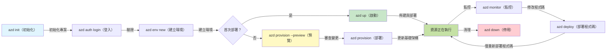

# AZD Basics - Understanding Azure Developer CLI

# AZD Basics - Core Concepts and Fundamentals

**章節導覽:**
- **📚 課程首頁**: [AZD For Beginners](../../README.md)
- **📖 目前章節**: 第 1 章 - 基礎與快速入門
- **⬅️ 上一章**: [Course Overview](../../README.md#-chapter-1-foundation--quick-start)
- **➡️ 下一章**: [Installation & Setup](installation.md)
- **🚀 下一章節**: [Chapter 2: AI-First Development](../chapter-02-ai-development/microsoft-foundry-integration.md)

## 介紹

本課程介紹 Azure Developer CLI (azd)，這是一個強大的命令列工具，可加速您從本地開發到 Azure 部署的流程。您將學習基本概念、核心功能，並了解 azd 如何簡化雲端原生應用程式的部署。

## 學習目標

完成本課程後，您將能夠：
- 了解 Azure Developer CLI 是什麼及其主要用途
- 學習範本、環境與服務的核心概念
- 探索包含範本驅動開發與基礎設施即代碼的關鍵功能
- 了解 azd 專案結構與工作流程
- 準備安裝與設定 azd 以用於您的開發環境

## 預期學習成效

完成本課程後，您將能夠：
- 解釋 azd 在現代雲端開發工作流程中的角色
- 辨識 azd 專案結構的組成元件
- 描述範本、環境與服務如何協同運作
- 了解使用 azd 的基礎設施即代碼的好處
- 辨識不同的 azd 指令及其用途

## 什麼是 Azure Developer CLI (azd)?

Azure Developer CLI (azd) 是一個命令列工具，旨在加速您從本地開發到 Azure 部署的歷程。它簡化在 Azure 上構建、部署與管理雲端原生應用程式的流程。

### 🎯 為什麼要使用 AZD？真實情境比較

讓我們比較部署一個有資料庫的簡單 Web 應用程式：

#### ❌ 未使用 AZD：手動 Azure 部署（30 分鐘以上）

```bash
# 第1步：建立資源群組
az group create --name myapp-rg --location eastus

# 第2步：建立 App Service 計劃
az appservice plan create --name myapp-plan \
  --resource-group myapp-rg \
  --sku B1 --is-linux

# 第3步：建立 Web 應用程式
az webapp create --name myapp-web-unique123 \
  --resource-group myapp-rg \
  --plan myapp-plan \
  --runtime "NODE:18-lts"

# 第4步：建立 Cosmos DB 帳戶（約10–15分鐘）
az cosmosdb create --name myapp-cosmos-unique123 \
  --resource-group myapp-rg \
  --kind MongoDB

# 第5步：建立資料庫
az cosmosdb mongodb database create \
  --account-name myapp-cosmos-unique123 \
  --resource-group myapp-rg \
  --name tododb

# 第6步：建立集合
az cosmosdb mongodb collection create \
  --account-name myapp-cosmos-unique123 \
  --resource-group myapp-rg \
  --database-name tododb \
  --name todos

# 第7步：取得連線字串
CONN_STR=$(az cosmosdb keys list \
  --name myapp-cosmos-unique123 \
  --resource-group myapp-rg \
  --type connection-strings \
  --query "connectionStrings[0].connectionString" -o tsv)

# 第8步：設定應用程式設定
az webapp config appsettings set \
  --name myapp-web-unique123 \
  --resource-group myapp-rg \
  --settings MONGODB_URI="$CONN_STR"

# 第9步：啟用日誌記錄
az webapp log config --name myapp-web-unique123 \
  --resource-group myapp-rg \
  --application-logging filesystem \
  --detailed-error-messages true

# 第10步：設定 Application Insights
az monitor app-insights component create \
  --app myapp-insights \
  --location eastus \
  --resource-group myapp-rg

# 第11步：將 Application Insights 連結至 Web 應用程式
INSTRUMENTATION_KEY=$(az monitor app-insights component show \
  --app myapp-insights \
  --resource-group myapp-rg \
  --query "instrumentationKey" -o tsv)

az webapp config appsettings set \
  --name myapp-web-unique123 \
  --resource-group myapp-rg \
  --settings APPINSIGHTS_INSTRUMENTATIONKEY="$INSTRUMENTATION_KEY"

# 第12步：在本機建置應用程式
npm install
npm run build

# 第13步：建立部署封包
zip -r app.zip . -x "*.git*" "node_modules/*"

# 第14步：部署應用程式
az webapp deployment source config-zip \
  --resource-group myapp-rg \
  --name myapp-web-unique123 \
  --src app.zip

# 第15步：等候並祈禱它能順利運作 🙏
# （無自動化驗證，需手動測試）
```

**問題：**
- ❌ 需要記住並依序執行 15+ 個指令
- ❌ 需花 30-45 分鐘的手動操作
- ❌ 容易出錯（打字錯誤、參數錯誤）
- ❌ 連線字串會暴露在終端機歷史紀錄中
- ❌ 若發生錯誤沒有自動還原機制
- ❌ 團隊成員難以複製相同流程
- ❌ 每次都不同（不可重現）

#### ✅ 使用 AZD：自動化部署（5 個指令，10-15 分鐘）

```bash
# 步驟 1：從範本初始化
azd init --template todo-nodejs-mongo

# 步驟 2：驗證
azd auth login

# 步驟 3：建立環境
azd env new dev

# 步驟 4：預覽變更（可選，但建議執行）
azd provision --preview

# 步驟 5：部署所有內容
azd up

# ✨ 完成！所有內容已部署、設定並受到監控
```

**好處：**
- ✅ **5 個指令** 對比 15+ 個手動步驟
- ✅ **10-15 分鐘** 總時間（大多為等待 Azure）
- ✅ **零錯誤** - 自動化且經測試
- ✅ **機密安全管理** 透過 Key Vault
- ✅ **失敗時自動回滾**
- ✅ **完全可重現** - 每次結果相同
- ✅ **團隊就緒** - 任何人都能用相同指令進行部署
- ✅ **基礎設施即代碼** - Bicep 範本受版本控制
- ✅ **內建監控** - 自動配置 Application Insights

### 📊 時間與錯誤減少

| 指標 | 手動部署 | AZD 部署 | 改善 |
|:-------|:------------------|:---------------|:------------|
| **Commands** | 15+ | 5 | 67% fewer |
| **Time** | 30-45 min | 10-15 min | 60% faster |
| **Error Rate** | ~40% | <5% | 88% reduction |
| **Consistency** | Low (manual) | 100% (automated) | Perfect |
| **Team Onboarding** | 2-4 hours | 30 minutes | 75% faster |
| **Rollback Time** | 30+ min (manual) | 2 min (automated) | 93% faster |

## 核心概念

### 範本
範本是 azd 的基礎。它們包含：
- **應用程式程式碼** - 您的原始程式碼與相依性
- **基礎設施定義** - 以 Bicep 或 Terraform 定義的 Azure 資源
- **設定檔** - 設定與環境變數
- **部署腳本** - 自動化部署工作流程

### 環境
環境代表不同的部署目標：
- **開發（Development）** - 用於測試與開發
- **預演（Staging）** - 預生產環境
- **生產（Production）** - 真正的生產環境

每個環境維護其各自的：
- Azure 資源群組
- 設定設定
- 部署狀態

### 服務
服務是您應用程式的構建模組：
- **前端（Frontend）** - 網頁應用、單頁應用（SPA）
- **後端（Backend）** - API、微服務
- **資料庫（Database）** - 資料儲存解決方案
- **儲存（Storage）** - 檔案與 Blob 儲存

## 主要功能

### 1. 範本驅動開發
```bash
# 瀏覽可用的範本
azd template list

# 從範本初始化
azd init --template <template-name>
```

### 2. 基礎設施即代碼
- **Bicep** - Azure 的領域專用語言
- **Terraform** - 跨雲的基礎設施工具
- **ARM Templates** - Azure Resource Manager 範本

### 3. 整合工作流程
```bash
# 完整部署工作流程
azd up            # 配置 + 部署：首次設定時無需人手介入

# 🧪 新功能：在部署前預覽基礎架構變更（安全）
azd provision --preview    # 模擬基礎架構部署而不進行變更

azd provision     # 如果您更新基礎架構，使用此操作來建立 Azure 資源
azd deploy        # 部署應用程式程式碼，或在更新後重新部署應用程式程式碼
azd down          # 清理資源
```

#### 🛡️ 使用預覽進行安全的基礎設施規劃
`azd provision --preview` 指令對於安全部署是個改變遊戲規則的功能：
- **乾跑分析** - 顯示將會建立、修改或刪除的項目
- **零風險** - 不會對您的 Azure 環境做出實際更動
- **團隊協作** - 在部署前分享預覽結果
- **成本估算** - 在承諾前了解資源成本

```bash
# 範例預覽工作流程
azd provision --preview           # 檢視將會變更的內容
# 檢視輸出，與團隊討論
azd provision                     # 有信心地套用變更
```

### 📊 視覺化：AZD 開發工作流程


**工作流程說明：**
1. **Init** - 從範本或新專案開始
2. **Auth** - 與 Azure 驗證
3. **Environment** - 建立隔離的部署環境
4. **Preview** - 🆕 始終先預覽基礎設施變更（安全做法）
5. **Provision** - 建立/更新 Azure 資源
6. **Deploy** - 推送您的應用程式程式碼
7. **Monitor** - 觀察應用程式效能
8. **Iterate** - 進行修改並重新部署程式碼
9. **Cleanup** - 完成後移除資源

### 4. 環境管理
```bash
# 建立及管理環境
azd env new <environment-name>
azd env select <environment-name>
azd env list
```

## 📁 專案結構

典型的 azd 專案結構：
```
my-app/
├── .azd/                    # azd configuration
│   └── config.json
├── .azure/                  # Azure deployment artifacts
├── .devcontainer/          # Development container config
├── .github/workflows/      # GitHub Actions
├── .vscode/               # VS Code settings
├── infra/                 # Infrastructure code
│   ├── main.bicep        # Main infrastructure template
│   ├── main.parameters.json
│   └── modules/          # Reusable modules
├── src/                  # Application source code
│   ├── api/             # Backend services
│   └── web/             # Frontend application
├── azure.yaml           # azd project configuration
└── README.md
```

## 🔧 設定檔

### azure.yaml
主要的專案設定檔：
```yaml
name: my-awesome-app
metadata:
  template: my-template@1.0.0

services:
  web:
    project: ./src/web
    language: js
    host: appservice
  api:
    project: ./src/api
    language: js
    host: appservice

hooks:
  preprovision:
    shell: pwsh
    run: echo "Preparing to provision..."
```

### .azure/config.json
環境特定的設定：
```json
{
  "version": 1,
  "defaultEnvironment": "dev",
  "environments": {
    "dev": {
      "subscriptionId": "your-subscription-id",
      "location": "eastus"
    }
  }
}
```

## 🎪 常見工作流程與實作練習

> **💡 學習小提示：** 按順序完成這些練習，以循序漸進建立您的 AZD 技能。

### 🎯 練習 1：初始化您的第一個專案

**目標：** 建立一個 AZD 專案並探索其結構

**步驟：**
```bash
# 使用已證明可靠的範本
azd init --template todo-nodejs-mongo

# 瀏覽已產生的檔案
ls -la  # 檢視所有檔案（包括隱藏檔）

# 建立的主要檔案：
# - azure.yaml（主要設定檔）
# - infra/（基礎架構程式碼）
# - src/（應用程式原始碼）
```

**✅ 成功標準：** 您會有 azure.yaml、infra/ 與 src/ 目錄

---

### 🎯 練習 2：部署到 Azure

**目標：** 完成端對端部署

**步驟：**
```bash
# 1. 驗證身分
az login && azd auth login

# 2. 建立環境
azd env new dev
azd env set AZURE_LOCATION eastus

# 3. 預覽變更（建議）
azd provision --preview

# 4. 部署所有內容
azd up

# 5. 驗證部署
azd show    # 查看您的應用程式網址
```

**預計時間：** 10-15 分鐘  
**✅ 成功標準：** 應用程式網址可在瀏覽器中開啟

---

### 🎯 練習 3：多環境部署

**目標：** 部署到 dev 與 staging

**步驟：**
```bash
# 已經有 dev，建立 staging
azd env new staging
azd env set AZURE_LOCATION westus2
azd up

# 在它們之間切換
azd env list
azd env select dev
```

**✅ 成功標準：** Azure 入口網站中有兩個獨立的資源群組

---

### 🛡️ 清除環境：`azd down --force --purge`

當您需要完全重置時：

```bash
azd down --force --purge
```

**它的作用：**
- `--force`: 不會出現確認提示
- `--purge`: 刪除所有本機狀態與 Azure 資源

**使用情境：**
- 部署中途失敗
- 變更專案
- 需要全新開始

---

## 🎪 原始工作流程參考

### 開始一個新專案
```bash
# 方法 1: 使用現有範本
azd init --template todo-nodejs-mongo

# 方法 2: 從頭開始
azd init

# 方法 3: 使用目前目錄
azd init .
```

### 開發週期
```bash
# 設定開發環境
azd auth login
azd env new dev
azd env select dev

# 部署所有資源
azd up

# 進行變更並重新部署
azd deploy

# 完成後清理
azd down --force --purge # 在 Azure Developer CLI 中，此命令會對你的環境執行 **徹底重置**—在你排查失敗的部署、清理孤立資源或準備重新部署時特別有用。
```

## 了解 `azd down --force --purge`
`azd down --force --purge` 指令是完全拆除您的 azd 環境與所有相關資源的強大方式。以下是各旗標的功能說明：
```
--force
```
- 跳過確認提示。
- 適用於自動化或腳本化情境，無法進行手動輸入時。
- 確保拆除過程不中斷，即使 CLI 偵測到不一致情況。

```
--purge
```
刪除 **所有相關的 metadata**，包括：
環境狀態
本機 `.azure` 資料夾
快取的部署資訊
避免 azd 「記住」先前的部署，這可能導致像是資源群組不匹配或過時的註冊參考等問題。


### 為何同時使用兩個旗標？
當您因為殘留狀態或部分部署導致 `azd up` 無法繼續時，這組組合可確保一個 **乾淨的起點**。

在您於 Azure 入口網站手動刪除資源後，或切換範本、環境或資源群組命名慣例時，這尤其有用。


### 管理多個環境
```bash
# 建立暫存環境
azd env new staging
azd env select staging
azd up

# 切換回開發環境
azd env select dev

# 比較環境
azd env list
```

## 🔐 驗證與憑證

了解驗證對成功的 azd 部署至關重要。Azure 使用多種驗證方法，而 azd 利用與其他 Azure 工具相同的憑證鏈。

### Azure CLI 驗證（`az login`）

在使用 azd 前，您需要先對 Azure 進行驗證。最常見的方法是使用 Azure CLI：

```bash
# 互動登入（會開啟瀏覽器）
az login

# 使用指定租戶登入
az login --tenant <tenant-id>

# 使用服務主體登入
az login --service-principal -u <app-id> -p <password> --tenant <tenant-id>

# 檢查目前登入狀態
az account show

# 列出可用的訂閱
az account list --output table

# 設定預設訂閱
az account set --subscription <subscription-id>
```

### 驗證流程
1. **互動式登入**：開啟您預設的瀏覽器進行驗證
2. **裝置代碼流程**：用於沒有瀏覽器的環境
3. **服務主體（Service Principal）**：用於自動化與 CI/CD 場景
4. **託管識別（Managed Identity）**：用於在 Azure 上執行的應用程式

### DefaultAzureCredential 鏈

`DefaultAzureCredential` 是一種憑證類型，透過按特定順序自動嘗試多種憑證來源，提供簡化的驗證體驗：

#### 憑證鏈順序

#### 1. 環境變數
```bash
# 為服務主體設定環境變數
export AZURE_CLIENT_ID="<app-id>"
export AZURE_CLIENT_SECRET="<password>"
export AZURE_TENANT_ID="<tenant-id>"
```

#### 2. 工作負載識別（Kubernetes/GitHub Actions）
自動在以下情境中使用：
- 使用工作負載識別的 Azure Kubernetes Service (AKS)
- 具有 OIDC 聯合的 GitHub Actions
- 其他聯合識別情境

#### 3. 託管識別
適用於像是下列的 Azure 資源：
- 虛擬機（Virtual Machines）
- App Service
- Azure Functions
- Container Instances

```bash
# 檢查是否在具有受管身分的 Azure 資源上執行
az account show --query "user.type" --output tsv
# 回傳: "servicePrincipal" 如果使用受管身分
```

#### 4. 開發工具整合
- **Visual Studio**：自動使用已登入的帳戶
- **VS Code**：使用 Azure Account 擴充套件的憑證
- **Azure CLI**：使用 `az login` 的憑證（本地開發最常見）

### AZD 驗證設定

```bash
# 方法 1：使用 Azure CLI（建議用於開發）
az login
azd auth login  # 使用現有的 Azure CLI 憑證

# 方法 2：直接使用 azd 進行驗證
azd auth login --use-device-code  # 適用於無頭環境

# 方法 3：檢查驗證狀態
azd auth login --check-status

# 方法 4：登出並重新驗證
azd auth logout
azd auth login
```

### 驗證最佳實務

#### 本地開發
```bash
# 1. 使用 Azure CLI 登入
az login

# 2. 驗證所選訂閱是否正確
az account show
az account set --subscription "Your Subscription Name"

# 3. 使用現有憑證搭配 azd
azd auth login
```

#### CI/CD 管線
```yaml
# GitHub Actions example
- name: Azure Login
  uses: azure/login@v1
  with:
    creds: ${{ secrets.AZURE_CREDENTIALS }}

- name: Deploy with azd
  run: |
    azd auth login --client-id ${{ secrets.AZURE_CLIENT_ID }} \
                    --client-secret ${{ secrets.AZURE_CLIENT_SECRET }} \
                    --tenant-id ${{ secrets.AZURE_TENANT_ID }}
    azd up --no-prompt
```

#### 生產環境
- 在 Azure 資源上執行時，使用 **託管識別（Managed Identity）**
- 在自動化情境中，使用 **服務主體（Service Principal）**
- 避免在程式碼或設定檔中儲存憑證
- 對敏感設定使用 **Azure Key Vault**

### 常見驗證問題與解決方案

#### 問題：「找不到訂閱」
```bash
# 解決方案：設定預設訂閱
az account list --output table
az account set --subscription "<subscription-id>"
azd env set AZURE_SUBSCRIPTION_ID "<subscription-id>"
```

#### 問題：「權限不足」
```bash
# 解決方案：檢查並指派所需角色
az role assignment list --assignee $(az account show --query user.name --output tsv)

# 常見的所需角色：
# - 參與者（用於資源管理）
# - 使用者存取管理員（用於角色指派）
```

#### 問題：「權杖過期」
```bash
# 解決方法：重新驗證
az logout
az login
azd auth logout
azd auth login
```

### 不同情境下的驗證

#### 本地開發
```bash
# 個人發展帳戶
az login
azd auth login
```

#### 團隊開發
```bash
# 為組織使用特定租戶
az login --tenant contoso.onmicrosoft.com
azd auth login
```

#### 多租戶情境
```bash
# 在租戶之間切換
az login --tenant tenant1.onmicrosoft.com
# 部署到租戶 1
azd up

az login --tenant tenant2.onmicrosoft.com  
# 部署到租戶 2
azd up
```

### 安全性注意事項

1. **憑證儲存**：切勿在原始碼中儲存憑證
2. **範圍限制**：對服務主體使用最小權限原則
3. **密鑰輪換**：定期輪換服務主體的密碼/金鑰
4. **稽核追蹤**：監控驗證與部署活動
5. **網路安全**：盡可能使用私有端點

### 驗證疑難排解

```bash
# 除錯認證問題
azd auth login --check-status
az account show
az account get-access-token

# 常用診斷指令
whoami                          # 目前使用者上下文
az ad signed-in-user show      # Azure AD 使用者詳情
az group list                  # 測試資源存取
```

## 了解 `azd down --force --purge`

### 偵測
```bash
azd template list              # 瀏覽範本
azd template show <template>   # 範本詳情
azd init --help               # 初始化選項
```

### 專案管理
```bash
azd show                     # 專案概覽
azd env show                 # 當前環境
azd config list             # 配置設定
```

### 監控
```bash
azd monitor                  # 開啟 Azure 入口網站的監控
azd monitor --logs           # 檢視應用程式日誌
azd monitor --live           # 檢視即時指標
azd pipeline config          # 設定 CI/CD
```

## 最佳實務

### 1. 使用有意義的名稱
```bash
# 好
azd env new production-east
azd init --template web-app-secure

# 避免
azd env new env1
azd init --template template1
```

### 2. 充分利用範本
- 從現有範本開始
- 根據需求自訂
- 為您的組織建立可重用範本

### 3. 環境隔離
- 為 dev/staging/prod 使用獨立環境
- 切勿直接從本機機器部署到生產環境
- 對生產部署使用 CI/CD 管線

### 4. 設定管理
- 對敏感資料使用環境變數
- 將設定保存在版本控制中
- 記錄環境特定的設定

## 學習進程

### 初學者（第 1-2 週）
1. 安裝 azd 並進行驗證
2. 部署一個簡單的範本
3. 了解專案結構
4. 學習基本指令（up、down、deploy）

### 中階（第 3-4 週）
1. 自訂範本
2. 管理多個環境
3. 了解基礎設施程式碼
4. 設定 CI/CD 管線

### 進階（第 5 週以上）
1. 建立自訂範本
2. 進階基礎設施設計模式
3. 跨區域部署
4. 企業等級配置

## 下一步

**📖 繼續第 1 章學習：**
- [安裝與設定](installation.md) - 在本機安裝並設定 azd
- [您的第一個專案](first-project.md) - 完整的實作教學
- [設定指南](configuration.md) - 進階設定選項

**🎯 準備好前往下一章了嗎？**
- [第 2 章：AI 優先開發](../chapter-02-ai-development/microsoft-foundry-integration.md) - 開始構建 AI 應用程式

## 額外資源

- [Azure Developer CLI 概覽](https://learn.microsoft.com/en-us/azure/developer/azure-developer-cli/)
- [範本畫廊](https://azure.github.io/awesome-azd/)
- [社群範例](https://github.com/Azure-Samples)

---

## 🙋 常見問題

### 一般問題

**Q: AZD 和 Azure CLI 有什麼不同？**

A: Azure CLI (`az`) 是用來管理單一的 Azure 資源。AZD (`azd`) 是用來管理整個應用程式：
```bash
# Azure CLI - 低階資源管理
az webapp create --name myapp --resource-group rg
az sql server create --name myserver --resource-group rg
# ...還需要更多指令

# AZD - 應用程式層級管理
azd up  # 部署整個應用程式及其所有資源
```

**可以這樣想：**
- `az` = 操作單個樂高積木
- `azd` = 處理完整的樂高套組

---

**Q: 我需要知道 Bicep 或 Terraform 才能使用 AZD 嗎？**

A: 不需要！從範本開始：
```bash
# 使用現有範本 - 無需 IaC 知識
azd init --template todo-nodejs-mongo
azd up
```

您可以稍後學習 Bicep 來自訂基礎架構。範本提供可實作的範例以供學習。

---

**Q: 執行 AZD 範本需要多少費用？**

A: 費用視範本而異。大多數開發範本每月花費約 $50-150：
```bash
# 部署前預覽費用
azd provision --preview

# 不使用時務必清理
azd down --force --purge  # 移除所有資源
```

**專業提示：** 在可用時使用免費等級：
- App Service: F1 (免費) 等級
- Azure OpenAI: 每月 50,000 tokens 免費
- Cosmos DB: 1000 RU/s 免費等級

---

**Q: 我可以將 AZD 與現有的 Azure 資源一起使用嗎？**

A: 可以，但從頭開始比較簡單。AZD 在管理完整生命週期時效果最佳。對於現有資源：
```bash
# 選項 1：匯入現有資源（進階）
azd init
# 然後修改 infra/ 以參照現有資源

# 選項 2：從頭開始（建議）
azd init --template matching-your-stack
azd up  # 建立新環境
```

---

**Q: 我如何與隊友分享我的專案？**

A: 將 AZD 專案提交到 Git（但不要提交 .azure 資料夾）：
```bash
# 預設已包含在 .gitignore 中
.azure/        # 包含機密與環境資料
*.env          # 環境變數

# 當時的團隊成員：
git clone <your-repo>
azd auth login
azd env new <their-name>-dev
azd up
```

每個人都能從相同的範本獲得一致的基礎架構。

---

### 疑難排解問題

**Q: "azd up" 執行到一半失敗。我該怎麼辦？**

A: 檢查錯誤、修正，然後重試：
```bash
# 檢視詳細日誌
azd show

# 常見修復:

# 1. 若配額超出:
azd env set AZURE_LOCATION "westus2"  # 嘗試不同區域

# 2. 若資源名稱衝突:
azd down --force --purge  # 重置為初始狀態
azd up  # 重試

# 3. 若認證已過期:
az login
azd auth login
azd up
```

**最常見的問題：** 選擇了錯誤的 Azure 訂閱
```bash
az account list --output table
az account set --subscription "<correct-subscription>"
```

---

**Q: 我如何只部署程式碼變更而不重新配置資源？**

A: 使用 `azd deploy` 取代 `azd up`：
```bash
azd up          # 第一次：建立資源 + 部署（較慢）

# 修改程式碼...

azd deploy      # 之後：僅部署（較快）
```

速度比較：
- `azd up`: 10-15 分鐘（佈建基礎架構）
- `azd deploy`: 2-5 分鐘（僅程式碼）

---

**Q: 我可以自訂基礎架構範本嗎？**

A: 可以！編輯 `infra/` 裡的 Bicep 檔案：
```bash
# 執行 azd init 之後
cd infra/
code main.bicep  # 在 VS Code 中編輯

# 預覽變更
azd provision --preview

# 套用變更
azd provision
```

**提示：** 從小處開始 - 先更改 SKUs：
```bicep
// infra/main.bicep
sku: {
  name: 'B1'  // Change to 'P1V2' for production
}
```

---

**Q: 我如何刪除 AZD 所建立的所有資源？**

A: 一個指令可以移除所有資源：
```bash
azd down --force --purge

# 這會刪除：
# - 所有 Azure 資源
# - 資源群組
# - 本地環境狀態
# - 快取的部署資料
```

**在下列情況下務必執行：**
- 完成範本測試時
- 切換到不同專案時
- 想重新開始時

**節省成本：** 刪除未使用的資源 = $0 費用

---

**Q: 如果我不小心在 Azure 入口網站刪除了資源怎麼辦？**

A: AZD 的狀態可能會不同步。採取清理重置的方法：
```bash
# 1. 移除本地狀態
azd down --force --purge

# 2. 從頭開始
azd up

# 替代方案：讓 AZD 偵測並修復
azd provision  # 會建立缺少的資源
```

---

### 進階問題

**Q: 我可以在 CI/CD 管線中使用 AZD 嗎？**

A: 可以！GitHub Actions 範例：
```yaml
# .github/workflows/deploy.yml
name: Deploy with AZD

on:
  push:
    branches: [main]

jobs:
  deploy:
    runs-on: ubuntu-latest
    steps:
      - uses: actions/checkout@v2
      
      - name: Install azd
        run: curl -fsSL https://aka.ms/install-azd.sh | bash
      
      - name: Azure Login
        run: |
          azd auth login \
            --client-id ${{ secrets.AZURE_CLIENT_ID }} \
            --client-secret ${{ secrets.AZURE_CLIENT_SECRET }} \
            --tenant-id ${{ secrets.AZURE_TENANT_ID }}
      
      - name: Deploy
        run: azd up --no-prompt
```

---

**Q: 我該如何處理祕密和敏感資料？**

A: AZD 會自動整合 Azure Key Vault：
```bash
# 機密儲存在 Key Vault，而不是程式碼中
azd env set DATABASE_PASSWORD "$(openssl rand -base64 32)"

# AZD 會自動：
# 1. 建立 Key Vault
# 2. 儲存機密
# 3. 透過受管身分識別 (Managed Identity) 授予應用程式存取權
# 4. 在執行時注入
```

**絕對不要提交：**
- `.azure/` 資料夾（包含環境資料）
- `.env` 檔案（本機祕密）
- 連線字串

---

**Q: 我可以部署到多個區域嗎？**

A: 可以，為每個區域建立環境：
```bash
# 美國東部環境
azd env new prod-eastus
azd env set AZURE_LOCATION eastus
azd up

# 西歐環境
azd env new prod-westeurope
azd env set AZURE_LOCATION westeurope
azd up

# 每個環境彼此獨立
azd env list
```

若要建立真正的多區域應用程式，請自訂 Bicep 範本以同時部署到多個區域。

---

**Q: 如果卡住了，我可以在哪裡尋求協助？**

1. **AZD 文件：** https://learn.microsoft.com/azure/developer/azure-developer-cli/
2. **GitHub Issues：** https://github.com/Azure/azure-dev/issues
3. **Discord：** [Azure Discord](https://discord.gg/microsoft-azure) - #azure-developer-cli 頻道
4. **Stack Overflow：** 標籤 `azure-developer-cli`
5. **本課程：** [疑難排解指南](../chapter-07-troubleshooting/common-issues.md)

**專業提示：** 在提問前，執行：
```bash
azd show       # 顯示目前狀態
azd version    # 顯示您的版本
```
包含此資訊以便更快獲得協助。

---

## 🎓 下一步？

您現在已了解 AZD 的基礎。選擇您的路徑：

### 🎯 初學者：
1. **下一步：** [安裝與設定](installation.md) - 在您的機器上安裝 AZD
2. **接著：** [您的第一個專案](first-project.md) - 部署您的第一個應用程式
3. **實作練習：** 完成本課所有 3 個練習

### 🚀 AI 開發者：
1. **跳到：** [第 2 章：AI 優先開發](../chapter-02-ai-development/microsoft-foundry-integration.md)
2. **部署：** 從 `azd init --template get-started-with-ai-chat` 開始
3. **學習：** 一邊部署一邊學習

### 🏗️ 進階開發者：
1. **檢視：** [設定指南](configuration.md) - 進階設定
2. **探索：** [基礎架構即程式碼](../chapter-04-infrastructure/provisioning.md) - Bicep 深入解析
3. **構建：** 為您的技術棧建立自訂範本

---

**章節導覽：**
- **📚 課程首頁**: [AZD For Beginners](../../README.md)
- **📖 目前章節**: 第 1 章 - 基礎與快速上手  
- **⬅️ 上一步**: [課程概覽](../../README.md#-chapter-1-foundation--quick-start)
- **➡️ 下一步**: [安裝與設定](installation.md)
- **🚀 下一章**: [第 2 章：AI 優先開發](../chapter-02-ai-development/microsoft-foundry-integration.md)

---

<!-- CO-OP TRANSLATOR DISCLAIMER START -->
免責聲明：

本文件已使用 AI 翻譯服務 Co-op Translator (https://github.com/Azure/co-op-translator) 進行翻譯。雖然我們致力於維持準確性，但請注意自動翻譯可能包含錯誤或不準確之處。原始語言版本應視為具權威性的參考資料。對於重要資訊，建議採用專業人工翻譯。我們不對因使用本翻譯而引致的任何誤解或錯誤詮釋負責。
<!-- CO-OP TRANSLATOR DISCLAIMER END -->