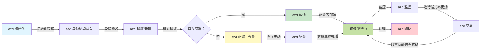
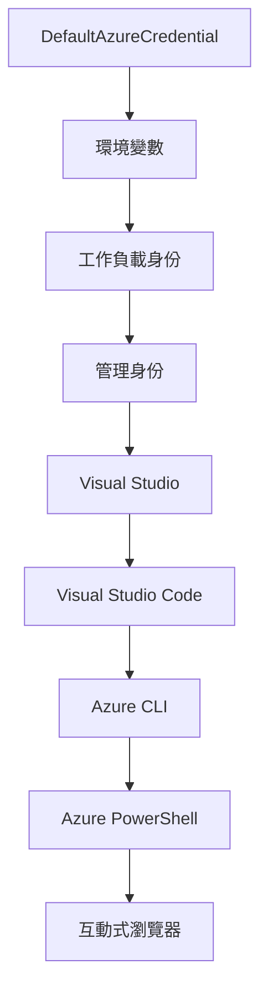

# AZD 基礎 - 認識 Azure Developer CLI

# AZD 基礎 - 核心概念與基本原理

**章節導覽：**
- **📚 課程首頁**：[AZD 新手入門](../../README.md)
- **📖 本章節**：第一章 - 基礎與快速開始
- **⬅️ 上一章**：[課程總覽](../../README.md#-chapter-1-foundation--quick-start)
- **➡️ 下一章**：[安裝與設定](installation.md)
- **🚀 下一章節**：[第二章：AI 優先開發](../chapter-02-ai-development/microsoft-foundry-integration.md)

## 簡介

本課程將介紹 Azure Developer CLI（azd），這是一款強大的命令列工具，可加速您從本地開發到 Azure 部署的旅程。您將學習基礎概念、核心功能，並了解 azd 如何簡化雲端原生應用的部署。

## 學習目標

完成本課後，您將能夠：
- 了解什麼是 Azure Developer CLI 及其主要目的
- 學習範本、環境和服務的核心概念
- 探索範本驅動開發與基礎設施即程式碼等主要功能
- 了解 azd 的專案結構與工作流程
- 準備安裝和設定 azd，以建立開發環境

## 學習成果

完成本課程後，您將能夠：
- 解釋 azd 在現代雲端開發工作流程中的角色
- 辨識 azd 專案結構的組成元件
- 描述範本、環境和服務如何協同運作
- 理解使用 azd 的基礎設施即程式碼的好處
- 辨識不同 azd 指令及其用途

## 什麼是 Azure Developer CLI (azd)？

Azure Developer CLI（azd）是一款命令列工具，旨在加速您從本地開發到 Azure 部署的轉變。它簡化了在 Azure 上建置、部署和管理雲端原生應用的流程。

### azd 可部署什麼？

azd 支援多種工作負載，且清單持續擴充。如今，您可以使用 azd 部署：

| 工作負載類型 | 範例 | 相同工作流程？ |
|--------------|-------|---------------|
| <strong>傳統應用程式</strong> | 網頁應用、REST API、靜態網站 | ✅ `azd up` |
| <strong>服務與微服務</strong> | 容器應用、函式應用、多服務後端 | ✅ `azd up` |
| **AI 驅動應用** | 使用 Microsoft Foundry 模型的聊天應用、結合 AI 搜尋的 RAG 解決方案 | ✅ `azd up` |
| <strong>智能代理</strong> | Foundry 托管代理、多代理協同 | ✅ `azd up` |

關鍵在於，**azd 生命週期無論您部署什麼都保持相同**。您初始化專案、佈建基礎設施、部署程式碼、監控應用並清理資源——不論是簡單網站或複雜 AI 代理皆如是。

這是刻意設計的。azd 將 AI 功能視為應用可以使用的另一種服務，而不是根本不同的東西。從 azd 角度看，使用 Microsoft Foundry 模型支援的聊天端點，只是另一項要配置和部署的服務。

### 🎯 為什麼用 AZD？實際比較

讓我們比較部署簡單的網頁應用和資料庫：

#### ❌ 沒有 AZD：手動 Azure 部署（30+ 分鐘）

```bash
# 第一步：建立資源群組
az group create --name myapp-rg --location eastus

# 第二步：建立應用服務計劃
az appservice plan create --name myapp-plan \
  --resource-group myapp-rg \
  --sku B1 --is-linux

# 第三步：建立網頁應用程式
az webapp create --name myapp-web-unique123 \
  --resource-group myapp-rg \
  --plan myapp-plan \
  --runtime "NODE:18-lts"

# 第四步：建立 Cosmos DB 帳戶（10-15 分鐘）
az cosmosdb create --name myapp-cosmos-unique123 \
  --resource-group myapp-rg \
  --kind MongoDB

# 第五步：建立資料庫
az cosmosdb mongodb database create \
  --account-name myapp-cosmos-unique123 \
  --resource-group myapp-rg \
  --name tododb

# 第六步：建立集合
az cosmosdb mongodb collection create \
  --account-name myapp-cosmos-unique123 \
  --resource-group myapp-rg \
  --database-name tododb \
  --name todos

# 第七步：取得連接字串
CONN_STR=$(az cosmosdb keys list \
  --name myapp-cosmos-unique123 \
  --resource-group myapp-rg \
  --type connection-strings \
  --query "connectionStrings[0].connectionString" -o tsv)

# 第八步：設定應用程式設定
az webapp config appsettings set \
  --name myapp-web-unique123 \
  --resource-group myapp-rg \
  --settings MONGODB_URI="$CONN_STR"

# 第九步：啟用記錄功能
az webapp log config --name myapp-web-unique123 \
  --resource-group myapp-rg \
  --application-logging filesystem \
  --detailed-error-messages true

# 第十步：設定 Application Insights
az monitor app-insights component create \
  --app myapp-insights \
  --location eastus \
  --resource-group myapp-rg

# 第十一步：將 App Insights 連接至網頁應用程式
INSTRUMENTATION_KEY=$(az monitor app-insights component show \
  --app myapp-insights \
  --resource-group myapp-rg \
  --query "instrumentationKey" -o tsv)

az webapp config appsettings set \
  --name myapp-web-unique123 \
  --resource-group myapp-rg \
  --settings APPINSIGHTS_INSTRUMENTATIONKEY="$INSTRUMENTATION_KEY"

# 第十二步：在本機端建置應用程式
npm install
npm run build

# 第十三步：建立部署封包
zip -r app.zip . -x "*.git*" "node_modules/*"

# 第十四步：部署應用程式
az webapp deployment source config-zip \
  --resource-group myapp-rg \
  --name myapp-web-unique123 \
  --src app.zip

# 第十五步：等待並祈禱它能正常運作 🙏
# （無自動驗證，需要手動測試）
```

**問題：**
- ❌ 需要記住並按順序執行 15+ 個指令
- ❌ 30-45 分鐘手動操作
- ❌ 容易出錯（打字錯誤、參數錯誤）
- ❌ 連線字串暴露於終端歷史中
- ❌ 無失敗自動回滾
- ❌ 難以供團隊成員複製
- ❌ 每次不一樣（不可重複）

#### ✅ 使用 AZD：自動化部署（5 個指令，10-15 分鐘）

```bash
# 第一步：從範本初始化
azd init --template todo-nodejs-mongo

# 第二步：驗證身份
azd auth login

# 第三步：建立環境
azd env new dev

# 第四步：預覽變更（可選但建議）
azd provision --preview

# 第五步：全面部署
azd up

# ✨ 完成！所有東西已部署、配置及監控
```

**效益：**
- ✅ **5 個指令**，比 15+ 手動步驟少很多
- ✅ **10-15 分鐘** 執行時間（大多在等待 Azure）
- ✅ <strong>減少手動錯誤</strong> - 一致的範本驅動工作流程
- ✅ <strong>安全的秘密管理</strong> - 多數範本使用 Azure 管理的秘密儲存
- ✅ <strong>可重複部署</strong> - 每次相同流程
- ✅ <strong>完全可重現</strong> - 每次結果相同
- ✅ <strong>團隊就緒</strong> - 任何人都能使用相同指令部署
- ✅ <strong>基礎設施即程式碼</strong> - 版本控制的 Bicep 範本
- ✅ <strong>內建監控</strong> - 自動配置 Application Insights

### 📊 時間與錯誤降低

| 指標 | 手動部署 | AZD 部署 | 改進幅度 |
|:------|:---------|:----------|:---------|
| <strong>指令數量</strong> | 15+ | 5 | 減少 67% |
| <strong>時間</strong> | 30-45 分鐘 | 10-15 分鐘 | 快 60% |
| <strong>錯誤率</strong> | 約 40% | <5% | 降低 88% |
| <strong>一致性</strong> | 低（手動） | 100%（自動） | 完美 |
| <strong>團隊上手時間</strong> | 2-4 小時 | 30 分鐘 | 快 75% |
| <strong>回滾時間</strong> | 30+ 分鐘（手動） | 2 分鐘（自動） | 快 93% |

## 核心概念

### 範本
範本是 azd 的基礎。它們包含：
- <strong>應用程式程式碼</strong> - 您的原始碼與依賴
- <strong>基礎設施定義</strong> - 以 Bicep 或 Terraform 定義的 Azure 資源
- <strong>設定檔案</strong> - 設定與環境變數
- <strong>部署腳本</strong> - 自動部署工作流程

### 環境
環境代表不同的部署目標：
- <strong>開發</strong> - 用於測試與開發
- <strong>預備</strong> - 預發佈環境
- <strong>生產</strong> - 實際運行環境

每個環境維護自己的：
- Azure 資源群組
- 設定值
- 部署狀態

### 服務
服務是應用的構件：
- <strong>前端</strong> - 網頁應用、單頁應用
- <strong>後端</strong> - API、微服務
- <strong>資料庫</strong> - 資料儲存解決方案
- <strong>儲存</strong> - 檔案與 Blob 儲存

## 主要功能

### 1. 範本驅動開發
```bash
# 瀏覽可用範本
azd template list

# 從範本初始化
azd init --template <template-name>
```

### 2. 基礎設施即程式碼
- **Bicep** - Azure 專用領域語言
- **Terraform** - 多雲基礎設施工具
- **ARM 範本** - Azure 資源管理員範本

### 3. 整合工作流程
```bash
# 完整部署工作流程
azd up            # 預配 + 部署，首次設置全自動

# 🧪 新增：部署前預覽基礎設施更改（安全）
azd provision --preview    # 模擬基礎設施部署但不更改

azd provision     # 如果更新基礎設施，使用此建立 Azure 資源
azd deploy        # 部署應用程式代碼或更新後重新部署
azd down          # 清理資源
```

#### 🛡️ 安全的基礎設施規劃預覽
`azd provision --preview` 指令是安全部署關鍵：
- <strong>模擬分析</strong> - 顯示將會建立、修改或刪除的內容
- <strong>零風險</strong> - 不會對 Azure 環境做實際更動
- <strong>團隊協作</strong> - 部署前分享預覽結果
- <strong>成本估算</strong> - 了解資源花費再決定

```bash
# 範例預覽工作流程
azd provision --preview           # 查看將會更改的內容
# 審查輸出，與團隊討論
azd provision                     # 有信心地應用更改
```

### 📊 視覺化：AZD 開發工作流程


**工作流程說明：**
1. <strong>初始化</strong> - 從範本或新專案開始
2. <strong>認證</strong> - 登入 Azure
3. <strong>環境</strong> - 建立隔離的部署環境
4. <strong>預覽</strong> - 🆕 永遠先預覽基礎設施變更（安全做法）
5. <strong>佈建</strong> - 建立或更新 Azure 資源
6. <strong>部署</strong> - 推送應用程式程式碼
7. <strong>監控</strong> - 觀察應用效能
8. <strong>迭代</strong> - 變更並重新部署程式碼
9. <strong>清理</strong> - 完成後移除資源

### 4. 環境管理
```bash
# 建立及管理環境
azd env new <environment-name>
azd env select <environment-name>
azd env list
```

### 5. 擴充與 AI 指令

azd 使用擴充系統以增加核心 CLI 之外的功能。AI 工作負載特別受益：

```bash
# 列出可用嘅擴充功能
azd extension list

# 安裝 Foundry agents 擴充功能
azd extension install azure.ai.agents

# 從清單初始化 AI agent 專案
azd ai agent init -m agent-manifest.yaml

# 啟動支援 AI 開發嘅 MCP 伺服器（Alpha 版本）
azd mcp start
```

> 詳細內容請參閱 [第二章：AI 優先開發](../chapter-02-ai-development/agents.md) 及 [AZD AI CLI 指令](../chapter-08-production/production-ai-practices.md#azd-ai-cli-commands-and-extensions) 參考。

## 📁 專案結構

典型的 azd 專案結構：
```
my-app/
├── .azd/                    # azd configuration
│   └── config.json
├── .azure/                  # Azure deployment artifacts
├── .devcontainer/          # Development container config
├── .github/workflows/      # GitHub Actions
├── .vscode/               # VS Code settings
├── infra/                 # Infrastructure code
│   ├── main.bicep        # Main infrastructure template
│   ├── main.parameters.json
│   └── modules/          # Reusable modules
├── src/                  # Application source code
│   ├── api/             # Backend services
│   └── web/             # Frontend application
├── azure.yaml           # azd project configuration
└── README.md
```

## 🔧 設定檔案

### azure.yaml
主要專案設定檔：
```yaml
name: my-awesome-app
metadata:
  template: my-template@1.0.0

services:
  web:
    project: ./src/web
    language: js
    host: appservice
  api:
    project: ./src/api
    language: js
    host: appservice

hooks:
  preprovision:
    shell: pwsh
    run: echo "Preparing to provision..."
```

### .azure/config.json
環境特定設定：
```json
{
  "version": 1,
  "defaultEnvironment": "dev",
  "environments": {
    "dev": {
      "subscriptionId": "your-subscription-id",
      "location": "eastus"
    }
  }
}
```

## 🎪 常見工作流程與實作練習

> **💡 學習提示：** 請依序完成練習，以循序漸進提升您的 AZD 技能。

### 🎯 練習 1：初始化您的第一個專案

**目標：** 建立一個 AZD 專案並探索其結構

**步驟：**
```bash
# 使用已驗證的範本
azd init --template todo-nodejs-mongo

# 探索已生成的檔案
ls -la  # 查看所有檔案，包括隱藏檔案

# 主要建立的檔案：
# - azure.yaml（主要配置）
# - infra/（基礎架構程式碼）
# - src/（應用程式程式碼）
```

**✅ 成功指標：** 您已擁有 azure.yaml、infra/ 與 src/ 目錄

---

### 🎯 練習 2：部署至 Azure

**目標：** 完成端到端部署

**步驟：**
```bash
# 1. 認證
az login && azd auth login

# 2. 創建環境
azd env new dev
azd env set AZURE_LOCATION eastus

# 3. 預覽更改（建議）
azd provision --preview

# 4. 部署所有內容
azd up

# 5. 驗證部署
azd show    # 檢視你的應用程式網址
```

**預期時間：** 10-15 分鐘  
**✅ 成功指標：** 瀏覽器成功開啟應用程式網址

---

### 🎯 練習 3：多環境部署

**目標：** 部署至 dev 和 staging

**步驟：**
```bash
# 已經有開發，創建預備環境
azd env new staging
azd env set AZURE_LOCATION westus2
azd up

# 在它們之間切換
azd env list
azd env select dev
```

**✅ 成功指標：** Azure 入口網站上有兩個獨立資源群組

---

### 🛡️ 重置環境：`azd down --force --purge`

當您需要完全重置時：

```bash
azd down --force --purge
```

**作用：**
- `--force`：無需確認提示
- `--purge`：刪除所有本地狀態與 Azure 資源

**適用時機：**
- 部署中途失敗
- 切換專案
- 需要全新開始

---

## 🎪 原始工作流程參考

### 建立新專案
```bash
# 方法1：使用現有模板
azd init --template todo-nodejs-mongo

# 方法2：從零開始
azd init

# 方法3：使用當前目錄
azd init .
```

### 開發週期
```bash
# 設置開發環境
azd auth login
azd env new dev
azd env select dev

# 部署所有內容
azd up

# 進行更改並重新部署
azd deploy

# 完成後清理
azd down --force --purge # Azure Developer CLI 的命令是您環境的**硬重置** — 特別適用於排解部署失敗、清理孤立資源或準備進行全新重新部署時。
```

## 理解 `azd down --force --purge`
`azd down --force --purge` 是一個強大的命令，用來完全拆除您的 azd 環境及所有相關資源。以下是各旗標的用途說明：
```
--force
```
- 跳過確認提示。
- 適合自動化或腳本中無法手動輸入情況。
- 確保拆除過程不中斷，即使 CLI 發現不一致性也繼續執行。

```
--purge
```
刪除<strong>所有相關元資料</strong>，包括：
環境狀態
本地 `.azure` 資料夾
快取部署訊息
防止 azd 記住先前部署，避免資源群組錯配或註冊表暫存失效等問題。

### 為何同時使用兩個參數？
當 `azd up` 因遺留狀態或部分部署卡住時，這個組合可確保<strong>完全重置</strong>。

尤其在您在 Azure 入口網站手動刪除資源後，或切換範本、環境或資源群組命名慣例時相當有用。

### 管理多環境
```bash
# 建立測試環境
azd env new staging
azd env select staging
azd up

# 切換回開發環境
azd env select dev

# 比較環境
azd env list
```

## 🔐 認證與憑證

理解認證對順利部署 azd 相當重要。Azure 使用多種認證方式，azd 也利用其他 Azure 工具共用的憑證鏈。

### Azure CLI 認證 (`az login`)

使用 azd 前，您必須先認證 Azure。最常用方法是透過 Azure CLI：

```bash
# 互動式登入（開啟瀏覽器）
az login

# 使用特定租戶登入
az login --tenant <tenant-id>

# 使用服務主體登入
az login --service-principal -u <app-id> -p <password> --tenant <tenant-id>

# 檢查當前登入狀態
az account show

# 列出可用訂閱
az account list --output table

# 設定預設訂閱
az account set --subscription <subscription-id>
```

### 認證流程
1. <strong>互動登入</strong>：打開預設瀏覽器進行認證
2. <strong>裝置代碼流程</strong>：無瀏覽器環境使用
3. <strong>服務主體</strong>：用於自動化與 CI/CD 場景
4. <strong>托管身份</strong>：適用於 Azure 托管應用程式

### DefaultAzureCredential 鏈

`DefaultAzureCredential` 提供簡化認證體驗，會依序嘗試多種認證來源：

#### 認證鏈順序

#### 1. 環境變數
```bash
# 設定服務主體的環境變量
export AZURE_CLIENT_ID="<app-id>"
export AZURE_CLIENT_SECRET="<password>"
export AZURE_TENANT_ID="<tenant-id>"
```

#### 2. 工作負載身份 (Kubernetes/GitHub Actions)
自動用於：
- 使用工作負載身份的 Azure Kubernetes Service (AKS)
- 具 OIDC 聯邦的 GitHub Actions
- 其他聯邦身份場景

#### 3. 托管身份
適用於下列 Azure 資源：
- 虛擬機
- 應用服務
- Azure Functions
- 容器實例

```bash
# 檢查是否在有託管身分的 Azure 資源上執行
az account show --query "user.type" --output tsv
# 回傳：如果使用託管身分，則回傳 "servicePrincipal"
```

#### 4. 開發工具整合
- **Visual Studio**：自動使用已登入帳戶
- **VS Code**：使用 Azure 帳戶擴充的憑證
- **Azure CLI**：使用 `az login` 憑證（本地開發最常用）

### AZD 認證設定

```bash
# 方法 1：使用 Azure CLI（推薦用於開發）
az login
azd auth login  # 使用現有的 Azure CLI 憑證

# 方法 2：直接 azd 認證
azd auth login --use-device-code  # 適用於無介面環境

# 方法 3：檢查認證狀態
azd auth login --check-status

# 方法 4：登出並重新認證
azd auth logout
azd auth login
```

### 認證最佳實踐

#### 本地開發
```bash
# 1. 使用 Azure CLI 登入
az login

# 2. 驗證正確的訂閱
az account show
az account set --subscription "Your Subscription Name"

# 3. 使用 azd 及現有憑證
azd auth login
```

#### CI/CD 管線
```yaml
# GitHub Actions example
- name: Azure Login
  uses: azure/login@v1
  with:
    creds: ${{ secrets.AZURE_CREDENTIALS }}

- name: Deploy with azd
  run: |
    azd auth login --client-id ${{ secrets.AZURE_CLIENT_ID }} \
                    --client-secret ${{ secrets.AZURE_CLIENT_SECRET }} \
                    --tenant-id ${{ secrets.AZURE_TENANT_ID }}
    azd up --no-prompt
```

#### 生產環境
- 在 Azure 資源上執行時使用 <strong>托管身份</strong>
- 自動化場合用 <strong>服務主體</strong>
- 避免在程式碼或設定檔中存放認證
- 使用 **Azure Key Vault** 儲存敏感設定

### 常見認證問題與解決方式

#### 問題：「找不到訂閱」
```bash
# 解決方案：設置預設訂閱
az account list --output table
az account set --subscription "<subscription-id>"
azd env set AZURE_SUBSCRIPTION_ID "<subscription-id>"
```

#### 問題：「權限不足」
```bash
# 解決方案：檢查並分配所需角色
az role assignment list --assignee $(az account show --query user.name --output tsv)

# 常見所需角色：
# - 貢獻者（用於資源管理）
# - 使用者存取管理員（用於角色分配）
```

#### 問題：「權杖過期」
```bash
# 解決方案：重新驗證身份
az logout
az login
azd auth logout
azd auth login
```

### 不同場景下的認證

#### 本地開發
```bash
# 個人發展賬戶
az login
azd auth login
```

#### 團隊開發
```bash
# 使用特定的租戶給組織
az login --tenant contoso.onmicrosoft.com
azd auth login
```

#### 多租戶場景
```bash
# 切換租戶
az login --tenant tenant1.onmicrosoft.com
# 部署到租戶 1
azd up

az login --tenant tenant2.onmicrosoft.com  
# 部署到租戶 2
azd up
```

### 安全性考量
1. <strong>憑證儲存</strong>：切勿在原始碼中儲存憑證  
2. <strong>範圍限制</strong>：對服務主體使用最小權限原則  
3. <strong>令牌輪替</strong>：定期輪替服務主體密鑰  
4. <strong>審計追蹤</strong>：監控驗證和部署活動  
5. <strong>網路安全</strong>：儘可能使用私有端點  

### 驗證故障排除

```bash
# 疑難排解身份驗證問題
azd auth login --check-status
az account show
az account get-access-token

# 常用診斷指令
whoami                          # 當前使用者環境
az ad signed-in-user show      # Azure AD 使用者詳情
az group list                  # 測試資源存取
```
  
## 理解 `azd down --force --purge`  

### 發現  
```bash
azd template list              # 瀏覽範本
azd template show <template>   # 範本詳情
azd init --help               # 初始化選項
```
  
### 專案管理  
```bash
azd show                     # 項目概覽
azd env list                # 可用環境及選擇的預設
azd config show            # 配置設定
```
  
### 監控  
```bash
azd monitor                  # 開啟 Azure 入口網站監控
azd monitor --logs           # 查看應用程序日誌
azd monitor --live           # 查看即時指標
azd pipeline config          # 設定 CI/CD
```
  
## 最佳實踐  

### 1. 使用有意義的名稱  
```bash
# 好
azd env new production-east
azd init --template web-app-secure

# 避免
azd env new env1
azd init --template template1
```
  
### 2. 利用範本  
- 從現有範本開始  
- 根據需求自訂  
- 為組織建立可重用範本  

### 3. 環境隔離  
- 為開發/預備/生產使用獨立環境  
- 切勿從本機機器直接部署至生產  
- 使用 CI/CD 管線進行生產部署  

### 4. 組態管理  
- 使用環境變數存放敏感資料  
- 將組態保存在版本控制中  
- 記錄特定環境設定  

## 學習進程  

### 初學者（第1-2週）  
1. 安裝 azd 並驗證身份  
2. 部署簡單範本  
3. 了解專案結構  
4. 學習基本指令（up、down、deploy）  

### 中階（第3-4週）  
1. 自訂範本  
2. 管理多個環境  
3. 了解基礎設施程式碼  
4. 建立 CI/CD 管線  

### 高階（第5週以上）  
1. 創建自訂範本  
2. 進階基礎設施設計模式  
3. 多區域部署  
4. 企業級組態設定  

## 下一步  

**📖 繼續第一章學習：**  
- [安裝與設定](installation.md) - 安裝並設定 azd  
- [您的第一個專案](first-project.md) - 完成實作教學  
- [組態指南](configuration.md) - 進階組態選項  

**🎯 準備開始下一章？**  
- [第二章：AI 為先的開發](../chapter-02-ai-development/microsoft-foundry-integration.md) - 開始建立 AI 應用程式  

## 其他資源  

- [Azure Developer CLI 概述](https://learn.microsoft.com/en-us/azure/developer/azure-developer-cli/)  
- [範本庫](https://azure.github.io/awesome-azd/)  
- [社區範例](https://github.com/Azure-Samples)  

---  

## 🙋 常見問題  

### 一般問題  

**Q：AZD 和 Azure CLI 有何不同？**  

A：Azure CLI (`az`) 用於管理單一 Azure 資源。AZD (`azd`) 用於管理整個應用程式：  

```bash
# Azure CLI - 低層資源管理
az webapp create --name myapp --resource-group rg
az sql server create --name myserver --resource-group rg
# ...需要更多指令

# AZD - 應用層級管理
azd up  # 部署包含所有資源的整個應用程式
```
  
**這樣想：**  
- `az` = 操作單一樂高磚塊  
- `azd` = 操作完整樂高套裝  

---  

**Q：使用 AZD 需要會 Bicep 或 Terraform 嗎？**  

A：不需要！先從範本開始：  
```bash
# 使用現有模板 - 無需基礎設施即代碼知識
azd init --template todo-nodejs-mongo
azd up
```
  
之後你可以學習 Bicep 來客製化基礎設施。範本提供可操作範例供學習。  

---  

**Q：執行 AZD 範本成本多少？**  

A：成本依範本而異。大部分開發範本成本約每月50至150美元：  

```bash
# 部署前預覽成本
azd provision --preview

# 不使用時務必清理
azd down --force --purge  # 移除所有資源
```
  
**專家提示：** 利用免費層級：  
- 應用服務：F1 (免費) 層級  
- Microsoft Foundry 模型：Azure OpenAI 每月5萬令牌免費  
- Cosmos DB：1000 RU/s 免費層級  

---  

**Q：我可以用 AZD 管理現有 Azure 資源嗎？**  

A：可以，但建議從頭開始管理。AZD 最適用於管理完整生命週期。對現有資源：  

```bash
# 選項1：導入現有資源（進階）
azd init
# 然後修改 infra/ 以參考現有資源

# 選項2：從頭開始（推薦）
azd init --template matching-your-stack
azd up  # 建立新環境
```
  
---  

**Q：如何與團隊分享我的專案？**  

A：將 AZD 專案提交至 Git（但不包含 .azure 資料夾）：  

```bash
# 已預設包含於 .gitignore
.azure/        # 包含機密及環境資料
*.env          # 環境變數

# 團隊成員然後：
git clone <your-repo>
azd auth login
azd env new <their-name>-dev
azd up
```
  
大家從相同範本取得一致的基礎設施。  

---  

### 故障排除問題  

**Q：「azd up」執行到一半失敗，該怎麼辦？**  

A：檢查錯誤，修正後重試：  

```bash
# 查看詳細日誌
azd show

# 常見修復方法：

# 1. 如果配額超出：
azd env set AZURE_LOCATION "westus2"  # 嘗試不同地區

# 2. 如果資源名稱衝突：
azd down --force --purge  # 清除現有設定
azd up  # 重試

# 3. 如果驗證過期：
az login
azd auth login
azd up
```
  
**最常見問題：** 選錯 Azure 訂閱  
```bash
az account list --output table
az account set --subscription "<correct-subscription>"
```
  
---  

**Q：如何只部署程式碼修改，不重新佈建基礎設施？**  

A：使用 `azd deploy` 取代 `azd up`：  

```bash
azd up          # 第一次：預備 + 部署（緩慢）

# 進行代碼更改...

azd deploy      # 之後：僅部署（快速）
```
  
速度比較：  
- `azd up`：10-15 分鐘（佈建基礎設施）  
- `azd deploy`：2-5 分鐘（僅程式碼）  

---  

**Q：我可以自訂基礎設施範本嗎？**  

A：可以！編輯 `infra/` 內的 Bicep 檔案：  

```bash
# azd 初始化後
cd infra/
code main.bicep  # 在 VS Code 編輯

# 預覽更改
azd provision --preview

# 套用更改
azd provision
```
  
**提示：** 先從小處改起—先變更 SKU：  
```bicep
// infra/main.bicep
sku: {
  name: 'B1'  // Change to 'P1V2' for production
}
```
  
---  

**Q：如何刪除 AZD 創建的所有資源？**  

A：一行指令可移除所有資源：  

```bash
azd down --force --purge

# 這會刪除：
# - 所有 Azure 資源
# - 資源群組
# - 本地環境狀態
# - 快取的部署資料
```
  
**每當下列情況都必須執行：**  
- 測試範本完成後  
- 轉換專案時  
- 想要從頭開始  

**節省成本：** 刪除未使用資源避免產生費用  

---  

**Q：如果不小心在 Azure 入口網站刪除資源怎麼辦？**  

A：AZD 狀態可能會不同步，請用清理方式：  

```bash
# 1. 移除本地狀態
azd down --force --purge

# 2. 重新開始
azd up

# 替代方案：讓 AZD 偵測並修復
azd provision  # 會建立缺少的資源
```
  
---  

### 進階問題  

**Q：AZD 可以用在 CI/CD 管線嗎？**  

A：可以！GitHub Actions 範例：  

```yaml
# .github/workflows/deploy.yml
name: Deploy with AZD

on:
  push:
    branches: [main]

jobs:
  deploy:
    runs-on: ubuntu-latest
    steps:
      - uses: actions/checkout@v2
      
      - name: Install azd
        run: curl -fsSL https://aka.ms/install-azd.sh | bash
      
      - name: Azure Login
        run: |
          azd auth login \
            --client-id ${{ secrets.AZURE_CLIENT_ID }} \
            --client-secret ${{ secrets.AZURE_CLIENT_SECRET }} \
            --tenant-id ${{ secrets.AZURE_TENANT_ID }}
      
      - name: Deploy
        run: azd up --no-prompt
```
  
---  

**Q：如何處理祕密與敏感資料？**  

A：AZD 會自動與 Azure Key Vault 整合：  

```bash
# 機密資料儲存在 Key Vault，而非程式碼中
azd env set DATABASE_PASSWORD "$(openssl rand -base64 32)"

# AZD 自動執行：
# 1. 建立 Key Vault
# 2. 儲存機密
# 3. 透過管理身份授予應用程式存取權限
# 4. 在執行時注入
```
  
**絕對不要提交：**  
- `.azure/` 資料夾（含環境資料）  
- `.env` 檔案（本機祕密）  
- 連接字串  

---  

**Q：我可以部署到多個區域嗎？**  

A：可以，為每個區域建立環境：  

```bash
# 美國東部環境
azd env new prod-eastus
azd env set AZURE_LOCATION eastus
azd up

# 西歐環境
azd env new prod-westeurope
azd env set AZURE_LOCATION westeurope
azd up

# 每個環境都是獨立的
azd env list
```
  
真多區域應用須自訂 Bicep 範本以同時部署多區域。  

---  

**Q：卡住時哪裡可以求助？**  

1. **AZD 文件：** https://learn.microsoft.com/azure/developer/azure-developer-cli/  
2. **GitHub 問題追蹤：** https://github.com/Azure/azure-dev/issues  
3. **Discord：** [Azure Discord](https://discord.gg/microsoft-azure) - #azure-developer-cli 頻道  
4. **Stack Overflow：** 標籤 `azure-developer-cli`  
5. **本課程：** [故障排除指南](../chapter-07-troubleshooting/common-issues.md)  

**專家提示：** 問問題前先執行：  
```bash
azd show       # 顯示當前狀態
azd version    # 顯示你的版本
```
請在提問時包含此資訊，能更快獲得幫助。  

---  

## 🎓 下一步？  

你已了解 AZD 基礎。選擇你的路徑：  

### 🎯 初學者：  
1. **接著學習：** [安裝與設定](installation.md) - 在你的機器安裝 AZD  
2. **然後：** [你的第一個專案](first-project.md) - 部署你的第一個應用程式  
3. **練習：** 完成本課程所有3個練習  

### 🚀 AI 開發者：  
1. **跳至：** [第二章：AI 為先的開發](../chapter-02-ai-development/microsoft-foundry-integration.md)  
2. **部署：** 從 `azd init --template get-started-with-ai-chat` 開始  
3. **學習：** 部署同時開發  

### 🏗️ 進階開發者：  
1. **檢視：** [組態指南](configuration.md) - 進階設定  
2. **探索：** [基礎設施即程式碼](../chapter-04-infrastructure/provisioning.md) - 深入學習 Bicep  
3. **建置：** 為你的技術堆疊創建自訂範本  

---  

**章節導覽：**  
- **📚 課程首頁**：[初學者的 AZD](../../README.md)  
- **📖 本章節**：第一章 - 基礎與快速起步  
- **⬅️ 上一章**：[課程概述](../../README.md#-chapter-1-foundation--quick-start)  
- **➡️ 下一章**：[安裝與設定](installation.md)  
- **🚀 下一大章**：[第二章：AI 為先的開發](../chapter-02-ai-development/microsoft-foundry-integration.md)

---

<!-- CO-OP TRANSLATOR DISCLAIMER START -->
**免責聲明**：  
本文件係使用 AI 翻譯服務 [Co-op Translator](https://github.com/Azure/co-op-translator) 進行翻譯。儘管我們致力於確保準確性，但請注意，機器翻譯可能包含錯誤或不準確之處。原始語言版本文件應視為權威來源。對於重要資訊，建議使用專業人工翻譯。我們不對因使用此翻譯而產生的任何誤解或誤譯承擔責任。
<!-- CO-OP TRANSLATOR DISCLAIMER END -->