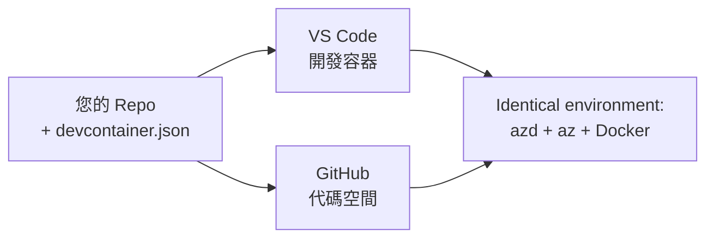

# azd 的開發容器與 GitHub Codespaces

**章節導覽：**
- **📚 課程首頁**: [AZD 初學者指南](../../README.md)
- **📖 本章節**: 第 1 章 - 基礎與快速開始
- **⬅️ 上一章**: [帶來你自己的應用程式](bring-your-own-app.md)
- **🚀 下一章**: [第 2 章：以 AI 為先的開發](../chapter-02-ai-development/README.md)

> 2026 年 7 月已使用 `azd 1.27.1` 進行驗證。

## 介紹

在每台機器上安裝 azd、正確的語言運行環境、Docker 與 Azure CLI 是件苦差事，而這也是「我的機器能執行」的教學無法在他人機器上成功的首要原因。<strong>開發容器</strong> 透過一個描述整個工具鏈的檔案解決這問題。任何人在 VS Code 或 GitHub Codespaces 中打開專案，都能獲得完全相同的環境，且內建 azd。本課程將示範如何新增開發容器。

## 學習目標

完成本課程後，您將能：
- 了解什麼是開發容器及其如何協助 azd
- 為專案新增最簡化的 `.devcontainer/devcontainer.json`
- 透過 Dev Container *features* 加入 azd、Azure CLI 與 Docker
- 在 GitHub Codespaces 或 VS Code 中開啟專案

## 學習成果

完成本課程後，您將能夠：
- 為 azd 專案撰寫 `devcontainer.json`
- 無須手動安裝即可加入 azd 與 Azure 工具
- 在容器或 Codespace 中執行 `azd up`

---

## 什麼是開發容器？

開發容器是以 Docker 為基礎的開發環境，由專案中的 `.devcontainer/devcontainer.json` 檔定義。當您開啟專案時：

- **VS Code**（搭配 Dev Containers 擴充套件）會建構容器並附加到它。
- **GitHub Codespaces** 會在雲端建構相同容器，並提供您以瀏覽器為基礎的編輯器。

兩種方式都能讓每位貢獻者擁有完全相同的工具，不再有「你有沒有安裝 azd？」的疑難排解問題。



---

## 第 1 步：建立 devcontainer 檔案

在您的專案根目錄建立 `.devcontainer/devcontainer.json`：

```json
{
  "name": "azd-project",
  "image": "mcr.microsoft.com/devcontainers/base:bookworm",
  "features": {
    "ghcr.io/devcontainers/features/azure-cli:1": {},
    "ghcr.io/azure/azure-dev/azd:latest": {},
    "ghcr.io/devcontainers/features/docker-in-docker:2": {},
    "ghcr.io/devcontainers/features/node:1": {}
  },
  "customizations": {
    "vscode": {
      "extensions": [
        "ms-azuretools.azure-dev",
        "ms-azuretools.vscode-bicep"
      ]
    }
  },
  "forwardPorts": [3000],
  "postCreateCommand": "azd version"
}
```

每個部分的作用：

| 鍵 | 目的 |
|-----|---------|
| `image` | 容器的基礎作業系統 |
| `features` | 預建安裝器—此處包含 Azure CLI、**azd**、Docker 以及 Node.js |
| `customizations.vscode.extensions` | 自動安裝 azd 與 Bicep 的 VS Code 擴充套件 |
| `forwardPorts` | 讓您的應用程式埠口暴露到瀏覽器 |
| `postCreateCommand` | 容器建構完成後執行一次（此處為檢查命令） |

> `ghcr.io/azure/azure-dev/azd:latest` feature 是在容器中取得 azd 的官方方式。如需可重現性，請指定特定版本（例如 `azd:1.27.1`）。

---

## 第 2 步：根據應用程式語言選擇 Feature

將 `node` feature 換成您的應用程式使用的語言：

```jsonc
// Python project
"ghcr.io/devcontainers/features/python:1": {},

// .NET project
"ghcr.io/devcontainers/features/dotnet:2": {},

// Java project
"ghcr.io/devcontainers/features/java:1": {},

// Go project
"ghcr.io/devcontainers/features/go:1": {}
```

如果您的 `host` 是 `containerapp`、`aks` 或任何建立容器映像的服務，請保留 `docker-in-docker`，azd 需要 Docker 來建構與推送映像。

---

## 第 3 步：開啟它

**在 VS Code 裡：**
1. 安裝 **Dev Containers** 擴充套件。
2. 開啟專案資料夾。
3. 在提示時點擊 <strong>重新開啟於容器中</strong>（或執行 *Dev Containers: Reopen in Container*）。

**在 GitHub Codespaces 裡：**
1. 將程式庫推送到 GitHub。
2. 點選 **Code → Codespaces → 在 main 建立 codespace**。
3. 等待容器建構完成—azd 已準備好於終端機中使用。

---

## 第 4 步：從容器內部署

容器內已預裝 azd，故一般工作流程可以直接進行：

```bash
azd auth login --use-device-code   # 裝置程式碼在 Codespaces 裡非常方便
azd up
```

> **為什麼用 `--use-device-code`？** 在遠端容器或 Codespace 中沒有本機瀏覽器可重定向，因此裝置碼登入是可靠方案。您會在瀏覽器分頁貼上代碼以完成登入。

---

## 常見陷阱

| 陷阱 | 解決方案 |
|---------|-----|
| `azd up` 無法建構映像 | 新增 `docker-in-docker` feature |
| Codespaces 中瀏覽器登入掛起 | 使用 `azd auth login --use-device-code` |
| 工具在團隊間版本不同 | 鎖定 feature 版本（例如 `azd:1.27.1`） |
| 瀏覽器無法連線應用程式 | 將埠口加入 `forwardPorts` |

---

## 總結

- 開發容器讓您的 azd 工具鏈能讓所有人重現。
- 透過 Dev Container *features* 加入 azd、Azure CLI 與 Docker。
- 根據應用程式語言選擇對應的 feature，且容器主機需保留 `docker-in-docker`。
- 在 Codespaces 裡執行時使用裝置碼登入。

---

## 🔗 導覽

| 方向 | 資源 |
|-----------|----------|
| <strong>上一章</strong> | [帶來你自己的應用程式](bring-your-own-app.md) |
| <strong>章節首頁</strong> | [第 1 章：基礎與快速開始](README.md) |
| <strong>下一章</strong> | [第 2 章：以 AI 為先的開發](../chapter-02-ai-development/README.md) |

## 📖 相關資源

- [安裝與設定](installation.md)
- [命令速查表](../../resources/cheat-sheet.md)
- [官方開發容器規範](https://containers.dev/)
- [azd 開發容器 feature](https://github.com/Azure/azure-dev/tree/main/ext/devcontainer)

---

<!-- CO-OP TRANSLATOR DISCLAIMER START -->
**免責聲明**：
本文件使用 AI 翻譯服務 [Co-op Translator](https://github.com/Azure/co-op-translator) 進行翻譯。雖然我們力求準確，但請注意，自動翻譯可能包含錯誤或不準確之處。原始文件的母語版本應被視為權威來源。對於重要資訊，建議尋求專業人工翻譯。我們不對因使用本翻譯而引起的任何誤解或曲解承擔責任。
<!-- CO-OP TRANSLATOR DISCLAIMER END -->