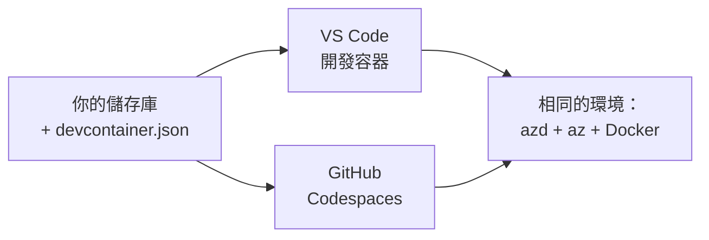

# Dev Containers 與 GitHub Codespaces（適用於 azd）

**Chapter Navigation:**
- **📚 課程首頁**: [AZD 初學者指南](../../README.md)
- **📖 目前章節**: 第 1 章 - 基礎與快速入門
- **⬅️ 上一頁**: [Bring Your Own App](bring-your-own-app.md)
- **🚀 下一章**: [第 2 章：AI 為先的開發](../chapter-02-ai-development/README.md)

> 已於 2026 年 6 月以 `azd 1.25.6` 驗證。

## 介紹

將 azd、正確的語言執行環境、Docker，以及 Azure CLI 安裝到每一部機器上相當麻煩──而且這也是一個「在我機器上可以運行」的教學對其他人失效的首要原因。開發容器（dev container）透過在一個檔案中描述整個工具鏈來解決這個問題。任何在 VS Code 或 GitHub Codespaces 中開啟專案的人都會得到完全相同的環境，且 azd 已經安裝完成。本課程示範如何新增一個。

## 學習目標

完成本課程後，你將能：
- 了解什麼是開發容器以及它如何協助 azd
- 將最小化的 `.devcontainer/devcontainer.json` 新增到專案中
- 透過 Dev Container 的 *features* 加入 azd、Azure CLI 與 Docker
- 在 GitHub Codespaces 或 VS Code 中開啟專案

## 學習成果

完成本課程後，你將能夠：
- 為 azd 專案撰寫 `devcontainer.json`
- 在不需手動安裝的情況下加入 azd 與 Azure 工具
- 在容器或 Codespace 內執行 `azd up`

---

## 什麼是開發容器？

開發容器是以 Docker 為基礎的開發環境，由專案存放庫中的 `.devcontainer/devcontainer.json` 檔案定義。當你開啟專案時：

- **VS Code**（搭配 Dev Containers 延伸套件）會建立容器並附加至容器。
- **GitHub Codespaces** 會在雲端建立相同的容器，並提供基於瀏覽器的編輯器。

無論哪一種，每位貢獻者都會擁有相同的工具—不再有「你有沒有安裝 azd？」的除錯問題。



---

## 第 1 步：建立 devcontainer 檔案

在專案根目錄建立 `.devcontainer/devcontainer.json`：

```json
{
  "name": "azd-project",
  "image": "mcr.microsoft.com/devcontainers/base:bookworm",
  "features": {
    "ghcr.io/devcontainers/features/azure-cli:1": {},
    "ghcr.io/azure/azure-dev/azd:latest": {},
    "ghcr.io/devcontainers/features/docker-in-docker:2": {},
    "ghcr.io/devcontainers/features/node:1": {}
  },
  "customizations": {
    "vscode": {
      "extensions": [
        "ms-azuretools.azure-dev",
        "ms-azuretools.vscode-bicep"
      ]
    }
  },
  "forwardPorts": [3000],
  "postCreateCommand": "azd version"
}
```

What each part does:

| 鍵 | 用途 |
|-----|---------|
| `image` | 容器的基礎作業系統 |
| `features` | 預先建立的安裝功能—此處：Azure CLI、**azd**, Docker, 和 Node.js |
| `customizations.vscode.extensions` | 自動安裝 azd 與 Bicep 的 VS Code 延伸套件 |
| `forwardPorts` | 將你的應用程式連接埠暴露到瀏覽器 |
| `postCreateCommand` | 容器建立後執行一次（此處為健全性檢查） |

> `ghcr.io/azure/azure-dev/azd:latest` feature 是在容器中取得 azd 的官方方式。若需要可重現性，請釘選特定版本（例如 `azd:1.25.6`）。

---

## 第 2 步：將 feature 與應用程式的語言對應

將 `node` feature 換成你的應用程式所使用的語言：

```jsonc
// Python project
"ghcr.io/devcontainers/features/python:1": {},

// .NET project
"ghcr.io/devcontainers/features/dotnet:2": {},

// Java project
"ghcr.io/devcontainers/features/java:1": {},

// Go project
"ghcr.io/devcontainers/features/go:1": {}
```

如果你的 `host` 是 `containerapp`、`aks`，或任何會建置容器映像的項目，請保留 `docker-in-docker`；azd 需要 Docker 來建置並推送映像。

---

## 第 3 步：開啟它

**在 VS Code 中：**
1. 安裝 **Dev Containers** 延伸套件。
2. 開啟專案資料夾。
3. 當出現提示時點選 **Reopen in Container**（或執行 *Dev Containers: Reopen in Container*）。

**在 GitHub Codespaces：**
1. 將儲存庫推送到 GitHub。
2. 點選 **Code → Codespaces → Create codespace on main**。
3. 等待容器建立—azd 會在終端機中已就緒。

---

## 第 4 步：從容器內部署

容器已預先安裝 azd，所以一般工作流程即可正常運作：

```bash
azd auth login --use-device-code   # 在 Codespaces 內，裝置代碼很方便
azd up
```

> **為什麼使用 `--use-device-code`？** 在遠端容器或 Codespace 中沒有本機瀏覽器可以重導向，因此以 device-code 進行登入是可靠的方式。你會將代碼貼到瀏覽器分頁以完成登入。

---

## 常見陷阱

| 問題 | 修正方法 |
|---------|-----|
| `azd up` can't build an image | Add the `docker-in-docker` feature |
| Browser login hangs in Codespaces | Use `azd auth login --use-device-code` |
| Tools differ between teammates | Pin feature versions (e.g. `azd:1.25.6`) |
| App not reachable in browser | Add the port to `forwardPorts` |

---

## 總結

- 開發容器讓每個人的 azd 工具鏈具可重現性。
- 透過 Dev Container 的 *features* 加入 azd、Azure CLI 與 Docker。
- 將語言的 feature 與你的應用程式對應，且對於容器主機請保留 `docker-in-docker`。
- 在 Codespaces 中執行時使用 device-code 登入。

---

## 🔗 導覽

| 方向 | 資源 |
|-----------|----------|
| <strong>上一章</strong> | [Bring Your Own App](bring-your-own-app.md) |
| <strong>章節首頁</strong> | [第 1 章 - 基礎與快速入門](README.md) |
| <strong>下一章</strong> | [第 2 章：AI 為先的開發](../chapter-02-ai-development/README.md) |

## 📖 相關資源

- [安裝與設定](installation.md)
- [命令速查表](../../resources/cheat-sheet.md)
- [官方 Dev Containers 規格](https://containers.dev/)
- [azd Dev Container 功能](https://github.com/Azure/azure-dev/tree/main/ext/devcontainer)

---

<!-- CO-OP TRANSLATOR DISCLAIMER START -->
**免責聲明**：
本文件使用 AI 翻譯服務 [Co-op Translator](https://github.com/Azure/co-op-translator) 進行翻譯。雖然我們力求準確，但請注意，自動翻譯可能包含錯誤或不準確之處。原始文件的母語版本應被視為權威來源。對於重要資訊，建議尋求專業人工翻譯。我們不對因使用本翻譯而引起的任何誤解或曲解承擔責任。
<!-- CO-OP TRANSLATOR DISCLAIMER END -->